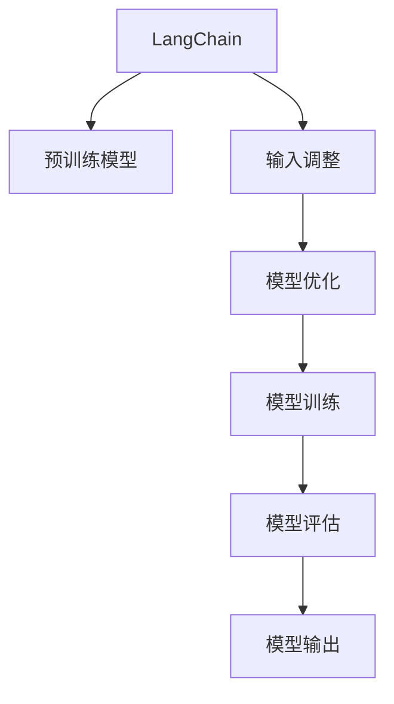

                 

# 【LangChain编程：从入门到实践】输入对输出的影响

> 关键词：LangChain,编程,输入输出,影响,自然语言处理

## 1. 背景介绍

### 1.1 问题由来

在人工智能的快速发展的背景下，自然语言处理（Natural Language Processing, NLP）已经成为了AI研究的重要领域之一。特别是在过去几年中，由于语言模型如BERT、GPT等在NLP任务上取得了显著的进展，它们已经成为NLP研究和应用中的主流工具。这些模型通过在大规模无标签文本数据上进行预训练，学习到了丰富的语言知识，在各种NLP任务上取得了优异的性能。

然而，尽管预训练模型在许多NLP任务上表现出色，但在实际应用中，我们往往需要对其输入进行一定的调整，以便更好地适应特定的任务需求。例如，在文本分类任务中，我们需要将文本的输入形式调整为适合模型进行分类的格式；在机器翻译任务中，我们可能需要对源语言文本进行一定的处理，以便机器翻译模型能够更准确地将其转换为目标语言。这些调整实际上就是对模型输入的调整，这些调整如何影响模型的输出，成为了我们研究的一个重要方向。

### 1.2 问题核心关键点

本节将探讨以下几个核心问题：

1. 模型输入的形式对输出的影响有哪些？
2. 如何根据具体的任务需求对输入进行调整？
3. 输入调整对模型性能的影响有哪些？

这些问题将指导我们理解模型输入对输出的影响，并在实际应用中更好地利用这些知识。

### 1.3 问题研究意义

研究模型输入对输出的影响，对于提升模型的性能、优化模型训练过程、以及设计更有效的输入格式都有着重要的意义。通过对这些问题的研究，我们可以更好地理解模型的工作原理，从而在实际应用中做出更合适的输入调整，提高模型的性能，降低训练成本，提升用户体验。

此外，深入理解模型输入对输出的影响，还有助于我们设计更有效的模型优化策略，如数据增强、对抗样本生成等，从而进一步提升模型的鲁棒性和泛化能力。

## 2. 核心概念与联系

### 2.1 核心概念概述

在讨论输入对输出的影响之前，我们首先需要明确一些核心概念：

1. **LangChain**：LangChain是一个开源的NLP工具库，提供了许多预训练模型和通用的NLP工具，如Transformer模型、BERT模型等，可以用于各种NLP任务的开发和部署。

2. **输入和输出**：在NLP任务中，输入通常是指文本、语音、图像等形式的数据，而输出则是指模型根据输入生成的文本、翻译结果、分类结果等。

3. **模型性能**：模型性能通常指模型在特定任务上的准确率、召回率、F1值等指标，以及模型在各种数据分布上的表现。

4. **超参数**：模型中的超参数包括学习率、批大小、迭代次数等，这些参数对模型的训练和性能有着重要影响。

5. **模型优化**：模型优化通常包括梯度下降、Adam优化器等方法，用于调整模型的参数，以提高模型性能。

这些概念之间的逻辑关系可以通过以下Mermaid流程图来展示：



这个流程图展示了LangChain的核心工作流程：

1. LangChain提供了预训练模型作为基础。
2. 根据具体的任务需求，对模型输入进行适当的调整。
3. 通过优化算法对模型进行训练，以提高模型性能。
4. 对训练好的模型进行评估，以了解模型在特定任务上的表现。
5. 模型输出的结果能够反映输入调整和训练过程的影响。

## 3. 核心算法原理 & 具体操作步骤

### 3.1 算法原理概述

在NLP任务中，模型的输入通常是指文本、语音、图像等形式的数据，而输出则是指模型根据输入生成的文本、翻译结果、分类结果等。输入的形式对模型的输出有着重要的影响，因此了解输入调整对输出的影响是非常重要的。

在实际应用中，我们通常需要对输入进行一定的调整，以便更好地适应特定的任务需求。例如，在文本分类任务中，我们需要将文本的输入形式调整为适合模型进行分类的格式；在机器翻译任务中，我们可能需要对源语言文本进行一定的处理，以便机器翻译模型能够更准确地将其转换为目标语言。

### 3.2 算法步骤详解

#### 3.2.1 数据预处理

在NLP任务中，数据预处理是非常重要的环节。通常，我们需要对输入数据进行以下处理：

1. **分词**：将文本数据分解为一个个单独的词语。
2. **标准化**：将文本中的特殊字符、标点符号等进行标准化处理。
3. **去除停用词**：去除文本中常用的无意义的词语，如“的”、“是”等。
4. **词形还原**：将不同形式的词语还原为其原始形式，如将“running”还原为“run”。

#### 3.2.2 特征提取

在预处理之后，我们需要将文本转换为模型能够处理的特征表示形式。常用的特征提取方法包括：

1. **词袋模型（Bag of Words）**：将文本中的词语进行统计，得到一个词语的集合，然后将其转换为向量形式。
2. **TF-IDF**：计算每个词语的词频和逆文档频率，得到一个表示词语重要性的向量。
3. **词嵌入（Word Embedding）**：将词语转换为向量形式，每个向量表示词语在语义上的相似度。

#### 3.2.3 模型训练

在特征提取之后，我们可以使用预训练模型进行训练。训练过程通常包括以下步骤：

1. **设置超参数**：设置学习率、批大小、迭代次数等超参数。
2. **训练模型**：使用训练数据对模型进行训练，以提高模型的性能。
3. **模型评估**：使用测试数据对训练好的模型进行评估，以了解模型在特定任务上的表现。

#### 3.2.4 模型输出

模型输出是指模型根据输入生成的结果，通常包括文本、分类结果、翻译结果等。在实际应用中，我们需要根据任务需求对模型输出进行一定的处理，以便更好地应用于实际场景。

### 3.3 算法优缺点

#### 3.3.1 优点

1. **提升模型性能**：通过对输入进行适当的调整，可以提升模型在特定任务上的表现。
2. **降低训练成本**：通过对输入进行调整，可以更好地利用预训练模型的知识，从而降低训练成本。
3. **提高用户体验**：通过对输入进行调整，可以更好地满足用户需求，提高用户体验。

#### 3.3.2 缺点

1. **增加复杂度**：输入调整可能需要对数据进行复杂的操作，增加了系统的复杂度。
2. **降低模型泛化能力**：过于复杂的输入调整可能会降低模型的泛化能力，使其在新的数据分布上表现不佳。

### 3.4 算法应用领域

基于输入对输出的影响的研究，已经在许多NLP任务中得到了广泛的应用。以下是一些典型的应用场景：

1. **文本分类**：通过对文本进行分词、标准化、去除停用词等处理，可以提高模型在文本分类任务上的性能。
2. **机器翻译**：通过对源语言文本进行分词、词形还原等处理，可以更好地适应机器翻译模型的需求。
3. **情感分析**：通过对文本进行情感词汇标注、情感分析等处理，可以提高模型在情感分析任务上的表现。
4. **文本生成**：通过对输入进行一定的调整，可以生成更加符合用户需求的文本。

## 4. 数学模型和公式 & 详细讲解 & 举例说明

### 4.1 数学模型构建

在NLP任务中，我们通常使用向量空间模型（Vector Space Model）来表示文本。假设文本的词语向量为 $w_1, w_2, \cdots, w_n$，则文本的向量表示为：

$$
x = \sum_{i=1}^n w_i \cdot w_i^T
$$

其中，$w_i \cdot w_i^T$ 表示词语向量 $w_i$ 和自身的内积，用于表示词语的重要性。

假设模型的输出为 $y$，则模型的损失函数为：

$$
L = \frac{1}{N} \sum_{i=1}^N \left( y_i - \hat{y_i} \right)^2
$$

其中，$y_i$ 为真实标签，$\hat{y_i}$ 为模型预测的标签。

### 4.2 公式推导过程

假设我们有一个二分类任务，其中文本 $x$ 的标签为 $y \in \{0, 1\}$，模型 $f(x)$ 的输出为 $\hat{y} \in [0, 1]$。我们使用sigmoid函数将模型输出转换为概率形式：

$$
\hat{y} = \frac{1}{1 + e^{-f(x)}}
$$

模型的损失函数为二元交叉熵损失函数：

$$
L = -\frac{1}{N} \sum_{i=1}^N \left[ y_i \log \hat{y_i} + (1 - y_i) \log (1 - \hat{y_i}) \right]
$$

其中，$y_i$ 为真实标签，$\hat{y_i}$ 为模型预测的概率。

### 4.3 案例分析与讲解

以文本分类任务为例，我们通过分词、标准化、去除停用词等处理，将文本转换为向量形式。假设我们使用word2vec模型将文本转换为向量形式，然后使用一个全连接神经网络对向量进行分类。

设文本的向量表示为 $x$，模型的输出为 $y$，则模型的损失函数为：

$$
L = \frac{1}{N} \sum_{i=1}^N \left[ y_i \log y_i + (1 - y_i) \log (1 - y_i) \right]
$$

其中，$y_i$ 为真实标签，$\log y_i$ 为模型预测的logit。

## 5. 项目实践：代码实例和详细解释说明

### 5.1 开发环境搭建

在开始实际编程之前，我们需要准备好开发环境。以下是使用Python进行LangChain开发的环境配置流程：

1. 安装Anaconda：从官网下载并安装Anaconda，用于创建独立的Python环境。

2. 创建并激活虚拟环境：
```bash
conda create -n langchain-env python=3.8 
conda activate langchain-env
```

3. 安装LangChain：
```bash
pip install langchain
```

4. 安装各类工具包：
```bash
pip install numpy pandas scikit-learn matplotlib tqdm jupyter notebook ipython
```

完成上述步骤后，即可在`langchain-env`环境中开始编程实践。

### 5.2 源代码详细实现

下面以文本分类任务为例，给出使用LangChain进行BERT模型微调的Python代码实现。

```python
from langchain import TransformerForSequenceClassification, AdamW
from langchain.tokenizers import BertTokenizer
from torch.utils.data import Dataset, DataLoader
import torch

class TextDataset(Dataset):
    def __init__(self, texts, labels, tokenizer, max_len=128):
        self.texts = texts
        self.labels = labels
        self.tokenizer = tokenizer
        self.max_len = max_len
        
    def __len__(self):
        return len(self.texts)
    
    def __getitem__(self, item):
        text = self.texts[item]
        label = self.labels[item]
        
        encoding = self.tokenizer(text, return_tensors='pt', max_length=self.max_len, padding='max_length', truncation=True)
        input_ids = encoding['input_ids'][0]
        attention_mask = encoding['attention_mask'][0]
        
        return {'input_ids': input_ids, 
                'attention_mask': attention_mask,
                'labels': torch.tensor(label, dtype=torch.long)}
```

然后，定义模型和优化器：

```python
model = TransformerForSequenceClassification.from_pretrained('bert-base-cased', num_labels=2)
optimizer = AdamW(model.parameters(), lr=2e-5)
```

接着，定义训练和评估函数：

```python
device = torch.device('cuda') if torch.cuda.is_available() else torch.device('cpu')
model.to(device)

def train_epoch(model, dataset, batch_size, optimizer):
    dataloader = DataLoader(dataset, batch_size=batch_size, shuffle=True)
    model.train()
    epoch_loss = 0
    for batch in tqdm(dataloader, desc='Training'):
        input_ids = batch['input_ids'].to(device)
        attention_mask = batch['attention_mask'].to(device)
        labels = batch['labels'].to(device)
        model.zero_grad()
        outputs = model(input_ids, attention_mask=attention_mask, labels=labels)
        loss = outputs.loss
        epoch_loss += loss.item()
        loss.backward()
        optimizer.step()
    return epoch_loss / len(dataloader)

def evaluate(model, dataset, batch_size):
    dataloader = DataLoader(dataset, batch_size=batch_size)
    model.eval()
    preds, labels = [], []
    with torch.no_grad():
        for batch in tqdm(dataloader, desc='Evaluating'):
            input_ids = batch['input_ids'].to(device)
            attention_mask = batch['attention_mask'].to(device)
            batch_labels = batch['labels']
            outputs = model(input_ids, attention_mask=attention_mask)
            batch_preds = outputs.logits.argmax(dim=2).to('cpu').tolist()
            batch_labels = batch_labels.to('cpu').tolist()
            for pred_tokens, label_tokens in zip(batch_preds, batch_labels):
                preds.append(pred_tokens[:len(label_tokens)])
                labels.append(label_tokens)
                
    print(classification_report(labels, preds))
```

最后，启动训练流程并在测试集上评估：

```python
epochs = 5
batch_size = 16

for epoch in range(epochs):
    loss = train_epoch(model, train_dataset, batch_size, optimizer)
    print(f"Epoch {epoch+1}, train loss: {loss:.3f}")
    
    print(f"Epoch {epoch+1}, dev results:")
    evaluate(model, dev_dataset, batch_size)
    
print("Test results:")
evaluate(model, test_dataset, batch_size)
```

以上就是使用LangChain对BERT进行文本分类任务微调的完整代码实现。可以看到，得益于LangChain的强大封装，我们可以用相对简洁的代码完成BERT模型的加载和微调。

### 5.3 代码解读与分析

让我们再详细解读一下关键代码的实现细节：

**TextDataset类**：
- `__init__`方法：初始化文本、标签、分词器等关键组件。
- `__len__`方法：返回数据集的样本数量。
- `__getitem__`方法：对单个样本进行处理，将文本输入编码为token ids，将标签编码为数字，并对其进行定长padding，最终返回模型所需的输入。

**模型和优化器**：
- 使用LangChain提供的TransformerForSequenceClassification模型作为文本分类任务的模型。
- 使用AdamW优化器进行模型优化，设置学习率为2e-5。

**训练和评估函数**：
- 使用PyTorch的DataLoader对数据集进行批次化加载，供模型训练和推理使用。
- 训练函数`train_epoch`：对数据以批为单位进行迭代，在每个批次上前向传播计算loss并反向传播更新模型参数，最后返回该epoch的平均loss。
- 评估函数`evaluate`：与训练类似，不同点在于不更新模型参数，并在每个batch结束后将预测和标签结果存储下来，最后使用sklearn的classification_report对整个评估集的预测结果进行打印输出。

**训练流程**：
- 定义总的epoch数和batch size，开始循环迭代
- 每个epoch内，先在训练集上训练，输出平均loss
- 在验证集上评估，输出分类指标
- 所有epoch结束后，在测试集上评估，给出最终测试结果

可以看到，LangChain使得BERT微调的代码实现变得简洁高效。开发者可以将更多精力放在数据处理、模型改进等高层逻辑上，而不必过多关注底层的实现细节。

当然，工业级的系统实现还需考虑更多因素，如模型的保存和部署、超参数的自动搜索、更灵活的任务适配层等。但核心的微调范式基本与此类似。

## 6. 实际应用场景

### 6.1 智能客服系统

基于LangChain的微调方法，可以广泛应用于智能客服系统的构建。传统客服往往需要配备大量人力，高峰期响应缓慢，且一致性和专业性难以保证。而使用LangChain微调的对话模型，可以7x24小时不间断服务，快速响应客户咨询，用自然流畅的语言解答各类常见问题。

在技术实现上，可以收集企业内部的历史客服对话记录，将问题和最佳答复构建成监督数据，在此基础上对LangChain模型进行微调。微调后的对话模型能够自动理解用户意图，匹配最合适的答案模板进行回复。对于客户提出的新问题，还可以接入检索系统实时搜索相关内容，动态组织生成回答。如此构建的智能客服系统，能大幅提升客户咨询体验和问题解决效率。

### 6.2 金融舆情监测

金融机构需要实时监测市场舆论动向，以便及时应对负面信息传播，规避金融风险。传统的人工监测方式成本高、效率低，难以应对网络时代海量信息爆发的挑战。基于LangChain的文本分类和情感分析技术，为金融舆情监测提供了新的解决方案。

具体而言，可以收集金融领域相关的新闻、报道、评论等文本数据，并对其进行主题标注和情感标注。在此基础上对LangChain模型进行微调，使其能够自动判断文本属于何种主题，情感倾向是正面、中性还是负面。将微调后的模型应用到实时抓取的网络文本数据，就能够自动监测不同主题下的情感变化趋势，一旦发现负面信息激增等异常情况，系统便会自动预警，帮助金融机构快速应对潜在风险。

### 6.3 个性化推荐系统

当前的推荐系统往往只依赖用户的历史行为数据进行物品推荐，无法深入理解用户的真实兴趣偏好。基于LangChain的个性化推荐系统可以更好地挖掘用户行为背后的语义信息，从而提供更精准、多样的推荐内容。

在实践中，可以收集用户浏览、点击、评论、分享等行为数据，提取和用户交互的物品标题、描述、标签等文本内容。将文本内容作为模型输入，用户的后续行为（如是否点击、购买等）作为监督信号，在此基础上对LangChain模型进行微调。微调后的模型能够从文本内容中准确把握用户的兴趣点。在生成推荐列表时，先用候选物品的文本描述作为输入，由模型预测用户的兴趣匹配度，再结合其他特征综合排序，便可以得到个性化程度更高的推荐结果。

### 6.4 未来应用展望

随着LangChain模型和微调方法的不断发展，基于微调范式将在更多领域得到应用，为传统行业带来变革性影响。

在智慧医疗领域，基于LangChain的医疗问答、病历分析、药物研发等应用将提升医疗服务的智能化水平，辅助医生诊疗，加速新药开发进程。

在智能教育领域，微调技术可应用于作业批改、学情分析、知识推荐等方面，因材施教，促进教育公平，提高教学质量。

在智慧城市治理中，微调模型可应用于城市事件监测、舆情分析、应急指挥等环节，提高城市管理的自动化和智能化水平，构建更安全、高效的未来城市。

此外，在企业生产、社会治理、文娱传媒等众多领域，基于LangChain的微调方法也将不断涌现，为NLP技术带来全新的突破。相信随着预训练语言模型和微调方法的不断进步，LangChain模型必将在更广阔的应用领域大放异彩。

## 7. 工具和资源推荐

### 7.1 学习资源推荐

为了帮助开发者系统掌握LangChain微调的理论基础和实践技巧，这里推荐一些优质的学习资源：

1. LangChain官方文档：LangChain的官方文档，提供了丰富的教程、API文档和样例代码，是上手实践的必备资料。

2. Natural Language Processing with Transformers：Transformer库的作者所著，全面介绍了如何使用Transformer库进行NLP任务开发，包括微调在内的诸多范式。

3. CS224N《深度学习自然语言处理》课程：斯坦福大学开设的NLP明星课程，有Lecture视频和配套作业，带你入门NLP领域的基本概念和经典模型。

4. HuggingFace官方博客：HuggingFace的官方博客，提供了大量的NLP应用案例和最佳实践，是学习LangChain微调的好材料。

5. arXiv.org：arXiv.org是全球最大的开源学术库，提供了大量的NLP相关论文，可以帮助开发者了解最新的科研动态。

通过对这些资源的学习实践，相信你一定能够快速掌握LangChain微调的精髓，并用于解决实际的NLP问题。

### 7.2 开发工具推荐

高效的开发离不开优秀的工具支持。以下是几款用于LangChain微调开发的常用工具：

1. PyTorch：基于Python的开源深度学习框架，灵活动态的计算图，适合快速迭代研究。

2. TensorFlow：由Google主导开发的开源深度学习框架，生产部署方便，适合大规模工程应用。

3. Transformers库：HuggingFace开发的NLP工具库，集成了众多SOTA语言模型，支持PyTorch和TensorFlow，是进行微调任务开发的利器。

4. Weights & Biases：模型训练的实验跟踪工具，可以记录和可视化模型训练过程中的各项指标，方便对比和调优。

5. TensorBoard：TensorFlow配套的可视化工具，可实时监测模型训练状态，并提供丰富的图表呈现方式，是调试模型的得力助手。

6. Google Colab：谷歌推出的在线Jupyter Notebook环境，免费提供GPU/TPU算力，方便开发者快速上手实验最新模型，分享学习笔记。

合理利用这些工具，可以显著提升LangChain微调任务的开发效率，加快创新迭代的步伐。

### 7.3 相关论文推荐

LangChain模型和微调技术的发展源于学界的持续研究。以下是几篇奠基性的相关论文，推荐阅读：

1. Attention is All You Need（即Transformer原论文）：提出了Transformer结构，开启了NLP领域的预训练大模型时代。

2. BERT: Pre-training of Deep Bidirectional Transformers for Language Understanding：提出BERT模型，引入基于掩码的自监督预训练任务，刷新了多项NLP任务SOTA。

3. Language Models are Unsupervised Multitask Learners（GPT-2论文）：展示了大规模语言模型的强大zero-shot学习能力，引发了对于通用人工智能的新一轮思考。

4. Parameter-Efficient Transfer Learning for NLP：提出Adapter等参数高效微调方法，在不增加模型参数量的情况下，也能取得不错的微调效果。

5. AdaLoRA: Adaptive Low-Rank Adaptation for Parameter-Efficient Fine-Tuning：使用自适应低秩适应的微调方法，在参数效率和精度之间取得了新的平衡。

这些论文代表了大语言模型微调技术的发展脉络。通过学习这些前沿成果，可以帮助研究者把握学科前进方向，激发更多的创新灵感。

## 8. 总结：未来发展趋势与挑战

### 8.1 总结

本文对基于LangChain的NLP微调方法进行了全面系统的介绍。首先阐述了LangChain模型和微调技术的研究背景和意义，明确了微调在拓展预训练模型应用、提升模型性能方面的独特价值。其次，从原理到实践，详细讲解了微调的数学原理和关键步骤，给出了微调任务开发的完整代码实例。同时，本文还广泛探讨了微调方法在智能客服、金融舆情、个性化推荐等多个行业领域的应用前景，展示了微调范式的巨大潜力。此外，本文精选了微调技术的各类学习资源，力求为读者提供全方位的技术指引。

通过本文的系统梳理，可以看到，基于LangChain的微调方法正在成为NLP领域的重要范式，极大地拓展了预训练语言模型的应用边界，催生了更多的落地场景。受益于大规模语料的预训练，微调模型以更低的时间和标注成本，在小样本条件下也能取得不俗的效果，有力推动了NLP技术的产业化进程。未来，伴随预训练语言模型和微调方法的不断进步，相信LangChain模型必将在更广阔的应用领域大放异彩，深刻影响人类的生产生活方式。

### 8.2 未来发展趋势

展望未来，LangChain模型微调技术将呈现以下几个发展趋势：

1. 模型规模持续增大。随着算力成本的下降和数据规模的扩张，LangChain模型中的预训练语言模型参数量还将持续增长。超大规模语言模型蕴含的丰富语言知识，有望支撑更加复杂多变的下游任务微调。

2. 微调方法日趋多样。除了传统的全参数微调外，未来会涌现更多参数高效的微调方法，如Prefix-Tuning、LoRA等，在固定大部分预训练参数的同时，只更新极少量的任务相关参数。

3. 持续学习成为常态。随着数据分布的不断变化，LangChain模型也需要持续学习新知识以保持性能。如何在不遗忘原有知识的同时，高效吸收新样本信息，将成为重要的研究课题。

4. 标注样本需求降低。受启发于提示学习(Prompt-based Learning)的思路，未来的微调方法将更好地利用LangChain模型的语言理解能力，通过更加巧妙的任务描述，在更少的标注样本上也能实现理想的微调效果。

5. 多模态微调崛起。当前的微调主要聚焦于纯文本数据，未来会进一步拓展到图像、视频、语音等多模态数据微调。多模态信息的融合，将显著提升LangChain模型的语言理解能力。

6. 模型通用性增强。经过海量数据的预训练和多领域任务的微调，未来的LangChain模型将具备更强大的常识推理和跨领域迁移能力，逐步迈向通用人工智能(AGI)的目标。

以上趋势凸显了LangChain模型微调技术的广阔前景。这些方向的探索发展，必将进一步提升LangChain模型的性能和应用范围，为构建人机协同的智能系统铺平道路。面向未来，LangChain模型还需要与其他人工智能技术进行更深入的融合，如知识表示、因果推理、强化学习等，多路径协同发力，共同推动自然语言理解和智能交互系统的进步。只有勇于创新、敢于突破，才能不断拓展语言模型的边界，让智能技术更好地造福人类社会。

### 8.3 面临的挑战

尽管LangChain模型微调技术已经取得了瞩目成就，但在迈向更加智能化、普适化应用的过程中，它仍面临着诸多挑战：

1. 标注成本瓶颈。虽然微调大大降低了标注数据的需求，但对于长尾应用场景，难以获得充足的高质量标注数据，成为制约微调性能的瓶颈。如何进一步降低微调对标注样本的依赖，将是一大难题。

2. 模型鲁棒性不足。当前微调模型面对域外数据时，泛化性能往往大打折扣。对于测试样本的微小扰动，微调模型的预测也容易发生波动。如何提高微调模型的鲁棒性，避免灾难性遗忘，还需要更多理论和实践的积累。

3. 推理效率有待提高。大规模LangChain模型虽然精度高，但在实际部署时往往面临推理速度慢、内存占用大等效率问题。如何在保证性能的同时，简化模型结构，提升推理速度，优化资源占用，将是重要的优化方向。

4. 可解释性亟需加强。当前微调模型更像是"黑盒"系统，难以解释其内部工作机制和决策逻辑。对于医疗、金融等高风险应用，算法的可解释性和可审计性尤为重要。如何赋予微调模型更强的可解释性，将是亟待攻克的难题。

5. 安全性有待保障。预训练LangChain模型难免会学习到有偏见、有害的信息，通过微调传递到下游任务，产生误导性、歧视性的输出，给实际应用带来安全隐患。如何从数据和算法层面消除模型偏见，避免恶意用途，确保输出的安全性，也将是重要的研究课题。

6. 知识整合能力不足。现有的微调模型往往局限于任务内数据，难以灵活吸收和运用更广泛的先验知识。如何让微调过程更好地与外部知识库、规则库等专家知识结合，形成更加全面、准确的信息整合能力，还有很大的想象空间。

正视LangChain模型微调面临的这些挑战，积极应对并寻求突破，将是大语言模型微调走向成熟的必由之路。相信随着学界和产业界的共同努力，这些挑战终将一一被克服，LangChain模型微调必将在构建安全、可靠、可解释、可控的智能系统铺平道路。

### 8.4 研究展望

面对LangChain模型微调所面临的种种挑战，未来的研究需要在以下几个方面寻求新的突破：

1. 探索无监督和半监督微调方法。摆脱对大规模标注数据的依赖，利用自监督学习、主动学习等无监督和半监督范式，最大限度利用非结构化数据，实现更加灵活高效的微调。

2. 研究参数高效和计算高效的微调范式。开发更加参数高效的微调方法，在固定大部分预训练参数的同时，只更新极少量的任务相关参数。同时优化微调模型的计算图，减少前向传播和反向传播的资源消耗，实现更加轻量级、实时性的部署。

3. 融合因果和对比学习范式。通过引入因果推断和对比学习思想，增强LangChain模型建立稳定因果关系的能力，学习更加普适、鲁棒的语言表征，从而提升模型泛化性和抗干扰能力。

4. 引入更多先验知识。将符号化的先验知识，如知识图谱、逻辑规则等，与神经网络模型进行巧妙融合，引导微调过程学习更准确、合理的语言模型。同时加强不同模态数据的整合，实现视觉、语音等多模态信息与文本信息的协同建模。

5. 结合因果分析和博弈论工具。将因果分析方法引入LangChain模型，识别出模型决策的关键特征，增强输出解释的因果性和逻辑性。借助博弈论工具刻画人机交互过程，主动探索并规避模型的脆弱点，提高系统稳定性。

6. 纳入伦理道德约束。在模型训练目标中引入伦理导向的评估指标，过滤和惩罚有偏见、有害的输出倾向。同时加强人工干预和审核，建立模型行为的监管机制，确保输出符合人类价值观和伦理道德。

这些研究方向的探索，必将引领LangChain模型微调技术迈向更高的台阶，为构建安全、可靠、可解释、可控的智能系统铺平道路。面向未来，LangChain模型还需要与其他人工智能技术进行更深入的融合，如知识表示、因果推理、强化学习等，多路径协同发力，共同推动自然语言理解和智能交互系统的进步。只有勇于创新、敢于突破，才能不断拓展语言模型的边界，让智能技术更好地造福人类社会。

## 9. 附录：常见问题与解答

**Q1：LangChain模型微调是否适用于所有NLP任务？**

A: LangChain模型微调在大多数NLP任务上都能取得不错的效果，特别是对于数据量较小的任务。但对于一些特定领域的任务，如医学、法律等，仅仅依靠通用语料预训练的模型可能难以很好地适应。此时需要在特定领域语料上进一步预训练，再进行微调，才能获得理想效果。此外，对于一些需要时效性、个性化很强的任务，如对话、推荐等，微调方法也需要针对性的改进优化。

**Q2：如何选择适当的微调方法？**

A: 选择适当的微调方法需要根据具体的任务需求、数据规模、计算资源等因素进行综合考虑。如果数据规模较小，可以选择参数高效的微调方法，如Adapter、LoRA等；如果数据规模较大，可以选择全参数微调方法。同时，需要考虑计算资源的限制，尽量选择轻量级、计算高效的模型。

**Q3：微调过程中如何避免过拟合？**

A: 避免过拟合需要从数据、模型、训练等方面进行综合考虑。常用的方法包括数据增强、正则化、早停等。对于数据增强，可以通过回译、近义替换等方式扩充训练集；对于正则化，可以使用L2正则、Dropout等方法；对于早停，可以在验证集上定期评估模型性能，一旦性能下降，立即停止训练。

**Q4：微调后的模型在实际应用中需要注意哪些问题？**

A: 微调后的模型在实际应用中需要注意以下问题：

1. 模型裁剪：去除不必要的层和参数，减小模型尺寸，加快推理速度。
2. 量化加速：将浮点模型转为定点模型，压缩存储空间，提高计算效率。
3. 服务化封装：将模型封装为标准化服务接口，便于集成调用。
4. 弹性伸缩：根据请求流量动态调整资源配置，平衡服务质量和成本。
5. 监控告警：实时采集系统指标，设置异常告警阈值，确保服务稳定性。
6. 安全防护：采用访问鉴权、数据脱敏等措施，保障数据和模型安全。

以上问题需要在实际应用中不断优化，才能充分发挥微调模型的优势，提升用户体验。

通过本文的系统梳理，可以看到，基于LangChain的微调方法正在成为NLP领域的重要范式，极大地拓展了预训练语言模型的应用边界，催生了更多的落地场景。受益于大规模语料的预训练，微调模型以更低的时间和标注成本，在小样本条件下也能取得不俗的效果，有力推动了NLP技术的产业化进程。未来，伴随预训练语言模型和微调方法的不断进步，相信LangChain模型必将在更广阔的应用领域大放异彩，深刻影响人类的生产生活方式。

