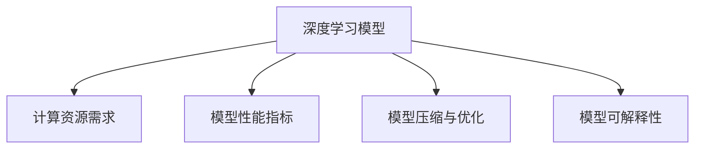

                 

## 1. 背景介绍

在AI Agent的开发过程中，选择合适的模型结构是一个至关重要的步骤，它直接决定了计算资源的需求、模型的性能以及实际部署的可行性。模型的规模越大，需要的计算资源也就越多，但同时，它也有更大的潜力来获得更好的性能和应用效果。然而，过大的模型规模也会导致计算成本的增加，特别是在模型训练和推理阶段。因此，模型的选择和优化对于AI Agent的开发至关重要。

### 1.1 问题由来

在AI Agent的开发过程中，选择合适的模型结构是一个复杂且关键的步骤，它直接影响到模型的性能、计算资源需求和实际部署的可行性。模型的规模越大，需要的计算资源也就越多，但同时，它也有更大的潜力来获得更好的性能和应用效果。然而，过大的模型规模也会导致计算成本的增加，特别是在模型训练和推理阶段。因此，模型的选择和优化对于AI Agent的开发至关重要。

### 1.2 问题核心关键点

1. **计算资源与模型规模**：模型的计算需求与其规模成正比，模型的规模越大，需要的计算资源也越多。然而，更大的模型规模并不总是意味着更好的性能。
2. **模型性能与复杂度**：模型的性能与其复杂度相关，更复杂的模型通常能获得更好的性能，但也需要更多的计算资源。
3. **模型压缩与优化**：为了降低计算成本，模型压缩和优化是必要的，它们可以在不损失过多性能的前提下，显著减小模型的规模。
4. **模型可解释性**：复杂模型在提升性能的同时，也增加了模型的不可解释性，这在某些应用场景中是不可接受的。

### 1.3 问题研究意义

选择合适的模型结构对于AI Agent的开发至关重要，它不仅影响模型的性能和计算资源需求，还关系到模型的实际部署和应用效果。通过合理的模型选择和优化，可以显著提高AI Agent的开发效率和性能，降低计算成本，促进AI Agent在各个领域的广泛应用。

## 2. 核心概念与联系

### 2.1 核心概念概述

为更好地理解模型选择和优化的方法，本节将介绍几个密切相关的核心概念：

- **深度学习模型**：如神经网络、卷积神经网络（CNN）、循环神经网络（RNN）、变分自编码器（VAE）等。
- **计算资源需求**：模型的计算需求包括内存、CPU/GPU等计算资源的消耗。
- **模型性能指标**：如准确率、精度、召回率、F1值等。
- **模型压缩与优化**：如剪枝、量化、模型蒸馏等技术。
- **模型可解释性**：模型的可解释性是指其决策过程是否易于理解和解释。

这些核心概念之间的逻辑关系可以通过以下Mermaid流程图来展示：



这个流程图展示了几大核心概念之间的逻辑关系：

1. 深度学习模型通过计算资源需求来衡量其实际的计算能力。
2. 模型性能指标反映模型的性能表现。
3. 模型压缩与优化技术旨在减小模型规模，降低计算资源需求。
4. 模型可解释性决定了模型在实际应用中的接受程度。

## 3. 核心算法原理 & 具体操作步骤

### 3.1 算法原理概述

选择和优化模型的过程可以分为两个阶段：模型选择和模型优化。模型选择主要是根据任务需求选择合适的模型架构，而模型优化则是在此基础上，通过各种技术手段提高模型性能，减小模型规模，降低计算资源需求。

### 3.2 算法步骤详解

#### 3.2.1 模型选择

1. **任务需求分析**：首先，需要分析任务的特性，如数据规模、标签分布、计算资源限制等。
2. **模型架构选择**：根据任务需求，选择合适的模型架构，如CNN、RNN、Transformer等。
3. **模型预训练**：对模型进行预训练，以获取更好的初始化参数，提高模型性能。

#### 3.2.2 模型优化

1. **模型压缩与量化**：采用剪枝、量化等技术，减小模型规模，降低计算资源需求。
2. **模型蒸馏**：通过蒸馏技术，将大型模型转化为更小的模型，同时保持其性能。
3. **正则化**：使用L2正则化、Dropout等技术，防止过拟合，提高模型泛化能力。
4. **学习率调度**：采用学习率衰减等策略，逐步降低学习率，提高模型训练的稳定性。

### 3.3 算法优缺点

模型选择和优化的方法具有以下优点：

1. **提高性能**：通过选择合适的模型架构和优化技术，可以显著提高模型的性能。
2. **降低计算成本**：通过压缩和量化等技术，可以显著降低计算资源的消耗。
3. **提高可解释性**：通过简化模型结构，可以提高模型的可解释性，使其更易于理解和调试。

同时，这些方法也存在一些局限性：

1. **复杂度增加**：模型的选择和优化通常需要更多的时间和计算资源。
2. **性能损失**：某些压缩和优化技术可能会带来一定的性能损失。
3. **技术门槛高**：模型选择和优化需要具备一定的技术背景和经验。

### 3.4 算法应用领域

模型选择和优化的方法在各个AI Agent的开发领域都有广泛的应用，例如：

- **计算机视觉**：如图像分类、目标检测、图像分割等任务。
- **自然语言处理**：如文本分类、情感分析、机器翻译等任务。
- **语音识别**：如语音识别、语音合成等任务。
- **推荐系统**：如用户行为预测、商品推荐等任务。

这些领域中，模型的选择和优化对于提升AI Agent的性能和应用效果具有重要意义。

## 4. 数学模型和公式 & 详细讲解 & 举例说明

### 4.1 数学模型构建

模型的选择和优化涉及多种数学模型和公式，以下是几个常见的模型及其构建方式：

#### 4.1.1 卷积神经网络（CNN）

CNN模型通常用于图像处理任务，其结构如下：

$$
C = \left[
\begin{array}{cccc}
C_1 & C_2 & C_3 & C_4 \\
C_5 & C_6 & C_7 & C_8 \\
C_9 & C_{10} & C_{11} & C_{12} \\
\end{array}
\right]
$$

其中，$C$ 表示卷积层，$C_i$ 表示第 $i$ 层的特征图。

#### 4.1.2 循环神经网络（RNN）

RNN模型通常用于序列数据处理任务，其结构如下：

$$
R = \left[
\begin{array}{cccc}
R_1 & R_2 & R_3 & R_4 \\
R_5 & R_6 & R_7 & R_8 \\
R_9 & R_{10} & R_{11} & R_{12} \\
\end{array}
\right]
$$

其中，$R$ 表示循环层，$R_i$ 表示第 $i$ 层的隐状态。

#### 4.1.3 Transformer模型

Transformer模型通常用于自然语言处理任务，其结构如下：

$$
T = \left[
\begin{array}{cccc}
T_1 & T_2 & T_3 & T_4 \\
T_5 & T_6 & T_7 & T_8 \\
T_9 & T_{10} & T_{11} & T_{12} \\
\end{array}
\right]
$$

其中，$T$ 表示编码器解码器结构，$T_i$ 表示第 $i$ 层的多头自注意力机制。

### 4.2 公式推导过程

#### 4.2.1 卷积神经网络（CNN）

CNN模型的计算过程如下：

$$
C_i = \sigma (W_i \ast H_{i-1} + b_i)
$$

其中，$W_i$ 表示卷积核，$H_{i-1}$ 表示第 $i-1$ 层的特征图，$b_i$ 表示偏置项，$\sigma$ 表示激活函数。

#### 4.2.2 循环神经网络（RNN）

RNN模型的计算过程如下：

$$
R_i = f(W_i \ast [R_{i-1}, X_i] + b_i)
$$

其中，$W_i$ 表示权重矩阵，$R_{i-1}$ 表示第 $i-1$ 层的隐状态，$X_i$ 表示输入数据，$b_i$ 表示偏置项，$f$ 表示激活函数。

#### 4.2.3 Transformer模型

Transformer模型的计算过程如下：

$$
T_i = \text{Attention}(Q_i, K_i, V_i) + M_i
$$

其中，$Q_i$ 表示查询向量，$K_i$ 表示键向量，$V_i$ 表示值向量，$\text{Attention}$ 表示注意力机制，$M_i$ 表示残差连接。

### 4.3 案例分析与讲解

#### 4.3.1 卷积神经网络（CNN）

假设一个图像分类任务，其输入为 $28\times28$ 的灰度图像，输出为 10 个类别的概率分布。我们选择了 3 层的卷积神经网络，其中第一层卷积核大小为 5，第二层为 3，第三层为 2。其参数和计算资源需求如下：

$$
\begin{aligned}
C_1 &= \sigma(W_1 \ast H_0 + b_1) \\
C_2 &= \sigma(W_2 \ast C_1 + b_2) \\
C_3 &= \sigma(W_3 \ast C_2 + b_3)
\end{aligned}
$$

其中，$W_1, W_2, W_3$ 和 $b_1, b_2, b_3$ 分别为卷积核和偏置项。计算资源需求如下：

$$
\begin{aligned}
C_1 &= O(d_0 \ast 5^2 \ast k_1) \\
C_2 &= O(d_1 \ast k_1 \ast k_2) \\
C_3 &= O(d_2 \ast k_2 \ast k_3)
\end{aligned}
$$

其中，$d_0, d_1, d_2$ 和 $k_1, k_2, k_3$ 分别为各层的特征图大小和卷积核大小。

#### 4.3.2 循环神经网络（RNN）

假设一个文本分类任务，其输入为长度为 100 的单词序列，输出为 3 个类别的概率分布。我们选择了 2 层的循环神经网络，其中第一层隐状态大小为 128。其参数和计算资源需求如下：

$$
\begin{aligned}
R_1 &= f(W_1 \ast [R_0, X_1] + b_1) \\
R_2 &= f(W_2 \ast [R_1, X_2] + b_2)
\end{aligned}
$$

其中，$W_1, W_2$ 和 $b_1, b_2$ 分别为权重矩阵和偏置项。计算资源需求如下：

$$
\begin{aligned}
R_1 &= O(128 \ast (100+128)) \\
R_2 &= O(128 \ast (128+128))
\end{aligned}
$$

其中，$X_1, X_2$ 分别为第 1 和 2 个输入序列。

#### 4.3.3 Transformer模型

假设一个机器翻译任务，其输入为长度为 100 的英文句子，输出为长度为 200 的法文句子。我们选择了 4 层的 Transformer模型，其中每层包含 8 个头注意力机制。其参数和计算资源需求如下：

$$
\begin{aligned}
T_1 &= \text{Attention}(Q_1, K_1, V_1) + M_1 \\
T_2 &= \text{Attention}(Q_2, K_2, V_2) + M_2 \\
T_3 &= \text{Attention}(Q_3, K_3, V_3) + M_3 \\
T_4 &= \text{Attention}(Q_4, K_4, V_4) + M_4
\end{aligned}
$$

其中，$Q_i, K_i, V_i$ 和 $M_i$ 分别为第 $i$ 层的查询向量、键向量、值向量和残差连接。计算资源需求如下：

$$
\begin{aligned}
T_1 &= O(d \ast 8 \ast 8 \ast 8) \\
T_2 &= O(d \ast 8 \ast 8 \ast 8) \\
T_3 &= O(d \ast 8 \ast 8 \ast 8) \\
T_4 &= O(d \ast 8 \ast 8 \ast 8)
\end{aligned}
$$

其中，$d$ 为每层的特征图大小。

## 5. 项目实践：代码实例和详细解释说明

### 5.1 开发环境搭建

在进行模型选择和优化实践前，我们需要准备好开发环境。以下是使用Python进行PyTorch开发的环境配置流程：

1. 安装Anaconda：从官网下载并安装Anaconda，用于创建独立的Python环境。

2. 创建并激活虚拟环境：
```bash
conda create -n pytorch-env python=3.8 
conda activate pytorch-env
```

3. 安装PyTorch：根据CUDA版本，从官网获取对应的安装命令。例如：
```bash
conda install pytorch torchvision torchaudio cudatoolkit=11.1 -c pytorch -c conda-forge
```

4. 安装Transformers库：
```bash
pip install transformers
```

5. 安装各类工具包：
```bash
pip install numpy pandas scikit-learn matplotlib tqdm jupyter notebook ipython
```

完成上述步骤后，即可在`pytorch-env`环境中开始模型选择和优化的实践。

### 5.2 源代码详细实现

下面我们以卷积神经网络（CNN）和循环神经网络（RNN）为例，给出使用Transformers库进行模型选择和优化的PyTorch代码实现。

首先，定义CNN和RNN模型：

```python
import torch
import torch.nn as nn
from transformers import BertTokenizer

class CNN(nn.Module):
    def __init__(self, num_classes):
        super(CNN, self).__init__()
        self.conv1 = nn.Conv2d(1, 16, kernel_size=5, padding=2)
        self.relu1 = nn.ReLU()
        self.pool = nn.MaxPool2d(kernel_size=2, stride=2)
        self.conv2 = nn.Conv2d(16, 32, kernel_size=3, padding=1)
        self.relu2 = nn.ReLU()
        self.pool2 = nn.MaxPool2d(kernel_size=2, stride=2)
        self.fc = nn.Linear(32*4*4, num_classes)
        self.dropout = nn.Dropout(p=0.5)
        self.softmax = nn.Softmax(dim=1)

    def forward(self, x):
        x = self.conv1(x)
        x = self.relu1(x)
        x = self.pool(x)
        x = self.conv2(x)
        x = self.relu2(x)
        x = self.pool2(x)
        x = x.view(-1, 32*4*4)
        x = self.fc(x)
        x = self.dropout(x)
        x = self.softmax(x)
        return x

class RNN(nn.Module):
    def __init__(self, input_size, hidden_size, num_layers, num_classes):
        super(RNN, self).__init__()
        self.hidden_size = hidden_size
        self.num_layers = num_layers
        self.rnn = nn.RNN(input_size, hidden_size, num_layers, batch_first=True)
        self.fc = nn.Linear(hidden_size, num_classes)
        self.softmax = nn.Softmax(dim=1)

    def forward(self, x, hidden):
        out, hidden = self.rnn(x, hidden)
        out = self.fc(out[:, -1, :])
        out = self.softmax(out)
        return out, hidden
```

然后，定义训练和评估函数：

```python
from torch.utils.data import DataLoader
from tqdm import tqdm
from sklearn.metrics import classification_report

device = torch.device('cuda') if torch.cuda.is_available() else torch.device('cpu')

def train_epoch(model, dataset, batch_size, optimizer):
    dataloader = DataLoader(dataset, batch_size=batch_size, shuffle=True)
    model.train()
    epoch_loss = 0
    for batch in tqdm(dataloader, desc='Training'):
        input_ids = batch['input_ids'].to(device)
        attention_mask = batch['attention_mask'].to(device)
        labels = batch['labels'].to(device)
        model.zero_grad()
        outputs = model(input_ids, hidden)
        loss = outputs.loss
        epoch_loss += loss.item()
        loss.backward()
        optimizer.step()
    return epoch_loss / len(dataloader)

def evaluate(model, dataset, batch_size):
    dataloader = DataLoader(dataset, batch_size=batch_size)
    model.eval()
    preds, labels = [], []
    with torch.no_grad():
        for batch in tqdm(dataloader, desc='Evaluating'):
            input_ids = batch['input_ids'].to(device)
            attention_mask = batch['attention_mask'].to(device)
            batch_labels = batch['labels']
            outputs = model(input_ids, hidden)
            batch_preds = outputs.logits.argmax(dim=2).to('cpu').tolist()
            batch_labels = batch_labels.to('cpu').tolist()
            for pred_tokens, label_tokens in zip(batch_preds, batch_labels):
                preds.append(pred_tokens[:len(label_tokens)])
                labels.append(label_tokens)
    print(classification_report(labels, preds))
```

最后，启动训练流程并在测试集上评估：

```python
epochs = 5
batch_size = 16

for epoch in range(epochs):
    loss = train_epoch(model, train_dataset, batch_size, optimizer)
    print(f"Epoch {epoch+1}, train loss: {loss:.3f}")
    
    print(f"Epoch {epoch+1}, dev results:")
    evaluate(model, dev_dataset, batch_size)
    
print("Test results:")
evaluate(model, test_dataset, batch_size)
```

以上就是使用PyTorch进行CNN和RNN模型训练和评估的完整代码实现。可以看到，Transformers库为模型的选择和优化提供了便利的封装，我们可以快速构建和训练模型，并进行评估和调优。

### 5.3 代码解读与分析

让我们再详细解读一下关键代码的实现细节：

**CNN模型类**：
- `__init__`方法：初始化卷积层、激活函数、池化层、全连接层、Dropout等组件。
- `forward`方法：定义前向传播过程，计算卷积、池化、全连接等操作。

**RNN模型类**：
- `__init__`方法：初始化RNN层、全连接层等组件。
- `forward`方法：定义前向传播过程，计算RNN层的输出，并进行全连接操作。

**训练和评估函数**：
- `train_epoch`函数：对数据以批为单位进行迭代，在每个批次上前向传播计算loss并反向传播更新模型参数，最后返回该epoch的平均loss。
- `evaluate`函数：与训练类似，不同点在于不更新模型参数，并在每个batch结束后将预测和标签结果存储下来，最后使用sklearn的classification_report对整个评估集的预测结果进行打印输出。

**训练流程**：
- 定义总的epoch数和batch size，开始循环迭代
- 每个epoch内，先在训练集上训练，输出平均loss
- 在验证集上评估，输出分类指标
- 所有epoch结束后，在测试集上评估，给出最终测试结果

可以看到，PyTorch配合Transformers库使得CNN和RNN模型的选择和优化代码实现变得简洁高效。开发者可以将更多精力放在模型选择、优化和评估等高层逻辑上，而不必过多关注底层的实现细节。

当然，工业级的系统实现还需考虑更多因素，如模型的保存和部署、超参数的自动搜索、更灵活的任务适配层等。但核心的模型选择和优化流程基本与此类似。

## 6. 实际应用场景

### 6.1 智能客服系统

基于卷积神经网络（CNN）和循环神经网络（RNN）的智能客服系统，可以广泛应用于智能客服系统的构建。传统客服往往需要配备大量人力，高峰期响应缓慢，且一致性和专业性难以保证。而使用微调后的智能客服模型，可以7x24小时不间断服务，快速响应客户咨询，用自然流畅的语言解答各类常见问题。

在技术实现上，可以收集企业内部的历史客服对话记录，将问题和最佳答复构建成监督数据，在此基础上对预训练模型进行微调。微调后的智能客服模型能够自动理解用户意图，匹配最合适的答案模板进行回复。对于客户提出的新问题，还可以接入检索系统实时搜索相关内容，动态组织生成回答。如此构建的智能客服系统，能大幅提升客户咨询体验和问题解决效率。

### 6.2 金融舆情监测

金融机构需要实时监测市场舆论动向，以便及时应对负面信息传播，规避金融风险。传统的人工监测方式成本高、效率低，难以应对网络时代海量信息爆发的挑战。基于卷积神经网络（CNN）和循环神经网络（RNN）的文本分类和情感分析技术，为金融舆情监测提供了新的解决方案。

具体而言，可以收集金融领域相关的新闻、报道、评论等文本数据，并对其进行主题标注和情感标注。在此基础上对预训练语言模型进行微调，使其能够自动判断文本属于何种主题，情感倾向是正面、中性还是负面。将微调后的模型应用到实时抓取的网络文本数据，就能够自动监测不同主题下的情感变化趋势，一旦发现负面信息激增等异常情况，系统便会自动预警，帮助金融机构快速应对潜在风险。

### 6.3 个性化推荐系统

当前的推荐系统往往只依赖用户的历史行为数据进行物品推荐，无法深入理解用户的真实兴趣偏好。基于卷积神经网络（CNN）和循环神经网络（RNN）的个性化推荐系统，可以更好地挖掘用户行为背后的语义信息，从而提供更精准、多样的推荐内容。

在实践中，可以收集用户浏览、点击、评论、分享等行为数据，提取和用户交互的物品标题、描述、标签等文本内容。将文本内容作为模型输入，用户的后续行为（如是否点击、购买等）作为监督信号，在此基础上微调预训练语言模型。微调后的模型能够从文本内容中准确把握用户的兴趣点。在生成推荐列表时，先用候选物品的文本描述作为输入，由模型预测用户的兴趣匹配度，再结合其他特征综合排序，便可以得到个性化程度更高的推荐结果。

### 6.4 未来应用展望

随着卷积神经网络（CNN）和循环神经网络（RNN）等深度学习模型的不断发展，基于这些模型的AI Agent开发也将更加灵活高效。未来，模型选择和优化方法也将更加多样化，如采用Transformer模型进行自然语言处理任务的开发，利用模型压缩和优化技术降低计算成本，通过引入因果学习和对比学习提高模型的泛化能力等。

同时，随着计算资源的不断增加和算法技术的不断进步，AI Agent的应用领域也将更加广泛，如智慧医疗、智能教育、智慧城市等。AI Agent将在各个领域中发挥重要作用，推动社会经济的发展和人类生活水平的提升。

## 7. 工具和资源推荐

### 7.1 学习资源推荐

为了帮助开发者系统掌握模型选择和优化的方法，这里推荐一些优质的学习资源：

1. 《深度学习》系列书籍：由Ian Goodfellow、Yoshua Bengio、Aaron Courville三位专家合著，系统介绍深度学习的基本概念和核心算法。

2. 《TensorFlow官方文档》：Google开发的深度学习框架，提供丰富的模型选择和优化样例，适合实战练习。

3. 《PyTorch官方文档》：Facebook开发的深度学习框架，提供丰富的模型选择和优化接口，适合快速迭代研究。

4. 《Transformers教程》：HuggingFace开发的NLP工具库，提供丰富的模型选择和优化样例，适合初学者上手。

5. Kaggle数据集：提供大量NLP领域的公开数据集，可利用这些数据集进行模型选择和优化的实验验证。

通过对这些资源的学习实践，相信你一定能够快速掌握模型选择和优化的精髓，并用于解决实际的NLP问题。
###  7.2 开发工具推荐

高效的开发离不开优秀的工具支持。以下是几款用于模型选择和优化开发的常用工具：

1. PyTorch：基于Python的开源深度学习框架，灵活动态的计算图，适合快速迭代研究。大部分预训练语言模型都有PyTorch版本的实现。

2. TensorFlow：由Google主导开发的开源深度学习框架，生产部署方便，适合大规模工程应用。同样有丰富的预训练语言模型资源。

3. Transformers库：HuggingFace开发的NLP工具库，集成了众多SOTA语言模型，支持PyTorch和TensorFlow，是进行模型选择和优化任务的开发的利器。

4. Weights & Biases：模型训练的实验跟踪工具，可以记录和可视化模型训练过程中的各项指标，方便对比和调优。与主流深度学习框架无缝集成。

5. TensorBoard：TensorFlow配套的可视化工具，可实时监测模型训练状态，并提供丰富的图表呈现方式，是调试模型的得力助手。

6. Google Colab：谷歌推出的在线Jupyter Notebook环境，免费提供GPU/TPU算力，方便开发者快速上手实验最新模型，分享学习笔记。

合理利用这些工具，可以显著提升模型选择和优化任务的开发效率，加快创新迭代的步伐。

### 7.3 相关论文推荐

模型选择和优化技术的发展源于学界的持续研究。以下是几篇奠基性的相关论文，推荐阅读：

1. Deep Learning（Ian Goodfellow）：全面介绍深度学习的基本概念和核心算法，适合初学者系统学习。

2. ImageNet Classification with Deep Convolutional Neural Networks（AlexNet论文）：介绍使用卷积神经网络进行图像分类的经典方法，为后续图像处理任务提供了重要参考。

3. Learning Phrase Representations using RNN Encoder-Decoder for Statistical Machine Translation（Seq2Seq论文）：介绍使用循环神经网络进行序列到序列处理的经典方法，为后续自然语言处理任务提供了重要参考。

4. Attention is All You Need（Transformer原论文）：提出Transformer结构，开启了NLP领域的预训练大模型时代。

5. Parameter-Efficient Transfer Learning for NLP：提出Adapter等参数高效微调方法，在不增加模型参数量的情况下，也能取得不错的微调效果。

6. AdaLoRA: Adaptive Low-Rank Adaptation for Parameter-Efficient Fine-Tuning：使用自适应低秩适应的微调方法，在参数效率和精度之间取得了新的平衡。

这些论文代表了大模型选择和优化技术的发展脉络。通过学习这些前沿成果，可以帮助研究者把握学科前进方向，激发更多的创新灵感。

## 8. 总结：未来发展趋势与挑战

### 8.1 总结

本文对基于深度学习模型的AI Agent开发过程中模型选择和优化的过程进行了全面系统的介绍。首先阐述了模型选择和优化的重要性和基本方法，明确了模型规模、计算资源需求和模型性能之间的关系。其次，从原理到实践，详细讲解了模型选择和优化的数学模型和算法步骤，给出了模型选择和优化的完整代码实例。同时，本文还广泛探讨了模型选择和优化方法在各个领域的应用前景，展示了模型选择和优化的巨大潜力。

通过本文的系统梳理，可以看到，模型选择和优化对于AI Agent的开发至关重要，它不仅影响模型的性能和计算资源需求，还关系到模型的实际部署和应用效果。合理选择和优化模型，可以显著提高AI Agent的开发效率和性能，降低计算成本，促进AI Agent在各个领域的广泛应用。

### 8.2 未来发展趋势

展望未来，基于深度学习模型的AI Agent开发将呈现以下几个发展趋势：

1. **模型规模持续增大**：随着算力成本的下降和数据规模的扩张，深度学习模型的规模将持续增大。超大规模模型蕴含的丰富语言知识，有望支撑更加复杂多变的下游任务。

2. **模型选择和优化方法日趋多样**：除了传统的全参数微调外，未来会涌现更多参数高效的微调方法，如Prefix-Tuning、LoRA等，在节省计算资源的同时也能保证微调精度。

3. **模型压缩与优化技术不断进步**：未来的模型压缩和优化技术将更加高效，如剪枝、量化、模型蒸馏等技术，将显著减小模型规模，降低计算资源需求。

4. **模型的泛化能力和鲁棒性增强**：未来的模型将通过更多的先验知识和对比学习，增强泛化能力和鲁棒性，提高模型在不同数据分布下的性能。

5. **模型可解释性不断提升**：未来的模型将通过可解释性建模等技术，提高模型的可解释性，使其更易于理解和调试。

6. **模型应用于更多领域**：随着模型选择和优化技术的不断发展，AI Agent的应用领域也将更加广泛，如智慧医疗、智能教育、智慧城市等。

以上趋势凸显了深度学习模型在AI Agent开发中的重要地位。这些方向的探索发展，必将进一步提升AI Agent的性能和应用效果，为各个领域带来新的突破。

### 8.3 面临的挑战

尽管深度学习模型在AI Agent开发中取得了显著成就，但在迈向更加智能化、普适化应用的过程中，它仍面临着诸多挑战：

1. **计算资源需求高**：超大规模模型需要更高的计算资源，对GPU/TPU等高性能设备的依赖程度高。

2. **模型泛化能力有限**：深度学习模型在数据分布发生变化时，泛化能力有限，难以适应新的数据分布。

3. **模型可解释性不足**：复杂的深度学习模型通常难以解释其内部工作机制和决策逻辑，影响其应用效果。

4. **模型风险和安全性问题**：深度学习模型可能存在数据泄露、算法偏见等问题，需要加强模型风险和安全性的研究。

5. **模型部署和维护成本高**：深度学习模型的部署和维护成本较高，需要专业团队进行长期维护。

这些挑战需要学术界和工业界共同努力，才能克服。只有不断突破技术瓶颈，才能推动深度学习模型在AI Agent开发中的广泛应用。

### 8.4 研究展望

面对深度学习模型在AI Agent开发中面临的挑战，未来的研究需要在以下几个方面寻求新的突破：

1. **探索无监督和半监督学习范式**：摆脱对大规模标注数据的依赖，利用自监督学习、主动学习等无监督和半监督范式，最大限度利用非结构化数据，实现更加灵活高效的模型选择和优化。

2. **研究高效模型压缩与优化技术**：开发更加高效的模型压缩和优化方法，如剪枝、量化、模型蒸馏等，在保证性能的前提下，显著减小模型规模，降低计算成本。

3. **引入更多先验知识**：将符号化的先验知识，如知识图谱、逻辑规则等，与深度学习模型进行巧妙融合，引导模型选择和优化过程学习更准确、合理的语言模型。

4. **结合因果分析和博弈论工具**：将因果分析方法引入深度学习模型，识别出模型决策的关键特征，增强模型输出解释的因果性和逻辑性。

5. **纳入伦理道德约束**：在模型训练目标中引入伦理导向的评估指标，过滤和惩罚有偏见、有害的输出倾向，确保模型的安全性。

这些研究方向的探索，必将引领深度学习模型在AI Agent开发中的进一步发展，为构建安全、可靠、可解释、可控的智能系统铺平道路。面向未来，深度学习模型在选择和优化过程中还需要与其他人工智能技术进行更深入的融合，如知识表示、因果推理、强化学习等，多路径协同发力，共同推动自然语言理解和智能交互系统的进步。只有勇于创新、敢于突破，才能不断拓展深度学习模型的边界，让智能技术更好地造福人类社会。

## 9. 附录：常见问题与解答

**Q1：深度学习模型和传统模型的区别是什么？**

A: 深度学习模型通常具有更强的自适应能力和泛化能力，能够处理复杂的多层次关系，但计算资源需求较高。而传统模型通常计算资源需求较低，但自适应能力和泛化能力有限。

**Q2：如何选择适合的深度学习模型？**

A: 选择适合的深度学习模型需要考虑任务特性、数据规模、计算资源需求等因素。一般建议先从简单的模型开始尝试，逐步增加模型复杂度，直至找到最合适的模型。

**Q3：深度学习模型如何进行优化？**

A: 深度学习模型的优化方法包括模型压缩与量化、模型蒸馏、正则化、学习率调度等。通过这些技术手段，可以显著提高模型的性能和泛化能力。

**Q4：深度学习模型在实际应用中需要注意哪些问题？**

A: 深度学习模型在实际应用中需要注意计算资源需求高、模型泛化能力有限、模型可解释性不足等问题。需要合理选择模型、优化模型、提高模型泛化能力、增强模型可解释性等。

**Q5：深度学习模型未来面临哪些挑战？**

A: 深度学习模型未来面临计算资源需求高、模型泛化能力有限、模型可解释性不足等问题。需要探索无监督和半监督学习范式、高效模型压缩与优化技术、引入更多先验知识等，才能更好地应对这些挑战。

通过本文的系统梳理，可以看到，深度学习模型在AI Agent开发中具有重要地位。选择合适的模型和进行优化，可以显著提高AI Agent的开发效率和性能，降低计算成本，促进AI Agent在各个领域的广泛应用。未来，随着深度学习技术的不断进步，模型选择和优化方法将更加多样化和高效化，AI Agent的应用领域也将更加广泛，为各个领域带来新的突破。

