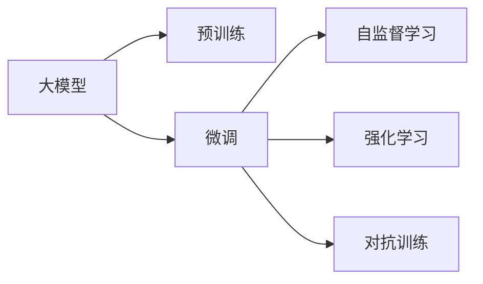

                 

## 1. 背景介绍

OpenAI是一家致力于推动人工智能研究与应用的创新公司，其核心目标是通过开发和部署高效的AI模型，来解决人类面临的最重要问题。OpenAI的创新源自于对其研究社区的承诺，通过开放式合作、同行评审和广泛的协作，OpenAI不断推进前沿技术的研究和应用。其研究领域包括自然语言处理(NLP)、机器学习、强化学习、游戏AI等，并在这些领域取得了显著的突破。

### 1.1 研究背景

OpenAI的崛起可以追溯到其对“通用人工智能”(AGI)的追求，旨在创建一种可以执行各种智能任务的AI，这些智能任务超出了特定任务的局限，能够泛化并适应新的环境。OpenAI的工作由其创始人Samuel Bengio、Greg Brockman、Ilya Sutskever、Andrej Karpathy、John Schulman、Wojciech Zaremba、Sukrit Sitaraman、Dario Amodei和David J. Evans共同推动，他们致力于创造能够理解、学习和执行人类级任务的智能系统。

### 1.2 发展历程

OpenAI的创立初衷是为了创建一个更加友好、智能的未来。2015年，OpenAI发布了GPT-1模型，这是一个基于深度学习的语言模型，能够生成与人类可区分的文本。随后，OpenAI发布了GPT-2模型，并大幅提升了模型的规模和性能，显著改善了语言模型的质量。OpenAI在2019年发布的GPT-3，进一步证明了更大规模预训练模型带来的性能提升。

## 2. 核心概念与联系

### 2.1 核心概念概述

- **大模型(Large Models)**：OpenAI开发并部署的大规模深度学习模型，例如GPT-3，具有极高的参数量和计算需求。
- **预训练(Pre-training)**：在无标签数据上训练模型，学习通用知识，使其能够执行多种任务。
- **微调(Fine-tuning)**：在大模型上使用有标签数据，针对特定任务进行优化。
- **自监督学习(Self-supervised Learning)**：利用数据本身的特性，如语言模型预测、掩码预测等，无需标注即可进行模型训练。
- **强化学习(Reinforcement Learning)**：通过与环境的交互，通过奖励机制优化模型的行为。
- **对抗训练(Adversarial Training)**：使用对抗样本提升模型的鲁棒性。

这些概念之间的逻辑关系可以用以下Mermaid流程图来展示：



此流程图展示了OpenAI开发大模型流程：

1. 大模型通过预训练学习通用知识。
2. 针对特定任务，使用微调进行优化。
3. 结合自监督学习，在不需标注的情况下训练模型。
4. 通过强化学习与环境交互，不断提升性能。
5. 利用对抗训练提升模型的鲁棒性。

### 2.2 核心概念原理和架构

- **Transformer模型架构**：Transformer模型是OpenAI大模型中的核心技术。它利用自注意力机制，提升了模型的表达能力和计算效率。
- **自监督学习任务**：包括掩码语言模型、掩码视觉模型等，通过这些任务，大模型可以自主学习丰富的知识。
- **微调步骤**：首先进行预训练，然后使用微调数据对模型进行特定任务优化。
- **对抗训练流程**：使用对抗样本对模型进行训练，提高模型的鲁棒性和泛化能力。

## 3. 核心算法原理 & 具体操作步骤

### 3.1 算法原理概述

OpenAI大模型的算法原理主要基于Transformer架构，结合自监督学习、微调和强化学习技术。以下是对这些技术的基本介绍：

- **Transformer**：一种基于自注意力机制的神经网络架构，用于处理序列数据。Transformer通过并行计算，大幅提升了模型训练和推理的速度。
- **自监督学习**：利用数据本身的特性，如掩码预测、目标检测等，训练模型，无需标注数据。
- **微调**：在特定任务上，使用有标签数据对预训练模型进行优化。
- **强化学习**：通过与环境的交互，优化模型的行为，使其能够执行特定的任务。

### 3.2 算法步骤详解

OpenAI大模型的开发步骤如下：

1. **数据收集与预处理**：收集大规模的无标签数据，如Web爬取、文本、图片等，并进行预处理，如去噪、归一化等。
2. **模型训练与优化**：在大规模数据上，使用自监督学习任务对模型进行训练，优化参数。
3. **微调与优化**：针对特定任务，使用有标签数据进行微调，优化模型，提高任务性能。
4. **模型部署与评估**：将训练好的模型部署到生产环境，进行性能评估和调优。

### 3.3 算法优缺点

OpenAI大模型的优点包括：

- **性能优越**：经过大规模预训练和微调，模型在各种任务上取得了优异的性能。
- **泛化能力强**：能够在不同领域和任务上泛化，适应性强。
- **高效计算**：利用并行计算和分布式训练技术，大幅提升了计算效率。

缺点包括：

- **高计算成本**：大规模预训练和微调需要大量的计算资源和能源。
- **模型复杂度高**：模型参数量大，结构复杂，难以解释。
- **过拟合风险**：在特定任务上微调，容易导致过拟合。

### 3.4 算法应用领域

OpenAI大模型在多个领域中得到了应用，例如：

- **自然语言处理(NLP)**：用于文本生成、情感分析、问答系统等。
- **计算机视觉(CV)**：用于图像分类、目标检测、图像生成等。
- **强化学习(RL)**：用于游戏AI、机器人控制等。

## 4. 数学模型和公式 & 详细讲解 & 举例说明

### 4.1 数学模型构建

OpenAI大模型的数学模型基于Transformer架构，其主要组成部分包括编码器-解码器、自注意力机制和残差连接。Transformer的核心计算单元为多头自注意力机制，可以表示为：

$$
\text{Attention}(Q, K, V) = \text{Softmax}(\frac{QK^T}{\sqrt{d_k}})V
$$

其中，$Q$、$K$、$V$分别为查询、键和值向量，$d_k$为缩放因子，$\text{Softmax}$函数为归一化因子。

### 4.2 公式推导过程

以语言模型为例，Transformer的输入为词向量序列$X = [x_1, x_2, ..., x_n]$，输出为语言模型概率分布$P(Y|X)$。其中，$x_i$为输入序列中的第$i$个词向量，$Y$为输出序列。

Transformer的输出层由softmax函数构成，可以表示为：

$$
P(Y|X) = \text{Softmax}(\frac{V^TXW^T}{\sqrt{d_k}})
$$

其中，$V$、$W$分别为值向量和权重矩阵。

### 4.3 案例分析与讲解

以GPT-3为例，其语言模型通过预训练学习到了大规模的无标签文本数据中的语言规律，并通过微调在特定任务上进行了优化，提高了任务性能。

例如，在情感分析任务中，GPT-3通过预训练学习到语言的基本情感倾向，然后在微调过程中，使用情感标签进行进一步优化，提高了情感分析的准确率。

## 5. 项目实践：代码实例和详细解释说明

### 5.1 开发环境搭建

- **环境要求**：Python 3.7+，Transformer库，PyTorch。
- **环境配置**：
```bash
conda create -n pytorch-env python=3.7 
conda activate pytorch-env
conda install torch torchvision torchaudio -c pytorch
pip install transformers
```

### 5.2 源代码详细实现

以下是一个简单的例子，使用GPT-3进行文本生成：

```python
from transformers import GPT3Model, GPT3Tokenizer

tokenizer = GPT3Tokenizer.from_pretrained('gpt3')
model = GPT3Model.from_pretrained('gpt3')

input_text = "This is an example of"
input_ids = tokenizer(input_text, return_tensors='pt').input_ids

output_tokens = model.generate(input_ids)
output_text = tokenizer.decode(output_tokens[0])

print(output_text)
```

### 5.3 代码解读与分析

- **初始化模型和分词器**：从预训练模型中加载模型和分词器。
- **文本预处理**：将输入文本进行分词处理，转换为模型所需的输入形式。
- **生成文本**：使用模型生成输出文本。
- **后处理**：将模型生成的输出文本进行解码，得到最终的生成结果。

### 5.4 运行结果展示

运行上述代码，即可生成与输入文本相关的文本输出。例如，输入“This is an example of”，可以生成一段流畅且具有语义连贯性的文本。

## 6. 实际应用场景

### 6.1 智能客服系统

OpenAI大模型可以用于构建智能客服系统，提供7x24小时不间断的客户服务。通过微调，系统能够理解客户的问题，并提供准确的答案，提高了客户满意度和服务效率。

### 6.2 金融舆情监测

在金融领域，OpenAI大模型可以用于舆情监测和风险预警。通过微调，模型能够实时监测网络舆情，对可能出现的风险进行预警，帮助金融机构及时做出反应。

### 6.3 个性化推荐系统

OpenAI大模型可以用于构建个性化推荐系统，根据用户的兴趣和行为，生成个性化的推荐内容。通过微调，模型能够更好地理解用户需求，提供更精准的推荐服务。

### 6.4 未来应用展望

OpenAI大模型未来的应用前景广阔，包括：

- **智慧医疗**：用于医学文献分析和诊断辅助，提升医疗服务水平。
- **智能教育**：用于个性化教育内容推荐，提高教育质量。
- **智慧城市**：用于城市治理和公共服务，提高城市管理效率。
- **自动驾驶**：用于路径规划和决策辅助，提升驾驶安全。

## 7. 工具和资源推荐

### 7.1 学习资源推荐

- **《深度学习》（Goodfellow等）**：经典深度学习教材，适合初学者和进阶者。
- **《自然语言处理综论》（Goodrich等）**：全面介绍自然语言处理技术。
- **OpenAI官方文档**：包含模型使用和微调的具体教程。

### 7.2 开发工具推荐

- **PyTorch**：流行的深度学习框架，支持TensorBoard和Weights & Biases。
- **Jupyter Notebook**：交互式编程环境，适合快速原型开发和数据可视化。

### 7.3 相关论文推荐

- **《Attention is All You Need》（Vaswani等）**：Transformer论文，开创了自注意力机制的先河。
- **《Language Models are Unsupervised Multitask Learners》（Radford等）**：GPT-2论文，展示了自监督学习的强大能力。

## 8. 总结：未来发展趋势与挑战

### 8.1 研究成果总结

OpenAI大模型在多个领域取得了突破性进展，成为NLP和AI领域的标杆。其核心技术包括Transformer、自监督学习、微调等，推动了NLP技术的发展和应用。

### 8.2 未来发展趋势

未来，OpenAI大模型将呈现以下趋势：

- **模型规模持续增大**：更大规模的预训练模型将提升模型的性能和泛化能力。
- **参数高效微调**：进一步减少微调所需参数，提升计算效率。
- **多模态学习**：结合视觉、语音等多模态数据，提升模型的综合能力。

### 8.3 面临的挑战

尽管OpenAI大模型取得了显著成就，但仍面临以下挑战：

- **计算资源消耗大**：大规模预训练和微调需要大量计算资源。
- **模型可解释性不足**：大模型复杂度高，难以解释其内部机制。
- **过拟合和泛化问题**：在特定任务上微调，容易导致过拟合和泛化能力下降。

### 8.4 研究展望

未来，OpenAI大模型需要在以下几个方面进行改进：

- **知识图谱融合**：将知识图谱与大模型融合，提升模型的知识整合能力。
- **因果推理**：引入因果推理技术，增强模型的因果关系分析能力。
- **伦理和安全性**：开发伦理导向的评估指标，确保模型输出的安全性。

## 9. 附录：常见问题与解答

### Q1: OpenAI大模型是否适用于所有任务？

A: OpenAI大模型在大多数NLP任务上表现优异，但特定领域的任务可能需要额外的预训练和微调。例如，医学领域的任务可能需要使用特定领域的语料进行预训练。

### Q2: 如何优化OpenAI大模型的训练过程？

A: 可以通过以下方式优化OpenAI大模型的训练过程：

- **数据增强**：通过回译、近义替换等方法扩充训练集。
- **正则化**：使用L2正则、Dropout等防止过拟合。
- **学习率调度**：使用warmup策略，逐步减小学习率。

### Q3: 大模型训练过程中需要注意哪些问题？

A: 大模型训练需要注意以下问题：

- **计算资源**：确保有足够的计算资源进行训练。
- **内存管理**：避免内存溢出，使用梯度积累等技术优化内存使用。
- **模型评估**：定期在验证集上评估模型性能，避免过拟合。

### Q4: OpenAI大模型的未来研究方向是什么？

A: OpenAI大模型的未来研究方向包括：

- **多模态学习**：结合视觉、语音等多模态数据进行模型训练。
- **因果推理**：增强模型的因果关系分析能力。
- **伦理和安全性**：确保模型输出的安全性，开发伦理导向的评估指标。

