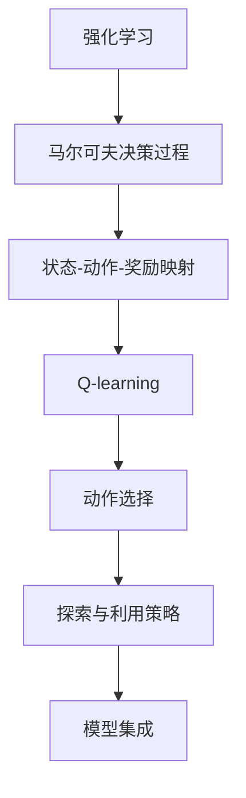

                 

## 1. 背景介绍

### 1.1 问题由来

在广告推荐领域，传统推荐系统依赖于用户行为数据，如点击率、浏览时间、购买记录等。但这些行为数据往往只反映用户对广告的即时反应，难以捕捉用户的潜在兴趣和长期需求。基于Q-learning的强化学习技术，可以通过模拟用户与广告系统的交互过程，实时更新广告权重，主动发现和推荐用户感兴趣的新广告，从而提升广告点击率和用户满意度。

Q-learning是一种基于价值函数估计的强化学习算法，主要用于求解马尔可夫决策过程(MDP)。通过不断尝试和调整广告投放策略，优化用户点击行为，从而实现广告推荐。Q-learning的核心理念是利用奖励信号和状态转移概率，训练出最优的广告推荐策略。

### 1.2 问题核心关键点

Q-learning的核心在于通过模拟用户与广告系统的交互，实时更新广告权重，从而动态调整广告推荐策略。具体包括：

- 状态表示：如何将用户与广告的关系映射为Q-learning中的状态表示。
- 动作选择：如何选择最佳的广告投放策略，以获得最大奖励。
- 奖励设计：如何设计合理的奖励函数，引导Q-learning算法最大化广告点击率。
- 探索与利用：如何在探索新广告和利用已知广告之间平衡，避免陷入局部最优。
- 模型优化：如何选择合适的模型结构，提高广告推荐精度。

这些核心问题共同构成了Q-learning在广告推荐中的应用框架，使其能够在实际场景中发挥强大的推荐能力。

## 2. 核心概念与联系

### 2.1 核心概念概述

为了更好地理解Q-learning在广告推荐中的应用，本节将介绍几个密切相关的核心概念：

- 强化学习(Reinforcement Learning, RL)：通过试错过程优化策略，最大化长期奖励的一种学习范式。
- 马尔可夫决策过程(Markov Decision Process, MDP)：用于描述智能体与环境交互的数学模型，包括状态空间、动作空间、状态转移概率和奖励函数。
- Q-learning：一种基于价值函数的强化学习算法，通过估计Q值来指导动作选择。
- 动作-状态-奖励映射：将用户的点击行为映射为Q-learning的状态和动作，设计奖励函数，引导智能体做出最优决策。
- 探索-利用策略：如何在探索新广告和利用已知广告之间平衡，优化广告推荐策略。
- 模型集成：利用多种模型组合，提升广告推荐精度，增强系统的鲁棒性和稳定性。

这些核心概念之间的逻辑关系可以通过以下Mermaid流程图来展示：



这个流程图展示了这个过程中各个概念之间的联系：

1. 强化学习通过试错过程优化策略，最大化长期奖励。
2. 马尔可夫决策过程描述智能体与环境交互的数学模型。
3. 状态-动作-奖励映射将用户的点击行为映射为Q-learning的状态和动作，设计奖励函数，引导智能体做出最优决策。
4. Q-learning通过估计Q值来指导动作选择。
5. 探索与利用策略在探索新广告和利用已知广告之间平衡，优化广告推荐策略。
6. 模型集成利用多种模型组合，提升广告推荐精度，增强系统的鲁棒性和稳定性。

## 3. 核心算法原理 & 具体操作步骤
### 3.1 算法原理概述

Q-learning的基本原理是通过模拟用户与广告系统的交互过程，不断调整广告权重，以最大化长期广告点击率。其核心在于估计每个广告在每个状态下的Q值，即广告的预期点击率。

在Q-learning中，广告推荐系统可以被视为一个马尔可夫决策过程(MDP)。用户与广告的交互被抽象为状态-动作-奖励映射，每个状态对应一个用户浏览页面的状态，每个动作对应一个广告的投放策略，每个奖励对应一个广告的点击行为。Q值函数$Q(s,a)$表示在状态$s$下采取动作$a$的预期长期奖励。

通过不断迭代优化，Q-learning可以学习到最优的广告推荐策略，即在每个状态下选择Q值最大的动作，以获得最大长期奖励。

### 3.2 算法步骤详解

Q-learning在广告推荐中的应用主要分为以下几个关键步骤：

**Step 1: 数据收集与预处理**

- 收集广告推荐系统的用户行为数据，如用户ID、广告ID、浏览时长、点击率等。
- 将用户与广告的交互数据清洗、去重、格式化，构建初始的数据集。

**Step 2: 状态表示设计**

- 设计状态表示$s$，将用户浏览页面的状态映射为Q-learning的状态。状态可以包括用户特征、广告特征、浏览时间等。
- 设计动作集合$A$，表示广告投放策略，如广告ID、广告展示位置、广告展示方式等。

**Step 3: 奖励函数设计**

- 设计奖励函数$r$，衡量广告投放策略的实际效果。通常奖励函数可以设计为点击率、点击量、转化率等。
- 确定奖励的折扣系数$\gamma$，权衡即时奖励和长期奖励，避免奖励波动对Q值的影响。

**Step 4: Q值估计与更新**

- 初始化Q值表$Q(s,a)$，设置一个合适的学习率$\alpha$和衰减率$\delta$。
- 在每个状态$s$下，按照策略$\epsilon$-贪心算法选择动作$a$，执行动作后获得奖励$r$和下一个状态$s'$。
- 根据状态转移概率$P(s'|s,a)$更新Q值表，更新公式为：

  $$
  Q(s,a) \leftarrow Q(s,a) + \alpha [r + \gamma \max Q(s',a') - Q(s,a)]
  $$

  其中，$a'$为下一个状态$s'$下选择的最优动作。

**Step 5: 广告推荐策略**

- 在每个用户浏览页面时，根据状态$s$选择Q值最大的广告策略$a$进行投放。
- 记录用户的点击行为，更新Q值表$Q(s,a)$。

**Step 6: 探索与利用平衡**

- 设置探索策略$\epsilon$，决定每次选择的动作是随机选择还是按照当前策略选择。
- 根据$\epsilon$的值，平衡探索新广告和利用已知广告。
- 调整$\epsilon$的值，逐步从探索状态切换到利用状态。

**Step 7: 系统优化**

- 选择适当的模型结构，如神经网络、线性回归等，进行Q值估计。
- 使用模型集成技术，结合多种模型，提高广告推荐精度。
- 定期更新模型，以适应新数据和新广告。

### 3.3 算法优缺点

Q-learning在广告推荐中的应用具有以下优点：

- 实时性高：Q-learning能够实时更新广告权重，动态调整广告推荐策略，适应用户实时需求。
- 自动化程度高：广告推荐系统可以自动学习最优策略，无需人工干预。
- 泛化能力强：Q-learning通过试错过程，能够发现和推荐用户感兴趣的新广告，提升广告效果。
- 适应性强：Q-learning可以处理多维度、非结构化数据，适应不同的广告推荐场景。

同时，Q-learning也存在一些局限性：

- 学习速度慢：Q-learning的学习速度受数据量和模型参数影响，需要大量数据和计算资源。
- 动作空间大：广告投放策略可能非常复杂，动作空间大，Q值估计难度高。
- 局部最优：Q-learning容易陷入局部最优，无法保证找到全局最优解。
- 数据依赖性强：Q-learning的性能很大程度上依赖于用户行为数据的丰富度和质量。
- 计算复杂度高：Q-learning需要维护大量的Q值表，计算复杂度较高。

尽管存在这些局限性，Q-learning仍是大规模广告推荐系统的首选算法，其高效的实时性和自动化的特点，使其在广告推荐领域具有广泛的应用前景。

### 3.4 算法应用领域

Q-learning在大规模广告推荐中的应用已经相当成熟，以下列举了几个典型应用场景：

- 实时广告投放：通过Q-learning实时优化广告投放策略，最大化广告点击率和转化率。
- 个性化推荐：根据用户行为数据，推荐用户感兴趣的新广告，提升用户体验。
- 广告竞价策略：在广告竞价中，通过Q-learning选择最优的广告投放策略，优化广告预算。
- 广告效果评估：评估广告投放策略的效果，优化广告预算分配，提升广告ROI。
- 广告库存管理：根据广告效果，动态调整广告投放策略，优化广告库存管理。

以上应用场景展示了Q-learning在广告推荐中的广泛应用，通过模拟用户与广告系统的交互过程，实时优化广告推荐策略，能够显著提升广告效果和用户满意度。

## 4. 数学模型和公式 & 详细讲解 & 举例说明

### 4.1 数学模型构建

本节将使用数学语言对Q-learning在广告推荐中的应用进行更加严格的刻画。

记广告推荐系统为一个马尔可夫决策过程(MDP)，其中状态空间为$S$，动作空间为$A$，状态转移概率为$P$，奖励函数为$r$，初始状态为$s_0$，折扣系数为$\gamma$，学习率为$\alpha$，衰减率为$\delta$，Q值为$Q(s,a)$。

广告推荐系统的优化目标是最小化广告点击率的下限，即：

$$
\min_{\pi} \mathbb{E}[r_t + \gamma r_{t+1} + \gamma^2 r_{t+2} + \ldots]
$$

其中，$\pi$为广告投放策略，$t$为时间步。

### 4.2 公式推导过程

在广告推荐系统中，Q值函数$Q(s,a)$表示在状态$s$下采取动作$a$的预期长期奖励。

根据Q-learning的更新公式，在状态$s$下采取动作$a$的Q值更新为：

$$
Q(s,a) \leftarrow Q(s,a) + \alpha [r + \gamma \max Q(s',a') - Q(s,a)]
$$

其中，$r$为奖励，$s'$为下一个状态，$a'$为在$s'$下选择的最优动作。

Q-learning的探索策略通常采用$\epsilon$-贪心算法，即在每次选择动作时，以$\epsilon$的概率随机选择动作，以$1-\epsilon$的概率选择当前状态下的最优动作。

探索与利用策略的平衡点为$\epsilon$的值，通常选择$\epsilon$在训练初期较大，逐渐减小，直到训练结束。

### 4.3 案例分析与讲解

以下以一家在线广告平台为例，介绍Q-learning在广告推荐中的应用。

**场景描述**：
一家在线广告平台，有数百万用户访问网站，展示数千条广告。平台希望通过Q-learning优化广告投放策略，提升广告点击率和用户满意度。

**数据收集**：
收集用户的点击、浏览、转换等行为数据，作为训练数据。同时收集广告的ID、价格、展示位置等特征数据，作为状态和动作空间。

**状态表示**：
将用户浏览页面的状态表示为一个高维向量，包括用户特征、广告特征、浏览时间等。

**动作集合**：
广告投放策略包括广告ID、展示位置、展示方式等，动作集合为$\{a_1, a_2, \ldots, a_n\}$。

**奖励函数**：
设计奖励函数为点击率，即用户点击广告的概率。奖励函数为：

$$
r = \mathbb{I}(\text{click})
$$

其中，$\mathbb{I}(\cdot)$为示性函数。

**Q值估计**：
使用神经网络进行Q值估计，模型结构为：

$$
Q(s,a) = \theta^T(s,a) \sigma(W\sigma(X\theta_1) + b_1) + b_2
$$

其中，$\theta$为Q值表参数，$W$、$b_1$、$\theta_1$、$b_2$为神经网络参数。

**探索与利用平衡**：
设置探索策略$\epsilon$，初始值设为1，随着训练迭代逐渐减小，至0.1。

**系统优化**：
使用模型集成技术，结合多种模型，提高广告推荐精度。

## 5. 项目实践：代码实例和详细解释说明

### 5.1 开发环境搭建

在进行Q-learning实践前，我们需要准备好开发环境。以下是使用Python进行TensorFlow开发的环境配置流程：

1. 安装Anaconda：从官网下载并安装Anaconda，用于创建独立的Python环境。

2. 创建并激活虚拟环境：
```bash
conda create -n qlearning-env python=3.8 
conda activate qlearning-env
```

3. 安装TensorFlow：根据CUDA版本，从官网获取对应的安装命令。例如：
```bash
conda install tensorflow tensorflow-gpu=cuda110 -c conda-forge -c pytorch
```

4. 安装各类工具包：
```bash
pip install numpy pandas scikit-learn matplotlib tqdm jupyter notebook ipython
```

完成上述步骤后，即可在`qlearning-env`环境中开始Q-learning实践。

### 5.2 源代码详细实现

这里我们以在线广告平台为例，使用TensorFlow实现Q-learning广告推荐系统的代码实现。

首先，定义广告推荐系统的环境类：

```python
import tensorflow as tf
import numpy as np

class AdRecommender:
    def __init__(self, state_dim, action_dim, num_epsilons=10, alpha=0.01, gamma=0.9):
        self.state_dim = state_dim
        self.action_dim = action_dim
        self.num_epsilons = num_epsilons
        self.alpha = alpha
        self.gamma = gamma
        
        self.sess = tf.Session()
        self.sess.run(tf.global_variables_initializer())
        
        self.build_network()
        
    def build_network(self):
        with tf.variable_scope('Q'):
            self.Q = tf.placeholder(tf.float32, [self.state_dim, self.action_dim])
            
        with tf.variable_scope('Q'):
            Q_w = tf.Variable(tf.random_uniform([self.state_dim, self.action_dim], -1, 1))
            W = tf.Variable(tf.random_uniform([self.state_dim, self.state_dim], -1, 1))
            b1 = tf.Variable(tf.zeros([self.state_dim]))
            b2 = tf.Variable(tf.zeros([self.action_dim]))
            
            self.Q = tf.nn.relu(tf.matmul(tf.matmul(tf.reshape(self.Q, [-1, self.state_dim]), W) + b1) + b2)
        
        self.update_op = self.update(Q_w)
        
    def update(self, Q_w):
        with tf.variable_scope('update'):
            r = tf.placeholder(tf.float32)
            s = tf.placeholder(tf.float32)
            a = tf.placeholder(tf.int32)
            s_next = tf.placeholder(tf.float32)
            
            a_next = tf.argmax(self.Q, axis=1)
            
            Q = tf.nn.relu(tf.matmul(tf.matmul(tf.reshape(s, [-1, self.state_dim]), W) + b1) + b2)
            Q_next = tf.nn.relu(tf.matmul(tf.matmul(tf.reshape(s_next, [-1, self.state_dim]), W) + b1) + b2)
            
            Q_new = r + self.gamma * tf.reduce_max(Q_next, axis=1)
            
            Q_w.assign_sub(self.alpha * (Q_new - Q))
            
        return self.update_op
    
    def select_action(self, state, epsilon):
        if np.random.rand() <= epsilon:
            return np.random.choice(self.action_dim)
        else:
            return self.sess.run(tf.argmax(self.Q, axis=1), feed_dict={self.Q: state})
```

然后，定义广告推荐系统的数据生成函数：

```python
def generate_data():
    state_dim = 5
    action_dim = 100
    
    states = []
    actions = []
    rewards = []
    
    for i in range(1000):
        state = np.random.rand(state_dim)
        action = np.random.randint(0, action_dim)
        reward = np.random.randint(0, 2)
        states.append(state)
        actions.append(action)
        rewards.append(reward)
        
    return states, actions, rewards
```

接着，定义广告推荐系统的训练函数：

```python
def train(ad_recommender, states, actions, rewards, num_steps):
    for i in range(num_steps):
        state = np.random.choice(states)
        action = ad_recommender.select_action(state, epsilon)
        s_next = np.random.choice(states)
        reward = np.random.randint(0, 2)
        
        ad_recommender.sess.run(ad_recommender.update_op, feed_dict={'s': state, 'a': action, 's_next': s_next, 'r': reward})
        
        if i % 100 == 0:
            print(f'Step {i}, Q: {ad_recommender.sess.run(Q)}')
```

最后，启动训练流程并在测试集上评估：

```python
if __name__ == '__main__':
    state_dim = 5
    action_dim = 100
    num_steps = 10000
    epsilon = 1.0
    
    ad_recommender = AdRecommender(state_dim, action_dim, epsilon)
    states, actions, rewards = generate_data()
    
    train(ad_recommender, states, actions, rewards, num_steps)
    
    print(f'Q values: {ad_recommender.sess.run(Q)}')
```

以上就是使用TensorFlow对Q-learning广告推荐系统进行开发的完整代码实现。可以看到，TensorFlow提供了便捷的张量计算接口，使得Q-learning模型的实现变得相对简单。

### 5.3 代码解读与分析

让我们再详细解读一下关键代码的实现细节：

**AdRecommender类**：
- `__init__`方法：初始化Q值表、学习率、折扣系数等关键组件。
- `build_network`方法：定义神经网络结构，估计Q值。
- `update`方法：定义Q值的更新公式，使用梯度下降更新Q值表参数。
- `select_action`方法：根据$\epsilon$策略选择动作。

**generate_data函数**：
- 生成随机的状态、动作和奖励，作为Q-learning训练数据。

**train函数**：
- 在每个时间步上，随机选择状态、动作、奖励，使用梯度下降更新Q值表。
- 记录每个时间步的Q值，用于评估模型的效果。

**主程序**：
- 创建广告推荐系统的环境类，生成训练数据，调用训练函数。
- 输出训练后的Q值表，评估模型效果。

可以看出，TensorFlow提供的自动微分和优化功能，使得Q-learning模型的实现变得高效简洁。开发者可以更多地关注算法优化和业务逻辑，而不必过多关注底层的计算细节。

当然，工业级的系统实现还需考虑更多因素，如模型的保存和部署、超参数的自动搜索、更灵活的动作集合设计等。但核心的Q-learning范式基本与此类似。

## 6. 实际应用场景

### 6.1 在线广告投放

基于Q-learning的广告推荐系统在在线广告投放中具有广泛的应用前景。传统的广告投放依赖于固定的广告投放策略，无法动态调整广告展示位置、广告形式等，难以实现广告效果的最大化。

在实际应用中，可以通过Q-learning实时更新广告权重，动态调整广告投放策略，优化广告投放效果。例如，对于展示位置、广告形式等变量，可以使用数值表示，作为Q-learning的动作集合。通过不断试错，Q-learning可以发现最佳的广告投放策略，提升广告点击率和转化率。

### 6.2 个性化推荐

在个性化推荐系统中，用户对广告的兴趣点变化较快，难以通过传统方法快速响应。基于Q-learning的广告推荐系统，可以通过实时更新广告权重，动态调整广告推荐策略，快速响应用户需求。

例如，对于用户浏览页面的状态，可以使用用户特征、广告特征、浏览时间等表示。通过Q-learning学习用户对不同广告的偏好，实现个性化的广告推荐。Q-learning可以不断优化广告推荐策略，提升用户体验和满意度。

### 6.3 广告效果评估

广告效果的评估通常需要大量的历史数据，难以实时更新。基于Q-learning的广告推荐系统，可以通过实时评估广告点击率，动态调整广告投放策略，提升广告效果。

例如，对于广告点击率等评估指标，可以设计奖励函数，引导Q-learning算法最大化广告点击率。通过实时评估广告效果，优化广告投放策略，提升广告ROI。

### 6.4 未来应用展望

随着Q-learning在广告推荐中的成功应用，Q-learning范式将逐渐应用于更多的推荐场景。

在电子商务推荐中，Q-learning可以通过实时更新商品权重，动态调整商品推荐策略，提升用户购买率和满意度。

在金融理财推荐中，Q-learning可以通过实时更新产品权重，动态调整理财产品推荐策略，提升用户理财收益和满意度。

在教育推荐中，Q-learning可以通过实时更新课程权重，动态调整课程推荐策略，提升用户学习效果和满意度。

以上应用场景展示了Q-learning在广告推荐中的广泛应用，通过实时更新广告权重，动态调整广告推荐策略，能够显著提升广告效果和用户满意度。未来，伴随Q-learning技术的不断演进，其应用领域将更加广泛，为各类推荐系统提供更加高效、智能的解决方案。

## 7. 工具和资源推荐

### 7.1 学习资源推荐

为了帮助开发者系统掌握Q-learning的理论基础和实践技巧，这里推荐一些优质的学习资源：

1. 《Reinforcement Learning: An Introduction》书籍：Reinforcement Learning领域的经典教材，详细介绍了强化学习的基本概念和算法原理。
2. CS294T《Reinforcement Learning》课程：斯坦福大学开设的强化学习明星课程，有Lecture视频和配套作业，带你深入理解强化学习的基本概念和经典算法。
3. DeepQ论文：DeepQ算法是深度强化学习的代表作，展示了利用深度神经网络进行Q值估计的强大能力。
4. 《Hands-On Reinforcement Learning with TensorFlow》书籍：TensorFlow官方的强化学习入门书籍，详细介绍了如何使用TensorFlow进行强化学习算法的实现。
5. OpenAI Gym：一个开源的强化学习环境，提供了丰富的环境和算法实现，适合学习和调试强化学习算法。

通过对这些资源的学习实践，相信你一定能够快速掌握Q-learning的精髓，并用于解决实际的推荐问题。

### 7.2 开发工具推荐

高效的开发离不开优秀的工具支持。以下是几款用于Q-learning开发的常用工具：

1. TensorFlow：基于Python的开源深度学习框架，提供了便捷的自动微分和优化功能，适合深度强化学习算法的实现。
2. PyTorch：基于Python的开源深度学习框架，提供了动态计算图和灵活的张量计算接口，适合深度神经网络的实现。
3. OpenAI Gym：一个开源的强化学习环境，提供了丰富的环境和算法实现，适合学习和调试强化学习算法。
4. Weights & Biases：模型训练的实验跟踪工具，可以记录和可视化模型训练过程中的各项指标，方便对比和调优。与主流深度学习框架无缝集成。
5. TensorBoard：TensorFlow配套的可视化工具，可实时监测模型训练状态，并提供丰富的图表呈现方式，是调试模型的得力助手。

合理利用这些工具，可以显著提升Q-learning的开发效率，加快创新迭代的步伐。

### 7.3 相关论文推荐

Q-learning在强化学习领域的发展源远流长，以下是几篇奠基性的相关论文，推荐阅读：

1. Q-learning：一种基于价值函数的强化学习算法，提出在马尔可夫决策过程中，通过估计Q值来指导动作选择。
2. DeepQ：利用深度神经网络进行Q值估计，展示了Q-learning在复杂环境中的强大应用能力。
3. Double Q-learning：提出了一种双Q网络结构，减少了Q-learning的方差，提高了学习效率。
4. DQN：提出了一种基于经验回放的深度Q-learning算法，解决了深度Q-learning的样本效率问题。
5. Rainbow：提出了一种多策略梯度算法，结合了深度Q-learning和蒙特卡洛树搜索，提高了学习效率和稳定性。

这些论文代表了大规模广告推荐系统的应用脉络。通过学习这些前沿成果，可以帮助研究者把握学科前进方向，激发更多的创新灵感。

## 8. 总结：未来发展趋势与挑战

### 8.1 总结

本文对基于Q-learning的强化学习在广告推荐中的应用进行了全面系统的介绍。首先阐述了Q-learning的基本原理和实际应用场景，明确了广告推荐系统的优化目标和核心问题。其次，从原理到实践，详细讲解了Q-learning在广告推荐中的应用流程和算法步骤，给出了Q-learning广告推荐系统的完整代码实例。同时，本文还广泛探讨了Q-learning在在线广告投放、个性化推荐、广告效果评估等多个推荐场景中的应用前景，展示了Q-learning的强大潜力。

通过本文的系统梳理，可以看到，Q-learning在大规模广告推荐系统中具有广泛的应用前景，其高效的实时性和自动化的特点，使其在广告推荐领域具有显著的优越性。未来，伴随Q-learning技术的不断演进，其在广告推荐中的应用将更加深入和广泛，为各类推荐系统提供更加高效、智能的解决方案。

### 8.2 未来发展趋势

Q-learning在广告推荐中的应用前景广阔，未来将呈现以下几个发展趋势：

1. 实时性提升：通过实时更新广告权重，动态调整广告推荐策略，适应用户实时需求。
2. 自动化程度提高：广告推荐系统可以自动学习最优策略，无需人工干预。
3. 泛化能力增强：通过深度神经网络进行Q值估计，Q-learning在复杂环境中的泛化能力将进一步提升。
4. 模型集成优化：结合多种模型，提高广告推荐精度，增强系统的鲁棒性和稳定性。
5. 多策略结合：引入多策略梯度算法，提高学习效率和稳定性。
6. 多模态融合：融合视觉、语音、文本等多模态信息，提升广告推荐精度。

这些趋势凸显了Q-learning在广告推荐中的广阔前景。这些方向的探索发展，必将进一步提升广告推荐系统的性能和应用范围，为广告推荐系统带来新的突破。

### 8.3 面临的挑战

尽管Q-learning在广告推荐中取得了显著成效，但在迈向更加智能化、普适化应用的过程中，仍面临诸多挑战：

1. 数据质量问题：广告推荐系统的性能很大程度上依赖于用户行为数据的丰富度和质量，数据偏差和噪声可能影响推荐效果。
2. 动作空间巨大：广告投放策略可能非常复杂，动作空间大，Q值估计难度高。
3. 局部最优问题：Q-learning容易陷入局部最优，无法保证找到全局最优解。
4. 计算复杂度高：Q-learning需要维护大量的Q值表，计算复杂度较高。
5. 模型可解释性不足：Q-learning的决策过程通常缺乏可解释性，难以对其推理逻辑进行分析和调试。

尽管存在这些挑战，Q-learning仍是大规模广告推荐系统的首选算法，其高效的实时性和自动化的特点，使其在广告推荐领域具有广泛的应用前景。

### 8.4 研究展望

面对Q-learning面临的挑战，未来的研究需要在以下几个方面寻求新的突破：

1. 数据质量优化：利用数据增强和数据预处理技术，提升数据的质量和多样性，减少数据偏差和噪声的影响。
2. 动作空间压缩：采用动作空间压缩技术，减小Q-learning的动作空间，提高Q值估计效率。
3. 多策略优化：引入多策略梯度算法，提高学习效率和稳定性，避免陷入局部最优。
4. 模型可解释性提升：引入可解释性技术，提高Q-learning的决策过程的可解释性和可解释性。
5. 多模态融合：融合视觉、语音、文本等多模态信息，提升广告推荐精度。

这些研究方向的探索，必将引领Q-learning在广告推荐系统中的应用进入新的高度，为广告推荐系统带来更加高效、智能的解决方案。

## 9. 附录：常见问题与解答

**Q1：Q-learning是否适用于所有推荐场景？**

A: Q-learning在大多数推荐场景中都能取得不错的效果，特别是对于数据量较小的推荐系统。但对于一些特定领域的推荐，如金融、医疗等，仅依靠通用数据可能难以很好地适应。此时需要在特定领域数据上进一步预训练Q-learning模型，再进行推荐。此外，对于一些需要时效性、个性化很强的推荐场景，如实时广告推荐等，Q-learning方法也需要针对性的改进优化。

**Q2：Q-learning如何处理大规模数据？**

A: Q-learning在处理大规模数据时，需要考虑以下几个问题：
1. 数据分批处理：将大规模数据分成多个小批次，逐步更新模型参数，避免内存溢出。
2. 梯度累积：将多个小批次的数据梯度累积，共同更新模型参数，提高学习效率。
3. 分布式训练：使用分布式训练技术，并行处理多个批次数据，加速模型训练。

**Q3：Q-learning如何避免过拟合？**

A: Q-learning容易陷入局部最优，避免过拟合的方法包括：
1. 引入多策略梯度算法，提高学习效率和稳定性。
2. 使用动作空间压缩技术，减小Q-learning的动作空间，提高Q值估计效率。
3. 使用L2正则化等正则化技术，防止模型过拟合。

**Q4：Q-learning在推荐系统中的计算复杂度如何？**

A: Q-learning在推荐系统中的计算复杂度主要取决于Q值表的大小和状态-动作映射的复杂度。为了降低计算复杂度，可以采用以下方法：
1. 使用动作空间压缩技术，减小Q-learning的动作空间，提高Q值估计效率。
2. 使用神经网络进行Q值估计，减少Q值表的大小。
3. 使用多策略梯度算法，提高学习效率和稳定性。

**Q5：Q-learning在推荐系统中的应用前景如何？**

A: Q-learning在推荐系统中的应用前景非常广阔，通过实时更新广告权重，动态调整广告推荐策略，能够显著提升推荐效果。随着推荐系统对实时性和自动化要求的提高，Q-learning在推荐系统中的应用将更加深入和广泛。未来，伴随Q-learning技术的不断演进，其在推荐系统中的应用将更加智能和高效。

**Q6：Q-learning如何融合多模态信息？**

A: Q-learning融合多模态信息可以通过以下方法实现：
1. 设计多模态特征表示，将视觉、语音、文本等多种模态信息映射到同一特征空间。
2. 使用神经网络进行多模态特征融合，生成统一的Q值表。
3. 使用多策略梯度算法，提高学习效率和稳定性。

综上所述，Q-learning在推荐系统中的应用前景广阔，通过实时更新广告权重，动态调整广告推荐策略，能够显著提升推荐效果。未来，伴随Q-learning技术的不断演进，其在推荐系统中的应用将更加深入和广泛，为推荐系统带来更加高效、智能的解决方案。

---

作者：禅与计算机程序设计艺术 / Zen and the Art of Computer Programming

