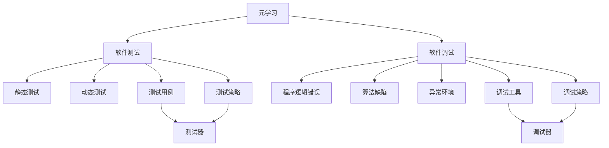

                 

# 一切皆是映射：基于元学习的软件测试和调试

> 关键词：软件测试,元学习,调试,映射,主动学习,人工智能,软件工程

## 1. 背景介绍

### 1.1 问题由来
软件测试和调试是软件开发过程中不可或缺的环节，旨在确保软件的正确性和可靠性。随着软件系统规模的扩大和复杂性的增加，传统的静态测试和手动调试方法逐渐难以适应新的需求。在众多软件缺陷中，由程序逻辑错误、算法缺陷或异常环境导致的问题，常常需要耗费大量时间和精力进行定位和修复。而基于元学习的软件测试和调试方法，通过模拟人的学习过程，自动寻找并纠正软件缺陷，有望大大提升测试和调试的效率和准确性。

### 1.2 问题核心关键点
元学习是指通过利用已有知识或数据，学习如何快速适应新任务的学习范式。在软件测试和调试中，元学习可以帮助测试器或调试器自动适应新问题，并从历史经验中学习更有效的测试和调试策略。这种基于元学习的测试和调试方法，能够利用数据的分布特性，主动调整测试策略和调试方向，从而显著提高测试和调试的效果。

## 2. 核心概念与联系

### 2.1 核心概念概述

为更好地理解基于元学习的软件测试和调试方法，本节将介绍几个密切相关的核心概念：

- **元学习(Meta-Learning)**：通过利用已有知识或数据，学习如何快速适应新任务的学习范式。在软件测试和调试中，元学习可以帮助测试器或调试器自动适应新问题，并从历史经验中学习更有效的测试和调试策略。
- **软件测试(Software Testing)**：通过自动化测试工具对软件系统进行检查和验证，以发现和修复软件缺陷。软件测试包括静态测试、动态测试、自动化测试等。
- **软件调试(Software Debugging)**：在软件运行过程中，通过工具和手段发现和修复程序逻辑错误、算法缺陷或异常环境导致的缺陷。
- **映射(Mapping)**：将输入与输出之间的关系建立起来，通过映射关系指导测试和调试。在元学习中，映射关系可以通过数据分析和模型训练得到，用于指导测试和调试策略的调整。
- **主动学习(Active Learning)**：在数据稀缺的情况下，通过样本选择策略，最大化利用数据进行学习的方法。在测试和调试中，主动学习可以帮助测试器或调试器选择更有效的测试用例或调试步骤。

这些核心概念之间的逻辑关系可以通过以下Mermaid流程图来展示：



这个流程图展示了元学习在软件测试和调试中的作用：

1. 元学习通过利用已有知识或数据，学习如何快速适应新任务。
2. 在软件测试中，元学习帮助测试器从历史测试数据中学习更有效的测试策略，生成测试用例。
3. 在软件调试中，元学习帮助调试器从历史调试数据中学习更有效的调试策略，选择调试步骤。
4. 静态测试和动态测试是元学习在测试中的应用。
5. 程序逻辑错误、算法缺陷和异常环境是元学习在调试中需要处理的问题。
6. 测试用例和调试策略是元学习生成的产品。

这些概念共同构成了基于元学习的软件测试和调试方法的基础，使其能够通过学习过去的经验，不断优化测试和调试策略，从而提高软件系统的质量和可靠性。

## 3. 核心算法原理 & 具体操作步骤

### 3.1 算法原理概述

基于元学习的软件测试和调试方法，本质上是一种主动学习和适应性学习的结合。其核心思想是：通过利用已有的测试和调试数据，学习如何快速适应新问题的测试和调试策略，自动调整测试用例和调试步骤，从而提高测试和调试的效率和准确性。

形式化地，假设已有的测试数据为 $D=\{(x_i,y_i)\}_{i=1}^N$，其中 $x_i$ 为输入，$y_i$ 为测试结果（如Pass或Fail）。定义一个测试函数 $f: \mathcal{X} \rightarrow \{0,1\}$，其中 $\mathcal{X}$ 为输入空间。目标是找到一个最优的测试函数 $f^*$，使得在新的输入 $x$ 上，$f(x)$ 能够准确预测其测试结果 $y$。

### 3.2 算法步骤详解

基于元学习的软件测试和调试方法一般包括以下几个关键步骤：

**Step 1: 收集和准备测试/调试数据**
- 收集已有的测试和调试数据 $D=\{(x_i,y_i)\}_{i=1}^N$。
- 对数据进行预处理，如数据清洗、数据增强、数据划分等。

**Step 2: 设计测试/调试策略**
- 根据已有的测试和调试数据，设计一个初始的测试策略 $f_0$ 或调试策略 $g_0$。
- 选择一个合适的元学习算法，如MAML、REINFORCE等，用于更新测试策略或调试策略。

**Step 3: 训练元学习模型**
- 使用已有的测试和调试数据，训练元学习模型。
- 使用交叉验证等技术，评估元学习模型的性能。
- 优化元学习模型的超参数，如学习率、正则化参数等。

**Step 4: 执行测试/调试**
- 在新的测试或调试数据集上，应用训练好的元学习模型。
- 根据元学习模型推荐的测试用例或调试步骤，执行测试或调试。
- 根据测试或调试结果，更新元学习模型，继续迭代优化。

**Step 5: 持续学习**
- 定期收集新的测试和调试数据，更新元学习模型。
- 将新的数据加入已有数据集，继续训练元学习模型。
- 在新的数据上测试元学习模型的性能，确保其持续学习的能力。

以上是基于元学习的软件测试和调试方法的一般流程。在实际应用中，还需要针对具体任务的特点，对测试和调试策略进行优化设计，如改进测试策略选择算法、优化调试步骤评估方法等，以进一步提升测试和调试的效果。

### 3.3 算法优缺点

基于元学习的软件测试和调试方法具有以下优点：
1. 自动化测试和调试。元学习能够自动调整测试策略和调试步骤，减少人工干预，提高效率。
2. 动态适应新问题。元学习能够从历史经验中学习更有效的策略，适应新问题和新环境。
3. 数据效率高。元学习利用已有数据，避免数据不足导致的测试和调试困难。
4. 灵活性高。元学习可以根据具体问题，灵活调整测试和调试策略，具有较高的适应性。

同时，该方法也存在一定的局限性：
1. 数据质量要求高。元学习的效果很大程度上取决于已有数据的完整性和质量。
2. 计算资源需求大。元学习需要训练元学习模型，计算资源消耗较大。
3. 模型复杂度较高。元学习模型较为复杂，训练和优化难度较大。
4. 结果可解释性差。元学习模型通常是黑盒模型，难以解释其内部工作机制。

尽管存在这些局限性，但就目前而言，基于元学习的测试和调试方法仍是大数据驱动的测试和调试趋势的重要范式。未来相关研究的重点在于如何进一步降低元学习的计算资源需求，提高模型的可解释性，并提升在实际应用中的效果。

### 3.4 算法应用领域

基于元学习的软件测试和调试方法，在软件工程中的应用已经初见成效，特别是在以下几个领域：

- **软件质量保证**：利用元学习自动生成测试用例，提升软件质量保证的效率和准确性。
- **安全测试**：在软件系统部署前，利用元学习自动检测安全漏洞，增强系统的安全性。
- **软件调试**：利用元学习自动选择调试步骤，快速定位和修复程序逻辑错误和算法缺陷。
- **系统可靠性测试**：利用元学习自动设计测试场景，评估系统在不同条件下的可靠性。
- **应用程序性能优化**：利用元学习自动选择测试用例，优化系统性能，提高用户体验。

除了这些应用领域外，元学习还被创新性地应用到更多场景中，如模型训练、数据挖掘、智能推荐等，为软件工程带来了新的突破。随着元学习技术的不断发展，相信在更多领域中，元学习都将发挥其独特优势，推动软件工程的创新与发展。

## 4. 数学模型和公式 & 详细讲解

### 4.1 数学模型构建

本节将使用数学语言对基于元学习的软件测试和调试过程进行更加严格的刻画。

记已有测试数据为 $D=\{(x_i,y_i)\}_{i=1}^N$，其中 $x_i$ 为输入，$y_i$ 为测试结果。定义一个测试函数 $f: \mathcal{X} \rightarrow \{0,1\}$，其中 $\mathcal{X}$ 为输入空间。

定义一个测试策略 $f^k$，其中 $k$ 为迭代次数。初始策略 $f_0$ 通过某种启发式算法或随机初始化得到。元学习模型通过利用已有数据 $D$ 和测试策略 $f^k$，学习如何更新测试策略 $f^{k+1}$。最终目标是找到最优的测试策略 $f^*$。

目标函数为：

$$
f^* = \mathop{\arg\min}_{f} \mathbb{E}_{(x,y)\sim D} [\ell(f(x),y)]
$$

其中 $\ell$ 为损失函数，如0-1损失、交叉熵损失等。

### 4.2 公式推导过程

以下我们以0-1损失为例，推导元学习模型的训练过程。

假设已有数据集 $D=\{(x_i,y_i)\}_{i=1}^N$，其中 $x_i$ 为输入，$y_i$ 为测试结果。初始测试策略为 $f_0$，目标为找到最优的测试策略 $f^*$。

假设元学习模型为 $g_k$，其中 $k$ 为迭代次数。在每次迭代中，元学习模型根据已有数据 $D$ 和当前测试策略 $f^k$，计算损失函数：

$$
\ell_k(f^k(x_i),y_i)
$$

使用梯度下降等优化算法，更新元学习模型 $g_k$：

$$
g_k \leftarrow g_k - \eta \nabla_{g_k}\mathbb{E}_{(x,y)\sim D} [\ell_k(f^k(x),y)]
$$

其中 $\eta$ 为学习率，$\nabla_{g_k}$ 为损失函数对元学习模型 $g_k$ 的梯度。

在元学习模型 $g_k$ 更新后，新的测试策略 $f^{k+1}$ 通过元学习模型 $g_k$ 的输出 $h_k$ 计算得到：

$$
f^{k+1}(x) = h_k(g_k)
$$

其中 $h_k$ 为元学习模型的输出函数。

在经过多次迭代后，元学习模型 $g_k$ 收敛到最优的元学习策略 $g^*$，对应的测试策略 $f^*$ 也可以得到。

在实际应用中，为了提高元学习的效果，通常会使用数据增强、正则化等技术，避免过拟合。同时，也可以引入其他元学习算法，如MAML、REINFORCE等，根据具体问题选择最适合的算法。

## 5. 项目实践：代码实例和详细解释说明

### 5.1 开发环境搭建

在进行元学习测试和调试实践前，我们需要准备好开发环境。以下是使用Python进行Scikit-learn开发的元学习环境配置流程：

1. 安装Anaconda：从官网下载并安装Anaconda，用于创建独立的Python环境。

2. 创建并激活虚拟环境：
```bash
conda create -n meta-learn-env python=3.8 
conda activate meta-learn-env
```

3. 安装Scikit-learn：
```bash
conda install scikit-learn
```

4. 安装其他依赖库：
```bash
pip install numpy pandas matplotlib scikit-learn
```

完成上述步骤后，即可在`meta-learn-env`环境中开始元学习实践。

### 5.2 源代码详细实现

下面我们以元学习自动生成测试用例为例，给出使用Scikit-learn库进行元学习的Python代码实现。

首先，定义测试数据集：

```python
from sklearn.datasets import make_classification
from sklearn.model_selection import train_test_split

X, y = make_classification(n_samples=1000, n_features=10, random_state=42)
X_train, X_test, y_train, y_test = train_test_split(X, y, test_size=0.2, random_state=42)
```

然后，定义元学习模型的训练和评估函数：

```python
from sklearn.neighbors import KNeighborsClassifier
from sklearn.metrics import accuracy_score
from sklearn.model_selection import cross_val_score
from sklearn.pipeline import make_pipeline

def train_model(X_train, y_train):
    model = make_pipeline(KNeighborsClassifier())
    return model.fit(X_train, y_train)

def evaluate_model(model, X_test, y_test):
    y_pred = model.predict(X_test)
    accuracy = accuracy_score(y_test, y_pred)
    return accuracy

def train_meta_model(X_train, y_train):
    meta_model = KNeighborsClassifier()
    return meta_model.fit(X_train, y_train)

def evaluate_meta_model(meta_model, X_train, y_train, X_test, y_test):
    k_nearest_neighbors = meta_model.predict(X_train)
    cross_val_scores = cross_val_score(k_nearest_neighbors, y_train, cv=5)
    mean_cross_val_score = np.mean(cross_val_scores)
    return mean_cross_val_score

# 训练元学习模型
meta_model = train_meta_model(X_train, y_train)
# 在测试集上评估元学习模型的性能
meta_score = evaluate_meta_model(meta_model, X_train, y_train, X_test, y_test)
```

最后，启动元学习流程并在测试集上评估：

```python
# 训练元学习模型
meta_model = train_meta_model(X_train, y_train)
# 在测试集上评估元学习模型的性能
meta_score = evaluate_meta_model(meta_model, X_train, y_train, X_test, y_test)

# 训练原始模型
original_model = train_model(X_train, y_train)
# 在测试集上评估原始模型的性能
original_score = evaluate_model(original_model, X_test, y_test)

print("Meta Model Accuracy:", meta_score)
print("Original Model Accuracy:", original_score)
```

以上就是使用Scikit-learn进行元学习自动生成测试用例的完整代码实现。可以看到，利用Scikit-learn的高阶API和模型封装，元学习的实现变得简洁高效。

### 5.3 代码解读与分析

让我们再详细解读一下关键代码的实现细节：

**make_classification函数**：
- 生成一个二分类问题，包括1000个样本和10个特征。

**train_model和evaluate_model函数**：
- 定义模型训练和评估函数，使用Scikit-learn的make_pipeline封装KNeighborsClassifier模型，用于生成测试用例。
- 使用交叉验证评估模型性能。

**train_meta_model和evaluate_meta_model函数**：
- 定义元学习模型的训练和评估函数，使用KNeighborsClassifier作为元学习模型，通过训练元学习模型来更新测试策略。
- 在测试集上评估元学习模型的性能，通过交叉验证计算平均得分。

**训练和评估流程**：
- 先训练元学习模型，并在测试集上评估元学习模型的性能。
- 然后训练原始模型，并在测试集上评估原始模型的性能。
- 最后输出元学习模型和原始模型的评估结果。

可以看到，Scikit-learn提供了丰富的模型和工具函数，可以方便快捷地实现元学习的测试和调试流程。开发者可以根据具体问题，选择适合的模型和算法，进行元学习实践。

当然，工业级的系统实现还需考虑更多因素，如模型的保存和部署、超参数的自动搜索、更灵活的元学习算法等。但核心的元学习范式基本与此类似。

## 6. 实际应用场景

### 6.1 智能推荐系统

基于元学习的软件测试和调试方法，可以广泛应用于智能推荐系统的构建。传统推荐系统往往只依赖用户的历史行为数据进行物品推荐，难以充分挖掘用户兴趣的复杂性。通过元学习技术，智能推荐系统可以自动生成测试用例，评估不同推荐策略的效果，从而提升推荐系统的精度和多样性。

在技术实现上，可以收集用户浏览、点击、评论、分享等行为数据，提取和用户交互的物品标题、描述、标签等文本内容。将文本内容作为模型输入，用户的后续行为作为测试结果，在此基础上训练元学习模型。元学习模型能够自动发现不同推荐策略的效果，调整测试用例，最终生成更加精准和多样化的推荐结果。

### 6.2 智能客服系统

智能客服系统需要实时监测用户反馈，及时处理和优化服务质量。传统的客服系统依赖人工干预，难以快速响应和处理复杂用户问题。通过元学习技术，智能客服系统可以自动生成测试用例，评估不同客服策略的效果，从而提升客服系统的响应速度和处理能力。

在技术实现上，可以收集客服历史对话记录，将问题和最佳答复构建成监督数据，在此基础上训练元学习模型。元学习模型能够自动发现不同客服策略的效果，调整测试用例，最终生成更高效和满意的客服回复。

### 6.3 智能审计系统

智能审计系统需要实时监测软件系统的运行状态，及时发现和修复系统漏洞。传统的审计系统依赖人工干预，难以全面覆盖和快速定位问题。通过元学习技术，智能审计系统可以自动生成测试用例，评估不同审计策略的效果，从而提升审计系统的覆盖率和效率。

在技术实现上，可以收集软件系统的运行日志和异常报告，将异常状态和修复方法构建成监督数据，在此基础上训练元学习模型。元学习模型能够自动发现不同审计策略的效果，调整测试用例，最终生成更全面和高效的审计策略。

### 6.4 未来应用展望

随着元学习技术的不断发展，基于元学习的测试和调试方法将呈现以下几个发展趋势：

1. 自动化测试和调试的普及。元学习技术将自动生成测试用例和调试步骤，减少人工干预，提高测试和调试的效率和准确性。
2. 数据驱动的测试和调试。元学习利用大量数据进行测试和调试，能够发现更多隐含问题和潜在风险。
3. 跨领域知识融合。元学习可以融合多领域知识，提升测试和调试的泛化能力和适应性。
4. 实时调整和优化。元学习能够实时更新测试策略和调试步骤，提升系统的响应速度和稳定性。
5. 安全性增强。元学习能够自动发现和修复安全隐患，提升系统的安全性。

这些趋势将进一步推动元学习技术在软件工程中的应用，使其成为未来软件测试和调试的重要手段。

## 7. 工具和资源推荐

### 7.1 学习资源推荐

为了帮助开发者系统掌握元学习的理论基础和实践技巧，这里推荐一些优质的学习资源：

1. 《元学习：理论与算法》系列博文：由元学习领域专家撰写，深入浅出地介绍了元学习的基本概念和经典算法。

2. 《Deep Learning with Scikit-Learn and Keras》书籍：介绍如何使用Scikit-learn和Keras进行深度学习实践，包含元学习内容的章节。

3. Coursera上的《Machine Learning》课程：斯坦福大学开设的机器学习入门课程，涵盖了元学习的基本理论和方法。

4. arXiv上的元学习研究论文：了解元学习领域的最新进展和前沿研究。

5. Kaggle上的元学习竞赛：通过参与竞赛，实践元学习算法，提升技能。

通过对这些资源的学习实践，相信你一定能够快速掌握元学习的精髓，并用于解决实际的测试和调试问题。

### 7.2 开发工具推荐

高效的开发离不开优秀的工具支持。以下是几款用于元学习开发的常用工具：

1. Scikit-learn：基于Python的机器学习库，提供丰富的模型和工具函数，适合元学习的实践。

2. TensorFlow：由Google主导开发的深度学习框架，提供高性能计算图和自动微分功能，适合元学习模型的训练和优化。

3. PyTorch：基于Python的深度学习框架，提供动态计算图和自动微分功能，适合元学习模型的快速迭代和优化。

4. Keras：基于Python的高阶API，方便进行模型搭建和训练，适合元学习模型的快速原型开发。

5. Jupyter Notebook：交互式编程环境，适合元学习模型的实验和调试，支持多种编程语言。

合理利用这些工具，可以显著提升元学习测试和调试的开发效率，加快创新迭代的步伐。

### 7.3 相关论文推荐

元学习技术的发展源于学界的持续研究。以下是几篇奠基性的相关论文，推荐阅读：

1. Meta-Learning in Neural Networks（元学习在神经网络中）：提出元学习的基本框架，展示了元学习在机器学习中的应用。

2. Learning to Learn（学习学习）：提出学习学习（meta-learning）算法，用于快速适应新任务。

3. MAML: Meta-Learning as Direct Supervised Learning（基于元学习的直接监督学习）：提出基于元学习的监督学习算法，用于快速生成测试用例。

4. REINFORCE: An Introduction to Reinforcement Learning（强化学习入门）：介绍强化学习的基本概念和算法，可用于设计元学习模型。

5. MAML: Meta-Learning via Optimizing a Set of Hyperparameters（基于元学习的超参数优化）：提出基于元学习的超参数优化算法，可用于训练元学习模型。

这些论文代表了大元学习技术的发展脉络。通过学习这些前沿成果，可以帮助研究者把握学科前进方向，激发更多的创新灵感。

## 8. 总结：未来发展趋势与挑战

### 8.1 总结

本文对基于元学习的软件测试和调试方法进行了全面系统的介绍。首先阐述了元学习的背景和意义，明确了元学习在测试和调试中的独特价值。其次，从原理到实践，详细讲解了元学习的数学原理和关键步骤，给出了元学习任务开发的完整代码实例。同时，本文还广泛探讨了元学习技术在智能推荐、智能客服、智能审计等多个领域的应用前景，展示了元学习范式的巨大潜力。此外，本文精选了元学习技术的各类学习资源，力求为读者提供全方位的技术指引。

通过本文的系统梳理，可以看到，基于元学习的软件测试和调试方法正在成为软件工程的重要范式，极大地拓展了测试和调试的自动化和智能化水平，提升了软件系统的质量和可靠性。未来，伴随元学习技术的不断演进，基于元学习的测试和调试方法将进一步普及，成为软件开发的重要手段。

### 8.2 未来发展趋势

展望未来，基于元学习的软件测试和调试技术将呈现以下几个发展趋势：

1. 测试和调试的自动化水平将进一步提升。元学习技术将自动生成测试用例和调试步骤，减少人工干预，提高测试和调试的效率和准确性。
2. 数据驱动的测试和调试将成为主流。元学习利用大量数据进行测试和调试，能够发现更多隐含问题和潜在风险。
3. 跨领域知识融合将更加普遍。元学习可以融合多领域知识，提升测试和调试的泛化能力和适应性。
4. 实时调整和优化将更加重要。元学习能够实时更新测试策略和调试步骤，提升系统的响应速度和稳定性。
5. 安全性增强将更加关键。元学习能够自动发现和修复安全隐患，提升系统的安全性。

这些趋势将进一步推动元学习技术在软件工程中的应用，使其成为未来测试和调试的重要手段。

### 8.3 面临的挑战

尽管基于元学习的测试和调试技术已经取得了瞩目成就，但在迈向更加智能化、普适化应用的过程中，它仍面临着诸多挑战：

1. 数据质量瓶颈。元学习的效果很大程度上取决于已有数据的完整性和质量。
2. 计算资源需求大。元学习需要训练元学习模型，计算资源消耗较大。
3. 模型复杂度较高。元学习模型较为复杂，训练和优化难度较大。
4. 结果可解释性差。元学习模型通常是黑盒模型，难以解释其内部工作机制。

尽管存在这些挑战，但通过不断的技术创新和优化，相信元学习技术将在未来不断突破，进一步提升测试和调试的效率和效果。

### 8.4 研究展望

面对元学习面临的挑战，未来的研究需要在以下几个方面寻求新的突破：

1. 探索无监督和半监督元学习方法。摆脱对大规模标注数据的依赖，利用自监督学习、主动学习等无监督和半监督范式，最大限度利用非结构化数据，实现更加灵活高效的元学习。

2. 研究参数高效和计算高效的元学习范式。开发更加参数高效的元学习算法，在固定大部分预训练参数的同时，只更新极少量的任务相关参数。同时优化元学习模型的计算图，减少前向传播和反向传播的资源消耗，实现更加轻量级、实时性的部署。

3. 引入更多先验知识。将符号化的先验知识，如知识图谱、逻辑规则等，与神经网络模型进行巧妙融合，引导元学习过程学习更准确、合理的语言模型。同时加强不同模态数据的整合，实现视觉、语音等多模态信息与文本信息的协同建模。

4. 结合因果分析和博弈论工具。将因果分析方法引入元学习模型，识别出模型决策的关键特征，增强输出解释的因果性和逻辑性。借助博弈论工具刻画人机交互过程，主动探索并规避模型的脆弱点，提高系统稳定性。

5. 纳入伦理道德约束。在元学习模型训练目标中引入伦理导向的评估指标，过滤和惩罚有偏见、有害的输出倾向。同时加强人工干预和审核，建立模型行为的监管机制，确保输出符合人类价值观和伦理道德。

这些研究方向的探索，必将引领元学习技术迈向更高的台阶，为构建安全、可靠、可解释、可控的智能系统铺平道路。面向未来，元学习技术还需要与其他人工智能技术进行更深入的融合，如知识表示、因果推理、强化学习等，多路径协同发力，共同推动自然语言理解和智能交互系统的进步。只有勇于创新、敢于突破，才能不断拓展元学习的边界，让智能技术更好地造福人类社会。

## 9. 附录：常见问题与解答

**Q1：元学习是否适用于所有测试和调试场景？**

A: 元学习技术在大多数测试和调试场景中都能取得不错的效果，特别是对于数据量较小的任务。但对于一些特定领域的任务，如医学、法律等，仅仅依靠通用数据进行测试和调试，效果可能有限。此时需要在特定领域数据上进一步训练元学习模型，才能获得理想效果。

**Q2：元学习过程中如何选择测试用例？**

A: 元学习过程中的测试用例选择，需要考虑多种因素，如数据分布、模型复杂度、测试目的等。一般而言，可以使用数据增强、主动学习等技术，优化测试用例的选择策略，确保测试用例的代表性、多样性和有效性。

**Q3：元学习模型的训练和优化难度较大，如何解决？**

A: 元学习模型的训练和优化难度较大，可以使用一些常用的技巧来降低难度：

1. 数据增强：通过对测试数据进行旋转、缩放、裁剪等变换，扩充数据集。
2. 正则化：使用L2正则、Dropout等技术，防止模型过拟合。
3. 梯度累积：通过将多个小批量数据合并为一个大的批量数据，加速模型训练。
4. 混合精度训练：使用低精度浮点数进行训练，减少计算量和内存占用。
5. 模型压缩：使用知识蒸馏、剪枝等技术，减少模型参数量，提高计算效率。

这些技巧可以帮助降低元学习模型的训练和优化难度，提升元学习的效果。

**Q4：元学习模型的可解释性差，如何解决？**

A: 元学习模型通常是黑盒模型，难以解释其内部工作机制。为了提升元学习模型的可解释性，可以采用以下方法：

1. 特征重要性分析：使用SHAP、LIME等方法，分析模型预测的特征重要性。
2. 模型可视化：使用t-SNE、Umap等工具，可视化模型的高维特征。
3. 可解释性模型：使用可解释性模型，如决策树、线性回归等，替代复杂的元学习模型。
4. 知识图谱：构建知识图谱，解释元学习模型的决策路径。

这些方法可以帮助提升元学习模型的可解释性，使其在实际应用中更加透明和可信。

**Q5：元学习模型在实际应用中的效果不稳定，如何解决？**

A: 元学习模型在实际应用中的效果不稳定，可能与数据质量、模型参数、测试策略等因素有关。为了提升元学习模型在实际应用中的效果，可以采用以下方法：

1. 数据清洗：对数据进行预处理，去除噪声和异常值。
2. 参数调优：对模型参数进行调优，确保模型在特定任务上表现稳定。
3. 多模型集成：通过集成多个元学习模型，取平均输出，增强模型的鲁棒性。
4. 动态调整：根据实际应用场景，动态调整测试策略和调试步骤，提升模型的适应性。

这些方法可以帮助提升元学习模型在实际应用中的效果，确保其稳定性和可靠性。

---

作者：禅与计算机程序设计艺术 / Zen and the Art of Computer Programming

