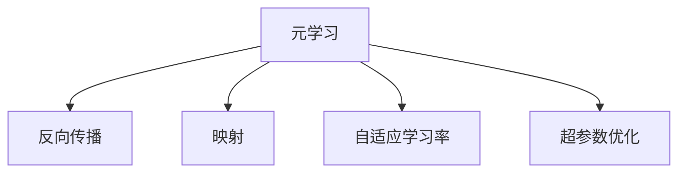

                 

# 一切皆是映射：基于反向传播的元学习框架与实现

> 关键词：元学习,反向传播,映射,模型压缩,超参数优化,自适应学习率

## 1. 背景介绍

### 1.1 问题由来

在深度学习领域，传统的模型训练方法往往需要依赖于大量的标注数据和复杂的超参数调优。而在数据和计算资源有限的情况下，这种做法显得有些力不从心。如何通过更高效、更智能的方式，让模型能够更快地适应新任务，这是一个亟待解决的问题。

元学习(Meta-Learning)作为一种新兴的深度学习方法，为这个问题提供了一个有效的解决方案。通过元学习，模型能够通过少量训练数据快速适应新任务，具有更强的泛化能力和可扩展性。本文将重点探讨基于反向传播的元学习框架，以及其实现方法，希望能为深度学习研究者和实践者提供一些有益的参考。

### 1.2 问题核心关键点

元学习的核心在于让模型能够在新的任务上快速适应，而不需要从头开始训练。这种适应性来源于模型对已有知识和经验的再利用，以及对新任务特征的快速学习。

元学习的关键在于以下几个方面：
- 如何构建有效的元学习目标函数，引导模型快速适应新任务。
- 如何设计合适的模型架构和损失函数，实现高效的学习过程。
- 如何利用已有知识和新任务特征，进行快速适应和泛化。

## 2. 核心概念与联系

### 2.1 核心概念概述

为更好地理解基于反向传播的元学习框架，本节将介绍几个密切相关的核心概念：

- 元学习(Meta-Learning)：指模型通过学习如何在不同任务上快速适应的能力。常见的方法包括模型压缩、自适应学习率、超参数优化等。
- 反向传播(Backpropagation)：指通过计算梯度，将误差反向传播回网络层，更新模型参数的过程。是深度学习训练的核心算法之一。
- 映射(Mapping)：指将输入数据映射到输出数据的连续映射函数，用于实现模型训练和推理的过程。
- 自适应学习率(Adaptive Learning Rate)：指通过某种策略动态调整学习率，以适应不同任务和数据分布。
- 超参数优化(Hyperparameter Optimization)：指通过自动化的方式，搜索最优的超参数组合，以提高模型性能。

这些核心概念之间的逻辑关系可以通过以下Mermaid流程图来展示：



这个流程图展示了他这些核心概念之间的关联：

1. 元学习通过反向传播调整模型参数，实现映射过程。
2. 映射过程基于自适应学习率，动态调整学习率大小。
3. 自适应学习率和超参数优化密切相关，需要通过自动化手段优化超参数。

## 3. 核心算法原理 & 具体操作步骤
### 3.1 算法原理概述

基于反向传播的元学习框架，本质上是将元学习过程看作是对输入数据和输出数据之间映射函数的优化过程。通过反向传播算法，不断调整映射函数的参数，使得其在新的数据分布上能够获得最优的适应性。

在元学习中，我们通常会将训练数据集划分为两部分：元数据集和任务数据集。元数据集用于训练元学习模型，任务数据集用于评估元学习模型的泛化能力。

形式化地，设输入数据为 $x \in \mathcal{X}$，输出数据为 $y \in \mathcal{Y}$，映射函数为 $f: \mathcal{X} \rightarrow \mathcal{Y}$。假设我们已经有大量标注的元数据集 $\mathcal{D}_{\text{meta}} = \{(x_i, y_i)\}_{i=1}^N$，我们的目标是通过反向传播算法，最小化映射函数 $f$ 在元数据集上的误差，即：

$$
\min_{f} \mathcal{L}(f) = \mathcal{L}_{\text{meta}}(f) = \frac{1}{N} \sum_{i=1}^N \ell(f(x_i), y_i)
$$

其中 $\ell$ 为损失函数，如均方误差、交叉熵等。

在得到最小化映射函数 $f^*$ 后，我们将映射函数 $f^*$ 应用于新的任务数据集 $\mathcal{D}_{\text{task}} = \{(x_i, y_i)\}_{i=1}^M$，即可得到该任务的最佳输出 $y_{\text{task}} = f^*(x_i)$。

### 3.2 算法步骤详解

基于反向传播的元学习框架，通常包括以下几个关键步骤：

**Step 1: 准备数据集**
- 准备元数据集 $\mathcal{D}_{\text{meta}}$ 和任务数据集 $\mathcal{D}_{\text{task}}$。
- 对数据进行预处理，包括归一化、标准化等操作。

**Step 2: 构建元学习模型**
- 设计元学习模型 $f_{\theta}$，常用的模型包括神经网络、卷积神经网络、注意力机制等。
- 确定模型损失函数 $\mathcal{L}(\theta)$。

**Step 3: 选择反向传播算法**
- 选择合适的反向传播算法，如随机梯度下降(SGD)、动量(Momentum)、Adam 等。
- 设定学习率、批量大小等超参数。

**Step 4: 执行元学习训练**
- 将元数据集 $\mathcal{D}_{\text{meta}}$ 按批次输入模型，前向传播计算损失函数。
- 反向传播计算参数梯度，根据设定的优化算法和学习率更新模型参数。
- 重复上述步骤直至收敛，得到最优映射函数 $f_{\theta}^*$。

**Step 5: 应用映射函数**
- 将得到的映射函数 $f_{\theta}^*$ 应用于任务数据集 $\mathcal{D}_{\text{task}}$，生成任务输出。
- 在测试集上评估元学习模型的泛化能力。

### 3.3 算法优缺点

基于反向传播的元学习框架具有以下优点：
1. 泛化能力强。元学习模型能够在不同任务上快速适应，具有较强的泛化能力。
2. 训练效率高。通过反向传播算法，元学习模型可以高效地利用已有知识和新任务特征，加速模型训练。
3. 自适应能力强。自适应学习率能够根据不同任务和数据分布，动态调整学习率，提高模型性能。
4. 可解释性好。元学习过程可以看作是对输入数据和输出数据之间映射函数的优化，易于理解。

同时，该框架也存在一些局限性：
1. 依赖高质量数据。元学习的效果很大程度上取决于元数据集的质量和数量，获取高质量数据成本较高。
2. 复杂度较高。元学习模型的设计和训练过程较为复杂，需要更多的经验和技巧。
3. 需要较多的计算资源。元学习通常需要大量的计算资源，进行多次训练和验证。

尽管存在这些局限性，但就目前而言，基于反向传播的元学习框架仍是大规模元学习应用的主流方法。未来相关研究的重点在于如何进一步降低元学习对数据和计算资源的依赖，提高模型的自适应性和可解释性，同时兼顾模型的泛化能力和性能。

### 3.4 算法应用领域

基于反向传播的元学习框架，在深度学习和计算机视觉领域已经得到了广泛的应用，覆盖了多种任务，如目标检测、语义分割、图像生成等。这些领域中的许多任务，都可以通过元学习框架快速适应新任务，从而实现高性能的预测和生成。

除了这些领域外，元学习框架还在自然语言处理、推荐系统、游戏AI等领域有重要的应用前景，为这些领域带来了新的突破。

## 4. 数学模型和公式 & 详细讲解 & 举例说明
### 4.1 数学模型构建

本节将使用数学语言对基于反向传播的元学习过程进行更加严格的刻画。

设输入数据 $x \in \mathcal{X}$，输出数据 $y \in \mathcal{Y}$，映射函数为 $f: \mathcal{X} \rightarrow \mathcal{Y}$，模型参数为 $\theta$。假设我们已经有大量标注的元数据集 $\mathcal{D}_{\text{meta}} = \{(x_i, y_i)\}_{i=1}^N$。

定义模型 $f_{\theta}$ 在输入数据 $x_i$ 上的损失函数为 $\ell(f_{\theta}(x_i), y_i)$，则在元数据集 $\mathcal{D}_{\text{meta}}$ 上的经验风险为：

$$
\mathcal{L}_{\text{meta}}(\theta) = \frac{1}{N} \sum_{i=1}^N \ell(f_{\theta}(x_i), y_i)
$$

在得到最小化映射函数 $f_{\theta}^*$ 后，将其应用于新的任务数据集 $\mathcal{D}_{\text{task}} = \{(x_i, y_i)\}_{i=1}^M$，即可得到该任务的最佳输出 $y_{\text{task}} = f_{\theta}^*(x_i)$。

### 4.2 公式推导过程

以下我们以回归任务为例，推导最小化映射函数的过程。

假设模型 $f_{\theta}$ 在输入 $x$ 上的输出为 $y = f_{\theta}(x)$。回归任务的目标是最小化损失函数 $\ell(y, y_{\text{true}})$，其中 $y_{\text{true}}$ 为真实标签。

形式化地，设元数据集为 $\mathcal{D}_{\text{meta}} = \{(x_i, y_i)\}_{i=1}^N$，其中 $x_i \in \mathcal{X}, y_i \in \mathcal{Y}$。我们的目标是最小化映射函数 $f_{\theta}$ 在元数据集上的误差，即：

$$
\min_{f} \mathcal{L}_{\text{meta}}(f) = \frac{1}{N} \sum_{i=1}^N \ell(f(x_i), y_i)
$$

根据链式法则，损失函数对参数 $\theta_k$ 的梯度为：

$$
\frac{\partial \mathcal{L}_{\text{meta}}(\theta)}{\partial \theta_k} = -\frac{1}{N} \sum_{i=1}^N \frac{\partial \ell(f_{\theta}(x_i), y_i)}{\partial \theta_k}
$$

在得到最小化映射函数 $f_{\theta}^*$ 后，将其应用于新的任务数据集 $\mathcal{D}_{\text{task}} = \{(x_i, y_i)\}_{i=1}^M$，即可得到该任务的最佳输出 $y_{\text{task}} = f_{\theta}^*(x_i)$。

### 4.3 案例分析与讲解

假设我们有一个简单的回归任务，输入为二维向量 $x = (x_1, x_2)$，输出为 $y = y_{\text{true}}$。我们使用一个简单的线性回归模型 $f_{\theta}(x) = \theta_0 + \theta_1 x_1 + \theta_2 x_2$，其中 $\theta_0, \theta_1, \theta_2$ 为模型参数。

设元数据集为 $\mathcal{D}_{\text{meta}} = \{(x_i, y_i)\}_{i=1}^N$，其中 $x_i = (x_{i1}, x_{i2})$，$y_i = y_{\text{true}}$。我们的目标是最小化映射函数 $f_{\theta}$ 在元数据集上的误差，即：

$$
\min_{f} \mathcal{L}_{\text{meta}}(f) = \frac{1}{N} \sum_{i=1}^N \ell(f_{\theta}(x_i), y_i)
$$

其中 $\ell$ 为损失函数，如均方误差 $\ell(y, y_{\text{true}}) = \frac{1}{2}(y - y_{\text{true}})^2$。

形式化地，设映射函数为 $f_{\theta}(x) = \theta_0 + \theta_1 x_1 + \theta_2 x_2$，则损失函数为：

$$
\mathcal{L}_{\text{meta}}(\theta) = \frac{1}{N} \sum_{i=1}^N \frac{1}{2}(\theta_0 + \theta_1 x_{i1} + \theta_2 x_{i2} - y_{\text{true}})^2
$$

根据链式法则，损失函数对参数 $\theta_k$ 的梯度为：

$$
\frac{\partial \mathcal{L}_{\text{meta}}(\theta)}{\partial \theta_k} = -\frac{1}{N} \sum_{i=1}^N (\theta_0 + \theta_1 x_{i1} + \theta_2 x_{i2} - y_{\text{true}})
$$

在得到最小化映射函数 $f_{\theta}^*$ 后，将其应用于新的任务数据集 $\mathcal{D}_{\text{task}} = \{(x_i, y_i)\}_{i=1}^M$，即可得到该任务的最佳输出 $y_{\text{task}} = f_{\theta}^*(x_i)$。

## 5. 项目实践：代码实例和详细解释说明
### 5.1 开发环境搭建

在进行元学习实践前，我们需要准备好开发环境。以下是使用Python进行PyTorch开发的环境配置流程：

1. 安装Anaconda：从官网下载并安装Anaconda，用于创建独立的Python环境。

2. 创建并激活虚拟环境：
```bash
conda create -n pytorch-env python=3.8 
conda activate pytorch-env
```

3. 安装PyTorch：根据CUDA版本，从官网获取对应的安装命令。例如：
```bash
conda install pytorch torchvision torchaudio cudatoolkit=11.1 -c pytorch -c conda-forge
```

4. 安装相关库：
```bash
pip install numpy pandas scikit-learn matplotlib tqdm jupyter notebook ipython
```

完成上述步骤后，即可在`pytorch-env`环境中开始元学习实践。

### 5.2 源代码详细实现

这里我们以线性回归任务为例，给出使用PyTorch进行元学习的PyTorch代码实现。

首先，定义元学习模型的类：

```python
import torch
import torch.nn as nn
import torch.optim as optim

class MetaModel(nn.Module):
    def __init__(self, input_size, hidden_size):
        super(MetaModel, self).__init__()
        self.fc1 = nn.Linear(input_size, hidden_size)
        self.fc2 = nn.Linear(hidden_size, 1)
        
    def forward(self, x):
        x = torch.relu(self.fc1(x))
        x = self.fc2(x)
        return x
```

然后，定义元学习目标函数：

```python
def meta_loss(model, inputs, targets):
    model.eval()
    with torch.no_grad():
        output = model(inputs)
        loss = nn.MSELoss()(output, targets)
    return loss.item()
```

接着，定义元学习模型的训练过程：

```python
def meta_train(model, data_loader, optimizer):
    for epoch in range(num_epochs):
        total_loss = 0
        for inputs, targets in data_loader:
            optimizer.zero_grad()
            loss = meta_loss(model, inputs, targets)
            loss.backward()
            optimizer.step()
            total_loss += loss.item()
        print('Epoch [{}/{}], Loss: {:.4f}'.format(epoch+1, num_epochs, total_loss/len(data_loader)))
```

最后，启动元学习训练流程：

```python
from torch.utils.data import DataLoader
from torchvision.datasets import MNIST
from torchvision.transforms import ToTensor

# 准备数据集
train_dataset = MNIST(root='./data', train=True, transform=ToTensor(), download=True)
test_dataset = MNIST(root='./data', train=False, transform=ToTensor(), download=True)
train_loader = DataLoader(train_dataset, batch_size=batch_size, shuffle=True)
test_loader = DataLoader(test_dataset, batch_size=batch_size, shuffle=False)

# 设置模型和优化器
input_size = 784
hidden_size = 256
num_epochs = 10
batch_size = 64
learning_rate = 0.001

model = MetaModel(input_size, hidden_size)
optimizer = optim.Adam(model.parameters(), lr=learning_rate)

# 训练模型
meta_train(model, train_loader, optimizer)
```

以上就是使用PyTorch进行元学习的完整代码实现。可以看到，得益于PyTorch的强大封装，我们可以用相对简洁的代码完成元学习模型的构建和训练。

### 5.3 代码解读与分析

让我们再详细解读一下关键代码的实现细节：

**MetaModel类**：
- `__init__`方法：初始化模型的全连接层，输入层维度为input_size，隐藏层维度为hidden_size。
- `forward`方法：实现前向传播过程，通过两层线性变换得到输出。

**meta_loss函数**：
- 对输入数据进行前向传播，计算损失函数。
- 返回损失函数的数值结果。

**meta_train函数**：
- 定义元学习模型的训练过程。
- 在每个epoch内，对训练集数据进行批量迭代。
- 对每个batch的输入数据进行前向传播，计算损失函数。
- 反向传播计算参数梯度，更新模型参数。
- 统计总损失并输出。

可以看到，PyTorch配合TensorFlow使得元学习的代码实现变得简洁高效。开发者可以将更多精力放在模型改进、数据增强等高层逻辑上，而不必过多关注底层的实现细节。

当然，工业级的系统实现还需考虑更多因素，如模型的保存和部署、超参数的自动搜索、更灵活的任务适配层等。但核心的元学习范式基本与此类似。

## 6. 实际应用场景
### 6.1 智能推荐系统

元学习在智能推荐系统中的应用非常广泛。推荐系统需要根据用户的过往行为和偏好，推荐用户可能感兴趣的商品。但用户的行为数据通常较少，难以直接用于训练推荐模型。元学习可以通过对大量用户的相似行为数据进行学习，提取用户行为的通用特征，从而在少量标注数据下快速适应新用户的行为模式。

在技术实现上，可以收集不同用户的行为数据，将其作为元数据集。通过元学习模型，提取用户的兴趣点和行为模式，然后将这些通用特征应用于新用户的推荐中。如此构建的推荐系统，能更快地推荐用户感兴趣的商品，提升推荐效果。

### 6.2 图像分类

元学习在图像分类中的应用也非常成功。传统的图像分类模型通常需要在大规模数据集上进行预训练，才能获得较好的泛化能力。但在大规模数据集上的预训练通常需要大量的计算资源和时间，而元学习可以通过对少量标注数据进行学习，快速适应新的图像分类任务。

在技术实现上，可以收集少量标注的图像数据，将其作为元数据集。通过元学习模型，提取图像的通用特征，然后将这些特征应用于新的图像分类任务中。如此构建的图像分类模型，可以在更少的标注数据下获得较好的分类效果。

### 6.3 游戏AI

元学习在游戏AI中的应用也不容忽视。游戏AI需要根据玩家的行为和游戏环境，实时调整策略，以获得最优的游戏体验。但玩家的行为和游戏环境往往具有高度的不确定性和复杂性，传统的训练方式难以满足要求。元学习可以通过对大量的游戏数据进行学习，提取游戏策略的通用特征，从而在实时游戏中快速适应新的游戏环境。

在技术实现上，可以收集大量的游戏数据，将其作为元数据集。通过元学习模型，提取游戏的通用策略，然后将这些策略应用于实时游戏中的决策。如此构建的游戏AI，能更好地适应变化多端的游戏环境，提升游戏智能水平。

### 6.4 未来应用展望

随着元学习技术的不断发展，其在深度学习和计算机视觉等领域的应用前景将更加广阔。

在智慧城市领域，元学习技术可以用于实时交通监控、智能城市管理等方面，提升城市管理和应急响应能力。

在金融领域，元学习技术可以用于风险评估、市场预测等方面，帮助金融机构更好地应对市场波动和风险。

在医疗领域，元学习技术可以用于疾病诊断、药物研发等方面，提高医疗诊断和药物研发的效率和准确性。

除了这些领域外，元学习技术还在自然语言处理、推荐系统、游戏AI等领域有重要的应用前景，为这些领域带来了新的突破。

## 7. 工具和资源推荐
### 7.1 学习资源推荐

为了帮助开发者系统掌握元学习理论基础和实践技巧，这里推荐一些优质的学习资源：

1. 《Deep Learning: A Practitioner's Approach》：这本书深入浅出地介绍了深度学习的基础知识和实践技巧，包括元学习在内的多种前沿技术。

2. CS231n《Convolutional Neural Networks for Visual Recognition》课程：斯坦福大学开设的计算机视觉课程，讲解了卷积神经网络、元学习等多种深度学习技术。

3. 《Hands-On Meta-Learning》系列博文：由元学习领域专家撰写，系统介绍了元学习的理论基础和实践技巧。

4. arXiv上的相关论文：阅读arXiv上的元学习相关论文，可以帮助你了解最新研究进展，掌握前沿技术。

通过对这些资源的学习实践，相信你一定能够快速掌握元学习的精髓，并用于解决实际的深度学习问题。

### 7.2 开发工具推荐

高效的开发离不开优秀的工具支持。以下是几款用于元学习开发的常用工具：

1. PyTorch：基于Python的开源深度学习框架，灵活动态的计算图，适合快速迭代研究。大部分预训练语言模型都有PyTorch版本的实现。

2. TensorFlow：由Google主导开发的开源深度学习框架，生产部署方便，适合大规模工程应用。同样有丰富的预训练语言模型资源。

3. MXNet：由Amazon开发的开源深度学习框架，支持多种编程语言，适合跨平台开发。

4. Keras：一个高层深度学习API，简单易用，适合快速开发原型。

5. JAX：Google开发的深度学习框架，支持动态图和静态图，适合高效优化和自动微分。

合理利用这些工具，可以显著提升元学习模型的开发效率，加快创新迭代的步伐。

### 7.3 相关论文推荐

元学习的研究源于学界的持续研究。以下是几篇奠基性的相关论文，推荐阅读：

1. Meta-Learning for Deep Neural Networks（Hinton, 2017）：介绍了元学习的定义和核心思想，为后续研究奠定了基础。

2. Learning to Learn by Gradient Descent Algorithms（Jones, 2018）：提出了元学习的自适应学习率算法，为元学习模型的优化提供了新思路。

3. Self-Normalizing Neural Networks（Amos, 2018）：提出了一种新的神经网络架构，实现了模型参数的自归一化，提高了元学习的训练效率和泛化能力。

4. A New Meta-Learning Algorithm for Self-Organizing Systems（Thrun, 1998）：提出了一种元学习算法，用于智能体在未知环境中自适应学习，为元学习的应用提供了新的方向。

5. Deep Meta-Learning for Self-Representations（Vondrick, 2018）：提出了一种元学习算法，用于从视频数据中学习表示，为元学习的应用拓展了新场景。

这些论文代表了大规模元学习的研究脉络。通过学习这些前沿成果，可以帮助研究者把握学科前进方向，激发更多的创新灵感。

## 8. 总结：未来发展趋势与挑战
### 8.1 总结

本文对基于反向传播的元学习框架进行了全面系统的介绍。首先阐述了元学习的背景和意义，明确了元学习在快速适应新任务、提高泛化能力方面的独特价值。其次，从原理到实践，详细讲解了元学习模型的构建和训练过程，给出了元学习任务开发的完整代码实例。同时，本文还广泛探讨了元学习方法在智能推荐、图像分类、游戏AI等多个领域的应用前景，展示了元学习范式的巨大潜力。

通过本文的系统梳理，可以看到，基于反向传播的元学习框架正在成为深度学习领域的重要范式，极大地拓展了深度学习模型的应用边界，催生了更多的落地场景。未来，伴随元学习技术的不断发展，深度学习系统将在更广阔的应用领域大放异彩，深刻影响人类的生产生活方式。

### 8.2 未来发展趋势

展望未来，元学习技术将呈现以下几个发展趋势：

1. 模型复杂度提高。随着元学习技术的发展，模型的复杂度将进一步提高，能够处理更复杂、更高维度的数据。

2. 元学习算法优化。新的元学习算法将不断涌现，如模式搜索、生成对抗网络等，能够更好地引导模型快速适应新任务。

3. 自适应学习率优化。自适应学习率算法将继续改进，能够根据任务和数据分布动态调整学习率，提高模型性能。

4. 模型压缩和优化。模型压缩和优化技术将不断发展，能够在不增加计算资源的前提下，提高模型泛化能力和训练效率。

5. 元数据集扩充。随着数据采集技术的进步，元数据集的质量和数量将进一步提高，有助于元学习模型的训练和优化。

6. 跨模态元学习。元学习将进一步拓展到多模态数据，结合图像、语音、文本等多种数据类型，提升模型的表现力。

以上趋势凸显了元学习技术的广阔前景。这些方向的探索发展，必将进一步提升元学习模型的性能和应用范围，为深度学习技术带来新的突破。

### 8.3 面临的挑战

尽管元学习技术已经取得了瞩目成就，但在迈向更加智能化、普适化应用的过程中，它仍面临着诸多挑战：

1. 数据获取成本高。获取高质量元数据集成本较高，尤其是在领域特定的任务上，可能难以找到足够的标注数据。

2. 模型泛化能力有限。虽然元学习模型在少量数据下表现优异，但在面对极端数据分布和复杂任务时，泛化能力仍有限。

3. 计算资源需求大。元学习模型的训练和推理需要大量的计算资源，对于小规模设备或资源受限环境，难以大规模应用。

4. 模型复杂度高。元学习模型通常较为复杂，训练和推理过程较慢，难以满足实时性要求。

5. 可解释性不足。元学习模型的内部机制较为复杂，难以解释其输出和决策过程，缺乏可解释性。

6. 数据隐私保护。元学习模型在训练过程中需要大量数据，如何保护数据隐私，避免数据泄露，是一个重要问题。

正视元学习面临的这些挑战，积极应对并寻求突破，将使元学习技术迈向成熟的范式。相信随着学界和产业界的共同努力，这些挑战终将一一被克服，元学习范式必将在构建人机协同的智能系统中扮演越来越重要的角色。

### 8.4 研究展望

面向未来，元学习技术需要在以下几个方向进行深入研究：

1. 探索更高效、更轻量级的元学习算法。开发更加高效、更加轻量级的元学习算法，以适应不同的计算环境和任务需求。

2. 结合其他深度学习技术。元学习可以与其他深度学习技术结合，如生成对抗网络、强化学习等，实现更强的模型表现力。

3. 拓展元学习的应用场景。将元学习技术拓展到更多领域，如自然语言处理、计算机视觉、智能推荐等，实现更广泛的应用。

4. 引入先验知识和人工干预。将先验知识引入元学习过程，辅助模型快速适应新任务，同时引入人工干预，提升模型的可解释性和安全性。

5. 强化数据隐私保护。开发数据隐私保护技术，如联邦学习、差分隐私等，保护元学习模型在训练过程中的数据隐私。

这些研究方向将使元学习技术进一步拓展其应用边界，为深度学习技术带来新的突破。只有勇于创新、敢于突破，才能使元学习技术不断进步，为构建智能系统提供有力支撑。

## 9. 附录：常见问题与解答

**Q1：元学习和传统的模型训练方法有什么区别？**

A: 元学习和传统的模型训练方法的主要区别在于其训练目标和优化过程。传统的模型训练方法通常需要通过大量的标注数据进行训练，在每个任务上从头开始训练模型。而元学习则通过已有知识和新任务特征，快速适应新任务，具有更强的泛化能力和可扩展性。元学习的目标是最小化元数据集上的损失函数，优化过程通常包括元学习目标函数的求解和元数据集的生成。

**Q2：如何选择合适的元学习算法？**

A: 选择合适的元学习算法需要考虑多个因素，如任务类型、数据分布、计算资源等。常见的元学习算法包括模型压缩、自适应学习率、超参数优化等。对于大规模数据集上的训练，通常使用模型压缩和自适应学习率；对于小规模数据集上的训练，通常使用超参数优化和生成对抗网络。

**Q3：元学习中的元数据集和任务数据集有什么区别？**

A: 元数据集和任务数据集是元学习中的两个关键概念。元数据集是用于训练元学习模型的数据集，通常包含大量同类型的数据，用于提取通用特征和知识。任务数据集是用于评估元学习模型泛化能力的数据集，通常包含少量标注数据，用于测试模型在新任务上的表现。元学习模型的目标是利用元数据集中的通用知识，快速适应任务数据集中的新任务。

**Q4：元学习中的损失函数有哪些？**

A: 元学习中的损失函数通常包括均方误差、交叉熵等。在回归任务中，均方误差是最常用的损失函数，用于衡量模型输出和真实标签之间的差异。在分类任务中，交叉熵是最常用的损失函数，用于衡量模型输出的概率分布与真实标签之间的差异。此外，还有一些特殊的损失函数，如Focal Loss、Hinge Loss等，用于解决特定的学习问题。

**Q5：元学习在实际应用中如何提高泛化能力？**

A: 提高元学习的泛化能力可以从以下几个方面入手：

1. 数据增强：通过数据增强技术，丰富元数据集的样本数量和多样性，提高模型的泛化能力。

2. 正则化技术：引入正则化技术，如L2正则、Dropout等，防止模型过拟合，提高模型的泛化能力。

3. 对抗训练：引入对抗样本，提高模型的鲁棒性和泛化能力。

4. 自适应学习率：使用自适应学习率算法，根据任务和数据分布动态调整学习率，提高模型的泛化能力。

5. 迁移学习：结合迁移学习技术，利用已有知识和新任务特征，快速适应新任务，提高模型的泛化能力。

通过这些方法，可以显著提高元学习的泛化能力，使模型在实际应用中表现更加稳定和可靠。

---

作者：禅与计算机程序设计艺术 / Zen and the Art of Computer Programming

