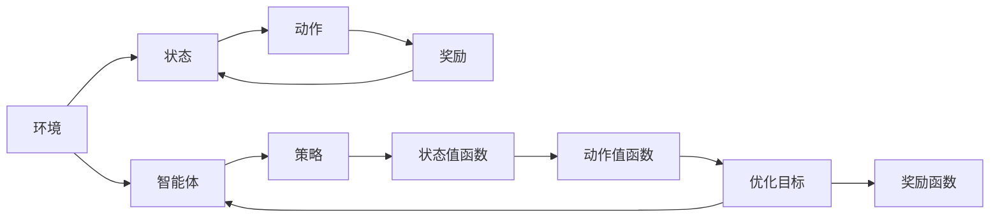

                 

# 一切皆是映射：强化学习的基础概念与核心算法

> 关键词：强化学习，马尔可夫决策过程，Q-learning，深度强化学习，政策梯度方法，多智能体系统，应用场景

## 1. 背景介绍

### 1.1 问题由来
强化学习（Reinforcement Learning, RL）是机器学习（Machine Learning, ML）的重要分支，旨在让智能体（Agent）通过与环境（Environment）的交互，不断学习和优化策略，以最大化累积奖励（Reward）。强化学习的思想来源于心理学和行为科学，常常被用于模拟人的决策过程，如游戏AI、机器人控制、资源分配等。

在传统的监督学习（Supervised Learning）和无监督学习（Unsupervised Learning）之外，强化学习为解决复杂序列决策问题提供了一种全新的视角和方法。通过与环境的交互，智能体不断学习从状态（State）到动作（Action）的映射关系，逐步优化决策策略。

### 1.2 问题核心关键点
强化学习的核心在于找到最优决策策略，使得在给定的状态下，智能体能够执行最优的动作，最大化长期累积奖励。该过程可以通过以下关键问题来概括：

- 1) 环境建模：如何定义环境状态空间和动作空间？
- 2) 策略定义：如何定义智能体的策略？
- 3) 奖励函数：如何设计奖励函数？
- 4) 学习算法：如何选择学习算法？
- 5) 探索与利用平衡：如何解决探索与利用之间的平衡问题？
- 6) 收敛性与稳定性：如何保证学习过程的收敛性和稳定性？

这些问题共同构成了强化学习的核心挑战，也是本博客文章聚焦的重点。

## 2. 核心概念与联系

### 2.1 核心概念概述

为更好地理解强化学习的基本原理，本节将介绍几个核心概念及其相互之间的联系：

- **马尔可夫决策过程（Markov Decision Process, MDP）**：强化学习的基础模型，描述了环境、状态、动作、奖励和转移概率之间的关系。
- **策略（Policy）**：智能体的决策策略，定义了在给定状态下选择动作的概率分布。
- **价值函数（Value Function）**：用于评估状态或动作的价值，帮助智能体选择最优策略。
- **动作值函数（Action Value Function）**：描述在给定状态下采取特定动作的期望奖励。
- **状态值函数（State Value Function）**：描述在给定状态下采取动作的期望总奖励。
- **贝尔曼方程（Bellman Equation）**：用于求解状态值函数和动作值函数的动态关系，是强化学习求解的核心数学工具。

这些概念通过强化学习的过程不断相互作用，形成了一个完整的学习闭环。智能体通过不断的交互，不断更新状态值函数和动作值函数，最终找到最优策略。

### 2.2 核心概念原理和架构的 Mermaid 流程图



这个流程图展示了强化学习的基本流程：

1. 环境（A）提供初始状态（B）。
2. 智能体（E）根据策略（F）选择动作（C），并得到奖励（D）。
3. 环境更新状态（B），智能体观察新状态。
4. 重复步骤2-3，直到终止状态。
5. 智能体通过优化目标（I）和奖励函数（J）更新策略（F）、状态值函数（G）和动作值函数（H）。

这一过程通过不断的迭代，逐步优化智能体的决策策略，最终达到最优效果。

## 3. 核心算法原理 & 具体操作步骤

### 3.1 算法原理概述

强化学习的核心算法包括基于值函数的方法和基于策略的方法。本节将分别介绍这两种方法的基本原理。

**基于值函数的方法**：通过求解状态值函数和动作值函数，帮助智能体学习最优决策策略。常用的算法包括Q-learning和SARSA。

**基于策略的方法**：直接学习智能体的策略，常用的算法包括策略梯度方法和重要性采样。

### 3.2 算法步骤详解

**基于值函数的方法**

1. **初始化**：随机初始化状态值函数和动作值函数。
2. **策略选择**：根据策略选择动作，即 $\epsilon-\text{greedy}$ 策略。
3. **状态值函数更新**：通过当前状态和奖励更新状态值函数。
4. **动作值函数更新**：通过当前状态、动作和奖励更新动作值函数。
5. **迭代优化**：重复上述过程，直到收敛。

**基于策略的方法**

1. **初始化**：随机初始化策略函数。
2. **策略选择**：根据策略选择动作，即 $\epsilon-\text{greedy}$ 策略。
3. **策略更新**：根据动作和奖励更新策略函数的参数。
4. **迭代优化**：重复上述过程，直到收敛。

### 3.3 算法优缺点

**基于值函数的算法**

**优点**：

- 不需要显式定义策略函数。
- 状态值函数和动作值函数提供了系统的全局视角，可以发现全局最优策略。
- 算法简单，易于实现。

**缺点**：

- 状态空间较大时，计算复杂度高。
- 无法直接学习到策略，只能通过值函数间接地学习。
- 收敛速度较慢。

**基于策略的算法**

**优点**：

- 直接学习策略函数，不需要显式定义状态值函数和动作值函数。
- 更新策略的过程相对独立，可以同时处理多个任务。
- 收敛速度较快。

**缺点**：

- 策略函数可能不稳定，容易出现震荡。
- 需要设计有效的探索策略，以避免陷入局部最优。
- 无法直接评估状态值函数和动作值函数。

### 3.4 算法应用领域

强化学习的应用领域非常广泛，涵盖以下几个主要方面：

- **游戏AI**：如AlphaGo、Dota2等，通过强化学习实现高水平的自主决策。
- **机器人控制**：如无人机导航、机器人臂控制等，通过强化学习实现动态环境下的自主导航。
- **资源分配**：如电网调度、供应链管理等，通过强化学习实现资源的最优分配和调度。
- **自然语言处理**：如机器翻译、文本生成等，通过强化学习实现语义理解和生成。
- **金融预测**：如股票交易、风险管理等，通过强化学习实现交易策略和风险评估。

这些领域中，强化学习已经被证明能够在没有明确规则和结构的情况下，自动学习和优化策略，提升系统的性能和效率。

## 4. 数学模型和公式 & 详细讲解 & 举例说明

### 4.1 数学模型构建

强化学习的数学模型可以由以下基本要素构成：

- **状态空间（State Space）**：表示环境当前的状态，通常用 $S$ 表示。
- **动作空间（Action Space）**：表示智能体可以采取的动作，通常用 $A$ 表示。
- **转移概率（Transition Probability）**：表示在给定状态和动作下，环境转移到的下一个状态的概率，通常用 $P(s_{t+1}|s_t,a_t)$ 表示。
- **奖励函数（Reward Function）**：表示智能体在给定状态和动作下，从环境获得的奖励，通常用 $R(s_t,a_t)$ 表示。

这些要素通过强化学习的交互过程，构成了一个马尔可夫决策过程（MDP）。智能体的目标是在给定的状态空间和动作空间下，最大化长期累积奖励。

### 4.2 公式推导过程

以基于值函数的Q-learning算法为例，介绍其公式推导过程。

**状态值函数（Value Function）**：

$$
V(s_t) = \mathbb{E}[\sum_{t'} \gamma^{t'-t} R(s_{t'},a_{t'}) | s_t]
$$

其中，$V(s_t)$ 表示在状态 $s_t$ 下的状态值函数，$\gamma$ 表示折扣因子，$R(s_{t'},a_{t'})$ 表示在状态 $s_{t'}$ 和动作 $a_{t'}$ 下的奖励。

**动作值函数（Action Value Function）**：

$$
Q(s_t,a_t) = \mathbb{E}[\sum_{t'} \gamma^{t'-t} R(s_{t'},a_{t'}) | s_t,a_t]
$$

其中，$Q(s_t,a_t)$ 表示在状态 $s_t$ 和动作 $a_t$ 下的动作值函数。

**贝尔曼方程（Bellman Equation）**：

$$
Q(s_t,a_t) = r + \gamma \mathbb{E}(Q(s_{t+1},a_{t+1})) 
$$

其中，$r$ 表示即时奖励，$\mathbb{E}(Q(s_{t+1},a_{t+1}))$ 表示在下一个状态和动作下的动作值函数期望。

### 4.3 案例分析与讲解

以一个简单的环境为例，考虑一个智能体需要在一维空间内从一个起点移动到终点，智能体每次可以向左或向右移动一个单位，奖励为在终点获得的100分。

- **状态空间**：假设起点为0，终点为10，状态空间为 $S = \{0, 1, 2, \cdots, 10\}$。
- **动作空间**：假设每次可以向左或向右移动一个单位，动作空间为 $A = \{-1, 1\}$。
- **转移概率**：假设每次移动的概率为 $0.5$，即 $\Pr(s_{t+1} = s_t \pm 1) = 0.5$。
- **奖励函数**：如果到达终点，奖励为100分，否则为0分。

在上述环境中，通过Q-learning算法，智能体可以通过不断的交互，学习到最优的移动策略，逐步趋近于100分的累积奖励。

## 5. 项目实践：代码实例和详细解释说明

### 5.1 开发环境搭建

在进行强化学习项目开发前，需要准备好开发环境。以下是使用Python进行OpenAI Gym开发的开发环境配置流程：

1. 安装Anaconda：从官网下载并安装Anaconda，用于创建独立的Python环境。

2. 创建并激活虚拟环境：
```bash
conda create -n rl-env python=3.8 
conda activate rl-env
```

3. 安装OpenAI Gym：
```bash
pip install gym
```

4. 安装TensorFlow或其他深度学习框架：
```bash
pip install tensorflow
```

5. 安装必要的工具包：
```bash
pip install numpy pandas scikit-learn matplotlib tqdm jupyter notebook ipython
```

完成上述步骤后，即可在`rl-env`环境中开始强化学习项目实践。

### 5.2 源代码详细实现

下面以一个简单的Q-learning示例代码为例，介绍如何使用TensorFlow实现强化学习任务。

```python
import gym
import tensorflow as tf
import numpy as np

# 创建环境
env = gym.make('CartPole-v0')

# 定义模型参数
learning_rate = 0.01
discount_factor = 0.95
epsilon = 0.1
num_episodes = 1000
batch_size = 32

# 定义模型
class QNetwork(tf.keras.Model):
    def __init__(self, state_size, action_size):
        super(QNetwork, self).__init__()
        self.fc1 = tf.keras.layers.Dense(24, input_shape=(state_size,), activation=tf.nn.relu)
        self.fc2 = tf.keras.layers.Dense(action_size)

    def call(self, x):
        x = self.fc1(x)
        return self.fc2(x)

# 定义策略函数
def epsilon_greedy(Q_values, state):
    if np.random.rand() < epsilon:
        return np.random.choice(action_size)
    else:
        return np.argmax(Q_values[state])

# 定义训练函数
def train(Q_values, states, actions, rewards, next_states, dones):
    with tf.GradientTape() as tape:
        Q_values_next = Q_network(next_states)
        target_values = rewards + discount_factor * tf.reduce_max(Q_values_next, axis=1)
        expected_values = tf.reduce_sum(target_values * (1 - dones))
        current_values = Q_values[states][actions]
        loss = tf.reduce_mean(tf.square(expected_values - current_values))
    gradients = tape.gradient(loss, Q_values.trainable_variables)
    optimizer.apply_gradients(zip(gradients, Q_values.trainable_variables))

# 初始化Q网络
state_size = env.observation_space.shape[0]
action_size = env.action_space.n
Q_network = QNetwork(state_size, action_size)

# 初始化优化器
optimizer = tf.keras.optimizers.Adam(lr=learning_rate)

# 开始训练
for episode in range(num_episodes):
    state = env.reset()
    done = False
    while not done:
        action = epsilon_greedy(Q_values[0], state)
        next_state, reward, done, _ = env.step(action)
        Q_values[0, action] += learning_rate * (reward + discount_factor * tf.reduce_max(Q_values[0]) - Q_values[0, action])
        state = next_state
    if episode % 100 == 0:
        print('Episode:', episode, 'score:', Q_values[0, np.argmax(Q_values[0])])

# 测试模型
for episode in range(10):
    state = env.reset()
    done = False
    while not done:
        action = np.argmax(Q_values[0])
        next_state, reward, done, _ = env.step(action)
        state = next_state
    print('Episode:', episode, 'score:', Q_values[0, np.argmax(Q_values[0])])
```

### 5.3 代码解读与分析

让我们再详细解读一下关键代码的实现细节：

**环境创建**：

```python
env = gym.make('CartPole-v0')
```

通过Gym库，可以快速创建各种类型的环境，如CartPole、MountainCar、Atari等。

**模型定义**：

```python
class QNetwork(tf.keras.Model):
    def __init__(self, state_size, action_size):
        super(QNetwork, self).__init__()
        self.fc1 = tf.keras.layers.Dense(24, input_shape=(state_size,), activation=tf.nn.relu)
        self.fc2 = tf.keras.layers.Dense(action_size)

    def call(self, x):
        x = self.fc1(x)
        return self.fc2(x)
```

定义一个简单的Q网络模型，包含两个全连接层，分别用于计算状态值和动作值。

**策略函数**：

```python
def epsilon_greedy(Q_values, state):
    if np.random.rand() < epsilon:
        return np.random.choice(action_size)
    else:
        return np.argmax(Q_values[state])
```

策略函数采用 $\epsilon-\text{greedy}$ 方法，根据当前策略和 $\epsilon$ 值选择动作。

**训练函数**：

```python
def train(Q_values, states, actions, rewards, next_states, dones):
    with tf.GradientTape() as tape:
        Q_values_next = Q_network(next_states)
        target_values = rewards + discount_factor * tf.reduce_max(Q_values_next, axis=1)
        expected_values = tf.reduce_sum(target_values * (1 - dones))
        current_values = Q_values[states][actions]
        loss = tf.reduce_mean(tf.square(expected_values - current_values))
    gradients = tape.gradient(loss, Q_values.trainable_variables)
    optimizer.apply_gradients(zip(gradients, Q_values.trainable_variables))
```

训练函数通过反向传播计算Q值，更新模型参数。

**训练循环**：

```python
for episode in range(num_episodes):
    state = env.reset()
    done = False
    while not done:
        action = epsilon_greedy(Q_values[0], state)
        next_state, reward, done, _ = env.step(action)
        Q_values[0, action] += learning_rate * (reward + discount_factor * tf.reduce_max(Q_values[0]) - Q_values[0, action])
        state = next_state
    if episode % 100 == 0:
        print('Episode:', episode, 'score:', Q_values[0, np.argmax(Q_values[0])])
```

在训练过程中，通过与环境的交互，逐步优化Q值，更新策略函数。

**测试模型**：

```python
for episode in range(10):
    state = env.reset()
    done = False
    while not done:
        action = np.argmax(Q_values[0])
        next_state, reward, done, _ = env.step(action)
        state = next_state
    print('Episode:', episode, 'score:', Q_values[0, np.argmax(Q_values[0])])
```

在测试过程中，根据训练好的Q值，直接选择最优动作，观察模型在环境中的表现。

通过上述代码，可以看到，使用TensorFlow实现Q-learning的过程相对简单，可以方便地进行模型训练和测试。

## 6. 实际应用场景

### 6.1 游戏AI

强化学习在游戏AI领域得到了广泛应用，如AlphaGo、星际争霸等，通过强化学习实现了自主决策和高水平竞技。

AlphaGo通过强化学习实现了在围棋领域的人类级水平的下棋能力，其核心技术包括蒙特卡罗树搜索和深度强化学习。通过大量的训练和自我对弈，AlphaGo学会了复杂的棋局策略，最终在围棋比赛中战胜了人类顶尖选手。

### 6.2 机器人控制

强化学习在机器人控制领域也有着广泛应用，如无人机导航、机器人臂控制等。通过强化学习，机器人能够在复杂动态环境中自主导航和完成任务。

例如，Liljae使用强化学习实现了无人机的自主导航和避障，通过训练Q网络，无人机能够识别障碍物并自动绕行。

### 6.3 资源分配

强化学习在资源分配领域也有着重要应用，如电网调度、供应链管理等。通过强化学习，可以在动态环境中实现最优资源分配和调度。

例如，Marinou等通过强化学习实现了电网负荷的实时优化调度，通过训练Q网络，智能体能够根据电力需求和生产情况，实时调整发电和输电策略，从而实现电网的优化运行。

### 6.4 未来应用展望

未来，强化学习的应用领域将更加广泛，涵盖以下几个方向：

1. **多智能体系统**：多智能体系统是强化学习的扩展，涉及到多个智能体之间的交互和协作，如无人驾驶、城市交通等。通过多智能体系统的研究，可以实现更加智能化的协作和决策。

2. **多目标优化**：强化学习可以同时优化多个目标，如工业生产、物流调度等。通过多目标优化，可以实现系统的高效运行和资源的最优分配。

3. **迁移学习**：通过迁移学习，可以将已有的知识迁移到新的任务上，从而实现快速学习和任务适应。

4. **元学习**：元学习通过学习学习过程，实现快速适应新任务的能力，具有重要的应用前景。

5. **深度强化学习**：深度强化学习通过深度神经网络进行策略学习，可以处理更加复杂的问题，如自然语言处理、图像识别等。

这些方向的探索，将进一步推动强化学习的应用和发展，为智能系统和自动化决策提供更加强大的支持。

## 7. 工具和资源推荐

### 7.1 学习资源推荐

为了帮助开发者系统掌握强化学习的理论基础和实践技巧，这里推荐一些优质的学习资源：

1. 《Reinforcement Learning: An Introduction》：Sutton和Barto的经典教材，详细介绍了强化学习的各个方面，适合作为强化学习的入门读物。

2. 《Deep Reinforcement Learning with Python》：Gyani和Charron的实用教程，通过代码实例和实验，系统介绍了深度强化学习的方法和技巧。

3. 《Hands-On Deep Reinforcement Learning with TensorFlow》：GitamWiki的实用教程，通过TensorFlow实现深度强化学习，适合作为实践入门的工具书。

4. 强化学习课程：Coursera和edX等在线平台上的强化学习课程，如Russell和Norvig的强化学习课程，系统介绍了强化学习的理论和算法。

5. OpenAI Gym官方文档：Gym库的官方文档，提供了丰富的环境和算法示例，适合作为实战练习的工具。

通过这些学习资源，相信你一定能够快速掌握强化学习的基本概念和实践技巧，并应用于各种实际问题中。

### 7.2 开发工具推荐

高效的开发离不开优秀的工具支持。以下是几款用于强化学习开发的常用工具：

1. OpenAI Gym：Gym库提供了丰富的环境模拟工具，方便进行强化学习实验。

2. TensorFlow和PyTorch：这两个深度学习框架支持自动微分和优化器，适合实现各种强化学习算法。

3. Ray：一个分布式机器学习框架，适合进行大规模并行训练。

4. Jupyter Notebook：一个轻量级的交互式编程环境，方便进行实验和分享代码。

5. TensorBoard：TensorFlow的可视化工具，可以实时监测模型训练状态，提供丰富的图表支持。

合理利用这些工具，可以显著提升强化学习项目的开发效率，加快创新迭代的步伐。

### 7.3 相关论文推荐

强化学习的研究离不开相关论文的指引。以下是几篇经典论文，推荐阅读：

1. Q-Learning：Watkins和Precup的经典论文，介绍Q-learning算法，奠定了强化学习的基础。

2. Deep Q-Learning：Mnih等人的论文，通过深度神经网络实现了Q-learning算法，大幅提升了强化学习的性能。

3. Policy Gradient Methods for General Reinforcement Learning：Sutton等人的论文，介绍政策梯度算法，通过直接优化策略函数，提升了强化学习的收敛速度。

4. Trust Region Policy Optimization（TRPO）：Schulman等人的论文，提出了一种新型的策略优化算法，通过引入信任区域和梯度裁剪，提高了优化算法的稳定性。

5. Proximal Policy Optimization（PPO）：Schulman等人的论文，提出了一种新型的策略优化算法，通过引入正则化和梯度裁剪，进一步提升了优化算法的性能。

这些论文代表了强化学习的发展脉络，通过学习这些前沿成果，可以帮助研究者把握学科前进方向，激发更多的创新灵感。

## 8. 总结：未来发展趋势与挑战

### 8.1 总结

本文对强化学习的核心概念和算法进行了系统介绍，帮助读者理解强化学习的原理和应用。通过背景介绍、核心概念、算法原理、实际操作和应用场景等环节，详细讲解了强化学习的各个方面。

通过本文的系统梳理，可以看到，强化学习为复杂决策问题提供了新的解决方案，其核心在于通过与环境的交互，逐步优化决策策略，从而实现最优目标。在未来，强化学习将会在更多领域得到应用，为智能系统和自动化决策提供更加强大的支持。

### 8.2 未来发展趋势

展望未来，强化学习的发展趋势如下：

1. **深度强化学习**：通过深度神经网络进行策略学习，处理更加复杂的问题，如自然语言处理、图像识别等。

2. **多智能体系统**：研究多个智能体之间的协作和决策，实现更加智能化的任务执行。

3. **迁移学习和元学习**：通过迁移学习，快速适应新任务，通过元学习，实现快速学习和任务适应。

4. **多目标优化**：通过优化多个目标，实现系统的综合优化。

5. **理论突破**：强化学习的理论研究将进一步深入，推动算法设计和优化，提升性能和效率。

6. **应用拓展**：强化学习将在更多领域得到应用，如工业控制、城市交通等，提升系统的智能化水平。

以上趋势凸显了强化学习技术的广阔前景，这些方向的探索，将进一步推动强化学习的创新和发展，为智能系统和自动化决策提供更加强大的支持。

### 8.3 面临的挑战

尽管强化学习取得了显著进展，但仍面临诸多挑战：

1. **模型复杂性**：随着模型复杂性的增加，训练和优化过程变得更加困难，需要更多的计算资源。

2. **学习效率**：在大规模和复杂环境中，强化学习的学习效率和收敛速度仍然是一个重要问题，需要进一步优化。

3. **探索与利用平衡**：在探索新动作和利用已有知识之间找到平衡，是强化学习的关键难题。

4. **数据效率**：强化学习需要大量的样本数据进行训练，数据效率问题仍然是一个挑战。

5. **鲁棒性**：强化学习模型在面对环境变化和噪声干扰时，鲁棒性不足，需要进一步提升。

6. **安全性**：强化学习模型可能会学习到有害的行为策略，需要进一步加强安全性研究。

这些挑战需要学界和工业界的共同努力，才能进一步推动强化学习的发展和应用。

### 8.4 研究展望

面对强化学习所面临的诸多挑战，未来的研究需要在以下几个方向寻求新的突破：

1. **算法优化**：进一步优化强化学习算法，提高学习效率和鲁棒性。

2. **模型简化**：通过模型简化和压缩技术，降低模型复杂性，提高计算效率。

3. **数据增强**：通过数据增强技术，提高数据效率，加速模型训练。

4. **鲁棒性研究**：研究强化学习的鲁棒性和泛化性，增强模型对环境变化的适应能力。

5. **安全性保障**：研究强化学习的安全性问题，确保模型行为的可控性和安全性。

6. **应用拓展**：将强化学习应用于更多领域，提升系统的智能化水平和效率。

这些研究方向的研究成果，必将推动强化学习技术的不断发展和成熟，为智能系统和自动化决策提供更加强大的支持。

## 9. 附录：常见问题与解答

**Q1：强化学习是否只能用于游戏和机器人？**

A: 强化学习的应用领域非常广泛，不仅限于游戏和机器人。如自然语言处理、金融预测、资源分配等，都可以通过强化学习来实现。

**Q2：强化学习是否需要大量数据进行训练？**

A: 强化学习确实需要大量的数据进行训练，但数据生成方法也在不断改进，如数据合成、多目标优化等，可以部分缓解数据不足的问题。

**Q3：强化学习是否可以应用于大规模系统？**

A: 强化学习可以应用于大规模系统，但需要考虑系统的复杂性和数据效率问题，如分布式训练、多目标优化等。

**Q4：强化学习是否可以避免灾难性遗忘？**

A: 强化学习可以通过经验回放、多重路径探索等方法，避免灾难性遗忘，提高模型的泛化能力。

**Q5：强化学习是否可以用于处理不确定性问题？**

A: 强化学习可以处理不确定性问题，如通过引入贝尔曼方程、动态规划等方法，处理动态环境下的决策问题。

通过本文的系统梳理，可以看到，强化学习为复杂决策问题提供了新的解决方案，其核心在于通过与环境的交互，逐步优化决策策略，从而实现最优目标。在未来，强化学习将会在更多领域得到应用，为智能系统和自动化决策提供更加强大的支持。

---

作者：禅与计算机程序设计艺术 / Zen and the Art of Computer Programming

