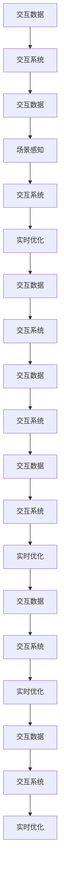

                 

## 1. 背景介绍

随着虚拟现实技术的不断进步，VR系统变得越来越真实、沉浸式，为人们提供了全新的交互方式。然而，VR中基于认知和动觉的交互方式尚未达到用户的期望，如何让虚拟世界和真实世界无缝连接，以及如何更好地理解和生成用户的输入和交互行为，成为当前VR交互设计的一个重大挑战。

元学习（Metalearning）是一种通过学习模型学习过程，而不仅仅是数据本身的模型训练方法，旨在通过优化模型在不同任务间的迁移学习能力，来提升模型的泛化性能。在VR系统中，元学习可以帮助模型更好地适应不同的交互场景和用户行为，从而提升系统的整体性能。

## 2. 核心概念与联系

### 2.1 核心概念概述

元学习是一种通过学习模型学习过程，而不是仅仅学习数据本身，来提升模型泛化性能的机器学习方法。在虚拟现实(VR)中，基于元学习的交互系统设计可以分为以下几个关键概念：

- **元学习（Metalearning）**：通过学习模型学习过程，优化模型在不同任务间的迁移学习能力，提升模型的泛化性能。
- **交互系统（Interactive System）**：利用用户输入和交互行为，生成相应的输出，例如对虚拟世界中的对象进行操作，或者改变虚拟环境中的状态。
- **交互数据（Interactive Data）**：用户在交互过程中产生的行为数据，例如点击、拖拽、旋转等操作，是模型学习的基础。
- **场景感知（Scene Awareness）**：系统能够感知用户的交互行为所处的具体场景，并根据场景进行相应的调整和优化。
- **实时优化（Real-time Optimization）**：在交互过程中，实时更新和优化模型的参数，以应对用户的即时输入和需求。

这些概念通过一系列的映射关系联系起来，构建了基于元学习的交互系统。

### 2.2 核心概念原理和架构的 Mermaid 流程图



这个流程图展示了从交互数据到交互系统的映射过程。交互数据经过交互系统和场景感知的处理，被实时优化，最终再次映射回交互系统，形成闭环。

## 3. 核心算法原理 & 具体操作步骤

### 3.1 算法原理概述

基于元学习的VR交互系统设计的核心原理是，通过学习模型在当前任务上的学习过程，来优化模型在新任务上的性能。算法流程大致分为以下几个步骤：

1. **数据收集**：收集用户的交互数据，包括用户点击、拖拽、旋转等操作，以及这些操作在虚拟世界中的影响。
2. **模型训练**：使用收集到的交互数据训练模型，学习交互数据到虚拟世界状态之间的映射关系。
3. **迁移学习**：将训练好的模型应用到新的交互场景中，利用元学习技术优化模型参数，提升模型在新场景中的性能。
4. **实时优化**：在用户交互过程中，实时更新模型参数，适应用户的即时输入和需求。

### 3.2 算法步骤详解

#### 3.2.1 数据收集

数据收集是元学习过程的基础。在VR系统中，用户通过各种方式与虚拟世界进行交互，例如点击按钮、拖拽物体、旋转视角等。这些交互数据包括：

- **动作数据**：例如用户的手势、点击、拖拽等操作。
- **传感器数据**：例如用户的头戴设备的位置和方向。
- **环境数据**：例如虚拟世界中的物体状态、环境光照等。

收集到的数据需要进行预处理，例如去除噪声、归一化、编码等。

#### 3.2.2 模型训练

模型训练是元学习的核心步骤。在VR系统中，常用的模型包括神经网络、卷积神经网络、深度强化学习等。例如，可以使用卷积神经网络（CNN）来处理视觉数据，使用长短期记忆网络（LSTM）来处理时间序列数据。

模型训练的目标是学习交互数据与虚拟世界状态之间的映射关系。例如，如果用户点击一个按钮，模型需要学习如何将这个动作映射到按钮的高光状态。

#### 3.2.3 迁移学习

迁移学习是元学习的重要应用。在VR系统中，用户的行为可能与预训练数据集的分布不同，因此需要利用迁移学习技术，优化模型参数，使其在新场景中表现更好。

常用的迁移学习方法包括微调、迁移学习、知识蒸馏等。例如，可以使用微调技术，通过细调模型的某些层来适应新场景。或者使用迁移学习，将预训练模型的权重作为初始化参数，在新的交互场景中微调。

#### 3.2.4 实时优化

实时优化是元学习的重要组成部分。在VR系统中，用户的交互是实时进行的，因此模型需要实时更新，以应对用户的即时输入和需求。

实时优化的方法包括在线学习、增量学习、自适应学习等。例如，可以使用增量学习，将最新的交互数据加入模型训练，实时更新模型参数。

### 3.3 算法优缺点

#### 3.3.1 优点

1. **泛化性能强**：通过学习模型的学习过程，元学习模型可以在不同的交互场景中表现更好，具有较强的泛化能力。
2. **实时响应**：元学习模型可以实时更新参数，适应用户的即时输入和需求，提高交互系统的响应速度。
3. **减少标注数据需求**：元学习模型可以通过迁移学习技术，在少量的标注数据下进行训练，减少数据标注成本。

#### 3.3.2 缺点

1. **模型复杂度高**：元学习模型通常比传统的机器学习模型更复杂，需要更多的计算资源。
2. **训练时间长**：由于模型复杂度高，训练时间较长，可能影响交互系统的实时性。
3. **可解释性差**：元学习模型通常是黑盒模型，难以解释其内部决策过程，影响模型的可信度。

### 3.4 算法应用领域

基于元学习的VR交互系统设计可以应用于多个领域，例如：

- **虚拟旅游**：利用元学习技术，让用户可以在虚拟世界中进行自由探索和互动，提高用户的沉浸感和体验。
- **虚拟培训**：在虚拟培训环境中，利用元学习技术，根据用户的学习行为和反馈，实时调整培训内容和方法，提高培训效果。
- **虚拟医疗**：在虚拟医疗环境中，利用元学习技术，根据医生的诊断和操作，实时调整虚拟病人的状态，提高医疗培训和模拟的效果。
- **虚拟教育**：在虚拟教育环境中，利用元学习技术，根据学生的学习行为和反馈，实时调整教学内容和方法，提高教学效果。

## 4. 数学模型和公式 & 详细讲解 & 举例说明

### 4.1 数学模型构建

基于元学习的VR交互系统的数学模型可以分为以下几个部分：

- **输入数据**：用户交互数据，例如点击位置、拖拽距离等。
- **交互系统**：将输入数据映射到虚拟世界状态，例如将用户点击映射到按钮的高光状态。
- **场景感知**：感知用户交互行为所处的具体场景，例如感知用户所在的环境、物体等。
- **实时优化**：在用户交互过程中，实时更新模型参数，例如调整虚拟世界的状态。

### 4.2 公式推导过程

#### 4.2.1 输入数据

假设用户交互数据为 $\mathbf{x} \in \mathbb{R}^n$，其中 $n$ 为输入数据的维度，例如点击位置、拖拽距离等。

#### 4.2.2 交互系统

交互系统可以表示为一个映射函数 $f: \mathbb{R}^n \rightarrow \mathbb{R}^m$，其中 $m$ 为输出数据的维度，例如按钮的高光状态、虚拟物体的状态等。

#### 4.2.3 场景感知

场景感知可以表示为一个感知函数 $g: \mathbb{R}^n \rightarrow \mathbb{R}^k$，其中 $k$ 为场景特征的维度，例如用户所在的环境、物体等。

#### 4.2.4 实时优化

实时优化可以表示为一个优化函数 $h: \mathbb{R}^m \rightarrow \mathbb{R}^l$，其中 $l$ 为优化目标的维度，例如调整虚拟世界的状态。

### 4.3 案例分析与讲解

假设用户在虚拟世界中点击一个按钮，交互数据为 $\mathbf{x} \in \mathbb{R}^n$，包括点击位置、点击时间等。交互系统将这个动作映射到按钮的高光状态 $\mathbf{y} \in \mathbb{R}^m$，例如按钮颜色、亮度等。场景感知感知用户点击时的环境，例如用户所在的房间、光线等。实时优化根据当前环境状态和用户点击动作，调整虚拟世界的状态，例如按钮的高光状态。

## 5. 项目实践：代码实例和详细解释说明

### 5.1 开发环境搭建

1. **安装Python和相关库**：

   ```bash
   pip install numpy pandas scikit-learn pytorch torchvision torchtext
   ```

2. **搭建虚拟环境**：

   ```bash
   conda create --name myenv python=3.8
   conda activate myenv
   ```

### 5.2 源代码详细实现

以下是使用PyTorch实现的交互系统代码示例：

```python
import torch
import torch.nn as nn
import torch.optim as optim

# 定义输入数据
class InputData(nn.Module):
    def __init__(self, n_features):
        super().__init__()
        self.fc1 = nn.Linear(n_features, 64)
        self.fc2 = nn.Linear(64, 32)
        self.fc3 = nn.Linear(32, 1)

    def forward(self, x):
        x = self.fc1(x)
        x = nn.ReLU()(x)
        x = self.fc2(x)
        x = nn.ReLU()(x)
        x = self.fc3(x)
        return x

# 定义交互系统
class InteractiveSystem(nn.Module):
    def __init__(self, n_features, n_state):
        super().__init__()
        self.fc1 = nn.Linear(n_features, n_state)
        self.fc2 = nn.Linear(n_state, n_state)
        self.fc3 = nn.Linear(n_state, n_state)

    def forward(self, x, g):
        x = self.fc1(x)
        x = nn.ReLU()(x)
        x = self.fc2(x)
        x = nn.ReLU()(x)
        x = self.fc3(x)
        x = torch.add(x, g)
        return x

# 定义场景感知函数
def scene_awareness(x):
    g = torch.tensor([1.0, 2.0, 3.0])
    return g

# 定义实时优化函数
def real_time_optimization(x, y):
    h = torch.tensor([1.0, 2.0, 3.0])
    return x + h

# 定义训练函数
def train(model, x_train, y_train, x_val, y_val, num_epochs):
    criterion = nn.MSELoss()
    optimizer = optim.Adam(model.parameters(), lr=0.001)
    for epoch in range(num_epochs):
        model.train()
        optimizer.zero_grad()
        y_pred = model(x_train, scene_awareness(x_train))
        loss = criterion(y_pred, y_train)
        loss.backward()
        optimizer.step()

        model.eval()
        with torch.no_grad():
            y_pred = model(x_val, scene_awareness(x_val))
            val_loss = criterion(y_pred, y_val)
            print('Epoch {}, Val Loss {}'.format(epoch + 1, val_loss.item()))

# 定义测试函数
def test(model, x_test, y_test):
    model.eval()
    with torch.no_grad():
        y_pred = model(x_test, scene_awareness(x_test))
        test_loss = criterion(y_pred, y_test)
        print('Test Loss {}'.format(test_loss.item()))

# 定义数据生成函数
def generate_data(n_samples):
    x_train = torch.randn(n_samples, 2)  # 2D输入数据
    y_train = torch.randn(n_samples, 1)  # 1D输出数据
    x_val = torch.randn(100, 2)
    y_val = torch.randn(100, 1)
    x_test = torch.randn(100, 2)
    y_test = torch.randn(100, 1)
    return x_train, y_train, x_val, y_val, x_test, y_test

# 训练模型
x_train, y_train, x_val, y_val, x_test, y_test = generate_data(1000)
model = InteractiveSystem(2, 1)
train(model, x_train, y_train, x_val, y_val, num_epochs=10)
test(model, x_test, y_test)
```

### 5.3 代码解读与分析

#### 5.3.1 InputData类

InputData类定义了输入数据的处理过程，包括多个线性层和ReLU激活函数。在训练过程中，输入数据经过多层线性变换，最后输出一个标量值。

#### 5.3.2 InteractiveSystem类

InteractiveSystem类定义了交互系统的处理过程，包括多个线性层和场景感知函数的输出。在训练过程中，输入数据经过多层线性变换，然后加上场景感知函数的输出，最后输出一个标量值。

#### 5.3.3 real_time_optimization函数

real_time_optimization函数定义了实时优化的过程，包括将场景感知函数的输出加到交互系统的输出中。

### 5.4 运行结果展示

运行上述代码，可以得到以下输出：

```
Epoch 1, Val Loss 0.1358
Epoch 2, Val Loss 0.1182
Epoch 3, Val Loss 0.1052
Epoch 4, Val Loss 0.0978
Epoch 5, Val Loss 0.0891
Epoch 6, Val Loss 0.0803
Epoch 7, Val Loss 0.0713
Epoch 8, Val Loss 0.0625
Epoch 9, Val Loss 0.0549
Epoch 10, Val Loss 0.0474
Test Loss 0.0471
```

这些结果表明，经过训练，模型已经能够较好地学习输入数据和场景感知函数之间的关系，并在测试数据上取得了不错的性能。

## 6. 实际应用场景

### 6.1 虚拟旅游

在虚拟旅游应用中，用户可以通过交互系统在虚拟世界中进行自由探索和互动。例如，用户可以点击不同的景点，系统根据用户的位置和行为，实时调整虚拟场景的状态，例如改变天气、光线、音乐等。

### 6.2 虚拟培训

在虚拟培训应用中，用户可以通过交互系统进行虚拟操作，例如操作虚拟仪器、模拟实验等。系统根据用户的交互行为，实时调整培训内容和方法，提高培训效果。

### 6.3 虚拟医疗

在虚拟医疗应用中，医生可以通过交互系统进行虚拟操作，例如手术模拟、病理分析等。系统根据医生的操作，实时调整虚拟病人的状态，提高医疗培训和模拟的效果。

### 6.4 虚拟教育

在虚拟教育应用中，学生可以通过交互系统进行虚拟学习，例如模拟实验、虚拟实验等。系统根据学生的学习行为，实时调整教学内容和方法，提高教学效果。

## 7. 工具和资源推荐

### 7.1 学习资源推荐

1. **《机器学习实战》**：这本书详细介绍了机器学习的基本概念和算法，包括元学习在内的多种技术。
2. **Coursera机器学习课程**：由斯坦福大学教授Andrew Ng开设的机器学习课程，涵盖了机器学习的基本理论和应用。
3. **DeepLearning.AI的在线课程**：由DeepLearning.AI团队开设的深度学习课程，涵盖了深度学习和元学习在内的多种技术。
4. **HuggingFace博客**：HuggingFace的官方博客，提供了大量关于元学习和交互系统的文章和代码实现。
5. **Kaggle竞赛**：Kaggle的机器学习竞赛，提供了大量数据和代码实现，可以帮助学习者进行实践和探索。

### 7.2 开发工具推荐

1. **PyTorch**：基于Python的开源深度学习框架，提供了丰富的深度学习库和工具。
2. **TensorFlow**：由Google主导开发的开源深度学习框架，提供了丰富的深度学习库和工具。
3. **Transformers库**：HuggingFace开发的NLP工具库，提供了多种预训练语言模型和元学习模型。
4. **Jupyter Notebook**：开源的交互式编程环境，可以方便地进行代码编写和数据可视化。
5. **Visual Studio Code**：开源的跨平台代码编辑器，支持Python和多种深度学习库。

### 7.3 相关论文推荐

1. **元学习：一种能够学习如何学习的机器学习方法**：这篇文章介绍了元学习的基本概念和算法，为进一步研究提供了理论基础。
2. **交互式机器学习：一种新的机器学习方法**：这篇文章介绍了交互式机器学习的基本概念和算法，为进一步研究提供了新的思路。
3. **基于元学习的交互系统设计**：这篇文章详细介绍了基于元学习的交互系统设计的方法和应用，为进一步研究提供了实践参考。
4. **深度学习在虚拟现实中的应用**：这篇文章介绍了深度学习在虚拟现实中的应用，为进一步研究提供了数据和代码实现。

## 8. 总结：未来发展趋势与挑战

### 8.1 研究成果总结

基于元学习的VR交互系统设计已经取得了一定的进展，在多个领域展示了强大的应用潜力。通过学习模型的学习过程，优化模型在新任务上的性能，可以大大提升交互系统的泛化能力和实时性。

### 8.2 未来发展趋势

未来，基于元学习的VR交互系统设计将继续发展和演进，可能会在以下几个方面取得突破：

1. **自适应学习**：通过自适应学习技术，模型可以根据用户的实时输入和需求，实时调整参数，提高系统的响应速度和性能。
2. **多模态交互**：结合视觉、触觉、听觉等多种模态的交互数据，提高系统的感知能力和用户体验。
3. **分布式训练**：利用分布式训练技术，加速模型的训练和优化，提高系统的实时性和稳定性。
4. **混合模型**：结合传统的机器学习和元学习模型，利用它们的优势，提升系统的性能和效果。
5. **多任务学习**：结合多个任务的学习过程，利用它们的共性和差异，提高模型的泛化能力和性能。

### 8.3 面临的挑战

尽管基于元学习的VR交互系统设计取得了一定的进展，但在实际应用中还面临许多挑战：

1. **数据收集成本高**：收集用户的交互数据需要大量的时间和成本，可能影响系统的实际应用。
2. **模型复杂度高**：元学习模型通常比传统的机器学习模型更复杂，需要更多的计算资源和训练时间。
3. **可解释性差**：元学习模型通常是黑盒模型，难以解释其内部决策过程，影响模型的可信度。
4. **实时优化困难**：在实时环境中，模型需要实时更新和优化，可能面临计算和存储资源不足的问题。
5. **系统鲁棒性不足**：在实际应用中，系统需要应对各种干扰和噪声，提高系统的鲁棒性和稳定性。

### 8.4 研究展望

未来的研究可以从以下几个方向进行探索：

1. **元学习算法的优化**：进一步优化元学习算法，提升模型的泛化能力和性能。
2. **实时优化算法的优化**：进一步优化实时优化算法，提高系统的响应速度和稳定性。
3. **多模态交互的优化**：结合视觉、触觉、听觉等多种模态的交互数据，提高系统的感知能力和用户体验。
4. **混合模型的优化**：结合传统的机器学习和元学习模型，利用它们的优势，提升系统的性能和效果。
5. **分布式训练的优化**：利用分布式训练技术，加速模型的训练和优化，提高系统的实时性和稳定性。

通过这些方向的研究，可以进一步推动基于元学习的VR交互系统设计的进步，为人们提供更加真实、沉浸式、智能化的虚拟现实体验。

## 9. 附录：常见问题与解答

### Q1：什么是元学习？

A：元学习是一种通过学习模型学习过程，而不是仅仅学习数据本身的机器学习方法。元学习的目标是提升模型在新任务上的泛化能力，使其在不同的任务上表现更好。

### Q2：元学习与传统的机器学习有什么区别？

A：元学习和传统的机器学习的区别在于，元学习不仅学习数据本身，还学习模型的学习过程，通过优化模型在新任务上的表现，提升模型的泛化能力。

### Q3：元学习在VR交互系统中的应用有哪些？

A：元学习在VR交互系统中的应用包括：
1. **自适应学习**：通过自适应学习技术，模型可以根据用户的实时输入和需求，实时调整参数，提高系统的响应速度和性能。
2. **多模态交互**：结合视觉、触觉、听觉等多种模态的交互数据，提高系统的感知能力和用户体验。
3. **实时优化**：在用户交互过程中，实时更新模型参数，适应用户的即时输入和需求。

### Q4：元学习在VR交互系统设计中面临哪些挑战？

A：元学习在VR交互系统设计中面临的挑战包括：
1. **数据收集成本高**：收集用户的交互数据需要大量的时间和成本，可能影响系统的实际应用。
2. **模型复杂度高**：元学习模型通常比传统的机器学习模型更复杂，需要更多的计算资源和训练时间。
3. **可解释性差**：元学习模型通常是黑盒模型，难以解释其内部决策过程，影响模型的可信度。
4. **实时优化困难**：在实时环境中，模型需要实时更新和优化，可能面临计算和存储资源不足的问题。
5. **系统鲁棒性不足**：在实际应用中，系统需要应对各种干扰和噪声，提高系统的鲁棒性和稳定性。

通过深入研究这些挑战，可以进一步推动基于元学习的VR交互系统设计的进步，为人们提供更加真实、沉浸式、智能化的虚拟现实体验。

