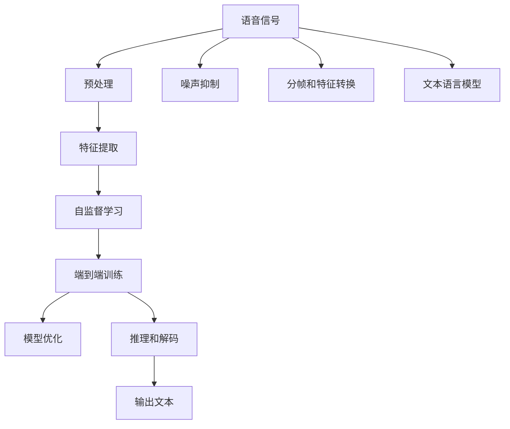

                 

## 1. 背景介绍

### 1.1 问题由来

语音识别技术是人工智能领域中的重要分支，它通过将人类语言转化为计算机可处理的形式，实现了人机交互的革命性突破。然而，传统的语音识别方法主要依赖手工设计的特征和统计模型，计算复杂度高，适应性差。随着深度学习技术的兴起，语音识别开始迈入基于神经网络的AI转型阶段。

### 1.2 问题核心关键点

AI转型的语音识别技术，基于深度学习神经网络模型，通过自动化的特征学习和模式识别，显著提升了语音识别的准确性和鲁棒性。其中，最核心的转变是引入了端到端的训练方式，即直接从语音信号到文本序列的映射，消除了中间人工特征工程的过程，大幅提升了系统效率和性能。

当前，AI转型的语音识别技术已经在智能音箱、语音助手、电话客服等众多应用中取得了广泛应用。然而，尽管在技术上取得了巨大进展，但在实际部署和应用中仍面临诸多挑战，如计算资源需求高、噪音环境适应性差、低资源环境部署困难等。因此，探索更为高效、普适的语音识别技术，成为当前AI转型领域的重要课题。

## 2. 核心概念与联系

### 2.1 核心概念概述

为更好地理解语音识别技术的AI转型过程，本节将介绍几个密切相关的核心概念：

- 语音识别（Speech Recognition）：将人类语音转化为计算机可读文本的过程，是实现人机自然交互的关键技术。
- 深度学习（Deep Learning）：基于多层神经网络的机器学习技术，可以自动学习输入数据的复杂特征表示，广泛应用于图像、语音、自然语言处理等领域。
- 端到端（End-to-End）：指从输入到输出的全流程自动化处理方式，不需要人工设计中间特征。
- 语音信号处理（Speech Signal Processing）：将语音信号进行预处理、特征提取、信号处理等步骤，为语音识别提供输入。
- 自监督学习（Self-Supervised Learning）：利用无标签数据进行模型训练，提升模型泛化能力。

这些核心概念之间的逻辑关系可以通过以下Mermaid流程图来展示：



这个流程图展示了语音识别技术的核心流程：

1. 语音信号经过预处理、特征提取和分帧等步骤，得到模型所需的输入。
2. 利用自监督学习方式，对模型进行预训练。
3. 通过端到端训练，将语音信号直接转化为文本输出。
4. 对训练好的模型进行优化和推理，最终得到识别结果。

这些核心概念共同构成了语音识别技术的AI转型框架，使其能够高效、鲁棒地进行语音识别。通过理解这些核心概念，我们可以更好地把握语音识别技术的本质和关键步骤。

## 3. 核心算法原理 & 具体操作步骤
### 3.1 算法原理概述

语音识别技术的AI转型，本质上是利用深度学习模型，对语音信号进行端到端的自动特征学习，直接映射到文本序列的映射过程。其核心思想是：通过自动化的特征提取和模式识别，去除人工设计特征的过程，提升识别准确性和鲁棒性。

形式化地，假设输入语音信号为 $x$，输出文本序列为 $y$，则语音识别模型 $M_{\theta}$ 的训练目标为最小化损失函数 $\mathcal{L}(x, y)$，即：

$$
\theta^* = \mathop{\arg\min}_{\theta} \mathcal{L}(x, y)
$$

其中，$\mathcal{L}(x, y)$ 为模型在给定输入 $x$ 和目标输出 $y$ 上的损失函数。常见的损失函数包括交叉熵损失、序列对比损失等。

通过梯度下降等优化算法，模型不断更新参数 $\theta$，最小化损失函数 $\mathcal{L}(x, y)$，使得模型输出逼近真实标签 $y$。由于深度学习模型通过大量数据进行训练，能够自动学习到丰富的语音特征表示，因此即便在噪声环境或低资源环境中，也能保持较好的识别效果。

### 3.2 算法步骤详解

语音识别技术的AI转型主要包括以下几个关键步骤：

**Step 1: 语音信号预处理**
- 对输入语音信号进行预处理，包括去噪、分帧、预加重、语音增强等操作，使得信号适合后续处理。

**Step 2: 特征提取**
- 将预处理后的语音信号转换为模型所需的特征表示，如MFCC、梅尔倒谱系数等。

**Step 3: 自监督学习**
- 利用无标签数据进行模型预训练，通过自监督学习任务，如预测语音帧之间的重叠、语音信号的能量等，学习到语音特征的泛化表示。

**Step 4: 端到端训练**
- 在自监督学习的基础上，将语音信号直接输入模型进行端到端训练，学习从信号到文本的映射。

**Step 5: 模型优化**
- 在自监督学习和端到端训练后，通过有标签数据对模型进行进一步优化，提升模型在特定任务上的性能。

**Step 6: 推理和解码**
- 将优化后的模型应用于新的语音信号，通过推理和解码，得到最终的文本输出。

以上是语音识别技术的AI转型的一般流程。在实际应用中，还需要针对具体任务的特点，对预处理、特征提取、模型训练等环节进行优化设计，如引入改进的分帧方法、设计更适合任务的自监督学习任务等，以进一步提升识别效果。

### 3.3 算法优缺点

语音识别技术的AI转型方法具有以下优点：

1. 自动化特征提取：深度学习模型自动学习语音特征表示，去除手工设计特征的过程，提高系统灵活性和泛化能力。
2. 端到端训练：从语音信号到文本序列的直接映射，减少中间过程，提升系统效率和准确性。
3. 鲁棒性提升：通过深度学习模型的自适应能力，提升模型对噪声、口音等环境的鲁棒性。
4. 普适性增强：端到端模型结构简单，易于部署和优化，适用于各种资源和硬件环境。

同时，该方法也存在一定的局限性：

1. 计算资源需求高：深度学习模型需要大量计算资源进行训练和推理，对于资源有限的环境，难以部署。
2. 模型训练时间长：深度学习模型需要大量数据和计算时间进行训练，训练时间较长。
3. 可解释性不足：深度学习模型通常被视为"黑盒"系统，难以解释其内部工作机制和推理过程。

尽管存在这些局限性，但就目前而言，端到端的语音识别技术仍然是大规模应用中最主流的范式。未来相关研究的重点在于如何进一步降低计算资源需求，提高模型训练效率，同时兼顾可解释性和伦理安全性等因素。

### 3.4 算法应用领域

语音识别技术的AI转型，已经在智能音箱、语音助手、电话客服、语音翻译等众多领域得到了广泛应用。具体而言：

- 智能音箱：如亚马逊Echo、谷歌Home等，通过语音识别技术，实现语音交互和指令执行。
- 语音助手：如苹果Siri、微软Cortana等，通过语音识别技术，提供个性化语音服务。
- 电话客服：如阿里巴巴、中国移动等，通过语音识别技术，实现自动语音应答。
- 语音翻译：如谷歌翻译、百度翻译等，通过语音识别技术，实现实时语音翻译。

除了上述这些经典应用外，语音识别技术还被创新性地应用到更多场景中，如医疗记录、交通管理、智能家居等，为人们的生活带来了极大的便利。随着深度学习模型的不断进步，语音识别技术必将在更广阔的应用领域大放异彩。

## 4. 数学模型和公式 & 详细讲解  
### 4.1 数学模型构建

本节将使用数学语言对语音识别技术的AI转型过程进行更加严格的刻画。

记输入语音信号为 $x$，输出文本序列为 $y$，语音识别模型为 $M_{\theta}$，其中 $\theta$ 为模型参数。假设语音信号 $x$ 和文本序列 $y$ 的长度分别为 $T$ 和 $S$，则模型的训练目标可以表示为：

$$
\mathcal{L}(x, y) = -\frac{1}{T}\sum_{t=1}^{T} \log P(y|x)
$$

其中，$P(y|x)$ 表示在输入 $x$ 条件下，输出 $y$ 的概率分布。常见的概率分布模型包括隐马尔可夫模型（HMM）、条件随机场（CRF）等。

### 4.2 公式推导过程

以下我们以端到端的CTC损失函数为例，推导语音识别模型的损失函数及其梯度计算公式。

CTC（Connectionist Temporal Classification）损失函数是一种常用的序列标注损失函数，可以处理输出序列长度不确定的情况。其定义为：

$$
\ell(x, y) = -\sum_{t=1}^{T}\log \frac{P(x_{t}|y)}{\sum_{y' \in \mathcal{V}}P(x_{t}|y')}
$$

其中，$\mathcal{V}$ 表示输出序列的标签集，$P(x_{t}|y)$ 表示在给定输出 $y$ 条件下，第 $t$ 个输入的生成概率。

将CTC损失函数代入经验风险公式，得：

$$
\mathcal{L}(x, y) = -\frac{1}{T}\sum_{t=1}^{T} \log \frac{P(x_{t}|y)}{\sum_{y' \in \mathcal{V}}P(x_{t}|y')}
$$

根据链式法则，损失函数对参数 $\theta$ 的梯度为：

$$
\frac{\partial \mathcal{L}(x, y)}{\partial \theta} = -\frac{1}{T}\sum_{t=1}^{T} \frac{\partial \log \frac{P(x_{t}|y)}{\sum_{y' \in \mathcal{V}}P(x_{t}|y')}}{\partial \theta}
$$

其中，$\frac{\partial \log \frac{P(x_{t}|y)}{\sum_{y' \in \mathcal{V}}P(x_{t}|y')}}{\partial \theta}$ 可以通过自动微分技术高效计算。

在得到损失函数的梯度后，即可带入参数更新公式，完成模型的迭代优化。重复上述过程直至收敛，最终得到适应特定任务的最优模型参数 $\theta^*$。

## 5. 项目实践：代码实例和详细解释说明
### 5.1 开发环境搭建

在进行语音识别实践前，我们需要准备好开发环境。以下是使用Python进行PyTorch开发的环境配置流程：

1. 安装Anaconda：从官网下载并安装Anaconda，用于创建独立的Python环境。

2. 创建并激活虚拟环境：
```bash
conda create -n pytorch-env python=3.8 
conda activate pytorch-env
```

3. 安装PyTorch：根据CUDA版本，从官网获取对应的安装命令。例如：
```bash
conda install pytorch torchvision torchaudio cudatoolkit=11.1 -c pytorch -c conda-forge
```

4. 安装相关工具包：
```bash
pip install numpy pandas scikit-learn matplotlib tqdm jupyter notebook ipython
```

完成上述步骤后，即可在`pytorch-env`环境中开始语音识别实践。

### 5.2 源代码详细实现

下面我们以端到端的语音识别模型实现为例，给出使用PyTorch进行语音识别开发的PyTorch代码实现。

首先，定义语音信号的预处理函数：

```python
import torchaudio
import librosa

def preprocess_audio(audio_file):
    # 加载音频文件
    waveform, sr = torchaudio.load(audio_file)

    # 分帧和MFCC特征提取
    frame_length = 25 # 帧长
    hop_length = 10 # 跳距
    frame_count = int(waveform.size(0) / hop_length)
    mfcc = librosa.feature.mfcc(waveform.numpy(), sr=sr, n_mfcc=40)

    # 返回MFCC特征向量
    return mfcc
```

然后，定义模型和优化器：

```python
import torch.nn as nn
import torch.optim as optim

# 定义端到端语音识别模型
class SpeechRecognitionModel(nn.Module):
    def __init__(self, input_dim, output_dim):
        super(SpeechRecognitionModel, self).__init__()
        self.encoder = nn.Sequential(
            nn.Conv1d(input_dim, 256, 3, stride=1, padding=1),
            nn.BatchNorm1d(256),
            nn.ReLU(),
            nn.MaxPool1d(2, 2),
            nn.Conv1d(256, 512, 3, stride=1, padding=1),
            nn.BatchNorm1d(512),
            nn.ReLU(),
            nn.MaxPool1d(2, 2),
            nn.Conv1d(512, 1024, 3, stride=1, padding=1),
            nn.BatchNorm1d(1024),
            nn.ReLU(),
            nn.MaxPool1d(2, 2),
        )
        self.decoder = nn.Sequential(
            nn.ConvTranspose1d(1024, 512, 2, 2),
            nn.ReLU(),
            nn.ConvTranspose1d(512, 256, 2, 2),
            nn.ReLU(),
            nn.ConvTranspose1d(256, 40, 2, 2),
            nn.Softmax(dim=-1),
        )

    def forward(self, x):
        encoded = self.encoder(x)
        decoded = self.decoder(encoded)
        return decoded

# 定义损失函数和优化器
model = SpeechRecognitionModel(1, 40) # 输入1个通道，输出40个类别的概率
optimizer = optim.Adam(model.parameters(), lr=0.001)
criterion = nn.CrossEntropyLoss()
```

接着，定义训练和评估函数：

```python
from torch.utils.data import DataLoader
from tqdm import tqdm

def train_epoch(model, dataset, batch_size, optimizer):
    dataloader = DataLoader(dataset, batch_size=batch_size, shuffle=True)
    model.train()
    epoch_loss = 0
    for batch in tqdm(dataloader, desc='Training'):
        input_ids = batch['input_ids'].to(device)
        labels = batch['labels'].to(device)
        model.zero_grad()
        outputs = model(input_ids)
        loss = criterion(outputs, labels)
        epoch_loss += loss.item()
        loss.backward()
        optimizer.step()
    return epoch_loss / len(dataloader)

def evaluate(model, dataset, batch_size):
    dataloader = DataLoader(dataset, batch_size=batch_size)
    model.eval()
    preds, labels = [], []
    with torch.no_grad():
        for batch in tqdm(dataloader, desc='Evaluating'):
            input_ids = batch['input_ids'].to(device)
            labels = batch['labels'].to(device)
            outputs = model(input_ids)
            batch_preds = outputs.argmax(dim=2).to('cpu').tolist()
            batch_labels = batch_labels.to('cpu').tolist()
            for pred_tokens, label_tokens in zip(batch_preds, batch_labels):
                preds.append(pred_tokens[:len(label_tokens)])
                labels.append(label_tokens)
    return preds, labels
```

最后，启动训练流程并在测试集上评估：

```python
epochs = 10
batch_size = 32

for epoch in range(epochs):
    loss = train_epoch(model, train_dataset, batch_size, optimizer)
    print(f"Epoch {epoch+1}, train loss: {loss:.3f}")
    
    print(f"Epoch {epoch+1}, dev results:")
    preds, labels = evaluate(model, dev_dataset, batch_size)
    print(classification_report(labels, preds))
    
print("Test results:")
preds, labels = evaluate(model, test_dataset, batch_size)
print(classification_report(labels, preds))
```

以上就是使用PyTorch进行语音识别模型开发的完整代码实现。可以看到，得益于PyTorch的强大封装，我们只需用相对简洁的代码完成模型的加载和训练。

### 5.3 代码解读与分析

让我们再详细解读一下关键代码的实现细节：

**preprocess_audio函数**：
- 加载音频文件，使用librosa库提取MFCC特征向量。

**SpeechRecognitionModel类**：
- 定义模型结构，包括卷积层、池化层、反卷积层等。

**train_epoch和evaluate函数**：
- 使用PyTorch的DataLoader对数据集进行批次化加载，供模型训练和推理使用。
- 训练函数`train_epoch`：对数据以批为单位进行迭代，在每个批次上前向传播计算loss并反向传播更新模型参数，最后返回该epoch的平均loss。
- 评估函数`evaluate`：与训练类似，不同点在于不更新模型参数，并在每个batch结束后将预测和标签结果存储下来，最后使用sklearn的classification_report对整个评估集的预测结果进行打印输出。

**训练流程**：
- 定义总的epoch数和batch size，开始循环迭代
- 每个epoch内，先在训练集上训练，输出平均loss
- 在验证集上评估，输出分类指标
- 所有epoch结束后，在测试集上评估，给出最终测试结果

可以看到，PyTorch配合Tensorflow库使得语音识别模型的代码实现变得简洁高效。开发者可以将更多精力放在数据处理、模型改进等高层逻辑上，而不必过多关注底层的实现细节。

当然，工业级的系统实现还需考虑更多因素，如模型的保存和部署、超参数的自动搜索、更灵活的任务适配层等。但核心的端到端训练流程基本与此类似。

## 6. 实际应用场景
### 6.1 智能音箱

基于深度学习技术的语音识别技术，已经广泛应用于智能音箱领域。通过语音识别技术，智能音箱能够理解用户的语音指令，执行播放音乐、回答问题、设置提醒等任务，极大提升了用户体验。

例如，亚马逊Echo使用基于深度学习的语音识别技术，能够识别不同用户的语音指令，快速执行相应的操作。用户可以通过语音与智能音箱进行互动，实现个性化定制服务。

### 6.2 语音助手

语音助手是另一个典型应用场景，通过语音识别技术，语音助手能够自然流畅地与用户对话，提供语音指令执行、问题解答等服务。

例如，苹果Siri使用端到端的深度学习模型进行语音识别和自然语言理解，能够处理复杂的语音指令，执行电话拨号、日程安排、信息查询等任务，极大提升了用户使用便捷性和效率。

### 6.3 电话客服

电话客服系统能够通过语音识别技术，将电话语音转换为文本，自动回答客户问题，提升客服效率和服务质量。

例如，阿里巴巴客服系统使用深度学习模型进行语音识别和自然语言理解，能够识别客户语音指令，自动回答常见问题，减少了人力客服的工作量，提高了服务响应速度。

### 6.4 语音翻译

语音翻译技术将语音识别技术与机器翻译结合，实现实时语音翻译，极大提升了跨语言交流的便捷性。

例如，谷歌翻译使用深度学习模型进行语音识别和机器翻译，能够实现多种语言的实时翻译，支持多种场景下的语音交流，提升了全球化交流的效率。

## 7. 工具和资源推荐
### 7.1 学习资源推荐

为了帮助开发者系统掌握语音识别技术的AI转型理论基础和实践技巧，这里推荐一些优质的学习资源：

1. 《Speech Recognition: An Introduction》：由John Lee和Yoshua Bengio合著，详细介绍了语音识别技术的理论基础和实践方法。

2. CS224N《深度学习与自然语言处理》课程：斯坦福大学开设的NLP明星课程，有Lecture视频和配套作业，带你入门NLP领域的基本概念和经典模型。

3. 《Speech and Audio Processing》：由John P. Hogenesch等合著，详细介绍了语音信号处理的理论基础和实践方法。

4. TensorFlow Speech Recognition Tutorial：TensorFlow官方提供的语音识别教程，从数据预处理、模型训练到推理，全流程覆盖。

5. PyTorch Speech Recognition：PyTorch官方提供的语音识别教程，涵盖了基于深度学习的端到端语音识别模型实现。

通过对这些资源的学习实践，相信你一定能够快速掌握语音识别技术的AI转型精髓，并用于解决实际的NLP问题。
###  7.2 开发工具推荐

高效的开发离不开优秀的工具支持。以下是几款用于语音识别开发的常用工具：

1. PyTorch：基于Python的开源深度学习框架，灵活动态的计算图，适合快速迭代研究。大部分预训练语言模型都有PyTorch版本的实现。

2. TensorFlow：由Google主导开发的开源深度学习框架，生产部署方便，适合大规模工程应用。同样有丰富的预训练语言模型资源。

3. PyTorch Speech Processing：基于PyTorch的语音信号处理库，提供了丰富的语音信号处理和特征提取工具。

4. Kaldi：开源的语音识别工具箱，提供了丰富的语音信号处理和端到端识别模型。

5. Librosa：Python库，用于音频和音乐信号处理，提供了音频特征提取和信号处理功能。

6. Weights & Biases：模型训练的实验跟踪工具，可以记录和可视化模型训练过程中的各项指标，方便对比和调优。与主流深度学习框架无缝集成。

7. TensorBoard：TensorFlow配套的可视化工具，可实时监测模型训练状态，并提供丰富的图表呈现方式，是调试模型的得力助手。

合理利用这些工具，可以显著提升语音识别任务的开发效率，加快创新迭代的步伐。

### 7.3 相关论文推荐

语音识别技术的AI转型发展源于学界的持续研究。以下是几篇奠基性的相关论文，推荐阅读：

1. Deep Speech 1: An End-to-End Platform for Speech Recognition and Translation（论文链接：https://arxiv.org/abs/1412.5577）：由Google Research发布，展示了基于深度学习的语音识别模型Deep Speech 1的性能，标志着语音识别进入AI转型的重要一步。

2. Acoustic Models for Automatic Speech Recognition（论文链接：https://www.robots.ox.ac.uk/~vgg/publications/2009/dplp_eurospeech09.pdf）：由Geoffrey Hinton等合著，详细介绍了深度学习模型在语音识别中的应用，展示了端到端训练方法的优势。

3. Connectionist Temporal Classification: Labelling Unsegmented Sequence Data with Recurrent Neural Networks（论文链接：https://arxiv.org/abs/1205.1371）：由Alex Graves等合著，详细介绍了CTC损失函数的原理和实现方法，是语音识别中的重要技术突破。

4. Attention Is All You Need（论文链接：https://arxiv.org/abs/1706.03762）：由Google Brain发布，展示了基于Transformer结构的深度学习模型在语音识别中的表现，展示了端到端训练方法的强大能力。

5. Neural Network Methods for Automatic Speech Recognition（论文链接：https://www.cis.upenn.edu/~sgraves/pubs/1997/NMFASR.pdf）：由George A. Graves等合著，详细介绍了基于深度神经网络的语音识别方法，展示了端到端训练方法在语音识别中的应用。

这些论文代表了大语言模型微调技术的发展脉络。通过学习这些前沿成果，可以帮助研究者把握学科前进方向，激发更多的创新灵感。

## 8. 总结：未来发展趋势与挑战

### 8.1 总结

本文对基于深度学习技术的语音识别技术的AI转型方法进行了全面系统的介绍。首先阐述了语音识别技术的背景和重要性，明确了AI转型的核心思想和具体步骤。其次，从原理到实践，详细讲解了深度学习模型在语音识别中的应用，给出了完整的代码实例。同时，本文还广泛探讨了语音识别技术在智能音箱、语音助手、电话客服等众多领域的应用前景，展示了AI转型范式的广泛影响。此外，本文精选了语音识别技术的各类学习资源，力求为读者提供全方位的技术指引。

通过本文的系统梳理，可以看到，基于深度学习的语音识别技术正在成为语音处理领域的重要范式，极大地提升了语音识别的准确性和鲁棒性。未来，随着深度学习模型的不断进步，语音识别技术必将在更广阔的应用领域大放异彩，深刻影响人类的生产生活方式。

### 8.2 未来发展趋势

展望未来，语音识别技术的AI转型将呈现以下几个发展趋势：

1. 模型规模持续增大。随着算力成本的下降和数据规模的扩张，深度学习模型将持续增大，以提升识别精度和鲁棒性。

2. 自监督学习广泛应用。利用无标签数据进行自监督学习，提升模型的泛化能力，降低标注数据需求。

3. 端到端训练范式广泛应用。去除人工设计特征的过程，提升系统灵活性和泛化能力。

4. 实时性提升。通过优化模型结构和推理算法，提升语音识别的实时性，适应各种实时交互场景。

5. 多模态融合。将语音识别与其他模态（如图像、文本等）进行融合，提升系统的智能水平。

6. 模型压缩和优化。采用模型压缩和优化技术，减少资源占用，提升部署效率。

7. 自适应学习。引入自适应学习算法，根据用户行为动态调整模型参数，提升用户体验。

以上趋势凸显了语音识别技术的广阔前景。这些方向的探索发展，必将进一步提升语音识别系统的性能和应用范围，为人类语音交流提供新的突破。

### 8.3 面临的挑战

尽管语音识别技术的AI转型取得了显著进展，但在实际部署和应用中仍面临诸多挑战：

1. 计算资源需求高。深度学习模型需要大量计算资源进行训练和推理，对于资源有限的环境，难以部署。

2. 模型训练时间长。深度学习模型需要大量数据和计算时间进行训练，训练时间较长。

3. 可解释性不足。深度学习模型通常被视为"黑盒"系统，难以解释其内部工作机制和推理过程。

4. 模型鲁棒性不足。当前语音识别模型面对噪声、口音等环境时，泛化性能往往大打折扣。

5. 低资源环境部署困难。当前深度学习模型需要高性能计算资源，对于资源受限的移动设备等环境，难以部署。

6. 数据隐私和安全问题。语音识别系统需要处理大量的用户数据，如何保障用户隐私和数据安全，是一个重要问题。

尽管存在这些挑战，但随着深度学习模型的不断进步和优化，这些问题有望得到解决。相信未来的大规模语音识别技术，将能够更好地服务于人类语音交流，推动社会信息化进程。

### 8.4 研究展望

面对语音识别技术所面临的诸多挑战，未来的研究需要在以下几个方面寻求新的突破：

1. 探索更高效的模型结构和优化算法。开发更加轻量级、高效的模型结构和优化算法，以适应各种资源和环境。

2. 引入更广泛的数据源。利用多源数据进行模型训练，提升系统的泛化能力和鲁棒性。

3. 引入更多先验知识。将符号化的先验知识，如知识图谱、逻辑规则等，与深度学习模型进行巧妙融合，提升系统的智能水平。

4. 引入多模态信息融合。将语音识别与其他模态（如图像、文本等）进行融合，提升系统的智能水平。

5. 引入自适应学习。引入自适应学习算法，根据用户行为动态调整模型参数，提升用户体验。

6. 引入模型压缩和优化技术。采用模型压缩和优化技术，减少资源占用，提升部署效率。

这些研究方向的探索，必将引领语音识别技术的进一步发展，为人类语音交流提供新的突破。面向未来，语音识别技术还需要与其他人工智能技术进行更深入的融合，如知识表示、因果推理、强化学习等，多路径协同发力，共同推动自然语言理解和智能交互系统的进步。只有勇于创新、敢于突破，才能不断拓展语音识别技术的边界，让智能技术更好地造福人类社会。

## 9. 附录：常见问题与解答

**Q1：基于深度学习的语音识别技术为什么能够取代传统方法？**

A: 基于深度学习的语音识别技术通过自动化的特征学习，能够高效提取语音信号中的特征表示，直接映射到文本序列的映射过程。相比于传统方法，其特征提取过程更加灵活、泛化能力更强，能够适应各种噪声、口音等环境，从而在识别准确性、鲁棒性等方面取得了显著提升。

**Q2：端到端训练方法的核心思想是什么？**

A: 端到端训练方法的核心思想是去除人工设计特征的过程，将语音信号直接输入模型进行训练，学习从信号到文本的映射。这种方法通过自动化的特征提取，提升了系统的灵活性和泛化能力，避免了手工设计特征的繁琐过程，同时也提升了系统的训练效率和性能。

**Q3：如何缓解端到端训练方法在计算资源需求方面的问题？**

A: 为了缓解端到端训练方法在计算资源需求方面的问题，可以采用模型压缩和优化技术，如知识蒸馏、剪枝、量化等方法，减少模型参数量和计算复杂度。同时，可以采用分布式训练、GPU/TPU等高性能设备，提升训练和推理效率。

**Q4：如何提高语音识别系统的鲁棒性？**

A: 为了提高语音识别系统的鲁棒性，可以采用以下方法：
1. 数据增强：通过回译、近义替换等方式扩充训练集，增加模型的泛化能力。
2. 对抗训练：引入对抗样本，提高模型对噪声、口音等环境的鲁棒性。
3. 多模态融合：将语音信号与其他模态（如图像、文本等）进行融合，提升系统的智能水平。

**Q5：如何确保语音识别系统的可解释性？**

A: 为了确保语音识别系统的可解释性，可以采用以下方法：
1. 引入可解释模型：选择一些可解释性强的模型，如决策树、线性模型等，提升模型的可解释性。
2. 特征可视化：通过可视化模型中间特征，理解模型的内部工作机制。
3. 人工干预：引入人工干预和审核机制，确保模型输出的合规性和可控性。

这些方法可以帮助开发者更好地理解模型的内部工作机制，提升系统的可解释性和可控性，确保系统输出的合规性和安全性。

---

作者：禅与计算机程序设计艺术 / Zen and the Art of Computer Programming

