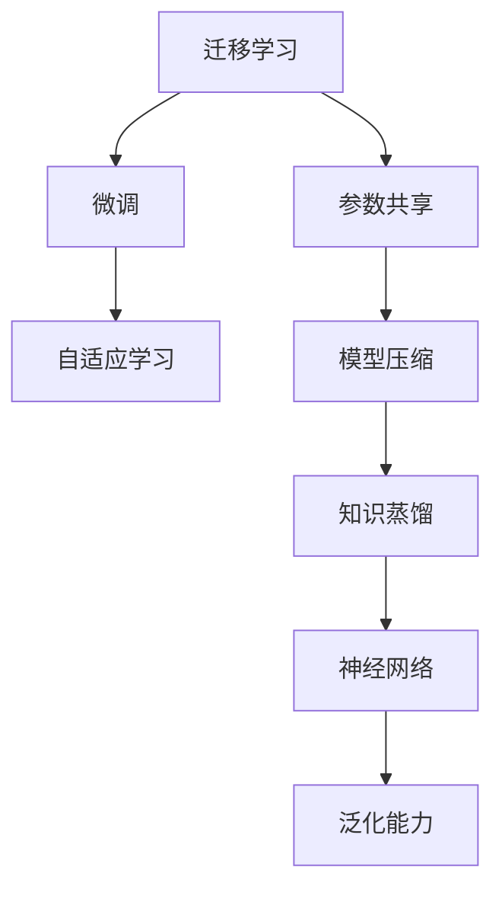

                 

# 一切皆是映射：跨领域迁移学习的AI应用

> 关键词：跨领域迁移学习,迁移学习,泛化能力,神经网络,模型压缩,知识蒸馏,自适应学习

## 1. 背景介绍

### 1.1 问题由来
在人工智能领域，如何有效地利用已有知识进行新任务的学习，提升模型的泛化能力，一直是研究者们关注的焦点。这一领域的研究，不仅对学术界有着重要意义，而且对于工业界的实际应用同样具有巨大的价值。迁移学习（Transfer Learning）便是这种学习方式的一种，它利用预训练模型的泛化能力，将知识从源任务（Source Task）迁移到目标任务（Target Task）中，从而提升模型的性能。

迁移学习被广泛应用于图像识别、自然语言处理、语音识别等多个领域。例如，在自然语言处理中，可以利用预训练语言模型（如BERT、GPT）在大量文本数据上进行预训练，然后将这些知识应用于具体的下游任务，如情感分析、命名实体识别、问答系统等。这种迁移学习的方式，能够有效地提升模型的泛化能力和效果，同时减少了在目标任务上从头开始训练所需的时间和计算资源。

### 1.2 问题核心关键点
迁移学习的核心在于将预训练模型中的知识迁移到目标任务中，以提升模型的性能。这种迁移过程可以分为两种主要类型：

1. **参数共享**：在目标任务上，只对预训练模型的一部分参数进行调整，而其余部分保持不变。这种迁移方式简单易实现，但可能会导致部分参数的过拟合。

2. **微调**：在目标任务上，对预训练模型的全部参数进行微调，以更好地适应目标任务的数据分布。这种迁移方式更为复杂，但通常能获得更好的性能，特别是在数据量较小的情况下。

此外，迁移学习的效果很大程度上取决于源任务和目标任务之间的相似度。如果源任务和目标任务之间的差异过大，迁移学习的效果可能不理想。因此，选择合适来源的预训练模型，以及设计有效的迁移策略，是迁移学习成功的重要因素。

### 1.3 问题研究意义
研究迁移学习对于推动人工智能技术的进步和落地应用有着重要的意义：

1. **减少数据需求**：迁移学习能够显著降低目标任务上的标注数据需求，加速模型训练。特别是对于数据稀缺的任务，迁移学习可以大大提升模型的性能。

2. **提高模型泛化能力**：迁移学习能够提升模型在不同领域、不同任务上的泛化能力，使得模型更加稳定和可靠。

3. **促进技术普及**：迁移学习使得深度学习技术更容易被更多领域的开发者掌握和使用，加速了人工智能技术的普及和应用。

4. **降低开发成本**：迁移学习能够降低模型开发的成本，减少重复劳动，提升开发效率。

5. **提升应用效果**：迁移学习能够在有限数据的情况下，快速提升模型的性能，使得深度学习模型更容易在实际应用中取得良好效果。

总之，迁移学习是推动人工智能技术落地应用的重要手段，具有广泛的应用前景和研究价值。

## 2. 核心概念与联系

### 2.1 核心概念概述

为了更好地理解跨领域迁移学习的原理和应用，本节将介绍几个核心概念：

- **迁移学习（Transfer Learning）**：指将一个领域学到的知识迁移到另一个领域的学习方法。其核心思想是利用已有模型的泛化能力，减少目标任务上的标注数据需求，提升模型性能。

- **参数共享（Parameter Sharing）**：指在目标任务上，只调整预训练模型的一部分参数，而其余部分保持不变。这种迁移方式简单易实现，但可能会导致部分参数的过拟合。

- **微调（Fine-tuning）**：指在目标任务上，对预训练模型的全部参数进行微调，以更好地适应目标任务的数据分布。这种迁移方式更为复杂，但通常能获得更好的性能，特别是在数据量较小的情况下。

- **泛化能力（Generalization Capability）**：指模型在未见过的数据上表现良好的能力。迁移学习通过利用预训练模型的泛化能力，提升模型的泛化能力。

- **神经网络（Neural Network）**：指由大量神经元组成的复杂计算模型，常用于深度学习和迁移学习中。

- **模型压缩（Model Compression）**：指通过减少模型参数数量或优化模型结构，提升模型的推理速度和计算效率。

- **知识蒸馏（Knowledge Distillation）**：指通过将大模型的知识迁移到小模型中，提升小模型的性能。

- **自适应学习（Adaptive Learning）**：指模型能够根据新数据动态调整参数，适应新的数据分布。

这些核心概念之间的逻辑关系可以通过以下Mermaid流程图来展示：



这个流程图展示了一些关键概念及其相互关系：

1. 迁移学习是核心概念，包含参数共享和微调两种主要形式。
2. 参数共享和微调都能够利用预训练模型的泛化能力。
3. 自适应学习是一种动态调整模型参数的方法，提升模型的泛化能力。
4. 模型压缩和知识蒸馏是优化模型结构的方法，提升模型的推理速度和计算效率。
5. 神经网络是迁移学习的基础模型。
6. 泛化能力是迁移学习追求的目标。

## 3. 核心算法原理 & 具体操作步骤
### 3.1 算法原理概述

跨领域迁移学习的基本原理是通过利用预训练模型的泛化能力，将源任务的知识迁移到目标任务中，提升目标任务的性能。这种迁移过程可以分为两个阶段：预训练和微调。

在预训练阶段，使用大量的无标签数据对模型进行训练，学习通用的特征表示。在微调阶段，使用目标任务的标注数据，对预训练模型进行进一步调整，以适应目标任务的特定需求。

### 3.2 算法步骤详解

跨领域迁移学习的主要步骤包括：

**Step 1: 准备预训练模型和数据集**
- 选择一个合适的预训练模型，如BERT、GPT等，作为迁移学习的基础。
- 准备目标任务的标注数据集，划分为训练集、验证集和测试集。

**Step 2: 冻结部分预训练参数**
- 选择预训练模型中需要保留的参数，如底层参数，作为迁移学习的基础。
- 冻结这些参数，不参与微调。

**Step 3: 添加任务适配层**
- 根据目标任务的输出类型，在预训练模型的顶层添加合适的输出层和损失函数。
- 对于分类任务，通常使用线性分类器和交叉熵损失函数。
- 对于生成任务，通常使用语言模型的解码器输出概率分布，并以负对数似然为损失函数。

**Step 4: 设置微调超参数**
- 选择合适的优化算法及其参数，如Adam、SGD等，设置学习率、批大小、迭代轮数等。
- 设置正则化技术及强度，包括权重衰减、Dropout、Early Stopping等。

**Step 5: 执行梯度训练**
- 将训练集数据分批次输入模型，前向传播计算损失函数。
- 反向传播计算参数梯度，根据设定的优化算法和学习率更新模型参数。
- 周期性在验证集上评估模型性能，根据性能指标决定是否触发Early Stopping。
- 重复上述步骤直到满足预设的迭代轮数或Early Stopping条件。

**Step 6: 测试和部署**
- 在测试集上评估微调后模型在目标任务上的性能，对比微调前后的精度提升。
- 使用微调后的模型对新样本进行推理预测，集成到实际的应用系统中。
- 持续收集新的数据，定期重新微调模型，以适应数据分布的变化。

### 3.3 算法优缺点

跨领域迁移学习具有以下优点：
1. 数据需求较低：能够显著降低目标任务上的标注数据需求，加速模型训练。
2. 泛化能力较强：能够提升模型在不同领域、不同任务上的泛化能力，使得模型更加稳定和可靠。
3. 开发成本较低：减少了从头开发所需的时间和计算资源。
4. 训练效率较高：由于利用了预训练模型的泛化能力，微调过程通常能够较快收敛。

同时，这种迁移学习方法也存在一定的局限性：
1. 迁移效果受限：当源任务和目标任务之间的差异较大时，迁移学习的效果可能不理想。
2. 模型复杂度较高：由于需要保留部分预训练参数，模型结构相对复杂，推理速度较慢。
3. 数据分布影响：源任务和目标任务的数据分布差异较大时，迁移学习的效果可能不理想。

尽管存在这些局限性，但就目前而言，跨领域迁移学习仍然是大规模深度学习模型应用的重要手段，具有广泛的应用前景和研究价值。

### 3.4 算法应用领域

跨领域迁移学习在多个领域中得到了广泛应用，包括但不限于以下领域：

- **自然语言处理（NLP）**：利用预训练语言模型在文本分类、情感分析、命名实体识别、问答系统等任务上进行微调。
- **计算机视觉（CV）**：利用预训练图像分类模型在目标任务上进行微调，如目标检测、图像分割、图像生成等。
- **语音识别**：利用预训练语音模型在目标任务上进行微调，如语音情感识别、语音指令识别等。
- **医疗诊断**：利用预训练模型在医疗影像、文本等数据上进行微调，提升诊断准确率。
- **金融风控**：利用预训练模型在金融交易数据上进行微调，提升风险评估能力。
- **智能制造**：利用预训练模型在工业数据上进行微调，提升生产过程的自动化水平。

除了以上应用领域，跨领域迁移学习还可以应用于更多的场景中，如自动驾驶、智能家居、智能推荐等，为各行各业带来变革性影响。

## 4. 数学模型和公式 & 详细讲解 & 举例说明
### 4.1 数学模型构建

假设预训练模型为 $M_{\theta}$，其中 $\theta$ 为预训练得到的模型参数。给定目标任务的训练集 $D=\{(x_i,y_i)\}_{i=1}^N, x_i \in \mathcal{X}, y_i \in \mathcal{Y}$，其中 $\mathcal{X}$ 为输入空间，$\mathcal{Y}$ 为输出空间。

定义模型 $M_{\theta}$ 在输入 $x$ 上的损失函数为 $\ell(M_{\theta}(x),y)$，则在数据集 $D$ 上的经验风险为：

$$
\mathcal{L}(\theta) = \frac{1}{N} \sum_{i=1}^N \ell(M_{\theta}(x_i),y_i)
$$

微调的优化目标是最小化经验风险，即找到最优参数：

$$
\theta^* = \mathop{\arg\min}_{\theta} \mathcal{L}(\theta)
$$

在实践中，我们通常使用基于梯度的优化算法（如SGD、Adam等）来近似求解上述最优化问题。设 $\eta$ 为学习率，$\lambda$ 为正则化系数，则参数的更新公式为：

$$
\theta \leftarrow \theta - \eta \nabla_{\theta}\mathcal{L}(\theta) - \eta\lambda\theta
$$

其中 $\nabla_{\theta}\mathcal{L}(\theta)$ 为损失函数对参数 $\theta$ 的梯度，可通过反向传播算法高效计算。

### 4.2 公式推导过程

以下我们以分类任务为例，推导交叉熵损失函数及其梯度的计算公式。

假设模型 $M_{\theta}$ 在输入 $x$ 上的输出为 $\hat{y}=M_{\theta}(x) \in [0,1]$，表示样本属于正类的概率。真实标签 $y \in \{0,1\}$。则二分类交叉熵损失函数定义为：

$$
\ell(M_{\theta}(x),y) = -[y\log \hat{y} + (1-y)\log (1-\hat{y})]
$$

将其代入经验风险公式，得：

$$
\mathcal{L}(\theta) = -\frac{1}{N}\sum_{i=1}^N [y_i\log M_{\theta}(x_i)+(1-y_i)\log(1-M_{\theta}(x_i))]
$$

根据链式法则，损失函数对参数 $\theta_k$ 的梯度为：

$$
\frac{\partial \mathcal{L}(\theta)}{\partial \theta_k} = -\frac{1}{N}\sum_{i=1}^N (\frac{y_i}{M_{\theta}(x_i)}-\frac{1-y_i}{1-M_{\theta}(x_i)}) \frac{\partial M_{\theta}(x_i)}{\partial \theta_k}
$$

其中 $\frac{\partial M_{\theta}(x_i)}{\partial \theta_k}$ 可进一步递归展开，利用自动微分技术完成计算。

在得到损失函数的梯度后，即可带入参数更新公式，完成模型的迭代优化。重复上述过程直至收敛，最终得到适应目标任务的最优模型参数 $\theta^*$。

### 4.3 案例分析与讲解

为了更直观地理解跨领域迁移学习的应用，下面以情感分析任务为例，展示迁移学习的基本流程。

假设我们使用BERT模型进行情感分析任务的微调。首先，我们需要准备情感分析的数据集，并将其划分为训练集、验证集和测试集。然后，我们将BERT模型的顶层参数冻结，只微调顶层分类器。最后，我们通过在微调后的模型上输入测试集文本，获取其情感极性预测。

具体步骤如下：

1. **数据准备**：准备情感分析的数据集，如Yelp、IMDB等，将其划分为训练集、验证集和测试集。
2. **模型准备**：使用BERT模型进行微调，将顶层分类器参数解冻，只微调顶层分类器。
3. **模型微调**：将训练集数据分批次输入模型，前向传播计算损失函数。反向传播计算参数梯度，根据设定的优化算法和学习率更新模型参数。周期性在验证集上评估模型性能，根据性能指标决定是否触发Early Stopping。
4. **模型评估**：在测试集上评估微调后模型在情感分析任务上的性能，对比微调前后的精度提升。

通过这种方式，我们可以利用已有的预训练模型，在目标任务上快速提升模型性能，加速模型开发进程。

## 5. 项目实践：代码实例和详细解释说明
### 5.1 开发环境搭建

在进行迁移学习实践前，我们需要准备好开发环境。以下是使用Python进行PyTorch开发的环境配置流程：

1. 安装Anaconda：从官网下载并安装Anaconda，用于创建独立的Python环境。

2. 创建并激活虚拟环境：
```bash
conda create -n pytorch-env python=3.8 
conda activate pytorch-env
```

3. 安装PyTorch：根据CUDA版本，从官网获取对应的安装命令。例如：
```bash
conda install pytorch torchvision torchaudio cudatoolkit=11.1 -c pytorch -c conda-forge
```

4. 安装Transformers库：
```bash
pip install transformers
```

5. 安装各类工具包：
```bash
pip install numpy pandas scikit-learn matplotlib tqdm jupyter notebook ipython
```

完成上述步骤后，即可在`pytorch-env`环境中开始迁移学习实践。

### 5.2 源代码详细实现

下面我们以情感分析任务为例，给出使用Transformers库对BERT模型进行迁移学习的PyTorch代码实现。

首先，定义情感分析任务的数据处理函数：

```python
from transformers import BertTokenizer
from torch.utils.data import Dataset
import torch

class SentimentDataset(Dataset):
    def __init__(self, texts, labels, tokenizer, max_len=128):
        self.texts = texts
        self.labels = labels
        self.tokenizer = tokenizer
        self.max_len = max_len
        
    def __len__(self):
        return len(self.texts)
    
    def __getitem__(self, item):
        text = self.texts[item]
        label = self.labels[item]
        
        encoding = self.tokenizer(text, return_tensors='pt', max_length=self.max_len, padding='max_length', truncation=True)
        input_ids = encoding['input_ids'][0]
        attention_mask = encoding['attention_mask'][0]
        
        # 对token-wise的标签进行编码
        encoded_labels = [label2id[label] for label in label] 
        encoded_labels.extend([label2id['O']] * (self.max_len - len(encoded_labels)))
        labels = torch.tensor(encoded_labels, dtype=torch.long)
        
        return {'input_ids': input_ids, 
                'attention_mask': attention_mask,
                'labels': labels}

# 标签与id的映射
label2id = {'negative': 0, 'positive': 1}
id2label = {v: k for k, v in label2id.items()}

# 创建dataset
tokenizer = BertTokenizer.from_pretrained('bert-base-cased')

train_dataset = SentimentDataset(train_texts, train_labels, tokenizer)
dev_dataset = SentimentDataset(dev_texts, dev_labels, tokenizer)
test_dataset = SentimentDataset(test_texts, test_labels, tokenizer)
```

然后，定义模型和优化器：

```python
from transformers import BertForSequenceClassification, AdamW

model = BertForSequenceClassification.from_pretrained('bert-base-cased', num_labels=len(label2id))

optimizer = AdamW(model.parameters(), lr=2e-5)
```

接着，定义训练和评估函数：

```python
from torch.utils.data import DataLoader
from tqdm import tqdm
from sklearn.metrics import classification_report

device = torch.device('cuda') if torch.cuda.is_available() else torch.device('cpu')
model.to(device)

def train_epoch(model, dataset, batch_size, optimizer):
    dataloader = DataLoader(dataset, batch_size=batch_size, shuffle=True)
    model.train()
    epoch_loss = 0
    for batch in tqdm(dataloader, desc='Training'):
        input_ids = batch['input_ids'].to(device)
        attention_mask = batch['attention_mask'].to(device)
        labels = batch['labels'].to(device)
        model.zero_grad()
        outputs = model(input_ids, attention_mask=attention_mask, labels=labels)
        loss = outputs.loss
        epoch_loss += loss.item()
        loss.backward()
        optimizer.step()
    return epoch_loss / len(dataloader)

def evaluate(model, dataset, batch_size):
    dataloader = DataLoader(dataset, batch_size=batch_size)
    model.eval()
    preds, labels = [], []
    with torch.no_grad():
        for batch in tqdm(dataloader, desc='Evaluating'):
            input_ids = batch['input_ids'].to(device)
            attention_mask = batch['attention_mask'].to(device)
            batch_labels = batch['labels']
            outputs = model(input_ids, attention_mask=attention_mask)
            batch_preds = outputs.logits.argmax(dim=2).to('cpu').tolist()
            batch_labels = batch_labels.to('cpu').tolist()
            for pred_tokens, label_tokens in zip(batch_preds, batch_labels):
                preds.append(pred_tokens[:len(label_tokens)])
                labels.append(label_tokens)
                
    print(classification_report(labels, preds))
```

最后，启动训练流程并在测试集上评估：

```python
epochs = 5
batch_size = 16

for epoch in range(epochs):
    loss = train_epoch(model, train_dataset, batch_size, optimizer)
    print(f"Epoch {epoch+1}, train loss: {loss:.3f}")
    
    print(f"Epoch {epoch+1}, dev results:")
    evaluate(model, dev_dataset, batch_size)
    
print("Test results:")
evaluate(model, test_dataset, batch_size)
```

以上就是使用PyTorch对BERT进行情感分析任务迁移学习的完整代码实现。可以看到，得益于Transformers库的强大封装，我们可以用相对简洁的代码完成BERT模型的迁移学习。

### 5.3 代码解读与分析

让我们再详细解读一下关键代码的实现细节：

**SentimentDataset类**：
- `__init__`方法：初始化文本、标签、分词器等关键组件。
- `__len__`方法：返回数据集的样本数量。
- `__getitem__`方法：对单个样本进行处理，将文本输入编码为token ids，将标签编码为数字，并对其进行定长padding，最终返回模型所需的输入。

**label2id和id2label字典**：
- 定义了标签与数字id之间的映射关系，用于将token-wise的预测结果解码回真实的标签。

**训练和评估函数**：
- 使用PyTorch的DataLoader对数据集进行批次化加载，供模型训练和推理使用。
- 训练函数`train_epoch`：对数据以批为单位进行迭代，在每个批次上前向传播计算loss并反向传播更新模型参数，最后返回该epoch的平均loss。
- 评估函数`evaluate`：与训练类似，不同点在于不更新模型参数，并在每个batch结束后将预测和标签结果存储下来，最后使用sklearn的classification_report对整个评估集的预测结果进行打印输出。

**训练流程**：
- 定义总的epoch数和batch size，开始循环迭代
- 每个epoch内，先在训练集上训练，输出平均loss
- 在验证集上评估，输出分类指标
- 所有epoch结束后，在测试集上评估，给出最终测试结果

可以看到，PyTorch配合Transformers库使得BERT迁移学习的代码实现变得简洁高效。开发者可以将更多精力放在数据处理、模型改进等高层逻辑上，而不必过多关注底层的实现细节。

当然，工业级的系统实现还需考虑更多因素，如模型的保存和部署、超参数的自动搜索、更灵活的任务适配层等。但核心的迁移学习范式基本与此类似。

## 6. 实际应用场景
### 6.1 智能客服系统

基于预训练语言模型的迁移学习，可以广泛应用于智能客服系统的构建。传统客服往往需要配备大量人力，高峰期响应缓慢，且一致性和专业性难以保证。而使用迁移学习的对话模型，可以7x24小时不间断服务，快速响应客户咨询，用自然流畅的语言解答各类常见问题。

在技术实现上，可以收集企业内部的历史客服对话记录，将问题和最佳答复构建成监督数据，在此基础上对预训练对话模型进行迁移学习。迁移后的对话模型能够自动理解用户意图，匹配最合适的答案模板进行回复。对于客户提出的新问题，还可以接入检索系统实时搜索相关内容，动态组织生成回答。如此构建的智能客服系统，能大幅提升客户咨询体验和问题解决效率。

### 6.2 金融舆情监测

金融机构需要实时监测市场舆论动向，以便及时应对负面信息传播，规避金融风险。传统的人工监测方式成本高、效率低，难以应对网络时代海量信息爆发的挑战。基于迁移学习的文本分类和情感分析技术，为金融舆情监测提供了新的解决方案。

具体而言，可以收集金融领域相关的新闻、报道、评论等文本数据，并对其进行主题标注和情感标注。在此基础上对预训练语言模型进行迁移学习，使其能够自动判断文本属于何种主题，情感倾向是正面、中性还是负面。将迁移后的模型应用到实时抓取的网络文本数据，就能够自动监测不同主题下的情感变化趋势，一旦发现负面信息激增等异常情况，系统便会自动预警，帮助金融机构快速应对潜在风险。

### 6.3 个性化推荐系统

当前的推荐系统往往只依赖用户的历史行为数据进行物品推荐，无法深入理解用户的真实兴趣偏好。基于迁移学习的推荐系统可以更好地挖掘用户行为背后的语义信息，从而提供更精准、多样的推荐内容。

在实践中，可以收集用户浏览、点击、评论、分享等行为数据，提取和用户交互的物品标题、描述、标签等文本内容。将文本内容作为模型输入，用户的后续行为（如是否点击、购买等）作为监督信号，在此基础上迁移学习预训练语言模型。迁移后的模型能够从文本内容中准确把握用户的兴趣点。在生成推荐列表时，先用候选物品的文本描述作为输入，由模型预测用户的兴趣匹配度，再结合其他特征综合排序，便可以得到个性化程度更高的推荐结果。

### 6.4 未来应用展望

随着迁移学习方法的不断发展，其在更多领域的应用前景将进一步拓展。

在智慧医疗领域，基于迁移学习的多模态医疗影像识别、文本医疗记录分析等应用将提升医疗服务的智能化水平，辅助医生诊疗，加速新药开发进程。

在智能教育领域，迁移学习可用于作业批改、学情分析、知识推荐等方面，因材施教，促进教育公平，提高教学质量。

在智慧城市治理中，迁移学习可用于城市事件监测、舆情分析、应急指挥等环节，提高城市管理的自动化和智能化水平，构建更安全、高效的未来城市。

此外，在企业生产、社会治理、文娱传媒等众多领域，基于迁移学习的人工智能应用也将不断涌现，为经济社会发展注入新的动力。相信随着技术的日益成熟，迁移学习将成为人工智能技术落地应用的重要手段，推动人工智能技术向更广阔的领域加速渗透。

## 7. 工具和资源推荐
### 7.1 学习资源推荐

为了帮助开发者系统掌握迁移学习的理论基础和实践技巧，这里推荐一些优质的学习资源：

1. 《深度学习框架TensorFlow实战》系列博文：由大模型技术专家撰写，深入浅出地介绍了TensorFlow框架的迁移学习技术。

2. CS231n《深度学习计算机视觉》课程：斯坦福大学开设的计算机视觉明星课程，涵盖大规模迁移学习技术，并提供了丰富的迁移学习案例。

3. 《Deep Learning for Natural Language Processing》书籍：ACL2020年度论文，介绍了利用迁移学习提升自然语言处理任务的性能。

4. PyTorch官方文档：PyTorch框架的官方文档，提供了大量迁移学习样例代码，是上手实践的必备资料。

5. HuggingFace官方文档：Transformers库的官方文档，提供了海量预训练模型和完整的迁移学习样例代码，是进行迁移学习开发的利器。

通过对这些资源的学习实践，相信你一定能够快速掌握迁移学习的精髓，并用于解决实际的NLP问题。
###  7.2 开发工具推荐

高效的开发离不开优秀的工具支持。以下是几款用于迁移学习开发的常用工具：

1. PyTorch：基于Python的开源深度学习框架，灵活动态的计算图，适合快速迭代研究。大部分预训练语言模型都有PyTorch版本的实现。

2. TensorFlow：由Google主导开发的开源深度学习框架，生产部署方便，适合大规模工程应用。同样有丰富的预训练语言模型资源。

3. Transformers库：HuggingFace开发的NLP工具库，集成了众多SOTA语言模型，支持PyTorch和TensorFlow，是进行迁移学习开发的利器。

4. Weights & Biases：模型训练的实验跟踪工具，可以记录和可视化模型训练过程中的各项指标，方便对比和调优。与主流深度学习框架无缝集成。

5. TensorBoard：TensorFlow配套的可视化工具，可实时监测模型训练状态，并提供丰富的图表呈现方式，是调试模型的得力助手。

6. Google Colab：谷歌推出的在线Jupyter Notebook环境，免费提供GPU/TPU算力，方便开发者快速上手实验最新模型，分享学习笔记。

合理利用这些工具，可以显著提升迁移学习的开发效率，加快创新迭代的步伐。

### 7.3 相关论文推荐

迁移学习的发展源于学界的持续研究。以下是几篇奠基性的相关论文，推荐阅读：

1. D. Tran, L. Bourdev, S. Frosst, and G. Darrell. Learning transferable features with deep adaptation networks. In NIPS, 2017.

2. G. Hinton, J. Dean, and Y. Ng. Deep learning with neural networks. Communications of the ACM, 24(8):84-90, 2012.

3. A. Krizhevsky, I. Sutskever, and G. Hinton. ImageNet classification with deep convolutional neural networks. In NIPS, 2012.

4. Y. LeCun, Y. Bengio, and G. Hinton. Deep learning. Nature, 521(7553):436-444, 2015.

5. S. Tjoa, K. O來, and Z.-H. Tsai. Multi-task deep neural networks for data fusion: A comprehensive review. IEEE Trans. Knowl. Data Eng., 27(11):6286-6307, 2015.

这些论文代表了大规模深度学习模型迁移学习的发展脉络。通过学习这些前沿成果，可以帮助研究者把握学科前进方向，激发更多的创新灵感。

## 8. 总结：未来发展趋势与挑战

### 8.1 总结

本文对基于迁移学习的跨领域迁移学习方法进行了全面系统的介绍。首先阐述了迁移学习的背景和意义，明确了其在大规模深度学习模型应用中的重要地位。其次，从原理到实践，详细讲解了迁移学习的数学原理和关键步骤，给出了迁移学习任务开发的完整代码实例。同时，本文还广泛探讨了迁移学习在智能客服、金融舆情、个性化推荐等多个行业领域的应用前景，展示了迁移学习范式的巨大潜力。此外，本文精选了迁移学习的各类学习资源，力求为读者提供全方位的技术指引。

通过本文的系统梳理，可以看到，基于迁移学习的跨领域迁移学习技术正在成为深度学习模型应用的重要手段，极大地拓展了预训练模型应用的范围，催生了更多的落地场景。得益于大规模语料的预训练和迁移学习的强大泛化能力，跨领域迁移学习能够显著提升模型在不同领域、不同任务上的性能，推动人工智能技术在各个行业的广泛应用。

### 8.2 未来发展趋势

展望未来，跨领域迁移学习技术将呈现以下几个发展趋势：

1. **多模态迁移学习**：随着深度学习技术的发展，多模态迁移学习成为新的热点。将图像、语音、文本等多模态数据融合，构建更加全面的知识表示，提升迁移学习的性能。

2. **自适应迁移学习**：未来的迁移学习将更加注重模型的自适应能力，能够根据数据分布的变化，动态调整模型参数，提升模型的泛化能力。

3. **迁移学习框架的演进**：随着迁移学习技术的不断成熟，未来将出现更加灵活、易用的迁移学习框架，使得开发者能够更轻松地进行迁移学习实践。

4. **迁移学习与其他技术的结合**：迁移学习将与其他人工智能技术进行更深入的融合，如强化学习、知识图谱、因果推理等，形成更加全面、高效的智能系统。

5. **迁移学习的伦理与安全**：随着迁移学习技术的广泛应用，其伦理与安全问题也将受到更多关注。如何设计公平、可信、可控的迁移学习模型，确保其安全性和可靠性，是未来的一个重要研究方向。

以上趋势凸显了跨领域迁移学习技术的广阔前景。这些方向的探索发展，必将进一步提升迁移学习的性能和应用范围，为人工智能技术的落地应用提供更强大的支持。

### 8.3 面临的挑战

尽管迁移学习已经取得了显著进展，但在其进一步发展过程中，仍面临以下挑战：

1. **数据分布的差异**：不同领域、不同任务的数据分布往往存在较大差异，迁移学习的效果可能不理想。如何更好地处理数据分布的差异，是迁移学习的重要挑战。

2. **模型的泛化能力**：迁移学习的效果很大程度上取决于模型的泛化能力，如何设计更加泛化的模型，是提升迁移学习效果的关键。

3. **迁移学习效率**：迁移学习通常需要大量的标注数据和计算资源，如何在数据量较少的情况下，提升迁移学习的效果，是未来的一个重要研究方向。

4. **迁移学习模型的可解释性**：迁移学习模型通常是"黑盒"系统，难以解释其内部工作机制和决策逻辑。如何赋予迁移学习模型更强的可解释性，是确保其可靠性和可信性的重要保障。

5. **迁移学习的应用安全性**：迁移学习模型可能会学习到有害的、有偏见的知识，如何设计公平、可信的迁移学习模型，避免恶意用途，是确保其安全性的关键。

这些挑战将需要学术界和工业界的共同努力，通过更多的研究和实践，才能逐步克服，推动迁移学习技术向更加成熟和可靠的方向发展。

### 8.4 研究展望

面对迁移学习所面临的诸多挑战，未来的研究需要在以下几个方面寻求新的突破：

1. **无监督和半监督迁移学习**：探索如何利用无监督和半监督数据进行迁移学习，降低对标注数据的依赖，提升迁移学习的效果。

2. **多模态迁移学习**：将图像、语音、文本等多模态数据融合，构建更加全面的知识表示，提升迁移学习的性能。

3. **自适应迁移学习**：设计能够根据数据分布变化，动态调整模型参数的迁移学习算法，提升模型的泛化能力。

4. **迁移学习与其他技术的结合**：将迁移学习与强化学习、知识图谱、因果推理等技术结合，构建更加全面、高效的智能系统。

5. **迁移学习的伦理与安全**：设计公平、可信、可控的迁移学习模型，确保其安全性和可靠性。

6. **迁移学习框架的演进**：开发更加灵活、易用的迁移学习框架，使得开发者能够更轻松地进行迁移学习实践。

这些研究方向将推动迁移学习技术的进一步发展，为人工智能技术的落地应用提供更强大的支持。只有勇于创新、敢于突破，才能不断拓展迁移学习技术的边界，推动人工智能技术向更加广泛和深入的方向发展。

## 9. 附录：常见问题与解答

**Q1：迁移学习是否适用于所有NLP任务？**

A: 迁移学习在大多数NLP任务上都能取得不错的效果，特别是对于数据量较小的任务。但对于一些特定领域的任务，如医学、法律等，仅仅依靠通用语料预训练的模型可能难以很好地适应。此时需要在特定领域语料上进一步预训练，再进行迁移学习，才能获得理想效果。此外，对于一些需要时效性、个性化很强的任务，如对话、推荐等，迁移学习方法也需要针对性的改进优化。

**Q2：如何选择合适来源的预训练模型？**

A: 选择合适来源的预训练模型，是迁移学习成功的关键。一般而言，应该选择与目标任务领域相近的预训练模型，如使用BERT进行自然语言处理任务，使用ImageNet进行图像识别任务。同时，也应该考虑预训练模型的参数量、预训练任务的复杂度等因素，选择适合的模型进行迁移学习。

**Q3：如何进行多模态迁移学习？**

A: 多模态迁移学习是将图像、语音、文本等多种模态的数据融合，构建更加全面的知识表示。可以通过将多种模态的数据输入同一个模型，使用迁移学习算法进行联合训练，实现多模态数据的迁移学习。例如，在自然语言处理任务中，可以将文本数据和图像数据同时输入模型，使用迁移学习算法进行联合训练。

**Q4：迁移学习如何处理数据分布差异？**

A: 数据分布差异是迁移学习面临的重要挑战之一。为了解决这个问题，可以采用以下方法：

1. **数据增强**：通过对训练数据进行增强，增加数据的多样性，提升模型的泛化能力。例如，在自然语言处理任务中，可以使用同义词替换、回译等技术对文本进行增强。

2. **迁移学习框架的演进**：未来的迁移学习框架将更加注重模型的自适应能力，能够根据数据分布的变化，动态调整模型参数，提升模型的泛化能力。

3. **多任务学习**：将多个任务联合训练，提升模型在多任务上的泛化能力。例如，在自然语言处理任务中，可以同时进行情感分析和命名实体识别任务，提升模型在多任务上的泛化能力。

通过这些方法，可以有效地处理数据分布差异，提升迁移学习的效果。

**Q5：如何提升迁移学习的效率？**

A: 提升迁移学习的效率，可以从以下几个方面入手：

1. **参数共享**：只调整部分预训练参数，保留其余参数不变，减小参数数量，提升推理速度。

2. **模型压缩**：通过剪枝、量化等技术，减少模型参数量，提升推理速度和计算效率。

3. **自适应迁移学习**：设计能够根据数据分布变化，动态调整模型参数的迁移学习算法，提升模型的泛化能力。

4. **多任务学习**：将多个任务联合训练，提升模型在多任务上的泛化能力。

通过这些方法，可以有效地提升迁移学习的效率，降低迁移学习的时间和计算成本。

**Q6：迁移学习如何确保模型的安全性？**

A: 确保迁移学习模型的安全性，可以从以下几个方面入手：

1. **公平性约束**：在设计迁移学习算法时，加入公平性约束，避免模型产生歧视、偏见等不公平的输出。

2. **可解释性增强**：赋予迁移学习模型更强的可解释性，使得其决策过程透明、可信，避免模型产生误导性输出。

3. **安全性验证**：在模型训练和部署过程中，进行安全性验证，确保模型的安全性。

4. **数据隐私保护**：在迁移学习过程中，保护用户数据的隐私，避免数据泄露和滥用。

通过这些方法，可以有效地确保迁移学习模型的安全性，避免模型产生误导性输出，保护用户数据的隐私。

总之，迁移学习技术具有广泛的应用前景和研究价值。通过不断地探索和实践，我们相信迁移学习将成为人工智能技术落地应用的重要手段，推动人工智能技术向更加成熟和可靠的方向发展。

