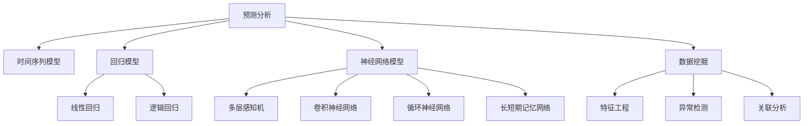

                 

# 一切皆是映射：预测分析：AI预见未来趋势

> 关键词：预见性分析, 预测模型, 时间序列, 深度学习, 数据挖掘, 机器学习

## 1. 背景介绍

### 1.1 问题由来
随着大数据、云计算、物联网等技术的迅猛发展，人类社会正步入一个以数据为驱动的新纪元。数据的规模和质量不断攀升，数据的价值也日益凸显。如何有效挖掘、分析和利用数据，成为了各行各业共同面临的重大挑战。预测分析（Predictive Analytics）作为一种前瞻性分析方法，通过综合利用历史数据和先进的算法模型，预测未来趋势，帮助决策者制定更科学、合理的决策方案。

特别是在智能制造、金融服务、健康医疗、智能交通等高度依赖数据的领域，预测分析的应用前景尤为广阔。它不仅能够提升业务运营效率、降低风险，还能为决策者提供预见性洞察，引领企业实现可持续发展。然而，预测分析的高效实施，离不开先进的算法模型和强大的计算能力。本文将深入探讨基于深度学习的预测分析模型，特别是AI在其中的应用，为读者提供系统、全面的指导。

### 1.2 问题核心关键点
预测分析的实现主要依赖于以下几个关键点：

- **数据预处理**：清洗、归一化、特征提取等步骤，为模型训练和预测提供高质量的数据输入。
- **算法模型**：包括时间序列模型、回归模型、神经网络模型等，选择合适的模型并优化参数，使得模型能够准确捕捉数据的复杂关系和趋势。
- **模型训练与评估**：使用历史数据进行模型训练，并在验证集上评估模型性能，选择最优的模型。
- **预测与解释**：利用模型进行未来数据的预测，并对预测结果进行解释，提升预测的可靠性和透明度。

本文将系统介绍预测分析的核心概念、算法原理和应用实践，帮助读者全面理解AI在预测分析中的作用，掌握前沿技术，提升业务决策水平。

## 2. 核心概念与联系

### 2.1 核心概念概述

为更好地理解基于深度学习的预测分析模型，本节将介绍几个关键概念：

- **预测分析（Predictive Analytics）**：通过分析历史数据，预测未来趋势和行为的一种数据分析技术。广泛应用于市场预测、客户行为分析、风险控制等领域。
- **时间序列模型**：基于时间序列数据的模型，如ARIMA、LSTM等，用于预测未来时间点的值。
- **回归模型**：如线性回归、逻辑回归等，用于预测连续或离散数值。
- **神经网络模型**：如多层感知机（MLP）、卷积神经网络（CNN）、循环神经网络（RNN）、长短期记忆网络（LSTM）等，用于处理复杂的数据关系。
- **深度学习**：通过多层次的神经网络模型，从数据中学习高层次特征和关系，提升预测精度。
- **数据挖掘**：从大量数据中提取有价值信息的过程，包括特征工程、异常检测、关联分析等。
- **机器学习**：通过训练算法模型，利用数据进行预测、分类、聚类等任务。

这些概念之间的逻辑关系可以通过以下Mermaid流程图来展示：



这个流程图展示了一些与预测分析相关的核心概念及其之间的关系：

1. 预测分析通过不同的模型，如时间序列、回归、神经网络等，实现数据预测。
2. 数据挖掘是预测分析的基础，包含特征工程、异常检测和关联分析等关键步骤。
3. 深度学习模型通过多层网络，捕捉复杂数据关系，提升预测精度。
4. 机器学习是实现预测分析的核心技术，通过算法模型训练和预测。

这些概念共同构成了预测分析的基本框架，使得预测分析技术在众多领域得到广泛应用。

## 3. 核心算法原理 & 具体操作步骤

### 3.1 算法原理概述

基于深度学习的预测分析模型，利用大量历史数据进行训练，并通过复杂的神经网络结构，学习数据的潜在模式和规律。模型训练结束后，可以通过输入新的数据，得到未来趋势的预测结果。以下是典型的预测分析算法流程：

1. **数据预处理**：清洗和转换原始数据，提取有意义的特征，进行归一化和标准化。
2. **模型选择与训练**：选择合适的深度学习模型，并使用历史数据进行模型训练。
3. **模型评估**：在验证集上评估模型性能，选择最优模型。
4. **预测与解释**：利用模型进行未来数据的预测，并对预测结果进行解释，提升预测的可靠性和透明度。

### 3.2 算法步骤详解

**Step 1: 数据预处理**

1. **数据清洗**：去除异常值、噪声和缺失值，保证数据质量。
2. **特征提取**：从原始数据中提取有意义的特征，如趋势、周期性、季节性等。
3. **归一化与标准化**：将数据缩放到一定范围内，便于模型处理。

**Step 2: 模型选择与训练**

1. **模型选择**：根据预测目标和数据特性，选择合适的模型，如时间序列模型、回归模型或神经网络模型。
2. **参数设置**：设置模型参数，如学习率、批大小、迭代轮数等。
3. **模型训练**：使用历史数据进行模型训练，最小化预测误差。

**Step 3: 模型评估**

1. **评估指标**：选择合适的评估指标，如均方误差（MSE）、均方根误差（RMSE）、平均绝对误差（MAE）等。
2. **验证集评估**：在验证集上评估模型性能，选择最优模型。

**Step 4: 预测与解释**

1. **预测结果**：利用训练好的模型，对未来数据进行预测。
2. **结果解释**：对预测结果进行解释，提供可靠的解释和洞察。

### 3.3 算法优缺点

深度学习模型在预测分析中的优点包括：

- **处理复杂关系**：能够处理高维、非线性、多变量等复杂数据关系。
- **自动特征提取**：通过学习数据模式，自动提取特征，减少特征工程工作量。
- **泛化能力强**：对新数据有较好的泛化能力，提升预测精度。

同时，深度学习模型也存在一些缺点：

- **计算资源需求高**：需要大量的计算资源进行模型训练。
- **模型复杂度高**：模型结构复杂，难以解释和理解。
- **过拟合风险**：模型参数过多，容易过拟合。

### 3.4 算法应用领域

基于深度学习的预测分析模型，已经在多个领域得到了广泛应用，例如：

- **金融服务**：预测股票价格、信贷风险、客户行为等，帮助金融机构进行风险控制和客户管理。
- **智能制造**：预测设备故障、生产效率、市场需求等，提升生产运营效率和产品质量。
- **健康医疗**：预测患者病情、治疗效果、疾病风险等，辅助医生进行诊断和治疗。
- **智能交通**：预测交通流量、交通事故、拥堵情况等，优化交通管理和调度。
- **能源管理**：预测能源需求、供需平衡、价格波动等，提升能源利用效率。

此外，预测分析还在市场营销、人力资源、环境保护等多个领域发挥着重要作用，为各行各业提供了强大的决策支持。

## 4. 数学模型和公式 & 详细讲解 & 举例说明

### 4.1 数学模型构建

预测分析模型通常基于时间序列数据，通过训练得到预测函数。以时间序列模型为例，其数学模型可以表示为：

$$
y_t = f(x_t, \theta)
$$

其中，$y_t$ 表示时间$t$的预测值，$f$ 表示预测函数，$x_t$ 表示时间$t$的输入特征向量，$\theta$ 表示模型参数。预测函数的常见形式包括线性回归、指数平滑、ARIMA、LSTM等。

### 4.2 公式推导过程

以线性回归模型为例，其预测函数可以表示为：

$$
y_t = \alpha + \beta x_t + \epsilon_t
$$

其中，$\alpha$ 和 $\beta$ 为模型参数，$\epsilon_t$ 为随机误差项。通过最小二乘法，可以求解模型参数：

$$
\hat{\beta} = (X^TX)^{-1}X^Ty
$$

其中，$X$ 为输入特征矩阵，$y$ 为输出值向量。

### 4.3 案例分析与讲解

假设我们有一组时间序列数据，记录了每天的销售额，我们想要预测下个月的销售额。首先，对数据进行清洗和归一化处理，然后将其划分为训练集和验证集。接着，选择线性回归模型进行训练和预测。训练过程中，使用均方误差（MSE）作为损失函数，最小化预测误差。训练结束后，在验证集上评估模型性能，选择最优模型。最后，利用训练好的模型，对下个月的销售额进行预测。

## 5. 项目实践：代码实例和详细解释说明

### 5.1 开发环境搭建

在进行预测分析实践前，我们需要准备好开发环境。以下是使用Python进行TensorFlow开发的流程：

1. 安装Anaconda：从官网下载并安装Anaconda，用于创建独立的Python环境。
2. 创建并激活虚拟环境：
```bash
conda create -n tf-env python=3.8 
conda activate tf-env
```
3. 安装TensorFlow：根据CUDA版本，从官网获取对应的安装命令。例如：
```bash
conda install tensorflow -c tf
```
4. 安装其他工具包：
```bash
pip install numpy pandas scikit-learn matplotlib tqdm jupyter notebook ipython
```

完成上述步骤后，即可在`tf-env`环境中开始预测分析实践。

### 5.2 源代码详细实现

以下是使用TensorFlow进行时间序列预测的Python代码实现：

```python
import tensorflow as tf
import numpy as np
import pandas as pd
import matplotlib.pyplot as plt

# 读取数据
data = pd.read_csv('sales_data.csv', index_col='Date')

# 数据预处理
data = data.resample('M').mean()
data = data.dropna()

# 划分训练集和验证集
train_size = int(len(data) * 0.7)
train_data = data.iloc[:train_size]
valid_data = data.iloc[train_size:]

# 定义模型参数
input_shape = (12, 1)
num_outputs = 1

# 构建模型
model = tf.keras.Sequential([
    tf.keras.layers.LSTM(64, input_shape=input_shape),
    tf.keras.layers.Dense(num_outputs)
])

# 设置优化器和损失函数
optimizer = tf.keras.optimizers.Adam(learning_rate=0.001)
loss_fn = tf.keras.losses.MeanSquaredError()

# 编译模型
model.compile(optimizer=optimizer, loss=loss_fn)

# 训练模型
history = model.fit(train_data, epochs=100, validation_data=valid_data)

# 评估模型
test_data = pd.read_csv('test_data.csv', index_col='Date')
predictions = model.predict(test_data)
```

可以看到，TensorFlow提供了简单易用的API，使得构建和训练预测模型变得非常容易。开发者只需关注数据处理和模型设计，而无需过多关注底层实现。

### 5.3 代码解读与分析

让我们详细解读一下关键代码的实现细节：

**数据预处理**：
- 使用Pandas库读取CSV文件，将时间列作为索引。
- 对数据进行月度平均处理，去除缺失值。

**模型构建**：
- 使用LSTM层构建时间序列模型，设置模型参数。
- 定义输出层，设置模型输出为1个标量值。

**模型训练**：
- 使用Adam优化器和均方误差损失函数。
- 使用训练集和验证集进行模型训练，记录训练历史。

**模型评估**：
- 读取测试数据集，进行模型预测。

**运行结果展示**：
- 在测试数据上评估模型性能，展示预测结果。

## 6. 实际应用场景

### 6.1 金融服务

在金融服务领域，预测分析能够帮助金融机构更好地评估风险和优化资产管理。通过分析历史交易数据、市场数据、公司财务数据等，预测股票价格、信贷风险、客户行为等，辅助决策者制定更合理的投资策略和风险控制措施。

具体应用场景包括：
- **股票价格预测**：使用时间序列模型预测股票价格走势，进行风险控制和资产配置。
- **信用风险评估**：利用客户历史数据和信用评分模型，预测客户还款风险，制定个性化贷款策略。
- **市场情绪分析**：分析新闻、社交媒体数据，预测市场情绪变化，指导投资决策。

### 6.2 智能制造

智能制造领域通过预测分析，可以实现设备预测性维护、生产效率优化和市场需求预测。利用生产设备的历史运行数据和维护记录，预测设备故障和维护需求，减少停机时间，提升生产效率。

具体应用场景包括：
- **设备故障预测**：分析设备运行数据，预测设备故障时间和维护需求，进行预防性维护。
- **生产效率优化**：预测生产线的产量和效率，调整生产计划，提升生产效率。
- **市场需求预测**：分析市场销售数据和趋势，预测产品需求，优化库存管理和生产计划。

### 6.3 健康医疗

在健康医疗领域，预测分析能够帮助医疗机构预测患者病情、治疗效果和疾病风险。通过分析患者历史数据、基因信息、治疗记录等，预测病情发展和治疗效果，制定个性化诊疗方案。

具体应用场景包括：
- **疾病预测**：分析患者历史数据和基因信息，预测疾病发展趋势和风险。
- **治疗效果评估**：分析患者治疗记录和基因信息，预测治疗效果，优化治疗方案。
- **健康管理**：分析患者生活习惯和健康数据，预测健康风险，制定健康管理计划。

### 6.4 未来应用展望

随着深度学习和预测分析技术的不断发展，未来将在更多领域得到应用，为各行各业带来变革性影响。

在智慧城市治理中，预测分析能够实现城市事件监测、舆情分析、应急指挥等环节的智能化，提高城市管理的自动化和智能化水平。在智能交通领域，预测分析可以实现交通流量预测、交通事故预测和拥堵情况预测，优化交通管理和调度。在环境保护领域，预测分析可以实现污染源监测、环境风险预测和生态修复效果评估，提升环境治理能力。

未来，随着算力成本的下降和数据规模的扩张，预测分析将得到更广泛的应用，进一步提升各行各业的智能化水平和运营效率。

## 7. 工具和资源推荐

### 7.1 学习资源推荐

为了帮助开发者系统掌握预测分析的理论基础和实践技巧，这里推荐一些优质的学习资源：

1. 《深度学习》系列博文：由大模型技术专家撰写，深入浅出地介绍了深度学习原理、框架和应用。
2. CS231n《深度学习与计算机视觉》课程：斯坦福大学开设的计算机视觉明星课程，涵盖深度学习在视觉领域的应用。
3. 《数据科学手册》书籍：全面介绍了数据科学的基础知识和实践技能，包括数据挖掘、预测分析和机器学习等。
4. Coursera《深度学习专项课程》：由深度学习专家Andrew Ng开设，涵盖深度学习理论、实践和应用。
5. TensorFlow官方文档：TensorFlow的官方文档，提供了海量教程和样例，是学习预测分析的重要资源。

通过对这些资源的学习实践，相信你一定能够快速掌握预测分析的核心技术，并用于解决实际的预测问题。

### 7.2 开发工具推荐

预测分析的开发离不开强大的工具支持。以下是几款常用的开发工具：

1. TensorFlow：基于Python的开源深度学习框架，灵活、高效，适合复杂模型的构建和训练。
2. PyTorch：基于Python的开源深度学习框架，灵活、易用，支持动态计算图和GPU加速。
3. Keras：基于TensorFlow和Theano的高级神经网络API，简单易用，适合快速原型开发。
4. Jupyter Notebook：交互式笔记本，支持Python、R等多种语言，适合数据探索和模型开发。
5. Weights & Biases：模型训练的实验跟踪工具，实时记录和可视化模型训练过程，方便调试和优化。

合理利用这些工具，可以显著提升预测分析任务的开发效率，加快创新迭代的步伐。

### 7.3 相关论文推荐

预测分析的快速发展离不开学界的持续研究。以下是几篇奠基性的相关论文，推荐阅读：

1. Time Series Analysis and Its Applications with R： time series analysis领域的经典教材，涵盖时间序列模型的理论基础和应用方法。
2. Long Short-Term Memory： LSTM模型在时间序列预测中的经典论文，介绍了LSTM模型的原理和实现方法。
3. Neural Network Time Series Prediction with LSTM： LSTM在时间序列预测中的应用案例，展示了LSTM模型的效果和优势。
4. Predicting Energy Demand using LSTM Networks： LSTM在能源预测中的应用案例，展示了LSTM模型在能源需求预测中的效果。
5. Machine Learning in Healthcare：机器学习在健康医疗中的应用综述，涵盖了多种机器学习算法和实际应用案例。

这些论文代表了大数据和深度学习在预测分析中的最新进展，通过学习这些前沿成果，可以帮助研究者把握学科前进方向，激发更多的创新灵感。

## 8. 总结：未来发展趋势与挑战

### 8.1 研究成果总结

本文对基于深度学习的预测分析模型进行了全面系统的介绍，主要内容包括：

1. 预测分析的背景和意义，概述了预测分析在各个领域的应用。
2. 核心概念的介绍，包括时间序列模型、回归模型、神经网络模型等。
3. 算法原理和操作步骤，详细介绍了预测分析的数学模型和实现步骤。
4. 项目实践的代码实例，展示了TensorFlow等工具在预测分析中的应用。
5. 实际应用场景，探讨了预测分析在金融、制造、健康等领域的广泛应用。
6. 工具和资源推荐，提供了学习预测分析的资源和工具建议。

通过本文的系统梳理，可以看到，基于深度学习的预测分析模型正在成为各行各业的重要工具，极大地提升了数据驱动决策的水平。

### 8.2 未来发展趋势

展望未来，预测分析将呈现以下几个发展趋势：

1. **模型自动化**：预测分析模型将进一步自动化，支持自动特征工程、模型选择和参数优化，降低人工干预。
2. **多模态融合**：将时间序列、图像、文本等多模态数据进行融合，提升预测精度和泛化能力。
3. **实时预测**：实现实时数据流预测，提升预测的及时性和可靠性。
4. **可解释性增强**：预测模型将具备更强的可解释性，提供可靠的预测解释和洞察。
5. **模型微调**：通过微调技术，实现模型的快速适应和优化，提升预测效果。

这些趋势将使得预测分析在更多领域得到应用，为决策者提供更精准、及时的预测结果。

### 8.3 面临的挑战

尽管预测分析技术在许多领域得到了广泛应用，但仍面临一些挑战：

1. **数据质量问题**：数据缺失、噪声和异常值等问题，影响预测精度。
2. **模型复杂性**：模型结构复杂，难以理解和解释。
3. **计算资源需求**：模型训练和预测需要大量计算资源，对硬件环境要求高。
4. **模型泛化能力**：模型在新数据上的泛化能力有限，存在过拟合风险。
5. **隐私保护**：预测分析涉及大量个人隐私数据，需要采取有效措施进行隐私保护。

### 8.4 研究展望

面对预测分析面临的挑战，未来的研究需要在以下几个方面寻求新的突破：

1. **数据预处理技术**：改进数据清洗和特征提取技术，提升数据质量。
2. **模型简化与优化**：简化模型结构，提升可解释性和计算效率。
3. **跨模态数据融合**：研究多模态数据融合技术，提升模型泛化能力。
4. **实时预测技术**：研究实时数据流处理技术，提升预测的及时性和可靠性。
5. **隐私保护技术**：研究隐私保护技术，确保预测分析的隐私安全。

这些研究方向的探索发展，必将引领预测分析技术迈向更高的台阶，为各行各业提供更强大、可靠的决策支持。

## 9. 附录：常见问题与解答

**Q1：预测分析能否应用于所有领域？**

A: 预测分析在大多数领域都有广泛的应用，但在一些特殊领域，如金融、医疗等，需要结合具体业务进行模型构建和数据预处理。

**Q2：如何选择预测模型？**

A: 选择预测模型需要考虑数据的特性和预测目标。时间序列数据通常选择时间序列模型，如ARIMA、LSTM等；回归任务通常选择线性回归、逻辑回归等；分类任务通常选择SVM、决策树等。

**Q3：预测分析的计算资源需求高吗？**

A: 预测分析通常需要大量的计算资源，特别是神经网络模型，需要GPU等高性能设备进行训练和预测。

**Q4：如何避免模型过拟合？**

A: 过拟合是预测分析模型常见的问题。可以通过增加数据量、正则化、Dropout等方法进行缓解。

**Q5：预测分析的输出结果如何解释？**

A: 预测分析的输出结果需要结合业务场景进行解释，提供可靠的预测解释和洞察，帮助决策者理解模型结果。

---

作者：禅与计算机程序设计艺术 / Zen and the Art of Computer Programming

