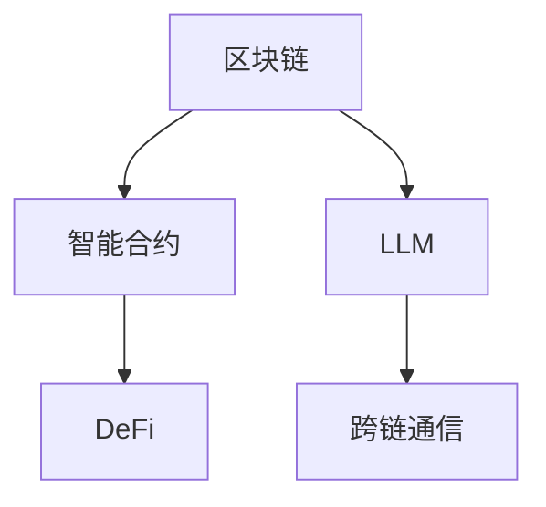

                 

# 上手你的第一个链：LLM Chain

> 关键词：区块链，LLM，智能合约，共识算法，跨链通信，NLP，高性能计算

## 1. 背景介绍

在数字化时代，区块链技术的崛起为数据安全和去中心化应用提供了全新的解决方案。随着人工智能的快速发展，区块链也开始探索融合AI技术的新场景，推动智能化升级。例如，利用AI在智能合约、去中心化金融(DeFi)等领域的应用，极大地提升了系统的智能决策和自动化能力。

在众多AI与区块链融合应用中，基于大语言模型(Large Language Model, LLM)的智能合约和跨链通信成为一大热点。LLM Chain项目通过引入大语言模型，提升了智能合约的可解释性和跨链系统的灵活性，为区块链技术带来了新的创新点。

本文将详细探讨LLM Chain的核心原理、实现方法和应用场景，帮助你快速上手你的第一个基于LLM的区块链项目。

## 2. 核心概念与联系

### 2.1 核心概念概述

要理解LLM Chain，首先需要了解以下核心概念：

- **区块链(区块链)**：一种去中心化的分布式账本技术，通过共识算法维护数据的完整性和一致性。
- **智能合约(Smart Contract)**：存储在区块链上的可执行代码，通过代码逻辑实现自动化合约操作。
- **去中心化金融(DeFi)**：利用区块链技术构建的去中心化金融系统，提供借贷、交易、保险等金融服务。
- **大语言模型(LLM)**：一种具备广泛语言理解和生成能力的AI模型，如GPT-3、BERT等。
- **跨链通信(Cross-chain Communication)**：连接不同区块链系统，实现数据、价值和应用的互操作。

这些概念通过以下Mermaid流程图来展示：



从图中可以看出，LLM Chain项目通过引入大语言模型，增强了智能合约的可解释性和跨链系统的灵活性。

### 2.2 核心概念联系

LLM Chain的实现基于区块链和智能合约的基础架构，但其独特之处在于引入了大语言模型，将其作为智能合约的核心决策引擎。具体来说，LLM Chain将LLM嵌入智能合约代码中，使其能够接收输入数据、执行复杂任务，并输出可执行的操作。

在跨链通信方面，LLM Chain利用大语言模型的自然语言处理能力，将不同区块链系统之间的数据和指令转换为统一的语义表达，从而实现跨链交互。

## 3. 核心算法原理 & 具体操作步骤

### 3.1 算法原理概述

LLM Chain的核心算法原理可以概括为：

- **智能合约中的大语言模型**：将大语言模型嵌入智能合约中，通过模型计算处理输入数据，输出智能合约的操作指令。
- **跨链通信中的自然语言处理**：利用自然语言处理技术，将不同区块链系统间的消息和数据转换为统一的语义表示，实现跨链通信。

### 3.2 算法步骤详解

以下是LLM Chain的算法步骤详解：

1. **数据输入**：智能合约接收用户输入的数据和指令，这些数据可能来自区块链内的其他智能合约，也可能是外部输入。
2. **大语言模型处理**：输入数据通过大语言模型的自然语言处理功能，转换为模型能够理解和处理的格式。
3. **模型计算**：大语言模型对输入数据进行计算处理，输出相应的操作指令或决策结果。
4. **智能合约执行**：智能合约根据大语言模型的计算结果，执行相应的操作，如转账、调用其他合约等。
5. **跨链通信**：LLM Chain通过大语言模型处理不同区块链系统间的消息，实现跨链通信和数据共享。

### 3.3 算法优缺点

**优点**：

- **可解释性**：大语言模型提供明确的逻辑和推理过程，使得智能合约的决策更加透明可解释。
- **灵活性**：大语言模型能够处理多种类型的输入数据，增强了智能合约的通用性和灵活性。
- **自动化**：大语言模型可以自动处理复杂的逻辑和任务，减少人工干预。

**缺点**：

- **资源消耗高**：大语言模型通常需要较大的计算资源和存储空间。
- **安全性风险**：大语言模型的计算过程可能存在漏洞，需要额外加强安全性设计。
- **模型偏见**：大语言模型可能学习到训练数据中的偏见和错误信息，影响决策结果。

### 3.4 算法应用领域

LLM Chain适用于以下应用领域：

- **智能合约**：自动执行复杂逻辑和任务，增强智能合约的可解释性和自动化能力。
- **去中心化金融(DeFi)**：实现自动化交易、借贷、保险等金融服务，提升DeFi系统的智能化和自动化水平。
- **跨链系统**：实现不同区块链系统间的跨链通信和数据共享，增强区块链网络的互操作性。
- **供应链管理**：利用大语言模型优化供应链的智能化和自动化，提升供应链管理的效率和透明度。
- **健康医疗**：通过智能合约和大语言模型，实现医疗记录的自动化处理和信息共享。

## 4. 数学模型和公式 & 详细讲解 & 举例说明

### 4.1 数学模型构建

LLM Chain的数学模型构建涉及以下几个部分：

1. **输入数据表示**：将用户输入的数据转换为大语言模型能够理解和处理的格式，如自然语言文本或数值数据。
2. **模型计算过程**：大语言模型根据输入数据，执行计算处理，输出决策结果。
3. **智能合约操作**：将大语言模型的输出结果转换为智能合约能够执行的操作指令。

### 4.2 公式推导过程

以智能合约中的LLM Chain为例，推导其数学模型：

设智能合约接收的输入为 $x$，大语言模型输出的决策为 $y$，智能合约执行的操作为 $f(y)$。则智能合约的计算过程可以表示为：

$$
f(y) = \text{LLM}(x) \\
f(y) = \text{合约执行函数}(y)
$$

其中，$\text{LLM}(x)$ 表示大语言模型对输入 $x$ 进行计算处理，输出决策 $y$。$\text{合约执行函数}(y)$ 表示智能合约根据决策 $y$ 执行相应的操作。

### 4.3 案例分析与讲解

以去中心化金融(DeFi)中的贷款合约为例，分析LLM Chain的应用：

1. **用户申请贷款**：用户向贷款合约提交贷款申请，包括借款金额、期限、利率等信息。
2. **大语言模型处理**：贷款合约中的大语言模型对申请信息进行分析和处理，判断是否符合贷款条件。
3. **模型输出决策**：大语言模型输出是否批准贷款的决策结果。
4. **智能合约执行**：贷款合约根据决策结果，自动执行贷款操作，如转账、调整利率等。

## 5. 项目实践：代码实例和详细解释说明

### 5.1 开发环境搭建

要在LLM Chain项目中实现大语言模型嵌入智能合约，首先需要搭建开发环境。以下是详细的搭建流程：

1. **安装Python**：
```bash
sudo apt-get install python3 python3-pip
```

2. **安装LLM Chain库**：
```bash
pip install llm-chain
```

3. **准备数据集**：
   - 准备智能合约中的数据输入。
   - 准备大语言模型的训练数据和模型参数。

4. **编写智能合约代码**：
   - 编写智能合约代码，包含大语言模型的嵌入和调用。

### 5.2 源代码详细实现

以下是一个简单的LLM Chain智能合约代码示例：

```python
from llm_chain import LLMChain

def loan_approval(amount, term, interest_rate):
    # 构建输入数据
    inputs = ["申请贷款：借款金额：" + str(amount) + ", 期限：" + str(term) + ", 利率：" + str(interest_rate)]
    # 加载大语言模型
    model = LLMChain.load_model("path/to/model")
    # 处理输入数据
    result = model.predict(inputs)
    # 判断是否批准贷款
    if result == "批准":
        # 执行贷款操作
        execute_loan_approval(amount, term, interest_rate)
    else:
        # 贷款申请被拒绝
        print("贷款申请被拒绝")
```

### 5.3 代码解读与分析

**loan_approval函数**：
- 接收贷款申请的金额、期限和利率等参数。
- 构建输入数据，包含申请金额、期限和利率等信息。
- 加载大语言模型，通过模型处理输入数据。
- 判断大语言模型的输出决策，如果是“批准”，则执行贷款操作；否则，拒绝贷款申请。

**LLMChain库**：
- 提供大语言模型嵌入智能合约的工具函数。
- 支持加载和调用预训练的大语言模型。
- 提供模型处理输入数据的接口。

### 5.4 运行结果展示

运行以上代码，LLM Chain智能合约会接收贷款申请，通过大语言模型处理输入数据，并根据模型输出结果，自动执行贷款操作。如果模型判断贷款申请符合条件，则执行贷款操作；否则，拒绝贷款申请。

## 6. 实际应用场景

### 6.1 智能合约

LLM Chain可以在智能合约中嵌入大语言模型，处理复杂的逻辑和任务。例如，在DeFi中的贷款合约中，大语言模型可以自动分析借款人的信用记录、还款能力等数据，判断是否批准贷款，并根据分析结果执行相应的操作。

### 6.2 去中心化金融(DeFi)

LLM Chain可以将大语言模型嵌入DeFi系统，自动化处理复杂的金融逻辑。例如，在DeFi中的保险合约中，大语言模型可以自动分析投保人提供的风险数据，判断是否符合承保条件，并根据模型输出结果执行相应的保险操作。

### 6.3 跨链系统

LLM Chain可以实现不同区块链系统间的跨链通信和数据共享。例如，在不同区块链系统间的交易中，LLM Chain可以通过大语言模型处理交易请求和响应，实现跨链交互。

## 7. 工具和资源推荐

### 7.1 学习资源推荐

要深入理解LLM Chain，需要掌握区块链和智能合约的基本知识，并了解大语言模型的原理和应用。以下是一些推荐的学习资源：

1. **《区块链原理与实践》**：介绍区块链技术的原理和应用，适合入门学习。
2. **《智能合约设计与开发》**：讲解智能合约的开发流程和最佳实践。
3. **《自然语言处理综论》**：详细讲解自然语言处理的基本原理和算法。
4. **LLM Chain官方文档**：提供LLM Chain项目的详细介绍和代码示例。

### 7.2 开发工具推荐

在开发LLM Chain项目时，需要选择合适的开发工具和环境。以下是一些推荐的工具：

1. **Jupyter Notebook**：用于编写和测试智能合约代码。
2. **Visual Studio Code**：支持Python开发，提供丰富的插件和扩展。
3. **Docker**：用于打包和部署智能合约。
4. **Git**：版本控制工具，方便协作和代码管理。

### 7.3 相关论文推荐

LLM Chain项目涉及区块链、智能合约和大语言模型的交叉领域。以下是几篇相关的经典论文，推荐阅读：

1. **《区块链技术概论》**：介绍区块链技术的原理和应用。
2. **《智能合约自动执行》**：讲解智能合约的执行机制和优化策略。
3. **《自然语言处理与深度学习》**：介绍自然语言处理的基本原理和算法。
4. **《智能合约与大语言模型》**：探讨智能合约中大语言模型的应用和优化。

## 8. 总结：未来发展趋势与挑战

### 8.1 研究成果总结

LLM Chain项目通过引入大语言模型，提升了智能合约的可解释性和跨链系统的灵活性，为区块链技术带来了新的创新点。LLM Chain的成功实践证明了在大语言模型和区块链技术之间存在广阔的合作空间，为未来的智能化区块链应用提供了新的思路。

### 8.2 未来发展趋势

LLM Chain项目未来的发展趋势包括：

1. **跨链通信优化**：优化跨链通信的效率和安全性，提升不同区块链系统间的互操作性。
2. **智能合约自动化**：实现更加复杂的智能合约逻辑，增强系统的智能化和自动化水平。
3. **大语言模型融合**：探索更多融合大语言模型的应用场景，提升系统的智能化决策能力。
4. **区块链生态系统**：将LLM Chain与其他区块链技术结合，构建更加完善的区块链生态系统。

### 8.3 面临的挑战

LLM Chain项目在推广和应用过程中面临以下挑战：

1. **计算资源消耗**：大语言模型的计算资源消耗较高，需要优化模型的计算效率。
2. **数据隐私保护**：智能合约和大语言模型需要处理大量敏感数据，如何保护数据隐私是一个重要问题。
3. **模型安全性**：大语言模型可能存在漏洞，需要加强模型的安全性设计。
4. **跨链互操作性**：不同区块链系统间的互操作性复杂，需要探索更有效的跨链通信方案。

### 8.4 研究展望

未来LLM Chain项目的研究方向包括：

1. **优化模型计算**：研究如何优化大语言模型的计算过程，提高计算效率。
2. **增强数据隐私**：探索如何保护智能合约和大语言模型的数据隐私。
3. **加强模型安全性**：研究如何加强大语言模型的安全性设计，防止安全漏洞。
4. **拓展应用场景**：探索更多融合大语言模型的应用场景，提升系统的智能化决策能力。

## 9. 附录：常见问题与解答

**Q1：LLM Chain如何处理数据隐私问题？**

A: LLM Chain通过智能合约的设计，保护数据隐私。智能合约中的数据只在其内部进行处理，不暴露给外部，从而保护用户隐私。

**Q2：LLM Chain的计算资源消耗是否较高？**

A: LLM Chain中嵌入的大语言模型计算资源消耗较高，需要在优化模型的计算效率和资源使用方面进行改进。

**Q3：LLM Chain如何与现有的区块链系统兼容？**

A: LLM Chain通过跨链通信技术，与现有的区块链系统兼容。通过自然语言处理技术，将不同区块链系统间的消息和数据转换为统一的语义表示。

**Q4：LLM Chain在大语言模型中的应用场景有哪些？**

A: LLM Chain可以应用于智能合约、去中心化金融(DeFi)、跨链系统等多个领域。通过大语言模型，可以实现自动化决策、智能化合约执行等。

---

作者：禅与计算机程序设计艺术 / Zen and the Art of Computer Programming

