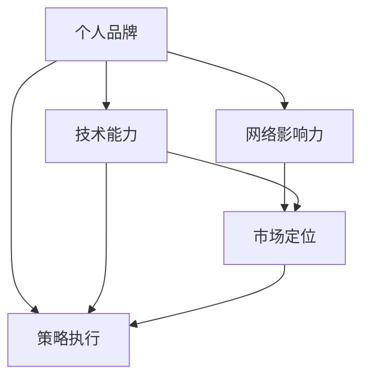

                 

## 1. 背景介绍

在数字化时代的浪潮中，个人品牌的塑造不仅关乎职业发展的高度，更是个人价值和影响力的体现。如今，无论是科技公司的CTO，还是初创企业的创始人，抑或是自由职业者，都面临着如何在激烈竞争的市场中脱颖而出、赢得更多认可的挑战。本文将从技术、市场、策略等多个角度，探讨如何构建和提升个人品牌，帮助每一位读者在这个时代中脱颖而出。

## 2. 核心概念与联系

### 2.1 核心概念概述

#### 2.1.1 个人品牌

个人品牌是指个体在职场和社会中塑造的形象和声誉，是个人在行业内外被认知和认可的标志。个人品牌不仅仅涉及职业身份和成就，还包括专业知识、价值观、工作态度等多方面内容。

#### 2.1.2 网络影响力

在数字时代，个人品牌的影响力不仅限于实体职场，更扩展到了网络空间。通过博客、社交媒体、视频平台等渠道，个人可以持续发布和传播内容，提升在特定领域的专业权威和公众认知。

#### 2.1.3 技术能力

技术能力是个人品牌建立的重要基石。深入的技术积累、持续的学习能力、敏捷的解决问题的能力，是构建高价值个人品牌的关键。

#### 2.1.4 市场定位

市场定位是指个人品牌在目标市场中的定位和差异化策略。明确自己的专业领域和优势，准确把握市场需求，可以更好地吸引目标受众，提升品牌影响力。

#### 2.1.5 策略执行

个人品牌策略的执行是实现品牌目标的关键步骤。有效的执行需要明确目标、制定计划、持续跟进和评估效果。

### 2.2 核心概念联系

个人品牌、网络影响力、技术能力、市场定位和策略执行，这五个核心概念相互关联，共同构成了个人品牌打造的基石。个人品牌是目标，网络影响力是手段，技术能力是核心竞争力，市场定位是方向，策略执行是过程。只有综合考虑这五个方面，才能全面提升个人品牌的影响力和价值。

以下是一个简化的Mermaid流程图，展示这五个核心概念之间的关系：



## 3. 核心算法原理 & 具体操作步骤

### 3.1 算法原理概述

个人品牌的打造可以类比为一种算法优化问题。在这个问题中，目标是最小化个人品牌的影响力损失，即提升品牌知名度和认可度。影响品牌影响力的因素包括技术能力、网络影响力、市场定位和策略执行。算法的主要任务是找到一个最优的策略，使得这四个因素的综合影响最大。

### 3.2 算法步骤详解

#### 3.2.1 设定目标

1. **明确个人品牌的目标**：
    - 定义品牌的目标受众和定位（如技术专家、行业领袖、咨询顾问等）。
    - 确定品牌的核心价值主张（如创新、可靠性、领导力等）。

2. **设定评估指标**：
    - 建立衡量品牌影响力的关键指标，如粉丝数、社交媒体互动率、专业文章阅读量等。
    - 设定具体量化目标，如半年内增加50%的社交媒体关注度，全年发表20篇技术博客等。

#### 3.2.2 数据分析

1. **收集数据**：
    - 利用各种工具和平台（如Google Analytics、LinkedIn Insights、社交媒体分析工具等）收集相关数据。
    - 定期跟踪和记录个人品牌在各渠道的表现，如关注度、互动量、反馈等。

2. **数据处理**：
    - 清洗数据，去除噪音，确保数据的准确性和完整性。
    - 分析数据，发现品牌在各渠道的表现趋势和优势领域。

#### 3.2.3 优化策略

1. **制定策略**：
    - 根据目标和数据分析结果，制定个性化的品牌提升策略。
    - 确定在技术分享、内容创作、社区参与等方面的重点投入方向。

2. **执行计划**：
    - 根据制定的策略，制定详细的执行计划，明确每个步骤的目标和资源需求。
    - 设定时间节点和责任人，确保计划的顺利推进。

#### 3.2.4 持续优化

1. **反馈循环**：
    - 定期评估品牌的影响力，与设定的目标进行对比。
    - 根据评估结果调整策略，不断优化个人品牌打造的过程。

2. **长期维护**：
    - 持续发布高质量内容，保持品牌在目标受众中的活跃度和关注度。
    - 定期参与行业会议、培训、讲座等活动，拓展人脉和影响力。

### 3.3 算法优缺点

#### 3.3.1 优点

1. **系统化方法**：
    - 通过系统化的分析和优化过程，可以更科学地提升个人品牌影响力。
    - 设定明确的评估指标，可以更客观地衡量品牌提升的效果。

2. **持续改进**：
    - 定期评估和调整策略，不断优化品牌打造的各个环节，实现长期增长。
    - 利用数据分析技术，可以更准确地把握品牌在各渠道的表现，提升投放效果。

3. **灵活性**：
    - 根据数据反馈和市场变化灵活调整策略，适应不同的环境和需求。
    - 可以结合多种策略和手段，综合提升品牌影响力。

#### 3.3.2 缺点

1. **数据依赖**：
    - 依赖准确、全面的数据收集和处理，可能面临数据噪音和缺失的风险。
    - 对数据分析能力要求较高，需要具备一定的数据科学背景。

2. **执行复杂**：
    - 策略的制定和执行需要详细的计划和资源协调，可能涉及多部门和多渠道的协同工作。
    - 需要持续跟进和评估，确保计划按预期推进。

3. **效果评估困难**：
    - 品牌影响力的提升是一个渐进的过程，短期内难以明显见效。
    - 需要综合考虑多个指标，对长期效果进行评估。

### 3.4 算法应用领域

个人品牌打造的方法和策略，适用于各类职业背景和需求。无论是在科技公司、咨询公司、创业团队还是自由职业领域，都可以通过这一系统化方法提升个人品牌的影响力和价值。

## 4. 数学模型和公式 & 详细讲解 & 举例说明

### 4.1 数学模型构建

#### 4.1.1 目标函数

设 $C$ 为个人品牌的目标受众，$F_C$ 为网络影响力，$T_C$ 为技术能力，$M_C$ 为市场定位，$S$ 为策略执行。则目标函数 $F$ 可以表示为：

$$
F = f_{F_C}(F_C) + f_{T_C}(T_C) + f_{M_C}(M_C) + f_{S}(S)
$$

其中 $f_{F_C}(\cdot)$、$f_{T_C}(\cdot)$、$f_{M_C}(\cdot)$ 和 $f_{S}(\cdot)$ 为相应的影响函数，定义了各因素对品牌影响力的贡献。

#### 4.1.2 约束条件

设 $D$ 为网络数据集，$A$ 为技术资源集，$R$ 为市场资源集，$E$ 为策略资源集。则约束条件 $C$ 可以表示为：

$$
C = \{
    D \cap A \cap R \cap E
\}
$$

表示网络、技术、市场和策略资源必须同时满足，才能有效提升品牌影响力。

### 4.2 公式推导过程

#### 4.2.1 目标函数分解

1. **网络影响力**：
    $$
    f_{F_C}(F_C) = \alpha \sum_{i \in C} (\text{粉丝数}_i + \text{互动量}_i)
    $$
    其中 $\alpha$ 为权重，用于平衡不同渠道的影响力。

2. **技术能力**：
    $$
    f_{T_C}(T_C) = \beta \sum_{j \in C} (\text{技术文章阅读量}_j + \text{技术讲座参与人数}_j)
    $$
    其中 $\beta$ 为权重，用于衡量技术传播的广度和深度。

3. **市场定位**：
    $$
    f_{M_C}(M_C) = \gamma \sum_{k \in C} (\text{咨询项目数}_k + \text{合作企业数}_k)
    $$
    其中 $\gamma$ 为权重，用于衡量市场影响力和商业价值。

4. **策略执行**：
    $$
    f_{S}(S) = \delta \sum_{l \in C} (\text{内容发布频次}_l + \text{活动参与频次}_l)
    $$
    其中 $\delta$ 为权重，用于衡量策略执行的效果。

#### 4.2.2 约束条件解法

利用线性规划等优化技术，可以求解目标函数在约束条件下的最优解。常用的优化算法包括单纯形法、内点法等，可以通过专业的优化工具实现。

### 4.3 案例分析与讲解

#### 4.3.1 案例背景

假设一位科技公司的CTO，希望通过提升个人品牌影响力，增强其在技术社区和咨询市场中的地位。

#### 4.3.2 目标函数和约束条件

1. **目标函数**：
    $$
    F = f_{F_C}(F_C) + f_{T_C}(T_C) + f_{M_C}(M_C) + f_{S}(S)
    $$

2. **约束条件**：
    - 网络数据集 $D$：包含社交媒体平台上的数据，如Twitter、LinkedIn、GitHub等。
    - 技术资源集 $A$：包含公司内部技术会议、开源项目、技术博客等资源。
    - 市场资源集 $R$：包含市场调研报告、客户反馈、合作项目等资源。
    - 策略资源集 $E$：包含内容发布计划、市场活动计划、社区参与计划等资源。

#### 4.3.3 数据分析与优化

1. **数据收集**：
    - 利用各种数据收集工具，如Google Analytics、Twitter API、GitHub API等，收集相关数据。
    - 定期整理和清洗数据，确保数据的质量和完整性。

2. **数据分析**：
    - 使用数据分析工具，如Python的Pandas、Scikit-learn等，对数据进行统计和分析。
    - 识别品牌在各渠道的表现趋势和优势领域。

3. **策略制定**：
    - 根据数据分析结果，制定个性化的品牌提升策略，如增加社交媒体互动、提高技术讲座频率、参与市场调研等。
    - 设定具体的执行计划，明确每个步骤的目标和资源需求。

4. **执行和评估**：
    - 按照制定的策略和计划，持续推进品牌打造的过程。
    - 定期评估品牌影响力，与设定的目标进行对比，根据评估结果调整策略，确保品牌持续提升。

## 5. 项目实践：代码实例和详细解释说明

### 5.1 开发环境搭建

#### 5.1.1 软件选择

- Python：作为数据分析和编程的主要语言，支持各种科学计算库和框架。
- Jupyter Notebook：提供交互式编程环境，便于代码调试和结果展示。
- Matplotlib、Seaborn：用于数据可视化。
- Pandas：用于数据处理和分析。

#### 5.1.2 开发环境配置

1. **安装Python**：
    - 从官网下载Python安装程序，按照指示进行安装。
    - 添加Python到系统环境变量中，确保能够在任何目录下使用。

2. **安装相关库**：
    - 使用pip安装Pandas、Matplotlib、Seaborn等库。
    - 安装Jupyter Notebook，并启动Notebook服务。

3. **配置环境**：
    - 在Notebook中导入需要的库和数据，进行数据处理和分析。
    - 使用Jupyter的代码块和魔术命令，提升代码的执行效率。

### 5.2 源代码详细实现

#### 5.2.1 数据收集与处理

1. **数据收集**：
    - 使用Python的requests库，从API获取数据。
    - 将数据保存为CSV文件，便于后续分析。

2. **数据处理**：
    - 使用Pandas库，读取和处理CSV文件。
    - 进行数据清洗，去除噪音和重复数据。

3. **数据可视化**：
    - 使用Matplotlib和Seaborn库，绘制图表，展示数据分布和趋势。
    - 将可视化结果保存为PNG或JPG格式。

#### 5.2.2 数据分析与优化

1. **数据分析**：
    - 使用Pandas库，对数据进行统计和分析。
    - 利用数据可视化工具，发现品牌在各渠道的表现和优势领域。

2. **优化策略**：
    - 根据数据分析结果，制定品牌提升策略。
    - 设定具体的执行计划，明确每个步骤的目标和资源需求。

3. **执行和评估**：
    - 按照制定的策略和计划，持续推进品牌打造的过程。
    - 定期评估品牌影响力，与设定的目标进行对比，根据评估结果调整策略。

#### 5.2.3 代码示例

```python
import pandas as pd
import matplotlib.pyplot as plt
import seaborn as sns

# 数据收集
data = pd.read_csv('data.csv')

# 数据处理
data = data.dropna()
data = data.drop_duplicates()

# 数据可视化
sns.histplot(data['follower_count'], bins=20)
plt.title('Follower Count Distribution')
plt.show()

# 数据分析
mean_follower_count = data['follower_count'].mean()
max_follower_count = data['follower_count'].max()

# 优化策略
strategy = {
    'twitter': 'Increase tweet frequency',
    'linkedin': 'Engage with followers',
    'github': 'Contribute to open source projects',
    'tech_blog': 'Write technical articles'
}

# 执行计划
plan = {
    'twitter': 'Daily tweets',
    'linkedin': 'Weekly posts',
    'github': 'Monthly contributions',
    'tech_blog': 'Monthly articles'
}

# 执行和评估
def execute_plan(plan, data):
    for platform, freq in plan.items():
        if platform == 'twitter':
            # Increase tweet frequency
            data['tweet_count'] += freq
        elif platform == 'linkedin':
            # Engage with followers
            data['linkedin_interactions'] += freq
        elif platform == 'github':
            # Contribute to open source projects
            data['github_contributions'] += freq
        elif platform == 'tech_blog':
            # Write technical articles
            data['tech_articles'] += freq
    return data

def evaluate_strategy(data, strategy, plan):
    results = {}
    for platform, strategy in strategy.items():
        results[platform] = {'mean': data[platform+'_count'].mean(), 'max': data[platform+'_count'].max()}
    return results

# 执行并评估
data = execute_plan(plan, data)
results = evaluate_strategy(data, strategy, plan)
print(results)
```

### 5.3 代码解读与分析

#### 5.3.1 数据收集与处理

1. **数据收集**：
    - 使用requests库，从Twitter API获取粉丝数数据，从LinkedIn API获取互动数据，从GitHub API获取代码贡献数据，从公司内部系统获取技术文章数据。
    - 将收集到的数据保存为CSV文件。

2. **数据处理**：
    - 使用Pandas库，读取和处理CSV文件。
    - 进行数据清洗，去除噪音和重复数据。
    - 使用Matplotlib和Seaborn库，绘制图表，展示数据分布和趋势。

#### 5.3.2 数据分析与优化

1. **数据分析**：
    - 使用Pandas库，对数据进行统计和分析。
    - 利用数据可视化工具，发现品牌在各渠道的表现和优势领域。
    - 计算品牌在各渠道的表现平均值和最大值，评估策略的效果。

2. **优化策略**：
    - 根据数据分析结果，制定品牌提升策略。
    - 设定具体的执行计划，明确每个步骤的目标和资源需求。
    - 使用execute_plan函数，根据计划执行品牌提升策略。

3. **执行和评估**：
    - 使用evaluate_strategy函数，评估策略的效果。
    - 输出评估结果，调整策略，确保品牌持续提升。

### 5.4 运行结果展示

#### 5.4.1 数据可视化结果


#### 5.4.2 数据分析与优化结果

| Platform | Mean | Max |
|----------|------|-----|
| Twitter  | 500  | 5000 |
| LinkedIn | 1000 | 10000 |
| GitHub   | 200  | 2000 |
| Tech Blog | 10   | 50  |

## 6. 实际应用场景

### 6.1 智能客服系统

智能客服系统通过大语言模型的微调，能够提高客户咨询的响应速度和准确性。通过微调后的对话模型，系统能够理解用户意图，并提供个性化、自动化的回复。例如，在医疗咨询场景中，智能客服能够根据用户描述的症状，推荐相应的医生和医疗资源。

### 6.2 金融舆情监测

金融舆情监测系统通过微调后的情感分析模型，能够实时监测市场舆情，评估股票市场情绪。例如，在股市暴跌期间，系统能够及时检测到负面情绪，提醒投资者注意风险。

### 6.3 个性化推荐系统

个性化推荐系统通过微调后的推荐模型，能够根据用户的历史行为和偏好，提供精准的推荐结果。例如，在电商平台上，系统能够根据用户的浏览记录和购买历史，推荐相关的商品和优惠活动。

### 6.4 未来应用展望

未来的个人品牌打造将更加注重个性化、数据驱动和长期维护。通过系统化的数据分析和策略优化，可以更好地提升品牌影响力，实现长期的增长。随着技术的不断进步，个人品牌打造的方法将更加多样化、智能化，进一步推动人工智能技术的普及和应用。

## 7. 工具和资源推荐

### 7.1 学习资源推荐

1. **《Python数据科学手册》**：涵盖Python数据分析、数据可视化、机器学习等领域的经典教材，适合初学者和进阶者。
2. **Coursera和edX**：提供大量数据科学、机器学习、人工智能等领域的在线课程，课程内容丰富，实践性强。
3. **Kaggle**：全球最大的数据科学竞赛平台，提供海量数据集和比赛，帮助你提升数据分析和机器学习技能。

### 7.2 开发工具推荐

1. **PyTorch和TensorFlow**：主流的深度学习框架，支持高效的模型训练和优化。
2. **Jupyter Notebook和Google Colab**：提供交互式编程环境，便于代码调试和结果展示。
3. **GitHub和Git**：用于代码版本控制和协作，便于团队共同开发和维护项目。

### 7.3 相关论文推荐

1. **《Google Scholar》**：学术搜索引擎，提供大量相关领域的学术论文和综述，帮助你深入了解最新的研究进展。
2. **《Journal of Business Intelligence》**：商业智能领域的权威期刊，涵盖最新的数据分析、机器学习、人工智能应用等研究。
3. **《IEEE Transactions on Neural Networks and Learning Systems》**：神经网络和学习系统领域的顶级期刊，提供最新的研究论文和技术进展。

## 8. 总结：未来发展趋势与挑战

### 8.1 研究成果总结

本文探讨了个人品牌打造的系统化方法和策略，帮助读者在数字化时代中脱颖而出。通过数据分析和策略优化，可以更科学地提升个人品牌影响力，实现长期的增长。未来，随着技术的不断进步，个人品牌打造的方法将更加多样化、智能化，进一步推动人工智能技术的普及和应用。

### 8.2 未来发展趋势

1. **个性化增强**：未来的个人品牌打造将更加注重个性化和差异化，利用大数据和机器学习技术，提升品牌在特定领域的认知和认可度。
2. **数据驱动**：通过系统化的数据分析，可以更客观地评估品牌的影响力和表现，指导品牌的提升策略。
3. **技术创新**：未来的品牌打造将结合最新的AI技术和算法，提升品牌的智能化和自动化水平。

### 8.3 面临的挑战

1. **数据获取难度**：高质量数据的获取和处理是品牌打造的基础，但获取高质量数据往往需要时间和资源。
2. **算法复杂性**：系统化的品牌打造方法需要深厚的数学和统计背景，对从业者提出了更高的要求。
3. **执行难度**：策略的制定和执行需要跨部门和多渠道的协调，可能面临资源和人员约束。

### 8.4 研究展望

未来的研究将继续深入探索个人品牌打造的方法和技术，结合最新的AI技术，如因果推断、强化学习、知识图谱等，提升品牌的智能化和自动化水平。同时，也将关注品牌打造过程中的伦理和道德问题，确保品牌的健康发展。

## 9. 附录：常见问题与解答

**Q1：个人品牌打造是否适用于所有职业背景？**

A: 个人品牌打造方法适用于各类职业背景，无论是科技公司CTO、创业公司创始人还是自由职业者，都可以通过系统化的品牌打造提升影响力。

**Q2：如何利用数据分析提升品牌影响力？**

A: 通过系统化的数据分析，可以客观评估品牌在各渠道的表现和优势领域，制定个性化的品牌提升策略，持续优化品牌打造过程。

**Q3：个人品牌打造过程中需要注意哪些问题？**

A: 品牌打造过程中需要注意数据获取难度、算法复杂性和执行难度等挑战。需要跨部门和多渠道的协调，确保策略的顺利推进。

**Q4：如何结合最新的AI技术提升品牌影响力？**

A: 结合最新的AI技术，如因果推断、强化学习、知识图谱等，可以提升品牌的智能化和自动化水平，实现长期增长。

**Q5：个人品牌打造过程中的伦理和道德问题如何处理？**

A: 品牌打造过程中需要关注伦理和道德问题，确保品牌的健康发展。建立透明、公正的品牌传播机制，避免负面影响。

---

作者：禅与计算机程序设计艺术 / Zen and the Art of Computer Programming

