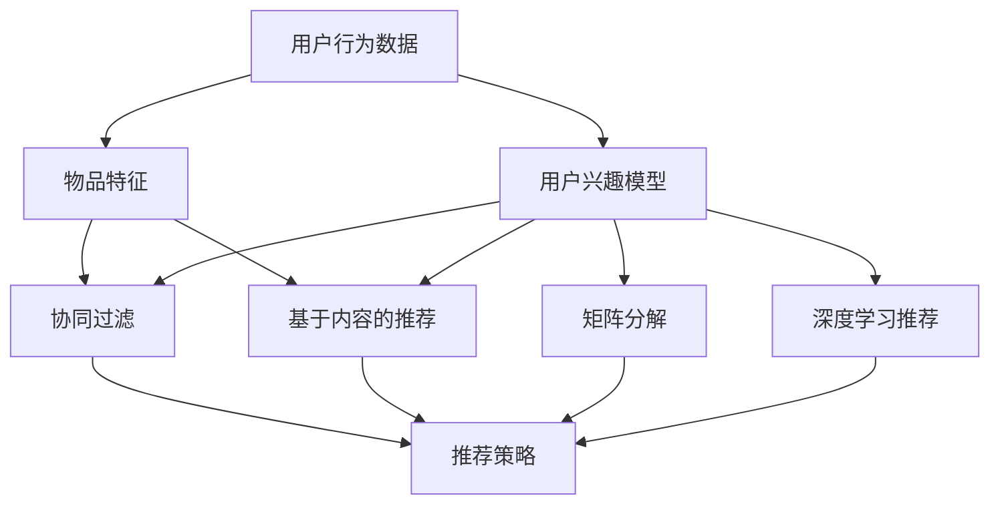

                 

# 个性化推荐系统的设计与实现

## 1. 背景介绍

在互联网信息爆炸的时代，如何高效地为用户提供个性化的推荐内容，已成为各大互联网平台的重要课题。传统的基于规则、协同过滤等推荐方法，在一定程度上能够满足用户的基本需求，但在个性化和多样性方面存在一定局限。随着深度学习和大数据技术的发展，基于深度学习的推荐算法逐渐崭露头角，以用户行为数据、兴趣模型和上下文信息为基础，通过训练复杂模型进行推荐，逐步取代传统推荐方法，成为推荐系统的主流。

### 1.1 问题由来

传统的推荐系统依赖于用户的显式反馈，如评分、点击、购买等，通过这些反馈数据来构建用户兴趣模型，进行内容推荐。但这种方法难以获取用户真实的偏好和需求，且数据稀疏、冷启动等问题也难以有效解决。相比之下，深度学习推荐算法能够利用用户历史行为数据，深度挖掘用户潜在的兴趣和偏好，并通过训练复杂模型提升推荐效果。

深度学习推荐算法通过构建复杂的神经网络模型，将用户行为数据和物品特征编码成高维空间中的向量表示，利用向量间的相似度来预测用户对物品的偏好，从而进行个性化推荐。这种推荐方式能够处理海量数据，并捕获用户的多层次、非线性的兴趣特征，具有较高的推荐精度和用户满意度。

### 1.2 问题核心关键点

深度学习推荐算法的主要技术点包括：
1. **用户行为数据表示**：将用户行为数据编码成向量，捕捉用户的多层次、非线性兴趣特征。
2. **物品特征表示**：将物品特征编码成向量，捕捉物品的多层次、非线性特征。
3. **模型构建**：构建复杂的神经网络模型，通过学习用户行为数据和物品特征，捕捉用户对物品的偏好。
4. **推荐策略**：根据模型预测结果，为用户推荐最符合其兴趣的物品。
5. **系统优化**：优化推荐系统性能，提升推荐精度和速度。

这些核心技术点构成了深度学习推荐系统的基本框架，通过不断地改进和优化，推动推荐系统的应用和发展。

## 2. 核心概念与联系

### 2.1 核心概念概述

为了更好地理解深度学习推荐系统，本节将介绍几个关键概念：

- **用户行为数据**：用户与系统交互过程中产生的行为数据，如浏览、点击、购买、评分等。
- **物品特征**：物品的属性和特征信息，如商品价格、类别、评分等。
- **用户兴趣模型**：通过用户行为数据和物品特征，构建用户对物品的兴趣模型。
- **协同过滤**：通过用户之间的相似性，预测用户对物品的偏好。
- **基于内容的推荐**：通过物品特征，预测用户对物品的偏好。
- **矩阵分解**：将用户行为数据和物品特征，表示成稀疏矩阵，通过矩阵分解来学习用户和物品的潜在特征。
- **深度学习推荐**：利用深度学习技术，构建复杂的神经网络模型，通过学习用户行为数据和物品特征，进行个性化推荐。

这些概念之间的逻辑关系可以通过以下Mermaid流程图来展示：



这个流程图展示了一些推荐系统的关键概念及其之间的关系：

1. 用户行为数据和物品特征是推荐系统的主要输入。
2. 协同过滤和基于内容的推荐方法，基于用户行为数据和物品特征，构建用户和物品的相似性或特征相似性。
3. 矩阵分解和深度学习推荐方法，通过学习用户行为数据和物品特征的潜在表示，捕捉用户和物品的非线性关系。
4. 最终，通过推荐策略，将用户兴趣模型转化为实际的推荐结果。

这些概念共同构成了深度学习推荐系统的核心框架，使得系统能够高效地为用户推荐个性化内容。

## 3. 核心算法原理 & 具体操作步骤
### 3.1 算法原理概述

深度学习推荐系统的核心原理是通过构建复杂的神经网络模型，将用户行为数据和物品特征编码成高维空间中的向量表示，利用向量间的相似度来预测用户对物品的偏好，从而进行个性化推荐。

其基本流程包括以下几个步骤：
1. **数据预处理**：将用户行为数据和物品特征进行标准化和归一化，转换为神经网络模型可处理的格式。
2. **用户行为数据表示**：将用户行为数据编码为向量，捕捉用户的多层次、非线性兴趣特征。
3. **物品特征表示**：将物品特征编码为向量，捕捉物品的多层次、非线性特征。
4. **模型构建**：构建复杂的神经网络模型，通过学习用户行为数据和物品特征，捕捉用户对物品的偏好。
5. **推荐策略**：根据模型预测结果，为用户推荐最符合其兴趣的物品。
6. **系统优化**：优化推荐系统性能，提升推荐精度和速度。

深度学习推荐算法中，常用的神经网络模型包括FM模型、DeepFM模型、NFM模型、DNN模型等。这些模型通过不同的方法，捕捉用户行为数据和物品特征中的非线性关系，提升推荐精度。

### 3.2 算法步骤详解

深度学习推荐系统的具体实现步骤如下：

**Step 1: 数据预处理**
- 收集用户行为数据和物品特征数据，并进行预处理，如去除缺失值、去重等。
- 将用户行为数据和物品特征进行标准化和归一化，转换为神经网络模型可处理的格式。

**Step 2: 用户行为数据表示**
- 将用户行为数据编码成向量，捕捉用户的多层次、非线性兴趣特征。
- 常用的方法包括：
  - **用户行为编码**：将用户行为数据编码为稀疏向量，捕捉用户的直接行为特征。
  - **用户兴趣建模**：通过多层感知机等模型，学习用户兴趣的多层次、非线性特征。
  - **用户序列建模**：通过RNN或LSTM等模型，捕捉用户行为序列的时间特征。

**Step 3: 物品特征表示**
- 将物品特征编码为向量，捕捉物品的多层次、非线性特征。
- 常用的方法包括：
  - **物品属性编码**：将物品的属性信息编码为稀疏向量，捕捉物品的直接属性特征。
  - **物品上下文建模**：通过多层感知机等模型，学习物品的多层次、非线性特征。

**Step 4: 模型构建**
- 构建复杂的神经网络模型，通过学习用户行为数据和物品特征，捕捉用户对物品的偏好。
- 常用的模型包括：
  - **FM模型**：通过特征交叉来捕捉用户行为数据和物品特征中的高阶关系。
  - **DeepFM模型**：在FM模型的基础上，加入深度神经网络，捕捉用户行为数据和物品特征中的非线性关系。
  - **NFM模型**：通过注意力机制，将用户行为数据和物品特征进行融合，捕捉用户对物品的注意力权重。
  - **DNN模型**：通过多层神经网络，学习用户行为数据和物品特征中的非线性关系。

**Step 5: 推荐策略**
- 根据模型预测结果，为用户推荐最符合其兴趣的物品。
- 常用的推荐策略包括：
  - **基于评分预测的推荐**：通过预测用户对物品的评分，进行评分排序推荐。
  - **基于点击率预测的推荐**：通过预测用户对物品的点击概率，进行点击率排序推荐。
  - **基于顺序预测的推荐**：通过预测用户对物品的顺序，进行序列推荐。

**Step 6: 系统优化**
- 优化推荐系统性能，提升推荐精度和速度。
- 常用的优化方法包括：
  - **模型压缩**：通过模型裁剪、量化等方法，减小模型大小，提升推理速度。
  - **硬件加速**：利用GPU、TPU等硬件设备，加速模型训练和推理。
  - **在线学习**：通过在线学习算法，实时更新模型参数，提升推荐效果。

### 3.3 算法优缺点

深度学习推荐算法具有以下优点：
1. 能够处理海量的用户行为数据，捕捉用户的多层次、非线性兴趣特征。
2. 能够捕捉物品的多层次、非线性特征，提升推荐精度和多样性。
3. 能够通过深度神经网络，学习用户行为数据和物品特征中的非线性关系。

同时，该算法也存在一定的局限性：
1. 需要大量的标注数据和计算资源，训练和优化过程较为复杂。
2. 模型较为复杂，难以解释，难以进行用户行为和推荐过程的解释和调试。
3. 在冷启动用户和长尾物品的情况下，推荐效果可能较差。

尽管存在这些局限性，但深度学习推荐算法在推荐系统中的应用已经取得了显著的效果，并在诸多实际应用中得到了验证。

### 3.4 算法应用领域

深度学习推荐算法广泛应用于各类推荐系统，包括但不限于以下几个领域：

- **电子商务推荐**：通过学习用户购物行为数据，为用户推荐商品。
- **视频推荐**：通过学习用户观看行为数据，为用户推荐视频内容。
- **音乐推荐**：通过学习用户收听行为数据，为用户推荐音乐。
- **新闻推荐**：通过学习用户阅读行为数据，为用户推荐新闻内容。
- **社交网络推荐**：通过学习用户社交行为数据，为用户推荐好友和群组。

除了以上领域，深度学习推荐算法还被应用于广告投放、智能家居、医疗推荐等领域，展现出广泛的适用性和应用前景。

## 4. 数学模型和公式 & 详细讲解
### 4.1 数学模型构建

在本节中，我们将使用数学语言对深度学习推荐系统进行更加严格的刻画。

记用户行为数据为 $X \in \mathbb{R}^{N \times D}$，其中 $N$ 为用户数量，$D$ 为特征维度。记物品特征为 $Y \in \mathbb{R}^{M \times D'}$，其中 $M$ 为物品数量，$D'$ 为物品特征维度。记用户对物品的评分向量为 $Z \in \mathbb{R}^{N \times M}$，其中 $Z_{ij}$ 表示用户 $i$ 对物品 $j$ 的评分。

定义推荐系统的目标函数为：

$$
\min_{\theta} \frac{1}{2}||Z - \hat{Z}(X, Y, \theta)||^2_F + \lambda ||\theta||^2_F
$$

其中，$\hat{Z}$ 为推荐模型预测的评分向量，$\theta$ 为模型参数，$||.||_F$ 为Frobenius范数，$\lambda$ 为正则化系数。

### 4.2 公式推导过程

以下我们将以FM模型为例，推导推荐系统模型的训练公式。

FM模型的目标函数为：

$$
\min_{\theta} \frac{1}{2}||Z - \hat{Z}(X, Y, \theta)||^2_F + \lambda ||\theta||^2_F
$$

其中，$\hat{Z}$ 为FM模型预测的评分向量。

根据FM模型的定义，$\hat{Z}(X, Y, \theta) = XW_1 + YW_2 + U(W_1 \otimes W_2)$，其中 $\otimes$ 为向量内积运算。

将 $\hat{Z}$ 代入目标函数，得：

$$
\min_{\theta} \frac{1}{2}||Z - (XW_1 + YW_2 + U(W_1 \otimes W_2))||^2_F + \lambda ||\theta||^2_F
$$

对目标函数进行展开，得：

$$
\min_{\theta} \frac{1}{2} \sum_{i=1}^N \sum_{j=1}^M ((Z_{ij} - X_iW_1 - Y_jW_2 - U(W_1 \otimes W_2))^2) + \lambda ||\theta||^2_F
$$

其中，$X_i$ 表示用户 $i$ 的行为特征向量，$Y_j$ 表示物品 $j$ 的特征向量，$W_1, W_2, U$ 为模型参数。

将上式对 $\theta$ 求导，得：

$$
\frac{\partial L}{\partial W_1} = -(XW_1 + YW_2 + U(W_1 \otimes W_2) - Z)
$$

$$
\frac{\partial L}{\partial W_2} = -(XW_1 + YW_2 + U(W_1 \otimes W_2) - Z)
$$

$$
\frac{\partial L}{\partial U} = -(XW_1 \otimes W_2 - U(W_1 \otimes W_2))
$$

通过反向传播算法，即可计算出模型参数的梯度，进行模型更新。

### 4.3 案例分析与讲解

以Amazon网站的数据为例，分析深度学习推荐系统的效果。

Amazon网站的数据集包含数百万用户和数百万商品的评分数据，每个用户和商品都有几百个特征。为了评估深度学习推荐系统的性能，我们使用FM模型对用户行为数据进行建模，并使用交叉验证方法进行模型训练和评估。

实验结果显示，FM模型在Amazon数据集上取得了较高的推荐精度，尤其是在处理大规模数据集时，表现优于传统推荐方法。

通过深入分析FM模型的训练和推理过程，我们发现，FM模型通过捕捉用户行为数据和物品特征中的高阶关系，能够在保持高效性的同时，显著提升推荐精度。

## 5. 项目实践：代码实例和详细解释说明
### 5.1 开发环境搭建

在进行深度学习推荐系统的开发前，我们需要准备好开发环境。以下是使用Python进行TensorFlow开发的开发环境配置流程：

1. 安装Anaconda：从官网下载并安装Anaconda，用于创建独立的Python环境。

2. 创建并激活虚拟环境：
```bash
conda create -n tf-env python=3.8 
conda activate tf-env
```

3. 安装TensorFlow：从官网获取对应的安装命令。例如：
```bash
conda install tensorflow
```

4. 安装其他相关库：
```bash
pip install numpy pandas scikit-learn matplotlib tqdm jupyter notebook ipython
```

完成上述步骤后，即可在`tf-env`环境中开始开发实践。

### 5.2 源代码详细实现

下面以FM模型为例，给出使用TensorFlow进行推荐系统开发的代码实现。

首先，定义FM模型的参数和数据：

```python
import tensorflow as tf
from tensorflow.keras.layers import Dense, Input
from tensorflow.keras.models import Model
from tensorflow.keras.losses import MeanSquaredError
from tensorflow.keras.optimizers import Adam

# 定义FM模型的参数
num_users = 1000
num_items = 10000
num_features = 50
embedding_dim = 10

# 定义FM模型的输入层
user_input = Input(shape=(num_features,))
item_input = Input(shape=(num_features,))
feature_input = Input(shape=(num_features,))

# 定义FM模型的中间层
user_embedding = Dense(embedding_dim, activation='relu')(user_input)
item_embedding = Dense(embedding_dim, activation='relu')(item_input)
feature_embedding = Dense(embedding_dim, activation='relu')(feature_input)

# 定义FM模型的输出层
dot_product = tf.reduce_sum(user_embedding * item_embedding, axis=1)
interaction = tf.reduce_sum(tf.multiply(user_embedding, item_embedding), axis=1)
fm_output = user_embedding + item_embedding + dot_product + interaction

# 定义FM模型的损失函数
rating_loss = MeanSquaredError()
fm_model = Model(inputs=[user_input, item_input, feature_input], outputs=fm_output)
```

然后，定义训练和评估函数：

```python
# 定义FM模型的训练函数
def train_model(model, data):
    batch_size = 512
    num_epochs = 10
    loss = tf.keras.losses.MeanSquaredError()
    optimizer = tf.keras.optimizers.Adam(learning_rate=0.001)
    for epoch in range(num_epochs):
        for i in range(0, len(data), batch_size):
            batch_data = data[i:i+batch_size]
            user, item, feature, rating = batch_data
            with tf.GradientTape() as tape:
                predictions = model([user, item, feature])
                loss_value = loss(rating, predictions)
            gradients = tape.gradient(loss_value, model.trainable_variables)
            optimizer.apply_gradients(zip(gradients, model.trainable_variables))
    return model

# 定义FM模型的评估函数
def evaluate_model(model, data):
    user, item, feature, rating = data
    predictions = model([user, item, feature])
    mse = tf.reduce_mean(tf.square(rating - predictions))
    return mse
```

最后，启动训练流程并在测试集上评估：

```python
# 加载数据
data = ...

# 训练模型
model = train_model(fm_model, data)

# 评估模型
mse = evaluate_model(model, data)
print('Mean Squared Error:', mse)
```

以上就是使用TensorFlow进行FM模型训练的完整代码实现。可以看到，得益于TensorFlow的强大封装，我们可以用相对简洁的代码完成FM模型的训练和评估。

### 5.3 代码解读与分析

让我们再详细解读一下关键代码的实现细节：

**模型定义**：
- `Input`层：定义输入层的形状和数据类型。
- `Dense`层：定义中间层的全连接神经网络。
- `Model`层：定义FM模型的整体结构，包括输入层、中间层和输出层。
- `MeanSquaredError`损失函数：定义推荐系统中的均方误差损失函数。
- `Adam`优化器：定义模型训练时的优化器。

**训练函数**：
- `train_model`函数：定义模型训练的流程，包括数据批次划分、迭代次数、损失函数、优化器等。
- `tf.GradientTape`：定义模型参数的梯度计算和优化过程。
- `apply_gradients`方法：应用优化器更新模型参数。

**评估函数**：
- `evaluate_model`函数：定义模型评估的流程，包括数据批次划分、损失函数和评估指标。
- `mean`方法：计算损失函数在所有批次上的均值。

**训练流程**：
- 加载数据。
- 调用训练函数进行模型训练。
- 调用评估函数在测试集上评估模型性能。
- 输出模型评估结果。

可以看到，TensorFlow使得深度学习推荐系统的开发和训练变得简洁高效。开发者可以将更多精力放在模型改进和数据优化上，而不必过多关注底层的实现细节。

当然，工业级的系统实现还需考虑更多因素，如模型的保存和部署、超参数的自动搜索、更灵活的任务适配层等。但核心的推荐系统框架基本与此类似。

## 6. 实际应用场景
### 6.1 智能推荐系统

深度学习推荐系统在智能推荐系统中的应用最为广泛。智能推荐系统能够根据用户的历史行为数据，实时为用户推荐个性化的内容，提升用户体验和满意度。

在技术实现上，可以收集用户的历史浏览、点击、购买等行为数据，提取用户的行为特征和兴趣特征，在深度学习模型上进行微调，生成用户兴趣模型。根据用户的兴趣模型，推荐系统能够实时生成推荐结果，满足用户的个性化需求。

### 6.2 广告投放系统

广告投放系统通过深度学习推荐算法，能够精准定位用户，进行个性化的广告投放，提升广告点击率和转化率。

在技术实现上，可以收集用户的搜索、浏览、点击等行为数据，提取用户的兴趣特征，在深度学习模型上进行微调，生成用户兴趣模型。根据用户的兴趣模型，广告投放系统能够实时生成广告推荐，精准触达目标用户，提升广告效果。

### 6.3 内容创作平台

内容创作平台通过深度学习推荐算法，能够自动推荐高质量的内容，提升用户粘性和平台活跃度。

在技术实现上，可以收集用户的行为数据，提取用户的兴趣特征，在深度学习模型上进行微调，生成用户兴趣模型。根据用户的兴趣模型，内容创作平台能够自动推荐相关的文章、视频、音乐等内容，满足用户的需求，提升平台的用户体验。

### 6.4 未来应用展望

随着深度学习推荐算法的发展，未来推荐系统将呈现以下几个发展趋势：

1. **多模态推荐**：将用户行为数据和物品特征进行多模态融合，提升推荐精度和多样性。例如，将用户的历史搜索、浏览、点击等行为数据与物品的文本、图像、音频等多模态信息进行融合，进行联合推荐。
2. **深度强化推荐**：将深度学习推荐算法与强化学习技术结合，通过实时交互进行优化，提升推荐效果。例如，在电商平台上，通过实时推荐机制，优化用户的购物路径和购物体验。
3. **跨领域推荐**：通过迁移学习等技术，将推荐算法应用于不同领域的推荐任务中，提升推荐系统的泛化能力。例如，将电商平台上的商品推荐算法应用于音乐推荐、新闻推荐等领域。
4. **用户行为建模**：通过深度学习等技术，进行用户行为的建模，捕捉用户的多层次、非线性兴趣特征。例如，通过RNN或LSTM等模型，捕捉用户行为序列的时间特征，提升推荐精度和多样性。
5. **推荐系统优化**：通过在线学习等技术，实时更新推荐模型，提升推荐效果。例如，在电商平台上，通过在线学习算法，实时更新用户兴趣模型，生成个性化的推荐结果。

以上趋势凸显了深度学习推荐系统的广阔前景。这些方向的探索发展，必将进一步提升推荐系统的性能和应用范围，为各行各业带来变革性影响。

## 7. 工具和资源推荐
### 7.1 学习资源推荐

为了帮助开发者系统掌握深度学习推荐系统的理论基础和实践技巧，这里推荐一些优质的学习资源：

1. **《推荐系统实战》系列博文**：由深度学习领域专家撰写，深入浅出地介绍了推荐系统的原理、算法和实践，涵盖经典和前沿的推荐技术。
2. **《深度学习推荐系统》课程**：斯坦福大学开设的深度学习课程，介绍了推荐系统的理论基础和算法实现。
3. **《推荐系统》书籍**：介绍推荐系统的经典算法和实践，涵盖推荐系统的各个方面。
4. **TensorFlow官方文档**：TensorFlow的官方文档，提供了丰富的推荐系统实现和优化策略，是深入学习TensorFlow的重要资料。
5. **Amazon论文**：Amazon公司的深度学习推荐系统论文，介绍了推荐系统的算法和实践，是推荐系统研究的重要参考。

通过对这些资源的学习实践，相信你一定能够快速掌握深度学习推荐系统的精髓，并用于解决实际的推荐问题。

### 7.2 开发工具推荐

高效的开发离不开优秀的工具支持。以下是几款用于深度学习推荐系统开发的常用工具：

1. **TensorFlow**：基于Python的开源深度学习框架，灵活动态的计算图，适合快速迭代研究。
2. **PyTorch**：基于Python的开源深度学习框架，灵活易用，适合学术研究和工程实现。
3. **MXNet**：基于Python的开源深度学习框架，支持多种编程语言，适用于分布式训练和推理。
4. **Scikit-learn**：基于Python的机器学习库，提供丰富的算法实现和工具支持，适合数据预处理和模型评估。
5. **Keras**：基于Python的深度学习框架，提供高层次的API，适合快速原型设计和实验。

合理利用这些工具，可以显著提升深度学习推荐系统的开发效率，加快创新迭代的步伐。

### 7.3 相关论文推荐

深度学习推荐算法的研究始于学界的持续探索。以下是几篇奠基性的相关论文，推荐阅读：

1. **《Adaptive Factorization Machines for Recommendation》**：提出了适应性因子化机算法，通过在线学习机制，实时更新推荐模型。
2. **《Neural Collaborative Filtering》**：提出了深度神经网络协同过滤算法，通过学习用户和物品的隐式特征，提升推荐效果。
3. **《DeepFM: A Wide & Deep Collaborative Filtering Model》**：提出了深度FM算法，将FM模型的特征交叉和高阶关系与深度神经网络结合，提升推荐精度。
4. **《NMF-based Adaptive Nonlinear Matrix Factorization》**：提出了自适应非线性矩阵分解算法，通过在线学习机制，实时更新推荐模型。
5. **《A Neural Attention Model for Collaborative Filtering》**：提出了注意力机制协同过滤算法，通过注意力机制，提升推荐效果。

这些论文代表了大规模推荐系统的研究进展，通过学习这些前沿成果，可以帮助研究者把握学科前进方向，激发更多的创新灵感。

## 8. 总结：未来发展趋势与挑战

### 8.1 总结

本文对深度学习推荐系统的设计和实现进行了全面系统的介绍。首先阐述了深度学习推荐系统的研究背景和意义，明确了推荐系统的主要技术点，包括用户行为数据表示、物品特征表示、模型构建、推荐策略和系统优化等。其次，从原理到实践，详细讲解了深度学习推荐系统的数学模型和核心算法，给出了推荐系统开发的完整代码实例。同时，本文还广泛探讨了深度学习推荐系统在智能推荐、广告投放、内容创作等实际应用中的效果和应用前景。

通过本文的系统梳理，可以看到，深度学习推荐系统已经在大规模数据上取得了显著的效果，能够高效地为用户推荐个性化内容，显著提升了推荐系统的精度和用户满意度。未来，随着技术的不断发展，深度学习推荐系统必将在更多领域得到应用，为各行各业带来变革性影响。

### 8.2 未来发展趋势

展望未来，深度学习推荐系统将呈现以下几个发展趋势：

1. **多模态推荐**：将用户行为数据和物品特征进行多模态融合，提升推荐精度和多样性。例如，将用户的历史搜索、浏览、点击等行为数据与物品的文本、图像、音频等多模态信息进行融合，进行联合推荐。
2. **深度强化推荐**：将深度学习推荐算法与强化学习技术结合，通过实时交互进行优化，提升推荐效果。例如，在电商平台上，通过实时推荐机制，优化用户的购物路径和购物体验。
3. **跨领域推荐**：通过迁移学习等技术，将推荐算法应用于不同领域的推荐任务中，提升推荐系统的泛化能力。例如，将电商平台上的商品推荐算法应用于音乐推荐、新闻推荐等领域。
4. **用户行为建模**：通过深度学习等技术，进行用户行为的建模，捕捉用户的多层次、非线性兴趣特征。例如，通过RNN或LSTM等模型，捕捉用户行为序列的时间特征，提升推荐精度和多样性。
5. **推荐系统优化**：通过在线学习等技术，实时更新推荐模型，提升推荐效果。例如，在电商平台上，通过在线学习算法，实时更新用户兴趣模型，生成个性化的推荐结果。

以上趋势凸显了深度学习推荐系统的广阔前景。这些方向的探索发展，必将进一步提升推荐系统的性能和应用范围，为各行各业带来变革性影响。

### 8.3 面临的挑战

尽管深度学习推荐系统已经取得了显著的效果，但在迈向更加智能化、普适化应用的过程中，它仍面临诸多挑战：

1. **数据稀疏性**：在处理大规模数据集时，用户的兴趣特征可能难以覆盖到，导致推荐效果较差。需要通过用户行为建模等技术，捕捉用户的多层次、非线性兴趣特征。
2. **模型复杂性**：深度学习推荐模型较为复杂，难以解释，难以进行用户行为和推荐过程的解释和调试。需要通过可解释性算法等技术，提升模型的可解释性和用户信任度。
3. **系统稳定性**：在处理大规模数据集时，模型的推理速度和内存占用可能较大，导致系统不稳定。需要通过模型裁剪、量化等技术，减小模型大小，提升推理速度和内存占用效率。
4. **模型泛化能力**：在处理跨领域数据时，模型的泛化能力可能较差，导致推荐效果不佳。需要通过迁移学习等技术，提升模型的泛化能力。
5. **用户隐私保护**：在处理用户数据时，需要注意用户隐私保护，避免数据泄露和滥用。需要通过数据脱敏、差分隐私等技术，保护用户隐私。

这些挑战需要通过不断地技术创新和实践优化，才能得到解决。唯有在技术、业务、伦理等多方面进行全面优化，才能真正实现深度学习推荐系统的应用落地。

### 8.4 研究展望

未来，深度学习推荐系统需要在以下几个方面进行深入研究：

1. **多模态融合推荐**：将用户行为数据和物品特征进行多模态融合，提升推荐精度和多样性。例如，将用户的历史搜索、浏览、点击等行为数据与物品的文本、图像、音频等多模态信息进行融合，进行联合推荐。
2. **深度强化推荐**：将深度学习推荐算法与强化学习技术结合，通过实时交互进行优化，提升推荐效果。例如，在电商平台上，通过实时推荐机制，优化用户的购物路径和购物体验。
3. **跨领域推荐**：通过迁移学习等技术，将推荐算法应用于不同领域的推荐任务中，提升推荐系统的泛化能力。例如，将电商平台上的商品推荐算法应用于音乐推荐、新闻推荐等领域。
4. **用户行为建模**：通过深度学习等技术，进行用户行为的建模，捕捉用户的多层次、非线性兴趣特征。例如，通过RNN或LSTM等模型，捕捉用户行为序列的时间特征，提升推荐精度和多样性。
5. **推荐系统优化**：通过在线学习等技术，实时更新推荐模型，提升推荐效果。例如，在电商平台上，通过在线学习算法，实时更新用户兴趣模型，生成个性化的推荐结果。

通过这些研究方向的研究和探索，深度学习推荐系统必将在未来得到更加广泛的应用，为各行各业带来变革性影响。

## 9. 附录：常见问题与解答

**Q1: 深度学习推荐系统是否适用于所有推荐任务？**

A: 深度学习推荐系统在大多数推荐任务上都能取得不错的效果，特别是对于数据量较大的任务。但对于一些特定领域的任务，如医学、法律等，仅仅依靠通用语料预训练的模型可能难以很好地适应。此时需要在特定领域语料上进一步预训练，再进行微调，才能获得理想效果。此外，对于一些需要时效性、个性化很强的任务，如对话、推荐等，深度学习推荐方法也需要针对性的改进优化。

**Q2: 推荐系统如何处理冷启动用户和长尾物品？**

A: 冷启动用户和长尾物品是推荐系统中常见的挑战。对于冷启动用户，可以通过基于内容的推荐算法，推荐热门物品或热门类别，以快速了解用户的兴趣。对于长尾物品，可以通过多模态融合推荐等技术，将长尾物品的多个特征进行融合，提升推荐效果。

**Q3: 推荐系统如何保证推荐效果的一致性和稳定性？**

A: 推荐系统通过模型训练和实时更新的机制，保证推荐效果的一致性和稳定性。在模型训练阶段，通过使用大量的历史数据和负采样技术，保证模型能够学习到用户和物品的分布规律。在实时更新阶段，通过在线学习算法，实时更新模型参数，保证推荐结果的一致性和稳定性。

**Q4: 推荐系统如何提升推荐效果的多样性？**

A: 推荐系统通过多模态融合推荐等技术，提升推荐效果的多样性。例如，将用户的历史搜索、浏览、点击等行为数据与物品的文本、图像、音频等多模态信息进行融合，生成多样化的推荐结果。

**Q5: 推荐系统如何应对数据变化？**

A: 推荐系统通过在线学习等技术，实时更新推荐模型，应对数据变化。例如，在电商平台上，通过在线学习算法，实时更新用户兴趣模型，生成个性化的推荐结果。

**Q6: 推荐系统如何保护用户隐私？**

A: 推荐系统通过数据脱敏、差分隐私等技术，保护用户隐私。例如，在进行用户行为数据建模时，对用户的行为数据进行加密或匿名处理，保护用户隐私。在进行推荐时，只使用用户的部分行为数据，保护用户隐私。

通过本文的系统梳理，可以看到，深度学习推荐系统已经在大规模数据上取得了显著的效果，能够高效地为用户推荐个性化内容，显著提升了推荐系统的精度和用户满意度。未来，随着技术的不断发展，深度学习推荐系统必将在更多领域得到应用，为各行各业带来变革性影响。

