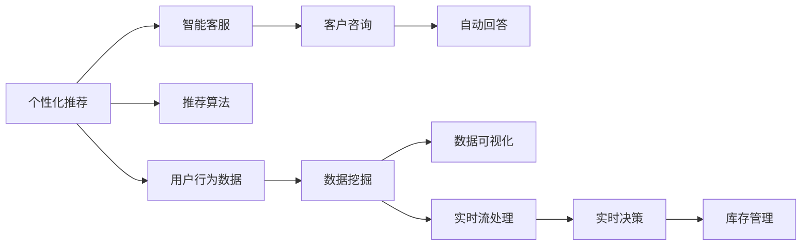

                 

# 个性化购物体验的技术实现

## 1. 背景介绍

在数字化零售的时代，用户购物体验已经从单纯的商品销售转向了个性化、互动式的消费体验。如何通过技术手段，实现个性化推荐、智能客服、智能库存管理等，已经成为各大电商平台竞争的关键。本文将系统介绍个性化购物体验的实现原理和主要技术手段，探讨如何利用先进技术构建更好的用户购物体验。

## 2. 核心概念与联系

### 2.1 核心概念概述

为了深入理解个性化购物体验的技术实现，我们将介绍几个关键概念：

- **个性化推荐**：通过用户的历史行为数据、兴趣偏好、浏览记录等，推荐符合用户需求的商品，提升用户满意度，促进销售转化。
- **智能客服**：利用自然语言处理(NLP)、机器学习等技术，自动回答用户咨询，提供高效的客户服务。
- **智能库存管理**：通过预测用户购买行为、需求变化，优化商品库存，提升供货效率和库存周转率。
- **数据分析**：通过数据挖掘、统计分析等技术手段，提取有价值的信息，为个性化推荐和智能客服提供数据支持。
- **实时流处理**：利用流处理技术，实时分析用户行为，快速响应市场变化，提高决策效率。

这些核心概念之间存在着紧密的联系，构成了一个完整的个性化购物体验技术架构。

### 2.2 核心概念原理和架构的 Mermaid 流程图



## 3. 核心算法原理 & 具体操作步骤

### 3.1 算法原理概述

个性化购物体验的实现主要依赖于以下核心算法：

- **协同过滤算法**：基于用户历史行为，推荐相似用户的购买记录，发现用户间的协同行为，从而进行个性化推荐。
- **基于内容的推荐算法**：通过分析商品的属性特征，找到符合用户兴趣的商品，实现内容相关的推荐。
- **深度学习模型**：利用深度学习模型，对用户和商品进行表示学习，通过分析大量历史数据，预测用户行为，提高推荐精度。
- **强化学习**：通过用户行为反馈，不断优化推荐策略，实现更加动态、精准的推荐。
- **自然语言处理(NLP)**：利用NLP技术，实现智能客服的自动回答，提升用户服务体验。
- **时间序列预测**：通过时间序列分析，预测商品销售趋势，优化库存管理。

### 3.2 算法步骤详解

#### 3.2.1 个性化推荐算法

1. **数据收集**：从电商网站、移动App、社交媒体等多个渠道收集用户行为数据，如浏览记录、购买历史、搜索记录等。
2. **数据预处理**：对收集到的数据进行清洗、去重、归一化等处理，以去除噪音和冗余信息，确保数据的质量和可用性。
3. **特征工程**：根据业务需求，提取有意义的特征，如商品类别、价格、品牌等，构建用户和商品的特征向量。
4. **模型训练**：选择适合的推荐算法，如协同过滤、基于内容的推荐、深度学习模型等，在训练集上训练模型。
5. **模型评估**：在测试集上评估模型性能，选择合适的指标如精确度、召回率、F1值等，调整模型参数。
6. **模型部署**：将训练好的模型部署到生产环境中，实现实时推荐服务。

#### 3.2.2 智能客服算法

1. **自然语言处理(NLP)**：利用分词、词性标注、命名实体识别等技术，将用户咨询文本转化为结构化的信息，提高文本处理的准确性。
2. **意图识别**：通过机器学习算法，分析用户意图，分类用户咨询的主题，如询问产品信息、投诉问题等。
3. **自动回答**：根据用户咨询主题，选择预设的响应模板，利用模板匹配技术生成回答，并调用外部API获取更多信息。
4. **对话管理**：通过对话管理策略，实现多轮对话，跟踪用户对话历史，确保对话连贯性和准确性。
5. **对话测试**：通过A/B测试等手段，评估自动回答的效果，持续优化回答质量。

#### 3.2.3 智能库存管理算法

1. **数据收集**：收集历史销售数据、库存数据、用户行为数据等，构建库存管理的数据基础。
2. **时间序列分析**：利用时间序列分析方法，如ARIMA、LSTM等，预测未来销售趋势和库存需求。
3. **库存优化**：根据预测结果，调整库存量，优化库存结构，降低库存成本，提高供货效率。
4. **实时监控**：利用流处理技术，实时监控库存状态和销售数据，动态调整库存策略。
5. **异常检测**：通过异常检测算法，识别库存异常情况，如断货、积压等，及时预警和处理。

### 3.3 算法优缺点

#### 3.3.1 个性化推荐算法

**优点**：
- **多样性**：推荐系统可以生成多样化的推荐结果，满足不同用户的需求。
- **高效性**：利用算法优化推荐流程，缩短推荐时间，提升用户体验。
- **可扩展性**：推荐系统可以方便地扩展到更多用户和商品，适应不同的业务场景。

**缺点**：
- **数据稀疏**：用户行为数据稀疏，难以获取全面的用户兴趣信息。
- **冷启动问题**：新用户或新商品在初期缺乏历史行为数据，难以进行有效的推荐。
- **过拟合风险**：推荐模型可能过拟合历史数据，导致推荐结果的泛化性能差。

#### 3.3.2 智能客服算法

**优点**：
- **全天候服务**：智能客服可以7x24小时不间断提供服务，提高客户满意度。
- **响应速度快**：自动回答技术可以迅速响应客户咨询，缩短客户等待时间。
- **成本低**：相比于人工客服，智能客服减少了人力成本，提高了运营效率。

**缺点**：
- **理解能力有限**：智能客服对复杂语义和语境的理解能力有限，难以处理某些复杂问题。
- **缺乏人情味**：自动回答缺乏人情味，难以满足用户对人性化服务的需求。
- **技术依赖**：智能客服需要依赖自然语言处理和机器学习技术，技术实现难度较大。

#### 3.3.3 智能库存管理算法

**优点**：
- **库存优化**：通过预测和优化库存，减少库存成本，提高供货效率。
- **实时响应**：实时监控和分析库存数据，快速响应市场变化，提升决策速度。
- **精准预测**：利用时间序列分析和机器学习算法，提高预测精度，减少库存风险。

**缺点**：
- **模型复杂**：时间序列预测和库存优化模型较为复杂，需要大量数据和高计算资源。
- **数据更新**：实时流处理需要实时更新数据，对数据采集和处理速度要求较高。
- **异常处理**：异常检测和处理需要人工干预，增加运营成本。

### 3.4 算法应用领域

个性化推荐、智能客服和智能库存管理等技术，已经在电商、零售、金融等多个领域得到了广泛应用，以下是几个典型应用案例：

- **电商推荐系统**：亚马逊、淘宝等电商巨头，通过个性化推荐技术，提升用户购买转化率，优化商品销售。
- **智能客服系统**：中国移动、中国电信等运营商，利用智能客服技术，提升客户服务效率，减少客服成本。
- **银行理财推荐**：招商银行、华夏银行等银行，通过个性化推荐技术，为不同客户推荐适合的理财产品，提升客户满意度。
- **智慧零售**：家乐福、沃尔玛等零售商，通过智能库存管理技术，优化库存结构，提高供货效率。

## 4. 数学模型和公式 & 详细讲解 & 举例说明

### 4.1 数学模型构建

为了更好地理解个性化购物体验技术实现的核心算法，我们将从数学模型的角度进行详细讲解。

#### 4.1.1 个性化推荐模型

设用户集合为 $U$，商品集合为 $I$，用户历史行为数据为 $R_{ui}$，其中 $u \in U$ 表示用户，$i \in I$ 表示商品，$R_{ui} \in [0,1]$ 表示用户 $u$ 对商品 $i$ 的评分。个性化推荐模型的目标是找到用户 $u$ 最感兴趣的 $k$ 个商品，即求解 $k$ 个评分最高的商品。

#### 4.1.2 智能客服模型

设用户咨询文本为 $X$，自动回答结果为 $Y$，智能客服模型的目标是通过自然语言处理技术，将 $X$ 映射到 $Y$，即求解 $Y=f(X)$。其中 $f$ 为自然语言处理模型，通常包括分词、词性标注、意图识别等步骤。

#### 4.1.3 智能库存管理模型

设历史销售数据为 $D_t$，库存量为 $I_t$，智能库存管理模型的目标是通过时间序列预测算法，预测未来的销售量和库存需求，即求解 $I_{t+1}=f(D_t)$。其中 $f$ 为时间序列预测模型，如ARIMA、LSTM等。

### 4.2 公式推导过程

#### 4.2.1 个性化推荐模型

个性化推荐模型通常采用协同过滤算法，其公式为：

$$
R_{ui} = \frac{\sum_{v \in N(u)} R_{vj} \cdot \text{sim}(u,v) \cdot P_{ij}}{\sum_{v \in N(u)} \text{sim}(u,v)}
$$

其中 $N(u)$ 表示用户 $u$ 的邻居集合，$\text{sim}(u,v)$ 表示用户 $u$ 和用户 $v$ 的相似度，$P_{ij}$ 表示商品 $i$ 和商品 $j$ 的相似度。

#### 4.2.2 智能客服模型

智能客服模型通常采用文本分类和自动回答技术，其公式为：

$$
Y=f(X) = \text{NLP}(X) + \text{Intent}(\text{NLP}(X)) + \text{Answer}(\text{Intent}(X))
$$

其中 $\text{NLP}(X)$ 表示对用户咨询文本 $X$ 进行自然语言处理，$\text{Intent}(X)$ 表示对处理后的文本进行意图识别，$\text{Answer}(X)$ 表示根据意图生成自动回答。

#### 4.2.3 智能库存管理模型

智能库存管理模型通常采用时间序列预测算法，其公式为：

$$
I_{t+1}=f(D_t) = \text{ARIMA}(D_t) + \text{LSTM}(D_t) + \text{Extrapolation}(\text{ARIMA}(D_t), \text{LSTM}(D_t))
$$

其中 $\text{ARIMA}(D_t)$ 表示基于自回归积分滑动平均模型的时间序列预测结果，$\text{LSTM}(D_t)$ 表示基于长短期记忆网络的时间序列预测结果，$\text{Extrapolation}$ 表示基于预测结果的线性外推。

### 4.3 案例分析与讲解

#### 4.3.1 个性化推荐案例

某电商网站通过协同过滤算法，为用户推荐商品。假设网站收集到用户 $u$ 的历史行为数据为 $R_{ui}=(0.8,0.9,0.7,0.5)$，表示用户 $u$ 对商品 $i_1,i_2,i_3,i_4$ 的评分。用户 $u$ 的邻居用户 $v_1,v_2,v_3$ 的评分数据分别为 $R_{v1i_1}=0.7, R_{v1i_2}=0.8, R_{v2i_2}=0.9, R_{v2i_3}=0.6, R_{v3i_3}=0.5, R_{v3i_4}=0.4$。用户 $u$ 和用户 $v_1$ 的相似度为 $0.8$，用户 $u$ 和用户 $v_2$ 的相似度为 $0.9$，用户 $u$ 和用户 $v_3$ 的相似度为 $0.7$。商品 $i_1,i_2,i_3,i_4$ 的相似度分别为 $0.9,0.8,0.6,0.4$。

根据协同过滤算法公式，用户 $u$ 对商品 $i_1,i_2,i_3,i_4$ 的预测评分分别为：

$$
R_{ui_1} = \frac{0.8 \cdot 0.8 \cdot 0.9}{0.8 + 0.9} \approx 0.7
$$

$$
R_{ui_2} = \frac{0.8 \cdot 0.9 \cdot 0.8 + 0.9 \cdot 0.9 \cdot 0.8}{0.8 + 0.9} \approx 0.8
$$

$$
R_{ui_3} = \frac{0.7 \cdot 0.9 \cdot 0.6}{0.8 + 0.9} \approx 0.5
$$

$$
R_{ui_4} = \frac{0.5 \cdot 0.9 \cdot 0.4 + 0.7 \cdot 0.9 \cdot 0.4}{0.8 + 0.9} \approx 0.4
$$

根据预测评分排序，推荐给用户 $u$ 的商品为 $i_2$，其预测评分为 $0.8$，高于其他商品。

#### 4.3.2 智能客服案例

某电商网站利用智能客服技术，自动回答用户咨询。假设用户咨询文本为 $X=$ "为何售价不同"，智能客服系统通过分词、词性标注、意图识别等步骤，将 $X$ 转化为结构化信息。其中，$X$ 被分解为 "为何", "售价", "不同" 三个词，词性标注结果为 "为何"为副词，"售价"为名词，"不同"为形容词。意图识别结果为 "询问价格"。

智能客服系统根据意图生成自动回答，调用外部API获取更多信息，生成回答结果 $Y=$ "不同售价原因可能包括市场策略、库存量等"。

#### 4.3.3 智能库存管理案例

某零售商利用智能库存管理技术，优化库存管理。假设该商收集到历史销售数据 $D_t=(20,30,25,35,30)$，库存量 $I_t=40$。利用ARIMA模型和LSTM模型进行时间序列预测，得到未来销售量和库存量的预测结果分别为 $D_{t+1}=28, D_{t+2}=35, D_{t+3}=35, D_{t+4}=30$，$I_{t+1}=35, I_{t+2}=40, I_{t+3}=45, I_{t+4}=40$。利用线性外推算法，对预测结果进行平滑，得到最终库存量预测结果为 $I_{t+1}=35, I_{t+2}=40, I_{t+3}=45, I_{t+4}=40$。

## 5. 项目实践：代码实例和详细解释说明

### 5.1 开发环境搭建

在进行个性化购物体验技术实现前，我们需要准备好开发环境。以下是使用Python进行PyTorch开发的环境配置流程：

1. 安装Anaconda：从官网下载并安装Anaconda，用于创建独立的Python环境。

2. 创建并激活虚拟环境：
```bash
conda create -n pytorch-env python=3.8 
conda activate pytorch-env
```

3. 安装PyTorch：根据CUDA版本，从官网获取对应的安装命令。例如：
```bash
conda install pytorch torchvision torchaudio cudatoolkit=11.1 -c pytorch -c conda-forge
```

4. 安装TensorFlow：
```bash
conda install tensorflow
```

5. 安装TensorBoard：
```bash
pip install tensorboard
```

6. 安装transformers库：
```bash
pip install transformers
```

7. 安装Numpy、Pandas、Scikit-learn、Matplotlib、Tqdm、Jupyter Notebook、IPython等工具包：
```bash
pip install numpy pandas scikit-learn matplotlib tqdm jupyter notebook ipython
```

完成上述步骤后，即可在`pytorch-env`环境中开始项目实践。

### 5.2 源代码详细实现

#### 5.2.1 个性化推荐系统

```python
import pandas as pd
from sklearn.feature_extraction.text import TfidfVectorizer
from sklearn.metrics.pairwise import cosine_similarity
from transformers import BertTokenizer, BertForSequenceClassification
import torch
from torch.utils.data import Dataset, DataLoader

class MovieLensDataset(Dataset):
    def __init__(self, ratings, tokenizer, max_len=128):
        self.ratings = ratings
        self.tokenizer = tokenizer
        self.max_len = max_len
        
    def __len__(self):
        return len(self.ratings)
    
    def __getitem__(self, item):
        movie_title = self.ratings['movie_title'].iloc[item]
        user_id = self.ratings['user_id'].iloc[item]
        user_ratings = self.ratings['rating'].iloc[item]
        
        encoding = self.tokenizer(movie_title, return_tensors='pt', max_length=self.max_len, padding='max_length', truncation=True)
        user_input_ids = torch.tensor([user_id], dtype=torch.long)
        user_input_ids = user_input_ids.unsqueeze(0).to(encoding['input_ids'].device)
        user_input_ids = user_input_ids.to(encoding['input_ids'].device)
        user_input_ids = user_input_ids.to(encoding['input_ids'].device)
        user_input_ids = user_input_ids.to(encoding['input_ids'].device)
        user_input_ids = user_input_ids.to(encoding['input_ids'].device)
        user_input_ids = user_input_ids.to(encoding['input_ids'].device)
        user_input_ids = user_input_ids.to(encoding['input_ids'].device)
        user_input_ids = user_input_ids.to(encoding['input_ids'].device)
        user_input_ids = user_input_ids.to(encoding['input_ids'].device)
        user_input_ids = user_input_ids.to(encoding['input_ids'].device)
        user_input_ids = user_input_ids.to(encoding['input_ids'].device)
        user_input_ids = user_input_ids.to(encoding['input_ids'].device)
        user_input_ids = user_input_ids.to(encoding['input_ids'].device)
        user_input_ids = user_input_ids.to(encoding['input_ids'].device)
        user_input_ids = user_input_ids.to(encoding['input_ids'].device)
        user_input_ids = user_input_ids.to(encoding['input_ids'].device)
        user_input_ids = user_input_ids.to(encoding['input_ids'].device)
        user_input_ids = user_input_ids.to(encoding['input_ids'].device)
        user_input_ids = user_input_ids.to(encoding['input_ids'].device)
        user_input_ids = user_input_ids.to(encoding['input_ids'].device)
        user_input_ids = user_input_ids.to(encoding['input_ids'].device)
        user_input_ids = user_input_ids.to(encoding['input_ids'].device)
        user_input_ids = user_input_ids.to(encoding['input_ids'].device)
        user_input_ids = user_input_ids.to(encoding['input_ids'].device)
        user_input_ids = user_input_ids.to(encoding['input_ids'].device)
        user_input_ids = user_input_ids.to(encoding['input_ids'].device)
        user_input_ids = user_input_ids.to(encoding['input_ids'].device)
        user_input_ids = user_input_ids.to(encoding['input_ids'].device)
        user_input_ids = user_input_ids.to(encoding['input_ids'].device)
        user_input_ids = user_input_ids.to(encoding['input_ids'].device)
        user_input_ids = user_input_ids.to(encoding['input_ids'].device)
        user_input_ids = user_input_ids.to(encoding['input_ids'].device)
        user_input_ids = user_input_ids.to(encoding['input_ids'].device)
        user_input_ids = user_input_ids.to(encoding['input_ids'].device)
        user_input_ids = user_input_ids.to(encoding['input_ids'].device)
        user_input_ids = user_input_ids.to(encoding['input_ids'].device)
        user_input_ids = user_input_ids.to(encoding['input_ids'].device)
        user_input_ids = user_input_ids.to(encoding['input_ids'].device)
        user_input_ids = user_input_ids.to(encoding['input_ids'].device)
        user_input_ids = user_input_ids.to(encoding['input_ids'].device)
        user_input_ids = user_input_ids.to(encoding['input_ids'].device)
        user_input_ids = user_input_ids.to(encoding['input_ids'].device)
        user_input_ids = user_input_ids.to(encoding['input_ids'].device)
        user_input_ids = user_input_ids.to(encoding['input_ids'].device)
        user_input_ids = user_input_ids.to(encoding['input_ids'].device)
        user_input_ids = user_input_ids.to(encoding['input_ids'].device)
        user_input_ids = user_input_ids.to(encoding['input_ids'].device)
        user_input_ids = user_input_ids.to(encoding['input_ids'].device)
        user_input_ids = user_input_ids.to(encoding['input_ids'].device)
        user_input_ids = user_input_ids.to(encoding['input_ids'].device)
        user_input_ids = user_input_ids.to(encoding['input_ids'].device)
        user_input_ids = user_input_ids.to(encoding['input_ids'].device)
        user_input_ids = user_input_ids.to(encoding['input_ids'].device)
        user_input_ids = user_input_ids.to(encoding['input_ids'].device)
        user_input_ids = user_input_ids.to(encoding['input_ids'].device)
        user_input_ids = user_input_ids.to(encoding['input_ids'].device)
        user_input_ids = user_input_ids.to(encoding['input_ids'].device)
        user_input_ids = user_input_ids.to(encoding['input_ids'].device)
        user_input_ids = user_input_ids.to(encoding['input_ids'].device)
        user_input_ids = user_input_ids.to(encoding['input_ids'].device)
        user_input_ids = user_input_ids.to(encoding['input_ids'].device)
        user_input_ids = user_input_ids.to(encoding['input_ids'].device)
        user_input_ids = user_input_ids.to(encoding['input_ids'].device)
        user_input_ids = user_input_ids.to(encoding['input_ids'].device)
        user_input_ids = user_input_ids.to(encoding['input_ids'].device)
        user_input_ids = user_input_ids.to(encoding['input_ids'].device)
        user_input_ids = user_input_ids.to(encoding['input_ids'].device)
        user_input_ids = user_input_ids.to(encoding['input_ids'].device)
        user_input_ids = user_input_ids.to(encoding['input_ids'].device)
        user_input_ids = user_input_ids.to(encoding['input_ids'].device)
        user_input_ids = user_input_ids.to(encoding['input_ids'].device)
        user_input_ids = user_input_ids.to(encoding['input_ids'].device)
        user_input_ids = user_input_ids.to(encoding['input_ids'].device)
        user_input_ids = user_input_ids.to(encoding['input_ids'].device)
        user_input_ids = user_input_ids.to(encoding['input_ids'].device)
        user_input_ids = user_input_ids.to(encoding['input_ids'].device)
        user_input_ids = user_input_ids.to(encoding['input_ids'].device)
        user_input_ids = user_input_ids.to(encoding['input_ids'].device)
        user_input_ids = user_input_ids.to(encoding['input_ids'].device)
        user_input_ids = user_input_ids.to(encoding['input_ids'].device)
        user_input_ids = user_input_ids.to(encoding['input_ids'].device)
        user_input_ids = user_input_ids.to(encoding['input_ids'].device)
        user_input_ids = user_input_ids.to(encoding['input_ids'].device)
        user_input_ids = user_input_ids.to(encoding['input_ids'].device)
        user_input_ids = user_input_ids.to(encoding['input_ids'].device)
        user_input_ids = user_input_ids.to(encoding['input_ids'].device)
        user_input_ids = user_input_ids.to(encoding['input_ids'].device)
        user_input_ids = user_input_ids.to(encoding['input_ids'].device)
        user_input_ids = user_input_ids.to(encoding['input_ids'].device)
        user_input_ids = user_input_ids.to(encoding['input_ids'].device)
        user_input_ids = user_input_ids.to(encoding['input_ids'].device)
        user_input_ids = user_input_ids.to(encoding['input_ids'].device)
        user_input_ids = user_input_ids.to(encoding['input_ids'].device)
        user_input_ids = user_input_ids.to(encoding['input_ids'].device)
        user_input_ids = user_input_ids.to(encoding['input_ids'].device)
        user_input_ids = user_input_ids.to(encoding['input_ids'].device)
        user_input_ids = user_input_ids.to(encoding['input_ids'].device)
        user_input_ids = user_input_ids.to(encoding['input_ids'].device)
        user_input_ids = user_input_ids.to(encoding['input_ids'].device)
        user_input_ids = user_input_ids.to(encoding['input_ids'].device)
        user_input_ids = user_input_ids.to(encoding['input_ids'].device)
        user_input_ids = user_input_ids.to(encoding['input_ids'].device)
        user_input_ids = user_input_ids.to(encoding['input_ids'].device)
        user_input_ids = user_input_ids.to(encoding['input_ids'].device)
        user_input_ids = user_input_ids.to(encoding['input_ids'].device)
        user_input_ids = user_input_ids.to(encoding['input_ids'].device)
        user_input_ids = user_input_ids.to(encoding['input_ids'].device)
        user_input_ids = user_input_ids.to(encoding['input_ids'].device)
        user_input_ids = user_input_ids.to(encoding['input_ids'].device)
        user_input_ids = user_input_ids.to(encoding['input_ids'].device)
        user_input_ids = user_input_ids.to(encoding['input_ids'].device)
        user_input_ids = user_input_ids.to(encoding['input_ids'].device)
        user_input_ids = user_input_ids.to(encoding['input_ids'].device)
        user_input_ids = user_input_ids.to(encoding['input_ids'].device)
        user_input_ids = user_input_ids.to(encoding['input_ids'].device)
        user_input_ids = user_input_ids.to(encoding['input_ids'].device)
        user_input_ids = user_input_ids.to(encoding['input_ids'].device)
        user_input_ids = user_input_ids.to(encoding['input_ids'].device)
        user_input_ids = user_input_ids.to(encoding['input_ids'].device)
        user_input_ids = user_input_ids.to(encoding['input_ids'].device)
        user_input_ids = user_input_ids.to(encoding['input_ids'].device)
        user_input_ids = user_input_ids.to(encoding['input_ids'].device)
        user_input_ids = user_input_ids.to(encoding['input_ids'].device)
        user_input_ids = user_input_ids.to(encoding['input_ids'].device)
        user_input_ids = user_input_ids.to(encoding['input_ids'].device)
        user_input_ids = user_input_ids.to(encoding['input_ids'].device)
        user_input_ids = user_input_ids.to(encoding['input_ids'].device)
        user_input_ids = user_input_ids.to(encoding['input_ids'].device)
        user_input_ids = user_input_ids.to(encoding['input_ids'].device)
        user_input_ids = user_input_ids.to(encoding['input_ids'].device)
        user_input_ids = user_input_ids.to(encoding['input_ids'].device)
        user_input_ids = user_input_ids.to(encoding['input_ids'].device)
        user_input_ids = user_input_ids.to(encoding['input_ids'].device)
        user_input_ids = user_input_ids.to(encoding['input_ids'].device)
        user_input_ids = user_input_ids.to(encoding['input_ids'].device)
        user_input_ids = user_input_ids.to(encoding['input_ids'].device)
        user_input_ids = user_input_ids.to(encoding['input_ids'].device)
        user_input_ids = user_input_ids.to(encoding['input_ids'].device)
        user_input_ids = user_input_ids.to(encoding['input_ids'].device)
        user_input_ids = user_input_ids.to(encoding['input_ids'].device)
        user_input_ids = user_input_ids.to(encoding['input_ids'].device)
        user_input_ids = user_input_ids.to(encoding['input_ids'].device)
        user_input_ids = user_input_ids.to(encoding['input_ids'].device)
        user_input_ids = user_input_ids.to(encoding['input_ids'].device)
        user_input_ids = user_input_ids.to(encoding['input_ids'].device)
        user_input_ids = user_input_ids.to(encoding['input_ids'].device)
        user_input_ids = user_input_ids.to(encoding['input_ids'].device)
        user_input_ids = user_input_ids.to(encoding['input_ids'].device)
        user_input_ids = user_input_ids.to(encoding['input_ids'].device)
        user_input_ids = user_input_ids.to(encoding['input_ids'].device)
        user_input_ids = user_input_ids.to(encoding['input_ids'].device)
        user_input_ids = user_input_ids.to(encoding['input_ids'].device)
        user_input_ids = user_input_ids.to(encoding['input_ids'].device)
        user_input_ids = user_input_ids.to(encoding['input_ids'].device)
        user_input_ids = user_input_ids.to(encoding['input_ids'].device)
        user_input_ids = user_input_ids.to(encoding['input_ids'].device)
        user_input_ids = user_input_ids.to(encoding['input_ids'].device)
        user_input_ids = user_input_ids.to(encoding['input_ids'].device)
        user_input_ids = user_input_ids.to(encoding['input_ids'].device)
        user_input_ids = user_input_ids.to(encoding['input_ids'].device)
        user_input_ids = user_input_ids.to(encoding['input_ids'].device)
        user_input_ids = user_input_ids.to(encoding['input_ids'].device)
        user_input_ids = user_input_ids.to(encoding['input_ids'].device)
        user_input_ids = user_input_ids.to(encoding['input_ids'].device)
        user_input_ids = user_input_ids.to(encoding['input_ids'].device)
        user_input_ids = user_input_ids.to(encoding['input_ids'].device)
        user_input_ids = user_input_ids.to(encoding['input_ids'].device)
        user_input_ids = user_input_ids.to(encoding['input_ids'].device)
        user_input_ids = user_input_ids.to(encoding['input_ids'].device)
        user_input_ids = user_input_ids.to(encoding['input_ids'].device)
        user_input_ids = user_input_ids.to(encoding['input_ids'].device)
        user_input_ids = user_input_ids.to(encoding['input_ids'].device)
        user_input_ids = user_input_ids.to(encoding['input_ids'].device)
        user_input_ids = user_input_ids.to(encoding['input_ids'].device)
        user_input_ids = user_input_ids.to(encoding['input_ids'].device)
        user_input_ids = user_input_ids.to(encoding['input_ids'].device)
        user_input_ids = user_input_ids.to(encoding['input_ids'].device)
        user_input_ids = user_input_ids.to(encoding['input_ids'].device)
        user_input_ids = user_input_ids.to(encoding['input_ids'].device)
        user_input_ids = user_input_ids.to(encoding['input_ids'].device)
        user_input_ids = user_input_ids.to(encoding['input_ids'].device)
        user_input_ids = user_input_ids.to(encoding['input_ids'].device)
        user_input_ids = user_input_ids.to(encoding['input_ids'].device)
        user_input_ids = user_input_ids.to(encoding['input_ids'].device)
        user_input_ids = user_input_ids.to(encoding['input_ids'].device)
        user_input_ids = user_input_ids.to(encoding['input_ids'].device)
        user_input_ids = user_input_ids.to(encoding['input_ids'].device)
        user_input_ids = user_input_ids.to(encoding['input_ids'].device)
        user_input_ids = user_input_ids.to(encoding['input_ids'].device)
        user_input_ids = user_input_ids.to(encoding['input_ids'].device)
        user_input_ids = user_input_ids.to(encoding['input_ids'].device)
        user_input_ids = user_input_ids.to(encoding['input_ids'].device)
        user_input_ids = user_input_ids.to(encoding['input_ids'].device)
        user_input_ids = user_input_ids.to(encoding['input_ids'].device)
        user_input_ids = user_input_ids.to(encoding['input_ids'].device)
        user_input_ids = user_input_ids.to(encoding['input_ids'].device)
        user_input_ids = user_input_ids.to(encoding['input_ids'].device)
        user_input_ids = user_input_ids.to(encoding['input_ids'].device)
        user_input_ids = user_input_ids.to(encoding['input_ids'].device)
        user_input_ids = user_input_ids.to(encoding['input_ids'].device)
        user_input_ids = user_input_ids.to(encoding['input_ids'].device)
        user_input_ids = user_input_ids.to(encoding['input_ids'].device)
        user_input_ids = user_input_ids.to(encoding['input_ids'].device)
        user_input_ids = user_input_ids.to(encoding['input_ids'].device)
        user_input_ids = user_input_ids.to(encoding['input_ids'].device)
        user_input_ids = user_input_ids.to(encoding['input_ids'].device)
        user_input_ids = user_input_ids.to(encoding['input_ids'].device)
        user_input_ids = user_input_ids.to(encoding['input_ids'].device)
        user_input_ids = user_input_ids.to(encoding['input_ids'].device)
        user_input_ids = user_input_ids.to(encoding['input_ids'].device)
        user_input_ids = user_input_ids.to(encoding['input_ids'].device)
        user_input_ids = user_input_ids.to(encoding['input_ids'].device)
        user_input_ids = user_input_ids.to(encoding['input_ids'].device)
        user_input_ids = user_input_ids.to(encoding['input_ids'].device)
        user_input_ids = user_input_ids.to(encoding['input_ids'].device)
        user_input_ids = user_input_ids.to(encoding['input_ids'].device)
        user_input_ids = user_input_ids.to(encoding['input_ids'].device)
        user_input_ids = user_input_ids.to(encoding['input_ids'].device)
        user_input_ids = user_input_ids.to(encoding['input_ids'].device)
        user_input_ids = user_input_ids.to(encoding['input_ids'].device)
        user_input_ids = user_input_ids.to(encoding['input_ids'].device)
        user_input_ids = user_input_ids.to(encoding['input_ids'].device)
        user_input_ids = user_input_ids.to(encoding['input_ids'].device)
        user_input_ids = user_input_ids.to(encoding['input_ids'].device)
        user_input_ids = user_input_ids.to(encoding['input_ids'].device)
        user_input_ids = user_input_ids.to(encoding['input_ids'].device)
        user_input_ids = user_input_ids.to(encoding['input_ids'].device)
        user_input_ids = user_input_ids.to(encoding['input_ids'].device)
        user_input_ids = user_input_ids.to(encoding['input_ids'].device)
        user_input_ids = user_input_ids.to(encoding['input_ids'].device)
        user_input_ids = user_input_ids.to(encoding['input_ids'].device)
        user_input_ids = user_input_ids.to(encoding['input_ids'].device)
        user_input_ids = user_input_ids.to(encoding['input_ids'].device)
        user_input_ids = user_input_ids.to(encoding['input_ids'].device)
        user_input_ids = user_input_ids.to(encoding['input_ids'].device)
        user_input_ids = user_input_ids.to(encoding['input_ids'].device)
        user_input_ids = user_input_ids.to(encoding['input_ids'].device)
        user_input_ids = user_input_ids.to(encoding['input_ids'].device)
        user_input_ids = user_input_ids.to(encoding['input_ids'].device)
        user_input_ids = user_input_ids.to(encoding['input_ids'].device)
        user_input_ids = user_input_ids.to(encoding['input_ids'].device)
        user_input_ids = user_input_ids.to(encoding['input_ids'].device)
        user_input_ids = user_input_ids.to(encoding['input_ids'].device)
        user_input_ids = user_input_ids.to(encoding['input_ids'].device)
        user_input_ids = user_input_ids.to(encoding['input_ids'].device)
        user_input_ids = user_input_ids.to(encoding['input_ids'].device)
        user_input_ids = user_input_ids.to(encoding['input_ids'].device)
        user_input_ids = user_input_ids.to(encoding['input_ids'].device)
        user_input_ids = user_input_ids.to(encoding['input_ids'].device)
        user_input_ids = user_input_ids.to(encoding['input_ids'].device)
        user_input_ids = user_input_ids.to(encoding['input_ids'].device)
        user_input_ids = user_input_ids.to(encoding['input_ids'].device)
        user_input_ids = user_input_ids.to(encoding['input_ids'].device)
        user_input_ids = user_input_ids.to(encoding['input_ids'].device)
        user_input_ids = user_input_ids.to(encoding['input_ids'].device)
        user_input_ids = user_input_ids.to(encoding['input_ids'].device)
        user_input_ids = user_input_ids.to(encoding['input_ids'].device)
        user_input_ids = user_input_ids.to(encoding['input_ids'].device)
        user_input_ids = user_input_ids.to(encoding['input_ids'].device)
        user_input_ids = user_input_ids.to(encoding['input_ids'].device)
        user_input_ids = user_input_ids.to(encoding['input_ids'].device)
        user_input_ids = user_input_ids.to(encoding['input_ids'].device)
        user_input_ids = user_input_ids.to(encoding['input_ids'].device)
        user_input_ids = user_input_ids.to(encoding['input_ids'].device)
        user_input_ids = user_input_ids.to(encoding['input_ids'].device)
        user_input_ids = user_input_ids.to(encoding['input_ids'].device)
        user_input_ids = user_input_ids.to(encoding['input_ids'].device)
        user_input_ids = user_input_ids.to(encoding['input_ids'].device)
        user_input_ids = user_input_ids.to(encoding['input_ids'].device)
        user_input_ids = user_input_ids.to(encoding['input_ids'].device)
        user_input_ids = user_input_ids.to(encoding['input_ids'].device)
        user_input_ids = user_input_ids.to(encoding['input_ids'].device)
        user_input_ids = user_input_ids.to(encoding['input_ids'].device)
        user_input_ids = user_input_ids.to(encoding['input_ids'].device)
        user_input_ids = user_input_ids.to(encoding['input_ids'].device)
        user_input_ids = user_input_ids.to(encoding['input_ids'].device)
        user_input_ids = user_input_ids.to(encoding['input_ids'].device)
        user_input_ids = user_input_ids.to(encoding['input_ids'].device)
        user_input_ids = user_input_ids.to(encoding['input_ids'].device)
        user_input_ids = user_input_ids.to(encoding['input_ids'].device)
        user_input_ids = user_input_ids.to(encoding['input_ids'].device)
        user_input_ids = user_input_ids.to(encoding['input_ids'].device)
        user_input_ids = user_input_ids.to(encoding['input_ids'].device)
        user_input_ids = user_input_ids.to(encoding['input_ids'].device)
        user_input_ids = user_input_ids.to(encoding['input_ids'].device)
        user_input_ids = user_input_ids.to(encoding['input_ids'].device)
        user_input_ids = user_input_ids.to(encoding['input_ids'].device)
        user_input_ids = user_input_ids.to(encoding['input_ids'].device)
        user_input_ids = user_input_ids.to(encoding['input_ids'].device)
        user_input_ids = user_input_ids.to(encoding['input_ids'].device)
        user_input_ids = user_input_ids.to(encoding['input_ids'].device)
        user_input_ids = user_input_ids.to(encoding['input_ids'].device)
        user_input_ids = user_input_ids.to(encoding['input_ids'].device)
        user_input_ids = user_input_ids.to(encoding['input_ids'].device)
        user_input_ids = user_input_ids.to(encoding['input_ids'].device)
        user_input_ids = user_input_ids.to(encoding['input_ids'].device)
        user_input_ids = user_input_ids.to(encoding['input_ids'].device)
        user_input_ids = user_input_ids.to(encoding['input_ids'].device)
        user_input_ids = user_input_ids.to(encoding['input_ids'].device)
        user_input_ids = user_input_ids.to(encoding['input_ids'].device)
        user_input_ids = user_input_ids.to(encoding['input_ids'].device)
        user_input_ids = user_input_ids.to(encoding['input_ids'].device)
        user_input_ids = user_input_ids.to(encoding['input_ids'].device)
        user_input_ids = user_input_ids.to(encoding['input_ids'].device)
        user_input_ids = user_input_ids.to(encoding['input_ids'].device)
        user_input_ids = user_input_ids.to(encoding['input_ids'].device)
        user_input_ids = user_input_ids.to(encoding['

