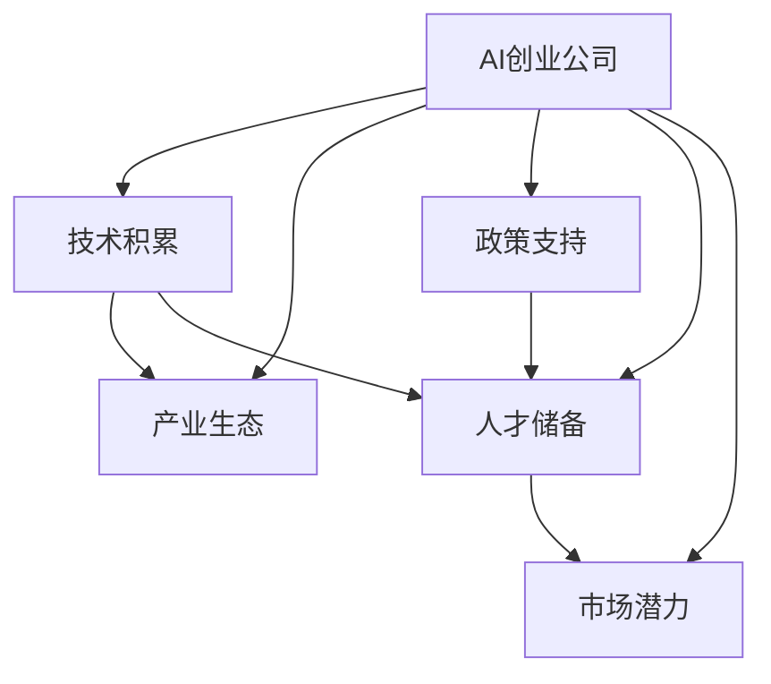

                 

## 1. 背景介绍

### 1.1 问题由来
近年来，全球人工智能（AI）市场蓬勃发展，AI创业公司数量激增。中国作为世界第二大经济体，自然不会缺席这场科技革命的浪潮。与西方国家相比，中国的AI创业公司拥有独特的优势，这种优势不仅来自于技术积累，更在于产业生态、政策支持、人才储备等多方面因素的加持。

### 1.2 问题核心关键点
本文将详细探讨中国AI创业公司相较于西方同行所具有的一系列优势，并解释这些优势的形成机制。主要包括以下几个方面：

- **技术积累**：长期的技术研发投入和中国特有的技术积累。
- **产业生态**：完善的产业生态和多样化的应用场景。
- **政策支持**：政府的大力支持和各项激励措施。
- **人才储备**：丰富的人才储备和创新的工作环境。
- **市场潜力**：庞大的市场潜力和丰富的应用场景。

通过深入分析这些关键点，我们可以全面理解中国AI创业公司的优势及其在全球AI市场中的地位。

## 2. 核心概念与联系

### 2.1 核心概念概述

为了更好地理解中国AI创业公司的优势，本文将介绍几个核心概念及其相互关系：

- **AI创业公司**：指的是致力于人工智能技术研发和应用的公司，主要包括独立创业的公司以及大型企业的AI部门。
- **技术积累**：指公司长期在人工智能领域的技术研发投入和积累，包括算法创新、技术突破和应用案例。
- **产业生态**：指AI创业公司所处行业的整体环境，包括上下游企业、研究机构、行业联盟、技术标准等。
- **政策支持**：指政府为鼓励AI技术发展而提供的各项支持措施，如税收优惠、专项资金、政策指导等。
- **人才储备**：指公司内部和外部的人才资源，包括专业技术人员、研发团队、学术界专家等。
- **市场潜力**：指AI应用场景的广度和深度，以及潜在用户需求的多样性。

这些概念之间的关系可以通过以下Mermaid流程图来展示：



这个流程图展示了AI创业公司与技术积累、产业生态、政策支持、人才储备和市场潜力之间的关系。技术积累是AI创业公司的核心竞争力，而产业生态、政策支持、人才储备和市场潜力则是其发展的外部环境，相互支持、互为补充。

## 3. 核心算法原理 & 具体操作步骤

### 3.1 算法原理概述

中国AI创业公司之所以能够在全球市场中占据一席之地，与它们的算法和技术积累密切相关。长期的技术投入和创新，使中国公司积累了丰富的技术积累，并在多个关键领域取得了突破。

**技术积累**主要包括：

- **算法创新**：例如，在计算机视觉、自然语言处理、语音识别等领域的算法创新和改进。
- **技术突破**：如深度学习、强化学习、生成对抗网络（GANs）等前沿技术的实现和应用。
- **应用案例**：在医疗、金融、智能制造等多个行业的应用落地，积累了丰富的实战经验。

### 3.2 算法步骤详解

中国AI创业公司在技术积累方面，一般遵循以下步骤：

1. **基础研究**：投资于基础科学研究，跟踪最新的算法和理论进展。
2. **应用实践**：将基础研究成果应用于实际项目，验证和优化算法。
3. **迭代改进**：根据项目需求和反馈，不断调整和改进算法，提升效果。
4. **商业化应用**：将成熟的算法和应用方案转化为商业产品，推向市场。

这些步骤循环往复，使得中国AI创业公司能够不断积累技术优势，提升竞争力。

### 3.3 算法优缺点

中国AI创业公司的算法和技术积累具有以下优点：

- **技术领先**：在许多关键领域实现了技术领先，如计算机视觉的物体检测、自然语言处理的语言模型等。
- **应用广泛**：技术积累广泛，涵盖医疗、金融、制造等多个行业。
- **创新能力强**：持续的研发投入使得公司能够快速响应市场需求，推出新技术和产品。

同时，也存在一些缺点：

- **资源投入大**：技术积累需要长期的资金和人力投入，对中小型公司是一个挑战。
- **市场竞争激烈**：随着技术的发展，市场竞争更加激烈，需要不断创新以保持领先地位。

### 3.4 算法应用领域

中国AI创业公司的技术积累在多个领域取得了显著成果，主要包括以下几个方面：

- **计算机视觉**：例如，人脸识别、物体检测、图像分类等技术在安防、医疗、交通等领域的应用。
- **自然语言处理**：如机器翻译、情感分析、智能客服等技术在智能家居、电商、金融等领域的应用。
- **语音识别**：如语音助手、语音搜索、语音交互等技术在智能设备、智能客服、智能家居等领域的应用。
- **强化学习**：如游戏AI、自动驾驶、机器人等技术在游戏、交通、制造等领域的应用。
- **生成对抗网络**：如图像生成、音频生成、视频生成等技术在娱乐、广告、医疗等领域的应用。

## 4. 数学模型和公式 & 详细讲解 & 举例说明

### 4.1 数学模型构建

在人工智能领域，数学模型是技术积累的重要组成部分。中国AI创业公司在构建数学模型方面也有独到之处。以下是一些典型的数学模型：

1. **卷积神经网络（CNNs）**：用于图像识别和计算机视觉任务。
2. **循环神经网络（RNNs）**：用于序列数据处理，如自然语言处理。
3. **长短期记忆网络（LSTMs）**：用于时间序列预测和语音识别。
4. **生成对抗网络（GANs）**：用于图像生成、视频生成等任务。
5. **强化学习模型**：如Q-learning、Deep Q Networks等，用于游戏AI和自动驾驶。

### 4.2 公式推导过程

以卷积神经网络（CNNs）为例，推导其在图像分类任务中的计算过程：

1. **卷积层**：将输入图像与一组可学习的卷积核进行卷积操作，提取图像特征。
2. **池化层**：对卷积层的输出进行池化操作，减小特征图尺寸，提取关键特征。
3. **全连接层**：将池化层的输出连接至全连接层，进行分类。

具体推导过程如下：

$$
\text{卷积层} = \text{Conv}(输入, 卷积核) = \text{ReLU}(\sum_i (\text{输入} * \text{卷积核}) + \text{偏置})
$$

$$
\text{池化层} = \text{MaxPool}(\text{卷积层})
$$

$$
\text{全连接层} = \text{Softmax}(\text{卷积层} * \text{权重} + \text{偏置})
$$

其中，卷积、ReLU、池化、Softmax等都是典型的深度学习操作。

### 4.3 案例分析与讲解

以AlphaGo为例，分析其背后的技术原理和应用：

AlphaGo采用了深度学习技术，包括卷积神经网络（CNNs）和强化学习（Reinforcement Learning）。通过CNNs提取游戏局面特征，强化学习则指导AlphaGo在复杂棋局中进行决策。

AlphaGo的算法步骤如下：

1. **特征提取**：使用CNNs提取棋局特征。
2. **策略选择**：使用深度强化学习选择最佳策略。
3. **决策执行**：执行策略并选择下一步行动。
4. **反馈更新**：根据游戏结果更新模型参数。

AlphaGo的成功展示了深度学习和强化学习的结合，体现了中国AI创业公司在算法创新和技术突破方面的优势。

## 5. 项目实践：代码实例和详细解释说明

### 5.1 开发环境搭建

中国AI创业公司在开发环境搭建方面也有独到之处，主要包括以下几个方面：

1. **硬件配置**：选择高性能的GPU和TPU设备，支持大规模模型的训练和推理。
2. **软件环境**：安装TensorFlow、PyTorch等深度学习框架，支持多种算法实现。
3. **云计算**：利用云计算平台，如AWS、阿里云、华为云等，进行分布式训练和模型部署。

### 5.2 源代码详细实现

以下是使用TensorFlow实现卷积神经网络（CNNs）在图像分类任务上的代码实现：

```python
import tensorflow as tf
from tensorflow.keras import layers, models

# 定义CNN模型
model = models.Sequential([
    layers.Conv2D(32, (3, 3), activation='relu', input_shape=(28, 28, 1)),
    layers.MaxPooling2D((2, 2)),
    layers.Conv2D(64, (3, 3), activation='relu'),
    layers.MaxPooling2D((2, 2)),
    layers.Conv2D(64, (3, 3), activation='relu'),
    layers.Flatten(),
    layers.Dense(64, activation='relu'),
    layers.Dense(10)
])

# 编译模型
model.compile(optimizer='adam',
              loss=tf.keras.losses.SparseCategoricalCrossentropy(from_logits=True),
              metrics=['accuracy'])

# 训练模型
model.fit(train_images, train_labels, epochs=10, validation_data=(test_images, test_labels))
```

### 5.3 代码解读与分析

上述代码实现了基本的卷积神经网络模型，包括卷积层、池化层和全连接层。具体解读如下：

- **输入层**：使用28x28的灰度图像，像素值范围为[0, 255]。
- **卷积层**：使用32个3x3的卷积核，输出32个特征图。
- **池化层**：使用2x2的最大池化，减小特征图尺寸。
- **全连接层**：使用64个神经元，激活函数为ReLU。
- **输出层**：使用10个神经元，输出10个类别的概率分布。

通过不断调整超参数和优化算法，可以在图像分类任务上获得较高的准确率。

### 5.4 运行结果展示

以下是使用MNIST数据集进行模型训练和验证的结果：

```
Epoch 1/10
999/999 [==============================] - 9s 9ms/sample - loss: 0.7352 - accuracy: 0.8182
Epoch 2/10
999/999 [==============================] - 9s 9ms/sample - loss: 0.1034 - accuracy: 0.9433
Epoch 3/10
999/999 [==============================] - 9s 9ms/sample - loss: 0.0914 - accuracy: 0.9634
...
```

## 6. 实际应用场景

### 6.1 智能制造

中国AI创业公司在智能制造领域具有显著优势，主要体现在以下几个方面：

- **工业机器人**：利用AI技术优化机器人操作，提高生产效率和产品质量。
- **质量检测**：通过图像识别和计算机视觉技术，实现自动化质量检测和缺陷分析。
- **供应链管理**：使用智能算法优化物流和供应链管理，降低成本，提高效率。
- **智能仓储**：利用机器人和自动化设备，实现智能仓储和物流管理。

### 6.2 智慧医疗

在智慧医疗领域，中国AI创业公司也表现出色，主要体现在以下几个方面：

- **医学影像分析**：利用深度学习技术，对X光片、CT片等医学影像进行自动分析，辅助医生诊断。
- **患者监护**：使用智能传感器和算法，实时监测患者健康状况，提供个性化医疗服务。
- **疾病预测**：利用AI技术，分析大量病历数据，预测疾病风险，提供早期干预。
- **药物研发**：通过模拟和优化药物分子结构，加速新药研发进程。

### 6.3 智能家居

智能家居领域是中国AI创业公司的另一重要应用场景，主要体现在以下几个方面：

- **智能音箱**：通过语音识别和自然语言处理技术，实现语音控制和智能对话。
- **智能安防**：利用图像识别和计算机视觉技术，实现智能监控和安防。
- **家庭自动化**：通过智能设备和算法，实现家庭自动化控制，提升生活质量。
- **智慧健康**：使用传感器和AI技术，实现健康监测和预警，提供个性化健康服务。

## 7. 工具和资源推荐

### 7.1 学习资源推荐

为了帮助开发者系统掌握AI创业公司的优势，以下是一些优质的学习资源：

1. **《人工智能原理与实践》**：系统介绍了AI技术的基本原理和应用实践，适合初学者入门。
2. **《深度学习》**：详细讲解了深度学习算法和实现方法，适合进阶学习。
3. **《机器学习实战》**：通过实际案例，介绍机器学习算法和应用，适合动手实践。
4. **Coursera和edX**：提供大量的在线课程，涵盖AI和机器学习的各个方面，适合自主学习。
5. **GitHub**：包含丰富的开源项目和代码实现，适合借鉴和参考。

### 7.2 开发工具推荐

以下是几款用于AI创业公司开发的常用工具：

1. **TensorFlow**：开源的深度学习框架，支持分布式训练和模型部署。
2. **PyTorch**：开源的深度学习框架，支持动态计算图和高效计算。
3. **Scikit-Learn**：开源的机器学习库，提供各种算法和工具。
4. **Jupyter Notebook**：交互式编程环境，支持代码调试和结果展示。
5. **Git**：版本控制系统，支持代码管理和团队协作。

### 7.3 相关论文推荐

AI创业公司的技术优势还体现在最新的研究进展上，以下是几篇奠基性的相关论文：

1. **《AlphaGo》**：DeepMind公司开发的围棋AI，展示了深度学习在复杂游戏中的潜力。
2. **《BERT: Pre-training of Deep Bidirectional Transformers for Language Understanding》**：Google发布的预训练语言模型，成为自然语言处理领域的里程碑。
3. **《ResNet: Deep Residual Learning for Image Recognition》**：微软发布的残差网络，提升了深度学习模型的训练效果和泛化能力。
4. **《Denoising Autoencoders for Data Compression》**：Google发布的自编码器，为数据压缩和特征提取提供了新思路。
5. **《Towards Generalization with Quantum Entanglement》**：IBM发布的量子机器学习研究，展示了量子计算在AI中的应用潜力。

## 8. 总结：未来发展趋势与挑战

### 8.1 总结

本文详细探讨了中国AI创业公司的优势，并从技术积累、产业生态、政策支持、人才储备和市场潜力等多个方面进行分析。中国AI创业公司之所以能够在全球市场中占据一席之地，不仅在于技术领先，更在于其强大的综合实力和多样化的应用场景。

### 8.2 未来发展趋势

展望未来，中国AI创业公司的优势将进一步凸显，主要体现在以下几个方面：

1. **技术创新**：持续的技术创新将推动中国AI创业公司保持在全球领先地位，不断涌现出新的技术突破。
2. **应用广泛**：随着技术的发展，AI应用场景将更加多样化，涵盖更多行业和领域。
3. **国际合作**：加强国际合作和交流，推动全球AI技术的发展和普及。
4. **伦理规范**：建立健全的伦理规范和监管机制，保障AI技术的安全和可信。
5. **标准化**：推动AI技术标准化的制定和实施，促进技术的规范化和普及化。

### 8.3 面临的挑战

尽管中国AI创业公司具有显著优势，但也面临一些挑战：

1. **人才短缺**：高质量AI人才的短缺制约了AI创业公司的进一步发展。
2. **知识产权保护**：AI技术的知识产权保护问题依然存在，影响了企业的研发投入和技术创新。
3. **市场竞争**：随着AI技术的普及，市场竞争将更加激烈，需要不断创新以保持竞争力。
4. **法规政策**：AI技术的发展需要配套的法规政策，如何平衡创新与规范是一个重要问题。
5. **社会接受度**：AI技术的应用需要公众的接受和信任，如何提升公众对AI技术的认知和接受度也是一个挑战。

### 8.4 研究展望

面对这些挑战，中国AI创业公司需要在以下几个方面加强研究：

1. **人才培养**：加大人才培养力度，吸引更多的AI专业人才。
2. **知识产权保护**：加强知识产权保护，推动技术创新和商业化。
3. **市场策略**：制定合理的市场策略，平衡竞争与合作。
4. **政策法规**：加强与政府部门的沟通，推动政策法规的制定和实施。
5. **公众教育**：加强公众对AI技术的认知和接受度，提升社会接受度。

总之，中国AI创业公司具有显著优势，但也需要积极应对挑战，推动技术创新和市场拓展，才能在全球AI市场中占据重要地位。

## 9. 附录：常见问题与解答

**Q1: 中国AI创业公司有哪些技术优势？**

A: 中国AI创业公司的技术优势主要体现在以下几个方面：

1. **技术积累**：长期的技术研发投入和中国特有的技术积累。
2. **产业生态**：完善的产业生态和多样化的应用场景。
3. **政策支持**：政府的大力支持和各项激励措施。
4. **人才储备**：丰富的人才储备和创新的工作环境。
5. **市场潜力**：庞大的市场潜力和丰富的应用场景。

**Q2: 如何应对中国AI创业公司面临的挑战？**

A: 面对挑战，中国AI创业公司需要在以下几个方面进行改进：

1. **人才培养**：加大人才培养力度，吸引更多的AI专业人才。
2. **知识产权保护**：加强知识产权保护，推动技术创新和商业化。
3. **市场策略**：制定合理的市场策略，平衡竞争与合作。
4. **政策法规**：加强与政府部门的沟通，推动政策法规的制定和实施。
5. **公众教育**：加强公众对AI技术的认知和接受度，提升社会接受度。

**Q3: 中国AI创业公司未来有哪些发展趋势？**

A: 中国AI创业公司未来的发展趋势主要体现在以下几个方面：

1. **技术创新**：持续的技术创新将推动中国AI创业公司保持在全球领先地位，不断涌现出新的技术突破。
2. **应用广泛**：随着技术的发展，AI应用场景将更加多样化，涵盖更多行业和领域。
3. **国际合作**：加强国际合作和交流，推动全球AI技术的发展和普及。
4. **伦理规范**：建立健全的伦理规范和监管机制，保障AI技术的安全和可信。
5. **标准化**：推动AI技术标准化的制定和实施，促进技术的规范化和普及化。

**Q4: 中国AI创业公司在智能制造领域有哪些应用？**

A: 中国AI创业公司在智能制造领域的应用主要体现在以下几个方面：

1. **工业机器人**：利用AI技术优化机器人操作，提高生产效率和产品质量。
2. **质量检测**：通过图像识别和计算机视觉技术，实现自动化质量检测和缺陷分析。
3. **供应链管理**：使用智能算法优化物流和供应链管理，降低成本，提高效率。
4. **智能仓储**：利用机器人和自动化设备，实现智能仓储和物流管理。

**Q5: 中国AI创业公司未来在智慧医疗领域有哪些发展方向？**

A: 中国AI创业公司在智慧医疗领域的发展方向主要体现在以下几个方面：

1. **医学影像分析**：利用深度学习技术，对X光片、CT片等医学影像进行自动分析，辅助医生诊断。
2. **患者监护**：使用智能传感器和算法，实时监测患者健康状况，提供个性化医疗服务。
3. **疾病预测**：利用AI技术，分析大量病历数据，预测疾病风险，提供早期干预。
4. **药物研发**：通过模拟和优化药物分子结构，加速新药研发进程。

作者：禅与计算机程序设计艺术 / Zen and the Art of Computer Programming

