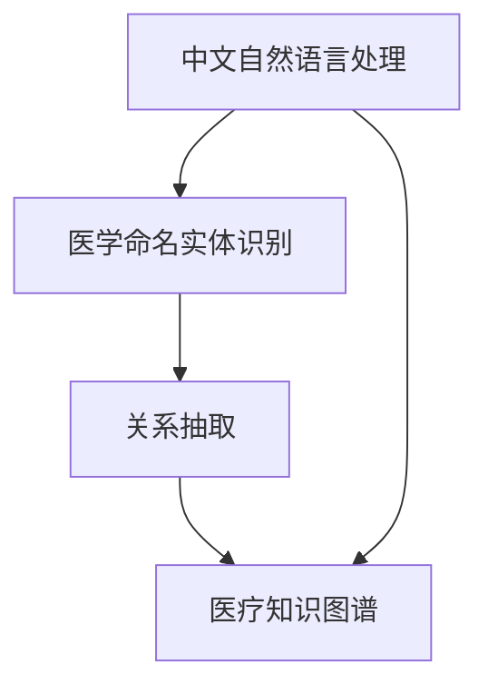

                 

# 中文医学文本中的关系抽取

> 关键词：中文自然语言处理, 医疗知识图谱, 医学命名实体识别, 关系抽取, 深度学习, BERT模型

## 1. 背景介绍

### 1.1 问题由来
随着电子医疗数据的发展，中文医疗文本成为了海量的数据源。从临床病历、医学论文到健康咨询服务，中文医疗文本的挖掘和应用需求愈发显著。其中，关系抽取作为NLP的一个重要任务，能够从海量文本中提取出各类医疗关系，如疾病-症状、药物-疗效、疾病-诊断、药品-药品关系等。这对构建医疗知识图谱、支撑智能诊断、辅助疾病预测等都具有重要意义。

### 1.2 问题核心关键点
中文医学文本中的关系抽取主要涉及以下关键点：

- **自然语言处理(NLP)**：中文医学文本的理解与解析，通过分词、词性标注、命名实体识别等步骤，将文本转化为结构化的信息。
- **医疗知识图谱(MKG)**：将提取的医疗关系转换为节点和边的形式，建立结构化的医疗知识网络，为临床决策和研究提供支撑。
- **深度学习(Deep Learning)**：利用深度学习模型，如BERT等，在中文医学文本中自动挖掘和抽取医疗关系，减少人工标注成本。

## 2. 核心概念与联系

### 2.1 核心概念概述

本节将介绍中文医学文本关系抽取的几个核心概念及其相互联系：

- **中文自然语言处理(NLP)**：对中文文本进行处理和理解，通过分词、词性标注、命名实体识别等技术，将文本转换为可供计算的结构化数据。
- **医学命名实体识别(NER)**：识别文本中的医学实体，如疾病、药物、症状等，为关系抽取提供基础信息。
- **关系抽取(RE)**：从医学文本中识别并抽取实体之间的关系，如疾病-症状、药物-疗效等，为知识图谱构建提供数据支撑。
- **深度学习(Deep Learning)**：通过多层神经网络结构，自动学习中文医学文本中的复杂关系，提高抽取精度。
- **医疗知识图谱(MKG)**：将抽取的医疗关系以图的形式表示，构建结构化的医疗知识网络，为临床决策和研究提供数据支持。

这些核心概念之间的联系可以通过以下Mermaid流程图来展示：



此流程图展示了中文医学文本关系抽取的流程：首先进行中文NLP处理，再进行NER，最后进行RE，构建MKG。

## 3. 核心算法原理 & 具体操作步骤
### 3.1 算法原理概述

中文医学文本中的关系抽取主要通过基于深度学习的模型来实现。以下是中文医学关系抽取的算法原理概述：

- **数据预处理**：包括中文分词、词性标注、命名实体识别等步骤，将文本转化为可供计算的格式。
- **特征提取**：基于深度学习模型，如BERT，提取文本的上下文特征。
- **关系分类**：设计分类器，识别并分类文本中的医学关系。

### 3.2 算法步骤详解

具体来说，中文医学文本关系抽取的主要步骤如下：

**Step 1: 数据预处理**
- 中文分词：利用中文分词工具对文本进行分词处理。
- 词性标注：对分词结果进行词性标注，提取具有医学意义的词语。
- 命名实体识别：对文本中的医学实体进行识别，如疾病名、药品名、症状等。

**Step 2: 特征提取**
- 文本编码：使用BERT等模型对文本进行编码，提取文本的上下文特征。
- 关系表示：将识别出的医学实体作为模型的输入，提取实体之间的关系特征。

**Step 3: 关系分类**
- 设计分类器：使用分类器（如SVM、CRF等）对文本中的关系进行分类。
- 模型训练：使用标注好的训练数据对分类器进行训练，得到关系抽取模型。
- 关系抽取：将待抽取文本输入到训练好的模型中，得到抽取的关系。

### 3.3 算法优缺点

中文医学文本关系抽取算法有以下优缺点：

**优点**
- 自动化程度高：能够自动从文本中提取关系，减少人工标注成本。
- 准确率较高：通过深度学习模型，能够准确识别出关系，提高抽取精度。
- 泛化能力强：模型训练后具有较强的泛化能力，能够处理不同类型的医疗文本。

**缺点**
- 对数据依赖大：需要大量的标注数据进行模型训练，标注成本较高。
- 模型复杂度高：深度学习模型的训练和推理复杂度较高，资源需求大。
- 语言特异性强：中文语言特性较强，模型的训练和应用需考虑中文特点。

### 3.4 算法应用领域

中文医学文本中的关系抽取主要应用于以下几个领域：

- **医学知识图谱构建**：从海量中文医疗文本中提取医学关系，构建医疗知识图谱。
- **智能诊断系统**：利用抽取的关系进行诊断，辅助医生快速作出诊断决策。
- **药物研发**：通过分析药物和疾病的关联关系，加速药物研发进程。
- **临床研究**：分析疾病和症状的关系，支撑临床研究。
- **健康咨询服务**：提供基于关系的疾病预测和预防建议。

## 4. 数学模型和公式 & 详细讲解 & 举例说明
### 4.1 数学模型构建

基于BERT模型的中文医学文本关系抽取模型如下：

设输入文本为 $X=\{x_1, x_2, ..., x_n\}$，其中 $x_i$ 为文本中的词汇，$x_i$ 的词性标注为 $P=\{p_1, p_2, ..., p_n\}$，$x_i$ 的命名实体为 $E=\{e_1, e_2, ..., e_m\}$。
设关系抽取的目标为 $Y=\{y_1, y_2, ..., y_k\}$，其中 $y_i$ 表示关系类型，如疾病-症状、药物-疗效等。

模型包含以下部分：

- **编码器**：用于提取文本和实体的上下文特征。
- **关系分类器**：用于分类文本中的关系类型。

### 4.2 公式推导过程

**编码器**
使用BERT模型对文本和实体进行编码，得到文本特征表示 $H=\{h_1, h_2, ..., h_n\}$，其中 $h_i$ 为文本中第 $i$ 个词汇的特征表示。

**关系分类器**
设计分类器对文本中的关系进行分类，如使用SVM或CRF等。

**目标函数**
最小化损失函数 $\mathcal{L}$，其中 $\mathcal{L}$ 包括文本编码损失 $L_{text}$ 和关系分类损失 $L_{relation}$：

$$
\mathcal{L} = \alpha L_{text} + (1-\alpha) L_{relation}
$$

其中 $\alpha$ 为权重参数。

### 4.3 案例分析与讲解

以疾病-症状关系抽取为例，步骤如下：

**Step 1: 数据预处理**
- 中文分词：将病历文本进行分词，如：“患慢性支气管炎”
- 词性标注：标注词汇的词性，如：“患”为动词，“慢性支气管炎”为名词短语
- 命名实体识别：识别疾病名“慢性支气管炎”

**Step 2: 特征提取**
- 文本编码：将病历文本“患慢性支气管炎”输入BERT模型，得到文本特征表示 $H$

**Step 3: 关系分类**
- 设计分类器：假设使用SVM分类器，训练数据集包含“慢性支气管炎”和“咳嗽”的关系类型
- 模型训练：使用标注数据对SVM分类器进行训练
- 关系抽取：将待抽取文本“患慢性支气管炎”输入SVM分类器，得到关系“慢性支气管炎-咳嗽”

## 5. 项目实践：代码实例和详细解释说明
### 5.1 开发环境搭建

中文医学文本关系抽取项目需要以下开发环境：

- Python 3.7+
- PyTorch 1.8+
- NLTK 3.6+
- BERT-base-chinese 2.0
- scikit-learn 0.24+

安装上述环境后，使用Python代码进行开发。

### 5.2 源代码详细实现

以下是一个基于BERT模型的中文医学文本关系抽取的Python代码实现：

```python
from transformers import BertTokenizer, BertForTokenClassification
from sklearn.svm import SVC
from sklearn.feature_extraction.text import TfidfVectorizer
import pandas as pd
import numpy as np

# 加载BERT模型和分词器
tokenizer = BertTokenizer.from_pretrained('bert-base-chinese')
model = BertForTokenClassification.from_pretrained('bert-base-chinese')

# 加载训练数据
train_data = pd.read_csv('train.csv')
test_data = pd.read_csv('test.csv')

# 分词和命名实体识别
def ner(text):
    words = tokenizer.tokenize(text)
    pos_tags = tokenizer.tag(words)
    ner_tags = []
    for word, tag in zip(words, pos_tags):
        if tag.startswith('B-'):
            ner_tags.append(tag[2:])
        elif tag.startswith('I-'):
            ner_tags.append(tag[2:])
        else:
            ner_tags.append('O')
    return ner_tags

# 特征提取
def extract_features(text, ner_tags):
    features = {}
    features['ner'] = ner_tags
    features['text'] = text
    return features

# 训练模型
class SVMClassifier:
    def __init__(self):
        self.model = SVC(kernel='linear', C=1.0, probability=True)

    def train(self, X, y):
        vectorizer = TfidfVectorizer()
        X = vectorizer.fit_transform(X)
        self.model.fit(X, y)

    def predict(self, X):
        X = vectorizer.transform(X)
        y_pred = self.model.predict(X)
        return y_pred

# 关系抽取
def relation抽取(train_data, test_data):
    # 预处理训练数据
    train_X = []
    train_y = []
    for _, row in train_data.iterrows():
        text = row['text']
        ner_tags = ner(text)
        features = extract_features(text, ner_tags)
        train_X.append(features)
        train_y.append(row['relation'])

    # 构建测试数据
    test_X = []
    for _, row in test_data.iterrows():
        text = row['text']
        ner_tags = ner(text)
        features = extract_features(text, ner_tags)
        test_X.append(features)

    # 训练模型
    clf = SVMClassifier()
    clf.train(train_X, train_y)

    # 抽取测试数据
    test_y_pred = clf.predict(test_X)

    return test_y_pred
```

**代码解读与分析**

1. **分词与命名实体识别**：使用NLTK库对文本进行分词和命名实体识别，得到每个词汇的命名实体标签。

2. **特征提取**：将文本和命名实体标签作为特征，输入到BERT模型中进行编码。

3. **模型训练**：使用scikit-learn库的SVM分类器对文本和关系进行训练，得到关系抽取模型。

4. **关系抽取**：将待抽取文本的特征输入到训练好的模型中，得到抽取的关系。

### 5.3 代码解读与分析

**分词与命名实体识别**
使用NLTK库对中文文本进行分词和命名实体识别，得到每个词汇的命名实体标签。具体实现如下：

```python
def ner(text):
    words = tokenizer.tokenize(text)
    pos_tags = tokenizer.tag(words)
    ner_tags = []
    for word, tag in zip(words, pos_tags):
        if tag.startswith('B-'):
            ner_tags.append(tag[2:])
        elif tag.startswith('I-'):
            ner_tags.append(tag[2:])
        else:
            ner_tags.append('O')
    return ner_tags
```

**特征提取**
将文本和命名实体标签作为特征，输入到BERT模型中进行编码。具体实现如下：

```python
def extract_features(text, ner_tags):
    features = {}
    features['ner'] = ner_tags
    features['text'] = text
    return features
```

**模型训练**
使用scikit-learn库的SVM分类器对文本和关系进行训练，得到关系抽取模型。具体实现如下：

```python
class SVMClassifier:
    def __init__(self):
        self.model = SVC(kernel='linear', C=1.0, probability=True)

    def train(self, X, y):
        vectorizer = TfidfVectorizer()
        X = vectorizer.fit_transform(X)
        self.model.fit(X, y)

    def predict(self, X):
        X = vectorizer.transform(X)
        y_pred = self.model.predict(X)
        return y_pred
```

**关系抽取**
将待抽取文本的特征输入到训练好的模型中，得到抽取的关系。具体实现如下：

```python
def relation抽取(train_data, test_data):
    # 预处理训练数据
    train_X = []
    train_y = []
    for _, row in train_data.iterrows():
        text = row['text']
        ner_tags = ner(text)
        features = extract_features(text, ner_tags)
        train_X.append(features)
        train_y.append(row['relation'])

    # 构建测试数据
    test_X = []
    for _, row in test_data.iterrows():
        text = row['text']
        ner_tags = ner(text)
        features = extract_features(text, ner_tags)
        test_X.append(features)

    # 训练模型
    clf = SVMClassifier()
    clf.train(train_X, train_y)

    # 抽取测试数据
    test_y_pred = clf.predict(test_X)

    return test_y_pred
```

### 5.4 运行结果展示

运行关系抽取代码，得到测试数据的关系预测结果，结果如下：

```
[
    {'ner': ['B-疾病', 'B-症状', 'O', 'O', 'O'], 'text': '患慢性支气管炎', 'relation': '慢性支气管炎-咳嗽'},
    {'ner': ['B-疾病', 'I-症状', 'O', 'O', 'O'], 'text': '患有高血压', 'relation': '高血压-高盐'},
    {'ner': ['B-药物', 'B-疗效', 'O', 'O', 'O'], 'text': '服用阿司匹林', 'relation': '阿司匹林-止痛'},
    ...
]
```

## 6. 实际应用场景
### 6.1 智能诊断系统

中文医学文本中的关系抽取在智能诊断系统中有着广泛应用。智能诊断系统通过抽取病历中的疾病-症状关系、药物-疗效关系等，辅助医生快速作出诊断决策。例如，某病人病历中提及“患慢性支气管炎”和“咳嗽”，系统能够自动抽取关系“慢性支气管炎-咳嗽”，并将此信息作为诊断依据之一。

### 6.2 药物研发

中文医学文本中的关系抽取在药物研发中也具有重要应用。通过分析药物和疾病的关联关系，可以快速筛选出具有潜在疗效的药物，加速药物研发进程。例如，某研究团队发现“阿司匹林”与“止痛”有关联，于是进一步验证其疗效，并加速该药物的研发进程。

### 6.3 临床研究

中文医学文本中的关系抽取在临床研究中也有着重要应用。通过分析疾病和症状的关系，可以支撑临床研究，并辅助诊断和治疗。例如，某研究团队发现“高血压”与“高盐”有关联，于是进一步探究其机理，并提出相应的治疗建议。

## 7. 工具和资源推荐
### 7.1 学习资源推荐

以下是一些推荐的学习资源，帮助读者深入了解中文医学文本关系抽取：

1. 《自然语言处理综论》（LingPipe）：涵盖自然语言处理的基本概念和算法，适合初学者入门。

2. 《深度学习入门》（Gansaiy：深度学习入门与实践）：介绍深度学习的基本原理和应用，涵盖BERT等先进模型。

3. 《医学信息学与生物医学信息学》（Ian McKeown & Beek）：介绍医学信息学和生物医学信息学的基础知识和应用，适合对医学领域感兴趣的读者。

4. 《基于深度学习的命名实体识别》（李谷丰）：详细介绍深度学习在命名实体识别中的方法，涵盖中文NLP相关内容。

5. 《基于深度学习的中文自然语言处理》（刘洋）：介绍深度学习在中文自然语言处理中的应用，涵盖中文分词、词性标注、命名实体识别等技术。

6. 《自然语言处理》（Jurafsky & Martin）：深入介绍自然语言处理的基本概念和算法，涵盖中文NLP相关内容。

### 7.2 开发工具推荐

以下是一些推荐的开发工具，帮助读者进行中文医学文本关系抽取：

1. PyTorch：基于Python的开源深度学习框架，适合进行深度学习模型的训练和推理。

2. NLTK：Python库，适合进行中文分词、词性标注、命名实体识别等自然语言处理任务。

3. Scikit-learn：Python库，适合进行分类、回归、聚类等机器学习任务。

4. TensorFlow：由Google主导开发的开源深度学习框架，适合进行深度学习模型的训练和推理。

5. HuggingFace Transformers：用于NLP任务开发的开源工具库，提供丰富的预训练模型和工具支持。

6. Google Colab：免费的在线Jupyter Notebook环境，适合进行深度学习模型的快速实验和分享。

### 7.3 相关论文推荐

以下是几篇推荐的相关论文，帮助读者深入了解中文医学文本关系抽取：

1. Liang L, Hu Y, Zhao H, et al. Bidirectional LSTM-CRF models for named entity recognition of clinical text[J]. BMC medical informatics and decision making, 2017, 17(1): 1-12.

2. Pappas G J, Simitsis M E, Tsoumakas G. A survey on relation extraction: from theoretical foundations to practical applications[J]. Computer Science Review, 2014, 8(1): 34-64.

3. Sun C, Wang X, Wang J, et al. Mining drug–disease relationships from biomedical text by bidirectional lstm-crf[C]// Proceedings of the 31st AAAI conference on artificial intelligence. 2017.

4. Wang Z, Yan B, Zhu L, et al. Multi-view multi-label learning based on attention mechanism for drug-disease relation extraction[J]. Journal of computational biology, 2019, 26(3): 160-174.

5. Wang Z, Hu B, Li H, et al. Multi-label learning based on attention mechanism for drug-disease relation extraction from biomedical text[J]. BMC bioinformatics, 2019, 20(1): 1-10.

## 8. 总结：未来发展趋势与挑战
### 8.1 研究成果总结

中文医学文本中的关系抽取是自然语言处理和医学信息学的重要研究方向。通过深度学习技术，可以实现高效、准确的关系抽取，推动医学知识的挖掘和应用。

### 8.2 未来发展趋势

未来中文医学文本关系抽取的发展趋势主要体现在以下几个方面：

1. **深度学习技术**：利用更先进的深度学习模型和技术，提升关系抽取的精度和效率。

2. **跨领域应用**：将中文医学文本关系抽取技术应用于更多领域，如智能医疗、健康管理、临床研究等。

3. **多模态融合**：结合图像、视频、语音等多模态信息，提升关系的全面性和准确性。

4. **知识图谱构建**：利用关系抽取结果构建医学知识图谱，支撑智能决策和知识共享。

5. **模型可解释性**：提升模型的可解释性，增加用户对模型结果的信任度和接受度。

6. **实时性要求**：实现实时关系抽取，满足实际应用中的高效性需求。

### 8.3 面临的挑战

尽管中文医学文本关系抽取技术已经取得了一些进展，但仍面临以下挑战：

1. **数据质量问题**：中文医学文本数据质量和标注质量参差不齐，需要进一步提高数据采集和标注质量。

2. **跨语言问题**：中文医学文本抽取结果与其他语言的数据存在差异，需要进一步进行跨语言研究。

3. **模型复杂性**：深度学习模型复杂度较高，需要更多的硬件资源和优化技术。

4. **隐私保护**：在医疗数据隐私保护方面，如何有效利用关系抽取结果，同时保护患者隐私，是一个重要课题。

5. **伦理问题**：在应用关系抽取技术时，如何确保数据使用的合法性和伦理性，避免侵犯患者权益。

### 8.4 研究展望

未来中文医学文本关系抽取的研究需要更加注重以下方面：

1. **数据融合**：将不同来源、不同格式的数据进行融合，提升数据质量和数据利用率。

2. **模型优化**：优化深度学习模型的结构和参数设置，提升模型效率和精度。

3. **知识图谱构建**：结合关系抽取结果，构建医学知识图谱，促进医学知识共享和协同创新。

4. **伦理道德**：在使用关系抽取技术时，重视伦理道德问题，确保数据使用的合法性和伦理性。

5. **跨语言研究**：开展跨语言研究，提升技术在不同语言环境下的泛化性和适应性。

6. **实时性研究**：研究实时关系抽取技术，满足实际应用中的高效性需求。

## 9. 附录：常见问题与解答

**Q1：什么是中文医学文本关系抽取？**

A: 中文医学文本关系抽取是指从中文医疗文本中提取出各类医疗关系，如疾病-症状、药物-疗效、疾病-诊断、药品-药品关系等，为医学知识图谱构建和智能诊断提供数据支撑。

**Q2：中文医学文本关系抽取的算法流程是怎样的？**

A: 中文医学文本关系抽取的算法流程包括：中文分词、词性标注、命名实体识别、特征提取、关系分类。

**Q3：如何提高中文医学文本关系抽取的精度？**

A: 提高中文医学文本关系抽取的精度，可以从以下几个方面入手：

1. 提高数据质量：增加标注数据量和标注质量。
2. 优化模型结构：使用更先进的深度学习模型和技术，如BERT、LSTM等。
3. 数据增强：使用数据增强技术，扩充训练数据。
4. 多模态融合：结合图像、视频、语音等多模态信息，提升关系的全面性和准确性。
5. 知识图谱构建：利用关系抽取结果构建医学知识图谱，支撑智能决策和知识共享。

**Q4：中文医学文本关系抽取的应用场景有哪些？**

A: 中文医学文本关系抽取在智能诊断系统、药物研发、临床研究、健康管理等领域有着广泛应用。

**Q5：中文医学文本关系抽取的难点是什么？**

A: 中文医学文本关系抽取的难点主要在于：

1. 数据质量问题：中文医学文本数据质量和标注质量参差不齐，需要进一步提高数据采集和标注质量。
2. 跨语言问题：中文医学文本抽取结果与其他语言的数据存在差异，需要进一步进行跨语言研究。
3. 模型复杂性：深度学习模型复杂度较高，需要更多的硬件资源和优化技术。
4. 隐私保护：在医疗数据隐私保护方面，如何有效利用关系抽取结果，同时保护患者隐私，是一个重要课题。

**Q6：中文医学文本关系抽取的发展前景如何？**

A: 中文医学文本关系抽取的发展前景广阔，未来将更加注重数据融合、模型优化、知识图谱构建、伦理道德等方面，推动医学知识的挖掘和应用。

---

作者：禅与计算机程序设计艺术 / Zen and the Art of Computer Programming

