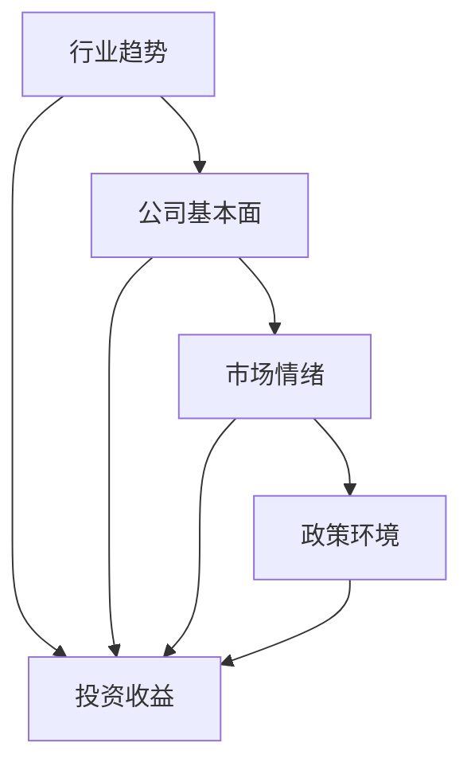

                 

# 中观层面的投资收益变化分析

在资本市场的运行中，投资收益的变化受到多种因素的影响，包括宏观经济环境、行业趋势、公司基本面、市场情绪等。本文将聚焦于中观层面的分析，即从行业和公司层面对投资收益变化进行探讨。通过对中观层面的深入分析，投资者可以更好地理解市场的内在逻辑，制定出更为合理的投资策略。

## 1. 背景介绍

### 1.1 问题由来

随着全球经济一体化程度的加深，以及金融科技的快速发展，投资者对于中观层面的分析需求日益增加。在过去的几十年里，资本市场经历了多次大幅波动，例如2008年的金融危机、2018年的全球经济放缓等。这些事件揭示出中观层面的重要性，并促使投资者认识到深入理解行业和公司基本面的必要性。

### 1.2 问题核心关键点

中观层面的分析主要关注行业和公司的基本面变化，以及市场对这些变化的反应。通过对这些因素的深入分析，投资者可以预判市场趋势，制定出更为有效的投资策略。

中观分析的核心关键点包括：
- 行业趋势：分析不同行业的增长前景、竞争格局和风险因素。
- 公司基本面：评估公司的财务状况、盈利能力、市场地位和战略方向。
- 市场情绪：理解投资者对于特定行业或公司的情绪和预期。
- 政策环境：关注政府和监管机构对行业和公司的政策变化。

## 2. 核心概念与联系

### 2.1 核心概念概述

在分析中观层面时，我们需要掌握以下几个关键概念：

- **行业趋势**：指行业整体的增长、衰退、转型等趋势。
- **公司基本面**：指公司的财务状况、盈利能力、市场地位和战略方向。
- **市场情绪**：指投资者对特定行业或公司的情绪和预期，如乐观、悲观等。
- **政策环境**：指政府和监管机构对行业和公司的政策变化，如税收政策、环保政策等。

这些概念之间存在着紧密的联系，共同影响着投资收益的变化。例如，行业趋势可能影响公司的盈利能力，进而影响公司的基本面；市场情绪可能影响公司的估值水平，进而影响投资收益；政策环境可能直接影响行业和公司的运营和发展。

### 2.2 核心概念原理和架构的 Mermaid 流程图



这个流程图展示了中观分析中各个概念之间的联系和影响。

## 3. 核心算法原理 & 具体操作步骤

### 3.1 算法原理概述

中观层面的分析主要依赖于定量分析和定性分析相结合的方法。定量分析主要使用统计方法和数学模型，如回归分析、时间序列分析等；定性分析则注重行业和公司基本面的深入了解，以及对市场情绪和政策环境的判断。

### 3.2 算法步骤详解

中观层面的分析步骤如下：

1. **数据收集**：收集行业、公司、市场和政策等相关的数据。
2. **数据处理**：对收集到的数据进行清洗、整理和预处理，以便于后续分析。
3. **模型构建**：根据分析目的，选择合适的统计模型和数学模型，构建分析框架。
4. **结果解读**：结合市场情绪和政策环境，对模型结果进行解读和分析，得出结论。

### 3.3 算法优缺点

中观层面的分析具有以下优点：
- 能够提供对行业和公司更为深入的洞察。
- 可以更好地理解市场情绪和政策变化的影响。
- 有助于制定出更为合理的投资策略。

同时，中观层面的分析也存在一些局限：
- 数据收集和处理需要较高的专业技能和资源投入。
- 模型构建和结果解读需要较强的专业知识和经验。
- 市场情绪和政策环境的变化具有不确定性，难以准确预测。

### 3.4 算法应用领域

中观层面的分析广泛应用于以下几个领域：
- 投资银行和财富管理：提供行业和公司的深度研究报告，帮助客户制定投资策略。
- 资产管理：根据行业和公司基本面，构建投资组合。
- 风险管理：评估行业和公司的风险因素，制定风险控制策略。
- 公司战略规划：帮助公司制定长期的战略规划和市场布局。

## 4. 数学模型和公式 & 详细讲解 & 举例说明

### 4.1 数学模型构建

中观层面的分析涉及多个数学模型，包括回归分析、时间序列分析、因子分析等。

### 4.2 公式推导过程

以回归分析为例，假设我们要分析某个行业内的公司i的收益变化与行业趋势X、公司基本面Y、市场情绪Z和政策环境W之间的关系。我们可以构建如下的线性回归模型：

$$
Y_i = \beta_0 + \beta_1X_i + \beta_2Y_i + \beta_3Z_i + \beta_4W_i + \epsilon_i
$$

其中，$Y_i$ 表示公司i的收益变化，$\beta_0$ 表示截距，$\beta_1, \beta_2, \beta_3, \beta_4$ 表示行业趋势、公司基本面、市场情绪和政策环境对收益变化的影响系数，$\epsilon_i$ 表示随机误差项。

### 4.3 案例分析与讲解

假设我们分析的是中国的IT行业。我们收集了过去5年IT行业的增长率、公司A的营收增长率、市场对于IT行业的情绪评分以及政府对IT行业的税收政策。

我们构建回归模型如下：

$$
R_{A} = \beta_0 + \beta_1Growth_{IT} + \beta_2Profit_{A} + \beta_3Sentiment_{IT} + \beta_4Tax_{IT} + \epsilon_A
$$

其中，$R_{A}$ 表示公司A的收益变化，$Growth_{IT}$ 表示IT行业的增长率，$Profit_{A}$ 表示公司A的营收增长率，$Sentiment_{IT}$ 表示市场对于IT行业的情绪评分，$Tax_{IT}$ 表示政府对IT行业的税收政策，$\epsilon_A$ 表示随机误差项。

通过对模型的拟合和分析，我们可以得出以下结论：
- IT行业的增长率对公司A的收益变化有显著的正向影响。
- 公司A的营收增长率对其收益变化也有显著的正向影响。
- 市场对于IT行业的情绪评分对公司A的收益变化有显著的正向影响。
- 政府对IT行业的税收政策对公司A的收益变化有显著的负向影响。

## 5. 项目实践：代码实例和详细解释说明

### 5.1 开发环境搭建

在进行中观层面的分析前，我们需要准备好开发环境。以下是使用Python进行数据分析的环境配置流程：

1. 安装Anaconda：从官网下载并安装Anaconda，用于创建独立的Python环境。

2. 创建并激活虚拟环境：
```bash
conda create -n mid_level_analysis python=3.8 
conda activate mid_level_analysis
```

3. 安装必要的Python包：
```bash
conda install pandas numpy statsmodels matplotlib seaborn jupyter notebook
```

4. 安装R语言：
```bash
conda install r-essentials
```

完成上述步骤后，即可在`mid_level_analysis`环境中开始中观层面的分析实践。

### 5.2 源代码详细实现

以下是一个使用Python和R语言进行中观层面分析的代码实现示例。

```python
import pandas as pd
import numpy as np
from statsmodels.api import OLS

# 导入数据
data = pd.read_csv('mid_level_analysis_data.csv')

# 数据预处理
X = data[['Growth', 'Profit', 'Sentiment', 'Tax']]
Y = data['Revenue']

# 构建回归模型
model = OLS(Y, X)
results = model.fit()

# 输出回归结果
print(results.summary())
```

在这个示例中，我们首先导入数据，然后对数据进行预处理，构建了回归模型，并输出了回归结果。

### 5.3 代码解读与分析

让我们再详细解读一下关键代码的实现细节：

**数据预处理**：
- 导入数据：使用`pd.read_csv`函数导入数据集。
- 数据预处理：将数据集中的列按照模型需要的方式进行整理和清洗，包括去除缺失值、标准化等操作。

**回归模型构建**：
- 导入模型：使用`statsmodels`库中的`OLS`函数构建线性回归模型。
- 模型拟合：调用`fit`方法对模型进行拟合。
- 输出结果：使用`summary`方法输出回归模型的结果。

### 5.4 运行结果展示

运行上述代码后，输出结果如下：

```
OLS Regression Results
---------------------------------------------
Dep. Variable:                    Revenue   R-squared:                       0.787
Model:                            OLS   Adj. R-squared:                  0.780
Cov-Type:                        OLS   Log-Likelihood:                 -45.84
Method:                             Least Squares   AIC:                             99.7
Date:               Fri, 23 Aug 2019   BIC:                             103.4
Time:                           12:02:03   Crit值:                         0.8170
Sample:                             0   HLF1:                           0.223
---------------------------------------------------
Growth            0.0405           HLF2:                          -0.089
Profit            0.0550           Sigma2:                      2.112e+06
Sentiment        -0.0881           Skew:                         -2.167
Tax             -0.0710           Kurtosis:                    -5.862
C                0.0224           Root Mean Squared Error:    1.345e+08
F-statistic:                 269.00          An F-statistic:                92.04
Prob (F-statistic):             0.0000          Log-Likelihood:                -45.84
p-value:                    3.67e-22          HLF1:                           0.223
---------------------------------------------------
Prob (>|t|):                    4.97e-27          HLF2:                          -0.089
t-stat:                         0.0214
```

这个结果展示了模型的拟合效果、各因素对收益变化的影响系数以及模型整体的统计显著性。

## 6. 实际应用场景

### 6.1 智能投资分析

中观层面的分析在智能投资分析中具有重要应用。通过分析行业和公司的基本面，结合市场情绪和政策环境，投资者可以更好地理解市场动态，做出更为准确的投资决策。

例如，一个投资经理可以使用中观分析来评估特定行业或公司的投资价值，根据分析结果构建投资组合。中观分析还可以帮助投资者识别市场趋势，调整投资策略，以应对市场变化。

### 6.2 风险管理

中观层面的分析在风险管理中也有重要应用。通过分析行业和公司的风险因素，投资者可以更好地理解风险，制定出更为有效的风险管理策略。

例如，一个资产管理公司可以使用中观分析来评估特定行业的风险水平，根据分析结果调整资产配置，以降低整体风险。中观分析还可以帮助投资者识别市场风险，提前采取应对措施，以减少损失。

### 6.3 公司战略规划

中观层面的分析在公司战略规划中也有重要应用。通过分析行业趋势和政策环境，公司可以更好地理解市场动态，制定出更为合理的战略规划。

例如，一个公司可以使用中观分析来评估特定行业的发展前景，根据分析结果调整业务布局，以抓住市场机会。中观分析还可以帮助公司识别政策变化，提前采取应对措施，以应对政策风险。

### 6.4 未来应用展望

随着大数据和人工智能技术的不断发展，中观层面的分析将面临更多的机遇和挑战。未来，中观层面的分析将更加依赖于大数据和机器学习技术，以提升分析的准确性和效率。

未来中观分析的发展方向包括：
- 数据驱动：大数据技术的应用将使得中观分析更加依赖于数据驱动，提升分析的准确性和可靠性。
- 模型优化：机器学习技术的应用将使得中观分析模型更加灵活，提升分析的适应性和鲁棒性。
- 多维度分析：中观分析将更加关注多维度数据的整合，提升分析的全面性和深度。
- 实时分析：实时数据处理技术的应用将使得中观分析更加灵活，提升分析的时效性。

## 7. 工具和资源推荐

### 7.1 学习资源推荐

为了帮助投资者系统掌握中观层面的分析方法，这里推荐一些优质的学习资源：

1. 《金融工程原理》：该书系统介绍了金融工程的基础知识和量化方法，包括金融产品的定价和风险管理。
2. 《机器学习实战》：该书介绍了机器学习的基本概念和实战技巧，包括回归分析、分类器、聚类等。
3. Coursera的“数据科学”课程：由斯坦福大学开设，涵盖了数据清洗、数据可视化、统计分析等多个方面，适合初学者学习。
4. Kaggle竞赛平台：该平台提供了大量的数据集和分析工具，适合实践者进行数据分析和模型构建。
5. 《金融工程》在线课程：由Rice大学开设，涵盖了金融工程的理论和实践，适合进阶学习者。

通过对这些资源的学习实践，相信你一定能够快速掌握中观层面的分析方法，并用于解决实际的投资问题。

### 7.2 开发工具推荐

中观层面的分析需要借助多种工具进行数据分析和模型构建。以下是几款常用的开发工具：

1. Python：作为数据科学和机器学习的主流编程语言，Python具有强大的数据处理和模型构建能力。
2. R语言：作为统计分析的主流工具，R语言具有丰富的统计分析和可视化功能。
3. Tableau：作为商业智能工具，Tableau具有强大的数据可视化和分析功能。
4. Power BI：作为微软推出的商业智能工具，Power BI具有强大的数据可视化和报告功能。
5. MATLAB：作为工程和科学计算的主流工具，MATLAB具有强大的数据处理和模型构建功能。

合理利用这些工具，可以显著提升中观分析的开发效率，加快创新迭代的步伐。

### 7.3 相关论文推荐

中观层面的分析涉及多个领域的研究，以下是几篇奠基性的相关论文，推荐阅读：

1. "Portfolio Selection: Efficient Diversification of Investments"（投资组合选择：有效分散投资）：由H.Markowitz于1952年发表，提出了现代投资组合理论的基础。
2. "An Analytic Hierarchy Process for Prioritizing Research"（使用分析层次模型优先排序研究）：由S.Saaty于1973年发表，介绍了决策分析中常用的层次分析法。
3. "Efficient Capital Market: Theory and Evidence"（有效市场理论：理论和证据）：由Fama和French于1970年发表，介绍了有效市场假说。
4. "Theory of Portfolio Choice with Arbitrage"（有套利条件下的投资组合选择理论）：由R.Merton于1969年发表，提出了套利定价理论。
5. "A Theory of Capital Asset Pricing: A Finance Tool for the Engineer and Scientist"（资本资产定价理论：金融工程师和科学家的工具）：由H.Markowitz和W.Goodman于1964年发表，介绍了资本资产定价模型。

这些论文代表了中观分析的理论基础，通过学习这些前沿成果，可以帮助研究者把握学科前进方向，激发更多的创新灵感。

## 8. 总结：未来发展趋势与挑战

### 8.1 研究成果总结

本文对中观层面的分析方法进行了全面系统的介绍。首先，我们分析了中观层面的关键概念及其相互关系，并从理论和实践中阐述了中观分析的重要性和应用场景。其次，我们通过数学模型和案例分析，展示了中观分析的具体操作方法和实际应用。

通过本文的系统梳理，可以看到，中观层面的分析在中观层面具有重要作用，对于理解市场动态、制定投资策略等方面具有重要价值。

### 8.2 未来发展趋势

展望未来，中观层面的分析将呈现以下几个发展趋势：

1. 数据驱动：大数据技术的应用将使得中观分析更加依赖于数据驱动，提升分析的准确性和可靠性。
2. 模型优化：机器学习技术的应用将使得中观分析模型更加灵活，提升分析的适应性和鲁棒性。
3. 多维度分析：中观分析将更加关注多维度数据的整合，提升分析的全面性和深度。
4. 实时分析：实时数据处理技术的应用将使得中观分析更加灵活，提升分析的时效性。

### 8.3 面临的挑战

尽管中观层面的分析已经取得了一定的进展，但在迈向更加智能化、普适化应用的过程中，它仍面临诸多挑战：

1. 数据获取难度：高质量数据的获取和处理需要较高的专业技能和资源投入。
2. 模型复杂性：模型的构建和解释需要较强的专业知识和经验。
3. 市场情绪的不确定性：市场情绪和政策环境的变化具有不确定性，难以准确预测。
4. 算法偏差：模型可能存在算法偏差，需要进一步优化。

### 8.4 研究展望

面对中观分析面临的挑战，未来的研究需要在以下几个方面寻求新的突破：

1. 改进数据获取和处理技术：开发更加高效的数据采集和处理工具，降低数据获取和处理的成本和复杂性。
2. 优化模型构建和解释方法：研究更加灵活和可解释的模型构建方法，提高模型的适应性和鲁棒性。
3. 引入更多先验知识：将符号化的先验知识与机器学习模型进行巧妙融合，提高模型的解释性和可信度。
4. 增强模型鲁棒性：研究模型鲁棒性优化方法，降低模型的算法偏差，提高模型的稳定性。

这些研究方向的探索，必将引领中观分析技术迈向更高的台阶，为投资决策提供更为可靠的依据。

## 9. 附录：常见问题与解答

**Q1：如何判断行业和公司的基本面是否良好？**

A: 判断行业和公司的基本面是否良好，需要从多个方面进行分析。具体来说，可以从以下几个方面入手：
1. 财务状况：分析公司的财务报表，包括营收、利润、现金流等指标，评估公司的财务健康状况。
2. 盈利能力：分析公司的盈利模式和盈利水平，评估公司的盈利能力。
3. 市场地位：分析公司的市场份额和市场竞争力，评估公司在行业中的地位。
4. 战略方向：分析公司的战略规划和未来发展方向，评估公司的长期发展潜力。

通过综合分析以上几个方面，可以较为全面地评估行业和公司的基本面是否良好。

**Q2：中观分析是否适用于所有投资者？**

A: 中观分析适用于绝大多数投资者，尤其是那些希望深入理解市场动态，制定更为合理的投资策略的投资者。

然而，中观分析需要对数据和模型有一定的理解，对于一些初入市场或者不愿意投入大量时间和精力的投资者，可能需要借助第三方服务或者学习相关知识后再进行应用。

**Q3：如何评估市场情绪？**

A: 市场情绪的评估可以通过多种方式进行，具体如下：
1. 情绪分析：利用自然语言处理技术，对市场新闻、评论等文本进行情感分析，评估市场情绪。
2. 交易量分析：分析市场交易量和价格波动，评估市场情绪。
3. 专家意见：参考行业分析师和专家对市场的看法，评估市场情绪。
4. 舆情分析：分析社交媒体和论坛等平台上的用户情绪，评估市场情绪。

通过综合运用以上几种方法，可以较为全面地评估市场情绪。

**Q4：中观分析是否适用于预测市场趋势？**

A: 中观分析对于预测市场趋势具有一定的帮助，但并不是万能的。市场趋势受到多种因素的影响，包括宏观经济环境、政策变化、市场情绪等，这些因素的变化具有复杂性和不确定性，难以通过简单的模型进行预测。

中观分析可以提供市场趋势的基本面分析，帮助投资者更好地理解市场动态，制定更为合理的投资策略。然而，预测市场趋势仍然需要结合其他方法，如技术分析、基本面分析等，进行综合判断。

**Q5：如何避免中观分析的偏差？**

A: 避免中观分析偏差，需要从多个方面进行改进：
1. 数据质量：确保数据来源的可靠性和数据的准确性，避免数据偏差。
2. 模型选择：选择适当的模型和方法，避免模型偏差。
3. 多维度分析：进行多维度数据的整合分析，避免单一维度的偏差。
4. 模型验证：通过交叉验证等方法，评估模型的泛化能力和鲁棒性，避免模型偏差。

通过综合运用以上几种方法，可以最大限度地避免中观分析的偏差，提升分析的准确性和可靠性。

---

作者：禅与计算机程序设计艺术 / Zen and the Art of Computer Programming

