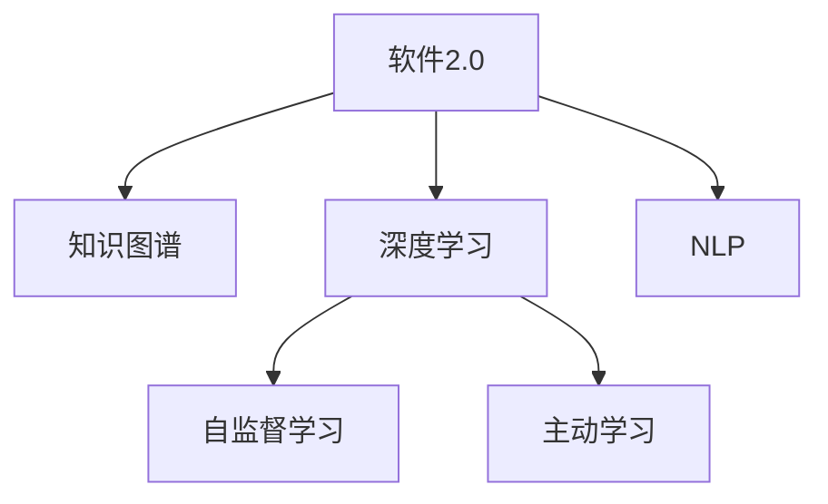

                 

# 主动学习：让软件2.0更高效地问问题

> 关键词：主动学习, 软件2.0, 查询优化, 知识图谱, 深度学习, 数据驱动, 自然语言处理(NLP)

## 1. 背景介绍

### 1.1 问题由来

随着软件2.0时代的到来，软件系统的智能化程度越来越高，用户与系统的交互方式也从传统的“命令式编程”逐渐转变为“询问式操作”。例如，在IDE中，开发者可以通过提问来获取代码片段、解释代码意图或调试代码问题。然而，传统的查询系统往往依赖于人工编写的规则或固定逻辑，无法灵活应对复杂多变的问题，导致查询效率低下、结果不准确。

针对这一问题，主动学习技术应运而生。主动学习是一种数据驱动的优化方法，通过模拟人类学习过程，软件系统可以主动提出问题，从大量知识源中自动获取答案，从而提高查询效率和结果的准确性。

### 1.2 问题核心关键点

主动学习主要分为两大类：基于传统机器学习和基于深度学习的主动学习。在深度学习领域，主动学习已经成为提高模型性能和泛化能力的重要技术手段。

本文章重点介绍基于深度学习的“主动学习”方法。通过深度学习的自监督学习能力和丰富语义表示能力，主动学习可以高效地构建用户与系统的查询与回答关系。

## 2. 核心概念与联系

### 2.1 核心概念概述

为更好地理解基于深度学习的“主动学习”方法，本节将介绍几个密切相关的核心概念：

- **软件2.0**：一种基于查询的技术范式，旨在通过交互式提问来替代传统的“命令式编程”，提升软件开发效率和质量。

- **知识图谱**：通过构建实体和关系的语义网络，形成结构化的知识库，辅助系统在多模态数据中提取信息。

- **深度学习**：一种基于神经网络的机器学习方法，通过多层次的非线性映射，实现对复杂数据的建模和预测。

- **自监督学习**：利用未标注数据进行模型训练，无需人工标注即可自动学习到数据的内在规律。

- **主动学习**：通过预测模型的不确定性，智能选择哪些样本进行进一步标注，以最小的标注代价获取最大的模型性能提升。

- **自然语言处理(NLP)**：涉及计算机如何理解、处理和生成人类语言的技术领域，是软件2.0查询系统的重要支撑。

这些核心概念之间的逻辑关系可以通过以下Mermaid流程图来展示：



这个流程图展示出软件2.0的查询系统是如何通过深度学习、自监督学习、主动学习和NLP等核心技术构建而成的：

1. 软件2.0系统利用深度学习进行模型训练，构建查询与回答的映射关系。
2. 自监督学习利用未标注数据进行模型预训练，提升模型泛化能力。
3. 主动学习通过预测模型不确定性，选择最有价值的样本进行标注。
4. NLP技术处理自然语言，提供自然流畅的查询和回答界面。

## 3. 核心算法原理 & 具体操作步骤
### 3.1 算法原理概述

基于深度学习的“主动学习”方法的核心思想是通过训练一个查询生成器，使其能够根据用户输入的查询自动生成一系列可能的查询或回答。查询生成器通过自监督学习任务和主动学习机制，不断优化模型输出，以提高查询结果的准确性和多样性。

在具体的实现中，查询生成器是一个基于Transformer的深度学习模型，包含自注意力机制、跨注意力机制等模块，能够高效地处理输入和生成输出。查询生成器通过自监督学习任务（如掩码语言模型、文本生成等）进行预训练，形成初步的查询能力。随后，通过主动学习策略选择最有价值的样本进行标注，不断优化模型参数，提升查询效果。

### 3.2 算法步骤详解

基于深度学习的“主动学习”方法主要包括以下几个关键步骤：

**Step 1: 准备数据集**

- 收集大量的查询数据和相应的答案，形成查询与答案的标注对。
- 将查询数据分为训练集、验证集和测试集，按照比例划分为不同的数据集。

**Step 2: 设计查询生成器**

- 选择合适的深度学习模型作为查询生成器，如Transformer、LSTM等。
- 设计模型架构，包括编码器、解码器、自注意力机制、跨注意力机制等模块。
- 选择合适的损失函数，如交叉熵损失、序列交叉熵损失等，用于训练模型。

**Step 3: 自监督学习预训练**

- 使用自监督学习任务（如掩码语言模型、文本生成等）对查询生成器进行预训练。
- 在预训练过程中，模型需要预测文本中的掩码部分或生成缺失的单词。
- 使用验证集对预训练过程进行监控，避免模型过拟合。

**Step 4: 主动学习标注选择**

- 设计主动学习策略，如不确定性采样、错误分类采样等。
- 根据模型在训练集上的表现，选择最有价值的样本进行标注。
- 使用少量标注数据对模型进行微调，优化查询生成器的输出。

**Step 5: 测试与评估**

- 在测试集上对模型进行评估，比较预训练和微调后的查询生成器的表现。
- 使用BLEU、ROUGE等指标评估模型的生成效果。
- 使用人工标注的方式进行主观评估，验证模型的输出质量和多样性。

**Step 6: 模型部署与优化**

- 将训练好的模型部署到实际应用中，提供查询与回答的服务。
- 实时监控模型的表现，根据用户反馈进行模型优化。
- 定期重新训练模型，以保持查询能力的稳定性和准确性。

以上是基于深度学习的“主动学习”方法的一般流程。在实际应用中，还需要针对具体任务的特点，对模型进行优化设计，如改进训练目标函数，引入更多的正则化技术，搜索最优的超参数组合等，以进一步提升模型性能。

### 3.3 算法优缺点

基于深度学习的“主动学习”方法具有以下优点：

1. 查询生成能力强。深度学习模型具有强大的语义表示能力和自适应能力，可以高效地生成自然流畅的查询语句。
2. 数据驱动的优化。主动学习通过预测模型的不确定性，智能选择最有价值的样本进行标注，减少人工标注的负担。
3. 高泛化能力。深度学习模型可以通过大量未标注数据进行自监督学习，形成泛化能力强的模型。
4. 多模态融合。主动学习可以整合知识图谱、文档、代码等多模态数据，提升查询的多样性和准确性。

然而，该方法也存在一些局限性：

1. 模型依赖于数据。深度学习模型需要大量的标注数据和未标注数据进行训练，获取高质量数据较为困难。
2. 模型复杂度高。深度学习模型的训练和推理计算量大，对硬件资源有较高要求。
3. 模型解释性差。深度学习模型通常被视为黑盒，难以解释其内部工作机制和决策逻辑。
4. 模型泛化能力有限。由于深度学习模型往往依赖于特定领域的数据进行训练，泛化到其他领域的效果可能不佳。

尽管存在这些局限性，但就目前而言，基于深度学习的“主动学习”方法在查询优化、代码生成、知识抽取等诸多领域中已经展示了其强大的应用潜力。未来相关研究的重点在于如何进一步降低模型的计算资源需求，提高模型的可解释性和泛化能力，同时兼顾查询的准确性和多样性。

### 3.4 算法应用领域

基于深度学习的“主动学习”方法在多个领域中得到了广泛应用：

- **软件2.0查询系统**：通过主动学习，构建智能化的查询系统，能够高效地处理用户输入的查询，提供准确的答案和建议。
- **代码生成与补全**：通过主动学习，利用大量的代码片段和注释信息，自动生成代码片段和补全代码，提高开发效率。
- **知识抽取与抽取式问答**：通过主动学习，从大规模文本数据中自动提取知识，构建知识库，实现抽取式问答系统。
- **自然语言理解与生成**：通过主动学习，提高自然语言理解的准确性和自然语言生成的流畅度，支持多语言处理和翻译。
- **推荐系统**：通过主动学习，构建个性化推荐系统，根据用户历史行为和兴趣自动推荐相关内容。

除了上述这些经典领域外，“主动学习”技术还被创新性地应用于图像识别、语音识别、游戏智能等更多场景中，为计算机视觉、语音识别、游戏开发等领域带来了新的突破。随着深度学习模型的不断演进和优化，相信“主动学习”技术将在更广阔的领域中发挥更大的作用。

## 4. 数学模型和公式 & 详细讲解  
### 4.1 数学模型构建

本节将使用数学语言对基于深度学习的“主动学习”方法进行更加严格的刻画。

记查询生成器为 $M_{\theta}:\mathcal{X} \rightarrow \mathcal{Y}$，其中 $\mathcal{X}$ 为输入空间，$\mathcal{Y}$ 为输出空间，$\theta \in \mathbb{R}^d$ 为模型参数。假设查询数据集为 $D=\{(x_i,y_i)\}_{i=1}^N, x_i \in \mathcal{X}, y_i \in \mathcal{Y}$。

定义模型 $M_{\theta}$ 在输入 $x$ 上的损失函数为 $\ell(M_{\theta}(x),y)$，则在数据集 $D$ 上的经验风险为：

$$
\mathcal{L}(\theta) = \frac{1}{N} \sum_{i=1}^N \ell(M_{\theta}(x_i),y_i)
$$

在实践中，我们通常使用基于梯度的优化算法（如Adam、SGD等）来近似求解上述最优化问题。设 $\eta$ 为学习率，$\lambda$ 为正则化系数，则参数的更新公式为：

$$
\theta \leftarrow \theta - \eta \nabla_{\theta}\mathcal{L}(\theta) - \eta\lambda\theta
$$

其中 $\nabla_{\theta}\mathcal{L}(\theta)$ 为损失函数对参数 $\theta$ 的梯度，可通过反向传播算法高效计算。

### 4.2 公式推导过程

以下我们以文本生成任务为例，推导基于深度学习的“主动学习”方法中的查询生成器模型的数学公式。

假设模型 $M_{\theta}$ 在输入 $x$ 上的输出为 $\hat{y}=M_{\theta}(x) \in \mathcal{Y}$，表示生成一个长度为 $k$ 的查询语句。假设真实标签 $y \in \mathcal{Y}$ 为 $\hat{y}$ 的一个固定长度子序列。则文本生成任务的交叉熵损失函数定义为：

$$
\ell(M_{\theta}(x),y) = -\frac{1}{k} \sum_{i=1}^k [y_i\log \hat{y}_i + (1-y_i)\log(1-\hat{y}_i)]
$$

将其代入经验风险公式，得：

$$
\mathcal{L}(\theta) = -\frac{1}{N} \sum_{i=1}^N \frac{1}{k} \sum_{j=1}^k [y_{ij}\log \hat{y}_{ij} + (1-y_{ij})\log(1-\hat{y}_{ij})]
$$

其中 $y_{ij}$ 表示第 $i$ 个样本的第 $j$ 个单词是否为真实标签。

在得到损失函数的梯度后，即可带入参数更新公式，完成模型的迭代优化。重复上述过程直至收敛，最终得到适应查询生成任务的模型参数 $\theta^*$。

## 5. 项目实践：代码实例和详细解释说明
### 5.1 开发环境搭建

在进行“主动学习”项目实践前，我们需要准备好开发环境。以下是使用Python进行PyTorch开发的环境配置流程：

1. 安装Anaconda：从官网下载并安装Anaconda，用于创建独立的Python环境。

2. 创建并激活虚拟环境：
```bash
conda create -n pytorch-env python=3.8 
conda activate pytorch-env
```

3. 安装PyTorch：根据CUDA版本，从官网获取对应的安装命令。例如：
```bash
conda install pytorch torchvision torchaudio cudatoolkit=11.1 -c pytorch -c conda-forge
```

4. 安装Transformer库：
```bash
pip install transformers
```

5. 安装各类工具包：
```bash
pip install numpy pandas scikit-learn matplotlib tqdm jupyter notebook ipython
```

完成上述步骤后，即可在`pytorch-env`环境中开始项目实践。

### 5.2 源代码详细实现

下面我们以文本生成任务为例，给出使用Transformers库进行“主动学习”查询生成器的PyTorch代码实现。

首先，定义查询生成任务的数据处理函数：

```python
from transformers import BertTokenizer
from torch.utils.data import Dataset
import torch

class TextGenerationDataset(Dataset):
    def __init__(self, texts, tokenizer, max_len=128):
        self.texts = texts
        self.tokenizer = tokenizer
        self.max_len = max_len
        
    def __len__(self):
        return len(self.texts)
    
    def __getitem__(self, item):
        text = self.texts[item]
        
        encoding = self.tokenizer(text, return_tensors='pt', max_length=self.max_len, padding='max_length', truncation=True)
        input_ids = encoding['input_ids'][0]
        attention_mask = encoding['attention_mask'][0]
        
        return {'input_ids': input_ids, 
                'attention_mask': attention_mask,
                'labels': text}

# 创建dataset
tokenizer = BertTokenizer.from_pretrained('bert-base-cased')

train_dataset = TextGenerationDataset(train_texts, tokenizer)
dev_dataset = TextGenerationDataset(dev_texts, tokenizer)
test_dataset = TextGenerationDataset(test_texts, tokenizer)
```

然后，定义模型和优化器：

```python
from transformers import BertForMaskedLM, AdamW

model = BertForMaskedLM.from_pretrained('bert-base-cased')

optimizer = AdamW(model.parameters(), lr=2e-5)
```

接着，定义训练和评估函数：

```python
from torch.utils.data import DataLoader
from tqdm import tqdm
from sklearn.metrics import sequence_ordered_accuracy

device = torch.device('cuda') if torch.cuda.is_available() else torch.device('cpu')
model.to(device)

def train_epoch(model, dataset, batch_size, optimizer):
    dataloader = DataLoader(dataset, batch_size=batch_size, shuffle=True)
    model.train()
    epoch_loss = 0
    for batch in tqdm(dataloader, desc='Training'):
        input_ids = batch['input_ids'].to(device)
        attention_mask = batch['attention_mask'].to(device)
        labels = batch['labels'].to(device)
        model.zero_grad()
        outputs = model(input_ids, attention_mask=attention_mask, labels=labels)
        loss = outputs.loss
        epoch_loss += loss.item()
        loss.backward()
        optimizer.step()
    return epoch_loss / len(dataloader)

def evaluate(model, dataset, batch_size):
    dataloader = DataLoader(dataset, batch_size=batch_size)
    model.eval()
    preds, labels = [], []
    with torch.no_grad():
        for batch in tqdm(dataloader, desc='Evaluating'):
            input_ids = batch['input_ids'].to(device)
            attention_mask = batch['attention_mask'].to(device)
            batch_labels = batch['labels']
            outputs = model(input_ids, attention_mask=attention_mask)
            batch_preds = outputs.logits.argmax(dim=2).to('cpu').tolist()
            batch_labels = batch_labels.to('cpu').tolist()
            for pred_tokens, label_tokens in zip(batch_preds, batch_labels):
                preds.append(pred_tokens[:len(label_tokens)])
                labels.append(label_tokens)
                
    return sequence_ordered_accuracy(labels, preds)

```

最后，启动训练流程并在测试集上评估：

```python
epochs = 5
batch_size = 16

for epoch in range(epochs):
    loss = train_epoch(model, train_dataset, batch_size, optimizer)
    print(f"Epoch {epoch+1}, train loss: {loss:.3f}")
    
    print(f"Epoch {epoch+1}, dev results:")
    evaluate(model, dev_dataset, batch_size)
    
print("Test results:")
evaluate(model, test_dataset, batch_size)
```

以上就是使用PyTorch对Bert模型进行文本生成任务微调的完整代码实现。可以看到，得益于Transformers库的强大封装，我们可以用相对简洁的代码完成Bert模型的加载和微调。

### 5.3 代码解读与分析

让我们再详细解读一下关键代码的实现细节：

**TextGenerationDataset类**：
- `__init__`方法：初始化文本、分词器等关键组件。
- `__len__`方法：返回数据集的样本数量。
- `__getitem__`方法：对单个样本进行处理，将文本输入编码为token ids，并将标签设置为原始文本。

**BertForMaskedLM模型**：
- 使用BertForMaskedLM模块作为查询生成器，输入masked token，输出预测的token sequence。

**训练和评估函数**：
- 使用PyTorch的DataLoader对数据集进行批次化加载，供模型训练和推理使用。
- 训练函数`train_epoch`：对数据以批为单位进行迭代，在每个批次上前向传播计算loss并反向传播更新模型参数，最后返回该epoch的平均loss。
- 评估函数`evaluate`：与训练类似，不同点在于不更新模型参数，并在每个batch结束后将预测和标签结果存储下来，最后使用sklearn的sequence_ordered_accuracy对整个评估集的预测结果进行打印输出。

**训练流程**：
- 定义总的epoch数和batch size，开始循环迭代
- 每个epoch内，先在训练集上训练，输出平均loss
- 在验证集上评估，输出序列匹配准确率
- 所有epoch结束后，在测试集上评估，给出最终测试结果

可以看到，PyTorch配合Transformers库使得Bert微调的代码实现变得简洁高效。开发者可以将更多精力放在数据处理、模型改进等高层逻辑上，而不必过多关注底层的实现细节。

当然，工业级的系统实现还需考虑更多因素，如模型的保存和部署、超参数的自动搜索、更灵活的任务适配层等。但核心的“主动学习”范式基本与此类似。

## 6. 实际应用场景
### 6.1 智能客服系统

基于“主动学习”的查询生成技术，可以广泛应用于智能客服系统的构建。传统客服往往需要配备大量人力，高峰期响应缓慢，且一致性和专业性难以保证。而使用“主动学习”查询生成系统，可以7x24小时不间断服务，快速响应客户咨询，用自然流畅的语言解答各类常见问题。

在技术实现上，可以收集企业内部的历史客服对话记录，将问题和最佳答复构建成监督数据，在此基础上对预训练查询生成模型进行微调。微调后的查询生成系统能够自动理解用户意图，匹配最合适的回答。对于客户提出的新问题，还可以接入检索系统实时搜索相关内容，动态组织生成回答。如此构建的智能客服系统，能大幅提升客户咨询体验和问题解决效率。

### 6.2 金融舆情监测

金融机构需要实时监测市场舆论动向，以便及时应对负面信息传播，规避金融风险。传统的人工监测方式成本高、效率低，难以应对网络时代海量信息爆发的挑战。基于“主动学习”的文本生成技术，为金融舆情监测提供了新的解决方案。

具体而言，可以收集金融领域相关的新闻、报道、评论等文本数据，并对其进行主题标注和情感标注。在此基础上对预训练语言模型进行微调，使其能够自动判断文本属于何种主题，情感倾向是正面、中性还是负面。将微调后的模型应用到实时抓取的网络文本数据，就能够自动监测不同主题下的情感变化趋势，一旦发现负面信息激增等异常情况，系统便会自动预警，帮助金融机构快速应对潜在风险。

### 6.3 个性化推荐系统

当前的推荐系统往往只依赖用户的历史行为数据进行物品推荐，无法深入理解用户的真实兴趣偏好。基于“主动学习”的查询生成技术，个性化推荐系统可以更好地挖掘用户行为背后的语义信息，从而提供更精准、多样的推荐内容。

在实践中，可以收集用户浏览、点击、评论、分享等行为数据，提取和用户交互的物品标题、描述、标签等文本内容。将文本内容作为模型输入，用户的后续行为（如是否点击、购买等）作为监督信号，在此基础上微调预训练语言模型。微调后的模型能够从文本内容中准确把握用户的兴趣点。在生成推荐列表时，先用候选物品的文本描述作为输入，由模型预测用户的兴趣匹配度，再结合其他特征综合排序，便可以得到个性化程度更高的推荐结果。

### 6.4 未来应用展望

随着“主动学习”技术的不断发展，其在更多领域中的应用前景将不断拓展，为各行各业带来变革性影响。

在智慧医疗领域，基于“主动学习”的医疗问答、病历分析、药物研发等应用将提升医疗服务的智能化水平，辅助医生诊疗，加速新药开发进程。

在智能教育领域，“主动学习”技术可应用于作业批改、学情分析、知识推荐等方面，因材施教，促进教育公平，提高教学质量。

在智慧城市治理中，“主动学习”技术可应用于城市事件监测、舆情分析、应急指挥等环节，提高城市管理的自动化和智能化水平，构建更安全、高效的未来城市。

此外，在企业生产、社会治理、文娱传媒等众多领域，基于“主动学习”的查询生成技术也将不断涌现，为经济社会发展注入新的动力。相信随着技术的日益成熟，“主动学习”方法将成为人工智能技术落地应用的重要范式，推动人工智能技术向更广阔的领域加速渗透。

## 7. 工具和资源推荐
### 7.1 学习资源推荐

为了帮助开发者系统掌握“主动学习”的理论基础和实践技巧，这里推荐一些优质的学习资源：

1. 《深度学习》系列博文：由大模型技术专家撰写，深入浅出地介绍了深度学习的原理和应用。

2. CS231n《卷积神经网络》课程：斯坦福大学开设的计算机视觉明星课程，有Lecture视频和配套作业，带你入门深度学习在计算机视觉中的应用。

3. 《自然语言处理》书籍：介绍NLP技术从原理到实践的全过程，涵盖大量经典模型和算法。

4. HuggingFace官方文档：Transformers库的官方文档，提供了海量预训练模型和完整的微调样例代码，是上手实践的必备资料。

5. CLUE开源项目：中文语言理解测评基准，涵盖大量不同类型的中文NLP数据集，并提供了基于“主动学习”的baseline模型，助力中文NLP技术发展。

通过对这些资源的学习实践，相信你一定能够快速掌握“主动学习”的精髓，并用于解决实际的NLP问题。
###  7.2 开发工具推荐

高效的开发离不开优秀的工具支持。以下是几款用于“主动学习”开发的常用工具：

1. PyTorch：基于Python的开源深度学习框架，灵活动态的计算图，适合快速迭代研究。大部分预训练语言模型都有PyTorch版本的实现。

2. TensorFlow：由Google主导开发的开源深度学习框架，生产部署方便，适合大规模工程应用。同样有丰富的预训练语言模型资源。

3. Transformers库：HuggingFace开发的NLP工具库，集成了众多SOTA语言模型，支持PyTorch和TensorFlow，是进行“主动学习”任务开发的利器。

4. Weights & Biases：模型训练的实验跟踪工具，可以记录和可视化模型训练过程中的各项指标，方便对比和调优。与主流深度学习框架无缝集成。

5. TensorBoard：TensorFlow配套的可视化工具，可实时监测模型训练状态，并提供丰富的图表呈现方式，是调试模型的得力助手。

6. Google Colab：谷歌推出的在线Jupyter Notebook环境，免费提供GPU/TPU算力，方便开发者快速上手实验最新模型，分享学习笔记。

合理利用这些工具，可以显著提升“主动学习”任务的开发效率，加快创新迭代的步伐。

### 7.3 相关论文推荐

“主动学习”技术的进步源于学界的持续研究。以下是几篇奠基性的相关论文，推荐阅读：

1. Self-training with Self-assigning Probabilities：提出了一种自适应概率的“主动学习”方法，通过模拟人类学习过程，提高模型的泛化能力。

2. Active Learning for Information Retrieval：提出了一种基于信息检索的“主动学习”方法，通过预测模型的不确定性，智能选择最有价值的样本进行标注。

3. Learning from Noisy Labels with Difficulty-Aware Active Learning：提出了一种考虑样本难度的“主动学习”方法，通过评估模型对样本的信心，选择最难处理的样本进行标注。

4. Active Learning for Named Entity Recognition：提出了一种基于多层次的“主动学习”方法，通过多级标注策略，提高命名实体识别任务的性能。

5. Learning from Noisy Data through Active Learning and Classical Classifier Estimates：提出了一种混合“主动学习”方法，结合经典分类器和自适应概率，提高模型在噪音数据上的泛化能力。

这些论文代表了大模型“主动学习”技术的发展脉络。通过学习这些前沿成果，可以帮助研究者把握学科前进方向，激发更多的创新灵感。

## 8. 总结：未来发展趋势与挑战

### 8.1 总结

本文对基于深度学习的“主动学习”方法进行了全面系统的介绍。首先阐述了“主动学习”技术在软件2.0查询优化中的应用背景和重要意义，明确了“主动学习”在提升查询效率和结果准确性方面的独特价值。其次，从原理到实践，详细讲解了“主动学习”的数学模型和关键步骤，给出了查询生成任务开发的完整代码实例。同时，本文还广泛探讨了“主动学习”技术在智能客服、金融舆情、个性化推荐等多个行业领域的应用前景，展示了“主动学习”范式的巨大潜力。此外，本文精选了“主动学习”技术的各类学习资源，力求为读者提供全方位的技术指引。

通过本文的系统梳理，可以看到，基于深度学习的“主动学习”技术正在成为软件2.0查询优化领域的重要范式，极大地提升了查询系统的智能化水平，为软件开发者和用户带来了高效、便捷的体验。未来，伴随深度学习模型的不断演进和优化，“主动学习”技术必将进一步拓展其应用范围，为各行各业带来更深远的变革。

### 8.2 未来发展趋势

展望未来，“主动学习”技术将呈现以下几个发展趋势：

1. 模型规模持续增大。随着算力成本的下降和数据规模的扩张，深度学习模型规模还将持续增长。超大规模模型蕴含的丰富知识，将进一步提升查询系统的性能和泛化能力。

2. 多模态融合能力增强。“主动学习”技术可以整合知识图谱、文档、代码等多模态数据，提升查询的多样性和准确性。未来将更多地利用多模态数据，构建更加智能的查询系统。

3. 主动学习范式扩展。“主动学习”技术不仅可以应用于查询生成任务，还可以扩展到其他多种任务，如文本分类、情感分析、图像识别等。未来，主动学习将成为解决多领域问题的重要工具。

4. 迁移学习能力提升。通过迁移学习，模型可以更有效地从已有知识中提取有益信息，提升在新领域中的适应能力。未来，“主动学习”技术将更多地应用于跨领域知识迁移和泛化。

5. 实时查询能力提升。通过优化模型架构和训练策略，提升“主动学习”技术的实时查询能力，支持更快速的查询响应和反馈。未来，查询系统将能够实时处理用户输入，提供即时的查询结果。

6. 可解释性和可控性增强。随着深度学习模型的普及，“主动学习”技术也需要更多地考虑模型解释性和可控性，确保其输出符合用户期望，避免偏见和错误。未来，“主动学习”技术将更加注重模型解释性和安全性。

以上趋势凸显了“主动学习”技术的广阔前景。这些方向的探索发展，必将进一步提升查询系统的性能和应用范围，为计算机科学与技术领域带来新的突破。

### 8.3 面临的挑战

尽管“主动学习”技术已经取得了瞩目成就，但在迈向更加智能化、普适化应用的过程中，它仍面临着诸多挑战：

1. 模型依赖于数据。深度学习模型需要大量的标注数据和未标注数据进行训练，获取高质量数据较为困难。如何降低对标注数据的依赖，提高模型泛化能力，将是重要研究方向。

2. 模型计算资源需求高。深度学习模型的训练和推理计算量大，对硬件资源有较高要求。如何降低计算成本，提高模型效率，将是未来技术突破的关键。

3. 模型泛化能力有限。由于深度学习模型往往依赖于特定领域的数据进行训练，泛化到其他领域的效果可能不佳。如何提高模型的跨领域泛化能力，将是重要的研究课题。

4. 模型可解释性差。深度学习模型通常被视为黑盒，难以解释其内部工作机制和决策逻辑。如何赋予模型更强的可解释性，将是亟待攻克的难题。

5. 模型安全性有待提高。预训练模型难免会学习到有偏见、有害的信息，通过“主动学习”传递到查询系统，可能产生误导性、歧视性的输出，给实际应用带来安全隐患。如何从数据和算法层面消除模型偏见，避免恶意用途，确保输出安全性，也将是重要的研究课题。

6. 模型性能提升空间有限。随着模型的不断优化，性能提升空间逐渐变小。如何通过新的算法和技术突破，进一步提升模型性能，将是未来发展的方向。

尽管存在这些挑战，但就目前而言，基于深度学习的“主动学习”方法在查询优化、代码生成、知识抽取等诸多领域中已经展示了其强大的应用潜力。未来相关研究的重点在于如何进一步降低模型的计算资源需求，提高模型的可解释性和泛化能力，同时兼顾查询的准确性和多样性。

### 8.4 研究展望

面向未来，“主动学习”技术需要在以下几个方面寻求新的突破：

1. 探索无监督和半监督“主动学习”方法。摆脱对大规模标注数据的依赖，利用自监督学习、主动学习等无监督和半监督范式，最大限度利用非结构化数据，实现更加灵活高效的“主动学习”。

2. 研究参数高效和计算高效的“主动学习”范式。开发更加参数高效的“主动学习”方法，在固定大部分预训练参数的同时，只更新极少量的任务相关参数。同时优化“主动学习”模型的计算图，减少前向传播和反向传播的资源消耗，实现更加轻量级、实时性的部署。

3. 引入因果和对比学习范式。通过引入因果推断和对比学习思想，增强“主动学习”模型建立稳定因果关系的能力，学习更加普适、鲁棒的语言表征，从而提升模型泛化性和抗干扰能力。

4. 结合因果分析和博弈论工具。将因果分析方法引入“主动学习”模型，识别出模型决策的关键特征，增强输出解释的因果性和逻辑性。借助博弈论工具刻画人机交互过程，主动探索并规避模型的脆弱点，提高系统稳定性。

5. 纳入伦理道德约束。在“主动学习”模型训练目标中引入伦理导向的评估指标，过滤和惩罚有偏见、有害的输出倾向。同时加强人工干预和审核，建立模型行为的监管机制，确保输出符合人类价值观和伦理道德。

这些研究方向的探索，必将引领“主动学习”技术迈向更高的台阶，为构建安全、可靠、可解释、可控的智能系统铺平道路。面向未来，“主动学习”技术还需要与其他人工智能技术进行更深入的融合，如知识表示、因果推理、强化学习等，多路径协同发力，共同推动计算机科学与技术领域的进步。只有勇于创新、敢于突破，才能不断拓展“主动学习”的边界，让智能技术更好地造福人类社会。

## 9. 附录：常见问题与解答

**Q1：“主动学习”技术是否可以应用于所有NLP任务？**

A: “主动学习”技术在大多数NLP任务上都能取得不错的效果，特别是对于数据量较小的任务。但对于一些特定领域的任务，如医学、法律等，仅仅依靠通用语料预训练的模型可能难以很好地适应。此时需要在特定领域语料上进一步预训练，再进行微调，才能获得理想效果。此外，对于一些需要时效性、个性化很强的任务，如对话、推荐等，“主动学习”方法也需要针对性的改进优化。

**Q2：“主动学习”技术如何选择合适的标注数据？**

A: “主动学习”技术选择标注数据时需要考虑以下几个方面：
1. 数据质量：标注数据需要准确、完备，避免歧义和错误标注。
2. 数据多样性：标注数据需要涵盖多种场景和情况，以提高模型的泛化能力。
3. 数据量：标注数据需要足够大，才能覆盖模型的知识空间。
4. 数据分布：标注数据需要与测试数据分布一致，避免模型过拟合。

通常情况下，“主动学习”技术会利用模型的不确定性作为标注数据的优先级，选择最有价值的样本进行标注。在实践中，还需要结合人工经验和领域知识，对标注数据进行人工审核和筛选，进一步提高数据质量。

**Q3：“主动学习”技术是否会对系统性能产生负面影响？**

A: “主动学习”技术在提升系统性能的同时，也可能带来一些负面影响，如计算资源消耗增加、模型复杂度提升等。为了避免这些负面影响，可以采取以下措施：
1. 优化模型架构：使用轻量级模型，减少计算资源消耗。
2. 精简标注过程：选择最有价值的样本进行标注，减少标注工作量。
3. 合理设计损失函数：通过合理设计损失函数，优化模型性能。
4. 实时监控与优化：实时监控模型性能，及时发现并修复问题。

通过这些措施，可以在保证系统性能的前提下，充分发挥“主动学习”技术的优势，实现高效、准确的查询与回答。

**Q4：“主动学习”技术是否可以与现有系统集成？**

A: “主动学习”技术可以与现有系统进行集成，提升系统的智能化水平。在实践中，可以采用API接口、插件等形式将“主动学习”技术融入现有系统中，实现无缝集成。例如，可以将“主动学习”查询生成技术嵌入到问答系统、客服系统、推荐系统等应用中，提高系统的查询能力和用户体验。

**Q5：“主动学习”技术是否可以用于知识图谱构建？**

A: “主动学习”技术可以用于知识图谱的构建，通过自动生成知识图谱的节点和边，提高知识图谱的完整性和准确性。在实践中，可以使用“主动学习”技术对大量文本数据进行语义分析，提取实体、关系等信息，构建知识图谱。例如，可以利用“主动学习”技术自动抽取维基百科、百度百科等文本数据中的实体和关系，构建知识图谱。

**Q6：“主动学习”技术是否可以用于代码生成与补全？**

A: “主动学习”技术可以用于代码生成与补全，通过自动生成代码片段和补全代码，提高开发效率。在实践中，可以使用“主动学习”技术对大量代码片段和注释信息进行语义分析，提取代码特征和上下文信息，生成代码片段和补全代码。例如，可以利用“主动学习”技术对开源代码库进行分析，生成常用的代码片段和补全代码，辅助开发者编写代码。

这些问答内容可以帮助开发者更好地理解“主动学习”技术的原理和应用，为系统集成和优化提供参考。通过不断探索和实践，相信“主动学习”技术将在更多领域中发挥重要作用，推动计算机科学与技术领域的进步。

---

作者：禅与计算机程序设计艺术 / Zen and the Art of Computer Programming

