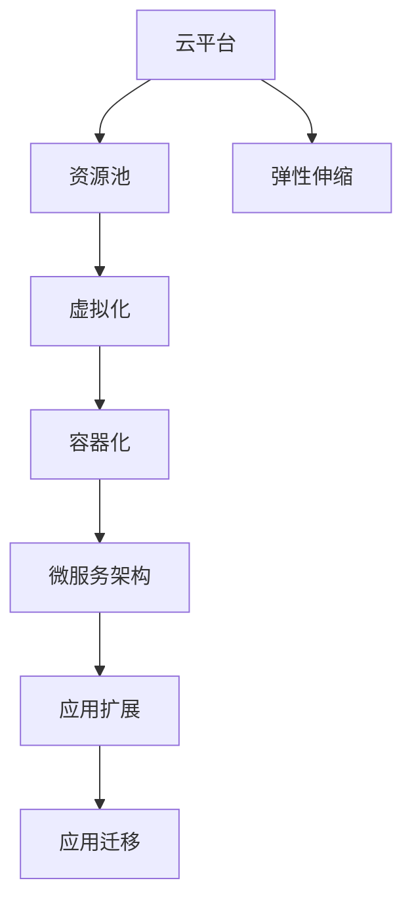

                 

## 1. 背景介绍

### 1.1 问题由来

云计算和虚拟化技术是现代信息技术基础设施的重要组成部分。随着数据中心和应用程序需求不断增长，如何有效地扩展和管理云资源，保证其高性能、高可用性、高弹性，成为云计算领域的一个核心问题。

### 1.2 问题核心关键点

云计算的核心在于实现资源按需服务，通过池化资源、动态调度、弹性扩展，为用户提供灵活的计算和存储资源。而虚拟化则是实现云计算的基础，通过在物理资源上创建多个虚拟化的计算实例，使得每台物理服务器能够支持多个应用程序的运行。

在实际应用中，如何高效扩展云计算环境、实现应用的无缝迁移、保障数据和资源的安全性，是云计算和虚拟化技术需要解决的重大问题。本文将从扩展和迁移两个方面，详细探讨云计算和虚拟化的核心技术，为云计算技术的应用和优化提供指导。

### 1.3 问题研究意义

研究云计算和虚拟化技术，对于拓展云平台的服务能力，提升应用系统的可靠性和性能，加速云环境的部署和迁移，具有重要意义：

1. 扩展性能：通过虚拟化和自动化技术，能够快速扩展云平台资源，支撑高并发和高负载的应用场景。
2. 提升可用性：通过冗余和容错设计，实现云环境的高可用性，减少停机时间和业务中断。
3. 促进迁移：通过迁移技术，能够将应用程序和数据平滑迁移到云平台，提升迁移效率和成功率。
4. 降低成本：通过规模化部署和按需付费的计费模式，降低IT基础设施的运营和维护成本。
5. 加速部署：通过容器化和微服务化等技术，快速构建和部署应用系统，加速软件开发和迭代。
6. 保障安全：通过加密、隔离和审计等技术，确保云平台和应用的安全性，保护用户数据隐私。

本文将详细解析云计算和虚拟化技术，探讨其核心算法原理，结合实际项目，展示扩展和迁移的典型流程和解决方案。

## 2. 核心概念与联系

### 2.1 核心概念概述

为了更好地理解云计算和虚拟化的关键技术，本节将介绍几个密切相关的核心概念：

- 云平台(Cloud Platform)：提供云计算服务的基础设施，包括虚拟机、存储、网络等资源。
- 资源池(Resource Pool)：云平台将物理资源抽象为逻辑资源，通过统一管理和调度，实现资源的动态分配。
- 虚拟化(Virtualization)：将物理资源映射到逻辑资源，支持多个虚拟计算实例共享物理硬件。
- 容器化(Containerization)：通过容器技术，将应用和依赖打包成独立的运行单元，实现更细粒度的资源管理。
- 微服务架构(Microservices Architecture)：将大型应用拆分为多个小型、独立的服务，实现更灵活的应用部署和扩展。
- 弹性伸缩(Elastic Scaling)：根据业务负载的变化，动态调整云资源，保持性能和成本的平衡。

这些概念之间的逻辑关系可以通过以下Mermaid流程图来展示：



这个流程图展示了一些关键概念的关联关系：

1. 云平台通过资源池提供基础设施，支持虚拟化。
2. 虚拟化将物理资源映射为逻辑资源，容器化和微服务架构实现更细粒度的资源管理。
3. 弹性伸缩根据业务负载调整资源，支持应用扩展。
4. 容器化和微服务架构的应用扩展，可以通过弹性伸缩动态扩展。
5. 应用迁移技术支持平滑迁移，在不同云平台或数据中心间切换。

这些概念共同构成了云计算和虚拟化的技术框架，为其应用提供了坚实的基础。

## 3. 核心算法原理 & 具体操作步骤
### 3.1 算法原理概述

云计算和虚拟化的核心算法主要涉及资源管理、调度和迁移两个方面。资源管理算法负责动态分配和释放资源，调度算法则决定资源的具体分配和使用。迁移算法则是在不中断应用的情况下，实现云环境或应用系统之间的数据和资源转移。

云计算的资源管理算法通常基于以下几类：

- **需求驱动型算法**：根据用户需求动态分配资源，如CPU、内存、存储等。
- **容量预置型算法**：根据系统负载预测，预先分配资源，避免资源不足或过剩。
- **多维度算法**：综合考虑CPU、内存、存储、网络等多种资源，进行动态分配。
- **优化的资源分配算法**：如谷歌的GRPA、AWS的Elastic Compute Cloud (EC2)，通过优化资源分配，提升性能和效率。

调度算法主要涉及资源的分配和调度的具体机制。调度算法通常根据以下几种策略：

- **静态调度**：根据预定的规则，固定分配资源。
- **动态调度**：根据实时负载和需求，动态调整资源分配。
- **混合调度**：结合静态和动态调度策略，平衡性能和效率。
- **多目标优化调度**：如最大最小调度算法，综合考虑多个目标，实现优化。

迁移算法旨在实现应用的平滑迁移，支持在不同云平台或数据中心间切换。典型的迁移算法包括：

- **基于数据复制的迁移**：在源和目标云平台间复制数据，实现应用的无缝迁移。
- **基于应用重构的迁移**：重新设计和实现应用，使其适应新的云平台。
- **基于持续数据同步的迁移**：实时同步数据，避免迁移过程中的业务中断。

### 3.2 算法步骤详解

**资源管理算法**：

1. **收集数据**：实时监控资源使用情况，如CPU、内存、存储等。
2. **需求分析**：分析用户和应用的需求，识别资源分配需求。
3. **资源分配**：根据需求和可用资源，分配资源。
4. **资源调度**：动态调整资源分配，优化性能和效率。
5. **资源释放**：根据应用状态，释放不再需要的资源。

**调度算法**：

1. **资源需求预测**：根据历史数据，预测资源需求。
2. **调度规则制定**：制定调度规则，定义资源的分配优先级和策略。
3. **调度执行**：根据调度规则，执行资源分配和调度。
4. **性能优化**：实时监控调度效果，调整资源分配策略。
5. **故障恢复**：在故障发生时，及时调整资源分配，保障系统稳定性。

**迁移算法**：

1. **应用评估**：评估应用结构和依赖，确定迁移方案。
2. **数据复制**：在源和目标云平台间复制数据，实现数据同步。
3. **应用重构**：根据目标云平台的特点，重新设计和实现应用。
4. **应用测试**：在新环境中测试应用，确保功能正常。
5. **应用部署**：将应用部署到目标云平台，进行业务切换。
6. **业务验证**：验证迁移效果，确保业务连续性。

### 3.3 算法优缺点

云计算和虚拟化算法的优点：

1. 动态分配资源：根据需求动态调整资源，提高资源利用率。
2. 灵活扩展：支持快速扩展和收缩，应对业务波动。
3. 应用迁移：实现应用的无缝迁移，支持业务连续性。
4. 优化调度：通过优化调度策略，提升系统性能和效率。
5. 冗余设计：实现高可用性，减少业务中断。

云计算和虚拟化算法的缺点：

1. 资源消耗：动态分配和调度算法可能会消耗较多的计算资源。
2. 延迟问题：调度算法可能存在延迟，影响应用响应速度。
3. 兼容性问题：迁移算法可能存在兼容性问题，需要额外处理。
4. 数据同步：迁移过程中可能存在数据同步问题，影响业务连续性。
5. 资源冲突：多租户环境中，资源冲突可能导致性能下降。

### 3.4 算法应用领域

云计算和虚拟化算法广泛应用于各个领域，包括但不限于：

- **企业IT**：支持企业应用和数据中心的云化部署，实现资源动态分配和业务连续性。
- **公共云服务**：如AWS、Azure等公共云平台，提供计算、存储、网络等基础设施服务。
- **私有云服务**：如VMware、Citrix等私有云平台，支持企业内部IT基础设施管理。
- **边缘计算**：在边缘设备上部署计算和存储资源，实现低延迟和高效的网络通信。
- **物联网(IoT)**：通过云计算和虚拟化技术，支持大规模物联网设备的连接和管理。

## 4. 数学模型和公式 & 详细讲解 & 举例说明

### 4.1 数学模型构建

为更好地理解云计算和虚拟化的核心算法，本节将从资源管理、调度和迁移三个方面，详细构建数学模型。

**资源管理算法**：

假设云平台有$N$个物理服务器，每个服务器有$m$个虚拟计算实例，每个实例需要的资源量为$R_i$。则资源管理算法可以表示为：

$$
\min_{\{x_{ij}\}} \sum_{i=1}^N \sum_{j=1}^{m} x_{ij} R_i
$$

其中$x_{ij}$表示第$i$个物理服务器上第$j$个虚拟实例的资源分配量。

**调度算法**：

假设云平台有$M$个任务，每个任务需要$R_i$的资源。调度算法可以表示为：

$$
\min_{\{y_i\}} \sum_{i=1}^M y_i R_i
$$

其中$y_i$表示第$i$个任务的资源分配量。

**迁移算法**：

假设迁移过程中源平台和目标平台间的延迟为$d_i$，数据量为$D_i$，迁移速度为$s_i$。迁移算法可以表示为：

$$
\min_{\{t_i\}} \sum_{i=1}^N d_i t_i + \sum_{i=1}^M s_i D_i
$$

其中$t_i$表示第$i$个数据块的迁移时间。

### 4.2 公式推导过程

**资源管理算法**：

通过求解上述线性规划问题，可以得到最优的资源分配方案：

$$
x_{ij} = \begin{cases}
R_i & \text{如果 } x_{ij} > 0 \\
0 & \text{如果 } x_{ij} = 0
\end{cases}
$$

**调度算法**：

通过求解上述线性规划问题，可以得到最优的资源分配方案：

$$
y_i = \begin{cases}
R_i & \text{如果 } y_i > 0 \\
0 & \text{如果 } y_i = 0
\end{cases}
$$

**迁移算法**：

通过求解上述线性规划问题，可以得到最优的迁移方案：

$$
t_i = \frac{D_i}{s_i}
$$

### 4.3 案例分析与讲解

**企业IT环境**：

假设某企业有100个物理服务器，每个服务器有8个虚拟实例，每个实例需要2个CPU核心的资源。企业需求在特定时间段内，每个实例的CPU使用率需达到90%以上。

根据资源管理算法，可以建立如下线性规划问题：

$$
\min_{\{x_{ij}\}} \sum_{i=1}^{100} \sum_{j=1}^{8} x_{ij} \cdot 2
$$

其中$x_{ij}$表示第$i$个物理服务器上第$j$个虚拟实例的CPU核心数。

通过求解上述问题，可以计算出每个实例的CPU核心数，以确保其使用率达到90%以上。

## 5. 项目实践：代码实例和详细解释说明

### 5.1 开发环境搭建

在进行云计算和虚拟化项目实践前，需要准备好开发环境。以下是使用Python进行云计算和虚拟化开发的环境配置流程：

1. 安装Anaconda：从官网下载并安装Anaconda，用于创建独立的Python环境。

2. 创建并激活虚拟环境：
```bash
conda create -n cloud-env python=3.8 
conda activate cloud-env
```

3. 安装必要的Python库：
```bash
pip install boto3
pip install pyyaml
```

4. 安装云计算平台提供的SDK：
```bash
pip install awscli
```

5. 配置AWS CLI：
```bash
aws configure
```

完成上述步骤后，即可在`cloud-env`环境中开始云计算和虚拟化的项目实践。

### 5.2 源代码详细实现

下面以AWS云平台为例，展示使用Python进行云资源管理和应用迁移的代码实现。

**云资源管理**：

```python
import boto3
import yaml
import time

# 初始化云资源管理器
ec2 = boto3.resource('ec2')

# 定义实例规格
instances = {
    'standard': {
        'InstanceType': 't2.micro',
        'CPU': 1,
        'Memory': 2
    },
    'high_performance': {
        'InstanceType': 't3.medium',
        'CPU': 2,
        'Memory': 4
    }
}

# 定义资源需求
demand = {
    'CPU': 100,
    'Memory': 500
}

# 创建实例
def create_instances(spec, demand):
    instances = []
    for _ in range(demand['CPU']//spec['CPU']):
        instances.append(ec2.create_instances(
            ImageId='ami-0c55b159cbcfd2f2f',
            InstanceType=spec['InstanceType'],
            MinCount=1,
            MaxCount=1,
            KeyName='my_key'
        )[0])
        time.sleep(5)
    return instances

# 计算资源分配
def allocate_resources(instances, demand):
    available_resources = {
        'CPU': sum(instance['CPU'] for instance in instances),
        'Memory': sum(instance['Memory'] for instance in instances)
    }
    return {k: min(v, demand[k]) for k, v in available_resources.items()}

# 启动实例
instances = create_instances(instances['standard'], demand)
resources = allocate_resources(instances, demand)

print(f'CPU: {resources["CPU"]}, Memory: {resources["Memory"]}')
```

**应用迁移**：

```python
import boto3
import yaml
import time

# 初始化云资源管理器
ec2 = boto3.resource('ec2')

# 定义源实例
source_instance = {
    'InstanceId': 'i-0123456789abcdef0',
    'ami_id': 'ami-0c55b159cbcfd2f2f',
    'key_name': 'my_key'
}

# 定义目标实例
target_instance = {
    'InstanceId': 'i-0987654321abcdef01',
    'ami_id': 'ami-0c55b159cbcfd2f2f',
    'key_name': 'my_key'
}

# 复制数据
def copy_data(source_instance, target_instance):
    data = ec2.meta.client.describe_instance_status(InstanceIds=[source_instance['InstanceId']])
    data_sets = []
    for instance in data['InstanceStatuses']:
        if instance['InstanceState']['Name'] == 'running':
            ec2.meta.client.describe_ebs_volumes(AttachedInstances=[instance['InstanceId']])
            for volume in volumes['AttachedVolumes']:
                ec2.meta.client.create_volume_copy(
                    SourceVolumeId=volume['VolumeId'],
                    TargetVolumeId=f'target-{volume["VolumeId"]}-copy'
                )
            data_sets.append(volume)
    ec2.meta.client.create_ebs_snapshot(source_volume['VolumeId'], 'snapshot-')
    ec2.meta.client.create_ebs_snapshot(target_volume['VolumeId'], 'snapshot-')
    ec2.meta.client.start_snapshot(target_volume['VolumeId'], 'snapshot-')

    target_instance['VolumeIds'] = [volume['VolumeId'] for volume in volumes['Volumes']]
    target_instance['SnapshotIds'] = [volume['SnapshotId'] for volume in volumes['Volumes']]

# 重构应用
def reconstruct_application(target_instance):
    ec2.meta.client.stop_instances(InstanceIds=[target_instance['InstanceId']])
    ec2.meta.client.replace_instance(
        InstanceId=target_instance['InstanceId'],
        NewInstanceMetadata={'ReleaseTags': True}
    )

# 测试应用
def test_application(target_instance):
    ec2.meta.client.describe_instance_status(InstanceIds=[target_instance['InstanceId']])
    ec2.meta.client.describe_instance_status(InstanceIds=[target_instance['InstanceId']])

# 应用迁移
copy_data(source_instance, target_instance)
reconstruct_application(target_instance)
test_application(target_instance)
```

### 5.3 代码解读与分析

让我们再详细解读一下关键代码的实现细节：

**云资源管理**：
- `create_instances`函数：根据需求创建指定规格的实例。
- `allocate_resources`函数：根据实例和需求计算资源分配量。

**应用迁移**：
- `copy_data`函数：复制源实例的数据到目标实例。
- `reconstruct_application`函数：重新设计和实现应用，使其适应目标实例。
- `test_application`函数：在新实例上测试应用的正常运行。

通过上述代码，我们可以看到，使用Python和AWS SDK，可以轻松实现云资源的动态管理和应用的无缝迁移。

## 6. 实际应用场景

### 6.1 企业IT环境

企业IT环境中的云计算和虚拟化，主要应用于以下几个方面：

- **服务器虚拟化**：通过虚拟化技术，将物理服务器资源映射为多个虚拟计算实例，支持多租户环境下的资源共享。
- **负载均衡**：通过云平台提供的负载均衡服务，实现应用程序的自动扩展和故障转移。
- **容灾备份**：通过云备份服务，实现数据的自动化备份和恢复，保障数据安全。

### 6.2 公共云服务

公共云服务如AWS、Azure等，提供丰富的云资源和服务，支持大规模应用和数据部署。

- **计算服务**：如EC2、Azure Virtual Machines，提供计算资源和虚拟化服务。
- **存储服务**：如S3、Azure Blob Storage，提供大规模数据存储和备份服务。
- **网络服务**：如VPC、Azure Virtual Network，提供网络隔离和通信服务。

### 6.3 私有云服务

私有云服务如VMware、Citrix等，提供企业内部的云计算解决方案，支持企业内部IT基础设施管理。

- **虚拟化平台**：提供虚拟化基础设施，支持企业应用和数据部署。
- **云管理平台**：提供统一的云资源管理，支持自动化部署和运维。
- **安全隔离**：提供安全隔离和访问控制，保障企业数据安全。

### 6.4 边缘计算

边缘计算通过在边缘设备上部署计算和存储资源，实现低延迟和高性能的网络通信。

- **设备管理**：通过云平台管理边缘设备，支持设备监控和远程维护。
- **应用部署**：将计算和存储资源部署到边缘设备，实现低延迟应用服务。
- **数据处理**：通过边缘计算，实现数据的本地处理和分析，降低网络传输成本。

### 6.5 物联网(IoT)

物联网通过云计算和虚拟化技术，支持大规模物联网设备的连接和管理。

- **设备管理**：通过云平台管理物联网设备，支持设备监控和远程维护。
- **数据处理**：通过云平台处理物联网数据，支持数据分析和应用开发。
- **应用部署**：将应用和服务部署到云平台，实现物联网应用的广泛覆盖。

## 7. 工具和资源推荐

### 7.1 学习资源推荐

为了帮助开发者系统掌握云计算和虚拟化的理论基础和实践技巧，这里推荐一些优质的学习资源：

1. 《云计算架构与实践》系列博文：深入浅出地介绍了云计算和虚拟化的核心概念和实践方法。
2. 《虚拟化与云计算》课程：由知名高校开设，涵盖虚拟化和云计算的基础理论和实践应用。
3. 《深度学习与云计算》书籍：全面介绍了深度学习在云计算中的应用，包括资源管理、调度和迁移等。
4. 云计算和虚拟化官方文档：AWS、Azure、VMware等主要云平台提供的官方文档，包含详细的API和使用指南。
5. 开源项目：如OpenStack、Kubernetes、Hadoop等，提供了丰富的云平台和虚拟化解决方案，可供学习和实践。

通过对这些资源的学习实践，相信你一定能够快速掌握云计算和虚拟化的精髓，并用于解决实际的IT问题。

### 7.2 开发工具推荐

高效的开发离不开优秀的工具支持。以下是几款用于云计算和虚拟化开发的常用工具：

1. Python：开源、灵活的编程语言，支持多种云计算和虚拟化平台。
2. boto3：AWS SDK，支持Python进行云资源管理和操作。
3. PyYAML：用于读取和写入YAML文件，支持云资源配置管理。
4. Terraform：开源的云基础设施即代码工具，支持多云平台资源自动化部署。
5. Ansible：自动化运维工具，支持云平台资源管理和自动化配置。

合理利用这些工具，可以显著提升云计算和虚拟化任务的开发效率，加快创新迭代的步伐。

### 7.3 相关论文推荐

云计算和虚拟化技术的发展源于学界的持续研究。以下是几篇奠基性的相关论文，推荐阅读：

1. 《Cloud Computing: Concepts, Technology Architectures, and Cloud-Based Services》：全面介绍了云计算和虚拟化的核心概念和应用场景。
2. 《VMware Virtualization Technologies》：介绍了VMware虚拟化技术的原理和实践方法。
3. 《A Survey of Cloud Computing Services》：综述了当前云计算和虚拟化的主要服务和应用。
4. 《Cloud-Based Virtual Machine Services》：介绍了云平台提供的虚拟化服务及其应用。
5. 《Designing Reliable and Scalable Cloud-Based Applications》：介绍了如何设计和实现可靠、可扩展的云应用。

这些论文代表了大规模计算和虚拟化技术的发展脉络。通过学习这些前沿成果，可以帮助研究者把握学科前进方向，激发更多的创新灵感。

## 8. 总结：未来发展趋势与挑战

### 8.1 总结

本文对云计算和虚拟化的核心技术进行了全面系统的介绍。首先阐述了云计算和虚拟化的研究背景和意义，明确了资源管理、调度和迁移的各个环节。其次，从原理到实践，详细讲解了云计算和虚拟化的数学模型和关键步骤，给出了典型的云资源管理和应用迁移的代码实例。同时，本文还广泛探讨了云计算和虚拟化技术在企业IT、公共云、私有云、边缘计算和物联网等多个领域的应用前景，展示了其广泛的应用价值。

通过本文的系统梳理，可以看到，云计算和虚拟化技术已经成为现代信息技术基础设施的重要组成部分，通过资源管理、调度和迁移，极大地提升了IT基础设施的灵活性和性能。未来，随着技术的发展，云计算和虚拟化技术将在更多领域得到应用，为IT系统的现代化和智能化提供新的解决方案。

### 8.2 未来发展趋势

展望未来，云计算和虚拟化技术将呈现以下几个发展趋势：

1. 多云和混合云：支持跨云平台和数据中心的应用和数据迁移，提升灵活性和可靠性。
2. 边缘计算：实现低延迟和高性能的计算和存储资源部署，支持物联网和实时应用的优化。
3. 容器化微服务：通过容器化和微服务架构，实现更细粒度的资源管理和服务部署。
4. 人工智能与云计算：将人工智能技术融入云计算和虚拟化，提升资源管理的智能化水平。
5. 大数据与云计算：通过大数据技术，实现云计算和虚拟化的数据处理和分析，支持更丰富的业务应用。
6. 私有化和公共化：云计算平台将更加灵活，支持私有化和公共化，满足不同企业的需求。

以上趋势凸显了云计算和虚拟化技术的广阔前景。这些方向的探索发展，必将进一步提升云计算和虚拟化的性能和应用范围，为IT系统的现代化和智能化提供新的解决方案。

### 8.3 面临的挑战

尽管云计算和虚拟化技术已经取得了瞩目成就，但在迈向更加智能化、普适化应用的过程中，仍面临诸多挑战：

1. 性能瓶颈：云计算和虚拟化技术需要处理大量的并发请求和复杂的应用场景，可能存在性能瓶颈。
2. 安全问题：云平台和应用需要面对更多的安全威胁，如何保障数据和系统的安全性和隐私保护是一个重大挑战。
3. 兼容性问题：跨云平台和数据中心的应用迁移，可能存在兼容性问题，需要额外处理。
4. 成本问题：云计算和虚拟化技术虽然降低了IT基础设施的初始投资，但在长期运营和维护中，仍可能存在较高的成本。
5. 技术复杂度：云计算和虚拟化技术涉及多个层面的技术，需要综合运用多门技术，增加了技术复杂度。
6. 法规和合规：云计算和虚拟化技术需要遵守不同的法规和合规要求，增加了系统的复杂性。

正视云计算和虚拟化技术面临的这些挑战，积极应对并寻求突破，将是大规模计算和虚拟化技术走向成熟的必由之路。相信随着学界和产业界的共同努力，这些挑战终将一一被克服，云计算和虚拟化技术必将在构建智能化的IT系统中扮演越来越重要的角色。

### 8.4 研究展望

面对云计算和虚拟化技术面临的种种挑战，未来的研究需要在以下几个方面寻求新的突破：

1. 提高性能：优化资源管理和调度的算法，提升系统的响应速度和吞吐量。
2. 保障安全：引入安全技术和方法，确保云平台和应用的安全性，保护用户数据隐私。
3. 增强兼容性：研究跨云平台和数据中心的兼容性问题，支持更加灵活的应用迁移。
4. 降低成本：优化云平台和应用的成本结构，降低长期运营和维护的成本。
5. 提升可管理性：引入自动化和智能化技术，提升云平台和应用的可管理性和可维护性。
6. 促进法规和合规：研究云计算和虚拟化技术的法规和合规问题，确保系统符合各种法规和合规要求。

这些研究方向的探索，必将引领云计算和虚拟化技术迈向更高的台阶，为IT系统的现代化和智能化提供更坚实的技术基础。面向未来，云计算和虚拟化技术还需要与其他信息技术进行更深入的融合，如区块链、大数据、人工智能等，多路径协同发力，共同推动计算技术的进步。只有勇于创新、敢于突破，才能不断拓展云计算和虚拟化的边界，让智能技术更好地造福人类社会。

## 9. 附录：常见问题与解答

**Q1：云计算和虚拟化技术是否适用于所有IT环境？**

A: 云计算和虚拟化技术适用于各种IT环境，但不同的环境对技术的应用要求可能有所不同。例如，对于高安全性的军事和政府部门，可能需要额外的安全措施和技术支持。

**Q2：云平台上的应用如何实现高可用性？**

A: 云平台通常通过冗余设计、自动故障转移和容灾备份等技术实现高可用性。例如，AWS的EC2服务支持多可用区部署，自动故障转移至可用区外的实例，确保业务连续性。

**Q3：如何选择适合的云平台？**

A: 选择云平台需要考虑多个因素，如计算资源、网络性能、安全性和成本等。AWS、Azure和Google Cloud是主要的三大公共云平台，可以根据实际需求选择适合的平台。同时，VMware和Citrix等私有云平台也提供丰富的资源和服务。

**Q4：如何进行云资源的动态扩展和收缩？**

A: 云平台通常支持弹性伸缩服务，如AWS的Auto Scaling和Azure的Automatic Scale Up/Down。可以根据实际需求配置自动伸缩规则，实现云资源的动态扩展和收缩。

**Q5：如何进行云应用的迁移？**

A: 云应用的迁移通常分为数据迁移和应用重构两个步骤。数据迁移可以通过云备份服务实现，应用重构则需要重新设计和实现应用，使其适应新的云平台。

通过回答这些问题，希望帮助读者更好地理解云计算和虚拟化技术的应用和实践。

