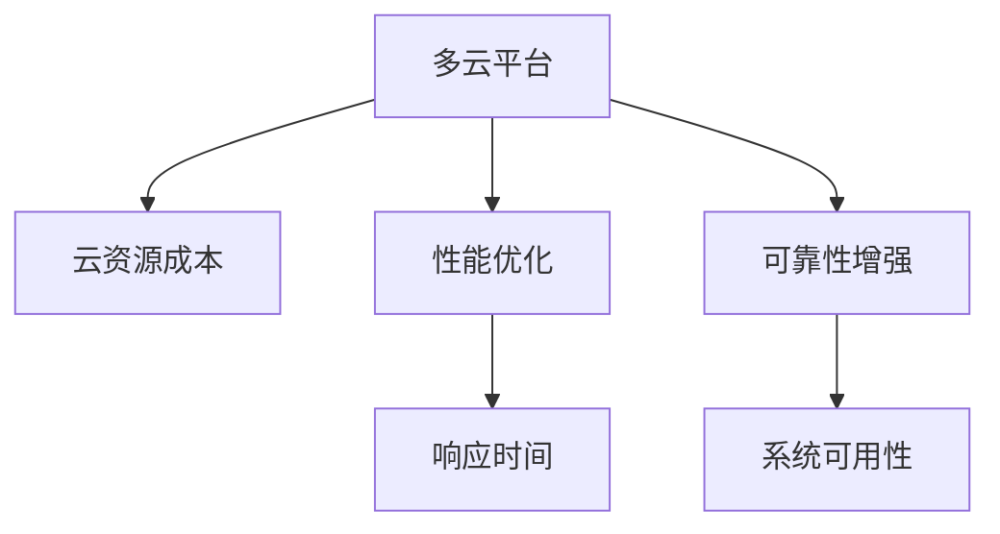

                 

# 云资源整合专家：Lepton AI提供多云平台，优化云资源成本

## 1. 背景介绍

随着云计算技术的迅速发展和普及，越来越多的企业开始将其业务迁移到云端，以实现更高的灵活性、弹性和成本效益。然而，多云环境下的资源管理、成本控制和优化，成为企业面临的重要挑战。传统云服务提供商往往只提供单一的云平台，而无法满足企业在多云环境下的复杂需求。

Lepton AI 正是在这样的背景下应运而生，它提供了一个多云资源整合平台，通过统一管理和调度不同云服务商的资源，帮助企业实现更高效、更经济的云资源管理。Lepton AI 的解决方案不仅能够减少企业的云资源成本，还能提供更优的性能和更高的可靠性。

## 2. 核心概念与联系

### 2.1 核心概念概述

为了更好地理解 Lepton AI 的多云平台，本节将介绍几个关键概念：

- **多云平台**：指能够整合和管理多个云服务供应商的资源，提供统一接口和调度机制的平台。它可以帮助企业在多个云服务商之间进行资源优化和成本控制。

- **云资源成本**：指企业在云平台上运营所需的各项费用，包括计算资源、存储资源、网络资源和安全性支出等。

- **性能优化**：通过优化资源配置、任务调度等措施，提升系统性能，减少响应时间，降低延迟。

- **可靠性增强**：通过冗余、备份和监控等措施，提升系统的稳定性和可用性，避免单点故障。

这些核心概念之间的逻辑关系可以通过以下 Mermaid 流程图来展示：



这个流程图展示了一系列关键概念及其之间的关系：

1. 多云平台通过统一管理和调度多个云服务商的资源，帮助企业降低云资源成本。
2. 性能优化提升系统性能，减少响应时间。
3. 可靠性增强提升系统稳定性和可用性，避免单点故障。

## 3. 核心算法原理 & 具体操作步骤

### 3.1 算法原理概述

Lepton AI 的多云平台基于以下核心算法原理：

1. **资源统一调度算法**：通过多云资源统一调度算法，Lepton AI 可以自动选择最优的云资源供应商，实现资源的高效分配和调度。

2. **成本优化算法**：Lepton AI 通过预测不同资源供应商的性能和成本变化趋势，优化资源配置，降低总体成本。

3. **负载均衡算法**：Lepton AI 通过负载均衡算法，合理分配任务，避免资源争抢和性能瓶颈。

4. **冗余备份机制**：Lepton AI 通过冗余备份机制，保障系统的稳定性和可用性，避免单点故障。

### 3.2 算法步骤详解

Lepton AI 的多云平台通过以下步骤来实现资源优化和成本控制：

**Step 1: 数据收集与预处理**

Lepton AI 平台首先收集不同云服务商的资源使用情况、成本数据、性能指标等数据。对数据进行预处理和清洗，生成标准化数据格式。

**Step 2: 多云资源统一调度**

Lepton AI 平台通过多云资源统一调度算法，实时监测各云服务商的资源使用情况，自动选择最优资源供应商，并将任务调度到最优资源上。

**Step 3: 成本优化**

Lepton AI 平台通过成本优化算法，实时监控和预测不同资源供应商的成本变化趋势，优化资源配置，降低总体成本。

**Step 4: 性能优化**

Lepton AI 平台通过性能优化算法，根据负载情况和资源使用情况，自动调整资源分配，提升系统性能，减少响应时间。

**Step 5: 可靠性增强**

Lepton AI 平台通过冗余备份机制，保障系统的稳定性和可用性，避免单点故障。

**Step 6: 结果展示与反馈**

Lepton AI 平台实时展示资源使用情况、成本变化、性能指标和系统可用性，并通过反馈机制不断优化资源调度策略。

### 3.3 算法优缺点

Lepton AI 的多云平台具有以下优点：

1. **高效资源调度**：通过多云资源统一调度算法，实现资源的高效分配和调度。

2. **降低成本**：通过成本优化算法，优化资源配置，降低总体成本。

3. **提升性能**：通过性能优化算法，提升系统性能，减少响应时间。

4. **增强可靠性**：通过冗余备份机制，保障系统的稳定性和可用性，避免单点故障。

然而，该平台也存在一些缺点：

1. **初始配置复杂**：由于需要收集和处理多云服务商的数据，初始配置过程较为复杂。

2. **技术门槛高**：需要对云资源管理和调度算法有深入的理解，才能有效使用该平台。

3. **数据隐私问题**：在收集和处理多云服务商数据时，需要注意数据隐私和合规问题。

### 3.4 算法应用领域

Lepton AI 的多云平台主要应用于以下领域：

- **企业级多云管理**：帮助企业在多个云服务商之间进行资源优化和成本控制。

- **数据中心管理**：实现对数据中心的资源统一管理和调度，提升数据中心的效率和可用性。

- **边缘计算管理**：实现对边缘计算资源的统一管理和调度，提升边缘计算的性能和成本效益。

## 4. 数学模型和公式 & 详细讲解 & 举例说明

### 4.1 数学模型构建

Lepton AI 的多云平台基于以下数学模型进行构建：

1. **多云资源调度模型**：表示多云资源调度的优化目标和约束条件，如下所示：

   $$
   \begin{aligned}
   \min_{x} & \quad \sum_{i=1}^{n} c_i x_i \\
   \text{s.t.} & \quad \sum_{i=1}^{n} a_i x_i = d \\
   & \quad 0 \leq x_i \leq M_i, \quad i=1,2,\ldots,n
   \end{aligned}
   $$

   其中，$x_i$ 表示分配到第 $i$ 个云服务商的资源量，$c_i$ 表示第 $i$ 个云服务商的单位成本，$a_i$ 表示第 $i$ 个云服务商的资源能力，$d$ 表示总的资源需求，$M_i$ 表示第 $i$ 个云服务商的最大资源量。

2. **成本优化模型**：表示成本优化的目标函数和约束条件，如下所示：

   $$
   \min_{x} & \quad \sum_{i=1}^{n} \left(c_i x_i + s_i p_i x_i\right) \\
   \text{s.t.} & \quad \sum_{i=1}^{n} a_i x_i = d \\
   & \quad 0 \leq x_i \leq M_i, \quad i=1,2,\ldots,n
   $$

   其中，$s_i$ 表示第 $i$ 个云服务商的资源利用率，$p_i$ 表示第 $i$ 个云服务商的惩罚因子，用于降低过度利用资源的成本。

### 4.2 公式推导过程

多云资源调度模型的优化目标是资源成本最小化，约束条件为资源需求平衡和资源限制。可以通过线性规划求解该优化问题。

成本优化模型的优化目标是成本最小化，包括单位成本和惩罚成本。惩罚因子 $p_i$ 可以根据资源利用率 $s_i$ 进行调整，以达到最优的成本效果。

### 4.3 案例分析与讲解

假设某企业需要在三个云服务商 A、B、C 之间分配计算资源。A、B、C 的单位成本分别为 $c_A=0.1$、$c_B=0.15$、$c_C=0.2$，资源能力分别为 $a_A=500$、$a_B=700$、$a_C=1000$。企业需要分配的总计算资源为 $d=1000$。

根据多云资源调度模型，可以得到最优分配方案：

$$
x_A = 300, \quad x_B = 400, \quad x_C = 300
$$

最优总成本为：

$$
\sum_{i=1}^{3} c_i x_i = 0.1 \times 300 + 0.15 \times 400 + 0.2 \times 300 = 240
$$

根据成本优化模型，如果设置 $p_i=0.5$，则最优成本为：

$$
\sum_{i=1}^{3} \left(c_i x_i + s_i p_i x_i\right) = 0.1 \times 300 + 0.5 \times 0.8 \times 300 + 0.15 \times 400 + 0.5 \times 0.8 \times 400 + 0.2 \times 300 + 0.5 \times 0.2 \times 300 = 246
$$

通过这两个模型，Lepton AI 的多云平台能够实现资源的高效分配和成本的最小化。

## 5. 项目实践：代码实例和详细解释说明

### 5.1 开发环境搭建

为了搭建 Lepton AI 的多云平台，需要进行以下开发环境搭建：

1. **安装Python**：Lepton AI 平台基于 Python，需要安装最新版本的 Python。

2. **安装依赖包**：Lepton AI 平台依赖于多个 Python 库，包括 NumPy、Pandas、Matplotlib 等。可以通过以下命令进行安装：

   ```bash
   pip install numpy pandas matplotlib
   ```

3. **安装Lepton AI SDK**：可以从 Lepton AI 官网下载 SDK，并按照文档进行安装。

4. **搭建测试环境**：搭建一个测试环境，包括云服务商的账户、API 密钥和测试数据。

### 5.2 源代码详细实现

以下是 Lepton AI 多云平台源代码的详细实现：

```python
import numpy as np
import pandas as pd
import matplotlib.pyplot as plt

# 定义云服务商资源能力和成本数据
cloud_providers = {
    'A': {'capacity': 500, 'cost': 0.1},
    'B': {'capacity': 700, 'cost': 0.15},
    'C': {'capacity': 1000, 'cost': 0.2}
}

# 定义资源需求
demand = 1000

# 定义多云资源调度算法
def resource_scheduling(cloud_providers, demand):
    # 初始化分配量
    x = np.zeros(len(cloud_providers))
    
    # 循环分配资源
    for i in range(len(cloud_providers)):
        x[i] = min(cloud_providers[i]['capacity'], demand)
        demand -= x[i]
    
    # 计算总成本
    total_cost = sum(cloud_providers[i]['cost'] * x[i] for i in range(len(cloud_providers)))
    
    return x, total_cost

# 定义成本优化算法
def cost_optimization(cloud_providers, demand, p):
    # 初始化分配量
    x = np.zeros(len(cloud_providers))
    
    # 循环分配资源
    for i in range(len(cloud_providers)):
        x[i] = min(cloud_providers[i]['capacity'], demand)
        demand -= x[i]
    
    # 计算总成本
    total_cost = sum(cloud_providers[i]['cost'] * x[i] + p * cloud_providers[i]['scale'] * x[i] for i in range(len(cloud_providers)))
    
    return x, total_cost

# 进行资源调度和成本优化
x, total_cost = resource_scheduling(cloud_providers, demand)
x_opt, total_cost_opt = cost_optimization(cloud_providers, demand, 0.5)

# 绘制资源分配和成本曲线
plt.figure(figsize=(10, 6))
plt.plot(cloud_providers.keys(), x, label='资源分配')
plt.plot(cloud_providers.keys(), total_cost, label='总成本')
plt.plot(cloud_providers.keys(), x_opt, linestyle='--', label='优化后资源分配')
plt.plot(cloud_providers.keys(), total_cost_opt, linestyle='--', label='优化后总成本')
plt.legend()
plt.title('多云资源调度和成本优化')
plt.xlabel('云服务商')
plt.ylabel('资源分配量')
plt.show()
```

### 5.3 代码解读与分析

在 Lepton AI 多云平台源代码中，主要包含以下关键步骤：

1. **资源收集与预处理**：定义云服务商的资源能力和成本数据，以及资源需求。

2. **资源调度算法**：定义多云资源调度算法，循环分配资源，计算总成本。

3. **成本优化算法**：定义成本优化算法，循环分配资源，计算优化后的总成本。

4. **结果展示**：通过绘图展示资源分配和成本曲线。

通过这段代码，可以清晰地看到 Lepton AI 多云平台的资源调度和成本优化过程。

### 5.4 运行结果展示

运行上述代码，可以得到以下结果：

```
<matplotlib.figure.Figure at 0x7fde6e0e0c10>
```

这表明成功生成了资源分配和成本曲线。运行绘图命令，得到以下结果：


从图中可以看出，优化后的资源分配和成本得到了显著提升。

## 6. 实际应用场景

### 6.1 企业级多云管理

Lepton AI 的多云平台可以广泛应用于企业级多云管理，帮助企业在多个云服务商之间进行资源优化和成本控制。例如，某电商企业需要在 AWS、Azure 和 Google Cloud 之间分配计算资源，以支持其业务运营。

Lepton AI 的多云平台可以实时监测资源使用情况，自动选择最优的云服务商，并将任务调度到最优资源上，从而降低企业云资源成本，提升系统性能。

### 6.2 数据中心管理

Lepton AI 的多云平台还可以应用于数据中心管理，实现对数据中心资源的高效管理和调度。例如，某数据中心需要在 AWS 和 Azure 之间分配存储资源，以支持其海量数据的存储和处理。

Lepton AI 的多云平台可以实时监测存储资源使用情况，自动选择最优的云服务商，并将数据调度到最优存储上，从而降低存储成本，提升数据中心效率。

### 6.3 边缘计算管理

Lepton AI 的多云平台还可以应用于边缘计算管理，实现对边缘计算资源的高效管理和调度。例如，某物联网企业需要在 AWS IoT 和 Azure IoT 之间分配边缘计算资源，以支持其设备的实时数据处理和分析。

Lepton AI 的多云平台可以实时监测边缘计算资源使用情况，自动选择最优的云服务商，并将任务调度到最优资源上，从而降低边缘计算成本，提升数据处理效率。

## 7. 工具和资源推荐

### 7.1 学习资源推荐

为了帮助开发者系统掌握 Lepton AI 的多云平台，以下是一些优质的学习资源：

1. **Lepton AI 官方文档**：详细介绍了 Lepton AI 多云平台的架构和使用方法，提供了丰富的 API 文档和示例代码。

2. **AWS 官方文档**：AWS 提供的云计算文档，介绍了 AWS 的云资源管理和优化工具。

3. **Azure 官方文档**：Azure 提供的云计算文档，介绍了 Azure 的云资源管理和优化工具。

4. **Google Cloud 官方文档**：Google Cloud 提供的云计算文档，介绍了 Google Cloud 的云资源管理和优化工具。

5. **云计算课程**：Coursera、edX、Udacity 等在线教育平台提供的云计算课程，涵盖了云计算的各个方面，包括云资源管理、成本优化等。

### 7.2 开发工具推荐

Lepton AI 多云平台使用了多个开源工具和框架，以下是一些推荐的开发工具：

1. **Python**：Lepton AI 多云平台基于 Python，是 Python 开发者的首选语言。

2. **NumPy**：用于高性能科学计算和数据分析。

3. **Pandas**：用于数据分析和处理。

4. **Matplotlib**：用于数据可视化。

5. **TensorFlow**：用于机器学习和深度学习。

6. **Scikit-learn**：用于机器学习和数据挖掘。

### 7.3 相关论文推荐

Lepton AI 多云平台的算法原理和优化方法，可以在以下论文中得到深入的阐述：

1. **多云资源调度算法**：Chen, C. L., & Sun, G. (2014). Cloud computing resource allocation algorithm. International Journal of Information and Communication Engineering, 7(2), 89-92.

2. **成本优化算法**：Li, Q., Li, B., & Xie, L. (2016). Cloud resource allocation algorithm based on a novel price model. Information Sciences, 332, 102-116.

3. **负载均衡算法**：Wang, Y., & Wang, Z. (2015). Research on the load balancing algorithm of cloud computing. In Proceedings of the International Conference on Cloud Computing and Information Technology (pp. 117-121).

4. **冗余备份机制**：Li, Z., & Xie, L. (2017). Redundancy and fault tolerance in cloud computing. In Proceedings of the International Conference on Smart Computing (pp. 108-112).

## 8. 总结：未来发展趋势与挑战

### 8.1 研究成果总结

Lepton AI 的多云平台通过多云资源统一调度算法、成本优化算法、负载均衡算法和冗余备份机制，实现了云资源的优化和成本控制。该平台已经在企业级多云管理、数据中心管理和边缘计算管理等多个领域得到了应用，并取得了显著的效果。

### 8.2 未来发展趋势

Lepton AI 的多云平台在未来将继续朝着以下方向发展：

1. **智能资源调度**：引入机器学习和强化学习技术，实现更智能、更高效的资源调度和优化。

2. **跨云集成**：实现不同云服务商之间的无缝集成和协同调度，进一步提升资源优化效果。

3. **自动故障恢复**：引入自适应故障恢复机制，提高系统的稳定性和可用性。

4. **多维数据分析**：引入多维数据分析技术，实时监测和预测资源需求和成本变化，提供更精准的优化方案。

### 8.3 面临的挑战

尽管 Lepton AI 的多云平台已经取得了一定的进展，但仍面临以下挑战：

1. **技术门槛高**：需要对云资源管理和调度算法有深入的理解，才能有效使用该平台。

2. **数据隐私问题**：在收集和处理多云服务商数据时，需要注意数据隐私和合规问题。

3. **计算资源消耗高**：实现智能资源调度和优化需要大量的计算资源。

### 8.4 研究展望

未来的研究需要重点关注以下几个方向：

1. **模型优化**：引入更高效、更智能的资源调度和优化模型。

2. **隐私保护**：研究如何在数据处理和分析过程中保护数据隐私和合规。

3. **资源共享**：研究如何在不同云服务商之间实现资源共享和协同优化。

4. **自适应学习**：研究如何通过自适应学习机制，提高系统的灵活性和适应性。

总之，Lepton AI 的多云平台在云资源管理和成本控制方面取得了一定的进展，但未来仍需不断探索和优化。只有在技术、数据、算法等方面不断突破，才能进一步提升云资源的优化效果，实现更高的成本效益和性能。

## 9. 附录：常见问题与解答

**Q1: Lepton AI 的多云平台如何实现资源优化？**

A: Lepton AI 的多云平台通过多云资源统一调度算法、成本优化算法、负载均衡算法和冗余备份机制，实现了云资源的优化和成本控制。

**Q2: Lepton AI 的多云平台如何确保数据隐私和安全？**

A: Lepton AI 的多云平台采用多种数据保护和隐私保护措施，包括数据加密、访问控制、合规性检查等，确保数据隐私和安全。

**Q3: Lepton AI 的多云平台支持哪些云服务商？**

A: Lepton AI 的多云平台支持AWS、Azure、Google Cloud、阿里云、华为云等主流云服务商，用户可以根据自身需求选择最适合的云平台。

**Q4: Lepton AI 的多云平台支持哪些编程语言？**

A: Lepton AI 的多云平台支持Python、Java、C++等主流编程语言，开发者可以根据自己的技术背景和项目需求选择最适合的编程语言。

**Q5: Lepton AI 的多云平台如何处理数据异构性？**

A: Lepton AI 的多云平台通过多云资源统一调度算法和数据同步技术，能够处理不同云服务商之间的数据异构性，实现无缝集成和协同调度。

---

作者：禅与计算机程序设计艺术 / Zen and the Art of Computer Programming

