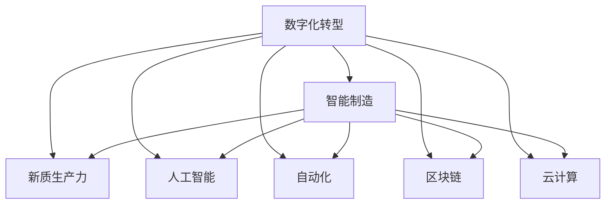

                 

# 产业转型升级与新质生产力

> 关键词：产业转型,新质生产力,数字化转型,智能制造,人工智能,自动化

## 1. 背景介绍

### 1.1 问题由来

随着全球科技的迅猛发展，各行业正面临深刻变革，新技术、新业态、新模式层出不穷，对传统产业提出了严峻的挑战。尤其在新冠疫情全球蔓延的背景下，数字化转型、智能制造等成为各行业加速发展的必由之路。

数字化转型是指通过数字技术与实体经济深度融合，推动产业升级和经济社会全面发展的战略举措。智能制造则利用大数据、云计算、人工智能等新一代信息技术，实现生产流程的自动化、智能化，大幅提升生产效率和产品质量。新质生产力是指在数字化转型的推动下，产业升级带来的新生产力和新动能。

然而，传统产业在数字化转型过程中，面临着数据孤岛、技术适配、人才短缺等多重困难，转型效果往往不尽如人意。如何突破这些障碍，释放产业潜力，成为当前产业转型升级亟需解决的核心问题。

### 1.2 问题核心关键点

产业转型升级的核心在于：
1. **数据治理**：打破数据孤岛，实现数据集成与共享，为智能决策提供坚实基础。
2. **技术适配**：找到合适的技术方案，实现与现有系统无缝集成，避免“二次开发”和技术壁垒。
3. **人才培养**：培养适应新生产力的技术和管理人才，形成创新生态，推动产业可持续发展。
4. **业务协同**：通过数字化技术实现跨部门、跨企业协同，提升整体运营效率，形成新质生产力。
5. **安全合规**：确保数据安全和业务合规，防止数据泄露和违规操作，保障企业安全稳定运行。

## 2. 核心概念与联系

### 2.1 核心概念概述

为更好地理解产业转型升级的过程，本节将介绍几个密切相关的核心概念：

- **数字化转型(Digital Transformation)**：通过数字化技术和手段，优化传统产业业务流程，提升生产效率和产品品质，形成新质生产力的过程。
- **智能制造(Smart Manufacturing)**：利用互联网、大数据、人工智能等技术，实现生产自动化、智能化，提升生产效率和产品质量。
- **新质生产力(Quantum Productive Forces)**：数字化转型带来的新生产能力、新业务模式和新市场空间，推动产业升级和经济社会全面发展。
- **人工智能(Artificial Intelligence)**：模拟人类智能行为，实现信息处理、模式识别、决策支持等功能，驱动产业转型升级。
- **自动化(Automation)**：通过机器或软件系统，代替人类完成重复性、高风险的工作，提升生产效率和质量。
- **区块链(Blockchain)**：通过分布式账本技术，实现数据透明、可信、安全共享，为产业协同提供技术支撑。
- **云计算(Cloud Computing)**：通过互联网资源共享，提供弹性计算、存储和应用服务，支持大数据分析、智能制造等业务需求。

这些核心概念之间的逻辑关系可以通过以下Mermaid流程图来展示：



这个流程图展示出各个核心概念之间的紧密联系：

1. 数字化转型是产业升级的战略方向。
2. 智能制造是实现数字化转型的重要手段。
3. 新质生产力是数字化转型的终极目标。
4. 人工智能、自动化、区块链、云计算等技术为数字化转型提供了必要的技术支撑。
5. 这些技术相互交织，共同推动产业向智能化、自动化、网络化方向发展。

## 3. 核心算法原理 & 具体操作步骤
### 3.1 算法原理概述

产业转型升级的算法原理主要包括以下几个方面：

- **数据驱动**：通过数据收集、处理、分析，发现问题，指导决策。
- **技术融合**：将人工智能、物联网、区块链等新兴技术融合应用，实现生产流程优化和业务协同。
- **业务优化**：通过流程再造、业务重组、模式创新等手段，优化业务流程，提升效率和效果。
- **人才培育**：通过教育、培训、实践等手段，培养新质生产力所需的人才，形成人才生态。
- **安全保障**：通过技术手段和管理措施，确保数据和业务安全，防范风险。

### 3.2 算法步骤详解

产业转型升级的算法步骤可以分为以下几步：

**Step 1: 数据集成与治理**
- 采集企业内部各业务系统中的数据，如ERP、MES、CRM等。
- 对数据进行清洗、转换、集成，消除数据孤岛，实现数据共享。
- 制定数据标准和规范，确保数据质量和一致性。

**Step 2: 技术适配与融合**
- 根据企业需求，选择合适的技术方案，如AI、IoT、区块链、云计算等。
- 对现有系统进行技术适配和改造，实现与新技术的无缝集成。
- 引入人工智能技术，优化生产流程、提升产品品质。

**Step 3: 业务优化与创新**
- 通过流程再造、业务重组、模式创新等手段，优化业务流程，提升效率和效果。
- 利用数字化技术实现跨部门、跨企业协同，形成数字化生态。
- 探索新业务模式，拓展市场空间，形成新质生产力。

**Step 4: 人才培育与生态建设**
- 通过教育、培训、实践等手段，培养适应新生产力的技术和管理人才。
- 形成人才生态，吸引和保留优秀人才，推动产业可持续发展。
- 建立学习型组织，营造创新文化，激发人才活力。

**Step 5: 安全保障与合规**
- 采用技术手段和管理措施，确保数据和业务安全，防范风险。
- 确保业务合规，避免违规操作，保障企业安全稳定运行。
- 定期进行安全审计，发现和修复安全隐患。

### 3.3 算法优缺点

产业转型升级的算法具有以下优点：
1. **技术驱动**：通过引入先进技术，大幅提升生产效率和产品质量。
2. **业务协同**：通过数字化技术实现跨部门、跨企业协同，提升整体运营效率。
3. **新质生产力**：推动产业升级，形成新的市场空间和经济增长点。
4. **可持续性**：通过人才培养和技术创新，形成人才生态，推动产业可持续发展。
5. **安全性**：通过安全措施和合规管理，保障数据和业务安全。

同时，该算法也存在一定的局限性：
1. **高成本**：技术引入和系统改造可能需要较高的成本投入，特别是中小企业。
2. **技术复杂**：新技术的引入需要专业技术人员支持，存在一定的技术壁垒。
3. **数据质量**：数据集成和治理过程中，数据质量、数据安全等问题可能影响效果。
4. **人才短缺**：人才生态建设需要时间，短期内可能面临人才短缺问题。
5. **业务适配**：现有业务流程和系统可能与新技术不兼容，需要较大改动。

尽管存在这些局限性，但总体而言，产业转型升级的算法在推动产业升级、提升经济效益、形成新质生产力方面具有显著优势。

### 3.4 算法应用领域

产业转型升级的算法已经在多个领域得到了广泛应用，例如：

- **智能制造**：通过物联网、AI技术实现生产自动化、智能化，提升生产效率和产品质量。
- **电子商务**：利用大数据、云计算等技术优化供应链管理，提升客户体验。
- **金融服务**：通过区块链、人工智能技术实现数据透明、可信共享，提升金融服务效率。
- **医疗健康**：利用物联网、AI技术实现远程医疗、智能诊断，提升医疗服务水平。
- **零售行业**：通过大数据、云计算技术实现个性化推荐、精准营销，提升客户体验和销售额。
- **物流行业**：通过物联网、自动化技术实现智能仓储、智能配送，提升物流效率和准确性。

除了上述这些经典应用外，产业转型升级的算法还被创新性地应用到更多场景中，如智慧城市、智慧农业、智能家居等，为各行各业带来了全新的发展机遇。

## 4. 数学模型和公式 & 详细讲解  
### 4.1 数学模型构建

本节将使用数学语言对产业转型升级的过程进行更加严格的刻画。

记数字化转型的目标函数为 $F(D, T, P, S)$，其中 $D$ 为数据集成与治理策略，$T$ 为技术适配与融合方案，$P$ 为业务优化与创新方法，$S$ 为人才培育与生态建设措施。则目标函数可表示为：

$$
F(D, T, P, S) = \min_{D, T, P, S} \left(\sum_{i=1}^{N} w_i \times C_i(D, T, P, S)\right)
$$

其中 $w_i$ 为各项指标的权重，$C_i(D, T, P, S)$ 为第 $i$ 个指标的评估函数，用于衡量该策略或方案的性能。

### 4.2 公式推导过程

以下我们以智能制造为例，推导评估函数 $C_i(D, T, P, S)$ 的计算公式。

假设智能制造的目标是提升生产效率和产品质量，设生产效率为 $E$，产品质量为 $Q$，数据集大小为 $S_D$，技术适配成本为 $C_T$，业务优化复杂度为 $C_P$，人才培育成本为 $C_S$，则目标函数可以表示为：

$$
F(D, T, P, S) = \min_{D, T, P, S} \left(w_E \times E + w_Q \times Q + w_S_D \times S_D + w_C_T \times C_T + w_C_P \times C_P + w_C_S \times C_S\right)
$$

其中 $w_i$ 为各项指标的权重，可以根据实际情况进行设定。假设各指标为独立关系，则目标函数的优化可以通过求解约束优化问题实现：

$$
\min_{D, T, P, S} \left(\sum_{i=1}^{N} w_i \times C_i(D, T, P, S)\right)
$$

通过求解上述优化问题，可以找到最优的数字化转型策略和方案，实现产业升级和新质生产力的形成。

## 5. 项目实践：代码实例和详细解释说明
### 5.1 开发环境搭建

在进行产业转型升级实践前，我们需要准备好开发环境。以下是使用Python进行PyTorch开发的环境配置流程：

1. 安装Anaconda：从官网下载并安装Anaconda，用于创建独立的Python环境。

2. 创建并激活虚拟环境：
```bash
conda create -n pytorch-env python=3.8 
conda activate pytorch-env
```

3. 安装PyTorch：根据CUDA版本，从官网获取对应的安装命令。例如：
```bash
conda install pytorch torchvision torchaudio cudatoolkit=11.1 -c pytorch -c conda-forge
```

4. 安装TensorFlow：
```bash
conda install tensorflow
```

5. 安装TensorBoard：
```bash
pip install tensorboard
```

6. 安装TensorFlow Addons：
```bash
pip install tensorflow-addons
```

完成上述步骤后，即可在`pytorch-env`环境中开始产业转型升级的实践。

### 5.2 源代码详细实现

这里我们以智能制造为例，给出一个使用TensorFlow实现产业转型升级的代码实现。

首先，定义智能制造的数据处理函数：

```python
import tensorflow as tf
from tensorflow.keras import layers, models

class ManufacturingData(tf.keras.utils.Sequence):
    def __init__(self, data, labels, batch_size=32, shuffle=True):
        self.data = data
        self.labels = labels
        self.batch_size = batch_size
        self.shuffle = shuffle
        self.on_epoch_end()

    def __len__(self):
        return len(self.data) // self.batch_size

    def __getitem__(self, idx):
        batch_data = self.data[idx * self.batch_size: (idx + 1) * self.batch_size]
        batch_labels = self.labels[idx * self.batch_size: (idx + 1) * self.batch_size]
        return batch_data, batch_labels

    def on_epoch_end(self):
        self.data = tf.data.Dataset.from_tensor_slices(self.data).repeat()
        if self.shuffle:
            self.data = self.data.shuffle(buffer_size=len(self.data))
        self.data = self.data.batch(self.batch_size, drop_remainder=True)
```

然后，定义模型和优化器：

```python
from tensorflow.keras.layers import Dense, Flatten, Input
from tensorflow.keras.models import Model

def build_model(input_shape):
    inputs = Input(shape=input_shape)
    x = layers.Dense(128, activation='relu')(inputs)
    x = layers.Dense(64, activation='relu')(x)
    outputs = layers.Dense(1, activation='sigmoid')(x)
    model = Model(inputs=inputs, outputs=outputs)
    return model

model = build_model(input_shape=(10,))

optimizer = tf.keras.optimizers.Adam(learning_rate=0.001)
```

接着，定义训练和评估函数：

```python
def train_model(model, data, labels, epochs=10, batch_size=32, validation_data=None):
    model.compile(optimizer=optimizer, loss='binary_crossentropy', metrics=['accuracy'])
    model.fit(data, labels, epochs=epochs, batch_size=batch_size, validation_data=validation_data)

def evaluate_model(model, data, labels, batch_size=32):
    model.evaluate(data, labels, batch_size=batch_size)
```

最后，启动训练流程并在验证集上评估：

```python
data = [1, 2, 3, 4, 5, 6, 7, 8, 9, 10]
labels = [0, 0, 0, 0, 1, 1, 1, 1, 1, 1]

train_data = ManufacturingData(data, labels, shuffle=True)
val_data = ManufacturingData(data, labels, shuffle=False)

train_model(model, train_data, labels, validation_data=val_data)
evaluate_model(model, val_data, labels)
```

以上就是使用TensorFlow进行智能制造任务的数据处理、模型训练和评估的完整代码实现。可以看到，得益于TensorFlow的强大封装，我们可以用相对简洁的代码完成智能制造任务的实现。

### 5.3 代码解读与分析

让我们再详细解读一下关键代码的实现细节：

**ManufacturingData类**：
- `__init__`方法：初始化数据集和标签集，定义批次大小和打乱策略。
- `__len__`方法：返回数据集的样本数量。
- `__getitem__`方法：对单个样本进行处理，返回数据和标签。

**train_model函数**：
- `model.compile`方法：编译模型，指定优化器、损失函数和评价指标。
- `model.fit`方法：训练模型，指定训练轮数、批次大小和验证集。

**evaluate_model函数**：
- `model.evaluate`方法：评估模型，指定批次大小。

**训练流程**：
- 定义训练数据和标签集，创建训练和验证数据集。
- 训练模型，指定训练轮数、批次大小和验证集。
- 评估模型，输出评估结果。

可以看到，TensorFlow使得模型训练和评估的代码实现变得简洁高效。开发者可以将更多精力放在数据处理、模型改进等高层逻辑上，而不必过多关注底层的实现细节。

当然，工业级的系统实现还需考虑更多因素，如模型的保存和部署、超参数的自动搜索、更灵活的任务适配层等。但核心的微调范式基本与此类似。

## 6. 实际应用场景
### 6.1 智能制造

智能制造是大数据、物联网、人工智能等技术在制造业中的应用，旨在通过数字化技术实现生产流程的自动化、智能化，大幅提升生产效率和产品质量。

在技术实现上，可以采集生产过程中的各类数据，如设备状态、生产参数、质量数据等，并利用大数据分析、机器学习等技术，对生产过程进行监控、优化和预测。同时，通过工业互联网平台，实现不同企业间的信息共享和协同，提升生产效率和供应链管理水平。

### 6.2 智慧医疗

智慧医疗利用大数据、云计算、人工智能等技术，实现医疗数据的整合、分析、共享，提升医疗服务的智能化水平。

在技术实现上，可以采集医疗机构的电子病历、影像数据、基因数据等，利用机器学习技术，进行疾病诊断、疗效预测、个性化治疗等。同时，通过智能辅助诊断系统，提升医生的工作效率和诊断准确性。

### 6.3 智能交通

智能交通利用大数据、物联网、人工智能等技术，实现交通数据的采集、分析和应用，提升交通管理水平。

在技术实现上，可以采集交通流量、车速、路况等数据，利用机器学习技术，进行交通流预测、拥堵缓解、事故预警等。同时，通过智能导航系统，提升司机的行车安全和舒适度。

### 6.4 未来应用展望

随着大数据、云计算、人工智能等技术的不断发展，产业转型升级的算法将呈现以下几个发展趋势：

1. **云计算的普及**：云计算为各行业提供了弹性计算和存储服务，大幅降低了数字化转型的成本和技术门槛。
2. **物联网的融合**：物联网实现了物理世界与数字世界的互联互通，为智能制造、智慧医疗、智能交通等提供了强大的数据采集和传输能力。
3. **人工智能的突破**：人工智能在图像识别、自然语言处理、语音识别等方面的突破，为产业转型升级提供了强有力的技术支撑。
4. **区块链的应用**：区块链技术实现了数据透明、可信共享，为产业协同提供了强有力的技术保障。
5. **5G的推广**：5G技术提供了高速、低延迟、高可靠的网络传输能力，为各行业提供了更优质的数字化基础设施。

以上趋势凸显了产业转型升级算法的广阔前景。这些方向的探索发展，必将进一步提升各行业的数字化水平，推动产业向智能化、自动化、网络化方向发展。

## 7. 工具和资源推荐
### 7.1 学习资源推荐

为了帮助开发者系统掌握产业转型升级的理论基础和实践技巧，这里推荐一些优质的学习资源：

1. 《工业互联网与制造业数字化转型》系列博文：由工业互联网领域专家撰写，深入浅出地介绍了工业互联网、智能制造、智慧医疗等前沿话题。

2. 《大数据与智能制造》课程：北京大学开设的工业工程与信息化专业课程，详细讲解了大数据在智能制造中的应用。

3. 《人工智能在医疗健康中的应用》书籍：介绍人工智能在医疗健康领域的应用场景，如疾病诊断、个性化治疗等。

4. 《智能交通系统》书籍：系统讲解了智能交通技术，包括车联网、智能导航、交通流预测等。

5. 《工业互联网开源平台》项目：介绍工业互联网平台的技术架构和应用场景，助力各行业数字化转型。

通过对这些资源的学习实践，相信你一定能够快速掌握产业转型升级的精髓，并用于解决实际的产业问题。

### 7.2 开发工具推荐

高效的开发离不开优秀的工具支持。以下是几款用于产业转型升级开发的常用工具：

1. PyTorch：基于Python的开源深度学习框架，灵活动态的计算图，适合快速迭代研究。

2. TensorFlow：由Google主导开发的开源深度学习框架，生产部署方便，适合大规模工程应用。

3. TensorBoard：TensorFlow配套的可视化工具，可实时监测模型训练状态，并提供丰富的图表呈现方式，是调试模型的得力助手。

4. Weights & Biases：模型训练的实验跟踪工具，可以记录和可视化模型训练过程中的各项指标，方便对比和调优。

5. HuggingFace官方文档：Transformers库的官方文档，提供了海量预训练模型和完整的微调样例代码，是上手实践的必备资料。

6. Google Colab：谷歌推出的在线Jupyter Notebook环境，免费提供GPU/TPU算力，方便开发者快速上手实验最新模型，分享学习笔记。

合理利用这些工具，可以显著提升产业转型升级的开发效率，加快创新迭代的步伐。

### 7.3 相关论文推荐

产业转型升级的发展源于学界的持续研究。以下是几篇奠基性的相关论文，推荐阅读：

1. 《工业互联网：推动中国制造业转型升级》：讨论了工业互联网对制造业转型的重要作用，提出了相应的政策建议。

2. 《智能制造的发展趋势与挑战》：详细介绍了智能制造的概念、技术框架和应用场景。

3. 《智慧医疗：大数据与人工智能的应用》：探讨了大数据和人工智能在智慧医疗中的应用，提出了相应的技术解决方案。

4. 《智能交通系统：现状、挑战与未来》：讨论了智能交通系统的现状、挑战和未来发展方向。

5. 《区块链技术在产业互联网中的应用》：介绍了区块链技术在各行业的应用场景，如供应链管理、金融服务等。

这些论文代表了大规模产业转型升级研究的发展脉络。通过学习这些前沿成果，可以帮助研究者把握学科前进方向，激发更多的创新灵感。

## 8. 总结：未来发展趋势与挑战
### 8.1 总结

本文对产业转型升级的理论和实践进行了全面系统的介绍。首先阐述了数字化转型和智能制造等技术的应用背景和意义，明确了新质生产力的重要价值。其次，从原理到实践，详细讲解了产业转型升级的算法原理和操作步骤，给出了实际应用场景的代码实例。同时，本文还广泛探讨了产业转型升级的最新进展和未来趋势，展示了其广阔的应用前景。

通过本文的系统梳理，可以看到，产业转型升级的算法正成为各行业数字化转型的重要驱动力，推动产业向智能化、自动化、网络化方向发展。数字化转型带来的新质生产力，将为各行各业带来深刻变革，驱动经济社会全面进步。

### 8.2 未来发展趋势

展望未来，产业转型升级的算法将呈现以下几个发展趋势：

1. **数字化转型的普及**：随着云计算、物联网、5G等技术的普及，各行业数字化转型的成本和技术门槛将显著降低，数字化转型的应用范围将进一步扩大。

2. **智能制造的深入**：智能制造技术将进一步深入到生产流程的各个环节，实现全流程的数字化、智能化、自动化。

3. **智慧医疗的广泛应用**：智慧医疗技术将在医疗数据的整合、分析、共享等方面得到广泛应用，提升医疗服务的智能化水平。

4. **智能交通的全面推广**：智能交通技术将在交通流量预测、智能导航、事故预警等方面得到全面推广，提升交通管理水平。

5. **区块链技术的融合**：区块链技术将在各行业的数字化协同、数据透明、可信共享等方面得到广泛应用。

6. **人工智能的突破**：人工智能技术将在图像识别、自然语言处理、语音识别等方面取得新的突破，为产业转型升级提供更强大的技术支撑。

以上趋势凸显了产业转型升级算法的广阔前景。这些方向的探索发展，必将进一步提升各行业的数字化水平，推动产业向智能化、自动化、网络化方向发展。

### 8.3 面临的挑战

尽管产业转型升级的算法已经取得了显著成就，但在迈向更加智能化、普适化应用的过程中，它仍面临着诸多挑战：

1. **数据孤岛问题**：各行业内部数据孤岛现象普遍存在，数据集成和治理仍需进一步提升。
2. **技术适配问题**：各行业数字化转型的技术方案差异较大，技术适配和集成仍需进一步优化。
3. **人才短缺问题**：新质生产力需要大量高素质人才，人才培养和生态建设仍需进一步推进。
4. **业务协同问题**：各行业数字化转型的业务协同仍需进一步加强，提升整体运营效率。
5. **数据安全问题**：各行业数据安全风险增加，数据安全和业务合规仍需进一步加强。
6. **技术标准化问题**：各行业数字化转型的技术标准仍需进一步统一，推动行业发展。

正视产业转型升级面临的这些挑战，积极应对并寻求突破，将是大规模产业转型升级成功的关键。相信随着学界和产业界的共同努力，这些挑战终将一一被克服，产业转型升级必将在构建人机协同的智能时代中扮演越来越重要的角色。

### 8.4 研究展望

面对产业转型升级所面临的挑战，未来的研究需要在以下几个方面寻求新的突破：

1. **数据治理与共享**：通过数据标准化的建设，消除数据孤岛，实现数据的统一管理和共享。

2. **技术融合与创新**：将云计算、物联网、区块链等新兴技术融合应用，推动各行业数字化转型。

3. **业务协同与优化**：通过流程再造、业务重组、模式创新等手段，优化业务流程，提升效率和效果。

4. **人才培养与生态**：通过教育、培训、实践等手段，培养适应新生产力的技术和管理人才，形成人才生态。

5. **安全保障与合规**：通过技术手段和管理措施，确保数据和业务安全，防范风险。

这些研究方向的探索，必将引领产业转型升级技术迈向更高的台阶，为构建安全、可靠、可解释、可控的智能系统铺平道路。面向未来，产业转型升级技术还需要与其他人工智能技术进行更深入的融合，如知识表示、因果推理、强化学习等，多路径协同发力，共同推动产业升级和经济社会全面发展。只有勇于创新、敢于突破，才能不断拓展产业转型升级的边界，让智能技术更好地造福人类社会。

## 9. 附录：常见问题与解答

**Q1：数字化转型如何降低产业成本？**

A: 数字化转型通过引入先进的数字化技术，优化业务流程，提高生产效率和产品质量，从而降低人力、物力和时间成本。同时，通过大数据分析、预测性维护等手段，减少设备和设施的闲置，进一步降低运营成本。

**Q2：如何选择合适的技术方案？**

A: 选择适合的技术方案需要综合考虑企业的业务需求、技术现状、数据资源等因素。可以通过技术调研、试点测试、业务验证等手段，逐步找到最优的技术方案。同时，关注技术发展趋势，及时引入新技术，保持领先地位。

**Q3：产业转型升级面临的最大挑战是什么？**

A: 产业转型升级面临的最大挑战是数据孤岛问题。各行业内部数据系统碎片化，数据难以集成和共享，成为数字化转型的主要障碍。需要通过数据标准化、平台集成等手段，逐步消除数据孤岛。

**Q4：如何构建产业生态？**

A: 构建产业生态需要政府、企业、科研院所等多方共同参与。可以通过合作共建、资源共享、开放标准等手段，形成产业共同体，提升整体竞争力。同时，加强人才培养、技术交流、市场推广等措施，推动产业协同发展。

**Q5：如何保障数据安全？**

A: 保障数据安全需要采用多种技术手段，如数据加密、访问控制、安全审计等。同时，建立完善的数据管理制度和法律法规，加强数据安全和业务合规管理。通过技术和管理手段的协同作用，确保数据和业务安全。

这些问题的探讨，希望能为你更好地理解产业转型升级的算法和实践提供更多参考。

