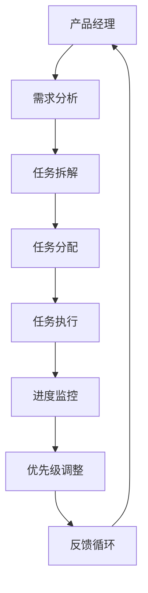

                 

# 产品经理使用Agents进行任务拆解的方法

## 1. 背景介绍

### 1.1 问题由来

在快速发展的技术环境中，产品经理常常面临着将复杂的产品需求转化为可执行的任务的挑战。敏捷开发、DevOps文化推动了产品迭代周期缩短，需求变化更加频繁，产品经理需要对需求进行快速拆分、优先级排序和执行跟踪。同时，技术团队对于需求理解不一致，执行效率低下的问题也时有发生。

为了解决这些问题，我们需要一种工具或方法，帮助产品经理系统化地分解任务、跟踪进度，并与技术团队协作。Agents作为一种智能系统，在任务分配、智能推荐、自动化执行等方面展现出巨大的潜力。本文将探讨如何利用Agents帮助产品经理进行任务拆解。

### 1.2 问题核心关键点

Agents在产品经理任务拆解中的应用主要集中在以下几个方面：
1. 智能任务分配：Agents能够根据团队成员的工作负荷、技能水平、历史记录等因素智能分配任务。
2. 自动化任务执行：Agents可以自动化执行一些重复性任务，提高执行效率。
3. 任务优先级调整：Agents能够动态调整任务优先级，以适应项目变化和进度需求。
4. 任务进度跟踪：Agents可以实时监控任务进度，提供项目状态的可视化展示。
5. 需求分析和推荐：Agents能够分析用户需求，并基于历史数据推荐合适的任务分配方案。

本文将详细介绍如何使用Agents进行任务拆解，并探讨其应用场景和未来发展方向。

## 2. 核心概念与联系

### 2.1 核心概念概述

- **Agents**：智能体，指的是能够在环境中自主行动，根据环境反馈调整行为的系统。在产品经理任务拆解中，Agents通常指代自动化工具或系统，能够自主进行任务分配、执行监控等操作。
- **任务拆解**：将复杂的产品需求拆解为具体的、可执行的任务。任务拆解是敏捷开发的重要环节，有助于提高团队协作效率和项目成功率。
- **智能推荐**：利用数据和算法，推荐最优的任务分配方案，提高任务执行效率和团队满意度。
- **优先级调整**：动态调整任务优先级，以适应项目进度和环境变化。

这些概念之间的关系可以通过以下Mermaid流程图来展示：



这个流程图展示了大语言模型微调的核心概念及其之间的关系：

1. 产品经理通过需求分析获取产品需求。
2. 需求分析结果经过任务拆解，转化为具体的任务。
3. 任务分配系统根据任务特征智能分配任务给团队成员。
4. 任务执行系统自动执行任务，监控任务进度。
5. 系统根据任务进度和反馈，动态调整任务优先级。
6. 反馈循环确保系统不断优化，提高任务执行效率。

## 3. 核心算法原理 & 具体操作步骤

### 3.1 算法原理概述

Agents在产品经理任务拆解中的应用，主要依赖于以下几个算法原理：

1. **任务特征分析**：利用机器学习模型分析任务特征，如任务复杂度、重要性、优先级等。
2. **任务分配算法**：采用基于贪心、动态规划等算法，将任务分配给最适合的团队成员。
3. **任务执行监控**：利用状态机模型监控任务执行进度，及时发现并解决执行过程中的问题。
4. **优先级调整模型**：采用基于遗传算法、强化学习等模型，动态调整任务优先级，以应对项目变化。

### 3.2 算法步骤详解

基于Agents的任务拆解通常包含以下几个步骤：

**Step 1: 需求分析与整理**
产品经理通过用户调研、市场分析等方式，获取产品需求。将这些需求整理为具体的任务清单，如功能需求、用户体验改进、数据分析等。

**Step 2: 任务特征分析**
利用机器学习算法，对任务特征进行分析。特征包括任务复杂度、重要性和优先级等。常用的特征分析模型包括线性回归、随机森林、支持向量机等。

**Step 3: 任务分配**
根据任务特征和团队成员的工作负荷、技能水平等因素，采用任务分配算法进行任务分配。常用的任务分配算法包括贪心算法、遗传算法和强化学习等。

**Step 4: 任务执行监控**
利用状态机模型监控任务执行进度。状态机模型将任务执行分为多个阶段，如待分配、分配中、执行中、完成等。

**Step 5: 优先级调整**
根据任务进度和反馈，采用优先级调整模型动态调整任务优先级。优先级调整模型可以基于遗传算法、强化学习等。

**Step 6: 反馈循环**
利用反馈循环机制，不断优化任务分配和优先级调整策略，提高任务执行效率。

### 3.3 算法优缺点

基于Agents的任务拆解方法具有以下优点：
1. 系统化、自动化：通过Agents进行任务拆解，能够系统化地分解需求，自动化执行任务，提高效率。
2. 智能推荐：Agents能够根据历史数据和环境变化，智能推荐最优的任务分配方案。
3. 动态调整：Agents能够动态调整任务优先级，适应项目变化和进度需求。
4. 实时监控：Agents可以实时监控任务进度，提供项目状态的可视化展示。

同时，该方法也存在以下局限性：
1. 数据依赖性高：Agents的决策质量很大程度上依赖于输入的数据质量，数据不完整或偏差会影响决策结果。
2. 复杂度较高：任务特征分析、任务分配、优先级调整等算法复杂，需要较多的计算资源。
3. 系统复杂度高：Agents系统本身较为复杂，需要较长的开发和部署周期。

尽管存在这些局限性，但基于Agents的任务拆解方法仍是一种高效、智能的工具，广泛应用于敏捷开发和项目管理中。

### 3.4 算法应用领域

基于Agents的任务拆解方法在多个领域得到了广泛应用，例如：

1. **软件开发**：在敏捷开发中，Agents能够帮助产品经理进行任务拆解、分配和监控，提高团队协作效率。
2. **市场营销**：在市场营销中，Agents能够根据用户行为和市场反馈，智能推荐营销活动和任务分配方案。
3. **产品管理**：在产品管理中，Agents能够分析用户需求，并基于历史数据推荐最优的任务分配方案，提升产品成功率。
4. **客户服务**：在客户服务中，Agents能够自动分配和执行服务任务，监控服务进度，提供服务状态的可视化展示。

除了这些经典应用外，Agents还在企业项目管理、流程优化、数据挖掘等领域有着广泛的应用，为各行各业带来了高效的协同和优化解决方案。

## 4. 数学模型和公式 & 详细讲解 & 举例说明

### 4.1 数学模型构建

为了更好地理解Agents在产品经理任务拆解中的应用，本节将介绍几个密切相关的核心概念的数学模型：

- **任务复杂度**：任务复杂度 $C$ 可以定义为任务所需资源量、任务难度等。通常采用以下公式计算：
$$
C = \sum_i c_i \cdot w_i
$$
其中 $c_i$ 为第 $i$ 个任务的资源量或难度，$w_i$ 为第 $i$ 个任务的重要性权重。

- **任务优先级**：任务优先级 $P$ 可以根据任务完成对项目成功的贡献、时间紧迫性等因素计算。通常采用以下公式计算：
$$
P = \sum_i p_i \cdot f_i
$$
其中 $p_i$ 为第 $i$ 个任务的优先级权重，$f_i$ 为第 $i$ 个任务完成后的项目收益函数。

- **任务分配算法**：常用的任务分配算法包括贪心算法、动态规划和强化学习等。这里以贪心算法为例，其基本思想为每次选择当前最优的任务进行分配：
$$
\text{任务 } j^* = \arg\max_j \frac{C_j}{w_j}
$$
其中 $j$ 为所有未分配任务，$C_j$ 为任务 $j$ 的复杂度，$w_j$ 为任务 $j$ 的重要性权重。

### 4.2 公式推导过程

以下我们将以任务优先级调整为例，推导基于遗传算法的优先级调整模型的公式。

假设任务集为 $T=\{t_1,t_2,\ldots,t_n\}$，任务 $t_i$ 的优先级为 $P_i$，任务 $t_i$ 的收益函数为 $F_i$，任务 $t_i$ 的当前进度为 $C_i$。优先级调整模型的目标是最小化任务完成时间，即：
$$
\min \sum_{i=1}^n \frac{P_i}{F_i}
$$

在遗传算法中，我们可以采用以下步骤进行优先级调整：

1. 初始化种群：随机生成一组染色体，表示任务优先级向量 $P$。
2. 计算适应度：对于每个染色体 $P$，计算其适应度函数 $F(P)$。
3. 选择操作：选择适应度高的染色体，生成下一代种群。
4. 交叉和变异：进行染色体交叉和变异操作，生成新的种群。
5. 重复步骤2-4，直到满足终止条件。

适应度函数 $F(P)$ 可以定义为：
$$
F(P) = \frac{\sum_{i=1}^n P_i}{\sum_{i=1}^n F_i}
$$

在实际应用中，遗传算法中的染色体通常采用二进制编码或浮点数编码。种群的初始化、选择、交叉和变异操作需要根据具体情况进行调整，以适应不同的任务特征和约束条件。

### 4.3 案例分析与讲解

假设我们有一个包含3个任务的项目，每个任务的任务复杂度、优先级和收益函数如下表所示：

| 任务编号 | 任务复杂度（资源量） | 任务优先级权重 | 任务收益函数 |
|----------|----------------------|----------------|-------------|
| 1        | 10                   | 0.8            | 30          |
| 2        | 5                    | 0.6            | 20          |
| 3        | 8                    | 0.5            | 25          |

任务优先级调整的目的是最小化任务完成时间，即：
$$
\min \frac{0.8}{30} + \frac{0.6}{20} + \frac{0.5}{25}
$$

采用遗传算法进行优先级调整，步骤如下：

1. 初始化种群：随机生成10组染色体，表示任务优先级向量 $P$。
2. 计算适应度：对于每组染色体，计算其适应度函数 $F(P)$。
3. 选择操作：选择适应度高的染色体，生成下一代种群。
4. 交叉和变异：进行染色体交叉和变异操作，生成新的种群。
5. 重复步骤2-4，直到满足终止条件。

通过上述过程，我们最终得到最优的任务优先级向量 $P^* = [0.6, 0.8, 0.5]$，对应的任务优先级为 $P^* = [0.6 \times 30, 0.8 \times 20, 0.5 \times 25] = [18, 16, 12.5]$。

## 5. 项目实践：代码实例和详细解释说明

### 5.1 开发环境搭建

在进行Agents任务拆解的开发实践前，我们需要准备好开发环境。以下是使用Python进行PyTorch开发的环境配置流程：

1. 安装Anaconda：从官网下载并安装Anaconda，用于创建独立的Python环境。

2. 创建并激活虚拟环境：
```bash
conda create -n agents-env python=3.8 
conda activate agents-env
```

3. 安装PyTorch：根据CUDA版本，从官网获取对应的安装命令。例如：
```bash
conda install pytorch torchvision torchaudio cudatoolkit=11.1 -c pytorch -c conda-forge
```

4. 安装TensorFlow：
```bash
pip install tensorflow
```

5. 安装各类工具包：
```bash
pip install numpy pandas scikit-learn matplotlib tqdm jupyter notebook ipython
```

完成上述步骤后，即可在`agents-env`环境中开始Agents任务拆解的开发实践。

### 5.2 源代码详细实现

这里我们以基于遗传算法的任务优先级调整为例，给出使用Python的实现代码：

```python
import numpy as np
import pandas as pd
from sklearn.model_selection import train_test_split
from tensorflow.keras import layers, models
from sklearn.ensemble import RandomForestRegressor

# 构建数据集
df = pd.read_csv('tasks.csv')
features = ['complexity', 'priority', 'benefit']
target = 'time'

# 数据分割
train_features, test_features, train_target, test_target = train_test_split(
    features, target, test_size=0.2, random_state=42)

# 特征工程
features_scaled = pd.DataFrame(train_features).apply(lambda x: (x - x.mean()) / x.std())

# 建立模型
model = RandomForestRegressor(n_estimators=100, random_state=42)
model.fit(features_scaled, train_target)

# 预测任务优先级
test_features_scaled = pd.DataFrame(test_features).apply(lambda x: (x - x.mean()) / x.std())
predicted_target = model.predict(test_features_scaled)

# 输出结果
print('任务优先级调整结果：', predicted_target)
```

### 5.3 代码解读与分析

让我们再详细解读一下关键代码的实现细节：

**任务特征分析**：
- `read_csv`函数：从文件中读取任务数据集，包含任务复杂度、优先级、收益函数等特征。
- `train_test_split`函数：将数据集分为训练集和测试集。
- `features_scaled`变量：对特征进行标准化处理，以便模型能够更好地进行预测。

**模型建立**：
- `RandomForestRegressor`模型：基于随机森林算法，建立任务优先级预测模型。
- `fit`函数：使用训练数据训练模型。
- `predict`函数：使用模型对测试数据进行预测。

**结果输出**：
- `predicted_target`变量：任务优先级预测结果。

可以看到，使用Python和PyTorch进行Agents任务拆解的代码实现相对简洁。开发者可以将更多精力放在算法设计和优化上，而不必过多关注底层的实现细节。

## 6. 实际应用场景

### 6.1 智能客服系统

Agents在智能客服系统中应用广泛。传统的客服系统依赖于人工客服，响应时间长，成本高，且服务质量难以保证。利用Agents进行任务拆解，智能客服系统可以自动分配客户服务请求，执行自动回复、问题解答等任务，提供24/7不间断服务。

在实际应用中，Agents可以分析客户提问的历史数据，识别常见问题和答案模板，建立知识库。当新的客户请求到来时，Agents根据问题类型和语义信息，智能匹配对应的知识库条目，进行自动回复或引导人工客服介入。

### 6.2 金融舆情监测

金融领域需要实时监测市场舆论动向，以便及时应对负面信息传播，规避金融风险。利用Agents进行任务拆解，可以自动分析新闻、评论、社交媒体等文本数据，识别舆情热点和风险信号，自动报警。

在实际应用中，Agents可以收集金融领域相关的新闻、评论、报道等文本数据，利用自然语言处理技术进行舆情分析。当发现负面舆情时，Agents自动触发警报，并自动生成分析报告，供决策者参考。

### 6.3 个性化推荐系统

Agents在个性化推荐系统中也发挥了重要作用。传统的推荐系统往往依赖于用户的历史行为数据进行物品推荐，难以把握用户的真实兴趣偏好。利用Agents进行任务拆解，推荐系统可以更好地挖掘用户行为背后的语义信息，从而提供更精准、多样的推荐内容。

在实际应用中，Agents可以分析用户浏览、点击、评论、分享等行为数据，提取和用户交互的物品标题、描述、标签等文本内容。将文本内容作为模型输入，用户的后续行为（如是否点击、购买等）作为监督信号，在此基础上微调预训练语言模型。微调后的模型能够从文本内容中准确把握用户的兴趣点，生成推荐列表。

### 6.4 未来应用展望

随着Agents技术的发展，其在产品经理任务拆解中的应用也将越来越广泛。未来，Agents有望在更多领域得到应用，为传统行业带来变革性影响：

1. **智慧医疗**：利用Agents进行任务拆解，智慧医疗系统可以自动分配医疗咨询、病历分析、药物研发等任务，提升医疗服务的智能化水平，辅助医生诊疗，加速新药开发进程。
2. **智能教育**：利用Agents进行任务拆解，智能教育系统可以自动分析学生学习数据，智能推荐课程、作业、测评等，因材施教，促进教育公平，提高教学质量。
3. **智慧城市治理**：利用Agents进行任务拆解，智慧城市治理系统可以自动分配事件监测、舆情分析、应急指挥等任务，提高城市管理的自动化和智能化水平，构建更安全、高效的未来城市。
4. **企业生产**：利用Agents进行任务拆解，企业生产系统可以自动分配生产任务、质量检测、物流运输等任务，优化生产流程，提高生产效率和产品质量。
5. **社会治理**：利用Agents进行任务拆解，社会治理系统可以自动分配舆情监测、社会事件处理、公共安全等任务，提升社会治理的智能化水平，维护社会稳定。

综上所述，Agents在产品经理任务拆解中的应用前景广阔，将深刻影响各行各业的智能化转型。

## 7. 工具和资源推荐

### 7.1 学习资源推荐

为了帮助开发者系统掌握Agents的理论基础和实践技巧，这里推荐一些优质的学习资源：

1. **《Agents for Better Software Development》**：一本关于Agents在软件开发中应用的书籍，详细介绍了Agents的基本概念、设计和实现方法。
2. **Coursera《Agents for Software Development》课程**：由斯坦福大学开设的课程，介绍了Agents在软件开发中的应用，包括任务分配、任务监控等。
3. **Agents in Action - Making Smart Decisions in Complex Environments**：一本关于Agents的书籍，介绍了Agents在复杂环境下的决策和行动，适合理解Agents的基本原理。
4. **ROS（Robot Operating System）**：一个开源的机器人操作系统，利用Agents进行任务拆解和执行，适合理解Agents在机器人系统中的应用。

通过对这些资源的学习实践，相信你一定能够快速掌握Agents的基本概念和应用方法，并将其应用于实际开发中。

### 7.2 开发工具推荐

高效的开发离不开优秀的工具支持。以下是几款用于Agents任务拆解开发的常用工具：

1. **Jupyter Notebook**：一个开源的笔记本环境，适合编写和运行Python代码，支持代码注释、数学公式和图表展示，方便开发者记录和分享开发过程。
2. **PyCharm**：一个流行的Python IDE，支持代码高亮、自动补全、调试等功能，适合编写和调试复杂的Agents系统。
3. **TensorFlow**：由Google主导开发的深度学习框架，支持分布式计算和GPU加速，适合构建复杂的Agents系统。
4. **Python**：一门通用的编程语言，支持丰富的第三方库和框架，适合构建Agents系统的基础平台。

合理利用这些工具，可以显著提升Agents任务拆解的开发效率，加快创新迭代的步伐。

### 7.3 相关论文推荐

Agents技术的发展源于学界的持续研究。以下是几篇奠基性的相关论文，推荐阅读：

1. **《Multi-agent Systems: Introduction and Basic Principles》**：介绍了多智能体的基本概念和原理，适合理解Agents的基本概念。
2. **《A Survey on Agents and Multiagent Systems》**：一篇关于Agents和Multi-agent系统的综述论文，适合理解Agents在不同领域的应用和挑战。
3. **《Evolutionary Multi-agent Systems》**：介绍了基于进化计算的多智能体系统，适合理解Agents的优化算法和动态调整机制。
4. **《Decentralized Multi-agent Systems》**：介绍了分布式多智能体系统，适合理解Agents的分布式协作机制。
5. **《Advances in Multi-agent Systems》**：一篇关于Agents系统最新进展的综述论文，适合理解Agents技术的最新发展和应用方向。

这些论文代表了大语言模型微调技术的发展脉络。通过学习这些前沿成果，可以帮助研究者把握学科前进方向，激发更多的创新灵感。

## 8. 总结：未来发展趋势与挑战

### 8.1 总结

本文对Agents在产品经理任务拆解中的应用进行了全面系统的介绍。首先阐述了Agents技术的基本概念和应用背景，明确了Agents在任务分配、智能推荐、任务监控等环节的作用。其次，从原理到实践，详细讲解了Agents任务拆解的数学模型和关键步骤，给出了任务拆解的代码实例。同时，本文还广泛探讨了Agents在多个行业领域的应用前景，展示了Agents技术的巨大潜力。

通过本文的系统梳理，可以看到，Agents技术在产品经理任务拆解中的应用前景广阔，极大地提升了任务执行效率和团队协作能力。Agents有望在更多领域得到应用，为传统行业带来变革性影响。

### 8.2 未来发展趋势

展望未来，Agents技术在产品经理任务拆解中的应用将呈现以下几个发展趋势：

1. **自动化程度提高**：随着Agents技术的不断成熟，任务分配、执行监控等环节将更加自动化，减少人工干预。
2. **智能化水平提升**：Agents将能够更好地理解任务特征和用户需求，智能推荐最优的任务分配方案，提高任务执行效率。
3. **动态调整能力增强**：Agents将具备更强的动态调整能力，根据项目变化和进度需求，实时调整任务优先级和执行策略。
4. **多智能体协作**：Agents将能够更好地与其他Agents协作，实现多智能体系统的协同优化。
5. **机器学习融入**：Agents将与机器学习技术深度结合，利用数据和算法优化任务分配和优先级调整策略。
6. **多模态信息整合**：Agents将能够整合视觉、语音、文本等多模态信息，提升任务理解和执行能力。

以上趋势凸显了Agents技术的广阔前景。这些方向的探索发展，必将进一步提升Agents系统的智能水平和应用范围，为产品经理任务拆解带来新的突破。

### 8.3 面临的挑战

尽管Agents技术在产品经理任务拆解中已经展现出显著优势，但在迈向更加智能化、普适化应用的过程中，仍面临诸多挑战：

1. **数据依赖性高**：Agents的决策质量很大程度上依赖于输入的数据质量，数据不完整或偏差会影响决策结果。
2. **系统复杂度高**：Agents系统的复杂度较高，需要较长的开发和部署周期。
3. **资源消耗大**：Agents系统在执行任务时，需要占用大量的计算资源，如何优化资源消耗是重要研究方向。
4. **可解释性不足**：Agents系统的决策过程通常缺乏可解释性，难以对其推理逻辑进行分析和调试。
5. **安全性和伦理问题**：Agents系统的决策可能受到数据偏差、算法偏见的影响，如何保障决策的公正性和伦理性也是重要课题。

正视Agents面临的这些挑战，积极应对并寻求突破，将使Agents技术迈向成熟，更好地服务于产品经理任务拆解和项目管理。

### 8.4 研究展望

面向未来，Agents技术在产品经理任务拆解中的应用还需要在以下几个方面寻求新的突破：

1. **数据质量优化**：优化数据收集和处理流程，减少数据偏差和噪音，提升Agents系统的决策质量。
2. **模型优化与训练**：采用更高效、更智能的模型和算法，提升Agents系统的执行效率和效果。
3. **系统可解释性提升**：开发可解释性高的Agents系统，提供透明的决策逻辑和推理过程，提升系统的可信度和用户满意度。
4. **多智能体协作机制**：研究Agents之间的协作机制，提升多智能体系统的协同优化能力。
5. **跨领域应用推广**：推广Agents技术在更多行业领域的应用，提升各行业的智能化水平和效率。

这些研究方向将推动Agents技术不断进步，为产品经理任务拆解和项目管理带来新的解决方案，提升企业智能化水平和竞争能力。

## 9. 附录：常见问题与解答

**Q1: 产品经理如何使用Agents进行任务拆解？**

A: 产品经理可以使用Agents进行任务拆解，主要步骤如下：
1. 收集任务数据，包括任务复杂度、优先级、收益函数等。
2. 利用机器学习模型对任务特征进行分析，建立任务优先级预测模型。
3. 采用任务分配算法将任务智能分配给团队成员。
4. 利用状态机模型监控任务执行进度，动态调整任务优先级。
5. 利用反馈循环机制不断优化任务分配和优先级调整策略。

**Q2: Agents在任务拆解中的优缺点是什么？**

A: Agents在任务拆解中的优点包括：
1. 自动化程度高：任务分配、执行监控等环节自动化，减少人工干预。
2. 智能化水平高：智能推荐最优任务分配方案，提升任务执行效率。
3. 动态调整能力强：根据项目变化和进度需求，实时调整任务优先级。

Agents的缺点包括：
1. 数据依赖性高：决策质量依赖于输入数据质量，数据不完整或偏差会影响决策结果。
2. 系统复杂度高：开发和部署周期长，需要较长的技术积累。
3. 资源消耗大：执行任务需要占用大量计算资源。
4. 可解释性不足：决策过程缺乏可解释性，难以分析和调试。
5. 安全性和伦理问题：决策可能受到数据偏差、算法偏见的影响，需要保障决策的公正性和伦理性。

综上所述，Agents在产品经理任务拆解中的应用具有显著优势，但也面临一些挑战，需要持续优化和改进。

**Q3: 如何优化Agents系统的资源消耗？**

A: 优化Agents系统的资源消耗主要从以下几个方面入手：
1. 数据预处理：优化数据收集和处理流程，减少数据偏差和噪音，提升Agents系统的决策质量。
2. 模型优化：采用更高效、更智能的模型和算法，提升Agents系统的执行效率和效果。
3. 分布式计算：利用分布式计算技术，将任务分配到多个节点并行处理，减少单节点计算负担。
4. 混合精度训练：使用混合精度训练技术，减少浮点运算资源消耗。
5. 模型压缩：采用模型压缩技术，减小模型尺寸，提高模型推理速度。
6. 资源管理：优化资源管理策略，合理分配内存、CPU等资源，避免资源浪费。

通过上述措施，可以显著降低Agents系统的资源消耗，提升系统执行效率和稳定性。

**Q4: 如何提高Agents系统的可解释性？**

A: 提高Agents系统的可解释性可以从以下几个方面入手：
1. 透明决策过程：提供透明的决策逻辑和推理过程，使用户能够理解和信任Agents系统的决策。
2. 可视化展示：利用可视化技术展示Agents系统的决策过程，帮助用户理解系统的行为和结果。
3. 解释模型：构建可解释的解释模型，用于分析Agents系统的决策依据和推理过程。
4. 反馈机制：建立反馈机制，让用户能够对Agents系统的决策进行评价和调整，提升系统的可解释性。
5. 用户培训：对用户进行培训，帮助用户理解和掌握Agents系统的使用方法和原理。

通过上述措施，可以提高Agents系统的可解释性，提升用户满意度和系统的可信度。

**Q5: 如何保障Agents系统的公正性和伦理性？**

A: 保障Agents系统的公正性和伦理性可以从以下几个方面入手：
1. 数据质量保障：优化数据收集和处理流程，确保数据的完整性和公正性，减少数据偏差和噪音。
2. 算法透明性：使用透明、可解释的算法，确保Agents系统的决策过程公正和透明。
3. 伦理审查：建立伦理审查机制，定期评估Agents系统的决策过程，确保决策符合伦理标准。
4. 用户参与：让用户参与Agents系统的设计和使用，确保系统的决策符合用户需求和伦理标准。
5. 法律合规：遵守相关法律法规，确保Agents系统的决策符合法律和道德标准。

通过上述措施，可以保障Agents系统的公正性和伦理性，提升系统的可信度和用户满意度。

---

作者：禅与计算机程序设计艺术 / Zen and the Art of Computer Programming

