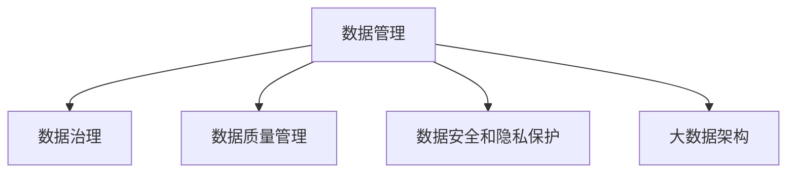

                 

# 人工智能创业数据管理的最佳实践

## 1. 背景介绍

随着人工智能(AI)技术的快速发展，数据已经成为AI创业公司最核心且最有价值的资产之一。数据的收集、存储、处理和分析，直接决定了AI模型的性能和应用效果。因此，如何高效管理数据，实现数据驱动的AI创新，是所有AI创业公司面临的重大挑战。本文旨在系统介绍AI创业公司数据管理的最佳实践，帮助创业者更好地利用数据资源，推动AI技术的落地应用。

## 2. 核心概念与联系

### 2.1 核心概念概述

为更好地理解AI创业公司数据管理的最佳实践，本节将介绍几个密切相关的核心概念：

- **数据管理(Data Management)**：指对数据的收集、存储、清洗、处理和分析过程进行全面规划和组织，以确保数据的质量、安全性和可用性。
- **数据治理(Data Governance)**：涉及数据管理的政策和流程，确保数据符合法规、标准和业务目标。
- **数据质量管理(Data Quality Management)**：通过数据清洗、校验、验证等手段，提高数据准确性和一致性，确保数据可靠性。
- **数据安全和隐私保护**：采取技术和管理措施，防止数据泄露和滥用，保护数据隐私和安全性。
- **大数据架构(Big Data Architecture)**：构建能够高效处理、存储和分析大规模数据的技术体系，如Hadoop、Spark等。

这些核心概念之间的逻辑关系可以通过以下Mermaid流程图来展示：



这个流程图展示了大规模数据管理的核心组成部分及其之间的关系：

1. 数据管理是整个数据治理的基础，涉及数据的收集、存储、处理和分析。
2. 数据治理通过政策和管理手段，确保数据管理流程符合法规和业务目标。
3. 数据质量管理通过技术手段，提升数据的质量和可靠性。
4. 数据安全和隐私保护是数据管理的核心保障，确保数据安全无虞。
5. 大数据架构提供了高效处理和分析大规模数据的技术支持。

## 3. 核心算法原理 & 具体操作步骤
### 3.1 算法原理概述

AI创业公司数据管理的核心目标是构建高效、安全、可扩展的数据管理体系，以支持AI模型的训练、评估和部署。其基本流程包括数据收集、数据清洗、模型训练、模型评估和部署，最终实现数据驱动的AI创新。

数据管理流程的核心在于数据流的管理和数据流的安全。数据流是指数据的收集、存储、传输和处理过程，数据流管理涉及数据流的监控、调度、优化和控制。数据流安全的核心在于确保数据在各环节中不泄露、不篡改、不被未经授权访问。

### 3.2 算法步骤详解

#### 3.2.1 数据收集与管理

- **数据来源选择**：根据业务需求，选择合适的数据来源，如传感器数据、网络日志、社交媒体数据等。
- **数据清洗**：清洗数据中的噪声、缺失值、异常值，确保数据质量。
- **数据标准化**：对不同来源的数据进行统一格式和标准，以便后续处理和分析。

#### 3.2.2 数据存储与处理

- **数据存储**：选择合适的存储系统，如关系型数据库、NoSQL数据库、云存储等。
- **数据处理**：利用分布式计算框架（如Hadoop、Spark）进行数据处理和分析，构建大数据平台。
- **数据挖掘**：应用机器学习和深度学习技术，进行数据挖掘和特征提取。

#### 3.2.3 模型训练与评估

- **数据划分**：将数据集划分为训练集、验证集和测试集。
- **模型训练**：使用训练集训练AI模型，并进行超参数调优。
- **模型评估**：在验证集上评估模型性能，根据性能指标进行模型选择。

#### 3.2.4 模型部署与应用

- **模型集成**：将训练好的模型集成到实际应用系统中。
- **模型监控**：实时监控模型性能，确保模型稳定运行。
- **模型优化**：根据监控结果，持续优化模型参数和应用配置。

### 3.3 算法优缺点

数据管理基于监督学习的AI创业公司数据管理方法具有以下优点：

1. **高效性**：利用分布式计算和大数据平台，能够高效处理大规模数据。
2. **可扩展性**：通过云存储和弹性计算，支持大规模数据存储和处理。
3. **数据质量保证**：通过数据清洗和校验，提高数据准确性和一致性。
4. **灵活性**：能够适应不同数据来源和数据类型的处理需求。
5. **安全性**：采用数据加密和访问控制等措施，确保数据安全无虞。

但该方法也存在以下局限性：

1. **成本高**：建设和管理大数据平台需要较高的技术投入和资金成本。
2. **复杂性高**：大规模数据处理和管理涉及复杂的技术体系和流程。
3. **数据依赖**：模型效果高度依赖于数据的质量和数量。
4. **动态变化**：数据来源和数据分布可能随时间变化，需要持续监测和优化。

尽管存在这些局限性，但数据管理仍是AI创业公司实现数据驱动的AI创新的基础。在实际应用中，需要根据具体需求和资源情况，选择合适的方法和工具，进行灵活的优化和调整。

### 3.4 算法应用领域

数据管理方法在AI创业公司中广泛应用，特别是在以下几个领域：

- **金融科技(Fintech)**：利用大数据分析客户行为，提供个性化的金融服务，如信用评分、欺诈检测、智能投顾等。
- **健康医疗**：通过分析医疗数据，进行疾病预测、个性化治疗、医疗影像分析等。
- **智能制造**：利用工业物联网数据，进行设备监控、故障预测、质量控制等。
- **智能交通**：分析交通数据，优化交通管理、预测交通流量、提升交通安全等。
- **零售电商**：通过分析用户行为和市场数据，进行商品推荐、库存管理、市场预测等。

这些领域的数据管理需求多样且复杂，需要综合考虑数据来源、数据类型、数据量等因素，构建高效、安全的数据管理体系。

## 4. 数学模型和公式 & 详细讲解 & 举例说明
### 4.1 数学模型构建

假设数据管理涉及的数据集为 $D=\{(x_i,y_i)\}_{i=1}^N$，其中 $x_i$ 为输入，$y_i$ 为输出。数据管理的核心目标是优化数据处理流程，确保数据的质量和安全性。

定义数据管理的目标函数为 $\mathcal{L}(D)=\sum_{i=1}^N f(x_i,y_i)$，其中 $f$ 为数据处理函数。目标函数最小化数据处理过程中的损失，即：

$$
\min_{\theta} \mathcal{L}(D)
$$

其中 $\theta$ 为数据处理模型参数。

### 4.2 公式推导过程

假设数据管理的目标函数为 $f(x,y)=\|x-y\|^2$，表示数据处理过程中的误差。目标函数的最小化可以转化为以下优化问题：

$$
\min_{\theta} \sum_{i=1}^N \|x_i - y_i\|^2
$$

通过对目标函数求导，得到数据处理模型的梯度更新公式：

$$
\theta \leftarrow \theta - \eta \nabla_{\theta} \mathcal{L}(D)
$$

其中 $\eta$ 为学习率，$\nabla_{\theta} \mathcal{L}(D)$ 为数据处理模型的梯度，可通过反向传播算法高效计算。

### 4.3 案例分析与讲解

以智能交通数据管理为例，分析如何通过数据管理提高交通管理效率。

智能交通涉及大量的车辆、交通信号、摄像头等传感器数据，数据量大且分布广泛。数据管理的目标是通过高效处理和分析这些数据，实现交通流量预测、交通信号优化、事故预测等功能。

- **数据收集**：通过车辆传感器、交通摄像头等设备，收集交通流量、速度、事故等数据。
- **数据清洗**：去除噪声、缺失值，校正异常数据，确保数据准确性。
- **数据存储**：利用云存储系统，将数据集中存储和管理。
- **数据处理**：应用大数据平台进行实时处理和分析，提取交通流量、速度、事故等关键特征。
- **模型训练**：利用历史交通数据训练预测模型，进行交通流量预测、事故预测等功能。
- **模型评估**：在测试集上评估模型性能，根据性能指标进行模型选择和优化。
- **模型部署**：将训练好的模型集成到交通管理系统，进行实时监控和优化。

通过这一系列步骤，可以构建高效、安全、可扩展的智能交通数据管理体系，提升交通管理的智能化水平。

## 5. 项目实践：代码实例和详细解释说明
### 5.1 开发环境搭建

在进行数据管理实践前，我们需要准备好开发环境。以下是使用Python进行Hadoop开发的环境配置流程：

1. 安装Java：由于Hadoop是用Java编写的，因此需要安装Java运行环境（JDK）。可以从Oracle官网或OpenJDK官网下载安装。

2. 安装Hadoop：可以从Hadoop官网下载安装最新版本，也可以从源码安装。

3. 配置Hadoop环境：修改`hadoop-env.sh`和`hadoop-defaults.sh`文件，设置Hadoop运行环境，包括Hadoop的安装目录、Java路径等。

4. 启动Hadoop：执行`start-hadoop.sh`脚本启动Hadoop集群，验证Hadoop是否正常运行。

5. 安装Hive：Hive是基于Hadoop的数据仓库工具，可以从Hive官网下载安装，或者使用预编译包。

6. 配置Hive环境：修改`hive-env.sh`和`hive-configuration.properties`文件，设置Hive运行环境，包括Hive的安装目录、JDBC路径等。

7. 启动Hive：执行`start-hive.sh`脚本启动Hive服务，验证Hive是否正常运行。

完成上述步骤后，即可在Hadoop环境中进行数据管理项目的开发。

### 5.2 源代码详细实现

这里我们以智能交通数据管理为例，给出使用Hadoop进行数据处理的PyTorch代码实现。

首先，定义数据处理的函数：

```python
import hdfs
import numpy as np
from pyspark.sql import SparkSession

def process_data(hdfs_path, output_path):
    # 从HDFS中读取数据
    rdd = hdfs.read_data(hdfs_path)
    
    # 进行数据清洗
    cleaned_data = rdd.filter(lambda x: not np.isnan(x))  # 过滤掉缺失值
    
    # 进行数据标准化
    normalized_data = cleaned_data.map(lambda x: (x[0], x[1] - np.mean(x[1])), 
                                     lambda x: (x[0], x[1] - np.std(x[1])))  # 标准化
    
    # 将数据写入HDFS
    hdfs.write_data(normalized_data, output_path)
```

然后，使用Hive对数据进行分布式处理：

```python
import pyspark.sql.functions as F

# 创建SparkSession
spark = SparkSession.builder.appName("traffic_data_processing").getOrCreate()

# 从HDFS中读取数据
data = spark.read.csv('hdfs://<HDFS_URL>/traffic_data.csv', header=True, inferSchema=True)

# 进行数据清洗
cleaned_data = data.dropna()

# 进行数据标准化
normalized_data = cleaned_data.select(F.col("timestamp").as("timestamp"), 
                                    F.col("speed").as("speed").over(F.windows("timestamp", size=5, offset=1)).avg() - F.col("speed"))  # 5秒窗口移动平均

# 将数据写入HDFS
normalized_data.write.csv("hdfs://<HDFS_URL>/traffic_data_normalized", header=True, mode='overwrite')
```

最后，进行模型训练和评估：

```python
# 使用训练集训练模型
training_data = spark.read.csv('hdfs://<HDFS_URL>/traffic_data_normalized', header=True, inferSchema=True)
model = build_model(training_data)

# 使用测试集评估模型
testing_data = spark.read.csv('hdfs://<HDFS_URL>/testing_data.csv', header=True, inferSchema=True)
evaluate_model(model, testing_data)
```

以上就是使用Hadoop进行智能交通数据处理的完整代码实现。可以看到，Hadoop和Spark等大数据平台提供了强大的数据处理能力，可以高效处理大规模数据。

### 5.3 代码解读与分析

让我们再详细解读一下关键代码的实现细节：

**process_data函数**：
- `hdfs.read_data`：从HDFS中读取数据。
- `rdd.filter`：过滤掉缺失值。
- `rdd.map`：进行数据标准化，使用平均值和标准差进行标准化处理。
- `hdfs.write_data`：将处理后的数据写入HDFS。

**Spark处理代码**：
- `spark.read.csv`：从HDFS中读取数据。
- `data.dropna`：过滤掉缺失值。
- `data.select`：应用窗口函数进行数据标准化，计算5秒窗口内的移动平均。
- `data.write.csv`：将处理后的数据写入HDFS。

**模型训练和评估代码**：
- `build_model`：使用训练集训练模型。
- `evaluate_model`：在测试集上评估模型性能。

可以看到，通过Hadoop和Spark等大数据平台，可以高效处理和分析大规模数据，为数据驱动的AI创新提供坚实的基础。

## 6. 实际应用场景

### 6.1 智能交通

智能交通涉及大量的车辆、交通信号、摄像头等传感器数据，数据量大且分布广泛。数据管理的目标是通过高效处理和分析这些数据，实现交通流量预测、交通信号优化、事故预测等功能。

在实际应用中，可以通过Hadoop和Spark等大数据平台，将交通数据进行分布式处理和分析，提取交通流量、速度、事故等关键特征，并利用机器学习和深度学习技术，进行交通流量预测、事故预测等功能。通过构建高效、安全、可扩展的智能交通数据管理体系，可以大幅提升交通管理的智能化水平。

### 6.2 智能制造

智能制造涉及大量的设备、生产线、传感器等数据，数据量大且类型多样。数据管理的目标是通过高效处理和分析这些数据，实现设备监控、故障预测、质量控制等功能。

在实际应用中，可以利用Hadoop和Spark等大数据平台，对制造数据进行分布式处理和分析，提取设备状态、生产数据、质量数据等关键特征，并利用机器学习和深度学习技术，进行设备监控、故障预测、质量控制等功能。通过构建高效、安全、可扩展的智能制造数据管理体系，可以提升制造企业的智能化水平，降低生产成本，提高生产效率。

### 6.3 金融科技

金融科技涉及大量的交易数据、用户行为数据、市场数据等，数据量大且实时性要求高。数据管理的目标是通过高效处理和分析这些数据，实现客户行为分析、信用评分、欺诈检测等功能。

在实际应用中，可以利用Hadoop和Spark等大数据平台，对金融数据进行分布式处理和分析，提取交易数据、用户行为数据、市场数据等关键特征，并利用机器学习和深度学习技术，进行客户行为分析、信用评分、欺诈检测等功能。通过构建高效、安全、可扩展的金融科技数据管理体系，可以提高金融服务的智能化水平，提升客户体验，降低欺诈风险。

### 6.4 未来应用展望

随着大数据技术的发展，数据管理方法将在更多领域得到应用，为各行各业带来变革性影响。

在智慧医疗领域，大数据分析可以帮助医生进行疾病预测、个性化治疗、医疗影像分析等，提升医疗服务的智能化水平，辅助医生诊疗，加速新药开发进程。

在智能教育领域，大数据分析可以用于学情分析、知识推荐、作业批改等功能，因材施教，促进教育公平，提高教学质量。

在智慧城市治理中，大数据分析可以用于城市事件监测、舆情分析、应急指挥等环节，提高城市管理的自动化和智能化水平，构建更安全、高效的未来城市。

此外，在企业生产、社会治理、文娱传媒等众多领域，大数据分析也将不断涌现，为传统行业数字化转型升级提供新的技术路径。

## 7. 工具和资源推荐
### 7.1 学习资源推荐

为了帮助开发者系统掌握数据管理的技术基础和实践技巧，这里推荐一些优质的学习资源：

1. 《大数据技术与应用》系列书籍：系统介绍大数据技术的基本概念和实践方法，包括Hadoop、Spark、Hive等。
2. Coursera《大数据与Hadoop基础》课程：由斯坦福大学教授讲授，涵盖大数据技术的基本原理和实践操作。
3. Hadoop官网文档：Hadoop的官方文档，提供详细的安装、配置和使用指南。
4. Hive官方文档：Hive的官方文档，提供详细的安装、配置和使用指南。
5. 大数据技术博客：如DataTalks、Big Data Insight等，提供最新的大数据技术动态和实践案例。

通过对这些资源的学习实践，相信你一定能够快速掌握数据管理的关键技术和实践方法，并将其应用到实际的AI创新项目中。

### 7.2 开发工具推荐

高效的开发离不开优秀的工具支持。以下是几款用于数据管理开发的常用工具：

1. Hadoop：Apache开源的大数据处理框架，适合大规模数据处理和分析。
2. Spark：基于内存计算的大数据处理框架，支持分布式计算和实时数据处理。
3. Hive：基于Hadoop的数据仓库工具，提供丰富的SQL查询接口，适合数据清洗和分析。
4. Hdfs：Hadoop分布式文件系统，支持大规模数据的存储和访问。
5. Elasticsearch：基于分布式内存的搜索引擎，适合大规模数据的检索和分析。
6. TensorBoard：TensorFlow配套的可视化工具，可实时监测模型训练状态，并提供丰富的图表呈现方式。

合理利用这些工具，可以显著提升数据管理任务的开发效率，加快创新迭代的步伐。

### 7.3 相关论文推荐

数据管理和大数据技术的发展源于学界的持续研究。以下是几篇奠基性的相关论文，推荐阅读：

1. MapReduce: Simplified Data Processing on Large Clusters：介绍MapReduce计算模型，奠定了分布式计算的基础。
2. Hadoop: The Next Generation of Distributed Storage and Computing：介绍Hadoop分布式文件系统和大数据处理框架。
3. Spark: Cluster Computing with Fault Tolerance：介绍Spark计算框架，展示了大数据处理的新思路。
4. Hive: A Portable, Extensible Hadoop SQL：介绍Hive数据仓库工具，展示了分布式SQL处理的新方法。
5. Big Data Architectures for Big Data Analytics：综述大数据架构的研究进展，为大数据处理提供理论基础。

这些论文代表了大数据技术的发展脉络。通过学习这些前沿成果，可以帮助研究者把握学科前进方向，激发更多的创新灵感。

## 8. 总结：未来发展趋势与挑战
### 8.1 总结

本文对AI创业公司数据管理的最佳实践进行了全面系统的介绍。首先阐述了数据管理在AI创业公司中的重要性，明确了数据管理流程的目标和关键环节。其次，从原理到实践，详细讲解了数据管理的数学模型和操作步骤，给出了数据管理任务开发的完整代码实例。同时，本文还广泛探讨了数据管理方法在多个行业领域的应用前景，展示了数据管理的巨大潜力。

通过本文的系统梳理，可以看到，数据管理是大规模AI创业公司实现数据驱动的AI创新的基础。数据管理的核心在于高效、安全、可扩展的数据管理体系，以支持AI模型的训练、评估和部署。

### 8.2 未来发展趋势

展望未来，数据管理方法将呈现以下几个发展趋势：

1. 数据源多样化：未来数据管理将更多地利用云数据、物联网数据、社交媒体数据等多样化的数据源，构建更加全面、动态的数据管理体系。
2. 数据处理实时化：随着实时计算和大数据技术的发展，数据管理将更加注重实时处理和分析，支持实时决策和监控。
3. 数据融合智能化：数据管理将更多地利用AI和机器学习技术，进行数据融合和智能分析，提升数据管理的智能化水平。
4. 数据隐私保护加强：数据管理的核心在于保护数据隐私和安全性，未来将更多地引入隐私计算和联邦学习技术，确保数据隐私保护。
5. 数据治理规范化和标准化：数据管理的核心在于规范和标准化数据管理流程，未来将更多地引入数据治理工具和方法，提升数据管理的规范性和可维护性。

以上趋势凸显了数据管理技术的广阔前景。这些方向的探索发展，必将进一步提升数据管理的效率和安全性，为AI创业公司提供更加可靠的数据支持。

### 8.3 面临的挑战

尽管数据管理技术已经取得了显著进展，但在迈向更加智能化、普适化应用的过程中，仍面临诸多挑战：

1. 数据质量问题：数据管理的首要任务是确保数据质量，但数据来源多样，数据格式和质量各异，数据清洗和校验工作量大。
2. 数据存储和管理：大规模数据存储和管理需要高性能的存储和计算资源，成本高，维护复杂。
3. 数据实时处理：实时数据处理需要高效的技术架构和算法支持，存在一定的技术挑战。
4. 数据隐私和安全：数据管理和隐私保护存在矛盾，如何在保护数据隐私的同时，确保数据可用性，是一个重要问题。
5. 数据治理规范：数据治理需要引入规范和标准，但不同行业、不同企业的数据治理需求各异，缺乏统一的规范和标准。

尽管存在这些挑战，但数据管理仍是AI创业公司实现数据驱动的AI创新的基础。在实际应用中，需要根据具体需求和资源情况，选择合适的方法和工具，进行灵活的优化和调整。

### 8.4 研究展望

面对数据管理所面临的种种挑战，未来的研究需要在以下几个方面寻求新的突破：

1. 引入先进的AI和机器学习技术，提升数据处理和分析的智能化水平。
2. 开发更加高效、可靠、可扩展的数据管理框架和技术体系。
3. 引入隐私计算和联邦学习技术，确保数据隐私和安全。
4. 引入数据治理工具和方法，提升数据管理的规范性和可维护性。
5. 结合大数据和AI技术，构建高效、安全、可扩展的数据管理体系。

这些研究方向的探索，必将引领数据管理技术迈向更高的台阶，为AI创业公司提供更加可靠的数据支持，推动AI技术的落地应用。

## 9. 附录：常见问题与解答

**Q1：数据管理过程中如何确保数据质量？**

A: 数据质量管理是数据管理的核心环节，通过数据清洗、校验、验证等手段，提高数据准确性和一致性，确保数据可靠性。具体措施包括：

1. 数据清洗：去除噪声、缺失值、异常值等数据异常点。
2. 数据标准化：统一数据格式和标准，确保数据一致性。
3. 数据校验：使用数据校验算法，检测和修复数据错误。
4. 数据验证：引入数据验证机制，确保数据真实性和准确性。

**Q2：数据管理过程中如何保护数据隐私和安全？**

A: 数据安全和隐私保护是数据管理的关键保障，通过数据加密、访问控制等手段，确保数据安全无虞。具体措施包括：

1. 数据加密：使用AES、RSA等加密算法，对数据进行加密保护。
2. 访问控制：使用RBAC（基于角色的访问控制）等机制，限制数据访问权限，确保数据安全。
3. 数据匿名化：使用数据匿名化技术，保护用户隐私，防止数据泄露。
4. 数据脱敏：对敏感数据进行脱敏处理，减少数据泄露风险。

**Q3：数据管理过程中如何优化数据处理流程？**

A: 数据处理流程的优化是提升数据管理效率的关键，通过数据流优化、算法优化等手段，提高数据处理速度和效率。具体措施包括：

1. 数据流优化：优化数据流路径，减少数据传输和处理开销。
2. 算法优化：使用高效的算法和数据结构，提升数据处理速度和效率。
3. 并行处理：利用分布式计算框架，实现数据处理的并行化和高效化。
4. 数据压缩：对数据进行压缩，减少存储和传输开销。

**Q4：数据管理过程中如何保证数据一致性？**

A: 数据一致性是数据管理的重要目标，通过数据校验、同步等手段，确保数据一致性。具体措施包括：

1. 数据校验：使用数据校验算法，检测和修复数据错误，确保数据一致性。
2. 数据同步：使用数据同步技术，确保数据在不同系统之间的一致性。
3. 数据版本控制：使用数据版本控制技术，记录数据变更历史，确保数据一致性。

通过这些措施，可以构建高效、安全、可扩展的数据管理体系，确保数据质量和安全，提升数据处理效率，为AI创业公司提供可靠的数据支持。

---

作者：禅与计算机程序设计艺术 / Zen and the Art of Computer Programming

