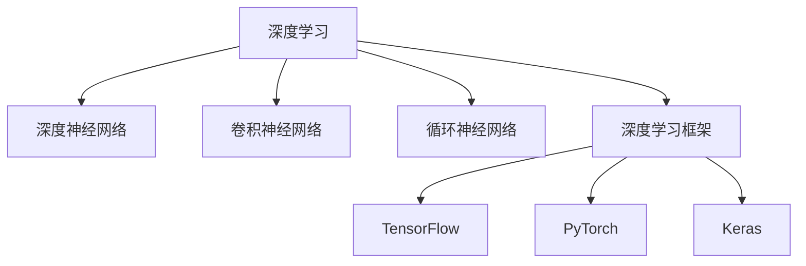

                 

# 人工智能原理与代码实例讲解

> 关键词：人工智能，深度学习，机器学习，深度神经网络，卷积神经网络，循环神经网络，自然语言处理，计算机视觉，深度学习框架，TensorFlow，PyTorch，Keras，实例讲解

## 1. 背景介绍

### 1.1 问题由来

人工智能(Artificial Intelligence, AI)是计算机科学的前沿领域，旨在开发能够执行复杂任务、自主学习和进化的智能系统。深度学习(Deep Learning, DL)作为AI的重要分支，通过多层神经网络模仿人类大脑的计算模式，从大量数据中学习特征表示，已经广泛应用于图像识别、语音识别、自然语言处理等领域。

然而，尽管深度学习取得了巨大成功，其理论基础和代码实现仍存在诸多挑战。深入理解深度学习原理，并进行实战应用，是AI从业者的核心任务。为此，本文将系统讲解深度学习的基本原理，并通过具体代码实例进行详细讲解，帮助读者更好地掌握深度学习技术。

### 1.2 问题核心关键点

本文将聚焦于深度学习的基础理论和关键技术，具体内容包括：

- 深度学习的基本原理和历史演进。
- 深度神经网络、卷积神经网络(CNN)和循环神经网络(RNN)等模型的结构和训练方法。
- 深度学习框架TensorFlow、PyTorch和Keras的使用和实践。
- 代码实例讲解，涵盖图像分类、语音识别、自然语言处理等多个AI应用场景。

通过理解这些核心概念和关键技术，读者可以更好地应用于实际项目中，推动AI技术的发展和落地。

## 2. 核心概念与联系

### 2.1 核心概念概述

为了深入理解深度学习，首先需要明确几个核心概念：

- 深度学习(Deep Learning)：通过多层神经网络，从数据中学习高层次特征表示，并用于解决复杂问题。
- 深度神经网络(Deep Neural Networks, DNN)：由多个隐藏层组成的神经网络，通过反向传播算法训练参数，实现端到端的预测或分类任务。
- 卷积神经网络(Convolutional Neural Networks, CNN)：针对图像和信号数据的特殊结构，设计了卷积层和池化层，用于提取局部特征和降维处理。
- 循环神经网络(Recurrent Neural Networks, RNN)：通过循环连接，处理序列数据，用于时间序列预测和自然语言处理。
- 深度学习框架(Deep Learning Frameworks)：如TensorFlow、PyTorch、Keras等，提供高效的深度学习模型构建、训练和部署工具。

这些概念之间的逻辑关系可以通过以下Mermaid流程图来展示：



这个流程图展示了大语言模型的核心概念及其之间的关系：

1. 深度学习是基础概念，涵盖多种神经网络模型。
2. CNN和RNN分别针对图像和序列数据设计了特定的网络结构。
3. 深度学习框架提供了模型构建、训练和部署的完整工具链。

## 3. 核心算法原理 & 具体操作步骤

### 3.1 算法原理概述

深度学习的基础是神经网络。神经网络由输入层、隐藏层和输出层组成，其中隐藏层包含多个神经元，每个神经元接收上一层神经元的输出，并产生新的输出，最终通过输出层完成对输入数据的分类或预测。

神经网络的核心算法是反向传播算法(Backpropagation)。该算法通过计算输出层误差，反向传播至隐藏层，逐层更新权重参数，使得神经网络的输出更接近真实标签。反向传播算法通过链式法则，将输出误差逐层传递，并计算每个参数的梯度，从而实现模型参数的优化。

深度学习的训练过程通常包括前向传播和反向传播两个步骤：

1. 前向传播：将输入数据通过神经网络计算，得到输出结果。
2. 反向传播：计算输出误差，并反向传播至输入层，更新模型参数。

### 3.2 算法步骤详解

以图像分类任务为例，讲解深度学习模型的训练步骤：

**Step 1: 数据准备**

- 收集并标注大量图像数据，分为训练集、验证集和测试集。
- 将图像数据转换为神经网络可处理的张量形式，如NCHW格式。

**Step 2: 模型构建**

- 使用深度学习框架构建卷积神经网络，包括卷积层、池化层、全连接层等。
- 定义损失函数和优化器，如交叉熵损失和Adam优化器。

**Step 3: 训练模型**

- 将训练集数据分批次输入模型，前向传播计算损失函数。
- 反向传播计算参数梯度，根据设定的优化器更新模型参数。
- 周期性在验证集上评估模型性能，根据性能指标决定是否触发Early Stopping。
- 重复上述步骤直至满足预设的迭代轮数或Early Stopping条件。

**Step 4: 模型评估和部署**

- 在测试集上评估微调后模型，对比微调前后的精度提升。
- 使用微调后的模型对新样本进行推理预测，集成到实际的应用系统中。

### 3.3 算法优缺点

深度学习具有以下优点：

- 可以处理复杂数据结构，如图像、音频、文本等。
- 能够自动学习数据的特征表示，减少人工特征工程的工作量。
- 在许多任务上取得了最先进的效果，如计算机视觉、语音识别、自然语言处理等。

同时，深度学习也存在以下局限性：

- 需要大量标注数据，训练时间较长。
- 模型结构复杂，难以解释和调试。
- 对于大规模数据集，存在过拟合的风险。
- 需要大量的计算资源，对硬件要求高。

尽管存在这些局限性，深度学习仍然是大数据时代处理复杂问题的首选方法之一。未来，随着硬件设备的进步和算法优化的不断推进，深度学习将更加普及和强大。

### 3.4 算法应用领域

深度学习在多个领域得到了广泛应用，包括但不限于：

- 计算机视觉：图像分类、目标检测、图像分割、人脸识别等。
- 自然语言处理：文本分类、情感分析、机器翻译、对话系统等。
- 语音识别：自动语音识别、说话人识别、语音合成等。
- 推荐系统：个性化推荐、广告推荐、商品推荐等。
- 游戏AI：强化学习、策略制定、智能对弈等。

此外，深度学习还被应用于医疗诊断、金融分析、自动驾驶等领域，带来了革命性的变化。

## 4. 数学模型和公式 & 详细讲解 & 举例说明

### 4.1 数学模型构建

深度学习模型的核心是神经网络，其数学模型可以抽象为：

$$
y = f(Wx + b)
$$

其中 $x$ 为输入向量，$W$ 和 $b$ 为模型参数，$f$ 为激活函数。激活函数通常采用sigmoid函数或ReLU函数，使得神经网络具有非线性特征。

### 4.2 公式推导过程

以二分类任务为例，介绍反向传播算法的计算过程。假设输出层为sigmoid激活函数，其数学模型为：

$$
\hat{y} = \sigma(W^Tz + b^T)
$$

其中 $z$ 为隐藏层的线性输出，$W^T$ 和 $b^T$ 为输出层的权重和偏置，$\sigma$ 为sigmoid函数。

定义损失函数为二分类交叉熵损失：

$$
\mathcal{L}(y, \hat{y}) = -[y\log \hat{y} + (1-y)\log (1-\hat{y})]
$$

将损失函数对模型参数 $W$ 和 $b$ 求偏导数，得到：

$$
\frac{\partial \mathcal{L}}{\partial W} = \hat{y} - y, \quad \frac{\partial \mathcal{L}}{\partial b} = -(y - \hat{y})
$$

使用链式法则，将梯度反向传播至隐藏层，得到：

$$
\frac{\partial \mathcal{L}}{\partial z} = \hat{y} - y, \quad \frac{\partial \mathcal{L}}{\partial W} = \frac{\partial \mathcal{L}}{\partial z} \frac{\partial z}{\partial W} = (\hat{y} - y) \sigma'(W^Tz + b^T) \frac{\partial z}{\partial W} = (\hat{y} - y) \sigma'(W^Tz + b^T) a
$$

其中 $a$ 为隐藏层输出，$\sigma'$ 为sigmoid函数的导数。

通过反向传播，可以不断更新模型参数 $W$ 和 $b$，使得模型预测结果与真实标签 $y$ 尽可能接近。

### 4.3 案例分析与讲解

以MNIST手写数字识别任务为例，详细讲解深度学习模型的训练过程：

**Step 1: 数据准备**

- 收集并预处理MNIST手写数字图像数据，将其转换为张量形式。
- 将数据集分为训练集、验证集和测试集。

**Step 2: 模型构建**

- 使用TensorFlow框架构建一个包含两个卷积层和两个全连接层的卷积神经网络。
- 定义交叉熵损失和Adam优化器。

**Step 3: 训练模型**

- 将训练集数据分批次输入模型，前向传播计算损失函数。
- 反向传播计算参数梯度，根据设定的优化器更新模型参数。
- 周期性在验证集上评估模型性能，根据性能指标决定是否触发Early Stopping。
- 重复上述步骤直至满足预设的迭代轮数或Early Stopping条件。

**Step 4: 模型评估和部署**

- 在测试集上评估微调后模型，对比微调前后的精度提升。
- 使用微调后的模型对新样本进行推理预测，集成到实际的应用系统中。

## 5. 项目实践：代码实例和详细解释说明

### 5.1 开发环境搭建

在进行深度学习项目实践前，我们需要准备好开发环境。以下是使用Python进行TensorFlow开发的环境配置流程：

1. 安装Anaconda：从官网下载并安装Anaconda，用于创建独立的Python环境。

2. 创建并激活虚拟环境：
```bash
conda create -n tf-env python=3.8 
conda activate tf-env
```

3. 安装TensorFlow：根据CUDA版本，从官网获取对应的安装命令。例如：
```bash
pip install tensorflow-gpu
```

4. 安装各类工具包：
```bash
pip install numpy pandas scikit-learn matplotlib tqdm jupyter notebook ipython
```

完成上述步骤后，即可在`tf-env`环境中开始深度学习项目开发。

### 5.2 源代码详细实现

下面我们以MNIST手写数字识别任务为例，给出使用TensorFlow进行深度学习的PyTorch代码实现。

首先，定义MNIST数据处理函数：

```python
from tensorflow.keras.datasets import mnist
from tensorflow.keras.utils import to_categorical
from tensorflow.keras.preprocessing.image import img_to_array

def load_data(batch_size):
    (x_train, y_train), (x_test, y_test) = mnist.load_data()

    x_train = x_train / 255.0
    x_test = x_test / 255.0

    y_train = to_categorical(y_train)
    y_test = to_categorical(y_test)

    x_train = img_to_array(x_train)
    x_test = img_to_array(x_test)

    return x_train, y_train, x_test, y_test

x_train, y_train, x_test, y_test = load_data(64)
```

然后，定义模型和优化器：

```python
import tensorflow as tf
from tensorflow.keras import layers, models

model = models.Sequential([
    layers.Conv2D(32, (3, 3), activation='relu', input_shape=(28, 28, 1)),
    layers.MaxPooling2D((2, 2)),
    layers.Conv2D(64, (3, 3), activation='relu'),
    layers.MaxPooling2D((2, 2)),
    layers.Flatten(),
    layers.Dense(64, activation='relu'),
    layers.Dense(10, activation='softmax')
])

optimizer = tf.keras.optimizers.Adam(learning_rate=0.001)
```

接着，定义训练和评估函数：

```python
def train_epoch(model, x_train, y_train, batch_size):
    model.compile(optimizer=optimizer, loss='categorical_crossentropy', metrics=['accuracy'])

    for epoch in range(10):
        model.fit(x_train, y_train, batch_size=batch_size, epochs=1, validation_data=(x_test, y_test))
        print(f'Epoch {epoch+1}, train accuracy: {model.evaluate(x_train, y_train, verbose=0)[1]:.2f}%, test accuracy: {model.evaluate(x_test, y_test, verbose=0)[1]:.2f}%')

def evaluate(model, x_test, y_test):
    loss, accuracy = model.evaluate(x_test, y_test)
    print(f'Test accuracy: {accuracy:.2f}%')

train_epoch(model, x_train, y_train, 64)
evaluate(model, x_test, y_test)
```

最后，启动训练流程并在测试集上评估：

```python
import tensorflow as tf
from tensorflow.keras import layers, models

model = models.Sequential([
    layers.Conv2D(32, (3, 3), activation='relu', input_shape=(28, 28, 1)),
    layers.MaxPooling2D((2, 2)),
    layers.Conv2D(64, (3, 3), activation='relu'),
    layers.MaxPooling2D((2, 2)),
    layers.Flatten(),
    layers.Dense(64, activation='relu'),
    layers.Dense(10, activation='softmax')
])

optimizer = tf.keras.optimizers.Adam(learning_rate=0.001)

x_train, y_train, x_test, y_test = load_data(64)

model.compile(optimizer=optimizer, loss='categorical_crossentropy', metrics=['accuracy'])

for epoch in range(10):
    model.fit(x_train, y_train, batch_size=64, epochs=1, validation_data=(x_test, y_test))
    print(f'Epoch {epoch+1}, train accuracy: {model.evaluate(x_train, y_train, verbose=0)[1]:.2f}%, test accuracy: {model.evaluate(x_test, y_test, verbose=0)[1]:.2f}%')

evaluate(model, x_test, y_test)
```

以上就是使用TensorFlow进行MNIST手写数字识别任务深度学习的完整代码实现。可以看到，通过TensorFlow的Keras API，构建深度学习模型的过程变得简洁高效。

### 5.3 代码解读与分析

让我们再详细解读一下关键代码的实现细节：

**load_data函数**：
- 使用Keras的MNIST数据集，将图像数据和标签转换为TensorFlow张量形式。
- 对图像数据进行归一化处理，并转化为二维数组。
- 对标签进行独热编码，转化为one-hot向量。

**train_epoch函数**：
- 使用Keras的Sequential模型，定义卷积神经网络结构。
- 使用Adam优化器和交叉熵损失函数，进行模型编译。
- 对模型进行训练，每个epoch在一个batch上迭代，并在验证集上评估模型性能。
- 输出训练集和测试集的准确率。

**evaluate函数**：
- 在测试集上评估模型的性能，输出准确率。

通过上述函数实现，可以看到深度学习模型的训练过程包括数据预处理、模型构建、优化器选择、训练迭代和评估等步骤。这些关键步骤构成了深度学习模型训练的基本框架。

## 6. 实际应用场景

### 6.1 计算机视觉

深度学习在计算机视觉领域的应用非常广泛。如目标检测、图像分割、人脸识别等任务，已经取得了显著的成果。例如，YOLOv5、Mask R-CNN等目标检测模型，在速度和精度上均有出色表现。

在实际应用中，深度学习可以用于智能监控、自动驾驶、机器人导航等场景，提升系统的视觉感知能力。例如，在自动驾驶中，通过深度学习模型识别道路、行人、车辆等目标，并做出决策判断，提升行车安全。

### 6.2 自然语言处理

自然语言处理(Natural Language Processing, NLP)是深度学习的重要应用领域。常见的NLP任务包括文本分类、情感分析、机器翻译、对话系统等。深度学习模型如BERT、GPT等，在这些任务上取得了显著的进展。

在实际应用中，深度学习可以用于智能客服、智能翻译、情感分析等场景。例如，智能客服系统通过深度学习模型理解和处理用户输入，生成自然流畅的回复，提升服务质量。

### 6.3 语音识别

语音识别技术是深度学习的重要应用之一。深度学习模型如卷积神经网络(CNN)、循环神经网络(RNN)等，已经被广泛用于语音识别任务中。例如，Google的Speech-to-Text模型，能够将语音信号转换为文本，广泛应用于智能音箱、语音助手等场景。

在实际应用中，深度学习可以用于智能家居、语音控制等场景，提升人机交互的便利性和准确性。例如，智能家居系统通过语音识别技术，能够根据用户语音指令控制家电设备，提升生活便利性。

## 7. 工具和资源推荐

### 7.1 学习资源推荐

为了帮助开发者系统掌握深度学习的理论基础和实践技巧，这里推荐一些优质的学习资源：

1. 《深度学习》书籍：Ian Goodfellow等人所著，全面介绍了深度学习的基本概念、算法和应用。
2. 《神经网络与深度学习》课程：Andrew Ng教授的Coursera课程，深入浅出地讲解了深度学习的基础知识和应用。
3. TensorFlow官方文档：提供了丰富的深度学习模型和代码示例，是学习深度学习的最佳参考。
4. Kaggle竞赛：参与Kaggle数据科学竞赛，通过实际项目提升深度学习的实践能力。
5. PyTorch官方文档：提供了详细的深度学习模型和代码示例，是学习深度学习的最佳参考。

通过对这些资源的学习实践，相信你一定能够快速掌握深度学习技术的精髓，并用于解决实际的AI问题。

### 7.2 开发工具推荐

高效的开发离不开优秀的工具支持。以下是几款用于深度学习开发的常用工具：

1. TensorFlow：由Google主导开发的开源深度学习框架，提供丰富的模型和工具，生产部署方便。
2. PyTorch：由Facebook主导开发的开源深度学习框架，提供动态计算图和灵活的模型构建，适合研究和实验。
3. Keras：由François Chollet开发的高级深度学习框架，提供了简单易用的API，可以快速构建和训练深度学习模型。

合理利用这些工具，可以显著提升深度学习任务的开发效率，加快创新迭代的步伐。

### 7.3 相关论文推荐

深度学习的发展离不开学界的持续研究。以下是几篇奠基性的相关论文，推荐阅读：

1. 深度神经网络：Goodfellow等人所著，全面介绍了深度神经网络的理论基础和训练方法。
2. 卷积神经网络：LeCun等人所著，介绍了卷积神经网络的结构和应用，被广泛应用于图像处理任务。
3. 循环神经网络：Hochreiter等人所著，介绍了循环神经网络的结构和应用，被广泛应用于序列数据处理任务。
4. 残差网络：He等人所著，提出了残差网络结构，大大提升了深度神经网络的训练效果和收敛速度。
5. 注意力机制：Bahdanau等人所著，介绍了注意力机制的应用，提升了序列到序列任务的性能。

这些论文代表了大语言模型微调技术的发展脉络。通过学习这些前沿成果，可以帮助研究者把握学科前进方向，激发更多的创新灵感。

## 8. 总结：未来发展趋势与挑战

### 8.1 总结

本文对深度学习的基本原理和关键技术进行了系统讲解，并通过具体代码实例进行了详细讲解。通过理解这些核心概念和关键技术，读者可以更好地应用于实际项目中，推动AI技术的发展和落地。

深度学习技术在计算机视觉、自然语言处理、语音识别等多个领域取得了显著成果，提升了人类感知和认知的能力，带来了深远影响。未来，深度学习技术还将进一步扩展和深化，引领人工智能的全面发展。

### 8.2 未来发展趋势

展望未来，深度学习技术将呈现以下几个发展趋势：

1. 模型规模持续增大。随着算力成本的下降和数据规模的扩张，深度学习模型的参数量还将持续增长。超大规模模型蕴含的丰富知识，有望支撑更加复杂多变的任务。
2. 深度学习框架日益成熟。如TensorFlow、PyTorch等，将提供更加高效、易用的开发工具，加速深度学习的研究和应用。
3. 模型压缩和加速技术不断突破。深度学习模型的压缩和加速技术，将进一步提升模型的推理速度和资源利用率。
4. 跨领域迁移学习成为热点。深度学习模型将在不同领域之间进行迁移学习，提升模型的泛化能力和应用范围。
5. 深度学习与强化学习融合。深度学习技术与强化学习技术结合，将提升智能体在复杂环境中的决策能力。

这些趋势凸显了深度学习技术的广阔前景。这些方向的探索发展，必将进一步提升深度学习系统的性能和应用范围，为人类认知智能的进化带来深远影响。

### 8.3 面临的挑战

尽管深度学习技术已经取得了巨大成功，但在迈向更加智能化、普适化应用的过程中，仍面临诸多挑战：

1. 数据需求高。深度学习模型通常需要大量标注数据进行训练，标注成本高昂。
2. 模型复杂度高。深度学习模型结构复杂，难以解释和调试。
3. 过拟合风险大。深度学习模型容易过拟合，泛化性能差。
4. 计算资源要求高。深度学习模型对硬件要求高，需要高性能计算资源。
5. 模型偏见和歧视。深度学习模型容易学习到有偏见的数据，产生歧视性输出。

这些挑战需要未来在理论、算法和工程等方面进行进一步的研究和优化，才能使深度学习技术更加普及和强大。

### 8.4 研究展望

面对深度学习面临的这些挑战，未来的研究需要在以下几个方面寻求新的突破：

1. 无监督学习范式。探索无监督学习技术，降低对标注数据的需求，提升模型的泛化能力。
2. 模型压缩和加速技术。开发更加高效的模型压缩和加速技术，提升深度学习模型的推理速度和资源利用率。
3. 迁移学习范式。探索跨领域迁移学习技术，提升深度学习模型的泛化能力和应用范围。
4. 强化学习融合。将深度学习技术与强化学习技术结合，提升智能体在复杂环境中的决策能力。
5. 模型偏见和歧视。开发偏见和歧视识别技术，提升深度学习模型的公平性和可解释性。

这些研究方向的探索，必将引领深度学习技术迈向更高的台阶，为构建智能系统奠定坚实基础。面向未来，深度学习技术还需要与其他人工智能技术进行更深入的融合，如知识表示、因果推理、强化学习等，多路径协同发力，共同推动人工智能技术的全面发展。

## 9. 附录：常见问题与解答

**Q1：深度学习与传统机器学习的区别是什么？**

A: 深度学习与传统机器学习的主要区别在于模型结构和训练方法。深度学习模型由多层神经网络组成，能够自动学习数据的特征表示，适合处理复杂数据结构。而传统机器学习模型通常依赖人工特征工程，手动提取数据特征。

**Q2：深度学习模型的训练时间为何如此长？**

A: 深度学习模型的训练时间较长，主要是因为模型结构复杂，参数数量庞大，需要大量的计算资源和时间。通常需要GPU或TPU等高性能设备，并使用大规模分布式训练来加速训练过程。

**Q3：如何避免深度学习模型的过拟合？**

A: 深度学习模型容易过拟合，可以考虑以下方法避免：
1. 数据增强：通过对训练数据进行变换、扩充，增加数据的多样性，减少过拟合风险。
2. 正则化：使用L2正则化、Dropout等技术，限制模型参数的大小，防止过拟合。
3. 早停策略：在验证集上监控模型性能，一旦性能不再提升，立即停止训练，避免过拟合。

**Q4：深度学习模型的解释性和可解释性为何如此重要？**

A: 深度学习模型通常是"黑盒"系统，难以解释其内部工作机制和决策逻辑。在金融、医疗等高风险领域，算法的可解释性和可审计性尤为重要。可解释性强的模型有助于发现模型的脆弱点和改进模型性能，提升系统的透明度和可信度。

**Q5：未来深度学习技术将如何进一步发展？**

A: 未来深度学习技术将进一步扩展和深化，主要体现在以下几个方面：
1. 模型规模持续增大。超大规模模型蕴含的丰富知识，将支撑更加复杂多变的任务。
2. 深度学习框架日益成熟。如TensorFlow、PyTorch等，将提供更加高效、易用的开发工具。
3. 模型压缩和加速技术不断突破。模型压缩和加速技术将提升模型的推理速度和资源利用率。
4. 跨领域迁移学习成为热点。深度学习模型将在不同领域之间进行迁移学习，提升模型的泛化能力和应用范围。
5. 深度学习与强化学习融合。深度学习技术与强化学习技术结合，将提升智能体在复杂环境中的决策能力。

总之，未来深度学习技术将继续引领人工智能的全面发展，为构建智能系统奠定坚实基础。

---

作者：禅与计算机程序设计艺术 / Zen and the Art of Computer Programming

