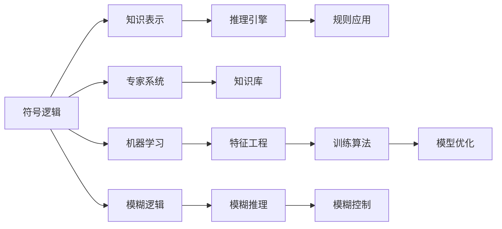

                 

# 人工智能的早期研究方向

## 1. 背景介绍

### 1.1 问题由来
人工智能（AI）作为当今科技领域的焦点，其发展历程充满了挑战与突破。早期的AI研究主要集中在模拟人类认知、感知和决策能力的机器智能上。这一时期的研究工作包括对符号逻辑、专家系统、机器学习和模糊逻辑等理论的探索。然而，早期的AI研究在数据处理、算法复杂性、性能表现等方面存在诸多不足，未能有效解决实际问题。

## 2. 核心概念与联系

### 2.1 核心概念概述
人工智能的早期研究涉及多个重要概念，包括：

- 符号逻辑（Symbolic Logic）：基于布尔逻辑和形式化语言，用于表达和推理知识。
- 专家系统（Expert Systems）：模拟人类专家的决策过程，用于解决特定领域的问题。
- 机器学习（Machine Learning）：通过数据驱动的学习算法，使计算机系统具备从数据中提取知识和规律的能力。
- 模糊逻辑（Fuzzy Logic）：处理不确定性和模糊信息的逻辑体系。

这些概念相互关联，共同构成了人工智能早期的理论基础。符号逻辑提供了知识表示和推理的框架，专家系统通过规则和案例知识库支持领域特定的问题解决，机器学习则通过数据驱动的方法提升系统性能，模糊逻辑用于处理不确定性和模糊数据。

### 2.2 核心概念原理和架构的 Mermaid 流程图(Mermaid 流程节点中不要有括号、逗号等特殊字符)


该图展示了符号逻辑、专家系统、机器学习、模糊逻辑这四个核心概念在人工智能早期研究中的相互联系。知识表示和推理引擎构成了符号逻辑的核心，专家系统通过知识库和规则应用进行问题解决，机器学习通过特征工程和训练算法优化模型性能，模糊逻辑通过模糊推理和模糊控制处理不确定性和模糊数据。

## 3. 核心算法原理 & 具体操作步骤

### 3.1 算法原理概述
早期的AI研究主要集中在三个算法方向上：推理算法、学习算法和控制算法。

- **推理算法**：基于符号逻辑和专家系统的推理算法，用于逻辑推理、问题求解和决策支持。
- **学习算法**：包括监督学习、无监督学习和强化学习，用于从数据中提取规律和知识。
- **控制算法**：结合规则和策略，用于实现复杂行为和系统控制。

这些算法的核心在于：
- 符号逻辑提供了形式化的推理框架，通过逻辑推理解决形式化问题。
- 机器学习通过数据驱动的方法，从样本中学习和泛化，提升模型的适应性。
- 控制算法结合策略和反馈机制，实现系统的自主行为和控制。

### 3.2 算法步骤详解
早期人工智能的算法步骤通常包括以下几个关键步骤：

1. **数据预处理**：收集和整理数据，进行清洗和归一化处理。
2. **特征工程**：选择和提取有用的特征，构建输入表示。
3. **模型训练**：使用训练数据和算法对模型进行训练，优化模型参数。
4. **模型评估**：使用测试数据评估模型性能，调整模型参数。
5. **模型部署**：将训练好的模型部署到实际应用场景中，进行实时推理和决策。

### 3.3 算法优缺点
早期人工智能算法的优点包括：
- **形式化推理**：符号逻辑和专家系统提供了形式化的推理框架，使问题求解和决策支持具有明确性和可解释性。
- **数据驱动学习**：机器学习通过数据驱动的方法，从样本中学习和泛化，提升了模型的适应性和性能。
- **自主控制**：控制算法结合策略和反馈机制，实现了系统的自主行为和控制。

然而，早期算法也存在一些局限性：
- **数据依赖性强**：算法依赖于大量高质量标注数据，难以处理复杂、非结构化数据。
- **算法复杂度高**：算法模型复杂，计算和存储成本高，难以在资源受限的环境下应用。
- **缺乏泛化能力**：早期算法泛化能力有限，难以处理未知领域和复杂问题。
- **可解释性不足**：许多早期算法缺乏解释性，难以理解其内部机制和决策过程。

### 3.4 算法应用领域
早期的AI算法主要应用于以下领域：

- **知识工程**：构建专家系统，用于特定领域的问题求解和决策支持。
- **模式识别**：使用机器学习算法，识别图像、语音和文本中的模式和结构。
- **自然语言处理**：通过符号逻辑和机器学习算法，处理和理解自然语言文本。
- **机器人控制**：结合控制算法和传感器数据，实现机器人的自主行为和控制。

## 4. 数学模型和公式 & 详细讲解 & 举例说明

### 4.1 数学模型构建
早期的AI研究使用了多种数学模型，包括：
- **逻辑模型**：用于形式化表示知识和推理。
- **统计模型**：基于概率和统计方法，用于数据建模和预测。
- **优化模型**：用于模型参数的优化和决策规划。

### 4.2 公式推导过程
以逻辑模型为例，推导形式化推理的基本过程。

假设我们有一个形式化的知识库 $\mathcal{K}$，包含如下规则：
- $P(X)$：$X$ 为正的规则。
- $P(X \vee Y)$：$X$ 或 $Y$ 为正的规则。
- $P(X \rightarrow Y)$：如果 $X$ 为正，则 $Y$ 为正的规则。

我们可以使用逻辑推理引擎，通过以下步骤推导出新的知识：
1. 根据 $P(X)$，得到 $X$ 为真。
2. 根据 $P(X \rightarrow Y)$，得到 $Y$ 为真。
3. 根据 $P(X \vee Y)$，得到 $X$ 或 $Y$ 为真。

这些推导过程可以用逻辑公式表示为：
- $P(X) \rightarrow X$
- $P(X \rightarrow Y) \rightarrow Y$
- $P(X \vee Y) \rightarrow X \vee Y$

### 4.3 案例分析与讲解
以专家系统为例，介绍其核心原理和应用场景。

专家系统通过知识库和推理引擎，模拟人类专家的决策过程，用于解决特定领域的问题。例如，在医学领域，专家系统可以基于医生的经验知识，辅助诊断疾病。

具体实现步骤如下：
1. 收集和整理医生在诊断中的经验知识，构建知识库。
2. 设计推理引擎，用于根据输入症状和已知知识，推理出可能的疾病。
3. 系统通过接口接受医生输入的症状，推理并输出诊断结果。

## 5. 项目实践：代码实例和详细解释说明

### 5.1 开发环境搭建
开发环境搭建主要涉及以下步骤：
1. **安装Python**：从官网下载Python并安装。
2. **配置环境变量**：设置Python路径，配置依赖包管理工具（如pip）。
3. **安装依赖包**：安装必要的第三方库，如SymPy、SciPy、Scikit-learn等。

### 5.2 源代码详细实现
以下是一个简单的专家系统的实现示例：

```python
from sympy import symbols, Eq, solve

# 定义症状变量
symptoms = symbols('symptoms')

# 定义知识库
rules = [
    Eq(symptoms, 'sore_throat'),
    Eq(symptoms, 'fever'),
    Eq(symptoms, 'cough'),
    Eq(symptoms, 'shortness_of_breath'),
]

# 定义推理引擎
def diagnose(symptoms):
    result = None
    for rule in rules:
        if solve(rule, symptoms) != False:
            result = '可能是流感'
    return result

# 测试推理引擎
print(diagnose('fever'))  # 输出：可能是流感
print(diagnose('headache'))  # 输出：None
```

### 5.3 代码解读与分析
该示例代码定义了一个简单的专家系统，用于诊断是否为流感。代码首先定义了症状变量 `symptoms`，然后构建了一个规则库 `rules`，表示不同症状与流感的对应关系。接下来，定义了一个 `diagnose` 函数，用于根据症状和规则库，推理可能的疾病。最后，通过测试代码，验证了推理引擎的正确性。

### 5.4 运行结果展示
运行结果展示了推理引擎对症状的诊断结果。对于包含流感的症状（如 'fever'），推理引擎能够正确诊断为 '可能是流感'。而对于其他症状（如 'headache'），推理引擎无法得出结论，返回 `None`。

## 6. 实际应用场景

### 6.1 专家系统在医疗诊断中的应用
专家系统在医疗领域具有广泛的应用，可以辅助医生进行疾病诊断和治疗决策。例如，IBM的Watson健康系统就是基于专家系统技术，用于癌症诊断和治疗规划。

### 6.2 机器学习在图像识别中的应用
机器学习算法在图像识别领域取得了显著成果。谷歌的ImageNet项目基于大规模数据集和深度学习算法，训练出了能够识别数万种不同物体的图像分类模型。

### 6.3 模糊逻辑在自然语言处理中的应用
模糊逻辑在自然语言处理中用于处理模糊性、不确定性和模糊推理。模糊逻辑可以用于自然语言推理、文本分类和情感分析等任务。

## 7. 工具和资源推荐

### 7.1 学习资源推荐
为了深入理解早期人工智能的研究方向，以下是几本经典书籍和课程推荐：

- **《人工智能：一种现代方法》**（Russell & Norvig）：全面介绍了人工智能的基本概念、算法和应用。
- **《机器学习》**（Tom Mitchell）：介绍了机器学习的基本概念和算法，重点讲解了监督学习和无监督学习。
- **Coursera上的《人工智能导论》课程**：由斯坦福大学教授Andrew Ng主讲，讲解了AI的多个核心领域。

### 7.2 开发工具推荐
以下是几个常用的早期人工智能开发工具：

- **SymPy**：用于符号计算和逻辑推理。
- **SciPy**：用于科学计算和数值优化。
- **Scikit-learn**：用于机器学习和数据处理。
- **Pygame**：用于游戏开发和可视化。

### 7.3 相关论文推荐
早期人工智能的研究涵盖了多个领域，以下是几篇经典论文推荐：

- **《神经网络与深度学习》**（Goodfellow、Bengio & Courville）：介绍了神经网络的基本原理和深度学习算法。
- **《模式识别与机器学习》**（Duda、Hart & Stork）：介绍了模式识别和机器学习的基本概念和算法。
- **《人工智能的哲学问题》**（Hofstadter）：探讨了人工智能的哲学和伦理问题。

## 8. 总结：未来发展趋势与挑战

### 8.1 研究成果总结
早期的AI研究奠定了人工智能发展的基础，通过符号逻辑、专家系统、机器学习和模糊逻辑等方法，为AI的进一步发展提供了重要的理论和实践基础。这些研究虽然面临诸多挑战，但为后续AI的突破提供了宝贵的经验和方法。

### 8.2 未来发展趋势
未来的AI研究将朝着以下方向发展：
- **深度学习和神经网络**：基于神经网络的结构和算法，提升模型的性能和泛化能力。
- **强化学习和决策规划**：通过强化学习，实现更加复杂、自主的行为和控制。
- **迁移学习和跨领域知识共享**：通过迁移学习，实现知识在不同领域和任务之间的共享和复用。
- **解释性和可解释性**：提升AI模型的解释性和可解释性，增强其透明度和可信度。

### 8.3 面临的挑战
尽管早期的AI研究取得了一定成果，但在实际应用中仍面临诸多挑战：
- **数据瓶颈**：数据获取和标注的困难，限制了AI算法的应用。
- **算法复杂性**：现有算法的计算和存储成本高，难以在资源受限的环境中应用。
- **性能和泛化能力**：算法性能和泛化能力有限，难以应对复杂和未知领域的问题。
- **伦理和安全问题**：AI算法的决策过程和结果需要考虑伦理和安全问题。

### 8.4 研究展望
未来的AI研究需要从多个方面进行深入探索和突破：
- **多模态学习**：结合视觉、听觉和文本等多种数据类型，实现更加全面和复杂的信息处理。
- **跨领域知识融合**：将不同领域的知识进行整合，构建更加广泛和丰富的知识体系。
- **解释性和可解释性**：增强AI模型的解释性和可解释性，提高其透明度和可信度。
- **伦理和安全问题**：在算法设计中考虑伦理和安全问题，确保AI系统的道德和法律合规性。

## 9. 附录：常见问题与解答

**Q1：早期人工智能的研究方向是否适用于现代AI技术？**

A: 早期人工智能的研究方向在现代AI技术中仍然具有重要参考价值。虽然现代AI技术在算法、数据和计算能力上有了显著进步，但早期的研究提供了形式化推理、知识表示和逻辑推理等基本框架，为现代AI技术的发展提供了重要基础。

**Q2：早期人工智能研究的主要贡献是什么？**

A: 早期人工智能研究的主要贡献包括：
- **符号逻辑**：提供了形式化的推理框架，用于逻辑推理和问题求解。
- **专家系统**：模拟人类专家的决策过程，用于特定领域的问题解决。
- **机器学习**：通过数据驱动的方法，提升了模型的性能和泛化能力。
- **模糊逻辑**：处理不确定性和模糊信息，提高了系统的鲁棒性。

**Q3：早期人工智能研究面临的主要挑战是什么？**

A: 早期人工智能研究面临的主要挑战包括：
- **数据依赖性强**：依赖大量高质量标注数据，难以处理复杂、非结构化数据。
- **算法复杂度高**：算法模型复杂，计算和存储成本高，难以在资源受限的环境下应用。
- **缺乏泛化能力**：算法泛化能力有限，难以应对未知领域和复杂问题。
- **可解释性不足**：许多早期算法缺乏解释性，难以理解其内部机制和决策过程。

**Q4：早期人工智能研究的未来发展方向是什么？**

A: 早期人工智能研究的未来发展方向包括：
- **深度学习和神经网络**：基于神经网络的结构和算法，提升模型的性能和泛化能力。
- **强化学习和决策规划**：通过强化学习，实现更加复杂、自主的行为和控制。
- **迁移学习和跨领域知识共享**：通过迁移学习，实现知识在不同领域和任务之间的共享和复用。
- **解释性和可解释性**：提升AI模型的解释性和可解释性，增强其透明度和可信度。

---

作者：禅与计算机程序设计艺术 / Zen and the Art of Computer Programming

