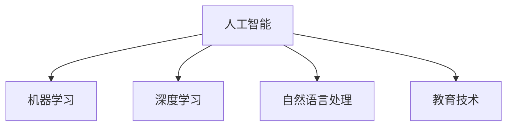

                 

# 人工智能：教育变革的催化剂

在当今这个信息爆炸的时代，教育系统正面临着前所未有的挑战。传统的教学模式已经无法满足现代学生的学习需求，而人工智能（AI）技术的兴起为教育变革提供了新的可能性。本文将探讨人工智能在教育中的应用，特别是其在促进教育变革方面的作用。

## 1. 背景介绍

### 1.1 问题由来
随着科技的迅猛发展，信息获取的渠道和方式越来越多样化，学生的学习习惯和兴趣也在发生改变。传统的“填鸭式”教学模式已经无法适应这一变化。教育系统需要更加灵活、个性化、互动化的教学方式，以激发学生的学习兴趣和潜力。

### 1.2 问题核心关键点
人工智能作为一种具有自主学习能力的智能技术，可以为教育带来革命性的变革。通过AI技术，可以定制个性化的学习方案，提高教学效率，降低教学成本，促进教育资源的公平分配。

### 1.3 问题研究意义
人工智能在教育中的应用，不仅可以提高教学质量，还可以实现教育的规模化、个性化和智能化。通过AI技术的辅助，教育工作者可以更好地理解和满足学生的学习需求，推动教育公平和普惠。

## 2. 核心概念与联系

### 2.1 核心概念概述

为更好地理解人工智能在教育中的应用，本节将介绍几个密切相关的核心概念：

- **人工智能（Artificial Intelligence, AI）**：指通过计算机技术实现智能化的能力，可以模拟人类的思维和行为。
- **机器学习（Machine Learning, ML）**：指让计算机从数据中学习规律，并根据学习结果做出预测或决策的技术。
- **深度学习（Deep Learning, DL）**：指基于神经网络的机器学习技术，能够处理大量复杂的数据，并从中学习出高级的特征表示。
- **自然语言处理（Natural Language Processing, NLP）**：指让计算机理解和生成人类语言的技术。
- **教育技术（Educational Technology, EdTech）**：指使用技术手段改善教育过程和学习效果的技术。

这些核心概念之间的逻辑关系可以通过以下Mermaid流程图来展示：



这个流程图展示人工智能与其他关键技术的关系：

1. 人工智能通过机器学习和深度学习技术，可以处理和分析大量数据，从中学习出高级特征。
2. 自然语言处理技术使计算机能够理解和生成自然语言，从而能够进行更自然的交互。
3. 教育技术将人工智能技术应用于教育过程，提升教学效果和学习体验。

## 3. 核心算法原理 & 具体操作步骤
### 3.1 算法原理概述

人工智能在教育中的应用，本质上是通过机器学习和深度学习算法，从教育数据中学习出规律和模式，并根据学习结果优化教育过程。其核心思想是：通过大规模的教育数据训练模型，使其能够自动适应不同的教学场景，为每个学生定制个性化的学习方案。

形式化地，假设有一个教育数据集 $D=\{(x_i, y_i)\}_{i=1}^N, x_i \in \mathcal{X}, y_i \in \mathcal{Y}$，其中 $x_i$ 为学生的学习数据，$y_i$ 为学习效果。我们的目标是训练一个模型 $M$，使得 $M(x_i)$ 能够预测出 $y_i$。训练过程中，我们希望最小化预测误差，即：

$$
\mathcal{L}(M) = \frac{1}{N}\sum_{i=1}^N |y_i - M(x_i)|
$$

其中，$\mathcal{L}(M)$ 为模型的预测误差。通过梯度下降等优化算法，最小化损失函数 $\mathcal{L}(M)$，得到最优模型参数 $\theta$。

### 3.2 算法步骤详解

人工智能在教育中的应用主要包括以下几个关键步骤：

**Step 1: 数据准备**
- 收集学生学习数据，如成绩、作业、考试、视频等，以及对应的学习效果。
- 清洗数据，去除噪音和不完整数据。
- 划分训练集、验证集和测试集，确保数据集的平衡和多样性。

**Step 2: 模型选择和训练**
- 选择合适的机器学习或深度学习模型，如回归模型、分类模型、神经网络等。
- 使用训练集数据，通过梯度下降等优化算法，训练模型。
- 在验证集上评估模型性能，调整超参数和模型结构。

**Step 3: 模型评估和优化**
- 在测试集上评估模型的预测效果，计算准确率、召回率、F1值等指标。
- 分析模型的预测误差，识别和解决过拟合、欠拟合等问题。
- 优化模型，提高其预测准确率和泛化能力。

**Step 4: 应用部署**
- 将训练好的模型集成到教育系统中，如在线课程平台、智能辅助教学系统等。
- 与现有教育资源进行整合，提升教学效果和学习体验。
- 持续收集学生反馈，进行模型迭代和优化。

### 3.3 算法优缺点

人工智能在教育中的应用具有以下优点：
1. 个性化教学：通过学习学生的个性化学习数据，为每个学生定制个性化的学习方案，提高学习效果。
2. 自动化评估：通过自动化的评估和反馈机制，实时监测学生的学习状态，及时发现问题并加以改进。
3. 数据驱动决策：基于大数据分析，提供科学的教学决策支持，优化教学资源配置。
4. 提高效率：通过自动化处理教学任务，降低教师的工作负担，提升教学效率。

同时，该方法也存在一定的局限性：
1. 数据质量要求高：教育数据的质量和多样性对模型效果有很大影响。如果数据采集不全面、不准确，模型效果可能不佳。
2. 依赖技术基础：教育系统对技术的要求较高，需要有一定的技术储备和基础设施支持。
3. 隐私和安全问题：学生的教育数据涉及隐私，需要采取有效的隐私保护措施。
4. 教育公平性：虽然AI技术可以优化资源分配，但如果数据采集不均衡，可能导致教育资源的不公平。

尽管存在这些局限性，但就目前而言，人工智能在教育中的应用已经初现成效，正逐渐成为教育变革的重要工具。

### 3.4 算法应用领域

人工智能在教育中的应用领域非常广泛，包括但不限于：

- **个性化学习**：通过学习学生的学习行为和数据，为每个学生定制个性化的学习方案，提高学习效果。
- **智能辅导**：利用自然语言处理技术，与学生进行自然语言交互，提供个性化的学习辅导和答疑服务。
- **评估和反馈**：基于机器学习算法，自动评估学生的学习成果，提供个性化的反馈和改进建议。
- **课程推荐**：利用推荐算法，根据学生的兴趣和学习历史，推荐适合的课程和学习材料。
- **自动化测评**：使用自动化测评工具，对学生的作业和考试进行自动批改，提高测评效率和准确性。

此外，人工智能还可以应用于教育管理、教育资源优化、教育研究等领域，推动教育系统的全面变革。

## 4. 数学模型和公式 & 详细讲解 & 举例说明

### 4.1 数学模型构建

人工智能在教育中的应用，可以通过机器学习和深度学习算法进行建模。以下以回归问题为例，构建数学模型：

假设有一个包含 $N$ 个学生学习数据的教育数据集 $D=\{(x_i, y_i)\}_{i=1}^N, x_i \in \mathcal{X}, y_i \in \mathbb{R}$，其中 $x_i$ 为学生的学习数据，$y_i$ 为学习效果。我们的目标是训练一个回归模型 $M$，使得 $M(x_i)$ 能够预测出 $y_i$。训练过程中，我们希望最小化预测误差，即：

$$
\mathcal{L}(M) = \frac{1}{N}\sum_{i=1}^N (y_i - M(x_i))^2
$$

其中，$\mathcal{L}(M)$ 为模型的预测误差。通过梯度下降等优化算法，最小化损失函数 $\mathcal{L}(M)$，得到最优模型参数 $\theta$。

### 4.2 公式推导过程

以下我们以线性回归模型为例，推导损失函数及其梯度的计算公式。

假设回归模型为 $M(x) = \theta_0 + \sum_{i=1}^d \theta_i x_{i-1}$，其中 $\theta = [\theta_0, \theta_1, ..., \theta_d]^T$。则预测误差为：

$$
e_i = y_i - M(x_i) = y_i - (\theta_0 + \sum_{i=1}^d \theta_i x_{i-1})
$$

则预测误差的平方和损失函数为：

$$
\mathcal{L}(\theta) = \frac{1}{N}\sum_{i=1}^N e_i^2 = \frac{1}{N}\sum_{i=1}^N (y_i - M(x_i))^2
$$

对 $\theta$ 求导，得到梯度：

$$
\frac{\partial \mathcal{L}(\theta)}{\partial \theta_j} = \frac{1}{N}\sum_{i=1}^N 2e_i \frac{\partial M(x_i)}{\partial \theta_j} = \frac{2}{N}\sum_{i=1}^N (y_i - M(x_i))x_{i-1}
$$

其中，$\frac{\partial M(x_i)}{\partial \theta_j} = x_{i-1}$。

在得到损失函数的梯度后，即可带入梯度下降算法，更新模型参数。重复上述过程直至收敛，最终得到适应教育数据的最优模型参数 $\theta^*$。

### 4.3 案例分析与讲解

以Kaggle上的“的学生成绩预测”数据集为例，探讨如何使用线性回归模型进行学生成绩预测：

1. **数据准备**：收集学生的学习数据，如考试成绩、上课时间、作业完成情况等，以及对应的成绩。
2. **数据处理**：将数据进行清洗和归一化处理，去除噪音和异常值。
3. **模型训练**：选择线性回归模型，使用训练集数据进行模型训练，计算损失函数及其梯度。
4. **模型评估**：在测试集上评估模型预测效果，计算准确率、召回率、F1值等指标。
5. **结果分析**：分析模型预测误差，识别和解决过拟合、欠拟合等问题。
6. **模型优化**：根据测试集评估结果，调整模型超参数和结构，提高模型性能。

通过以上步骤，可以构建一个简单的学生成绩预测模型，帮助教育工作者更好地了解学生的学习状态和潜力。

## 5. 项目实践：代码实例和详细解释说明
### 5.1 开发环境搭建

在进行教育数据建模和预测的实践前，我们需要准备好开发环境。以下是使用Python进行PyTorch开发的环境配置流程：

1. 安装Anaconda：从官网下载并安装Anaconda，用于创建独立的Python环境。

2. 创建并激活虚拟环境：
```bash
conda create -n pytorch-env python=3.8 
conda activate pytorch-env
```

3. 安装PyTorch：根据CUDA版本，从官网获取对应的安装命令。例如：
```bash
conda install pytorch torchvision torchaudio cudatoolkit=11.1 -c pytorch -c conda-forge
```

4. 安装Scikit-learn：用于数据预处理和模型评估：
```bash
pip install scikit-learn
```

5. 安装TensorBoard：用于可视化模型训练过程：
```bash
pip install tensorboard
```

6. 安装Matplotlib：用于绘制图形：
```bash
pip install matplotlib
```

完成上述步骤后，即可在`pytorch-env`环境中开始教育数据建模的实践。

### 5.2 源代码详细实现

下面是使用PyTorch进行学生成绩预测的代码实现：

```python
import torch
import torch.nn as nn
import torch.optim as optim
from sklearn.model_selection import train_test_split
from sklearn.preprocessing import StandardScaler
import pandas as pd
import numpy as np
import matplotlib.pyplot as plt
import seaborn as sns

# 加载数据
data = pd.read_csv('student_scores.csv')

# 数据处理
features = ['study_time', 'first_exam', 'second_exam']
target = 'final_exam'
X = data[features]
y = data[target]

# 数据标准化
scaler = StandardScaler()
X_scaled = scaler.fit_transform(X)

# 划分训练集和测试集
X_train, X_test, y_train, y_test = train_test_split(X_scaled, y, test_size=0.2, random_state=42)

# 定义模型
class LinearRegression(nn.Module):
    def __init__(self, input_size, output_size):
        super(LinearRegression, self).__init__()
        self.linear = nn.Linear(input_size, output_size)
        
    def forward(self, x):
        return self.linear(x)

# 定义损失函数和优化器
criterion = nn.MSELoss()
optimizer = optim.SGD(model.parameters(), lr=0.01, momentum=0.9)

# 模型训练
epochs = 1000
losses = []
for epoch in range(epochs):
    optimizer.zero_grad()
    outputs = model(X_train)
    loss = criterion(outputs, y_train)
    loss.backward()
    optimizer.step()
    losses.append(loss.item())

# 模型评估
model.eval()
with torch.no_grad():
    outputs = model(X_test)
    loss = criterion(outputs, y_test)
    print(f'Test Loss: {loss.item()}')

# 可视化训练损失
sns.lineplot(x=range(epochs), y=losses)
plt.show()
```

以上就是使用PyTorch进行学生成绩预测的完整代码实现。可以看到，利用PyTorch，可以非常方便地构建和训练机器学习模型，并可视化模型训练过程。

### 5.3 代码解读与分析

让我们再详细解读一下关键代码的实现细节：

**数据处理**：
- 首先，我们使用pandas库加载教育数据集，并将其分为特征和目标变量。
- 然后，使用scikit-learn库对特征数据进行标准化处理，以便于模型的训练和评估。
- 接下来，使用train_test_split函数将数据集划分为训练集和测试集。

**模型定义**：
- 我们定义了一个线性回归模型，继承自nn.Module。该模型包含一个线性层，用于将输入特征映射到目标变量。
- 在forward方法中，将输入特征输入到线性层，并返回预测结果。

**模型训练**：
- 我们定义了损失函数为均方误差损失，优化器为随机梯度下降（SGD）。
- 在训练循环中，对每个epoch的训练数据进行前向传播和反向传播，更新模型参数。
- 同时，将每个epoch的损失值记录下来，用于后续可视化。

**模型评估**：
- 在测试集上，使用均方误差损失对模型进行评估，并输出测试损失值。
- 最后，使用matplotlib库可视化训练损失的变化趋势。

可以看到，通过这些步骤，我们可以使用PyTorch构建和训练一个简单的机器学习模型，并对其训练过程进行可视化分析。

## 6. 实际应用场景
### 6.1 智能辅导系统

智能辅导系统利用自然语言处理技术，与学生进行自然语言交互，提供个性化的学习辅导和答疑服务。学生可以通过自然语言描述自己的问题，智能辅导系统能够即时生成解答或建议，帮助学生解决学习难题。

在技术实现上，可以引入对话生成模型，如GPT-3等，并结合教育数据进行微调，使其能够理解学生的自然语言表达，并生成针对性的解答。同时，系统还可以集成个性化学习推荐引擎，根据学生的学习情况，推荐适合的学习资源和学习路径。

### 6.2 自动化测评系统

自动化测评系统利用机器学习和深度学习算法，对学生的作业和考试进行自动批改，提高测评效率和准确性。通过自动化的测评工具，教师可以更加专注于教学设计和课堂互动，提升教学效果。

在技术实现上，可以选择适合的评分模型，如深度神经网络等，并结合教育数据进行微调，使其能够准确判断学生答案的正确性。同时，系统还可以提供详细的批改反馈和解析，帮助学生理解和改进自己的学习。

### 6.3 教育管理平台

教育管理平台利用人工智能技术，对学生的学习数据进行分析和挖掘，提供科学的教学决策支持。通过大数据分析，平台可以发现学生的学习行为和趋势，识别出学习困难的学生，并提供个性化的干预措施。

在技术实现上，可以引入数据分析和挖掘算法，如聚类、关联规则挖掘等，并结合教育数据进行训练，使其能够对学生的学习行为进行分类和预测。同时，平台还可以集成智能化的教学资源推荐引擎，为教师和学生提供优质的教育资源。

### 6.4 未来应用展望

随着人工智能技术的不断发展，基于AI的教育应用将更加广泛和深入。未来的教育系统将更加智能、个性化、互动化，能够更好地满足学生的需求和兴趣。

1. **虚拟教室**：通过虚拟现实技术，构建虚拟教室，使学生能够沉浸式学习。AI技术可以动态调整教学内容和学习场景，提供个性化的学习体验。
2. **智能教材**：开发智能教材，利用AI技术对教材内容进行动态更新和个性化推荐，使学生能够根据自己的学习进度和兴趣，自主选择学习内容和难度。
3. **自动化评估系统**：基于AI技术，开发自动化评估系统，对学生的学习效果进行全面评估和反馈，提供个性化的学习建议和改进方案。
4. **智能家教系统**：结合AI技术和自然语言处理技术，开发智能家教系统，提供个性化的学习辅导和答疑服务，帮助学生解决学习难题。
5. **教育数据可视化**：利用数据可视化技术，对教育数据进行分析和展示，为教育决策提供科学依据，优化教育资源配置。

总之，人工智能技术为教育变革带来了新的可能，未来的教育系统将更加智能、高效和公平。通过AI技术的辅助，教育工作者可以更好地理解学生的学习需求，提供更加个性化的教学服务，推动教育公平和普惠。

## 7. 工具和资源推荐
### 7.1 学习资源推荐

为了帮助开发者系统掌握人工智能在教育中的应用，这里推荐一些优质的学习资源：

1. **《深度学习》书籍**：Ian Goodfellow、Yoshua Bengio和Aaron Courville合著的《深度学习》书籍，系统介绍了深度学习的基础知识和应用，是学习AI技术的必读书籍。
2. **CS231n《深度学习计算机视觉》课程**：斯坦福大学开设的深度学习计算机视觉课程，有Lecture视频和配套作业，涵盖深度学习在计算机视觉领域的应用。
3. **《自然语言处理综论》书籍**：Daniel Jurafsky和James H. Martin合著的《自然语言处理综论》，全面介绍了自然语言处理的基础知识和前沿技术。
4. **NLP从零开始的教程**：Stanford大学提供的自然语言处理教程，适合初学者入门学习，涵盖了NLP的基础知识和应用。
5. **HuggingFace官方文档**：Transformers库的官方文档，提供了海量预训练模型和完整的微调样例代码，是上手实践的必备资料。

通过对这些资源的学习实践，相信你一定能够快速掌握人工智能在教育中的应用，并用于解决实际的NLP问题。

### 7.2 开发工具推荐

高效的开发离不开优秀的工具支持。以下是几款用于人工智能在教育领域应用的常用工具：

1. **PyTorch**：基于Python的开源深度学习框架，灵活动态的计算图，适合快速迭代研究。大部分预训练语言模型都有PyTorch版本的实现。
2. **TensorFlow**：由Google主导开发的开源深度学习框架，生产部署方便，适合大规模工程应用。同样有丰富的预训练语言模型资源。
3. **Scikit-learn**：Python的机器学习库，提供了各种机器学习算法和模型，适合进行数据分析和模型评估。
4. **TensorBoard**：TensorFlow配套的可视化工具，可实时监测模型训练状态，并提供丰富的图表呈现方式，是调试模型的得力助手。
5. **Jupyter Notebook**：一个交互式的数据分析和编程环境，适合进行快速原型开发和数据分析。

合理利用这些工具，可以显著提升人工智能在教育领域应用的开发效率，加快创新迭代的步伐。

### 7.3 相关论文推荐

人工智能在教育中的应用源于学界的持续研究。以下是几篇奠基性的相关论文，推荐阅读：

1. **《基于深度学习的智能教育系统》**：该论文介绍了深度学习在智能教育系统中的应用，包括个性化学习、智能辅导、自动化测评等方面。
2. **《自然语言处理在教育中的应用》**：该论文详细介绍了自然语言处理在教育中的应用，如文本分析、情感分析、语音识别等，探讨了其对教育效果的提升。
3. **《教育数据驱动的教学决策》**：该论文探讨了教育数据的采集、处理和分析方法，提出了基于教育数据的教学决策支持系统。
4. **《基于深度学习的学生成绩预测》**：该论文研究了使用深度学习模型对学生成绩进行预测，探讨了不同模型和算法的效果。
5. **《智能辅助教学系统的设计与实现》**：该论文详细介绍了智能辅助教学系统的设计与实现，包括自然语言处理、推荐算法等方面。

这些论文代表了大语言模型微调技术的发展脉络。通过学习这些前沿成果，可以帮助研究者把握学科前进方向，激发更多的创新灵感。

## 8. 总结：未来发展趋势与挑战

### 8.1 总结

本文对人工智能在教育中的应用进行了全面系统的介绍。首先阐述了人工智能在教育变革中的重要作用，明确了其对个性化教学、自动化评估、教育资源优化等方面的贡献。其次，从原理到实践，详细讲解了人工智能在教育中的数学模型和算法步骤，给出了教育数据建模和预测的完整代码实例。同时，本文还广泛探讨了人工智能在教育领域的应用场景，展示了其在智能辅导、自动化测评、教育管理等多个领域的前景。此外，本文精选了人工智能在教育中的应用资源，力求为读者提供全方位的技术指引。

通过本文的系统梳理，可以看到，人工智能技术为教育变革带来了新的可能，正在逐步改变传统的教学模式和学习方式。未来，伴随技术的不断进步，人工智能在教育中的应用将更加广泛和深入，为教育公平和普惠提供新的解决方案。

### 8.2 未来发展趋势

展望未来，人工智能在教育中的应用将呈现以下几个发展趋势：

1. **更加智能化**：未来的教育系统将更加智能化，能够自动调整教学内容和学习场景，提供个性化的学习体验。
2. **更加个性化**：通过学习学生的个性化数据，为每个学生定制个性化的学习方案，提高学习效果。
3. **更加互动化**：利用虚拟现实技术，构建虚拟教室，使学生能够沉浸式学习，提高学习效率和体验。
4. **更加自动化**：通过自动化测评系统，提高测评效率和准确性，降低教师的工作负担。
5. **更加公平**：利用AI技术，优化教育资源配置，提高教育公平性，缩小城乡教育差距。

以上趋势凸显了人工智能在教育领域的广阔前景。这些方向的探索发展，必将进一步提升教育系统的智能化、个性化和公平性，推动教育公平和普惠。

### 8.3 面临的挑战

尽管人工智能在教育中的应用已经初见成效，但在迈向更加智能化、普适化应用的过程中，它仍面临诸多挑战：

1. **数据质量瓶颈**：教育数据的质量和多样性对模型效果有很大影响。如果数据采集不全面、不准确，模型效果可能不佳。
2. **技术门槛高**：教育系统对技术的要求较高，需要有一定的技术储备和基础设施支持。
3. **隐私和安全问题**：学生的教育数据涉及隐私，需要采取有效的隐私保护措施。
4. **教育公平性**：虽然AI技术可以优化资源分配，但如果数据采集不均衡，可能导致教育资源的不公平。

尽管存在这些挑战，但通过不断优化数据采集、改进模型算法、加强隐私保护等措施，这些挑战终将得到解决，人工智能在教育中的应用必将在未来的教育变革中发挥重要作用。

### 8.4 研究展望

面对人工智能在教育应用中面临的挑战，未来的研究需要在以下几个方面寻求新的突破：

1. **优化数据采集和处理**：通过改进数据采集和处理方法，提高数据的多样性和质量，为模型训练提供更好的数据支持。
2. **开发更加智能化的模型**：结合自然语言处理、计算机视觉等技术，开发更加智能化的教育应用，提高教育的智能化水平。
3. **加强隐私保护**：采取有效的隐私保护措施，保护学生的教育数据，增强系统的可信度。
4. **推动教育公平**：利用AI技术，优化教育资源的分配和利用，提高教育公平性，促进教育资源的普惠。

这些研究方向的探索，必将引领人工智能在教育领域的应用进入新的阶段，为教育公平和普惠提供新的解决方案。面向未来，人工智能技术需要在教育公平性、隐私保护、智能教育等领域进行更加深入的研究，推动教育系统的全面变革。

## 9. 附录：常见问题与解答

**Q1：人工智能在教育中的应用是否会取代教师？**

A: 人工智能在教育中的应用，旨在辅助教师更好地进行教学工作，而不是取代教师。教师的角色仍然非常重要，他们可以提供情感支持、指导和激励，而AI技术可以提供更加个性化的学习方案和智能化的评估反馈。

**Q2：如何确保人工智能在教育中的应用不会加剧教育不平等？**

A: 确保人工智能在教育中的应用不会加剧教育不平等，需要从数据采集、算法设计和模型应用等方面进行全面考虑。首先，确保数据采集的多样性和公平性，避免数据偏见。其次，开发公平无偏的算法，确保模型对所有学生的公平对待。最后，对人工智能系统进行监控和评估，及时发现和纠正潜在的不公平问题。

**Q3：人工智能在教育中的应用是否需要考虑伦理道德问题？**

A: 是的，人工智能在教育中的应用需要考虑伦理道德问题。在开发和应用过程中，需要确保系统的公平性、透明性和可解释性，避免算法偏见和歧视，保护学生的隐私和权益。同时，需要对人工智能系统的决策过程进行解释，确保其可解释性和可审计性。

这些问题的回答，可以帮助我们更好地理解人工智能在教育中的应用前景和潜在挑战，为未来的研究和发展提供方向。

