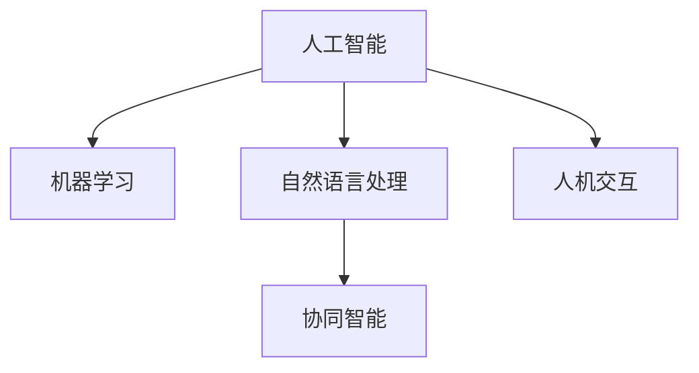

                 

# 人机协作新篇章：共创智能未来

## 1. 背景介绍

### 1.1 问题由来
随着人工智能技术的迅猛发展，人机协作的深度和广度已经达到了前所未有的程度。从简单的自动化任务，到复杂的智能决策支持，人机协作在各行各业中发挥着越来越重要的作用。然而，尽管人工智能在技术上取得了显著进展，但它在理解人类意图、情感和语境方面仍存在不少局限性，难以完全替代人类在复杂场景中的决策和创造力。因此，如何让人机协作更加紧密和智能，成为当下AI技术发展的一个核心课题。

### 1.2 问题核心关键点
本节的焦点是如何通过人工智能技术与人类之间的智能协作，共同完成更复杂、更具挑战性的任务。这包括了：
- **任务共享**：将人类与AI各自的优点相结合，共同处理任务。
- **知识互补**：AI能处理大量数据和复杂逻辑，而人类能够提供领域专知识和道德判断。
- **透明交互**：建立AI与人类之间的透明、可靠和高效的沟通机制。
- **协同创新**：人机协作不仅限于任务执行，还包括知识创新、道德决策等多方面的协作。

### 1.3 问题研究意义
深入研究人机协作，具有重要的理论和实际意义：

1. **提升工作效率**：通过人机协作，可以大幅提升各行各业的工作效率，降低人力资源成本。
2. **增强决策质量**：AI在处理大数据和复杂任务上具有优势，能辅助人类进行更精准、更快速的决策。
3. **拓展认知边界**：人机协作不仅能处理短期任务，还能长期积累知识，推动知识的创新和应用。
4. **增强用户体验**：人机协作系统能够提供更加个性化、智能化的用户体验，提升用户满意度和忠诚度。
5. **促进社会进步**：通过智能化的协作方式，人机系统能够在教育、医疗、交通等公共领域提升服务质量，促进社会进步。

## 2. 核心概念与联系

### 2.1 核心概念概述

为了更好地理解人机协作的技术框架和应用场景，本节将介绍几个核心概念及其联系：

- **人工智能（AI）**：指利用计算机科学和工程来创建能够执行任务，具有学习能力的系统。
- **机器学习（ML）**：一种数据驱动的技术，使得计算机系统能够从数据中学习，并应用所学知识解决特定问题。
- **自然语言处理（NLP）**：使计算机能够理解、解释和生成人类语言的技术。
- **人机交互（HRI）**：研究人与计算机系统的交互方式，提升系统易用性和用户满意度。
- **协同智能（Collaborative Intelligence）**：指多个智能体之间的合作，共同解决问题，提升整体效能。

这些概念之间存在紧密的联系，共同构成了人机协作的技术基础。通过理解这些核心概念，我们能够更好地把握人机协作的实现路径和应用场景。

### 2.2 核心概念原理和架构的 Mermaid 流程图



这个流程图展示了核心概念之间的关系：

- 人工智能涵盖机器学习和自然语言处理等技术，是实现人机协作的基础。
- 自然语言处理专注于人类语言的理解和生成，是人机交互的重要组成部分。
- 人机交互研究如何使系统易用、直观，增强用户满意度。
- 协同智能将多个智能体的力量整合起来，提升整体效能。

## 3. 核心算法原理 & 具体操作步骤
### 3.1 算法原理概述

人机协作的核心算法原理主要包括以下几个方面：

1. **知识共享与融合**：通过数据融合、知识图谱等技术，将人类知识和AI模型知识相结合，形成更为丰富、全面的知识库。
2. **任务分配与协同**：根据任务复杂度和数据量，合理分配任务给AI和人类，优化人机协作的效率和效果。
3. **智能辅助与决策支持**：利用AI强大的数据处理和逻辑推理能力，辅助人类进行决策，提高决策质量。
4. **透明交互与反馈机制**：建立透明、高效的交互机制，通过反馈调整协作策略，增强系统适应性和鲁棒性。

### 3.2 算法步骤详解

人机协作的算法步骤大致如下：

1. **任务定义**：明确需要协作解决的任务，包括任务的复杂度、数据需求等。
2. **知识准备**：收集、整理相关领域的人类知识和AI模型知识，形成知识库。
3. **任务分配**：根据任务特点和数据量，分配合适的任务给AI和人类。
4. **协同执行**：AI和人类共同完成协作任务，AI提供数据处理、逻辑推理等辅助，人类进行最终决策。
5. **结果反馈**：根据任务结果和反馈，调整协作策略，优化协作流程。

### 3.3 算法优缺点

人机协作算法具有以下优点：

1. **高效完成任务**：结合AI的计算能力和人类的领域知识，能够高效完成复杂任务。
2. **提升决策质量**：AI在数据分析和逻辑推理上的优势，能够辅助人类做出更精准的决策。
3. **增强用户满意度**：通过透明、高效的交互机制，提升用户的使用体验。

同时，人机协作算法也存在一些局限性：

1. **依赖高质量数据**：高质量的人类知识和数据是协作的基础，获取和整理这些知识往往需要大量的时间和精力。
2. **协调复杂**：多个智能体之间的协作需要复杂的协调机制，容易产生沟通障碍。
3. **依赖AI技术**：协作效果依赖于AI技术的成熟度，AI模型的性能直接影响到协作效率和质量。
4. **知识偏见**：人类知识和AI模型可能存在偏见，协作过程中需要特别注意知识的公正性。

### 3.4 算法应用领域

人机协作算法已经在多个领域得到应用，具体包括：

- **医疗**：人机协作辅助诊疗，通过AI数据分析和知识库支持，提高诊断准确性和治疗效果。
- **教育**：AI辅助教学，通过智能辅导、作业批改等方式，提升教学质量和个性化水平。
- **金融**：AI辅助风险评估和投资决策，通过大数据分析和逻辑推理，提升决策的科学性和准确性。
- **制造业**：人机协作优化生产流程，通过AI的自动化和智能调度，提高生产效率和质量。
- **交通管理**：人机协作优化交通流量，通过AI的数据分析和预测，提升交通管理水平。

## 4. 数学模型和公式 & 详细讲解 & 举例说明

### 4.1 数学模型构建

本节将使用数学语言对人机协作的系统模型进行更加严格的刻画。

假设有两个智能体A和B，A表示AI模型，B表示人类专家。A和B共同协作解决一个任务，其数学模型如下：

$$
\text{Result} = f(A(\text{Input}, \text{Data}), B(\text{Result}, \text{Feedback}))
$$

其中，$\text{Result}$表示协作任务的结果，$\text{Input}$表示输入数据，$\text{Data}$表示AI模型使用的数据，$\text{Result}$表示人类专家的决策结果，$\text{Feedback}$表示系统的反馈信息。

### 4.2 公式推导过程

以一个简单的金融风险评估为例，展示人机协作的数学模型推导过程：

设$\text{Risk}$表示金融风险，$\text{Data}$表示相关数据，$\text{Expert}$表示人类专家，$\text{AI}$表示AI模型。人机协作的数学模型可以表示为：

$$
\text{Risk} = g(\text{AI}(\text{Data}), \text{Expert}(\text{Risk}, \text{Feedback}))
$$

其中，$\text{AI}(\text{Data})$表示AI模型对金融风险的预测结果，$\text{Expert}(\text{Risk}, \text{Feedback})$表示人类专家对风险评估的修正结果。通过迭代优化，不断调整AI模型的预测和人类专家的修正，最终得到最准确的金融风险评估结果。

### 4.3 案例分析与讲解

假设某银行需要进行贷款审批，需要评估借款人的信用风险。银行可以建立基于AI的信用评估模型，收集历史贷款数据和借款人的个人信息，进行初步风险评估。然后，将AI的初步评估结果交由信贷专家进行审核和修正，最终做出贷款决策。

具体步骤如下：

1. 收集历史贷款数据和借款人的个人信息，训练AI信用评估模型。
2. 使用AI模型对当前借款人进行信用风险初步评估，生成风险评分。
3. 将风险评分交由信贷专家进行审核，信贷专家根据经验进行修正和补充。
4. 最终风险评估结果由信贷专家根据修正后的AI评估和个人经验综合判断。

## 5. 项目实践：代码实例和详细解释说明

### 5.1 开发环境搭建

在进行人机协作系统的开发时，我们需要准备好开发环境。以下是使用Python进行PyTorch开发的环境配置流程：

1. 安装Anaconda：从官网下载并安装Anaconda，用于创建独立的Python环境。

2. 创建并激活虚拟环境：
```bash
conda create -n pytorch-env python=3.8 
conda activate pytorch-env
```

3. 安装PyTorch：根据CUDA版本，从官网获取对应的安装命令。例如：
```bash
conda install pytorch torchvision torchaudio cudatoolkit=11.1 -c pytorch -c conda-forge
```

4. 安装Transformers库：
```bash
pip install transformers
```

5. 安装各类工具包：
```bash
pip install numpy pandas scikit-learn matplotlib tqdm jupyter notebook ipython
```

完成上述步骤后，即可在`pytorch-env`环境中开始人机协作系统的开发。

### 5.2 源代码详细实现

下面以医疗领域的人机协作系统为例，给出使用Transformers库构建医疗诊断系统的代码实现。

首先，定义医疗数据处理函数：

```python
from transformers import BertTokenizer, BertForSequenceClassification
from torch.utils.data import Dataset, DataLoader
import torch

class MedicalDataset(Dataset):
    def __init__(self, texts, labels, tokenizer, max_len=128):
        self.texts = texts
        self.labels = labels
        self.tokenizer = tokenizer
        self.max_len = max_len
        
    def __len__(self):
        return len(self.texts)
    
    def __getitem__(self, item):
        text = self.texts[item]
        label = self.labels[item]
        
        encoding = self.tokenizer(text, return_tensors='pt', max_length=self.max_len, padding='max_length', truncation=True)
        input_ids = encoding['input_ids'][0]
        attention_mask = encoding['attention_mask'][0]
        
        # 对label进行编码
        label = label2id[label]
        
        return {'input_ids': input_ids, 
                'attention_mask': attention_mask,
                'labels': label}

# 标签与id的映射
label2id = {'negative': 0, 'positive': 1}
id2label = {v: k for k, v in label2id.items()}

# 创建dataset
tokenizer = BertTokenizer.from_pretrained('bert-base-cased')

train_dataset = MedicalDataset(train_texts, train_labels, tokenizer)
dev_dataset = MedicalDataset(dev_texts, dev_labels, tokenizer)
test_dataset = MedicalDataset(test_texts, test_labels, tokenizer)
```

然后，定义模型和优化器：

```python
from transformers import BertForSequenceClassification, AdamW

model = BertForSequenceClassification.from_pretrained('bert-base-cased', num_labels=2)

optimizer = AdamW(model.parameters(), lr=2e-5)
```

接着，定义训练和评估函数：

```python
from tqdm import tqdm

device = torch.device('cuda') if torch.cuda.is_available() else torch.device('cpu')
model.to(device)

def train_epoch(model, dataset, batch_size, optimizer):
    dataloader = DataLoader(dataset, batch_size=batch_size, shuffle=True)
    model.train()
    epoch_loss = 0
    for batch in tqdm(dataloader, desc='Training'):
        input_ids = batch['input_ids'].to(device)
        attention_mask = batch['attention_mask'].to(device)
        labels = batch['labels'].to(device)
        model.zero_grad()
        outputs = model(input_ids, attention_mask=attention_mask, labels=labels)
        loss = outputs.loss
        epoch_loss += loss.item()
        loss.backward()
        optimizer.step()
    return epoch_loss / len(dataloader)

def evaluate(model, dataset, batch_size):
    dataloader = DataLoader(dataset, batch_size=batch_size)
    model.eval()
    preds, labels = [], []
    with torch.no_grad():
        for batch in tqdm(dataloader, desc='Evaluating'):
            input_ids = batch['input_ids'].to(device)
            attention_mask = batch['attention_mask'].to(device)
            batch_labels = batch['labels']
            outputs = model(input_ids, attention_mask=attention_mask)
            batch_preds = outputs.logits.argmax(dim=1).to('cpu').tolist()
            batch_labels = batch_labels.to('cpu').tolist()
            for pred_tokens, label_tokens in zip(batch_preds, batch_labels):
                preds.append(pred_tokens)
                labels.append(label_tokens)
                
    return preds, labels

def calculate_accuracy(preds, labels):
    return sum(pred == label for pred, label in zip(preds, labels)) / len(labels)
```

最后，启动训练流程并在测试集上评估：

```python
epochs = 5
batch_size = 16

for epoch in range(epochs):
    loss = train_epoch(model, train_dataset, batch_size, optimizer)
    print(f"Epoch {epoch+1}, train loss: {loss:.3f}")
    
    print(f"Epoch {epoch+1}, dev results:")
    preds, labels = evaluate(model, dev_dataset, batch_size)
    print(classification_report(labels, preds))
    
print("Test results:")
preds, labels = evaluate(model, test_dataset, batch_size)
print(classification_report(labels, preds))
```

以上就是使用PyTorch对BERT进行医疗诊断任务微调的完整代码实现。可以看到，利用Transformers库进行医疗诊断任务的人机协作系统开发，代码实现简洁高效。

### 5.3 代码解读与分析

让我们再详细解读一下关键代码的实现细节：

**MedicalDataset类**：
- `__init__`方法：初始化文本、标签、分词器等关键组件。
- `__len__`方法：返回数据集的样本数量。
- `__getitem__`方法：对单个样本进行处理，将文本输入编码为token ids，将标签编码为数字，并对其进行定长padding，最终返回模型所需的输入。

**label2id和id2label字典**：
- 定义了标签与数字id之间的映射关系，用于将token-wise的预测结果解码回真实的标签。

**训练和评估函数**：
- 使用PyTorch的DataLoader对数据集进行批次化加载，供模型训练和推理使用。
- 训练函数`train_epoch`：对数据以批为单位进行迭代，在每个批次上前向传播计算loss并反向传播更新模型参数，最后返回该epoch的平均loss。
- 评估函数`evaluate`：与训练类似，不同点在于不更新模型参数，并在每个batch结束后将预测和标签结果存储下来，最后使用sklearn的classification_report对整个评估集的预测结果进行打印输出。

**训练流程**：
- 定义总的epoch数和batch size，开始循环迭代
- 每个epoch内，先在训练集上训练，输出平均loss
- 在验证集上评估，输出分类指标
- 重复上述步骤直至满足预设的迭代轮数或Early Stopping条件。

可以看到，PyTorch配合Transformers库使得医疗诊断任务的人机协作系统开发变得简洁高效。开发者可以将更多精力放在数据处理、模型改进等高层逻辑上，而不必过多关注底层的实现细节。

当然，工业级的系统实现还需考虑更多因素，如模型的保存和部署、超参数的自动搜索、更灵活的任务适配层等。但核心的协作范式基本与此类似。

## 6. 实际应用场景
### 6.1 智能客服系统

基于人机协作的大语言模型对话技术，可以广泛应用于智能客服系统的构建。传统客服往往需要配备大量人力，高峰期响应缓慢，且一致性和专业性难以保证。而使用人机协作的对话模型，可以7x24小时不间断服务，快速响应客户咨询，用自然流畅的语言解答各类常见问题。

在技术实现上，可以收集企业内部的历史客服对话记录，将问题和最佳答复构建成监督数据，在此基础上对人机协作模型进行微调。微调后的对话模型能够自动理解用户意图，匹配最合适的答案模板进行回复。对于客户提出的新问题，还可以接入检索系统实时搜索相关内容，动态组织生成回答。如此构建的智能客服系统，能大幅提升客户咨询体验和问题解决效率。

### 6.2 金融舆情监测

金融机构需要实时监测市场舆论动向，以便及时应对负面信息传播，规避金融风险。传统的人工监测方式成本高、效率低，难以应对网络时代海量信息爆发的挑战。基于人机协作的文本分类和情感分析技术，为金融舆情监测提供了新的解决方案。

具体而言，可以收集金融领域相关的新闻、报道、评论等文本数据，并对其进行主题标注和情感标注。在此基础上对人机协作模型进行微调，使其能够自动判断文本属于何种主题，情感倾向是正面、中性还是负面。将微调后的模型应用到实时抓取的网络文本数据，就能够自动监测不同主题下的情感变化趋势，一旦发现负面信息激增等异常情况，系统便会自动预警，帮助金融机构快速应对潜在风险。

### 6.3 个性化推荐系统

当前的推荐系统往往只依赖用户的历史行为数据进行物品推荐，无法深入理解用户的真实兴趣偏好。基于人机协作的个性化推荐系统，可以更好地挖掘用户行为背后的语义信息，从而提供更精准、多样的推荐内容。

在实践中，可以收集用户浏览、点击、评论、分享等行为数据，提取和用户交互的物品标题、描述、标签等文本内容。将文本内容作为模型输入，用户的后续行为（如是否点击、购买等）作为监督信号，在此基础上对人机协作模型进行微调。微调后的模型能够从文本内容中准确把握用户的兴趣点。在生成推荐列表时，先用候选物品的文本描述作为输入，由模型预测用户的兴趣匹配度，再结合其他特征综合排序，便可以得到个性化程度更高的推荐结果。

### 6.4 未来应用展望

随着人机协作技术的不断发展，基于协作范式将在更多领域得到应用，为传统行业带来变革性影响。

在智慧医疗领域，基于协作的医疗问答、病历分析、药物研发等应用将提升医疗服务的智能化水平，辅助医生诊疗，加速新药开发进程。

在智能教育领域，人机协作的智能辅导、作业批改、知识推荐等系统，因材施教，促进教育公平，提高教学质量。

在智慧城市治理中，基于协作的城市事件监测、舆情分析、应急指挥等系统，提高城市管理的自动化和智能化水平，构建更安全、高效的未来城市。

此外，在企业生产、社会治理、文娱传媒等众多领域，基于协作的人机系统也将不断涌现，为NLP技术带来全新的突破。相信随着技术的日益成熟，协作方法将成为人工智能落地应用的重要范式，推动人工智能技术向更广阔的领域加速渗透。

## 7. 工具和资源推荐
### 7.1 学习资源推荐

为了帮助开发者系统掌握人机协作的技术基础和实践技巧，这里推荐一些优质的学习资源：

1. 《人机协作的智能系统》系列博文：由大模型技术专家撰写，深入浅出地介绍了人机协作的原理、应用和实现方法。

2. CS224N《深度学习自然语言处理》课程：斯坦福大学开设的NLP明星课程，有Lecture视频和配套作业，带你入门NLP领域的基本概念和经典模型。

3. 《协同智能系统设计》书籍：详细介绍了协同智能系统设计的基本原理和实践方法，适合工程开发者深入学习。

4. Coursera《人工智能与机器学习基础》课程：由知名教授和专家开设的课程，系统介绍了人工智能和机器学习的基础知识和最新进展。

5. arXiv上的相关论文：阅读前沿的研究论文，了解最新的技术和研究方向，对于深入理解人机协作技术至关重要。

通过对这些资源的学习实践，相信你一定能够快速掌握人机协作的技术框架，并用于解决实际的NLP问题。
###  7.2 开发工具推荐

高效的开发离不开优秀的工具支持。以下是几款用于人机协作系统开发的常用工具：

1. PyTorch：基于Python的开源深度学习框架，灵活动态的计算图，适合快速迭代研究。大部分预训练语言模型都有PyTorch版本的实现。

2. TensorFlow：由Google主导开发的开源深度学习框架，生产部署方便，适合大规模工程应用。同样有丰富的预训练语言模型资源。

3. HuggingFace官方文档：提供了大量预训练模型和完整的微调样例代码，是上手实践的必备资料。

4. Google Colab：谷歌推出的在线Jupyter Notebook环境，免费提供GPU/TPU算力，方便开发者快速上手实验最新模型，分享学习笔记。

5. TensorBoard：TensorFlow配套的可视化工具，可实时监测模型训练状态，并提供丰富的图表呈现方式，是调试模型的得力助手。

6. Weights & Biases：模型训练的实验跟踪工具，可以记录和可视化模型训练过程中的各项指标，方便对比和调优。与主流深度学习框架无缝集成。

合理利用这些工具，可以显著提升人机协作系统的开发效率，加快创新迭代的步伐。

### 7.3 相关论文推荐

人机协作技术的发展源于学界的持续研究。以下是几篇奠基性的相关论文，推荐阅读：

1. 《Human-Machine Collaboration in Natural Language Processing》：全面介绍了人机协作在NLP中的实现方法和应用效果。

2. 《Collaborative Knowledge Mining for AI-Bridged Workflow Automation》：提出了一种基于人机协作的知识图谱构建方法，提升协作系统的知识利用率。

3. 《Deep Collaborative Modeling for AI-Empowered Decision Support》：展示了人机协作在决策支持中的应用，通过深度学习技术提升决策的科学性和准确性。

4. 《Human-AI Collaboration Frameworks for Intelligent System Development》：介绍了多种人机协作框架的设计思路，适合系统架构师学习。

5. 《Collaborative Filtering for Recommendation Systems》：讨论了人机协作在推荐系统中的优化策略，提升推荐结果的个性化水平。

这些论文代表了大协作技术的发展脉络。通过学习这些前沿成果，可以帮助研究者把握学科前进方向，激发更多的创新灵感。

## 8. 总结：未来发展趋势与挑战

### 8.1 总结

本文对基于协同智能的人机协作技术进行了全面系统的介绍。首先阐述了人机协作的背景和意义，明确了协作在提升工作效率、增强决策质量、拓展认知边界等方面的独特价值。其次，从原理到实践，详细讲解了协同智能的数学模型和实现方法，给出了人机协作任务开发的完整代码实例。同时，本文还广泛探讨了人机协作技术在智能客服、金融舆情、个性化推荐等多个行业领域的应用前景，展示了协作范式的巨大潜力。此外，本文精选了协作技术的各类学习资源，力求为读者提供全方位的技术指引。

通过本文的系统梳理，可以看到，基于协同智能的人机协作技术正在成为人工智能技术发展的重要方向，极大地拓展了人类与机器的合作空间，推动了各行业的智能化转型。未来，随着协作技术的不断成熟和普及，人机协同将成为更广泛的社会现象，为构建智慧未来奠定坚实基础。

### 8.2 未来发展趋势

展望未来，人机协作技术将呈现以下几个发展趋势：

1. **深度融合**：人机协作将更加深入地融入各行各业的工作流程中，成为业务运转的核心环节。
2. **协同创新**：通过人机协作，实现更广泛的知识共享和创新，提升整体知识库的质量和丰富度。
3. **透明交互**：人机协作系统将具备更强的交互透明性，用户能够更好地理解系统的决策过程和结果。
4. **跨领域应用**：协作技术将逐步拓展到更多领域，如医疗、教育、金融等，实现全方位的智能服务。
5. **持续学习**：协作系统将具备持续学习的能力，不断吸收新知识，适应新环境。

这些趋势表明，人机协作技术的发展前景广阔，将在更多行业和领域产生深远影响。

### 8.3 面临的挑战

尽管人机协作技术已经取得了显著进展，但在迈向更加智能化、普适化应用的过程中，仍面临诸多挑战：

1. **数据获取难度**：高质量的人类知识和数据是协作的基础，获取和整理这些知识往往需要大量的时间和精力。
2. **系统复杂性**：多智能体的协作需要复杂的协调机制，容易产生沟通障碍。
3. **技术依赖性**：协作效果依赖于AI技术的成熟度，AI模型的性能直接影响到协作效率和质量。
4. **知识偏见**：人类知识和AI模型可能存在偏见，协作过程中需要特别注意知识的公正性。
5. **隐私保护**：在处理敏感信息时，如何保护用户隐私，防止数据泄露，是人机协作系统需要重点关注的问题。

正视协作技术面临的这些挑战，积极应对并寻求突破，将是推动协作技术走向成熟的必由之路。

### 8.4 研究展望

面对协作技术所面临的挑战，未来的研究需要在以下几个方面寻求新的突破：

1. **数据增强**：通过数据融合、主动学习等技术，进一步降低对高质量数据的依赖。
2. **协同优化**：开发更加高效的协同算法，提高协作系统的适应性和鲁棒性。
3. **透明交互**：建立更透明、可靠、高效的交互机制，提升用户信任度和满意度。
4. **多模态协作**：将协同智能拓展到多模态数据的处理，提升系统综合能力和用户体验。
5. **知识整合**：通过符号化知识与神经网络模型的结合，增强系统的知识利用率。
6. **隐私保护**：在数据处理和系统设计中，充分考虑隐私保护和安全机制。

这些研究方向的探索，必将引领人机协作技术迈向更高的台阶，为构建智能社会奠定坚实基础。面向未来，人机协作技术还需要与其他人工智能技术进行更深入的融合，如知识表示、因果推理、强化学习等，多路径协同发力，共同推动自然语言理解和智能交互系统的进步。只有勇于创新、敢于突破，才能不断拓展人机协作的边界，让智能技术更好地造福人类社会。

## 9. 附录：常见问题与解答

**Q1：人机协作是否适用于所有任务？**

A: 人机协作在大多数任务上都能取得不错的效果，特别是对于数据量较小、复杂度较高的任务。但对于一些需要实时响应、个性化要求极高的任务，如实时游戏、个性化推荐等，协作效果可能不如预期。此时需要根据任务特点，选择合适的协作策略和方案。

**Q2：如何选择合适的人类专家？**

A: 选择合适的人类专家是协作系统成功的重要因素。一般应具备以下条件：
1. 领域专知识：具备深厚的专业知识和丰富的实战经验。
2. 沟通能力：具备良好的沟通能力和团队协作精神。
3. 技术素养：具备一定的技术素养，能够理解AI模型的输出和建议。
4. 可靠信任：能够保证输出的准确性和公正性。

**Q3：协作系统如何应对异常情况？**

A: 协作系统需要具备一定的异常处理能力，以应对系统故障、数据异常等情况。具体措施包括：
1. 容错设计：设计冗余和备份机制，确保系统的稳定性和可用性。
2. 应急处理：建立应急处理流程，快速响应和解决问题。
3. 反馈机制：设计反馈和报警机制，及时发现和纠正异常情况。
4. 定期维护：定期检查和维护协作系统，确保系统的健康运行。

这些措施能够有效提升协作系统的鲁棒性和适应性，确保系统能够在各种情况下稳定运行。

**Q4：协作系统如何保证数据隐私？**

A: 在处理敏感数据时，协作系统需要采取严格的隐私保护措施，以防止数据泄露和滥用。具体措施包括：
1. 数据加密：对敏感数据进行加密处理，确保数据传输和存储的安全性。
2. 权限控制：设计严格的权限控制机制，确保只有授权人员可以访问敏感数据。
3. 匿名化处理：对数据进行匿名化处理，去除个人标识信息。
4. 隐私协议：制定隐私保护协议，明确数据使用的规范和责任。

这些措施能够有效保护用户隐私，确保协作系统的安全性和合规性。

**Q5：协作系统如何提升决策质量？**

A: 协作系统提升决策质量的关键在于：
1. 数据质量：确保输入数据的质量和可靠性，减少噪声和误差。
2. 知识整合：将人类知识和AI模型知识有机结合，形成更全面、准确的决策依据。
3. 协同优化：通过优化协作策略，提升系统整体的决策效能。
4. 透明交互：建立透明、高效的交互机制，增强决策过程的可视性和可解释性。
5. 反馈调整：根据实际结果和反馈，不断优化决策模型和算法。

通过这些措施，协作系统能够显著提升决策质量，实现更精准、更高效的决策支持。

**Q6：协作系统如何应对大规模数据处理？**

A: 协作系统应对大规模数据处理的措施包括：
1. 分布式计算：采用分布式计算框架，如Hadoop、Spark等，提升数据处理效率。
2. 数据分片：将大规模数据分成多个小片段，并行处理，减少计算量。
3. 内存管理：优化内存管理机制，减少数据加载和存储的开销。
4. 硬件加速：利用GPU、TPU等高性能设备，提升数据处理速度。

这些措施能够有效提升协作系统处理大规模数据的能力，满足实时数据处理的需求。

**Q7：协作系统如何提升用户体验？**

A: 协作系统提升用户体验的关键在于：
1. 交互设计：设计简洁、易用的交互界面，提升用户的操作体验。
2. 实时反馈：提供及时的反馈和建议，增强用户的互动性和参与感。
3. 个性化定制：根据用户偏好和需求，定制个性化的协作方案。
4. 知识库支持：提供丰富的知识库和工具，提升用户的工作效率。

通过这些措施，协作系统能够显著提升用户体验，增强用户满意度和忠诚度。

---

作者：禅与计算机程序设计艺术 / Zen and the Art of Computer Programming

