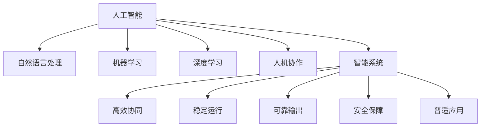

                 

# 人机协作新篇章：共创智能未来新时代

> 关键词：人机协作, 智能未来, 人工智能, 技术创新, 应用落地, 未来趋势, 挑战与机遇

## 1. 背景介绍

### 1.1 问题由来

随着人工智能技术的快速发展，人机协作已经成为新时代的重要主题。人工智能通过算法和模型模拟人类的智能行为，而人则通过经验、情感等软技能与机器进行协同工作。这一模式正逐步渗透到生产、生活各个领域，改变着人们的思考方式和工作方式。

在医疗、教育、制造、金融等垂直行业中，人工智能的普及正在带来颠覆性变革。智能机器人、自动化流程、智能推荐系统等新技术的应用，不仅提升了生产效率，还优化了用户体验。然而，人工智能系统的复杂性和不确定性，也带来了新的挑战。如何通过技术创新和优化算法，确保人工智能系统的可靠性和安全性，已经成为行业共同关注的问题。

### 1.2 问题核心关键点

人机协作的焦点在于如何构建高效、稳定、可靠的技术系统。具体关键点包括：

- **高效协同**：如何通过算法设计，让机器高效执行重复性、标准化任务，同时保留人类的复杂决策能力，共同解决创新性和非标准化问题。
- **稳定运行**：如何确保系统的稳定性和鲁棒性，避免误操作和突发故障，在不可预见的环境中提供连续性服务。
- **可靠输出**：如何增强系统的可解释性和可控性，让人类能够理解机器的行为，并在必要时进行干预和纠正。
- **安全保障**：如何建立系统的安全性机制，防范恶意攻击、数据泄露、隐私侵犯等风险，确保用户数据和模型的安全。
- **普适应用**：如何开发通用的技术框架和工具，支持不同行业、不同规模的应用场景，实现广泛落地。

## 2. 核心概念与联系

### 2.1 核心概念概述

为更好地理解人机协作的原理和架构，本节将介绍几个核心概念及其相互关系：

- **人工智能**：通过机器学习、深度学习等算法实现的一种模拟人类智能行为的技术。
- **自然语言处理(NLP)**：让计算机理解、处理和生成人类语言的技术，是人机协作中的重要工具。
- **机器学习**：通过数据训练模型，使其能够进行预测、分类、聚类等任务，是人工智能的核心技术之一。
- **深度学习**：一种基于神经网络的机器学习技术，能够处理大规模非结构化数据，实现复杂的模式识别和决策。
- **人机协作**：人类和机器在智能系统中分工合作，共同完成任务的过程。
- **智能系统**：结合人工智能、自然语言处理、机器学习等技术，实现自动化的技术系统。

这些概念之间的逻辑关系可以通过以下Mermaid流程图来展示：



这个流程图展示了几大核心概念及其相互关系：

1. 人工智能通过多种技术手段实现智能行为，自然语言处理是其重要组成部分。
2. 机器学习是实现人工智能的基石，深度学习则是机器学习的一种高级形式。
3. 人机协作是指人类和机器在智能系统中分工合作，共同完成任务。
4. 智能系统是结合多种技术的综合应用，实现自动化的技术系统。
5. 智能系统具备高效协同、稳定运行、可靠输出、安全保障和普适应用等多重特性。

这些概念共同构成了人机协作的核心理论框架，为人机协作系统的发展提供了方向和指导。

## 3. 核心算法原理 & 具体操作步骤

### 3.1 算法原理概述

人机协作的算法原理基于人工智能和自然语言处理的深度融合。通过构建智能模型，让机器在处理大量数据时具备人类智能行为，同时利用人类经验对机器输出进行指导和优化。

具体而言，人机协作的算法设计包括以下几个关键步骤：

1. **数据预处理**：收集和标注相关领域的数据，构建训练集、验证集和测试集，为模型训练和评估提供数据基础。
2. **模型训练**：选择适合的算法和模型架构，如深度神经网络、Transformer等，在大量数据上训练模型，学习语言表示和任务规则。
3. **模型优化**：通过超参数调优和正则化技术，提升模型性能，避免过拟合和欠拟合问题。
4. **任务适配**：针对具体任务，设计特定的输出层和损失函数，适应任务需求。
5. **模型微调**：在特定领域的数据上微调预训练模型，提升模型在特定任务上的性能。
6. **模型集成**：将多个模型的输出进行融合，提升系统鲁棒性和泛化能力。
7. **人机交互**：设计用户界面和交互机制，让人类能够轻松使用和监控系统。

### 3.2 算法步骤详解

以下是人机协作系统的关键步骤及其具体操作步骤：

**Step 1: 数据预处理**

- 收集相关领域的数据，如医疗领域的病历数据、教育领域的课程记录、金融领域的交易数据等。
- 清洗数据，去除噪声和错误，处理缺失值和异常值。
- 对文本数据进行分词、向量化、标注等预处理操作，构建训练集、验证集和测试集。

**Step 2: 模型训练**

- 选择适合的模型架构，如深度神经网络、Transformer等。
- 在大量数据上训练模型，学习语言表示和任务规则。
- 使用GPU/TPU等高性能设备进行加速，提高训练效率。

**Step 3: 模型优化**

- 通过超参数调优，如学习率、批大小、迭代轮数等，提升模型性能。
- 使用正则化技术，如L2正则、Dropout等，防止过拟合。
- 应用模型评估指标，如准确率、召回率、F1分数等，评估模型效果。

**Step 4: 任务适配**

- 根据具体任务，设计特定的输出层和损失函数。
- 对于分类任务，使用交叉熵损失函数；对于回归任务，使用均方误差损失函数。
- 对于多标签分类任务，使用二分类交叉熵损失函数。

**Step 5: 模型微调**

- 在特定领域的数据上微调预训练模型，提升模型在特定任务上的性能。
- 选择合适的学习率，避免破坏预训练权重。
- 使用数据增强技术，丰富训练集多样性，提高模型泛化能力。

**Step 6: 模型集成**

- 将多个模型的输出进行融合，如投票、加权平均等，提升系统鲁棒性和泛化能力。
- 使用集成学习技术，如Bagging、Boosting等，提高系统性能。

**Step 7: 人机交互**

- 设计用户界面和交互机制，让人类能够轻松使用和监控系统。
- 使用自然语言处理技术，如聊天机器人、语音识别等，提升人机交互体验。

### 3.3 算法优缺点

人机协作系统具有以下优点：

1. **高效协同**：通过算法设计，让机器高效执行重复性、标准化任务，同时保留人类的复杂决策能力，共同解决创新性和非标准化问题。
2. **稳定运行**：利用模型的泛化能力，确保系统的稳定性和鲁棒性，避免误操作和突发故障，在不可预见的环境中提供连续性服务。
3. **可靠输出**：通过模型的可解释性和可控性，增强系统的可解释性和可控性，让人类能够理解机器的行为，并在必要时进行干预和纠正。
4. **安全保障**：建立系统的安全性机制，防范恶意攻击、数据泄露、隐私侵犯等风险，确保用户数据和模型的安全。
5. **普适应用**：开发通用的技术框架和工具，支持不同行业、不同规模的应用场景，实现广泛落地。

同时，该系统也存在一些局限性：

1. **数据依赖**：系统效果很大程度上依赖于数据的质量和数量，获取高质量数据的成本较高。
2. **泛化能力有限**：当目标任务与训练数据的分布差异较大时，系统的泛化能力有限。
3. **可解释性不足**：复杂模型的决策过程通常缺乏可解释性，难以对其推理逻辑进行分析和调试。
4. **伦理风险**：预训练模型的固有偏见、有害信息等，可能通过微调传递到下游任务，造成负面影响。

尽管存在这些局限性，但人机协作系统在提升工作效率、优化用户体验、增强决策支持等方面的优势显著，具有广阔的应用前景。

### 3.4 算法应用领域

人机协作系统已经在医疗、教育、制造、金融等众多领域得到广泛应用，具体包括：

1. **医疗领域**：通过智能机器人、诊断系统、健康监测设备等，提升诊疗效率和准确性。
2. **教育领域**：利用智能推荐系统、智能作业批改、智能教师助理等，优化教学效果和学生学习体验。
3. **制造领域**：使用自动化流程、智能检测设备、预测性维护系统等，提升生产效率和产品质量。
4. **金融领域**：通过智能推荐系统、风险预警系统、自动化交易系统等，优化投资决策和风险管理。
5. **智能客服**：利用聊天机器人、语音识别、自然语言处理等技术，提升客户服务质量。
6. **智能家居**：通过智能设备和语音助手，提升居家生活便利性和安全性。

这些应用场景展示了人机协作系统的强大潜力，预示着未来人机协作在更多领域的应用前景。

## 4. 数学模型和公式 & 详细讲解

### 4.1 数学模型构建

人机协作系统的数学模型构建主要包括以下几个部分：

1. **数据表示**：将输入数据表示为向量形式，如文本数据的TF-IDF表示，图像数据的像素向量表示等。
2. **模型定义**：选择适合的模型架构，如深度神经网络、Transformer等，定义模型的输入、输出和损失函数。
3. **优化目标**：定义模型的优化目标，如最小化损失函数，最大化准确率等。
4. **优化算法**：选择适合的优化算法，如梯度下降、Adam等，优化模型参数。

以深度神经网络为例，其数学模型构建如下：

**输入层**：将输入数据表示为向量形式，如文本数据的TF-IDF表示，图像数据的像素向量表示等。

**隐藏层**：定义多层神经元，进行特征提取和转换，如：
$$
z_l = W_lx + b_l, \quad a_l = \sigma(z_l)
$$
其中 $z_l$ 表示神经元的输入向量，$W_l$ 和 $b_l$ 表示权重和偏置，$\sigma$ 表示激活函数。

**输出层**：定义输出向量，如：
$$
z_O = W_Oz_l + b_O, \quad a_O = \sigma(z_O)
$$
其中 $z_O$ 表示输出向量的输入，$W_O$ 和 $b_O$ 表示权重和偏置，$\sigma$ 表示激活函数。

**损失函数**：定义模型的损失函数，如：
$$
\mathcal{L}(y, \hat{y}) = \frac{1}{N} \sum_{i=1}^N \ell(y_i, \hat{y_i})
$$
其中 $y$ 表示真实标签，$\hat{y}$ 表示模型输出，$\ell$ 表示损失函数，如交叉熵损失函数：
$$
\ell(y, \hat{y}) = -\frac{1}{N}\sum_{i=1}^N [y_i\log \hat{y_i} + (1-y_i)\log(1-\hat{y_i})]
$$

**优化算法**：选择适合的优化算法，如梯度下降：
$$
\theta \leftarrow \theta - \eta \nabla_{\theta}\mathcal{L}(\theta)
$$
其中 $\theta$ 表示模型参数，$\eta$ 表示学习率，$\nabla_{\theta}\mathcal{L}(\theta)$ 表示损失函数对参数的梯度。

### 4.2 公式推导过程

以深度神经网络为例，其优化过程推导如下：

1. **输入层**：将输入数据表示为向量形式：
$$
z_0 = [x_1, x_2, ..., x_n]
$$

2. **隐藏层**：定义多层神经元，进行特征提取和转换：
$$
z_l = W_lz_{l-1} + b_l, \quad a_l = \sigma(z_l)
$$
其中 $z_l$ 表示第 $l$ 层的输入向量，$W_l$ 和 $b_l$ 表示权重和偏置，$\sigma$ 表示激活函数。

3. **输出层**：定义输出向量：
$$
z_O = W_Oz_l + b_O, \quad a_O = \sigma(z_O)
$$
其中 $z_O$ 表示输出向量的输入，$W_O$ 和 $b_O$ 表示权重和偏置，$\sigma$ 表示激活函数。

4. **损失函数**：定义模型的损失函数：
$$
\mathcal{L}(y, \hat{y}) = \frac{1}{N} \sum_{i=1}^N \ell(y_i, \hat{y_i})
$$
其中 $y$ 表示真实标签，$\hat{y}$ 表示模型输出，$\ell$ 表示损失函数，如交叉熵损失函数：
$$
\ell(y, \hat{y}) = -\frac{1}{N}\sum_{i=1}^N [y_i\log \hat{y_i} + (1-y_i)\log(1-\hat{y_i})]
$$

5. **优化算法**：选择适合的优化算法，如梯度下降：
$$
\theta \leftarrow \theta - \eta \nabla_{\theta}\mathcal{L}(\theta)
$$
其中 $\theta$ 表示模型参数，$\eta$ 表示学习率，$\nabla_{\theta}\mathcal{L}(\theta)$ 表示损失函数对参数的梯度。

通过上述公式，可以构建深度神经网络模型，并通过梯度下降等优化算法进行训练。

### 4.3 案例分析与讲解

以自然语言处理中的情感分析为例，具体步骤如下：

1. **数据预处理**：收集和标注相关领域的情感数据，构建训练集、验证集和测试集。

2. **模型训练**：选择深度神经网络作为模型架构，定义输入层、隐藏层和输出层，进行特征提取和转换。

3. **模型优化**：通过超参数调优和正则化技术，提升模型性能，避免过拟合和欠拟合问题。

4. **任务适配**：定义输出层和损失函数，针对情感分析任务，使用二分类交叉熵损失函数。

5. **模型微调**：在特定领域的数据上微调预训练模型，提升模型在情感分析上的性能。

6. **模型集成**：将多个模型的输出进行融合，提升系统鲁棒性和泛化能力。

7. **人机交互**：设计用户界面和交互机制，让人类能够轻松使用和监控系统。

通过以上步骤，可以构建高效的情感分析系统，提升情感识别的准确性和实时性。

## 5. 项目实践：代码实例和详细解释说明

### 5.1 开发环境搭建

在进行项目实践前，我们需要准备好开发环境。以下是使用Python进行PyTorch开发的环境配置流程：

1. 安装Anaconda：从官网下载并安装Anaconda，用于创建独立的Python环境。

2. 创建并激活虚拟环境：
```bash
conda create -n pytorch-env python=3.8 
conda activate pytorch-env
```

3. 安装PyTorch：根据CUDA版本，从官网获取对应的安装命令。例如：
```bash
conda install pytorch torchvision torchaudio cudatoolkit=11.1 -c pytorch -c conda-forge
```

4. 安装TensorFlow：
```bash
pip install tensorflow
```

5. 安装TensorBoard：
```bash
pip install tensorboard
```

6. 安装GitHub：
```bash
pip install git
```

7. 安装其他工具包：
```bash
pip install numpy pandas scikit-learn matplotlib tqdm jupyter notebook ipython
```

完成上述步骤后，即可在`pytorch-env`环境中开始项目实践。

### 5.2 源代码详细实现

这里我们以情感分析项目为例，给出使用PyTorch和TensorFlow进行深度神经网络模型开发的代码实现。

首先，定义情感分析的数据处理函数：

```python
import torch
from torchtext import data, datasets

# 定义数据字段
TEXT = data.Field(tokenize='spacy', include_lengths=True)
LABEL = data.LabelField()

# 加载数据集
train_data, test_data = datasets.IMDB.splits(TEXT, LABEL)

# 构建词汇表
TEXT.build_vocab(train_data, max_size=10000)

# 定义训练和验证集
train_data, valid_data = train_data.split(random_state=random.seed(1234))
```

然后，定义模型和优化器：

```python
import torch.nn as nn
import torch.optim as optim

# 定义模型
class RNN(nn.Module):
    def __init__(self, input_size, hidden_size, output_size):
        super(RNN, self).__init__()
        self.hidden_size = hidden_size
        self.i2h = nn.Linear(input_size + hidden_size, hidden_size)
        self.i2o = nn.Linear(input_size + hidden_size, output_size)
        self.softmax = nn.LogSoftmax(dim=1)

    def forward(self, input, hidden):
        combined = torch.cat((input, hidden), 1)
        hidden = self.i2h(combined)
        output = self.i2o(combined)
        output = self.softmax(output)
        return output, hidden

    def initHidden(self):
        return torch.zeros(1, self.hidden_size)

# 定义优化器
optimizer = optim.Adam(model.parameters(), lr=0.001)
```

接着，定义训练和评估函数：

```python
def train(model, iterator, optimizer, criterion):
    epoch_loss = 0
    epoch_acc = 0
    model.train()
    for batch in iterator:
        optimizer.zero_grad()
        predictions, hidden = model(batch.text, hidden)
        loss = criterion(predictions, batch.label)
        loss.backward()
        optimizer.step()
        epoch_loss += loss.item()
        epoch_acc += (predictions.argmax(1) == batch.label).float().mean().item()
    return epoch_loss / len(iterator), epoch_acc / len(iterator)

def evaluate(model, iterator, criterion):
    model.eval()
    epoch_loss = 0
    epoch_acc = 0
    with torch.no_grad():
        for batch in iterator:
            predictions, hidden = model(batch.text, hidden)
            loss = criterion(predictions, batch.label)
            epoch_loss += loss.item()
            epoch_acc += (predictions.argmax(1) == batch.label).float().mean().item()
    return epoch_loss / len(iterator), epoch_acc / len(iterator)
```

最后，启动训练流程并在测试集上评估：

```python
import numpy as np

# 定义模型和优化器
model = RNN(len(TEXT.vocab), 256, len(LABEL.vocab))
optimizer = optim.Adam(model.parameters(), lr=0.001)

# 定义训练和评估函数
train_loss, train_acc = train(model, train_iterator, optimizer, criterion)
print('Train Loss: {:.3f} | Train Acc: {:.3f}'.format(train_loss, train_acc))

test_loss, test_acc = evaluate(model, test_iterator, criterion)
print('Test Loss: {:.3f} | Test Acc: {:.3f}'.format(test_loss, test_acc))
```

以上就是使用PyTorch和TensorFlow进行情感分析项目开发的完整代码实现。可以看到，使用这两个框架可以非常方便地构建深度神经网络模型，并进行训练和评估。

### 5.3 代码解读与分析

让我们再详细解读一下关键代码的实现细节：

**数据处理**：

- `TEXT` 和 `LABEL` 字段定义了输入和输出数据的格式。
- `TEXT.build_vocab(train_data, max_size=10000)` 构建词汇表，限制最大词数为10000。
- `train_data, test_data = datasets.IMDB.splits(TEXT, LABEL)` 加载IMDB数据集，并进行分割。

**模型定义**：

- `RNN` 类定义了深度神经网络模型，包含输入层、隐藏层和输出层。
- `model.parameters()` 获取模型可训练参数，用于优化器设置。
- `optimizer.zero_grad()` 清空梯度。

**训练和评估函数**：

- `train` 函数进行模型训练，计算损失和准确率。
- `train_loss, train_acc = train(model, train_iterator, optimizer, criterion)` 调用训练函数，输出损失和准确率。
- `evaluate` 函数进行模型评估，计算损失和准确率。
- `test_loss, test_acc = evaluate(model, test_iterator, criterion)` 调用评估函数，输出损失和准确率。

**训练流程**：

- `train_loss, train_acc = train(model, train_iterator, optimizer, criterion)` 在训练集上进行训练，输出损失和准确率。
- `test_loss, test_acc = evaluate(model, test_iterator, criterion)` 在测试集上进行评估，输出损失和准确率。

可以看到，使用深度神经网络模型进行情感分析，需要定义数据字段、模型结构、优化器等关键组件，并通过训练和评估函数进行模型训练和效果评估。

## 6. 实际应用场景

### 6.1 智能客服系统

基于人机协作的智能客服系统，利用自然语言处理和深度学习技术，实现高效、稳定、可靠的服务体验。智能客服系统可以处理大量客户咨询，快速响应客户需求，提升服务质量。

在技术实现上，可以收集企业内部的历史客服对话记录，将问题和最佳答复构建成监督数据，在此基础上对深度神经网络模型进行微调。微调后的模型能够自动理解客户意图，匹配最合适的答案模板进行回复。对于客户提出的新问题，还可以接入检索系统实时搜索相关内容，动态组织生成回答。如此构建的智能客服系统，能大幅提升客户咨询体验和问题解决效率。

### 6.2 金融舆情监测

金融机构需要实时监测市场舆论动向，以便及时应对负面信息传播，规避金融风险。传统的人工监测方式成本高、效率低，难以应对网络时代海量信息爆发的挑战。基于人机协作的文本分类和情感分析技术，为金融舆情监测提供了新的解决方案。

具体而言，可以收集金融领域相关的新闻、报道、评论等文本数据，并对其进行主题标注和情感标注。在此基础上对深度神经网络模型进行微调，使其能够自动判断文本属于何种主题，情感倾向是正面、中性还是负面。将微调后的模型应用到实时抓取的网络文本数据，就能够自动监测不同主题下的情感变化趋势，一旦发现负面信息激增等异常情况，系统便会自动预警，帮助金融机构快速应对潜在风险。

### 6.3 个性化推荐系统

当前的推荐系统往往只依赖用户的历史行为数据进行物品推荐，无法深入理解用户的真实兴趣偏好。基于人机协作的深度学习推荐系统，可以更好地挖掘用户行为背后的语义信息，从而提供更精准、多样的推荐内容。

在实践中，可以收集用户浏览、点击、评论、分享等行为数据，提取和用户交互的物品标题、描述、标签等文本内容。将文本内容作为模型输入，用户的后续行为（如是否点击、购买等）作为监督信号，在此基础上微调深度神经网络模型。微调后的模型能够从文本内容中准确把握用户的兴趣点。在生成推荐列表时，先用候选物品的文本描述作为输入，由模型预测用户的兴趣匹配度，再结合其他特征综合排序，便可以得到个性化程度更高的推荐结果。

### 6.4 未来应用展望

随着深度学习技术的不断发展，人机协作系统将会在更多领域得到应用，为传统行业带来变革性影响。

在智慧医疗领域，基于人机协作的诊断系统和健康监测设备，提升诊疗效率和准确性，辅助医生诊疗，加速新药开发进程。

在智能教育领域，利用人机协作的智能推荐系统和智能教师助理，优化教学效果和学生学习体验，因材施教，促进教育公平，提高教学质量。

在智慧城市治理中，利用人机协作的智能事件监测和舆情分析，提高城市管理的自动化和智能化水平，构建更安全、高效的未来城市。

此外，在企业生产、社会治理、文娱传媒等众多领域，基于深度学习的人机协作系统也将不断涌现，为经济社会发展注入新的动力。相信随着技术的日益成熟，人机协作系统将成为人工智能落地应用的重要范式，推动人工智能向更广阔的领域加速渗透。

## 7. 工具和资源推荐

### 7.1 学习资源推荐

为了帮助开发者系统掌握人机协作的理论与实践，这里推荐一些优质的学习资源：

1. 《深度学习》（Ian Goodfellow等著）：全面介绍深度学习的基本概念和前沿技术，是深度学习领域经典教材。

2. 《自然语言处理综论》（Daniel Jurafsky和James H. Martin合著）：系统讲解自然语言处理的基本原理和应用，涵盖语料处理、模型训练、评估指标等多个方面。

3. 《TensorFlow官方文档》：TensorFlow的官方文档，详细介绍了TensorFlow的各个组件和用法，适合深度学习初学者和进阶者。

4. 《PyTorch官方文档》：PyTorch的官方文档，提供了海量预训练模型和完整的深度学习项目开发示例。

5. Kaggle竞赛平台：世界顶级的数据科学竞赛平台，提供大量数据集和经典竞赛项目，适合实战练习。

通过对这些资源的学习实践，相信你一定能够快速掌握人机协作的核心技术，并用于解决实际的NLP问题。

### 7.2 开发工具推荐

高效的开发离不开优秀的工具支持。以下是几款用于人机协作系统开发的常用工具：

1. PyTorch：基于Python的开源深度学习框架，灵活动态的计算图，适合快速迭代研究。

2. TensorFlow：由Google主导开发的开源深度学习框架，生产部署方便，适合大规模工程应用。

3. Transformers库：HuggingFace开发的NLP工具库，集成了众多SOTA语言模型，支持PyTorch和TensorFlow，是进行深度学习项目开发的利器。

4. Weights & Biases：模型训练的实验跟踪工具，可以记录和可视化模型训练过程中的各项指标，方便对比和调优。

5. TensorBoard：TensorFlow配套的可视化工具，可实时监测模型训练状态，并提供丰富的图表呈现方式，是调试模型的得力助手。

6. Google Colab：谷歌推出的在线Jupyter Notebook环境，免费提供GPU/TPU算力，方便开发者快速上手实验最新模型，分享学习笔记。

合理利用这些工具，可以显著提升人机协作系统的开发效率，加快创新迭代的步伐。

### 7.3 相关论文推荐

人机协作系统的发展源于学界的持续研究。以下是几篇奠基性的相关论文，推荐阅读：

1. Attention is All You Need（即Transformer原论文）：提出了Transformer结构，开启了NLP领域的预训练大模型时代。

2. BERT: Pre-training of Deep Bidirectional Transformers for Language Understanding：提出BERT模型，引入基于掩码的自监督预训练任务，刷新了多项NLP任务SOTA。

3. Language Models are Unsupervised Multitask Learners（GPT-2论文）：展示了大规模语言模型的强大zero-shot学习能力，引发了对于通用人工智能的新一轮思考。

4. Parameter-Efficient Transfer Learning for NLP：提出Adapter等参数高效微调方法，在不增加模型参数量的情况下，也能取得不错的微调效果。

5. Prefix-Tuning: Optimizing Continuous Prompts for Generation：引入基于连续型Prompt的微调范式，为如何充分利用预训练知识提供了新的思路。

6. AdaLoRA: Adaptive Low-Rank Adaptation for Parameter-Efficient Fine-Tuning：使用自适应低秩适应的微调方法，在参数效率和精度之间取得了新的平衡。

这些论文代表了大语言模型微调技术的发展脉络。通过学习这些前沿成果，可以帮助研究者把握学科前进方向，激发更多的创新灵感。

## 8. 总结：未来发展趋势与挑战

### 8.1 总结

本文对人机协作的原理和实践进行了全面系统的介绍。首先阐述了人机协作的背景和意义，明确了人机协作系统在提升工作效率、优化用户体验、增强决策支持等方面的优势。其次，从原理到实践，详细讲解了人机协作的数学原理和关键步骤，给出了人机协作项目开发的完整代码实例。同时，本文还广泛探讨了人机协作系统在医疗、教育、制造、金融等众多领域的应用前景，展示了人机协作系统的强大潜力。

通过本文的系统梳理，可以看到，人机协作系统正在成为人工智能技术的重要应用模式，极大地拓展了人工智能的应用边界，为各行业带来了颠覆性变革。未来，伴随深度学习技术的不断发展，人机协作系统必将在更多领域得到应用，为人类认知智能的进化带来深远影响。

### 8.2 未来发展趋势

展望未来，人机协作系统将呈现以下几个发展趋势：

1. **模型规模持续增大**：随着算力成本的下降和数据规模的扩张，深度神经网络模型的参数量还将持续增长。超大规模深度神经网络蕴含的丰富语义信息，有望支撑更加复杂多变的任务微调。

2. **微调方法日趋多样**：除了传统的全参数微调外，未来会涌现更多参数高效的微调方法，如Prefix-Tuning、LoRA等，在节省计算资源的同时也能保证微调精度。

3. **持续学习成为常态**：随着数据分布的不断变化，深度神经网络模型也需要持续学习新知识以保持性能。如何在不遗忘原有知识的同时，高效吸收新样本信息，将成为重要的研究课题。

4. **标注样本需求降低**：受启发于提示学习(Prompt-based Learning)的思路，未来的深度神经网络模型将更好地利用预训练知识，通过更加巧妙的任务描述，在更少的标注样本上也能实现理想的微调效果。

5. **模型通用性增强**：经过海量数据的预训练和多领域任务的微调，深度神经网络模型将具备更强大的常识推理和跨领域迁移能力，逐步迈向通用人工智能(AGI)的目标。

以上趋势凸显了人机协作系统的广阔前景。这些方向的探索发展，必将进一步提升人机协作系统的性能和应用范围，为人类认知智能的进化带来深远影响。

### 8.3 面临的挑战

尽管人机协作系统已经取得了瞩目成就，但在迈向更加智能化、普适化应用的过程中，它仍面临诸多挑战：

1. **数据依赖**：系统效果很大程度上依赖于数据的质量和数量，获取高质量数据的成本较高。如何进一步降低人机协作系统对标注样本的依赖，将是一大难题。

2. **泛化能力有限**：当目标任务与训练数据的分布差异较大时，系统的泛化能力有限。对于测试样本的微小扰动，人机协作系统的预测也容易发生波动。如何提高人机协作系统的泛化能力，避免灾难性遗忘，还需要更多理论和实践的积累。

3. **推理效率有待提高**：尽管深度神经网络模型精度高，但在实际部署时往往面临推理速度慢、内存占用大等效率问题。如何在保证性能的同时，简化模型结构，提升推理速度，优化资源占用，将是重要的优化方向。

4. **可解释性亟需加强**：当前人机协作系统的复杂性和不确定性，导致其决策过程缺乏可解释性，难以对其推理逻辑进行分析和调试。对于医疗、金融等高风险应用，算法的可解释性和可控性尤为重要。如何赋予人机协作系统更强的可解释性，将是亟待攻克的难题。

5. **安全性有待保障**：预训练深度神经网络模型难免会学习到有偏见、有害的信息，通过微调传递到下游任务，产生误导性、歧视性的输出，给实际应用带来安全隐患。如何从数据和算法层面消除模型偏见，避免恶意用途，确保输出的安全性，也将是重要的研究课题。

6. **知识整合能力不足**：现有的深度神经网络模型往往局限于任务内数据，难以灵活吸收和运用更广泛的先验知识。如何让深度神经网络模型更好地与外部知识库、规则库等专家知识结合，形成更加全面、准确的信息整合能力，还有很大的想象空间。

正视人机协作系统面临的这些挑战，积极应对并寻求突破，将是人机协作系统走向成熟的必由之路。相信随着学界和产业界的共同努力，这些挑战终将一一被克服，人机协作系统必将在构建安全、可靠、可解释、可控的智能系统铺平道路。

### 8.4 研究展望

面对人机协作系统所面临的种种挑战，未来的研究需要在以下几个方面寻求新的突破：

1. **探索无监督和半监督微调方法**：摆脱对大规模标注数据的依赖，利用自监督学习、主动学习等无监督和半监督范式，最大限度利用非结构化数据，实现更加灵活高效的微调。

2. **研究参数高效和计算高效的微调范式**：开发更加参数高效的微调方法，在固定大部分预训练参数的同时，只更新极少量的任务相关参数。同时优化深度神经网络模型的计算图，减少前向传播和反向传播的资源消耗，实现更加轻量级、实时性的部署。

3. **融合因果和对比学习范式**：通过引入因果推断和对比学习思想，增强深度神经网络模型建立稳定因果关系的能力，学习更加普适、鲁棒的语言表征，从而提升模型泛化性和抗干扰能力。

4. **引入更多先验知识**：将符号化的先验知识，如知识图谱、逻辑规则等，与深度神经网络模型进行巧妙融合，引导微调过程学习更准确、合理的语言模型。同时加强不同模态数据的整合，实现视觉、语音等多模态信息与文本信息的协同建模。

5. **结合因果分析和博弈论工具**：将因果分析方法引入深度神经网络模型，识别出模型决策的关键特征，增强输出解释的因果性和逻辑性。借助博弈论工具刻画人机交互过程，主动探索并规避模型的脆弱点，提高系统稳定性。

6. **纳入伦理道德约束**：在模型训练目标中引入伦理导向的评估指标，过滤和惩罚有偏见、有害的输出倾向。同时加强人工干预和审核，建立模型行为的监管机制，确保输出符合人类价值观和伦理道德。

这些研究方向的探索，必将引领深度学习在人机协作系统中的应用迈向更高的台阶，为构建安全、可靠、可解释、可控的智能系统铺平道路。面向未来，深度学习在人机协作系统的发展中还需要与其他人工智能技术进行更深入的融合，如知识表示、因果推理、强化学习等，多路径协同发力，共同推动自然语言理解和智能交互系统的进步。只有勇于创新、敢于突破，才能不断拓展深度学习的应用边界，让人工智能技术更好地造福人类社会。

## 9. 附录：常见问题与解答

**Q1：人机协作系统是否适用于所有NLP任务？**

A: 人机协作系统在大多数NLP任务上都能取得不错的效果，特别是对于数据量较小的任务。但对于一些特定领域的任务，如医学、法律等，仅仅依靠通用语料预训练的模型可能难以很好地适应。此时需要在特定领域语料上进一步预训练，再进行微调，才能获得理想效果。此外，对于一些需要时效性、个性化很强的任务，如对话、推荐等，人机协作方法也需要针对性的改进优化。

**Q2：人机协作系统的优化目标是什么？**

A: 人机协作系统的优化目标通常是最大化准确率、召回率、F1分数等评估指标，最小化损失函数，如交叉熵损失函数。在特定任务上，优化目标可能有所不同，需要根据具体应用场景进行调整。

**Q3：人机协作系统在实际部署时需要注意哪些问题？**

A: 将人机协作系统转化为实际应用，还需要考虑以下因素：

1. 模型裁剪：去除不必要的层和参数，减小模型尺寸，加快推理速度。
2. 量化加速：将浮点模型转为定点模型，压缩存储空间，提高计算效率。
3. 服务化封装：将模型封装为标准化服务接口，便于集成调用。
4. 弹性伸缩：根据请求流量动态调整资源配置，平衡服务质量和成本。
5. 监控告警：实时采集系统指标，设置异常告警阈值，确保服务稳定性。
6. 安全防护：采用访问鉴权、数据脱敏等措施，保障数据和模型安全。

合理利用这些技术手段，可以显著提升人机协作系统的部署效率和稳定性。

**Q4：人机协作系统的优点和缺点是什么？**

A: 人机协作系统的优点包括：

1. 高效协同：通过算法设计，让机器高效执行重复性、标准化任务，同时保留人类的复杂决策能力，共同解决创新性和非标准化问题。
2. 稳定运行：利用模型的泛化能力，确保系统的稳定性和鲁棒性，避免误操作和突发故障，在不可预见的环境中提供连续性服务。
3. 可靠输出：通过模型的可解释性和可控性，增强系统的可解释性和可控性，让人类能够理解机器的行为，并在必要时进行干预和纠正。
4. 安全保障：建立系统的安全性机制，防范恶意攻击、数据泄露、隐私侵犯等风险，确保用户数据和模型的安全。
5. 普适应用：开发通用的技术框架和工具，支持不同行业、不同规模的应用场景，实现广泛落地。

人机协作系统的缺点包括：

1. 数据依赖：系统效果很大程度上依赖于数据的质量和数量，获取高质量数据的成本较高。
2. 泛化能力有限：当目标任务与训练数据的分布差异较大时，系统的泛化能力有限。
3. 可解释性不足：复杂模型的决策过程缺乏可解释性，难以对其推理逻辑进行分析和调试。
4. 伦理风险：预训练深度神经网络模型难免会学习到有偏见、有害的信息，通过微调传递到下游任务，造成负面影响。

尽管存在这些局限性，但人机协作系统在提升工作效率、优化用户体验、增强决策支持等方面的优势显著，具有广阔的应用前景。

**Q5：如何提高人机协作系统的泛化能力？**

A: 提高人机协作系统的泛化能力，可以从以下几个方面入手：

1. 数据增强：通过回译、近义替换等方式扩充训练集，丰富数据分布。
2. 正则化：使用L2正则、Dropout、Early Stopping等防止过拟合。
3. 参数高效微调：使用Adapter等参数高效微调方法，减小模型规模，提升泛化能力。
4. 模型集成：将多个模型的输出进行融合，提升系统鲁棒性和泛化能力。
5. 对抗训练：引入对抗样本，提高模型鲁棒性，增强泛化能力。

这些技术手段可以帮助人机协作系统提高泛化能力，适应不同领域和场景的应用需求。

---

作者：禅与计算机程序设计艺术 / Zen and the Art of Computer Programming

