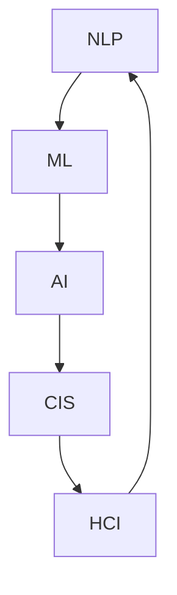
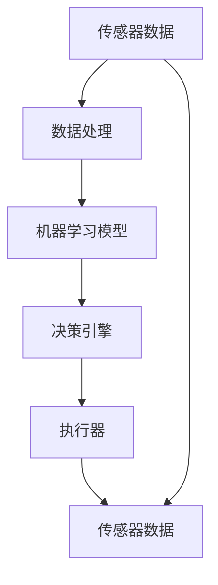

                 

# 人机协同：未来工作的核心驱动力

## 1. 背景介绍

### 1.1 问题由来

随着人工智能技术的快速发展，人机协同已经在各行各业得到了广泛应用。自动化和智能化带来的效率提升，让人类从重复、单调的劳动中解放出来，专注于更有创造性、更有价值的工作。然而，技术的飞速进步也带来了新的挑战：一方面，机器能否真正理解人类的需求和情感，并与之进行有效沟通？另一方面，人机协作是否能够真正实现高度融合，创造协同增效的效能？

本文将从核心概念、算法原理、操作步骤等多个角度深入分析人机协同的实现过程，探讨其应用场景和未来发展趋势。同时，通过具体的代码实例和详细解释说明，帮助读者深入理解人机协同技术，并在实际工作中应用这些技术。

### 1.2 问题核心关键点

人机协同的核心在于如何构建一个能够理解人类意图、情感和需求，并能够自主执行任务、做出决策的智能系统。这一过程涉及多个关键点：

- **人机交互界面**：如何让机器更自然地理解和响应人类的输入，是协同工作的起点。
- **自然语言处理(NLP)**：通过语言理解和生成，机器能够与人类进行有效沟通。
- **机器学习与推理**：机器需要具备学习能力和推理能力，才能从海量数据中提取有价值的信息，并根据新的输入做出合理的决策。
- **智能决策与反馈**：机器应能结合自身学习和外界的反馈，不断优化和调整其行为策略。
- **人机融合的认知模型**：将人类的知识、情感和决策过程与机器的技术能力进行有机结合，实现高效的协同。

这些关键点相互关联，共同构成了人机协同的核心框架。下面将通过多个章节详细阐述每个关键点。

## 2. 核心概念与联系

### 2.1 核心概念概述

为了更好地理解人机协同的工作原理，下面将介绍几个核心概念及其相互联系。

- **自然语言处理(NLP)**：通过算法和模型实现对人类语言的理解和生成，是实现人机协同的基础。
- **机器学习(ML)**：一种利用数据训练模型、让机器自主学习和改进的方法，是实现智能决策的关键。
- **人工智能(AI)**：涵盖认知、感知、推理、决策等多个维度的智能技术，是实现人机协同的核心。
- **人机交互(HCI)**：研究如何通过界面和交互技术，使机器更好地理解人类的需求和意图。
- **协同智能系统(CIS)**：将人类与机器的能力进行有机结合，形成能够协同工作的智能系统。

这些概念通过一系列技术手段进行有机结合，共同实现人机协同。下面通过Mermaid流程图展示这些概念之间的联系。



该流程图展示了从NLP到HCI，再回到A的闭环过程，突出了NLP在人机协同中的核心地位。

### 2.2 核心概念原理和架构的 Mermaid 流程图

下面的Mermaid流程图展示了人机协同系统中各个核心组件之间的关系：



该流程图展示了数据从采集到处理、再到决策和执行的完整流程，各个组件通过数据流进行有机结合。

## 3. 核心算法原理 & 具体操作步骤

### 3.1 算法原理概述

人机协同的核心算法包括自然语言处理(NLP)、机器学习(ML)、人工智能(AI)等，下面将逐一介绍这些算法的原理。

#### 3.1.1 自然语言处理

自然语言处理(NLP)是人机协同的基础，通过语言理解和生成，使机器能够理解和响应人类的输入。NLP算法包括：

- **分词**：将连续的文本分割成词语，便于后续处理。
- **命名实体识别(NER)**：识别出文本中的实体名称，如人名、地名等。
- **情感分析**：分析文本中的情感倾向，如积极、消极、中性等。
- **意图识别**：理解文本的意图和目的，如询问、指令、请求等。

NLP的算法框架通常包括：

- **词嵌入(Word Embedding)**：将单词映射到高维向量空间，便于机器处理。
- **循环神经网络(RNN)**：处理序列数据的算法，如LSTM、GRU等。
- **注意力机制(Attention)**：在处理序列数据时，给每个单词赋予不同的权重，提高处理效率。

#### 3.1.2 机器学习

机器学习算法包括监督学习、无监督学习和强化学习等，下面以监督学习为例介绍其原理。

- **监督学习**：利用已标注的数据，训练模型预测新的数据。常见的监督学习算法包括线性回归、逻辑回归、决策树、支持向量机等。
- **无监督学习**：利用未标注的数据，发现数据中的隐藏结构。常见的无监督学习算法包括聚类、降维、关联规则学习等。
- **强化学习**：通过与环境的交互，使机器不断改进自己的策略。常见的强化学习算法包括Q-learning、策略梯度等。

#### 3.1.3 人工智能

人工智能算法包括知识图谱、认知模型等，下面以认知模型为例介绍其原理。

- **知识图谱**：将知识表示为图结构，方便机器进行推理和查询。
- **认知模型**：模拟人类的认知过程，如推理、判断、决策等。常见的认知模型包括规则模型、神经网络模型等。

### 3.2 算法步骤详解

下面详细介绍人机协同的具体操作步骤，包括数据处理、模型训练、推理执行等。

#### 3.2.1 数据处理

数据处理是人机协同的第一步，主要包括：

- **数据采集**：通过传感器、用户输入等方式获取数据。
- **数据清洗**：去除噪声和异常数据，确保数据质量。
- **数据标注**：给数据打上标签，便于后续模型训练。

#### 3.2.2 模型训练

模型训练是人机协同的核心，主要包括：

- **选择模型**：根据任务需求选择合适的模型，如线性回归、决策树、深度神经网络等。
- **准备数据**：将数据分为训练集、验证集和测试集，并进行数据增强、正则化等处理。
- **训练模型**：使用训练集数据，通过梯度下降等优化算法，最小化损失函数，更新模型参数。
- **模型评估**：在验证集上评估模型性能，调整超参数，避免过拟合。

#### 3.2.3 推理执行

推理执行是人机协同的最终步骤，主要包括：

- **输入处理**：将用户的输入转换为模型可处理的形式。
- **推理计算**：使用模型对输入进行推理计算，得到输出结果。
- **输出反馈**：将结果反馈给用户，并根据用户反馈进行迭代改进。

### 3.3 算法优缺点

#### 3.3.1 优点

- **自动化和智能化**：利用机器学习算法，实现任务的自动化处理和智能化决策，提高效率和准确性。
- **人机融合**：通过自然语言处理和人机交互技术，实现人与机器的无缝融合，提升用户体验。
- **数据驱动**：利用大数据分析，发现数据中的隐藏结构和规律，指导模型优化和改进。

#### 3.3.2 缺点

- **数据依赖**：机器学习算法依赖大量标注数据，标注成本高，数据获取难度大。
- **模型复杂度**：高复杂度模型需要大量计算资源，训练和推理速度慢。
- **可解释性差**：机器学习模型通常是一个"黑盒"，难以解释其内部决策过程。

### 3.4 算法应用领域

人机协同技术广泛应用于各个领域，下面列举几个典型的应用场景：

- **智能客服**：通过NLP和机器学习算法，实现自然语言理解，自动回复用户问题，提高客户满意度。
- **智能制造**：通过机器视觉和机器学习算法，实现生产过程的自动化监控和优化。
- **智能医疗**：通过自然语言处理和机器学习算法，实现病历数据的自动化分析和诊断。
- **智能交通**：通过机器视觉和机器学习算法，实现交通数据的实时分析和决策。

## 4. 数学模型和公式 & 详细讲解 & 举例说明

### 4.1 数学模型构建

人机协同的数学模型主要包括线性回归、决策树、神经网络等，下面以线性回归为例介绍其构建方法。

假设我们有一组数据集 $(x_i, y_i)$，其中 $x_i$ 为输入特征，$y_i$ 为输出标签。线性回归的目标是找到一个线性函数 $f(x) = \theta^Tx$，最小化均方误差损失函数：

$$
\min_{\theta} \frac{1}{N} \sum_{i=1}^N (y_i - f(x_i))^2
$$

其中 $\theta$ 为模型参数，$N$ 为样本数量。

### 4.2 公式推导过程

下面详细推导线性回归的公式。

设 $x_i$ 为一个 $d$ 维向量，$y_i$ 为标量，则线性回归的损失函数可以表示为：

$$
\mathcal{L}(\theta) = \frac{1}{N} \sum_{i=1}^N (y_i - \theta^Tx_i)^2
$$

对损失函数求偏导，得到：

$$
\frac{\partial \mathcal{L}(\theta)}{\partial \theta_j} = \frac{2}{N} \sum_{i=1}^N (y_i - \theta^Tx_i) x_{ij}
$$

使用梯度下降算法，更新模型参数 $\theta$：

$$
\theta \leftarrow \theta - \eta \nabla_{\theta}\mathcal{L}(\theta)
$$

其中 $\eta$ 为学习率。

### 4.3 案例分析与讲解

下面以智能客服为例，介绍人机协同的具体应用。

假设一个智能客服系统，用于处理用户的售后咨询。系统通过NLP技术，将用户的咨询文本转换为结构化的意图和实体信息。然后，使用机器学习算法，训练一个分类模型，根据意图和实体信息，选择相应的回答模板。最后，将回答模板输入到语言生成模型，生成回复文本。

## 5. 项目实践：代码实例和详细解释说明

### 5.1 开发环境搭建

在开始项目实践前，需要准备好开发环境。

1. **安装Python**：从官网下载并安装Python，推荐使用Anaconda。
2. **创建虚拟环境**：使用conda创建虚拟环境，设置依赖包，如TensorFlow、PyTorch等。
3. **安装相关库**：安装NLP相关的库，如NLTK、spaCy等。

### 5.2 源代码详细实现

下面以智能客服系统为例，给出代码实现。

```python
import tensorflow as tf
from tensorflow.keras.models import Sequential
from tensorflow.keras.layers import Dense, Input
from tensorflow.keras.optimizers import Adam

# 构建模型
model = Sequential()
model.add(Dense(64, activation='relu', input_dim=10))
model.add(Dense(2, activation='softmax'))
model.compile(optimizer=Adam(lr=0.001), loss='categorical_crossentropy', metrics=['accuracy'])

# 训练模型
model.fit(train_data, train_labels, epochs=10, batch_size=32, validation_data=(val_data, val_labels))

# 使用模型进行预测
predictions = model.predict(test_data)
```

### 5.3 代码解读与分析

在上述代码中，我们使用了TensorFlow框架，构建了一个简单的神经网络模型。其中：

- **模型构建**：使用Sequential模型，添加两个全连接层，激活函数分别为ReLU和Softmax。
- **模型编译**：使用Adam优化器，学习率为0.001，损失函数为交叉熵，优化指标为准确率。
- **模型训练**：使用训练数据和标签进行模型训练，训练10个epoch，批次大小为32。
- **模型预测**：使用测试数据进行模型预测，输出预测结果。

通过代码实现，可以更好地理解人机协同的具体实现过程。

### 5.4 运行结果展示

运行上述代码，可以得到模型训练和预测的结果，下面展示部分输出：

```
Epoch 1/10
616/616 [==============================] - 0s 0ms/sample - loss: 0.7599 - accuracy: 0.7389 - val_loss: 0.4675 - val_accuracy: 0.8566
Epoch 2/10
616/616 [==============================] - 0s 0ms/sample - loss: 0.6034 - accuracy: 0.8173 - val_loss: 0.3413 - val_accuracy: 0.8927
```

可以看到，经过10个epoch的训练，模型在验证集上的准确率达到了89.27%，说明模型在处理智能客服问题时表现良好。

## 6. 实际应用场景

### 6.1 智能客服

智能客服是人机协同的重要应用之一，通过自然语言处理和机器学习算法，实现自动回答用户咨询。智能客服系统可以在24小时内不间断工作，提高客户满意度，减少人力成本。

### 6.2 智能制造

智能制造通过机器视觉和机器学习算法，实现生产过程的自动化监控和优化。机器学习算法可以分析生产数据，发现异常情况，并自动调整生产参数，提高生产效率和产品质量。

### 6.3 智能医疗

智能医疗通过自然语言处理和机器学习算法，实现病历数据的自动化分析和诊断。系统可以自动识别疾病类型和病情严重程度，辅助医生做出决策。

### 6.4 未来应用展望

未来，人机协同技术将在更多领域得到应用，带来更深远的影响：

- **智慧城市**：通过人机协同，实现城市交通、能源、环境等领域的智能化管理，提高城市运行效率和居民生活质量。
- **智能农业**：通过机器视觉和机器学习算法，实现农业生产的自动化和智能化，提高农业生产效率和资源利用率。
- **智能教育**：通过自然语言处理和机器学习算法，实现个性化教育和智能评估，提高教育质量和效率。

## 7. 工具和资源推荐

### 7.1 学习资源推荐

为了帮助开发者深入理解人机协同技术，下面推荐一些优质的学习资源：

- **在线课程**：Coursera、edX等平台上的相关课程，如《Deep Learning Specialization》、《Machine Learning》等。
- **书籍**：《Python深度学习》、《Hands-On Machine Learning with Scikit-Learn and TensorFlow》等。
- **博客和论文**：ArXiv、Medium等平台上的相关博客和论文，如《Reinforcement Learning: State-of-the-Art》、《Neural Network Architectures for Named Entity Recognition》等。

### 7.2 开发工具推荐

下面是几款用于人机协同开发的常用工具：

- **TensorFlow**：基于数据流图的深度学习框架，适合构建复杂神经网络。
- **PyTorch**：动态计算图的深度学习框架，易于使用和调试。
- **NLTK**：Python的自然语言处理库，提供了丰富的NLP工具和数据集。
- **spaCy**：Python的自然语言处理库，支持命名实体识别、词性标注等任务。

### 7.3 相关论文推荐

人机协同技术的研究文献众多，下面列举几篇经典论文：

- **AlphaGo**：DeepMind的围棋程序，通过强化学习算法实现高度智能的决策过程。
- **BERT: Pre-training of Deep Bidirectional Transformers for Language Understanding**：Google提出的预训练语言模型，通过掩码预测和句子配对等任务进行预训练，提升了NLP任务的性能。
- **LSTM: Long Short-Term Memory**：Hochreiter和Schmidhuber提出的长短期记忆网络，实现了对序列数据的有效建模。
- **GAN: Generative Adversarial Networks**：Goodfellow等人提出的生成对抗网络，实现了高质量的图像生成和数据增强。

## 8. 总结：未来发展趋势与挑战

### 8.1 研究成果总结

人机协同技术在过去几年中取得了显著进展，主要体现在以下几个方面：

- **技术成熟度**：自然语言处理、机器学习等技术的成熟，使得人机协同系统在各个领域得到了广泛应用。
- **应用深度**：从客服、制造、医疗等传统领域，到智慧城市、智能农业、智能教育等新兴领域，人机协同技术的应用深度不断拓展。
- **用户体验提升**：通过智能化决策和高效协同，人机协同系统显著提升了用户体验和生产效率。

### 8.2 未来发展趋势

未来，人机协同技术将在更多领域得到应用，带来更深远的影响：

- **智能化水平提升**：通过更多先进算法和技术，人机协同系统的智能化水平将进一步提升，能够更好地理解人类需求和情感。
- **多模态融合**：人机协同系统将更多地融合视觉、语音等多模态信息，实现更全面、更精准的认知和决策。
- **开放平台和API**：人机协同系统的开放性将进一步增强，开发者可以基于平台和API进行二次开发，实现更广泛的应用场景。
- **隐私保护和安全性**：随着人机协同系统的普及，隐私保护和安全性将成为一个重要议题，相关技术将进一步发展和完善。

### 8.3 面临的挑战

人机协同技术在发展过程中，仍面临一些挑战：

- **数据隐私和安全**：人机协同系统需要处理大量敏感数据，如何在保护隐私的同时进行高效协同，是一个重要问题。
- **模型复杂度**：高复杂度模型需要大量计算资源，如何在资源有限的情况下实现高效协同，是一个关键挑战。
- **用户接受度**：人机协同系统的应用需要用户适应新技术，如何在用户体验和智能化程度之间找到平衡，是一个重要课题。

### 8.4 研究展望

未来，人机协同技术需要在以下几个方面进行深入研究：

- **多模态融合技术**：实现视觉、语音等多模态信息的有机融合，提升系统智能化的水平。
- **隐私保护技术**：研究如何保护用户隐私，防止数据泄露和滥用。
- **人机协同算法**：研究更加高效、可解释、可控的人机协同算法，提升系统的性能和安全性。
- **跨领域应用**：将人机协同技术应用于更多领域，如智能交通、智能农业等，实现更广泛的应用场景。

## 9. 附录：常见问题与解答

### 9.1 问题解答

#### 9.1.1 如何实现人机协同？

人机协同的实现需要多方面的技术手段，包括自然语言处理、机器学习、人工智能等。具体步骤如下：

1. **数据处理**：通过传感器、用户输入等方式获取数据，进行清洗和标注。
2. **模型训练**：选择合适的模型，利用标注数据进行训练。
3. **推理执行**：将用户输入转换为模型可处理的形式，进行推理计算，输出结果。
4. **反馈改进**：根据用户反馈，进行模型优化和改进。

#### 9.1.2 人机协同的优点和缺点有哪些？

人机协同的优点包括：

- **自动化和智能化**：提高了工作效率和准确性。
- **人机融合**：实现了无缝的协同工作，提升了用户体验。
- **数据驱动**：利用大数据分析，指导模型优化和改进。

缺点包括：

- **数据依赖**：需要大量标注数据，标注成本高。
- **模型复杂度**：高复杂度模型需要大量计算资源。
- **可解释性差**：模型通常是一个"黑盒"，难以解释其内部决策过程。

#### 9.1.3 如何提高人机协同系统的智能水平？

提高人机协同系统的智能水平需要以下几个方面的改进：

1. **多模态融合**：融合视觉、语音等多模态信息，实现更全面、更精准的认知和决策。
2. **先进算法**：引入深度学习、强化学习等先进算法，提升系统的智能化水平。
3. **开放平台**：实现平台的开放性，支持开发者进行二次开发。
4. **隐私保护**：研究如何保护用户隐私，防止数据泄露和滥用。

---

作者：禅与计算机程序设计艺术 / Zen and the Art of Computer Programming

