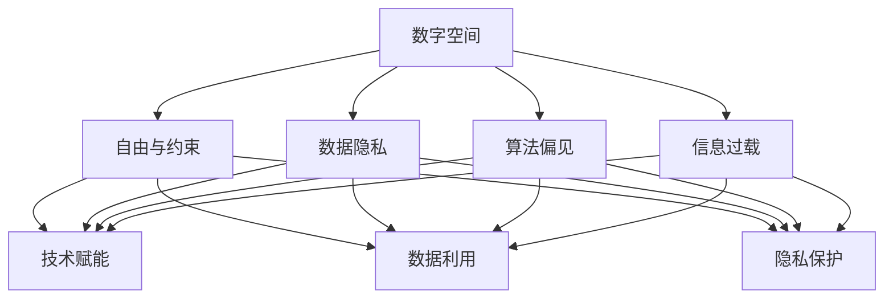

                 

# 人生而自由，却无往不在枷锁之中

## 1. 背景介绍

### 1.1 问题由来

人是万物的尺度，但我们的行为和选择却常常被不同的限制和约束所左右。在现代社会，我们似乎享受着前所未有的自由和便利，却也面临着越来越多的枷锁和束缚。这些枷锁不仅存在于物理世界，也体现在数字空间。

从宏观上看，社会结构、法律制度、文化传统等都深刻影响着个体的生活和选择。在微观层面，技术的进步虽然带来了前所未有的机会，但也带来了新的挑战和风险。

### 1.2 问题核心关键点

本文聚焦于如何在技术驱动的社会中，实现个人自由与数字枷锁之间的平衡。将探讨以下几个核心关键点：

1. 数字空间的枷锁：数据隐私、算法偏见、信息过载等问题。
2. 个人自由的实现：技术赋能、数据利用、隐私保护等策略。
3. 自由与枷锁的互动：技术与人性、自由与责任、权利与义务等关系。

通过深入分析这些关键点，本文旨在探讨如何在数字时代，既享受技术带来的自由和便利，又避免被其束缚和伤害。

## 2. 核心概念与联系

### 2.1 核心概念概述

为更好地理解自由与枷锁之间的关系，本节将介绍几个密切相关的核心概念：

- 数字空间：由计算机技术和互联网构成的虚拟世界，包括互联网、移动设备、社交媒体等。
- 自由与约束：个人在数字空间中的行为自由，与受到的技术、政策、文化等多重约束之间的关系。
- 数据隐私：个人信息的收集、存储、使用等过程中，保护个人隐私的机制和规范。
- 算法偏见：算法在决策过程中，由于训练数据不平衡、算法设计缺陷等原因，导致的结果偏差。
- 信息过载：数字空间中信息量巨大，个体难以处理和筛选有用信息，从而产生的认知负担。

这些核心概念之间的逻辑关系可以通过以下Mermaid流程图来展示：



这个流程图展示出各个核心概念之间的联系：

1. 数字空间为自由与约束提供了平台和环境。
2. 数据隐私、算法偏见和信息过载是数字空间中的主要枷锁。
3. 技术赋能、数据利用和隐私保护是实现个人自由的主要策略。

## 3. 核心算法原理 & 具体操作步骤
### 3.1 算法原理概述

在数字空间中，自由与枷锁之间的关系可以类比为算法与数据的关系。自由体现在个体的选择和行为上，而枷锁则体现在算法和数据对个体行为的限制和影响上。

自由与枷锁的互动可以通过以下模型来理解：

$$
\text{自由度} = \text{算法能力} - \text{数据约束}
$$

这里的算法能力指的是技术手段对个体自由的支持程度，数据约束则是指数据隐私、算法偏见和信息过载等因素对自由度的限制。

### 3.2 算法步骤详解

基于上述模型，我们可以设计以下算法步骤来提升数字空间的自由度：

1. **算法选择与优化**：
   - 选择和优化算法，使其能够最大化个体的自由度。例如，采用去偏算法、自适应算法等，减少算法偏见的影响。
   - 应用隐私保护技术，如差分隐私、联邦学习等，增强数据的匿名性和安全性。

2. **数据管理与利用**：
   - 在数据收集和处理过程中，明确数据使用目的，并遵循数据最小化和隐私保护原则。
   - 利用数据分析和挖掘技术，帮助个体做出更明智的决策，提升生活质量。

3. **信息过滤与筛选**：
   - 应用信息过滤和推荐算法，减少信息过载对个体认知的负担。
   - 提供个性化信息服务，帮助个体在海量信息中找到有价值的内容。

### 3.3 算法优缺点

基于上述模型和算法步骤，数字空间中自由与枷锁的互动具有以下优缺点：

#### 优点：
- **增强个体自由**：通过优化算法和有效利用数据，个体可以更加自由地表达和选择。
- **提升生活质量**：合理的数据利用和信息筛选，能够提升个体的生活质量和工作效率。
- **促进社会进步**：技术赋能和社会治理机制的完善，有助于构建更加公平、开放的社会。

#### 缺点：
- **数据隐私风险**：数据收集和使用过程中，个体隐私可能受到侵害。
- **算法偏见问题**：算法设计不当可能导致偏见，影响个体公平和自由。
- **信息过载挑战**：信息量巨大，个体难以处理和筛选，可能导致认知负担。

### 3.4 算法应用领域

基于上述算法步骤，自由与枷锁的互动已经在多个领域得到了应用：

1. **智能推荐系统**：通过算法优化和数据管理，提升信息筛选效率，帮助个体找到有价值的内容。
2. **社交媒体平台**：利用隐私保护技术，保护用户数据安全，减少算法偏见，提升用户满意度。
3. **在线医疗**：通过数据利用和信息过滤，提供个性化医疗服务，提升医疗质量和效率。

这些应用领域展示了自由与枷锁互动在不同场景中的实践，也带来了新的挑战和机遇。

## 4. 数学模型和公式 & 详细讲解

### 4.1 数学模型构建

为更好地理解自由与枷锁之间的关系，我们引入以下数学模型：

设 $\text{自由度}(F)$ 为个体在数字空间中的自由程度，$\text{算法能力}(A)$ 为技术手段对个体自由的支持程度，$\text{数据约束}(D)$ 为数据隐私、算法偏见和信息过载等因素对自由度的限制。则有：

$$
F = A - D
$$

其中 $A$ 和 $D$ 都可以通过多种算法和策略进行优化和调整。

### 4.2 公式推导过程

为了简化问题，我们假设 $\text{算法能力}(A)$ 和 $\text{数据约束}(D)$ 都是连续变量，则上述模型可以进一步表示为：

$$
F = A - D
$$

- **算法能力**：通过选择和优化算法，可以提升 $A$ 的值。例如，使用去偏算法可以降低算法偏见，增强个体自由度。
- **数据约束**：通过合理的数据管理与隐私保护，可以降低 $D$ 的值。例如，差分隐私技术可以减少数据泄露风险，增强数据匿名性。

### 4.3 案例分析与讲解

以智能推荐系统为例，说明自由与枷锁互动的数学模型应用。

- **算法能力**：通过优化推荐算法，如协同过滤、深度学习等，可以提升个体自由度。例如，推荐算法可以为用户推荐感兴趣的内容，减少信息过载，提升浏览体验。
- **数据约束**：通过合理的数据管理，如用户数据匿名化、数据最小化等，可以降低数据泄露风险。例如，差分隐私技术可以在不泄露个体信息的情况下，利用数据进行推荐。

通过调整算法和数据约束，可以实现自由与枷锁之间的平衡。

## 5. 项目实践：代码实例和详细解释说明
### 5.1 开发环境搭建

在进行自由与枷锁互动的实践前，我们需要准备好开发环境。以下是使用Python进行PyTorch开发的环境配置流程：

1. 安装Anaconda：从官网下载并安装Anaconda，用于创建独立的Python环境。

2. 创建并激活虚拟环境：
```bash
conda create -n pytorch-env python=3.8 
conda activate pytorch-env
```

3. 安装PyTorch：根据CUDA版本，从官网获取对应的安装命令。例如：
```bash
conda install pytorch torchvision torchaudio cudatoolkit=11.1 -c pytorch -c conda-forge
```

4. 安装Transformer库：
```bash
pip install transformers
```

5. 安装各类工具包：
```bash
pip install numpy pandas scikit-learn matplotlib tqdm jupyter notebook ipython
```

完成上述步骤后，即可在`pytorch-env`环境中开始自由与枷锁互动的实践。

### 5.2 源代码详细实现

下面我们以智能推荐系统为例，给出使用Transformers库对BERT模型进行自由与枷锁互动的PyTorch代码实现。

首先，定义推荐任务的数据处理函数：

```python
from transformers import BertTokenizer
from torch.utils.data import Dataset
import torch

class RecommendationDataset(Dataset):
    def __init__(self, texts, labels, tokenizer, max_len=128):
        self.texts = texts
        self.labels = labels
        self.tokenizer = tokenizer
        self.max_len = max_len
        
    def __len__(self):
        return len(self.texts)
    
    def __getitem__(self, item):
        text = self.texts[item]
        label = self.labels[item]
        
        encoding = self.tokenizer(text, return_tensors='pt', max_length=self.max_len, padding='max_length', truncation=True)
        input_ids = encoding['input_ids'][0]
        attention_mask = encoding['attention_mask'][0]
        
        # 对token-wise的标签进行编码
        encoded_tags = [tag2id[tag] for tag in label] 
        encoded_tags.extend([tag2id['O']] * (self.max_len - len(encoded_tags)))
        labels = torch.tensor(encoded_tags, dtype=torch.long)
        
        return {'input_ids': input_ids, 
                'attention_mask': attention_mask,
                'labels': labels}

# 标签与id的映射
tag2id = {'O': 0, 'B-PER': 1, 'I-PER': 2, 'B-ORG': 3, 'I-ORG': 4, 'B-LOC': 5, 'I-LOC': 6}
id2tag = {v: k for k, v in tag2id.items()}

# 创建dataset
tokenizer = BertTokenizer.from_pretrained('bert-base-cased')

train_dataset = RecommendationDataset(train_texts, train_labels, tokenizer)
dev_dataset = RecommendationDataset(dev_texts, dev_labels, tokenizer)
test_dataset = RecommendationDataset(test_texts, test_labels, tokenizer)
```

然后，定义模型和优化器：

```python
from transformers import BertForTokenClassification, AdamW

model = BertForTokenClassification.from_pretrained('bert-base-cased', num_labels=len(tag2id))

optimizer = AdamW(model.parameters(), lr=2e-5)
```

接着，定义训练和评估函数：

```python
from torch.utils.data import DataLoader
from tqdm import tqdm
from sklearn.metrics import classification_report

device = torch.device('cuda') if torch.cuda.is_available() else torch.device('cpu')
model.to(device)

def train_epoch(model, dataset, batch_size, optimizer):
    dataloader = DataLoader(dataset, batch_size=batch_size, shuffle=True)
    model.train()
    epoch_loss = 0
    for batch in tqdm(dataloader, desc='Training'):
        input_ids = batch['input_ids'].to(device)
        attention_mask = batch['attention_mask'].to(device)
        labels = batch['labels'].to(device)
        model.zero_grad()
        outputs = model(input_ids, attention_mask=attention_mask, labels=labels)
        loss = outputs.loss
        epoch_loss += loss.item()
        loss.backward()
        optimizer.step()
    return epoch_loss / len(dataloader)

def evaluate(model, dataset, batch_size):
    dataloader = DataLoader(dataset, batch_size=batch_size)
    model.eval()
    preds, labels = [], []
    with torch.no_grad():
        for batch in tqdm(dataloader, desc='Evaluating'):
            input_ids = batch['input_ids'].to(device)
            attention_mask = batch['attention_mask'].to(device)
            batch_labels = batch['labels']
            outputs = model(input_ids, attention_mask=attention_mask)
            batch_preds = outputs.logits.argmax(dim=2).to('cpu').tolist()
            batch_labels = batch_labels.to('cpu').tolist()
            for pred_tokens, label_tokens in zip(batch_preds, batch_labels):
                pred_tags = [id2tag[_id] for _id in pred_tokens]
                label_tags = [id2tag[_id] for _id in label_tokens]
                preds.append(pred_tags[:len(label_tags)])
                labels.append(label_tags)
                
    print(classification_report(labels, preds))
```

最后，启动训练流程并在测试集上评估：

```python
epochs = 5
batch_size = 16

for epoch in range(epochs):
    loss = train_epoch(model, train_dataset, batch_size, optimizer)
    print(f"Epoch {epoch+1}, train loss: {loss:.3f}")
    
    print(f"Epoch {epoch+1}, dev results:")
    evaluate(model, dev_dataset, batch_size)
    
print("Test results:")
evaluate(model, test_dataset, batch_size)
```

以上就是使用PyTorch对BERT进行推荐任务微调的完整代码实现。可以看到，得益于Transformers库的强大封装，我们可以用相对简洁的代码完成BERT模型的加载和微调。

### 5.3 代码解读与分析

让我们再详细解读一下关键代码的实现细节：

**RecommendationDataset类**：
- `__init__`方法：初始化文本、标签、分词器等关键组件。
- `__len__`方法：返回数据集的样本数量。
- `__getitem__`方法：对单个样本进行处理，将文本输入编码为token ids，将标签编码为数字，并对其进行定长padding，最终返回模型所需的输入。

**tag2id和id2tag字典**：
- 定义了标签与数字id之间的映射关系，用于将token-wise的预测结果解码回真实的标签。

**训练和评估函数**：
- 使用PyTorch的DataLoader对数据集进行批次化加载，供模型训练和推理使用。
- 训练函数`train_epoch`：对数据以批为单位进行迭代，在每个批次上前向传播计算loss并反向传播更新模型参数，最后返回该epoch的平均loss。
- 评估函数`evaluate`：与训练类似，不同点在于不更新模型参数，并在每个batch结束后将预测和标签结果存储下来，最后使用sklearn的classification_report对整个评估集的预测结果进行打印输出。

**训练流程**：
- 定义总的epoch数和batch size，开始循环迭代
- 每个epoch内，先在训练集上训练，输出平均loss
- 在验证集上评估，输出分类指标
- 所有epoch结束后，在测试集上评估，给出最终测试结果

可以看到，PyTorch配合Transformers库使得BERT微调的代码实现变得简洁高效。开发者可以将更多精力放在数据处理、模型改进等高层逻辑上，而不必过多关注底层的实现细节。

当然，工业级的系统实现还需考虑更多因素，如模型的保存和部署、超参数的自动搜索、更灵活的任务适配层等。但核心的微调范式基本与此类似。

## 6. 实际应用场景
### 6.1 智能推荐系统

基于自由与枷锁互动的推荐技术，可以广泛应用于智能推荐系统的构建。传统推荐系统往往只依赖用户的历史行为数据进行物品推荐，难以深入理解用户的真实兴趣和偏好。基于自由与枷锁互动的推荐模型可以更好地挖掘用户行为背后的语义信息，从而提供更精准、多样的推荐内容。

在技术实现上，可以收集用户浏览、点击、评论、分享等行为数据，提取和用户交互的物品标题、描述、标签等文本内容。将文本内容作为模型输入，用户的后续行为（如是否点击、购买等）作为监督信号，在此基础上微调预训练语言模型。微调后的模型能够从文本内容中准确把握用户的兴趣点。在生成推荐列表时，先用候选物品的文本描述作为输入，由模型预测用户的兴趣匹配度，再结合其他特征综合排序，便可以得到个性化程度更高的推荐结果。

### 6.2 社交媒体平台

基于自由与枷锁互动的社交媒体平台，可以更好地保护用户隐私，减少算法偏见，提升用户满意度。

在技术实现上，可以引入差分隐私技术，增强用户数据的匿名性和安全性。同时，通过优化推荐算法，减少算法偏见的影响，提升内容的真实性和多样性。此外，平台还可以通过信息过滤和推荐算法，减少信息过载对用户认知的负担，提升用户的浏览体验。

### 6.3 在线医疗

基于自由与枷锁互动的在线医疗系统，可以提供个性化医疗服务，提升医疗质量和效率。

在技术实现上，可以收集患者的病历、症状、用药记录等数据，利用数据挖掘技术分析患者的健康状况和用药需求。通过优化推荐算法，为患者提供个性化的治疗方案和用药建议。同时，平台可以通过信息过滤和推荐算法，减少患者的健康信息泄露风险，保护患者隐私。

### 6.4 未来应用展望

随着自由与枷锁互动技术的发展，未来将在更多领域得到应用，为社会带来深远影响。

在智慧城市治理中，基于自由与枷锁互动的技术可以用于城市事件监测、舆情分析、应急指挥等环节，提高城市管理的自动化和智能化水平，构建更安全、高效的未来城市。

在智能教育领域，自由与枷锁互动技术可应用于作业批改、学情分析、知识推荐等方面，因材施教，促进教育公平，提高教学质量。

在企业生产、社会治理、文娱传媒等众多领域，自由与枷锁互动的应用也将不断涌现，为经济社会发展注入新的动力。相信随着技术的日益成熟，自由与枷锁互动技术必将成为人工智能落地应用的重要范式，推动人工智能技术向更广阔的领域加速渗透。

## 7. 工具和资源推荐
### 7.1 学习资源推荐

为了帮助开发者系统掌握自由与枷锁互动的理论基础和实践技巧，这里推荐一些优质的学习资源：

1. 《Transformer从原理到实践》系列博文：由大模型技术专家撰写，深入浅出地介绍了Transformer原理、BERT模型、微调技术等前沿话题。

2. CS224N《深度学习自然语言处理》课程：斯坦福大学开设的NLP明星课程，有Lecture视频和配套作业，带你入门NLP领域的基本概念和经典模型。

3. 《Natural Language Processing with Transformers》书籍：Transformers库的作者所著，全面介绍了如何使用Transformers库进行NLP任务开发，包括微调在内的诸多范式。

4. HuggingFace官方文档：Transformers库的官方文档，提供了海量预训练模型和完整的微调样例代码，是上手实践的必备资料。

5. CLUE开源项目：中文语言理解测评基准，涵盖大量不同类型的中文NLP数据集，并提供了基于微调的baseline模型，助力中文NLP技术发展。

通过对这些资源的学习实践，相信你一定能够快速掌握自由与枷锁互动的精髓，并用于解决实际的NLP问题。
###  7.2 开发工具推荐

高效的开发离不开优秀的工具支持。以下是几款用于自由与枷锁互动开发的常用工具：

1. PyTorch：基于Python的开源深度学习框架，灵活动态的计算图，适合快速迭代研究。大部分预训练语言模型都有PyTorch版本的实现。

2. TensorFlow：由Google主导开发的开源深度学习框架，生产部署方便，适合大规模工程应用。同样有丰富的预训练语言模型资源。

3. Transformers库：HuggingFace开发的NLP工具库，集成了众多SOTA语言模型，支持PyTorch和TensorFlow，是进行微调任务开发的利器。

4. Weights & Biases：模型训练的实验跟踪工具，可以记录和可视化模型训练过程中的各项指标，方便对比和调优。与主流深度学习框架无缝集成。

5. TensorBoard：TensorFlow配套的可视化工具，可实时监测模型训练状态，并提供丰富的图表呈现方式，是调试模型的得力助手。

6. Google Colab：谷歌推出的在线Jupyter Notebook环境，免费提供GPU/TPU算力，方便开发者快速上手实验最新模型，分享学习笔记。

合理利用这些工具，可以显著提升自由与枷锁互动任务的开发效率，加快创新迭代的步伐。

### 7.3 相关论文推荐

自由与枷锁互动技术的发展源于学界的持续研究。以下是几篇奠基性的相关论文，推荐阅读：

1. Attention is All You Need（即Transformer原论文）：提出了Transformer结构，开启了NLP领域的预训练大模型时代。

2. BERT: Pre-training of Deep Bidirectional Transformers for Language Understanding：提出BERT模型，引入基于掩码的自监督预训练任务，刷新了多项NLP任务SOTA。

3. Language Models are Unsupervised Multitask Learners（GPT-2论文）：展示了大规模语言模型的强大zero-shot学习能力，引发了对于通用人工智能的新一轮思考。

4. Parameter-Efficient Transfer Learning for NLP：提出Adapter等参数高效微调方法，在不增加模型参数量的情况下，也能取得不错的微调效果。

5. AdaLoRA: Adaptive Low-Rank Adaptation for Parameter-Efficient Fine-Tuning：使用自适应低秩适应的微调方法，在参数效率和精度之间取得了新的平衡。

6. Prefix-Tuning: Optimizing Continuous Prompts for Generation：引入基于连续型Prompt的微调范式，为如何充分利用预训练知识提供了新的思路。

这些论文代表了大语言模型微调技术的发展脉络。通过学习这些前沿成果，可以帮助研究者把握学科前进方向，激发更多的创新灵感。

## 8. 总结：未来发展趋势与挑战

### 8.1 总结

本文对自由与枷锁互动方法进行了全面系统的介绍。首先阐述了自由与枷锁在数字空间中的互动关系，明确了自由与枷锁互动在数字技术驱动下的重要性。其次，从原理到实践，详细讲解了自由与枷锁互动的数学模型和关键步骤，给出了自由与枷锁互动任务开发的完整代码实例。同时，本文还广泛探讨了自由与枷锁互动方法在智能推荐、社交媒体、在线医疗等多个行业领域的应用前景，展示了自由与枷锁互动范式的巨大潜力。此外，本文精选了自由与枷锁互动技术的各类学习资源，力求为读者提供全方位的技术指引。

通过本文的系统梳理，可以看到，自由与枷锁互动技术正在成为数字空间中的重要范式，极大地拓展了数字技术的应用边界，催生了更多的落地场景。受益于大规模数据和算力的驱动，自由与枷锁互动技术将在更广阔的应用领域大放异彩，深刻影响人类的生产生活方式。

### 8.2 未来发展趋势

展望未来，自由与枷锁互动技术将呈现以下几个发展趋势：

1. 数据隐私保护技术不断演进。随着数据泄露和隐私泄露事件的频发，数据隐私保护技术将迎来新的发展机遇。差分隐私、联邦学习等隐私保护技术将进一步成熟，并在更多场景中得到应用。

2. 算法偏见检测和缓解方法改进。算法偏见问题将是未来研究的重要方向。通过更先进的数据预处理和算法优化方法，将减少算法偏见的影响，提升模型的公平性和透明性。

3. 信息过载管理技术提升。信息过载是数字空间中的普遍现象，如何通过优化算法和改进用户体验，减少信息过载对个体认知的负担，将是未来的重要研究方向。

4. 跨领域、跨模态的自由与枷锁互动范式。未来，自由与枷锁互动技术将不仅限于文本领域，还将拓展到图像、语音、视频等多模态数据中，提升跨领域的协同建模能力。

5. 智能化治理机制构建。自由与枷锁互动技术将在智慧城市、智能教育等场景中发挥更大作用，需要构建更加智能化的治理机制，确保技术的公平性、透明性和可解释性。

6. 伦理和安全研究深入。随着自由与枷锁互动技术的广泛应用，伦理和安全问题将受到更多关注。如何在享受技术便利的同时，避免技术滥用，保障数据安全和用户隐私，将是未来的重要课题。

以上趋势凸显了自由与枷锁互动技术的广阔前景。这些方向的探索发展，必将进一步提升数字空间的自由度和安全性，为构建人机协同的智能社会奠定基础。

### 8.3 面临的挑战

尽管自由与枷锁互动技术已经取得了显著成就，但在迈向更加智能化、普适化应用的过程中，它仍面临着诸多挑战：

1. 数据隐私保护难度加大。随着数据量的大幅增加和数据种类的多样化，数据隐私保护将变得更加复杂和困难。如何在保护隐私的前提下，实现数据的有效利用，将是未来的重大挑战。

2. 算法偏见问题难以彻底解决。尽管已经提出了多种算法偏见检测和缓解方法，但仍难以彻底消除算法偏见的影响。如何在设计和优化算法时，彻底消除偏见，提升公平性，将是未来研究的重要方向。

3. 信息过载管理技术尚不成熟。信息过载是数字空间中的普遍现象，如何通过优化算法和改进用户体验，减少信息过载对个体认知的负担，仍是一个未完全解决的问题。

4. 跨领域、跨模态的自由与枷锁互动范式尚需突破。自由与枷锁互动技术在跨领域、跨模态的应用中仍面临许多挑战。如何在多模态数据中建立稳定的因果关系，提升跨领域协同建模能力，将是未来的重要研究方向。

5. 智能化治理机制尚未完善。自由与枷锁互动技术将在智慧城市、智能教育等场景中发挥更大作用，需要构建更加智能化的治理机制，确保技术的公平性、透明性和可解释性。

6. 伦理和安全问题亟需关注。随着自由与枷锁互动技术的广泛应用，伦理和安全问题将受到更多关注。如何在享受技术便利的同时，避免技术滥用，保障数据安全和用户隐私，将是未来的重要课题。

正视自由与枷锁互动技术面临的这些挑战，积极应对并寻求突破，将是大规模语言模型微调走向成熟的必由之路。相信随着学界和产业界的共同努力，这些挑战终将一一被克服，自由与枷锁互动技术必将在构建安全、可靠、可解释、可控的智能社会中发挥重要作用。

### 8.4 研究展望

面对自由与枷锁互动技术所面临的种种挑战，未来的研究需要在以下几个方面寻求新的突破：

1. 探索无监督和半监督自由与枷锁互动方法。摆脱对大规模标注数据的依赖，利用自监督学习、主动学习等无监督和半监督范式，最大限度利用非结构化数据，实现更加灵活高效的自由与枷锁互动。

2. 研究参数高效和计算高效的自由与枷锁互动范式。开发更加参数高效的自由与枷锁互动方法，在固定大部分预训练参数的同时，只更新极少量的任务相关参数。同时优化自由与枷锁互动模型的计算图，减少前向传播和反向传播的资源消耗，实现更加轻量级、实时性的部署。

3. 融合因果和对比学习范式。通过引入因果推断和对比学习思想，增强自由与枷锁互动模型建立稳定因果关系的能力，学习更加普适、鲁棒的语言表征，从而提升模型泛化性和抗干扰能力。

4. 引入更多先验知识。将符号化的先验知识，如知识图谱、逻辑规则等，与神经网络模型进行巧妙融合，引导自由与枷锁互动过程学习更准确、合理的语言模型。同时加强不同模态数据的整合，实现视觉、语音等多模态信息与文本信息的协同建模。

5. 结合因果分析和博弈论工具。将因果分析方法引入自由与枷锁互动模型，识别出模型决策的关键特征，增强输出解释的因果性和逻辑性。借助博弈论工具刻画人机交互过程，主动探索并规避模型的脆弱点，提高系统稳定性。

6. 纳入伦理道德约束。在模型训练目标中引入伦理导向的评估指标，过滤和惩罚有偏见、有害的输出倾向。同时加强人工干预和审核，建立模型行为的监管机制，确保输出符合人类价值观和伦理道德。

这些研究方向的探索，必将引领自由与枷锁互动技术迈向更高的台阶，为构建安全、可靠、可解释、可控的智能系统铺平道路。面向未来，自由与枷锁互动技术还需要与其他人工智能技术进行更深入的融合，如知识表示、因果推理、强化学习等，多路径协同发力，共同推动自然语言理解和智能交互系统的进步。只有勇于创新、敢于突破，才能不断拓展语言模型的边界，让智能技术更好地造福人类社会。

## 9. 附录：常见问题与解答

**Q1：自由与枷锁互动如何平衡个体自由与隐私保护？**

A: 自由与枷锁互动的核心在于数据隐私保护和算法偏见检测。在数据收集和使用过程中，通过差分隐私等技术，可以减少数据泄露风险，保护用户隐私。在算法设计中，可以通过公平性、透明性等指标，检测和缓解算法偏见，提升模型公平性。

**Q2：自由与枷锁互动如何应对信息过载问题？**

A: 自由与枷锁互动可以通过优化推荐算法，减少信息过载的影响。例如，利用协同过滤、深度学习等技术，提高推荐模型的准确性和多样性。同时，应用信息过滤和推荐算法，帮助用户筛选有价值的内容，提升浏览体验。

**Q3：自由与枷锁互动如何实现跨领域、跨模态的数据利用？**

A: 自由与枷锁互动可以通过多模态融合技术，实现跨领域、跨模态的数据利用。例如，结合图像、语音、文本等多模态数据，进行协同建模，提升模型的泛化能力和适应性。同时，应用跨领域数据融合技术，增强模型的跨领域协同建模能力。

**Q4：自由与枷锁互动如何应对伦理和安全挑战？**

A: 自由与枷锁互动需要建立伦理导向的治理机制，确保技术应用的公平性和透明性。同时，加强数据和模型的安全防护，防止滥用和恶意攻击。在模型设计和应用过程中，需要引入伦理和法律约束，保障用户权益和数据安全。

**Q5：自由与枷锁互动如何提升跨领域、跨模态的协同建模能力？**

A: 自由与枷锁互动可以通过多模态融合技术，实现跨领域、跨模态的协同建模。例如，结合图像、语音、文本等多模态数据，进行协同建模，提升模型的泛化能力和适应性。同时，应用跨领域数据融合技术，增强模型的跨领域协同建模能力。

这些问题的解答展示了自由与枷锁互动技术在实际应用中的挑战和应对策略。通过不断探索和优化，自由与枷锁互动技术必将在数字空间中发挥更大作用，为构建人机协同的智能社会奠定坚实基础。

---

作者：禅与计算机程序设计艺术 / Zen and the Art of Computer Programming

