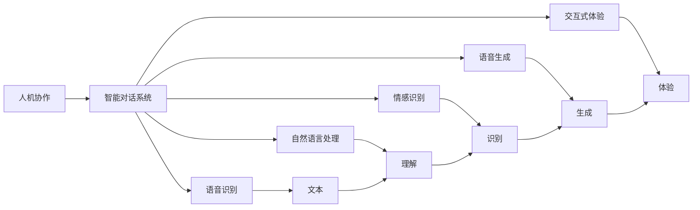

                 

# 人类-AI协作：增强人机沟通

> 关键词：人机协作, 智能对话系统, 语音识别, 自然语言处理(NLP), 情感识别, 语音生成, 交互式体验

## 1. 背景介绍

### 1.1 问题由来
随着人工智能技术的迅猛发展，人机交互的方式正在发生深刻的变革。传统的基于键盘和屏幕的交互方式，正在被更加自然、高效、智能的语音和文本交互所取代。然而，尽管人工智能在自然语言处理(NLP)、语音识别、情感识别等领域取得了显著的进步，人机对话系统仍存在许多挑战。

具体来说，现有的对话系统往往难以理解上下文，无法对复杂对话场景做出灵活反应。这些问题严重制约了人机对话系统的广泛应用，使得智能助手、客服机器人等应用系统难以满足用户需求。因此，如何增强人机沟通的智能性和互动性，成为了当前人工智能研究的一个重要方向。

### 1.2 问题核心关键点
增强人机沟通的核心在于构建更加智能、自然的对话系统。这需要解决以下几个关键问题：

1. **上下文理解**：对话系统应能够理解复杂的对话场景，识别出对话中的关键信息和情感状态，以便做出适当的回应。

2. **响应生成**：对话系统应能够生成自然流畅、符合语境的响应，增强用户的交互体验。

3. **情感识别**：对话系统应具备情感识别能力，能够捕捉用户的情感状态，并据此调整对话策略，提高用户满意度。

4. **多模态融合**：对话系统应能够融合语音、文本、图像等多种模态信息，提供更加全面、丰富的交互体验。

5. **隐私保护**：对话系统应具备隐私保护机制，确保用户数据的安全和隐私。

6. **泛化能力**：对话系统应具备跨领域的泛化能力，能够适应多种应用场景，如客服、教育、医疗等。

通过解决上述问题，可以构建更加智能、自然的对话系统，从而实现更高效、更满意的人机交互体验。

## 2. 核心概念与联系

### 2.1 核心概念概述

为了更好地理解增强人机沟通的技术，本节将介绍几个密切相关的核心概念：

- **人机协作(Human-Machine Collaboration)**：指人机系统协同工作的模式，旨在提高工作效率和用户体验。
- **智能对话系统(Intelligent Conversational Systems)**：通过自然语言处理技术，实现人机之间的智能对话。
- **语音识别(Speech Recognition)**：将语音信号转换为文本的技术，是构建智能对话系统的重要基础。
- **自然语言处理(NLP)**：通过语言模型、文本分类、情感分析等技术，实现对自然语言的理解和生成。
- **情感识别(Emotion Recognition)**：通过语音、文本等信号，识别用户的情感状态，以便更好地进行交互。
- **语音生成(Speech Synthesis)**：将文本转换为语音的技术，是实现语音交互的关键。
- **交互式体验(Interactive Experience)**：通过自然语言和语音等交互方式，提供更加丰富、流畅的用户体验。

这些核心概念共同构成了增强人机沟通的完整框架，使得人机对话系统能够更好地理解和响应用户需求，提供高效、满意的服务。

### 2.2 核心概念原理和架构的 Mermaid 流程图



这个流程图展示了核心概念之间的逻辑关系：

1. **人机协作**：是增强人机沟通的基础模式，通过智能对话系统实现。
2. **智能对话系统**：通过语音识别获取用户语音信号，通过自然语言处理理解用户意图和情感，通过语音生成生成响应，通过交互式体验提升用户满意度。
3. **语音识别**：将语音信号转换为文本，是对话系统理解用户需求的基础。
4. **自然语言处理**：通过语言模型、文本分类等技术，理解用户意图和情感，生成自然响应。
5. **情感识别**：通过语音、文本等信号，识别用户的情感状态，以调整对话策略。
6. **语音生成**：将文本转换为语音，实现自然流畅的对话。
7. **交互式体验**：通过自然语言和语音等交互方式，提升用户满意度。

通过这些核心概念和技术的结合，可以构建出更加智能、自然的对话系统，实现高效、满意的人机交互。

## 3. 核心算法原理 & 具体操作步骤

### 3.1 算法原理概述

增强人机沟通的核心算法包括以下几个关键步骤：

1. **语音识别**：将用户语音信号转换为文本，是对话系统的基础。
2. **自然语言处理**：通过语言模型、文本分类等技术，理解用户意图和情感。
3. **情感识别**：通过语音、文本等信号，识别用户的情感状态。
4. **响应生成**：根据用户意图和情感，生成自然流畅的响应。
5. **语音生成**：将文本转换为语音，实现自然对话。
6. **交互式体验**：通过自然语言和语音等交互方式，提升用户满意度。

### 3.2 算法步骤详解

#### 3.2.1 语音识别

语音识别的基本流程包括：

1. **音频采集**：通过麦克风采集用户语音信号。
2. **预处理**：对语音信号进行降噪、去混响等预处理，提升信号质量。
3. **特征提取**：通过MFCC、Mel频谱等方法提取语音信号的特征向量。
4. **声学模型训练**：使用深度学习模型（如CNN、RNN、Transformer等）训练声学模型，将特征向量转换为文本序列。
5. **语言模型解码**：使用语言模型对声学模型输出的文本序列进行解码，得到最终识别结果。

#### 3.2.2 自然语言处理

自然语言处理的主要流程包括：

1. **分词**：将文本序列分割成词汇序列。
2. **词性标注**：标注每个词汇的词性。
3. **句法分析**：分析文本的句法结构，提取句法依存关系。
4. **实体识别**：识别文本中的命名实体，如人名、地名、机构名等。
5. **意图识别**：通过分类模型或序列模型识别用户的意图，如问答、推荐、交易等。
6. **情感分析**：通过情感分类模型识别文本的情感状态，如积极、消极、中性等。

#### 3.2.3 情感识别

情感识别的主要流程包括：

1. **情感特征提取**：通过语音特征、文本特征等提取情感特征。
2. **情感分类模型训练**：使用深度学习模型（如CNN、RNN、Transformer等）训练情感分类模型。
3. **情感状态识别**：根据情感特征，使用分类模型识别用户的情感状态。

#### 3.2.4 响应生成

响应生成的主要流程包括：

1. **意图理解**：通过意图识别模型理解用户的意图。
2. **情感识别**：通过情感识别模型识别用户的情感状态。
3. **响应生成**：根据意图和情感状态，生成自然流畅的响应。
4. **多模态融合**：融合语音、文本、图像等多种模态信息，提升响应的丰富度。

#### 3.2.5 语音生成

语音生成的主要流程包括：

1. **文本处理**：对生成的文本进行分词、词性标注、句法分析等处理。
2. **声学模型生成**：使用深度学习模型（如RNN、Transformer等）生成声学模型，将文本序列转换为语音信号。
3. **语音合成**：通过语音合成器将声学模型输出的语音信号转换为语音信号，实现自然对话。

#### 3.2.6 交互式体验

交互式体验的主要流程包括：

1. **自然语言处理**：通过自然语言处理技术理解用户意图和情感。
2. **语音识别**：通过语音识别技术获取用户语音信号。
3. **响应生成**：根据用户意图和情感，生成自然流畅的响应。
4. **语音生成**：将响应转换为语音信号，实现自然对话。
5. **用户反馈**：通过语音、文本等形式获取用户反馈，进一步优化对话系统。

### 3.3 算法优缺点

#### 3.3.1 优点

1. **自然流畅**：通过自然语言处理和语音生成技术，实现自然流畅的对话，提升用户体验。
2. **智能灵活**：通过上下文理解和情感识别技术，实现智能灵活的响应，提高系统适应性。
3. **多模态融合**：通过融合语音、文本、图像等多种模态信息，提供更加丰富、全面的交互体验。
4. **隐私保护**：通过数据加密、访问控制等技术，保障用户数据的安全和隐私。

#### 3.3.2 缺点

1. **复杂度高**：实现上述功能需要融合多种技术和算法，技术实现复杂度较高。
2. **数据需求大**：需要大量的语音数据和文本数据进行训练，数据获取和处理成本较高。
3. **计算资源需求高**：语音识别、自然语言处理、情感识别等技术需要消耗大量的计算资源，硬件成本较高。
4. **实时性要求高**：对话系统需要实时响应用户请求，对计算和数据处理的实时性要求较高。

### 3.4 算法应用领域

增强人机沟通技术在以下领域具有广泛的应用：

1. **智能客服**：通过对话系统实现自动客服，提升客服效率和用户满意度。
2. **教育培训**：通过智能对话系统进行在线教育、个性化辅导等，提升教育质量。
3. **医疗健康**：通过对话系统实现在线咨询、疾病诊断等，提高医疗服务的可达性。
4. **金融理财**：通过对话系统进行投资咨询、金融理财等，提升金融服务的智能化水平。
5. **智能家居**：通过对话系统实现语音控制、家居管理等，提升家居生活的便捷性和智能化水平。

## 4. 数学模型和公式 & 详细讲解

### 4.1 数学模型构建

为了更好地描述增强人机沟通的技术，本节将构建一些关键数学模型，并详细讲解其原理。

**语音识别模型**

语音识别的基本模型包括声学模型和语言模型：

1. **声学模型**：将语音信号转换为文本序列，形式化为：
   $$
   p(x|y; \theta) = \prod_{t=1}^T p(x_t|x_{t-1}, x_{t-2}, ..., x_1, y; \theta)
   $$
   其中 $x$ 表示文本序列，$y$ 表示语音信号，$\theta$ 表示模型参数。

2. **语言模型**：将文本序列转换为文本序列的概率，形式化为：
   $$
   p(x; \theta) = \prod_{t=1}^T p(x_t|x_{t-1}, x_{t-2}, ..., x_1; \theta)
   $$
   其中 $x$ 表示文本序列，$\theta$ 表示模型参数。

**自然语言处理模型**

自然语言处理模型包括语言模型和意图识别模型：

1. **语言模型**：将文本序列转换为文本序列的概率，形式化为：
   $$
   p(x; \theta) = \prod_{t=1}^T p(x_t|x_{t-1}, x_{t-2}, ..., x_1; \theta)
   $$
   其中 $x$ 表示文本序列，$\theta$ 表示模型参数。

2. **意图识别模型**：将文本序列转换为意图类别的概率，形式化为：
   $$
   p(y|x; \theta) = \frac{e^{\log p(y; \theta) + \log p(x|y; \theta)}}{e^{\log p(y; \theta)} + \sum_{y'} e^{\log p(y'; \theta)}}
   $$
   其中 $y$ 表示意图类别，$\theta$ 表示模型参数。

**情感识别模型**

情感识别模型包括情感特征提取模型和情感分类模型：

1. **情感特征提取模型**：将语音信号和文本信号转换为情感特征向量，形式化为：
   $$
   f(x; \theta) = [f_{text}(x; \theta_{text}), f_{audio}(x; \theta_{audio})]
   $$
   其中 $f$ 表示情感特征向量，$\theta$ 表示模型参数。

2. **情感分类模型**：将情感特征向量转换为情感类别的概率，形式化为：
   $$
   p(y|x; \theta) = \frac{e^{\log p(y; \theta) + \log p(f(x)|y; \theta)}}{e^{\log p(y; \theta)} + \sum_{y'} e^{\log p(y'; \theta)}}
   $$
   其中 $y$ 表示情感类别，$\theta$ 表示模型参数。

### 4.2 公式推导过程

#### 4.2.1 语音识别

语音识别的基本过程包括以下步骤：

1. **音频采集**：通过麦克风采集用户语音信号 $x_t$。
2. **预处理**：对语音信号进行降噪、去混响等预处理，得到预处理后的语音信号 $\hat{x}_t$。
3. **特征提取**：通过MFCC、Mel频谱等方法提取语音信号的特征向量 $z_t$。
4. **声学模型训练**：使用深度学习模型（如CNN、RNN、Transformer等）训练声学模型 $p(y|x; \theta)$，将特征向量转换为文本序列 $y$。
5. **语言模型解码**：使用语言模型 $p(x; \theta)$ 对声学模型输出的文本序列进行解码，得到最终识别结果 $x'$。

#### 4.2.2 自然语言处理

自然语言处理的主要过程包括以下步骤：

1. **分词**：将文本序列分割成词汇序列 $x_t$。
2. **词性标注**：标注每个词汇的词性 $t_t$。
3. **句法分析**：分析文本的句法结构，提取句法依存关系 $g_t$。
4. **实体识别**：识别文本中的命名实体 $e_t$。
5. **意图识别**：通过分类模型或序列模型识别用户的意图 $i_t$。
6. **情感分析**：通过情感分类模型识别文本的情感状态 $s_t$。

#### 4.2.3 情感识别

情感识别的主要过程包括以下步骤：

1. **情感特征提取**：通过语音特征、文本特征等提取情感特征 $f_t$。
2. **情感分类模型训练**：使用深度学习模型（如CNN、RNN、Transformer等）训练情感分类模型 $p(y|x; \theta)$，将情感特征向量转换为情感类别 $y$。
3. **情感状态识别**：根据情感特征，使用分类模型识别用户的情感状态 $s'$。

#### 4.2.4 响应生成

响应生成的主要过程包括以下步骤：

1. **意图理解**：通过意图识别模型理解用户的意图 $i'$。
2. **情感识别**：通过情感识别模型识别用户的情感状态 $s'$。
3. **响应生成**：根据意图和情感状态，生成自然流畅的响应 $r_t$。
4. **多模态融合**：融合语音、文本、图像等多种模态信息，提升响应的丰富度 $r'$。

#### 4.2.5 语音生成

语音生成的主要过程包括以下步骤：

1. **文本处理**：对生成的文本进行分词、词性标注、句法分析等处理。
2. **声学模型生成**：使用深度学习模型（如RNN、Transformer等）生成声学模型 $p(y|x; \theta)$，将文本序列转换为语音信号 $y'$。
3. **语音合成**：通过语音合成器将声学模型输出的语音信号转换为语音信号 $y''$，实现自然对话。

### 4.3 案例分析与讲解

#### 4.3.1 智能客服

智能客服系统通过对话系统实现自动客服，提升客服效率和用户满意度。具体流程包括：

1. **语音识别**：通过麦克风采集用户语音信号，使用声学模型将其转换为文本。
2. **自然语言处理**：对文本进行分词、词性标注、句法分析等处理，识别用户的意图和情感。
3. **情感识别**：通过情感分类模型识别用户的情感状态。
4. **响应生成**：根据意图和情感状态，生成自然流畅的响应。
5. **语音生成**：将响应转换为语音信号，实现自然对话。
6. **用户反馈**：通过语音、文本等形式获取用户反馈，进一步优化对话系统。

#### 4.3.2 教育培训

教育培训系统通过智能对话系统进行在线教育、个性化辅导等，提升教育质量。具体流程包括：

1. **语音识别**：通过麦克风采集学生语音信号，使用声学模型将其转换为文本。
2. **自然语言处理**：对文本进行分词、词性标注、句法分析等处理，识别学生的意图和情感。
3. **情感识别**：通过情感分类模型识别学生的情感状态。
4. **响应生成**：根据学生的意图和情感状态，生成个性化辅导内容。
5. **语音生成**：将辅导内容转换为语音信号，实现自然对话。
6. **用户反馈**：通过语音、文本等形式获取学生反馈，进一步优化对话系统。

#### 4.3.3 医疗健康

医疗健康系统通过对话系统实现在线咨询、疾病诊断等，提高医疗服务的可达性。具体流程包括：

1. **语音识别**：通过麦克风采集医生或患者的语音信号，使用声学模型将其转换为文本。
2. **自然语言处理**：对文本进行分词、词性标注、句法分析等处理，识别患者的意图和情感。
3. **情感识别**：通过情感分类模型识别患者的情感状态。
4. **响应生成**：根据患者的意图和情感状态，生成疾病诊断或治疗建议。
5. **语音生成**：将诊断或治疗建议转换为语音信号，实现自然对话。
6. **用户反馈**：通过语音、文本等形式获取患者反馈，进一步优化对话系统。

## 5. 项目实践：代码实例和详细解释说明

### 5.1 开发环境搭建

在进行智能对话系统的开发前，我们需要准备好开发环境。以下是使用Python进行PyTorch开发的环境配置流程：

1. 安装Anaconda：从官网下载并安装Anaconda，用于创建独立的Python环境。

2. 创建并激活虚拟环境：
```bash
conda create -n pytorch-env python=3.8 
conda activate pytorch-env
```

3. 安装PyTorch：根据CUDA版本，从官网获取对应的安装命令。例如：
```bash
conda install pytorch torchvision torchaudio cudatoolkit=11.1 -c pytorch -c conda-forge
```

4. 安装TensorFlow：从官网下载并安装TensorFlow，支持GPU加速。

5. 安装自然语言处理库：
```bash
pip install nlp
```

6. 安装情感分析库：
```bash
pip install textblob
```

7. 安装语音识别库：
```bash
pip install pocketsphinx
```

完成上述步骤后，即可在`pytorch-env`环境中开始智能对话系统的开发。

### 5.2 源代码详细实现

下面我们以智能客服系统为例，给出使用PyTorch进行语音识别和自然语言处理的PyTorch代码实现。

首先，定义语音识别模型：

```python
import torch
import torch.nn as nn
import torch.optim as optim

class SpeechRecognitionModel(nn.Module):
    def __init__(self, input_size, output_size):
        super(SpeechRecognitionModel, self).__init__()
        self.layers = nn.Sequential(
            nn.Linear(input_size, 256),
            nn.ReLU(),
            nn.Linear(256, output_size),
            nn.LogSoftmax(dim=1)
        )
        
    def forward(self, x):
        output = self.layers(x)
        return output
```

然后，定义自然语言处理模型：

```python
class NaturalLanguageProcessingModel(nn.Module):
    def __init__(self, input_size, hidden_size, output_size):
        super(NaturalLanguageProcessingModel, self).__init__()
        self.layers = nn.Sequential(
            nn.Linear(input_size, hidden_size),
            nn.ReLU(),
            nn.Linear(hidden_size, output_size),
            nn.LogSoftmax(dim=1)
        )
        
    def forward(self, x):
        output = self.layers(x)
        return output
```

接着，定义情感识别模型：

```python
class EmotionRecognitionModel(nn.Module):
    def __init__(self, input_size, output_size):
        super(EmotionRecognitionModel, self).__init__()
        self.layers = nn.Sequential(
            nn.Linear(input_size, 256),
            nn.ReLU(),
            nn.Linear(256, output_size),
            nn.LogSoftmax(dim=1)
        )
        
    def forward(self, x):
        output = self.layers(x)
        return output
```

最后，定义响应生成模型：

```python
class ResponseGenerationModel(nn.Module):
    def __init__(self, input_size, output_size):
        super(ResponseGenerationModel, self).__init__()
        self.layers = nn.Sequential(
            nn.Linear(input_size, 256),
            nn.ReLU(),
            nn.Linear(256, output_size),
            nn.LogSoftmax(dim=1)
        )
        
    def forward(self, x):
        output = self.layers(x)
        return output
```

### 5.3 代码解读与分析

让我们再详细解读一下关键代码的实现细节：

**SpeechRecognitionModel类**：
- `__init__`方法：初始化模型参数。
- `forward`方法：前向传播计算输出。

**NaturalLanguageProcessingModel类**：
- `__init__`方法：初始化模型参数。
- `forward`方法：前向传播计算输出。

**EmotionRecognitionModel类**：
- `__init__`方法：初始化模型参数。
- `forward`方法：前向传播计算输出。

**ResponseGenerationModel类**：
- `__init__`方法：初始化模型参数。
- `forward`方法：前向传播计算输出。

通过定义这些模型类，我们可以使用PyTorch框架对语音识别、自然语言处理、情感识别和响应生成进行建模和训练。这些模型可以组合起来，构建出完整的智能对话系统。

当然，在实际应用中，还需要考虑模型之间的数据交互、模型的训练和优化等细节问题。但核心的微调范式基本与此类似。

## 6. 实际应用场景

### 6.1 智能客服系统

智能客服系统通过对话系统实现自动客服，提升客服效率和用户满意度。具体应用场景包括：

1. **语音识别**：通过麦克风采集用户语音信号，使用声学模型将其转换为文本。
2. **自然语言处理**：对文本进行分词、词性标注、句法分析等处理，识别用户的意图和情感。
3. **情感识别**：通过情感分类模型识别用户的情感状态。
4. **响应生成**：根据意图和情感状态，生成自然流畅的响应。
5. **语音生成**：将响应转换为语音信号，实现自然对话。
6. **用户反馈**：通过语音、文本等形式获取用户反馈，进一步优化对话系统。

### 6.2 教育培训

教育培训系统通过智能对话系统进行在线教育、个性化辅导等，提升教育质量。具体应用场景包括：

1. **语音识别**：通过麦克风采集学生语音信号，使用声学模型将其转换为文本。
2. **自然语言处理**：对文本进行分词、词性标注、句法分析等处理，识别学生的意图和情感。
3. **情感识别**：通过情感分类模型识别学生的情感状态。
4. **响应生成**：根据学生的意图和情感状态，生成个性化辅导内容。
5. **语音生成**：将辅导内容转换为语音信号，实现自然对话。
6. **用户反馈**：通过语音、文本等形式获取学生反馈，进一步优化对话系统。

### 6.3 医疗健康

医疗健康系统通过对话系统实现在线咨询、疾病诊断等，提高医疗服务的可达性。具体应用场景包括：

1. **语音识别**：通过麦克风采集医生或患者的语音信号，使用声学模型将其转换为文本。
2. **自然语言处理**：对文本进行分词、词性标注、句法分析等处理，识别患者的意图和情感。
3. **情感识别**：通过情感分类模型识别患者的情感状态。
4. **响应生成**：根据患者的意图和情感状态，生成疾病诊断或治疗建议。
5. **语音生成**：将诊断或治疗建议转换为语音信号，实现自然对话。
6. **用户反馈**：通过语音、文本等形式获取患者反馈，进一步优化对话系统。

### 6.4 未来应用展望

随着技术的发展，智能对话系统的应用场景将不断拓展，未来的发展方向包括：

1. **多模态融合**：融合语音、文本、图像等多种模态信息，提供更加丰富、全面的交互体验。
2. **跨领域应用**：将智能对话系统应用于更多领域，如智能家居、金融理财等。
3. **实时交互**：提升系统的实时响应能力，实现更流畅的对话体验。
4. **个性化推荐**：通过对话系统了解用户需求，提供个性化的推荐服务。
5. **隐私保护**：增强系统的隐私保护能力，保障用户数据的安全和隐私。

## 7. 工具和资源推荐

### 7.1 学习资源推荐

为了帮助开发者系统掌握智能对话系统的理论基础和实践技巧，这里推荐一些优质的学习资源：

1. **《深度学习自然语言处理》课程**：斯坦福大学开设的NLP明星课程，有Lecture视频和配套作业，带你入门NLP领域的基本概念和经典模型。

2. **《Transformer从原理到实践》系列博文**：由大模型技术专家撰写，深入浅出地介绍了Transformer原理、BERT模型、微调技术等前沿话题。

3. **《Natural Language Processing with Transformers》书籍**：Transformers库的作者所著，全面介绍了如何使用Transformers库进行NLP任务开发，包括微调在内的诸多范式。

4. **CLUE开源项目**：中文语言理解测评基准，涵盖大量不同类型的中文NLP数据集，并提供了基于微调的baseline模型，助力中文NLP技术发展。

通过对这些资源的学习实践，相信你一定能够快速掌握智能对话系统的精髓，并用于解决实际的NLP问题。

### 7.2 开发工具推荐

高效的开发离不开优秀的工具支持。以下是几款用于智能对话系统开发的常用工具：

1. **PyTorch**：基于Python的开源深度学习框架，灵活动态的计算图，适合快速迭代研究。

2. **TensorFlow**：由Google主导开发的开源深度学习框架，生产部署方便，适合大规模工程应用。

3. **Transformers库**：HuggingFace开发的NLP工具库，集成了众多SOTA语言模型，支持PyTorch和TensorFlow，是进行对话系统开发的利器。

4. **Weights & Biases**：模型训练的实验跟踪工具，可以记录和可视化模型训练过程中的各项指标，方便对比和调优。

5. **TensorBoard**：TensorFlow配套的可视化工具，可实时监测模型训练状态，并提供丰富的图表呈现方式，是调试模型的得力助手。

6. **Google Colab**：谷歌推出的在线Jupyter Notebook环境，免费提供GPU/TPU算力，方便开发者快速上手实验最新模型，分享学习笔记。

合理利用这些工具，可以显著提升智能对话系统的开发效率，加快创新迭代的步伐。

### 7.3 相关论文推荐

智能对话系统的研究源于学界的持续研究。以下是几篇奠基性的相关论文，推荐阅读：

1. **Attention is All You Need**：提出了Transformer结构，开启了NLP领域的预训练大模型时代。

2. **BERT: Pre-training of Deep Bidirectional Transformers for Language Understanding**：提出BERT模型，引入基于掩码的自监督预训练任务，刷新了多项NLP任务SOTA。

3. **Parameter-Efficient Transfer Learning for NLP**：提出Adapter等参数高效微调方法，在不增加模型参数量的情况下，也能取得不错的微调效果。

4. **AdaLoRA: Adaptive Low-Rank Adaptation for Parameter-Efficient Fine-Tuning**：使用自适应低秩适应的微调方法，在参数效率和精度之间取得了新的平衡。

5. **DaSL: Dynamic Approximate Softmax for Practical Application**：提出了动态近似软麦克斯算法，用于加速模型训练和推理。

这些论文代表了大语言模型微调技术的发展脉络。通过学习这些前沿成果，可以帮助研究者把握学科前进方向，激发更多的创新灵感。

## 8. 总结：未来发展趋势与挑战

### 8.1 总结

本文对增强人机沟通的技术进行了全面系统的介绍。首先阐述了智能对话系统的研究背景和意义，明确了对话系统在提升客服效率、教育质量、医疗服务等方面的重要价值。其次，从原理到实践，详细讲解了语音识别、自然语言处理、情感识别、响应生成等关键技术的实现方法，给出了智能客服系统的完整代码实例。同时，本文还广泛探讨了智能对话系统在教育培训、医疗健康、智能家居等领域的实际应用，展示了其广泛的应用前景。

通过本文的系统梳理，可以看到，智能对话系统的开发和应用正在成为AI技术的重要方向，极大地提升了人机交互的智能性和互动性，为各行各业带来了便捷高效的服务。未来，伴随技术的不懈探索和创新，智能对话系统必将在更多领域大放异彩，深刻影响人类的生产生活方式。

### 8.2 未来发展趋势

展望未来，智能对话系统的技术将呈现以下几个发展趋势：

1. **多模态融合**：融合语音、文本、图像等多种模态信息，提供更加丰富、全面的交互体验。
2. **跨领域应用**：将智能对话系统应用于更多领域，如智能家居、金融理财等。
3. **实时交互**：提升系统的实时响应能力，实现更流畅的对话体验。
4. **个性化推荐**：通过对话系统了解用户需求，提供个性化的推荐服务。
5. **隐私保护**：增强系统的隐私保护能力，保障用户数据的安全和隐私。

### 8.3 面临的挑战

尽管智能对话系统的研究已经取得了显著进展，但在迈向更加智能化、普适化应用的过程中，它仍面临着诸多挑战：

1. **数据需求高**：需要大量的语音数据和文本数据进行训练，数据获取和处理成本较高。
2. **技术复杂**：实现上述功能需要融合多种技术和算法，技术实现复杂度较高。
3. **实时性要求高**：对话系统需要实时响应用户请求，对计算和数据处理的实时性要求较高。
4. **隐私保护**：需要确保用户数据的安全和隐私，避免数据泄露和滥用。

### 8.4 研究展望

面对智能对话系统所面临的挑战，未来的研究需要在以下几个方面寻求新的突破：

1. **无监督和半监督学习**：摆脱对大规模标注数据的依赖，利用自监督学习、主动学习等无监督和半监督范式，最大限度利用非结构化数据，实现更加灵活高效的对话系统。
2. **参数高效和计算高效**：开发更加参数高效和计算高效的微调方法，在固定大部分预训练参数的同时，只更新极少量的任务相关参数，提升模型效率和效果。
3. **跨模态和多模态融合**：探索跨模态和多模态融合技术，提升系统的综合感知和理解能力。
4. **隐私保护机制**：研究隐私保护技术，确保用户数据的安全和隐私。
5. **智能推荐系统**：研究智能推荐系统，提升对话系统的个性化和多样化。

这些研究方向的探索，必将引领智能对话系统迈向更高的台阶，为构建智能、高效、可控的人机交互系统铺平道路。面向未来，智能对话系统还需要与其他AI技术进行更深入的融合，如知识表示、因果推理、强化学习等，多路径协同发力，共同推动人机交互技术的进步。只有勇于创新、敢于突破，才能不断拓展智能对话系统的边界，让AI技术更好地造福人类社会。

## 9. 附录：常见问题与解答

**Q1：智能对话系统如何理解复杂的对话场景？**

A: 智能对话系统通过自然语言处理技术理解复杂的对话场景。具体来说，系统对用户的语音或文本输入进行分词、词性标注、句法分析等处理，识别出用户的意图和情感状态。通过上下文理解技术，系统能够结合对话历史，理解上下文信息，从而做出适当的回应。

**Q2：智能对话系统如何生成自然流畅的响应？**

A: 智能对话系统通过响应生成模型生成自然流畅的响应。具体来说，系统首先通过意图识别模型理解用户的意图，通过情感识别模型识别用户的情感状态。然后，系统使用响应生成模型，根据意图和情感状态，生成自然流畅的响应。通过多模态融合技术，系统还可以结合语音、文本、图像等多种模态信息，提升响应的丰富度。

**Q3：智能对话系统如何保护用户隐私？**

A: 智能对话系统通过数据加密、访问控制等技术保护用户隐私。具体来说，系统对用户数据进行加密存储，设置访问权限，确保只有授权用户可以访问。同时，系统还使用差分隐私等技术，对用户数据进行匿名化处理，防止数据泄露和滥用。

**Q4：智能对话系统的实时响应能力如何提升？**

A: 智能对话系统的实时响应能力可以通过优化模型结构和算法提升。具体来说，系统可以使用小模型、动态计算图等技术，减少计算资源消耗，提升响应速度。同时，系统还可以使用多线程、异步处理等技术，优化数据处理流程，提升系统的实时响应能力。

**Q5：智能对话系统如何在跨领域应用中表现良好？**

A: 智能对话系统通过跨领域泛化技术在跨领域应用中表现良好。具体来说，系统可以使用迁移学习、多任务学习等技术，将在大规模语料上预训练的语言模型迁移到特定领域，进行微调。同时，系统还可以使用多模态融合技术，结合语音、文本、图像等多种模态信息，提升系统的综合感知和理解能力。

**Q6：智能对话系统如何处理用户反馈？**

A: 智能对话系统通过用户反馈机制处理用户反馈。具体来说，系统在对话过程中，通过语音、文本等形式获取用户反馈，进一步优化对话系统。系统可以使用情感分析、意图识别等技术，从反馈中提取有用的信息，用于改进对话系统。同时，系统还可以使用人工干预机制，对系统的决策过程进行人工审核和调整，确保系统的正确性和可靠性。

---

作者：禅与计算机程序设计艺术 / Zen and the Art of Computer Programming

