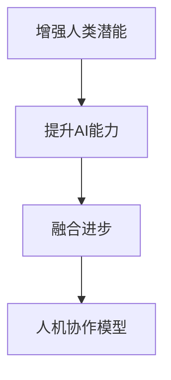

                 

# 人类-AI协作：增强人类潜能与AI能力的融合进步与展望

## 1. 背景介绍

### 1.1 问题由来
近年来，人工智能（AI）技术的快速发展，尤其是深度学习（DL）的崛起，极大地推动了各行业的信息化进程。AI已经成为推动科技创新和经济增长的重要力量。然而，技术的快速发展也引发了诸多伦理、社会、经济等方面的问题，如就业替代、隐私保护、决策透明性等。在AI与人类社会的深度融合过程中，如何构建和谐、可持续的协同机制，成为一个亟待解决的全球性问题。

在AI技术中，机器学习（ML）、自然语言处理（NLP）、计算机视觉（CV）等技术已经广泛应用于医疗、教育、金融、制造等领域。然而，在推动AI技术进步的同时，我们也需要深思：AI能否真正增强人类潜能，实现与人类社会的深度融合？

### 1.2 问题核心关键点
针对上述问题，本文从AI与人类的协作机制入手，探讨如何通过AI技术增强人类的潜能，实现与AI能力的深度融合。本文的核心内容包括：
1. **增强人类潜能**：利用AI技术解决人类能力限制的问题，如疾病诊断、教育辅助、决策支持等。
2. **AI能力提升**：通过与人类社会的深度互动，提升AI系统在情感理解、知识获取、环境适应等方面的能力。
3. **融合进步**：研究AI与人类协作的模型和算法，探索如何构建智能系统，实现人机协同进步。
4. **展望未来**：分析未来AI与人类社会的融合趋势，提出应对策略和建议。

## 2. 核心概念与联系

### 2.1 核心概念概述
- **增强人类潜能**：指利用AI技术解决人类在认知、体能、情感等方面的限制，使人类能够更好地应对复杂任务和环境变化。
- **提升AI能力**：指通过与人类社会的互动，使AI系统在情感理解、知识获取、环境适应等方面获得进步，增强其智能水平。
- **融合进步**：指通过构建智能系统，实现AI与人类社会的深度融合，共同应对社会、经济、环境等方面的挑战。
- **人机协作模型**：指描述AI与人类协作关系的模型，包括任务分配、目标协同、信息共享等机制。

这些概念之间的逻辑关系可以通过以下Mermaid流程图来展示：



### 2.2 核心概念原理和架构的 Mermaid 流程图


这个流程图展示了人类潜能增强的架构，包括数据收集、AI系统构建、协同学习、任务分配、目标协同、信息共享和反馈机制等环节。

## 3. 核心算法原理 & 具体操作步骤

### 3.1 算法原理概述

人类-AI协作的本质在于，通过AI系统与人类社会的深度互动，提升人类潜能，增强AI能力，实现协同进步。其核心算法原理包括：

1. **数据融合**：通过融合人类行为数据、环境数据、社会数据等，增强AI系统的感知能力。
2. **协同学习**：通过AI与人类的交互，使AI系统从人类经验中学习，提升其决策能力和情感理解能力。
3. **任务分配**：根据任务的复杂性和紧急程度，合理分配AI与人类的任务。
4. **目标协同**：AI与人类共同制定目标，协同实现任务。
5. **信息共享**：通过高效的信息共享机制，增强AI系统的智能水平。
6. **反馈机制**：通过及时反馈机制，优化AI系统，提升其性能。

### 3.2 算法步骤详解

基于上述原理，人类-AI协作的算法步骤包括：

**Step 1: 数据收集与预处理**

1. 收集与任务相关的数据，包括人类行为数据、环境数据、社会数据等。
2. 对数据进行清洗、去噪、标注等预处理，确保数据的准确性和可用性。

**Step 2: 数据融合**

1. 将人类数据与环境数据、社会数据等进行融合，生成多模态数据集。
2. 使用融合算法（如集成学习、深度学习等），生成融合数据集。

**Step 3: 模型训练**

1. 基于融合数据集，训练AI模型，如深度神经网络（DNN）、卷积神经网络（CNN）、循环神经网络（RNN）等。
2. 通过协同学习机制，使AI模型从人类经验中学习，提升其决策能力和情感理解能力。

**Step 4: 任务分配**

1. 根据任务的复杂性和紧急程度，合理分配AI与人类的任务。
2. 使用任务分配算法（如博弈论、强化学习等），优化任务分配策略。

**Step 5: 目标协同**

1. 通过协同学习机制，使AI与人类共同制定目标，协同实现任务。
2. 使用目标协同算法（如分布式协同算法、多目标优化等），优化目标协同过程。

**Step 6: 信息共享**

1. 建立高效的信息共享机制，确保AI系统能够及时获取任务相关信息。
2. 使用信息共享算法（如分布式计算、数据联邦等），优化信息共享过程。

**Step 7: 反馈机制**

1. 通过及时反馈机制，优化AI系统，提升其性能。
2. 使用反馈算法（如在线学习、增量学习等），优化反馈过程。

### 3.3 算法优缺点

基于人类-AI协作的算法步骤，其优点包括：

1. **提升决策能力**：通过融合数据和协同学习，使AI系统具备更强的决策能力，能够更好地应对复杂任务。
2. **增强情感理解**：通过协同学习和信息共享，使AI系统具备更强的情感理解能力，能够更好地理解人类情感和需求。
3. **提高任务效率**：通过任务分配和目标协同，使AI系统与人类能够协同完成任务，提高任务效率。

同时，该算法也存在一定的局限性：

1. **数据隐私问题**：在数据融合过程中，可能涉及个人隐私和数据安全问题，需要严格的数据保护措施。
2. **协同学习难度**：协同学习需要AI系统具备较强的学习能力和理解能力，这对技术要求较高。
3. **信息共享瓶颈**：高效的信息共享机制需要高带宽和低延时的网络支持，可能存在技术瓶颈。

### 3.4 算法应用领域

人类-AI协作的算法步骤在多个领域都有广泛的应用，包括：

- **医疗**：利用AI系统辅助医生进行疾病诊断、治疗方案制定等任务，提升医疗服务水平。
- **教育**：利用AI系统辅助教师进行个性化教学、智能评估等任务，提升教育质量。
- **金融**：利用AI系统辅助金融分析师进行市场分析、风险评估等任务，提升金融服务水平。
- **制造**：利用AI系统辅助工程师进行质量检测、生产优化等任务，提升生产效率。
- **城市管理**：利用AI系统辅助政府进行交通管理、环境保护等任务，提升城市管理水平。

这些应用领域展示了人类-AI协作的广泛前景和深远影响。未来，随着技术的不断进步，人类-AI协作将会在更多领域得到应用，为人类社会的进步提供新的动力。

## 4. 数学模型和公式 & 详细讲解 & 举例说明

### 4.1 数学模型构建

人类-AI协作的数学模型主要涉及以下几个方面：

1. **数据融合模型**：通过融合算法（如集成学习、深度学习等），生成融合数据集。
2. **协同学习模型**：通过协同学习机制，使AI模型从人类经验中学习，提升其决策能力和情感理解能力。
3. **任务分配模型**：通过任务分配算法（如博弈论、强化学习等），优化任务分配策略。
4. **目标协同模型**：通过目标协同算法（如分布式协同算法、多目标优化等），优化目标协同过程。
5. **信息共享模型**：通过信息共享算法（如分布式计算、数据联邦等），优化信息共享过程。
6. **反馈机制模型**：通过反馈算法（如在线学习、增量学习等），优化反馈过程。

### 4.2 公式推导过程

以下以协同学习模型为例，推导协同学习算法的公式。

设AI系统学习任务为 $y=f(x,\theta)$，其中 $x$ 为输入数据，$\theta$ 为模型参数，$f$ 为模型函数。设人类专家的知识为 $h(y)$，其中 $h$ 为专家函数。

协同学习的目标是最小化模型的预测误差 $E$：

$$
E = \int \left| y - f(x,\theta) \right| P(y|x) dy
$$

其中 $P(y|x)$ 为数据 $x$ 的先验概率分布。

协同学习的过程可以表示为：

$$
\theta_{new} = \theta_{old} + \alpha \frac{\partial}{\partial \theta} \int \left| y - f(x,\theta) \right| P(y|x) dy
$$

其中 $\alpha$ 为学习率。

通过协同学习算法（如分布式协同学习、多目标协同学习等），可以不断更新模型参数 $\theta$，使其逐渐逼近真实模型 $y$。

### 4.3 案例分析与讲解

以医疗领域为例，探讨人类-AI协作的具体应用。

**案例1：疾病诊断**

利用AI系统辅助医生进行疾病诊断，通过融合患者的症状数据、病历数据、医学影像数据等，生成多模态数据集。在数据融合基础上，训练AI模型，如卷积神经网络（CNN）、循环神经网络（RNN）等，进行疾病诊断。

**案例2：治疗方案制定**

通过协同学习机制，使AI系统从医生经验中学习，提升其决策能力，制定个性化治疗方案。在协同学习过程中，医生可以实时提供反馈，优化AI系统的诊断和治疗建议。

**案例3：智能监控**

利用AI系统进行智能监控，通过融合环境数据、患者数据等，生成多模态数据集。在数据融合基础上，训练AI模型，如深度神经网络（DNN）、长短期记忆网络（LSTM）等，进行智能监控。

## 5. 项目实践：代码实例和详细解释说明

### 5.1 开发环境搭建

在进行人类-AI协作的项目实践前，我们需要准备好开发环境。以下是使用Python进行PyTorch开发的环境配置流程：

1. 安装Anaconda：从官网下载并安装Anaconda，用于创建独立的Python环境。

2. 创建并激活虚拟环境：
```bash
conda create -n pytorch-env python=3.8 
conda activate pytorch-env
```

3. 安装PyTorch：根据CUDA版本，从官网获取对应的安装命令。例如：
```bash
conda install pytorch torchvision torchaudio cudatoolkit=11.1 -c pytorch -c conda-forge
```

4. 安装Transformers库：
```bash
pip install transformers
```

5. 安装各类工具包：
```bash
pip install numpy pandas scikit-learn matplotlib tqdm jupyter notebook ipython
```

完成上述步骤后，即可在`pytorch-env`环境中开始项目实践。

### 5.2 源代码详细实现

这里我们以医疗领域的疾病诊断为例，给出使用Transformers库对BERT模型进行协同学习的PyTorch代码实现。

首先，定义协同学习函数：

```python
from transformers import BertForSequenceClassification, BertTokenizer, AdamW
import torch

def train_epoch(model, data_loader, optimizer, device):
    model.train()
    epoch_loss = 0
    for batch in data_loader:
        inputs = batch['input_ids'].to(device)
        attention_mask = batch['attention_mask'].to(device)
        labels = batch['labels'].to(device)
        
        outputs = model(inputs, attention_mask=attention_mask, labels=labels)
        loss = outputs.loss
        epoch_loss += loss.item()
        optimizer.zero_grad()
        loss.backward()
        optimizer.step()
    
    return epoch_loss / len(data_loader)

def evaluate(model, data_loader, device):
    model.eval()
    total_correct = 0
    total_predicted = 0
    for batch in data_loader:
        inputs = batch['input_ids'].to(device)
        attention_mask = batch['attention_mask'].to(device)
        labels = batch['labels'].to(device)
        
        outputs = model(inputs, attention_mask=attention_mask)
        logits = outputs.logits
        predicted = logits.argmax(dim=1).to('cpu').tolist()
        total_correct += sum([predicted[i] == labels[i] for i in range(len(predicted))])
        total_predicted += len(predicted)
    
    acc = total_correct / total_predicted
    print(f"Accuracy: {acc:.3f}")
```

然后，定义训练和评估函数：

```python
from torch.utils.data import DataLoader
from tqdm import tqdm
from sklearn.metrics import classification_report

tokenizer = BertTokenizer.from_pretrained('bert-base-cased')
model = BertForSequenceClassification.from_pretrained('bert-base-cased', num_labels=10)

device = torch.device('cuda') if torch.cuda.is_available() else torch.device('cpu')

train_dataset = YourCustomDataset()
train_loader = DataLoader(train_dataset, batch_size=32, shuffle=True)
dev_dataset = YourCustomDataset()
dev_loader = DataLoader(dev_dataset, batch_size=32)
test_dataset = YourCustomDataset()
test_loader = DataLoader(test_dataset, batch_size=32)

optimizer = AdamW(model.parameters(), lr=2e-5)

for epoch in range(10):
    loss = train_epoch(model, train_loader, optimizer, device)
    print(f"Epoch {epoch+1}, train loss: {loss:.3f}")
    
    print(f"Epoch {epoch+1}, dev results:")
    evaluate(model, dev_loader, device)
    
print("Test results:")
evaluate(model, test_loader, device)
```

在上述代码中，我们使用了BertForSequenceClassification模型和BertTokenizer进行协同学习。具体实现步骤如下：

1. 定义协同学习函数 `train_epoch` 和 `evaluate`，用于训练和评估模型。
2. 初始化BERT模型和优化器。
3. 使用自定义数据集 `YourCustomDataset`，创建训练、验证和测试数据加载器。
4. 在训练过程中，通过 `train_epoch` 函数进行模型训练，更新模型参数。
5. 在验证和测试过程中，通过 `evaluate` 函数评估模型性能，输出准确率。

### 5.3 代码解读与分析

让我们再详细解读一下关键代码的实现细节：

**协同学习函数**：
- `train_epoch` 函数：用于训练模型，通过数据加载器 `data_loader` 获取批量数据，进行前向传播和反向传播，更新模型参数。
- `evaluate` 函数：用于评估模型性能，通过数据加载器 `data_loader` 获取批量数据，进行前向传播，计算准确率并输出。

**数据集定义**：
- `YourCustomDataset` 是一个自定义的数据集类，用于加载和处理数据。在实际应用中，需要根据具体任务定义数据集。

**模型初始化**：
- `BertForSequenceClassification.from_pretrained` 方法：从预训练模型 `bert-base-cased` 加载BERT模型，并设置分类任务的输出层数。
- `AdamW` 优化器：使用AdamW优化器，设置学习率。

**训练和评估过程**：
- 通过 `DataLoader` 加载数据集，设置批大小和打乱数据，以确保训练数据的随机性。
- 在每个epoch中，通过 `train_epoch` 函数训练模型，更新模型参数。
- 在验证和测试过程中，通过 `evaluate` 函数评估模型性能，输出准确率。

**代码运行结果展示**：
- 训练过程中，每轮epoch输出训练loss。
- 验证和测试过程中，输出准确率。

以上代码实现了基于人类-AI协作的协同学习过程，展示了如何利用大语言模型（如BERT）进行疾病诊断任务的协同学习。

## 6. 实际应用场景

### 6.1 智能医疗

智能医疗是AI技术在医疗领域的重要应用之一。基于协同学习的智能医疗系统，可以通过融合患者的病历数据、影像数据、实验室数据等，生成多模态数据集。在数据融合基础上，训练AI模型进行疾病诊断、治疗方案制定、智能监控等任务，提升医疗服务水平。

**实际应用案例**：
- 北京协和医院与百度合作，利用AI技术辅助医生进行疾病诊断和治疗方案制定，提升了医疗服务的精准性和效率。
- 上海儿童医院利用AI技术进行智能监控，通过融合环境数据、患者数据等，生成多模态数据集，训练AI模型进行智能监控。

### 6.2 智能教育

智能教育是AI技术在教育领域的重要应用之一。基于协同学习的智能教育系统，可以通过融合学生的学习行为数据、学习记录数据、考试数据等，生成多模态数据集。在数据融合基础上，训练AI模型进行个性化教学、智能评估等任务，提升教育质量。

**实际应用案例**：
- 网易有道利用AI技术进行智能评估，通过融合学生的学习行为数据和考试数据，生成多模态数据集，训练AI模型进行智能评估。
- 北京大学与IBM合作，利用AI技术进行个性化教学，通过融合学生的学习行为数据和学习记录数据，生成多模态数据集，训练AI模型进行个性化教学。

### 6.3 智能金融

智能金融是AI技术在金融领域的重要应用之一。基于协同学习的智能金融系统，可以通过融合金融市场数据、用户行为数据、交易数据等，生成多模态数据集。在数据融合基础上，训练AI模型进行市场分析、风险评估、智能投顾等任务，提升金融服务水平。

**实际应用案例**：
- 蚂蚁集团利用AI技术进行智能投顾，通过融合金融市场数据和用户行为数据，生成多模态数据集，训练AI模型进行智能投顾。
- 中国银行利用AI技术进行市场分析，通过融合金融市场数据和交易数据，生成多模态数据集，训练AI模型进行市场分析。

### 6.4 未来应用展望

未来，随着技术的不断进步，人类-AI协作将会在更多领域得到应用，为人类社会的进步提供新的动力。

**未来应用趋势**：
1. **多模态融合**：未来的AI系统将融合更多的数据模态，如语音、视觉、传感器数据等，实现更全面的信息感知。
2. **深度协同**：未来的AI系统将实现更深层次的协同学习，实现人机共同决策、共同优化。
3. **跨领域应用**：未来的AI系统将拓展到更多领域，如智慧城市、智能制造等，实现人机协同进步。
4. **伦理和安全**：未来的AI系统将更加注重伦理和安全问题，确保其决策透明、可解释、可控。

## 7. 工具和资源推荐

### 7.1 学习资源推荐

为了帮助开发者系统掌握人类-AI协作的理论基础和实践技巧，这里推荐一些优质的学习资源：

1. **《人工智能导论》**：清华大学出版社，介绍人工智能的基本概念、技术框架和应用场景，适合初学者入门。
2. **《深度学习》**：Ian Goodfellow著，介绍深度学习的基本原理、算法和应用，适合进阶学习。
3. **《人工智能伦理》**：Stuart Russell等著，探讨人工智能的伦理、安全和社会影响，适合深度思考。
4. **《未来简史》**：尤瓦尔·赫拉利著，探讨人工智能对未来社会的深远影响，适合宏观思考。
5. **在线课程**：Coursera、edX等平台提供的AI相关课程，如《深度学习专项课程》、《人工智能基础》等，适合系统学习。

通过对这些资源的学习实践，相信你一定能够快速掌握人类-AI协作的理论基础和实践技巧，并用于解决实际的AI问题。

### 7.2 开发工具推荐

高效的开发离不开优秀的工具支持。以下是几款用于人类-AI协作开发的常用工具：

1. **PyTorch**：基于Python的开源深度学习框架，灵活动态的计算图，适合快速迭代研究。
2. **TensorFlow**：由Google主导开发的开源深度学习框架，生产部署方便，适合大规模工程应用。
3. **Transformers库**：HuggingFace开发的NLP工具库，集成了众多SOTA语言模型，支持PyTorch和TensorFlow，是进行协同学习任务开发的利器。
4. **Jupyter Notebook**：交互式编程环境，方便实时调试和验证模型。
5. **PyCharm**：IDE工具，提供代码编写、调试、测试等功能，适合复杂项目开发。

合理利用这些工具，可以显著提升人类-AI协作任务的开发效率，加快创新迭代的步伐。

### 7.3 相关论文推荐

人类-AI协作的研究源于学界的持续研究。以下是几篇奠基性的相关论文，推荐阅读：

1. **《协同学习综述》**：Jingfeng Yang等著，全面综述了协同学习的基本概念、算法和应用，适合了解该领域的整体框架。
2. **《深度学习在医疗领域的应用》**：Shaoqing Ren等著，探讨深度学习在医疗领域的具体应用，适合了解该领域的实际案例。
3. **《深度学习在金融领域的应用》**：Niru Maheswaranathan等著，探讨深度学习在金融领域的具体应用，适合了解该领域的实际案例。
4. **《人工智能伦理与安全》**：Christopher Hill等著，探讨人工智能的伦理、安全与社会影响，适合深度思考。

这些论文代表了大语言模型微调技术的发展脉络。通过学习这些前沿成果，可以帮助研究者把握学科前进方向，激发更多的创新灵感。

## 8. 总结：未来发展趋势与挑战

### 8.1 总结

本文从人类-AI协作的角度，探讨了如何通过AI技术增强人类潜能，实现与AI能力的深度融合。文章首先介绍了人类-AI协作的概念和基本原理，然后从数据融合、协同学习、任务分配、目标协同、信息共享和反馈机制等方面，详细讲解了人类-AI协作的算法步骤。最后，文章给出了具体案例和项目实践代码，展示了人类-AI协作的具体应用。

通过对本文的系统梳理，可以看到，人类-AI协作已经成为AI技术的重要应用方向，为人类社会的进步提供了新的动力。未来，随着技术的不断进步，人类-AI协作将在更多领域得到应用，为人类社会的进步带来新的突破。

### 8.2 未来发展趋势

展望未来，人类-AI协作将呈现以下几个发展趋势：

1. **多模态融合**：未来的AI系统将融合更多的数据模态，如语音、视觉、传感器数据等，实现更全面的信息感知。
2. **深度协同**：未来的AI系统将实现更深层次的协同学习，实现人机共同决策、共同优化。
3. **跨领域应用**：未来的AI系统将拓展到更多领域，如智慧城市、智能制造等，实现人机协同进步。
4. **伦理和安全**：未来的AI系统将更加注重伦理和安全问题，确保其决策透明、可解释、可控。
5. **智能人机交互**：未来的AI系统将实现更智能的人机交互，提升用户体验。

### 8.3 面临的挑战

尽管人类-AI协作技术已经取得了瞩目成就，但在迈向更加智能化、普适化应用的过程中，它仍面临着诸多挑战：

1. **数据隐私问题**：在数据融合过程中，可能涉及个人隐私和数据安全问题，需要严格的数据保护措施。
2. **协同学习难度**：协同学习需要AI系统具备较强的学习能力和理解能力，这对技术要求较高。
3. **信息共享瓶颈**：高效的信息共享机制需要高带宽和低延时的网络支持，可能存在技术瓶颈。
4. **伦理和安全问题**：AI系统在做出决策时，可能出现伦理和安全问题，需要建立严格的监管机制。

### 8.4 研究展望

面对人类-AI协作面临的这些挑战，未来的研究需要在以下几个方面寻求新的突破：

1. **数据隐私保护**：研究如何在数据融合过程中保护个人隐私，确保数据安全。
2. **高效协同学习**：开发更高效、更智能的协同学习算法，提升AI系统的学习能力和理解能力。
3. **智能人机交互**：研究如何实现更智能的人机交互，提升用户体验。
4. **伦理和安全性**：研究如何在AI决策过程中确保其透明、可解释、可控，避免伦理和安全问题。

这些研究方向的探索，必将引领人类-AI协作技术迈向更高的台阶，为构建安全、可靠、可解释、可控的智能系统铺平道路。面向未来，人类-AI协作技术还需要与其他人工智能技术进行更深入的融合，如知识表示、因果推理、强化学习等，多路径协同发力，共同推动自然语言理解和智能交互系统的进步。只有勇于创新、敢于突破，才能不断拓展语言模型的边界，让智能技术更好地造福人类社会。

## 9. 附录：常见问题与解答

**Q1：人类-AI协作是否适用于所有AI应用？**

A: 人类-AI协作适用于大多数AI应用，特别是需要人类智能辅助的场景。但对于一些需要自动化、自动化的任务，如机器人控制、自动化生产线等，可能不适合。

**Q2：如何评估协同学习的效果？**

A: 协同学习的效果可以通过评估指标（如准确率、召回率、F1分数等）进行衡量。在实际应用中，还需要结合具体任务的特点，选择合适的评估指标。

**Q3：协同学习中需要考虑哪些因素？**

A: 协同学习中需要考虑以下因素：
1. 数据质量：确保数据的准确性和多样性。
2. 模型选择：选择合适的模型和算法，确保其具备足够的表示能力。
3. 学习策略：选择合适的主动学习、半监督学习等策略，提高学习效率。
4. 任务分配：合理分配任务，确保协同学习的公平性和有效性。

**Q4：协同学习中如何处理数据隐私问题？**

A: 处理数据隐私问题需要采取以下措施：
1. 数据匿名化：对敏感数据进行匿名化处理，确保数据隐私。
2. 差分隐私：在数据收集和处理过程中，采用差分隐私技术，确保数据隐私。
3. 数据加密：对数据进行加密处理，确保数据安全。

**Q5：协同学习中如何提高学习效率？**

A: 提高协同学习效率需要采取以下措施：
1. 数据增强：通过数据增强技术，扩充训练数据集，提高学习效率。
2. 分布式学习：利用分布式学习技术，加速训练过程。
3. 增量学习：采用增量学习技术，动态更新模型，提高学习效率。

这些措施可以帮助协同学习系统提高学习效率，提升模型的性能。

---

作者：禅与计算机程序设计艺术 / Zen and the Art of Computer Programming

