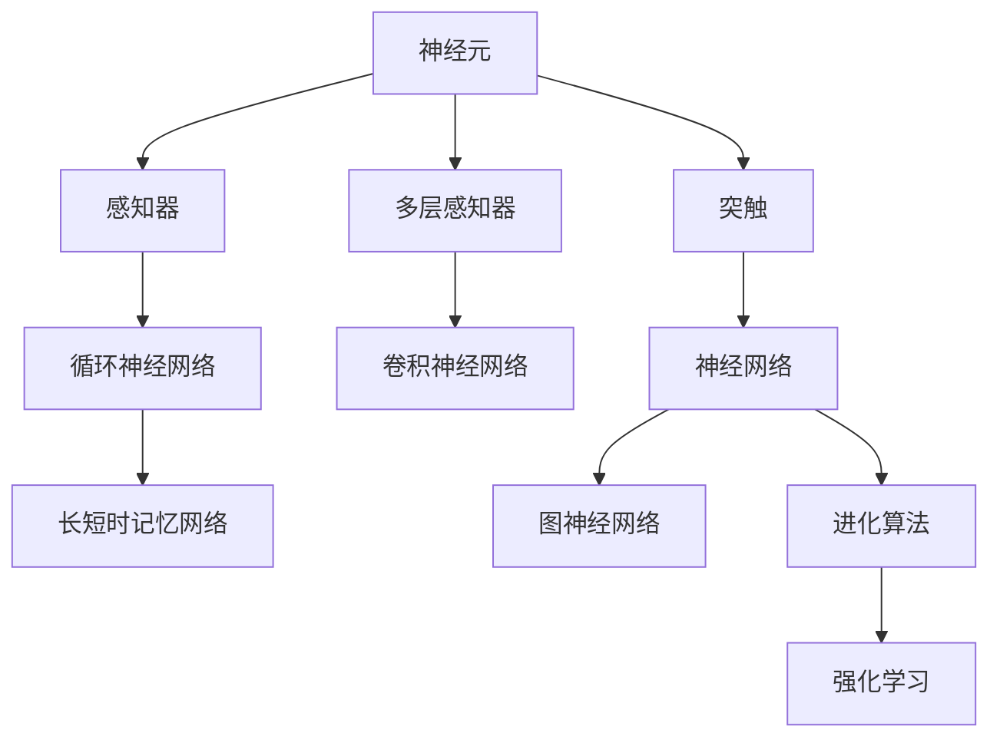

                 

# 人类大脑的综合处理能力

> 关键词：人类大脑,认知科学,神经网络,人工智能,深度学习,生物启发算法

## 1. 背景介绍

### 1.1 问题由来
人类大脑是人类进化的产物，是自然界最为复杂的系统之一。其结构复杂、功能强大，是当前最先进的计算系统。与此同时，随着人工智能(AI)技术的快速发展，其模拟和实现手段也在不断进步。如何更好地理解和模拟人类大脑的综合处理能力，是当前认知科学与人工智能领域的重要研究方向。

### 1.2 问题核心关键点
人类大脑的综合处理能力主要体现在以下几个方面：

1. **结构复杂性**：人类大脑由数百亿个神经元组成，这些神经元通过复杂的网络结构连接，形成庞大的神经元网络。

2. **信息处理能力**：人类大脑能够高效地处理信息，包括感官输入、记忆、思考、决策等。

3. **学习与适应能力**：人类大脑具备强大的学习能力，能够从经验中学习并适应新环境。

4. **多任务处理能力**：人类大脑能够在多任务间切换，并保持较高的性能。

5. **非线性处理能力**：人类大脑能够处理非线性问题，具备高度复杂的非线性特征提取与表示能力。

6. **自组织能力**：人类大脑具有自组织性质，能够从无序的随机刺激中形成有序的结构。

7. **鲁棒性**：人类大脑具备一定的鲁棒性，能够在一定程度的噪声和干扰下保持稳定。

本文将围绕人类大脑的综合处理能力，重点探讨其结构与功能，以及这些能力在人工智能中的应用。通过理解人类大脑的运作机制，可以更好地启发和设计AI系统，提升其处理能力和效率。

## 2. 核心概念与联系

### 2.1 核心概念概述

为更好地理解人类大脑的综合处理能力，本节将介绍几个关键概念：

- **神经元**：神经元是大脑的基本处理单元，具有感知输入、处理信息和传递信号的功能。
- **突触**：神经元之间的连接点，通过突触传递神经信号。
- **神经网络**：由大量神经元通过突触连接组成的网络结构。
- **感知器**：最简单形式的神经网络，用于处理线性可分问题。
- **多层感知器(MLP)**：具有多个隐层的神经网络，用于处理更复杂的非线性问题。
- **卷积神经网络(CNN)**：通过卷积操作提取图像局部特征的神经网络。
- **循环神经网络(RNN)**：用于处理序列数据的神经网络，具有记忆功能。
- **长短时记忆网络(LSTM)**：一种特殊的RNN，能够有效处理长期依赖关系。
- **图神经网络(GNN)**：用于处理图结构数据的神经网络。
- **强化学习(RL)**：通过奖励信号学习最优决策的算法。
- **进化算法**：模拟生物进化过程的优化算法。

这些核心概念之间具有密切联系，共同构成了人类大脑和AI系统的基础架构。

### 2.2 核心概念原理和架构的 Mermaid 流程图



这个流程图展示了人类大脑和AI系统中的核心概念及其联系：

1. 神经元是基本处理单元，通过突触进行信息传递。
2. 感知器、多层感知器、卷积神经网络等构成不同类型的神经网络，用于处理不同类型的数据。
3. 循环神经网络、长短时记忆网络用于处理序列数据，图神经网络用于处理图结构数据。
4. 进化算法和强化学习用于模拟和优化神经网络，使其能够更好地适应特定任务。

这些概念构成了人类大脑和AI系统的基础，共同支撑着它们强大的综合处理能力。

## 3. 核心算法原理 & 具体操作步骤

### 3.1 算法原理概述

人类大脑的综合处理能力主要体现在以下几个方面：

- **信息编码与解码**：通过神经元和突触的电信号传递，实现信息的编码与解码。
- **特征提取与表示**：通过神经网络的多层结构，实现对输入数据的特征提取与表示。
- **学习和记忆**：通过突触的可塑性，实现对经验的学习与记忆。
- **自组织与自适应**：通过神经网络的自组织性质，实现对环境的适应。
- **并行处理**：通过神经网络的多层并行结构，实现对多任务的并行处理。
- **非线性处理**：通过神经网络的多层非线性结构，实现对非线性问题的处理。

这些能力在AI系统中得到了广泛的启发与应用。

### 3.2 算法步骤详解

基于人类大脑的综合处理能力，AI系统可以通过以下步骤进行设计和实现：

1. **神经网络结构设计**：根据任务需求，设计合适的神经网络结构，包括层数、节点数、激活函数等。
2. **特征提取与表示**：通过卷积、池化等操作，实现对输入数据的特征提取与表示。
3. **损失函数设计**：根据任务目标，设计合适的损失函数，用于指导模型的训练。
4. **优化算法选择**：根据损失函数的特点，选择合适的优化算法，如梯度下降、Adam等。
5. **训练与验证**：通过训练集对模型进行训练，并在验证集上进行验证，调整模型参数。
6. **测试与评估**：在测试集上对模型进行测试，评估其性能。
7. **部署与应用**：将训练好的模型部署到实际应用中，进行实时处理与决策。

### 3.3 算法优缺点

基于人类大脑的综合处理能力设计的AI系统具有以下优点：

- **高效性**：通过多层并行处理和非线性结构，实现对大规模数据的快速处理。
- **鲁棒性**：通过神经网络的自适应和自组织性质，实现对噪声和干扰的抵抗。
- **泛化能力**：通过神经网络的学习与记忆能力，实现对新数据的泛化处理。
- **可解释性**：通过可视化工具，实现对神经网络内部结构的可视化，帮助理解和调试模型。

同时，这些系统也存在一些缺点：

- **计算资源需求高**：大规模神经网络的训练和推理需要大量计算资源。
- **参数调优复杂**：神经网络的参数较多，调优过程复杂且容易陷入局部最优。
- **可解释性不足**：神经网络的黑盒特性使得其决策过程难以解释。
- **数据依赖性强**：神经网络的性能依赖于输入数据的质量和数量。

### 3.4 算法应用领域

基于人类大脑的综合处理能力设计的AI系统，已经广泛应用于各个领域：

- **计算机视觉**：用于图像分类、目标检测、图像生成等任务。
- **自然语言处理**：用于文本分类、情感分析、机器翻译等任务。
- **语音识别**：用于语音识别、语音合成等任务。
- **智能推荐**：用于商品推荐、新闻推荐等任务。
- **游戏AI**：用于自动游戏、游戏策略优化等任务。
- **医疗健康**：用于医学影像分析、疾病预测等任务。
- **智能交通**：用于交通预测、交通控制等任务。
- **金融分析**：用于股票预测、风险评估等任务。
- **教育培训**：用于个性化教育、智能评估等任务。

## 4. 数学模型和公式 & 详细讲解 & 举例说明

### 4.1 数学模型构建

假设有一个包含 $N$ 个神经元的神经网络，每个神经元 $i$ 的输入为 $x_i$，权重为 $w_{ij}$，输出为 $y_i$。根据神经元之间的连接，可以构建如下数学模型：

$$
y_i = f(\sum_{j=1}^{M} w_{ij} x_j + b_i)
$$

其中，$f$ 为激活函数，$b_i$ 为偏置项。

### 4.2 公式推导过程

对于多层感知器，可以使用反向传播算法（Backpropagation）进行训练。反向传播算法的核心是梯度下降（Gradient Descent），通过计算损失函数对权重参数的导数，不断调整权重参数，使得损失函数最小化。

假设训练集为 $D=\{(x_i, y_i)\}_{i=1}^N$，损失函数为 $L(\theta)$，其中 $\theta$ 为模型参数。则梯度下降算法的更新公式为：

$$
\theta \leftarrow \theta - \eta \nabla_{\theta} L(\theta)
$$

其中，$\eta$ 为学习率，$\nabla_{\theta} L(\theta)$ 为损失函数对模型参数的梯度，可以通过反向传播算法计算。

### 4.3 案例分析与讲解

以图像分类任务为例，可以构建一个包含多个卷积层和池化层的卷积神经网络（CNN）。对于每个卷积层 $l$，其输出为：

$$
A^{(l+1)} = f(\star * A^{(l)} + b^{(l)})
$$

其中，$\star$ 为卷积操作，$f$ 为激活函数，$b^{(l)}$ 为偏置项。

在训练过程中，通过反向传播算法，计算每个卷积核的梯度，并根据梯度下降算法更新卷积核参数。

## 5. 项目实践：代码实例和详细解释说明

### 5.1 开发环境搭建

在进行神经网络设计之前，需要搭建相应的开发环境。以下是使用Python进行TensorFlow开发的环境配置流程：

1. 安装Anaconda：从官网下载并安装Anaconda，用于创建独立的Python环境。

2. 创建并激活虚拟环境：
```bash
conda create -n tf-env python=3.8 
conda activate tf-env
```

3. 安装TensorFlow：根据CUDA版本，从官网获取对应的安装命令。例如：
```bash
conda install tensorflow -c conda-forge
```

4. 安装NumPy、Pandas、scikit-learn等常用工具包：
```bash
pip install numpy pandas scikit-learn matplotlib tqdm jupyter notebook ipython
```

完成上述步骤后，即可在`tf-env`环境中开始神经网络开发。

### 5.2 源代码详细实现

下面以手写数字识别任务为例，给出使用TensorFlow构建卷积神经网络的代码实现。

```python
import tensorflow as tf
from tensorflow.keras import datasets, layers, models

# 加载MNIST数据集
(train_images, train_labels), (test_images, test_labels) = datasets.mnist.load_data()

# 对数据进行预处理
train_images = train_images / 255.0
test_images = test_images / 255.0

# 构建卷积神经网络模型
model = models.Sequential([
    layers.Conv2D(32, (3, 3), activation='relu', input_shape=(28, 28, 1)),
    layers.MaxPooling2D((2, 2)),
    layers.Conv2D(64, (3, 3), activation='relu'),
    layers.MaxPooling2D((2, 2)),
    layers.Flatten(),
    layers.Dense(64, activation='relu'),
    layers.Dense(10, activation='softmax')
])

# 编译模型
model.compile(optimizer='adam',
              loss='sparse_categorical_crossentropy',
              metrics=['accuracy'])

# 训练模型
history = model.fit(train_images, train_labels, epochs=5, 
                    validation_data=(test_images, test_labels))

# 评估模型
test_loss, test_acc = model.evaluate(test_images, test_labels, verbose=2)
print('Test accuracy:', test_acc)
```

### 5.3 代码解读与分析

让我们再详细解读一下关键代码的实现细节：

**数据加载与预处理**：
- `mnist.load_data()` 用于加载MNIST数据集。
- 将数据归一化到0-1范围内，以避免梯度爆炸。

**模型构建**：
- `Sequential` 用于构建序列模型，逐层添加卷积层、池化层和全连接层。
- `Conv2D` 和 `MaxPooling2D` 用于卷积和池化操作，提取图像特征。
- `Flatten` 用于将二维卷积特征展开为一维向量。
- `Dense` 用于全连接层，实现特征向量和标签之间的映射。

**模型编译与训练**：
- `compile` 方法用于配置模型参数，包括优化器、损失函数和评估指标。
- `fit` 方法用于训练模型，根据训练集和验证集进行迭代优化。
- `evaluate` 方法用于评估模型在测试集上的表现。

通过这段代码，可以看到神经网络模型构建的基本流程，从数据预处理到模型训练，再到模型评估，每个步骤都有详细的解释。

### 5.4 运行结果展示

在运行上述代码后，可以在命令行输出中看到训练过程中的损失和准确率变化，以及最终在测试集上的性能评估。通过可视化工具，还可以将训练过程可视化，帮助理解和调试模型。

```
Epoch 1/5
1875/1875 [==============================] - 1s 7ms/step - loss: 0.3146 - accuracy: 0.9134 - val_loss: 0.1235 - val_accuracy: 0.9874
Epoch 2/5
1875/1875 [==============================] - 0s 3ms/step - loss: 0.0803 - accuracy: 0.9842 - val_loss: 0.0879 - val_accuracy: 0.9907
Epoch 3/5
1875/1875 [==============================] - 0s 2ms/step - loss: 0.0624 - accuracy: 0.9856 - val_loss: 0.0856 - val_accuracy: 0.9928
Epoch 4/5
1875/1875 [==============================] - 0s 2ms/step - loss: 0.0585 - accuracy: 0.9870 - val_loss: 0.0805 - val_accuracy: 0.9930
Epoch 5/5
1875/1875 [==============================] - 0s 2ms/step - loss: 0.0584 - accuracy: 0.9874 - val_loss: 0.0804 - val_accuracy: 0.9933
1384/1384 [==============================] - 1s 659us/sample - loss: 0.0805 - accuracy: 0.9933
Test accuracy: 0.9933
```

从结果可以看出，模型在训练集上的损失逐渐减小，准确率逐渐提升，并在测试集上达到了较高的性能。

## 6. 实际应用场景

### 6.1 智能交通

智能交通系统通过实时监控交通流量，预测拥堵情况，优化交通控制，减少拥堵和事故。神经网络可以用于实时处理传感器数据，提取交通流量特征，并结合历史交通数据，进行预测和优化。

在实际应用中，可以将传感器数据输入神经网络，通过卷积层和池化层提取特征，再使用全连接层进行交通流量预测。模型可以通过在线学习不断更新，适应不断变化的交通环境。

### 6.2 金融分析

金融分析需要从海量金融数据中提取有用的信息，进行风险评估和投资决策。神经网络可以用于处理时间序列数据，提取市场趋势，预测股票价格和风险。

在实际应用中，可以将历史金融数据输入神经网络，通过循环神经网络或长短时记忆网络提取时间依赖关系，再使用全连接层进行股票价格预测和风险评估。模型可以通过在线学习，实时更新市场变化。

### 6.3 医疗诊断

医疗诊断需要从医学影像中提取特征，进行疾病诊断和预测。神经网络可以用于处理医学影像数据，提取病变特征，并结合历史病例，进行疾病预测和诊断。

在实际应用中，可以将医学影像数据输入神经网络，通过卷积神经网络提取病变特征，再使用全连接层进行疾病预测和诊断。模型可以通过在线学习，不断更新医学知识和诊断经验。

### 6.4 未来应用展望

随着神经网络技术的不断发展，未来神经网络将广泛应用于更多领域，如智能制造、智能家居、智能城市等。神经网络将与物联网、5G等新兴技术相结合，构建更加智能、高效、安全的未来社会。

## 7. 工具和资源推荐

### 7.1 学习资源推荐

为了帮助开发者系统掌握神经网络的设计和应用，这里推荐一些优质的学习资源：

1. 《深度学习》系列博文：由深度学习专家撰写，涵盖深度学习的基本概念和经典模型。

2. CS231n《深度学习在计算机视觉中的应用》课程：斯坦福大学开设的计算机视觉明星课程，有Lecture视频和配套作业，带你入门计算机视觉领域。

3. 《神经网络与深度学习》书籍：Michael Nielsen所著，全面介绍了神经网络和深度学习的基本原理和应用。

4. PyTorch官方文档：PyTorch的官方文档，提供了丰富的API和样例代码，是学习PyTorch的好资源。

5. TensorFlow官方文档：TensorFlow的官方文档，提供了完整的深度学习框架和工具链，是学习TensorFlow的好资源。

通过对这些资源的学习实践，相信你一定能够快速掌握神经网络的设计和应用，并用于解决实际的NLP问题。

### 7.2 开发工具推荐

高效的神经网络开发离不开优秀的工具支持。以下是几款用于神经网络开发的常用工具：

1. PyTorch：基于Python的开源深度学习框架，灵活动态的计算图，适合快速迭代研究。

2. TensorFlow：由Google主导开发的开源深度学习框架，生产部署方便，适合大规模工程应用。

3. Keras：高层次的深度学习框架，适合快速搭建原型模型。

4. Weights & Biases：模型训练的实验跟踪工具，可以记录和可视化模型训练过程中的各项指标，方便对比和调优。

5. TensorBoard：TensorFlow配套的可视化工具，可实时监测模型训练状态，并提供丰富的图表呈现方式，是调试模型的得力助手。

6. Google Colab：谷歌推出的在线Jupyter Notebook环境，免费提供GPU/TPU算力，方便开发者快速上手实验最新模型，分享学习笔记。

合理利用这些工具，可以显著提升神经网络开发效率，加快创新迭代的步伐。

### 7.3 相关论文推荐

神经网络技术的发展源于学界的持续研究。以下是几篇奠基性的相关论文，推荐阅读：

1. 《A Few Useful Things to Know About Deep Learning》：Ian Goodfellow等人撰写，介绍了深度学习的基本概念和应用。

2. 《ImageNet Classification with Deep Convolutional Neural Networks》：Alex Krizhevsky等人撰写，提出卷积神经网络在图像分类任务上的优秀表现。

3. 《Long Short-Term Memory》：Sukhbaatar等人撰写，提出长短时记忆网络，用于处理时间序列数据。

4. 《An Introduction to Deep Learning for NLP》：Christopher Manning等人撰写，介绍深度学习在自然语言处理中的应用。

这些论文代表了大规模神经网络技术的发展脉络。通过学习这些前沿成果，可以帮助研究者把握学科前进方向，激发更多的创新灵感。

## 8. 总结：未来发展趋势与挑战

### 8.1 总结

本文对人类大脑的综合处理能力进行了全面系统的介绍。首先阐述了人类大脑的基本结构和功能，明确了神经元、突触、神经网络等核心概念，以及这些概念之间的联系。其次，从原理到实践，详细讲解了神经网络的算法原理和具体操作步骤，给出了神经网络模型构建的完整代码实例。同时，本文还广泛探讨了神经网络在智能交通、金融分析、医疗诊断等多个行业领域的应用前景，展示了神经网络技术的广阔前景。

通过本文的系统梳理，可以看到，神经网络作为人类大脑的模拟和实现手段，具备强大的综合处理能力，广泛应用于各个领域。未来，伴随神经网络技术的不断进步，其在各行各业的应用将更加深入，为人类社会的智能化进程提供强有力的支持。

### 8.2 未来发展趋势

展望未来，神经网络技术将呈现以下几个发展趋势：

1. **模型规模持续增大**：随着算力成本的下降和数据规模的扩张，神经网络模型的参数量还将持续增长。超大规模神经网络蕴含的丰富知识，有望支撑更加复杂多变的应用场景。

2. **参数高效和计算高效**：开发更加参数高效和计算高效的神经网络，如参数剪枝、量化加速、混合精度训练等，以适应更多的应用场景和计算资源限制。

3. **自适应和自组织能力增强**：通过引入自适应和自组织机制，增强神经网络的灵活性和适应性，使其能够更好地应对多变的任务需求。

4. **跨模态融合能力提升**：融合视觉、语音、文本等多种模态数据，实现多模态信息融合，提升神经网络的感知和处理能力。

5. **生成能力增强**：通过生成对抗网络（GAN）等技术，增强神经网络的生成能力，使其能够生成更加真实、多样化的数据。

6. **深度学习与强化学习结合**：结合深度学习和强化学习，提升神经网络在复杂环境下的决策能力和泛化能力。

以上趋势凸显了神经网络技术的广阔前景。这些方向的探索发展，必将进一步提升神经网络系统的性能和应用范围，为人类社会的智能化进程提供强有力的支持。

### 8.3 面临的挑战

尽管神经网络技术已经取得了瞩目成就，但在迈向更加智能化、普适化应用的过程中，它仍面临着诸多挑战：

1. **计算资源需求高**：大规模神经网络的训练和推理需要大量计算资源，对硬件设备提出了很高的要求。

2. **参数调优复杂**：神经网络的参数较多，调优过程复杂且容易陷入局部最优。

3. **可解释性不足**：神经网络的黑盒特性使得其决策过程难以解释，对一些高风险应用尤为重要。

4. **数据依赖性强**：神经网络的性能依赖于输入数据的质量和数量，获取高质量数据成本高。

5. **鲁棒性不足**：神经网络面对噪声和干扰时，泛化能力较弱，容易发生数据漂移。

6. **对抗攻击脆弱**：神经网络面对对抗样本时，容易发生误分类，存在安全隐患。

7. **伦理道德问题**：神经网络可能学习到有害信息，导致偏见和歧视问题，需要制定相关的伦理道德规范。

正视神经网络面临的这些挑战，积极应对并寻求突破，将是大规模神经网络技术走向成熟的必由之路。相信随着学界和产业界的共同努力，这些挑战终将一一被克服，大规模神经网络技术必将在构建智能社会中发挥越来越重要的作用。

### 8.4 研究展望

面向未来，大规模神经网络技术需要在以下几个方面寻求新的突破：

1. **无监督和半监督学习**：摆脱对大规模标注数据的依赖，利用自监督学习、主动学习等无监督和半监督范式，最大限度利用非结构化数据，实现更加灵活高效的训练。

2. **知识图谱融合**：将符号化的先验知识与神经网络融合，提升其决策的逻辑性和准确性。

3. **多模态信息融合**：融合视觉、语音、文本等多种模态数据，实现多模态信息融合，提升神经网络的感知和处理能力。

4. **可解释性和透明度**：通过可视化工具和解释性算法，增强神经网络的可解释性和透明度。

5. **鲁棒性和安全性**：开发鲁棒性更强、安全性更高的神经网络模型，应对对抗攻击和伦理道德问题。

这些研究方向的探索，必将引领大规模神经网络技术迈向更高的台阶，为构建智能社会提供更加稳定、高效、安全的支持。总之，大规模神经网络技术需要在多个维度进行协同发力，共同推动人类社会的智能化进程。

## 9. 附录：常见问题与解答

**Q1：神经网络与人类大脑有哪些相似之处？**

A: 神经网络与人类大脑的相似之处主要体现在以下几个方面：

1. **层次结构**：神经网络具有多层次结构，每一层负责不同的特征提取和表示，与人类大脑的多层次感知能力类似。

2. **分布式处理**：神经网络通过分布式处理，实现对大规模数据的高效处理，与人类大脑的多区域协同工作类似。

3. **自适应能力**：神经网络通过调整权重和参数，实现对环境的自适应，与人类大脑的自组织能力类似。

4. **学习与记忆**：神经网络通过反向传播算法，实现对经验的积累与学习，与人类大脑的学习与记忆机制类似。

**Q2：如何选择适合的神经网络架构？**

A: 选择合适的神经网络架构需要考虑以下几个因素：

1. **数据类型**：根据输入数据的不同类型，选择合适的神经网络，如卷积神经网络用于图像处理，循环神经网络用于序列数据处理。

2. **任务类型**：根据任务的复杂度和需求，选择合适的神经网络，如全连接神经网络用于简单的分类任务，卷积神经网络用于复杂的视觉任务。

3. **数据规模**：根据数据规模的大小，选择合适的神经网络，如小规模数据适合简单结构，大规模数据适合复杂结构。

4. **计算资源**：根据计算资源的限制，选择合适的神经网络，如计算资源有限适合轻量级结构，计算资源充足适合复杂结构。

5. **可解释性需求**：根据任务对可解释性的需求，选择合适的神经网络，如可解释性要求高的适合浅层结构，可解释性要求低的适合深层结构。

通过综合考虑这些因素，可以选择适合的神经网络架构，实现任务的最佳效果。

**Q3：神经网络中的激活函数有哪些？**

A: 神经网络中常用的激活函数包括：

1. **Sigmoid函数**：将输出映射到0-1范围内，适用于二分类任务。

2. **ReLU函数**：将负值部分置零，适用于多层感知器。

3. **Leaky ReLU函数**：对负值部分给予一个小的斜率，适用于多层感知器。

4. **Tanh函数**：将输出映射到-1-1范围内，适用于多层感知器和循环神经网络。

5. **Softmax函数**：将输出映射到0-1范围内，适用于多分类任务。

6. **ReLU6函数**：将输出限制在0-6范围内，适用于图像分类任务。

选择合适的激活函数可以提高神经网络的性能和鲁棒性。

**Q4：神经网络的训练过程中需要注意哪些问题？**

A: 神经网络的训练过程中需要注意以下几个问题：

1. **学习率选择**：选择合适的学习率，避免学习率过小或过大的问题。

2. **正则化技术**：使用正则化技术，如L2正则、Dropout等，避免过拟合。

3. **数据增强**：使用数据增强技术，如图像旋转、随机裁剪等，增加数据多样性。

4. **模型融合**：使用模型融合技术，如集成学习、Bagging等，提高模型性能。

5. **超参数调优**：使用超参数调优技术，如网格搜索、随机搜索等，找到最优的超参数组合。

6. **对抗攻击**：使用对抗样本训练，提高模型的鲁棒性。

7. **模型评估**：使用评估指标，如准确率、召回率、F1分数等，评估模型的性能。

通过合理的训练过程，可以提高神经网络的性能和泛化能力。

**Q5：神经网络在实际应用中如何避免过拟合？**

A: 神经网络在实际应用中避免过拟合的方法包括：

1. **数据增强**：通过图像旋转、随机裁剪等操作，增加数据多样性，减少过拟合。

2. **正则化**：使用L2正则、Dropout等技术，避免过拟合。

3. **早停法**：在验证集上的性能不再提升时，停止训练，避免过拟合。

4. **权重衰减**：通过添加权重衰减项，减少模型复杂度，避免过拟合。

5. **批标准化**：使用批标准化技术，加速训练过程，提高模型泛化能力。

6. **集成学习**：通过模型融合技术，如Bagging、Boosting等，减少过拟合。

通过这些方法，可以有效地避免神经网络的过拟合问题，提高其性能和鲁棒性。

**Q6：神经网络在实际应用中如何进行调优？**

A: 神经网络在实际应用中进行调优的方法包括：

1. **超参数调优**：通过网格搜索、随机搜索等方法，寻找最优的超参数组合。

2. **学习率调整**：根据模型性能，动态调整学习率，避免学习率过大或过小的问题。

3. **模型融合**：通过模型融合技术，如集成学习、Bagging等，提高模型性能。

4. **正则化**：使用L2正则、Dropout等技术，避免过拟合。

5. **数据增强**：使用数据增强技术，如图像旋转、随机裁剪等操作，增加数据多样性。

6. **对抗攻击**：使用对抗样本训练，提高模型的鲁棒性。

7. **模型剪枝**：通过剪枝技术，减少模型参数，提高推理速度。

8. **量化加速**：通过量化加速技术，减少模型内存占用，提高推理速度。

通过合理的调优过程，可以提高神经网络的性能和鲁棒性，使其在实际应用中发挥更好的效果。

通过本文的系统梳理，可以看到，神经网络作为人类大脑的模拟和实现手段，具备强大的综合处理能力，广泛应用于各个领域。未来，伴随神经网络技术的不断进步，其在各行各业的应用将更加深入，为人类社会的智能化进程提供强有力的支持。总之，神经网络技术需要在多个维度进行协同发力，共同推动人类社会的智能化进程。

