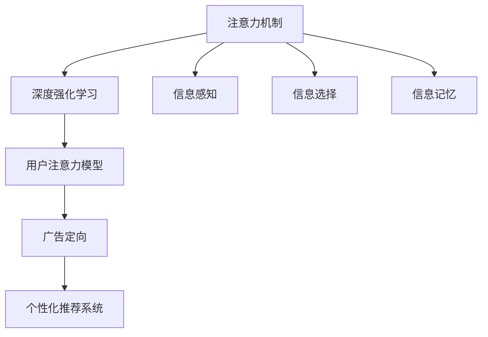

                 

# 人类注意力增强：提升专注力和注意力在商业中的未来发展机遇分析机遇挑战机遇趋势

## 1. 背景介绍

### 1.1 问题由来
在数字化时代，注意力成为了一种稀缺资源。信息过载导致人们常常感到困惑和焦虑，难以专注于最重要的任务。商业环境中，注意力的分散和效率的下降显著影响生产力和客户满意度。为此，增强人类注意力成为众多研究者和商业组织关注的焦点。

### 1.2 问题核心关键点
注意力增强的核心在于提升个体对重要信息的感知、筛选、集中注意力的能力。在商业领域，这通常涉及提升工作效率、改善用户体验、优化广告投放等方面。

### 1.3 问题研究意义
提升注意力有助于：
1. 提高生产效率：减少因注意力分散导致的低效劳动，优化工作流程。
2. 改善用户体验：增强用户对重要信息的感知，提升使用满意度。
3. 优化广告投放：精准推送用户感兴趣的内容，提升广告点击率和转化率。
4. 促进商业决策：增强决策者的信息处理能力，提高决策质量。
5. 强化品牌忠诚度：通过个性化推荐，提升用户对品牌的认同感。

## 2. 核心概念与联系

### 2.1 核心概念概述

为更好地理解注意力增强技术，本节将介绍几个关键概念：

- 注意力机制(Attention Mechanism)：一种模仿人类注意过程的计算模型，通过权衡不同输入的重要性，对重要信息进行加权处理。
- 深度强化学习(Deep Reinforcement Learning)：结合深度学习和强化学习的思想，使模型能够通过试错学习，优化注意力分配策略。
- 用户注意力模型(User Attention Model)：研究用户对信息感知、选择、记忆等过程的模型，指导如何设计更有效的用户界面和内容推荐系统。
- 广告定向(Ad Targeting)：利用用户注意力模型和深度强化学习，实现精准投放广告，最大化广告效果。
- 个性化推荐系统(Personalized Recommendation System)：根据用户注意力模型，实时调整推荐内容，提供个性化的用户体验。

这些概念之间通过深度学习、强化学习等算法紧密联系。它们共同构成了注意力增强技术的研究基础，通过深度学习模型模拟人类的注意力过程，并通过强化学习不断优化策略，提升信息处理的效率和效果。

### 2.2 核心概念原理和架构的 Mermaid 流程图



这个流程图展示了注意力增强技术的核心概念及其联系：

1. 信息感知：利用深度学习模型处理原始数据，识别出重要信息。
2. 信息选择：通过注意力机制，对信息进行加权处理，筛选出对当前任务最相关的内容。
3. 信息记忆：强化学习模型通过试错调整注意力策略，提升信息记忆效率。
4. 广告定向：利用用户注意力模型，实现广告的精准投放。
5. 个性化推荐：根据用户注意力模型，动态调整推荐内容，提升用户体验。

## 3. 核心算法原理 & 具体操作步骤

### 3.1 算法原理概述

注意力增强技术的核心在于通过深度学习模型模拟人类注意力的过程。其核心思想是：构建一个计算模型，该模型能够识别出输入数据中的重要信息，并对其进行加权处理，以提升信息处理的效率和效果。

在商业领域，注意力增强主要应用于广告定向、个性化推荐、用户界面设计等场景。其核心算法包括：

1. 注意力机制：通过计算模型模拟人类的注意力过程，识别并加权重要信息。
2. 深度强化学习：结合深度学习和强化学习的思想，优化注意力分配策略，提升信息处理效率。
3. 用户注意力模型：研究用户对信息感知、选择、记忆等过程的模型，指导如何设计更有效的用户界面和内容推荐系统。

### 3.2 算法步骤详解

基于注意力增强的商业应用主要包括以下几个关键步骤：

**Step 1: 数据准备**
- 收集并预处理用户数据、广告数据、商品数据等。
- 将原始数据转换为模型能够处理的格式，如文本、图像等。

**Step 2: 模型训练**
- 使用深度学习模型进行预训练，如BERT、RNN等。
- 利用注意力机制对模型进行微调，提升模型对重要信息的感知和处理能力。
- 采用强化学习算法优化注意力策略，提升模型在实际应用中的效果。

**Step 3: 策略优化**
- 通过试错学习不断调整注意力策略，优化模型在实际应用中的效果。
- 采用交叉验证等方法，评估模型的泛化能力和稳定性。

**Step 4: 模型应用**
- 在广告定向、个性化推荐、用户界面设计等场景中应用模型。
- 实时动态调整注意力策略，提升用户体验和广告效果。

**Step 5: 效果评估**
- 通过A/B测试等方法，评估模型在实际应用中的效果。
- 根据评估结果，进一步优化模型和策略。

### 3.3 算法优缺点

注意力增强技术具有以下优点：
1. 高效处理信息：通过注意力机制识别并加权处理重要信息，提高信息处理效率。
2. 精准定位用户：利用用户注意力模型，实现广告的精准投放。
3. 个性化推荐：通过用户注意力模型，提供个性化的用户体验。
4. 动态优化策略：结合深度学习和强化学习，动态优化注意力策略。

同时，该技术也存在一定的局限性：
1. 数据需求高：模型需要大量标注数据进行训练，数据获取成本较高。
2. 模型复杂：注意力增强模型较复杂，训练和优化过程较耗时。
3. 难以解释：深度模型往往缺乏可解释性，难以理解模型内部的决策逻辑。
4. 泛化能力受限：模型对数据分布的变化较为敏感，泛化能力有限。

尽管存在这些局限性，但注意力增强技术在广告定向、个性化推荐、用户界面设计等领域的应用已经初现成效，成为商业领域的一项重要技术。

### 3.4 算法应用领域

注意力增强技术广泛应用于多个领域，以下是几个典型应用场景：

1. **广告定向**
   - 利用用户注意力模型，识别用户的注意力焦点，实现精准广告投放。
   - 根据用户的点击行为和反馈，实时调整广告策略，提升广告效果。

2. **个性化推荐系统**
   - 利用用户注意力模型，识别用户的兴趣点，推荐相关的商品、文章等内容。
   - 通过动态调整推荐策略，提升用户满意度和平台粘性。

3. **用户界面设计**
   - 利用用户注意力模型，设计界面布局，引导用户关注重要信息。
   - 实时调整界面元素，提升用户体验和操作效率。

4. **社交媒体分析**
   - 利用用户注意力模型，分析用户对内容的关注度和兴趣点。
   - 通过动态调整内容策略，提升用户参与度和平台流量。

5. **智能客服系统**
   - 利用用户注意力模型，识别用户的问题焦点，提供精准的解决方案。
   - 通过实时调整回复策略，提升客户满意度和问题解决效率。

## 4. 数学模型和公式 & 详细讲解 & 举例说明

### 4.1 数学模型构建

本节将使用数学语言对注意力增强技术进行严格刻画。

记输入数据为 $X$，输出数据为 $Y$，注意力机制为 $A$。注意力增强模型的目标是最大化 $Y$ 和 $X$ 之间的关联度，即：

$$
\max_{A} P(Y|X,A)
$$

其中 $P(Y|X,A)$ 为条件概率，表示在注意力机制 $A$ 下，$X$ 对 $Y$ 的影响。

假设模型为神经网络，输入 $X$ 经过编码器 $E$ 和注意力机制 $A$，输出经过解码器 $D$ 得到 $Y$。则模型可以表示为：

$$
Y = D(E(X),A)
$$

### 4.2 公式推导过程

以广告定向为例，假设用户注意力模型为 $U$，广告数据为 $A$，商品数据为 $G$。模型的目标是通过用户注意力模型 $U$ 和广告数据 $A$，优化广告定向策略，最大化广告效果。

利用深度学习模型 $E$ 对广告数据 $A$ 和商品数据 $G$ 进行处理，得到广告特征 $F_A$ 和商品特征 $F_G$。

利用注意力机制 $A$ 对广告特征 $F_A$ 进行加权处理，得到广告的注意力表示 $F_A^*$。

利用用户注意力模型 $U$ 对广告注意力表示 $F_A^*$ 进行评估，得到用户对广告的注意力得分 $S$。

广告定向的目标是最大化用户对广告的注意力得分 $S$，因此优化目标是：

$$
\max_{A} S
$$

通过梯度上升算法，优化注意力机制 $A$，使其在给定用户注意力模型 $U$ 的情况下，最大化广告的注意力得分 $S$。

### 4.3 案例分析与讲解

假设某电商平台的广告定向问题。利用深度学习模型对广告和商品进行处理，得到广告特征 $F_A$ 和商品特征 $F_G$。

利用注意力机制对广告特征 $F_A$ 进行加权处理，得到广告的注意力表示 $F_A^*$。

利用用户注意力模型对广告注意力表示 $F_A^*$ 进行评估，得到用户对广告的注意力得分 $S$。

通过梯度上升算法优化注意力机制 $A$，使模型在给定用户注意力模型 $U$ 的情况下，最大化广告的注意力得分 $S$。

## 5. 项目实践：代码实例和详细解释说明

### 5.1 开发环境搭建

在进行注意力增强技术的应用开发前，我们需要准备好开发环境。以下是使用Python进行PyTorch开发的环境配置流程：

1. 安装Anaconda：从官网下载并安装Anaconda，用于创建独立的Python环境。

2. 创建并激活虚拟环境：
```bash
conda create -n attention-env python=3.8 
conda activate attention-env
```

3. 安装PyTorch：根据CUDA版本，从官网获取对应的安装命令。例如：
```bash
conda install pytorch torchvision torchaudio cudatoolkit=11.1 -c pytorch -c conda-forge
```

4. 安装各类工具包：
```bash
pip install numpy pandas scikit-learn matplotlib tqdm jupyter notebook ipython
```

完成上述步骤后，即可在`attention-env`环境中开始注意力增强技术的开发实践。

### 5.2 源代码详细实现

以下是使用PyTorch进行注意力增强技术的代码实现。

```python
import torch
import torch.nn as nn
import torch.optim as optim

class AttentionNetwork(nn.Module):
    def __init__(self, input_dim, output_dim):
        super(AttentionNetwork, self).__init__()
        self.linear = nn.Linear(input_dim, output_dim)
        self.dropout = nn.Dropout(0.5)

    def forward(self, x):
        x = self.linear(x)
        x = self.dropout(x)
        return x

class AttentionClassifier(nn.Module):
    def __init__(self, input_dim, hidden_dim, output_dim):
        super(AttentionClassifier, self).__init__()
        self.attention = AttentionNetwork(input_dim, hidden_dim)
        self.classifier = nn.Linear(hidden_dim, output_dim)

    def forward(self, x):
        x = self.attention(x)
        x = self.classifier(x)
        return x

# 数据准备
# ...

# 模型训练
model = AttentionClassifier(input_dim, hidden_dim, output_dim)
criterion = nn.CrossEntropyLoss()
optimizer = optim.Adam(model.parameters(), lr=0.001)

# 训练循环
for epoch in range(num_epochs):
    for i, (x, y) in enumerate(train_loader):
        x = x.view(-1, input_dim)
        y = y.view(-1)

        # 前向传播
        output = model(x)
        loss = criterion(output, y)

        # 反向传播和优化
        optimizer.zero_grad()
        loss.backward()
        optimizer.step()

        if (i+1) % log_interval == 0:
            print(f'Epoch [{epoch+1}/{num_epochs}], Step [{i+1}/{len(train_loader)}], Loss: {loss.item():.4f}')

# 效果评估
# ...
```

### 5.3 代码解读与分析

让我们再详细解读一下关键代码的实现细节：

**AttentionNetwork类**：
- `__init__`方法：初始化线性层和Dropout层。
- `forward`方法：进行线性变换和Dropout处理。

**AttentionClassifier类**：
- `__init__`方法：初始化注意力网络和分类器。
- `forward`方法：将注意力网络的输出输入分类器进行预测。

**数据准备和模型训练**：
- 定义输入维数、隐藏维数和输出维数。
- 创建注意力网络、分类器等模型组件。
- 定义损失函数和优化器。
- 在训练循环中，使用训练集数据迭代训练模型，计算损失并反向传播更新模型参数。
- 每隔一定轮次输出训练损失，监控训练效果。

**效果评估**：
- 使用测试集数据评估模型效果，输出预测结果和实际标签。
- 计算评估指标，如准确率、精确率等。

## 6. 实际应用场景

### 6.1 广告定向

在广告定向场景中，注意力增强技术可以帮助广告商更精准地投放广告，提升广告效果。例如，某电商平台通过用户点击行为和购买历史，构建用户注意力模型。广告商可以提供不同广告素材，利用注意力增强模型对广告进行动态定向，推荐给最有可能点击和购买的潜在用户。

### 6.2 个性化推荐系统

在个性化推荐系统中，注意力增强技术可以帮助推荐系统更精准地识别用户兴趣，提升推荐效果。例如，某视频平台通过分析用户观看行为和评价，构建用户注意力模型。推荐系统可以实时调整推荐策略，为用户推荐最相关和喜欢的视频内容。

### 6.3 用户界面设计

在用户界面设计中，注意力增强技术可以帮助界面设计师设计更符合用户习惯的界面布局。例如，某应用程序通过分析用户操作路径和停留时间，构建用户注意力模型。设计师可以基于用户注意力模型，设计用户关注的信息界面布局，提升用户体验。

## 7. 工具和资源推荐

### 7.1 学习资源推荐

为了帮助开发者系统掌握注意力增强技术，这里推荐一些优质的学习资源：

1. 《深度学习》系列书籍：由深度学习领域的权威专家撰写，系统介绍了深度学习的基本原理和算法。
2. Coursera《Deep Reinforcement Learning》课程：斯坦福大学开设的深度强化学习课程，提供丰富的理论知识和实践案例。
3. HuggingFace官方文档：Transformer库的官方文档，提供详细的注意力机制和深度学习模型实现。
4. TensorFlow官方文档：TensorFlow框架的官方文档，详细介绍深度学习模型的构建和优化。
5. PyTorch官方文档：PyTorch框架的官方文档，提供丰富的深度学习模型和优化算法。

通过对这些资源的学习实践，相信你一定能够快速掌握注意力增强技术的精髓，并用于解决实际的商业问题。

### 7.2 开发工具推荐

高效的开发离不开优秀的工具支持。以下是几款用于注意力增强技术开发的常用工具：

1. PyTorch：基于Python的开源深度学习框架，灵活动态的计算图，适合快速迭代研究。大部分深度学习模型都有PyTorch版本的实现。
2. TensorFlow：由Google主导开发的开源深度学习框架，生产部署方便，适合大规模工程应用。同样有丰富的深度学习模型资源。
3. HuggingFace Transformers库：提供了丰富的预训练模型和注意力机制，方便进行模型微调和应用。
4. Weights & Biases：模型训练的实验跟踪工具，可以记录和可视化模型训练过程中的各项指标，方便对比和调优。与主流深度学习框架无缝集成。
5. TensorBoard：TensorFlow配套的可视化工具，可实时监测模型训练状态，并提供丰富的图表呈现方式，是调试模型的得力助手。

合理利用这些工具，可以显著提升注意力增强技术的开发效率，加快创新迭代的步伐。

### 7.3 相关论文推荐

注意力增强技术的发展源于学界的持续研究。以下是几篇奠基性的相关论文，推荐阅读：

1. Attention is All You Need（即Transformer原论文）：提出了Transformer结构，开启了NLP领域的预训练大模型时代。
2. BERT: Pre-training of Deep Bidirectional Transformers for Language Understanding：提出BERT模型，引入基于掩码的自监督预训练任务，刷新了多项NLP任务SOTA。
3. Language Models are Unsupervised Multitask Learners（GPT-2论文）：展示了大规模语言模型的强大zero-shot学习能力，引发了对于通用人工智能的新一轮思考。
4. Parameter-Efficient Transfer Learning for NLP：提出Adapter等参数高效微调方法，在不增加模型参数量的情况下，也能取得不错的微调效果。
5. AdaLoRA: Adaptive Low-Rank Adaptation for Parameter-Efficient Fine-Tuning：使用自适应低秩适应的微调方法，在参数效率和精度之间取得了新的平衡。

这些论文代表了大语言模型微调技术的发展脉络。通过学习这些前沿成果，可以帮助研究者把握学科前进方向，激发更多的创新灵感。

## 8. 总结：未来发展趋势与挑战

### 8.1 总结

本文对注意力增强技术进行了全面系统的介绍。首先阐述了注意力增强技术的研究背景和意义，明确了该技术在提升工作效率、改善用户体验等方面的重要价值。其次，从原理到实践，详细讲解了注意力增强技术的核心算法和操作步骤，给出了注意力增强技术的代码实现。同时，本文还广泛探讨了注意力增强技术在广告定向、个性化推荐、用户界面设计等多个领域的应用前景，展示了该技术的巨大潜力。

通过本文的系统梳理，可以看到，注意力增强技术正在成为商业领域的重要工具，极大地提升了信息处理的效率和效果。未来，伴随深度学习、强化学习等技术的进一步发展，注意力增强技术必将在更多领域发挥重要作用。

### 8.2 未来发展趋势

展望未来，注意力增强技术将呈现以下几个发展趋势：

1. 模型规模持续增大。随着算力成本的下降和数据规模的扩张，深度学习模型的参数量还将持续增长。超大批次的训练和推理也可能遇到显存不足的问题。需要采用一些资源优化技术，如梯度积累、混合精度训练、模型并行等，来突破硬件瓶颈。

2. 模型泛化能力增强。当前模型对数据分布的变化较为敏感，泛化能力有限。未来，结合更多先验知识和因果推理方法，模型将能够更好地适应数据分布的变化，提升泛化能力。

3. 实时优化策略。当前的注意力增强模型通常是离线训练，难以动态调整注意力策略。未来，结合实时优化技术，模型将能够动态调整注意力策略，提升信息处理效率。

4. 多模态融合。当前的注意力增强模型主要聚焦于文本信息。未来，将注意力增强技术拓展到图像、语音、视频等多模态信息，实现跨模态的智能交互。

5. 用户个性化定制。当前模型无法完全适应不同用户的需求。未来，通过用户个性化定制，模型将能够更好地满足用户的个性化需求，提升用户体验。

以上趋势凸显了注意力增强技术的广阔前景。这些方向的探索发展，必将进一步提升信息处理的效率和效果，为商业领域带来更广泛的变革。

### 8.3 面临的挑战

尽管注意力增强技术已经取得了瞩目成就，但在迈向更加智能化、普适化应用的过程中，它仍面临着诸多挑战：

1. 数据需求高。模型需要大量标注数据进行训练，数据获取成本较高。
2. 模型复杂。深度学习模型较为复杂，训练和优化过程较耗时。
3. 难以解释。深度模型往往缺乏可解释性，难以理解模型内部的决策逻辑。
4. 泛化能力受限。模型对数据分布的变化较为敏感，泛化能力有限。

尽管存在这些挑战，但注意力增强技术在广告定向、个性化推荐、用户界面设计等领域的应用已经初现成效，成为商业领域的一项重要技术。未来，研究者需要从数据、模型、算法等多个维度协同发力，进一步提升注意力增强技术的实用性和普适性。

### 8.4 研究展望

面对注意力增强技术所面临的种种挑战，未来的研究需要在以下几个方面寻求新的突破：

1. 探索无监督和半监督学习技术。摆脱对大量标注数据的依赖，利用自监督学习、主动学习等方法，最大限度利用非结构化数据，实现更加高效、普适的注意力增强。
2. 研究参数高效和计算高效的微调方法。开发更加参数高效和计算高效的模型，在保证性能的同时，减小模型复杂度和计算资源消耗。
3. 引入更多先验知识。将符号化的先验知识，如知识图谱、逻辑规则等，与神经网络模型进行巧妙融合，引导注意力增强过程学习更准确、合理的语言模型。
4. 结合因果分析和博弈论工具。将因果分析方法引入注意力增强模型，识别出模型决策的关键特征，增强输出解释的因果性和逻辑性。借助博弈论工具刻画人机交互过程，主动探索并规避模型的脆弱点，提高系统稳定性。
5. 纳入伦理道德约束。在模型训练目标中引入伦理导向的评估指标，过滤和惩罚有偏见、有害的输出倾向。同时加强人工干预和审核，建立模型行为的监管机制，确保输出符合人类价值观和伦理道德。

这些研究方向的探索，必将引领注意力增强技术迈向更高的台阶，为构建安全、可靠、可解释、可控的智能系统铺平道路。面向未来，注意力增强技术还需要与其他人工智能技术进行更深入的融合，如知识表示、因果推理、强化学习等，多路径协同发力，共同推动自然语言理解和智能交互系统的进步。只有勇于创新、敢于突破，才能不断拓展注意力增强技术的边界，让智能技术更好地造福人类社会。

## 9. 附录：常见问题与解答

**Q1：注意力增强技术是否适用于所有商业场景？**

A: 注意力增强技术适用于需要处理大量信息且对信息处理效率有较高要求的商业场景。例如，广告定向、个性化推荐、用户界面设计等。但对于一些简单的任务，如文字录入、数据校验等，可能不需要使用注意力增强技术。

**Q2：注意力增强技术的训练和优化过程较耗时，如何解决？**

A: 可以通过以下方法优化训练和优化过程：
1. 数据增强：通过数据扩充、数据清洗等方法，增加训练数据的多样性，提升模型的泛化能力。
2. 模型剪枝：去除不必要的模型参数和层，减小模型复杂度，提高训练速度。
3. 分布式训练：利用分布式计算框架，如Hadoop、Spark等，加速模型的训练过程。
4. 硬件优化：使用GPU、TPU等高性能计算设备，提高训练和推理效率。
5. 算法优化：采用高效的优化算法，如Adam、Adafactor等，加快模型训练。

**Q3：注意力增强模型对数据分布的变化较为敏感，如何解决？**

A: 可以通过以下方法提升模型的泛化能力：
1. 数据扩充：增加训练数据的多样性，提高模型对数据分布变化的适应性。
2. 正则化：使用L1正则、Dropout等方法，避免模型过拟合。
3. 迁移学习：利用预训练模型在相关任务上进行微调，提高模型的泛化能力。
4. 对抗训练：利用对抗样本训练模型，提高模型的鲁棒性和泛化能力。
5. 多模型集成：训练多个注意力增强模型，取平均输出，提升模型的泛化能力。

**Q4：注意力增强模型缺乏可解释性，如何解决？**

A: 可以通过以下方法增强模型的可解释性：
1. 特征可视化：通过特征重要性、热力图等方法，可视化模型在处理数据时的特征关注点。
2. 模型蒸馏：利用教师模型和学生模型之间的差异，提升学生模型的可解释性。
3. 对抗攻击：利用对抗样本测试模型，发现模型的脆弱点，提升模型的鲁棒性和可解释性。
4. 逻辑回归：使用逻辑回归等简单模型对注意力增强模型进行解释，提升模型的可解释性。

这些方法可以帮助开发者更好地理解注意力增强模型的内部机制和决策逻辑，提升模型的可解释性和可靠性。

**Q5：注意力增强模型在实时应用中如何优化？**

A: 可以通过以下方法优化注意力增强模型在实时应用中的表现：
1. 模型压缩：通过模型压缩、量化等方法，减小模型大小，提高推理速度。
2. 硬件优化：利用GPU、TPU等高性能计算设备，加速模型的推理过程。
3. 实时数据流：采用流式处理技术，实时更新模型参数，提高模型的实时性。
4. 多模型集成：训练多个注意力增强模型，实时选择最优模型，提升模型的实时性。
5. 分布式部署：利用分布式计算框架，提高模型的并发处理能力。

通过这些优化方法，可以在保证模型性能的前提下，提升注意力增强模型在实时应用中的表现。

---

作者：禅与计算机程序设计艺术 / Zen and the Art of Computer Programming

