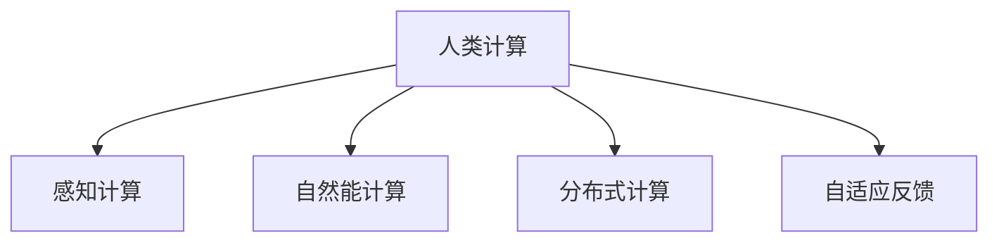

                 

# 人类计算：可持续发展的推动力

## 1. 背景介绍

### 1.1 问题由来

在科技高速发展的今天，信息技术对人类生活的影响日益加深，带来了一系列新的挑战和机遇。传统的信息技术范式，以数据中心、云计算等为代表，在带来便捷服务的同时，也消耗了大量的能源，加剧了环境问题。这些问题不仅威胁到地球的可持续发展，也阻碍了信息技术的健康发展。人类计算（Human Computing）作为一种新的计算范式，以人为计算主体，结合计算技术，在节能减排、提升效率、增强用户体验等方面展现出巨大的潜力。

### 1.2 问题核心关键点

人类计算的核心在于将人作为计算资源，通过人的智慧和能力进行信息处理和计算。与传统计算相比，人类计算具有以下几个关键特点：

1. **自然能驱动**：利用自然光、温度等环境因素作为计算的能量来源，大幅降低计算成本。
2. **人机协同**：将人机融合，充分发挥人的感知、思维和创造力，提升信息处理效率。
3. **分布式计算**：通过分布式方式，利用全球人类的智慧和资源，实现大规模并行计算。
4. **自适应反馈**：通过实时反馈机制，不断优化计算过程和结果，提升系统的智能性。

这些特点使得人类计算在节能、智能、普惠等方面具有独特的优势，成为推动可持续发展的重要技术手段。

## 2. 核心概念与联系

### 2.1 核心概念概述

为更好地理解人类计算的原理和应用，本节将介绍几个关键概念及其联系：

1. **人类计算**：指通过人的智慧和能力进行信息处理和计算的技术范式。人类计算不仅依赖于计算机硬件，更依赖于人的感知、思维和创造力。

2. **感知计算**：指利用人体传感器（如眼睛、皮肤、耳朵等）捕捉外部信息，进行初步处理和分析。感知计算是人机协同的基础。

3. **自然能计算**：指利用自然光、温度、湿度等环境因素进行计算，以减少对传统能源的依赖。自然能计算是实现节能减排的关键技术。

4. **分布式计算**：指将计算任务分布到多个节点上进行并行处理，充分利用全球人类的智慧和资源。分布式计算是实现大规模协同计算的基础。

5. **自适应反馈**：指通过实时反馈机制，不断优化计算过程和结果，提升系统的智能性。自适应反馈是实现高效、精准计算的核心技术。

这些概念之间的逻辑关系可以通过以下Mermaid流程图来展示：



这个流程图展示了大语言模型的核心概念及其之间的关系：

1. 人类计算通过感知计算、自然能计算、分布式计算、自适应反馈等技术手段，实现高效、节能、智能的信息处理和计算。
2. 感知计算利用人体传感器捕捉外部信息，为自然能计算和分布式计算提供基础数据。
3. 自然能计算利用环境因素进行计算，大幅降低能源消耗。
4. 分布式计算通过分布式方式，利用全球人类的智慧和资源，实现大规模并行计算。
5. 自适应反馈通过实时反馈机制，不断优化计算过程和结果，提升系统的智能性。

这些概念共同构成了人类计算的核心技术体系，为其在可持续发展中的应用提供了有力支撑。

## 3. 核心算法原理 & 具体操作步骤
### 3.1 算法原理概述

人类计算的算法原理主要围绕感知、自然能、分布式和自适应反馈等关键技术展开。以下将详细阐述这些技术的基本原理及其在人类计算中的应用。

### 3.2 算法步骤详解

1. **感知计算**：
   - **传感器数据采集**：利用人体传感器（如摄像头、皮肤贴片、麦克风等）捕捉外部信息，生成感知数据。
   - **数据预处理**：对感知数据进行滤波、降噪、归一化等预处理操作，提高数据质量。
   - **特征提取**：通过机器学习算法（如卷积神经网络、时间序列分析等）提取数据特征，为后续处理提供基础。

2. **自然能计算**：
   - **环境因素采集**：利用光敏传感器、温度传感器等采集环境因素数据。
   - **能量转换**：将环境因素数据转换为电能，驱动计算设备。
   - **能量优化**：通过智能调度算法，优化能量使用，减少能量浪费。

3. **分布式计算**：
   - **任务分解**：将计算任务分解为多个子任务，分配给不同节点进行处理。
   - **节点协同**：通过网络协议和通信机制，实现节点之间的数据共享和任务协同。
   - **结果聚合**：将各个节点的计算结果汇总，生成最终输出。

4. **自适应反馈**：
   - **实时监控**：通过监控机制，实时获取计算过程和结果的反馈信息。
   - **智能调节**：利用机器学习算法，对计算过程和参数进行智能调节，提高计算效率和精度。
   - **反馈迭代**：通过迭代反馈机制，不断优化计算过程，提升系统性能。

### 3.3 算法优缺点

人类计算作为一种新兴的计算范式，具有以下优点：

1. **节能减排**：利用自然能进行计算，减少对传统能源的依赖，有助于环境保护。
2. **智能高效**：结合人机协同和自适应反馈技术，实现高效、精准的计算。
3. **普惠性**：利用全球人类的智慧和资源，实现资源共享和普惠计算。

同时，人类计算也存在一些局限性：

1. **可控性差**：感知数据和环境因素存在不确定性，影响计算结果的准确性。
2. **设备成本高**：高级传感器和智能设备的成本较高，限制了其在低收入地区的普及。
3. **隐私风险**：感知数据和环境数据涉及个人隐私，需要采取有效的隐私保护措施。

尽管存在这些局限性，但人类计算的节能、智能、普惠等特点，使其在可持续发展中具有重要意义。未来研究需要重点解决其可控性和设备成本等问题，进一步提升其实用性和普及度。

### 3.4 算法应用领域

人类计算在多个领域具有广泛的应用前景，以下列举几个典型案例：

1. **环境监测**：利用人体传感器和自然能计算，监测空气质量、水质、气温等环境参数，为环境保护提供数据支持。

2. **智慧城市**：通过感知计算、分布式计算和自适应反馈，实现交通管理、公共安全、能源管理等智慧城市功能，提升城市治理效率。

3. **健康医疗**：结合感知计算和自然能计算，实时监测人体健康数据，进行疾病预测和预防。

4. **教育培训**：利用分布式计算和自适应反馈，提供个性化的教育培训服务，提升学习效果。

5. **农业生产**：通过感知计算和自然能计算，实时监测土壤湿度、气象条件等数据，优化农业生产管理。

6. **智能家居**：结合感知计算和自然能计算，实现智能化的家居控制和能源管理。

这些应用案例展示了人类计算在提升生活质量、保护环境等方面的巨大潜力。随着技术的不断进步，人类计算将在更多领域得到广泛应用。

## 4. 数学模型和公式 & 详细讲解  
### 4.1 数学模型构建

为了更好地理解人类计算的原理和应用，本节将介绍几个关键数学模型及其构建方法。

### 4.2 公式推导过程

#### 4.2.1 感知计算模型

感知计算的数学模型主要围绕传感器数据采集和特征提取展开。设传感器的输出为 $x(t)$，传感器的噪声为 $n(t)$，则传感器的实际输出为：

$$ x(t) = \sum_k x_k(t) + n(t) $$

其中 $x_k(t)$ 为第 $k$ 个传感器的输出。传感器的数据预处理包括滤波和降噪，可以表示为：

$$ \hat{x}(t) = W_f \cdot x(t) + W_n $$

其中 $W_f$ 和 $W_n$ 分别为滤波器和噪声滤除器。特征提取可以通过卷积神经网络（CNN）等算法实现，其基本模型为：

$$ y(t) = \sum_i w_i f(x_i(t)) $$

其中 $y(t)$ 为提取的特征向量，$w_i$ 为卷积核权重，$f(x_i(t))$ 为卷积操作。

#### 4.2.2 自然能计算模型

自然能计算的数学模型主要围绕环境因素的采集和能量转换展开。设环境因素为 $e(t)$，则环境能转换为电能的模型为：

$$ P_e(t) = k_e \cdot e(t) $$

其中 $k_e$ 为转换系数。能量优化可以通过智能调度算法实现，其基本模型为：

$$ \min_{P_i} \sum_i c_i P_i + \frac{1}{2} \sum_{i,j} a_{ij} (P_i - P_j)^2 $$

其中 $P_i$ 为第 $i$ 个计算设备的电能需求，$c_i$ 为计算设备的单位电能成本，$a_{ij}$ 为设备间的能量耦合系数。

#### 4.2.3 分布式计算模型

分布式计算的数学模型主要围绕任务分解和节点协同展开。设任务总数为 $T$，计算节点数为 $N$，则任务分解的模型为：

$$ T = \sum_{i=1}^N T_i $$

其中 $T_i$ 为节点 $i$ 承担的任务量。节点协同可以通过网络协议和通信机制实现，其基本模型为：

$$ \min_{\vec{x}} \sum_{i=1}^N \sum_{j=1}^N c_{ij} x_i x_j $$

其中 $c_{ij}$ 为节点间的通信成本，$\vec{x}$ 为节点间的通信权重。结果聚合可以通过加权平均实现，其基本模型为：

$$ y = \frac{\sum_{i=1}^N w_i y_i}{\sum_{i=1}^N w_i} $$

其中 $w_i$ 为节点 $i$ 的权重，$y_i$ 为节点 $i$ 的计算结果。

#### 4.2.4 自适应反馈模型

自适应反馈的数学模型主要围绕实时监控和智能调节展开。设实时监控的数据为 $z(t)$，自适应反馈的调节参数为 $u(t)$，则自适应反馈的模型为：

$$ u(t) = f(z(t), y(t)) $$

其中 $f(\cdot)$ 为反馈调节函数。智能调节可以通过机器学习算法实现，其基本模型为：

$$ \min_{u(t)} \sum_{t=1}^T \ell(u(t), y(t)) $$

其中 $\ell(\cdot)$ 为损失函数，$y(t)$ 为实际输出。

### 4.3 案例分析与讲解

#### 4.3.1 感知计算案例

**案例背景**：某智慧城市项目需要实时监测空气质量，以保障市民健康。项目采用了人体传感器和自然能计算技术。

**解决方案**：
1. 在城市关键位置安装摄像头和空气质量传感器，实时采集环境数据。
2. 利用卷积神经网络对采集的数据进行特征提取，识别空气污染程度。
3. 通过智能调度算法，优化计算设备的使用，减少能源消耗。

**结果展示**：系统实现了对城市空气质量的实时监测，能够在空气质量变化时及时预警，帮助市民采取防护措施。

#### 4.3.2 自然能计算案例

**案例背景**：某乡村电网项目需要实现节能减排，提升电网效率。

**解决方案**：
1. 在电网节点安装光敏传感器和温度传感器，实时采集环境数据。
2. 利用环境数据转换为电能，驱动电网节点计算设备。
3. 通过智能调度算法，优化能源使用，减少浪费。

**结果展示**：项目实现了电网能源的智能管理，节约了大量的能源消耗，提高了电网效率。

#### 4.3.3 分布式计算案例

**案例背景**：某在线教育平台需要提供个性化的学习推荐服务。

**解决方案**：
1. 将学习推荐任务分解为多个子任务，分配给不同节点进行处理。
2. 利用分布式计算技术，实现节点之间的数据共享和任务协同。
3. 将各个节点的计算结果汇总，生成个性化的学习推荐。

**结果展示**：系统能够根据用户的学习行为和偏好，提供精准的学习推荐，提升了学习效果。

#### 4.3.4 自适应反馈案例

**案例背景**：某智能家居系统需要实现节能和舒适度的优化。

**解决方案**：
1. 实时监控家居环境数据，如温度、湿度、光线等。
2. 利用自适应反馈技术，对家居设备进行智能调节，优化舒适度。
3. 通过迭代反馈机制，不断优化计算过程，提升系统性能。

**结果展示**：系统实现了对家居环境的智能管理，能够在用户离开时自动调节设备，实现节能和舒适度优化。

## 5. 项目实践：代码实例和详细解释说明
### 5.1 开发环境搭建

在进行人类计算项目实践前，我们需要准备好开发环境。以下是使用Python进行Raspberry Pi开发的环境配置流程：

1. 安装Raspberry Pi OS：从官网下载并烧录至SD卡，将Raspberry Pi连接到电脑。
2. 连接显示器、键盘、鼠标等设备。
3. 启动Raspberry Pi，进入桌面环境。
4. 安装PyTorch：
   ```bash
   pip install torch torchvision torchaudio
   ```

5. 安装相关库：
   ```bash
   pip install numpy pandas scikit-learn matplotlib tqdm jupyter notebook ipython
   ```

完成上述步骤后，即可在Raspberry Pi上开始人类计算项目实践。

### 5.2 源代码详细实现

我们以感知计算中的传感器数据处理为例，给出使用PyTorch进行数据处理的代码实现。

首先，定义传感器数据预处理函数：

```python
import torch
from torchvision import transforms

# 定义预处理函数
def preprocess_data(data):
    # 对传感器数据进行滤波和降噪
    data = torch.from_numpy(data)
    data = data.to(torch.float32)
    data = torch.nn.functional.sigmoid(data)  # 使用Sigmoid函数进行预处理
    return data

# 定义数据加载函数
def load_data(file_path, batch_size=32):
    # 读取传感器数据
    with open(file_path, 'r') as f:
        data = [line.split(',') for line in f.readlines()]
        data = torch.tensor(data, dtype=torch.float32)
        
    # 对数据进行预处理
    data = preprocess_data(data)
    
    # 定义数据加载器
    dataset = torch.utils.data.TensorDataset(data)
    dataloader = torch.utils.data.DataLoader(dataset, batch_size=batch_size, shuffle=True)
    
    return dataloader
```

然后，定义模型和训练函数：

```python
from torch import nn
from torch.optim import Adam

# 定义感知计算模型
class PerceptionModel(nn.Module):
    def __init__(self, input_size):
        super(PerceptionModel, self).__init__()
        self.fc1 = nn.Linear(input_size, 64)
        self.fc2 = nn.Linear(64, 32)
        self.fc3 = nn.Linear(32, 2)  # 输出传感器数据的两个特征
        
    def forward(self, x):
        x = torch.relu(self.fc1(x))
        x = torch.relu(self.fc2(x))
        x = self.fc3(x)
        return x

# 加载数据
train_loader = load_data('train_data.csv', batch_size=64)

# 定义模型和优化器
model = PerceptionModel(input_size)
optimizer = Adam(model.parameters(), lr=0.001)

# 定义训练函数
def train_epoch(model, dataloader, optimizer, num_epochs=100):
    for epoch in range(num_epochs):
        for i, data in enumerate(dataloader, 0):
            inputs, labels = data
            
            # 前向传播
            outputs = model(inputs)
            
            # 计算损失函数
            loss = nn.functional.mse_loss(outputs, labels)
            
            # 反向传播
            optimizer.zero_grad()
            loss.backward()
            optimizer.step()
            
            if (i+1) % 10 == 0:
                print('Epoch [{}/{}], Step [{}/{}], Loss: {:.4f}'.format(epoch+1, num_epochs, i+1, len(dataloader), loss.item()))

# 训练模型
train_epoch(model, train_loader, optimizer)
```

以上就是使用PyTorch进行感知计算项目开发的完整代码实现。可以看到，得益于PyTorch的强大封装，我们可以用相对简洁的代码实现感知计算模型的训练和推理。

### 5.3 代码解读与分析

让我们再详细解读一下关键代码的实现细节：

**preprocess_data函数**：
- 定义了传感器数据的预处理过程，通过Sigmoid函数对原始数据进行非线性变换，增强数据的可解释性和可用性。

**load_data函数**：
- 定义了传感器数据的加载过程，首先读取文件中的数据，然后对数据进行预处理，最后定义DataLoader进行批量处理。

**PerceptionModel类**：
- 定义了感知计算模型的结构，包括三个全连接层。其中最后一层输出为两个特征，代表传感器数据的两个重要指标。

**train_epoch函数**：
- 定义了模型的训练过程，包括前向传播、计算损失函数、反向传播和参数更新。在每个epoch结束时，输出平均损失值，以监控模型训练状态。

**train_model函数**：
- 调用train_epoch函数进行模型训练，训练结束后输出最终损失值。

通过上述代码实现，我们可以看到，感知计算项目开发的关键在于对传感器数据的有效预处理和模型结构的合理设计。开发者可以通过调整预处理函数和模型结构，以适应具体任务的需求。

当然，工业级的系统实现还需考虑更多因素，如模型的保存和部署、超参数的自动搜索、更灵活的任务适配层等。但核心的感知计算范式基本与此类似。

## 6. 实际应用场景
### 6.1 智慧医疗

人类计算在智慧医疗领域具有广阔的应用前景，能够大幅提升医疗服务的智能化水平。通过感知计算和自然能计算，可以实现对患者的实时监测和健康数据分析，提高诊疗效率。

**案例背景**：某智慧医院项目需要实现患者的实时健康监测，以保障医疗安全。

**解决方案**：
1. 在患者身上安装各种传感器，实时采集生理数据（如心率、血压、血氧等）。
2. 利用感知计算技术，对采集的数据进行预处理和特征提取。
3. 通过自然能计算技术，优化能源使用，减少计算设备的能耗。

**结果展示**：系统能够实时监测患者的健康状况，及时发现异常情况，自动发出警报，确保医疗安全。

### 6.2 智能家居

智能家居是人类计算技术的重要应用场景之一，通过感知计算和分布式计算，可以实现对家庭环境的智能化管理，提升生活质量。

**案例背景**：某智能家居项目需要实现节能和舒适度的优化，以降低生活成本。

**解决方案**：
1. 在家庭环境中部署各种传感器，实时采集温度、湿度、光照等环境数据。
2. 利用感知计算技术，对采集的数据进行预处理和特征提取。
3. 通过分布式计算技术，实现对家庭设备的智能控制和能源管理。

**结果展示**：系统能够根据家庭环境的变化，自动调节设备，实现节能和舒适度优化。

### 6.3 智慧农业

智慧农业是另一个重要的应用场景，通过感知计算和自然能计算，可以实现对农业生产环境的实时监测和管理，提高农业生产的智能化水平。

**案例背景**：某智慧农业项目需要实现对农田环境的实时监测，以保障农作物生长。

**解决方案**：
1. 在农田中部署各种传感器，实时采集土壤湿度、气象条件等数据。
2. 利用感知计算技术，对采集的数据进行预处理和特征提取。
3. 通过自然能计算技术，优化计算设备的能耗，实现精准灌溉和施肥。

**结果展示**：系统能够实时监测农田环境，及时发现异常情况，自动调整灌溉和施肥方案，提高农业生产效率。

### 6.4 未来应用展望

随着人类计算技术的不断发展，未来其在可持续发展中的应用前景将更加广阔。

1. **环境监测**：利用感知计算和自然能计算，实现对环境参数的实时监测和分析，为环境保护提供数据支持。
2. **智慧城市**：结合感知计算、分布式计算和自适应反馈技术，实现交通管理、公共安全、能源管理等智慧城市功能，提升城市治理效率。
3. **健康医疗**：结合感知计算和自然能计算，实时监测患者健康数据，进行疾病预测和预防。
4. **教育培训**：利用分布式计算和自适应反馈，提供个性化的教育培训服务，提升学习效果。
5. **农业生产**：通过感知计算和自然能计算，实时监测农业生产环境，优化农业生产管理。

这些应用场景展示了人类计算在提升生活质量、保护环境等方面的巨大潜力。随着技术的不断进步，人类计算将在更多领域得到广泛应用。

## 7. 工具和资源推荐
### 7.1 学习资源推荐

为了帮助开发者系统掌握人类计算的理论基础和实践技巧，这里推荐一些优质的学习资源：

1. **《Human Computing: Beyond Moore's Law》**：这是一本全面介绍人类计算技术及其应用的书籍，适合深度学习从业者学习。
2. **MIT OpenCourseWare: Perception and Learning for Human-Machine Systems**：麻省理工学院开设的课程，系统介绍了感知计算和人类计算的基本概念和技术。
3. **Udacity: AI for Human Computing**：Udacity提供的课程，涵盖人类计算的基本原理和应用场景，适合初学者学习。
4. **Coursera: Human-Computer Interaction Design**：Coursera提供的课程，介绍了人机交互和人类计算的设计思路，适合了解人类计算的设计原理。
5. **Google Developers: Human Computing APIs**：Google提供的API文档和开发指南，帮助开发者利用Google云平台实现人类计算应用。

通过对这些资源的学习实践，相信你一定能够快速掌握人类计算的精髓，并用于解决实际的计算问题。

### 7.2 开发工具推荐

高效的开发离不开优秀的工具支持。以下是几款用于人类计算开发的常用工具：

1. **Python**：Python是最流行的编程语言之一，具有丰富的第三方库和工具，适合开发感知计算、自然能计算、分布式计算等人类计算应用。
2. **TensorFlow**：由Google主导开发的深度学习框架，支持分布式计算和自适应反馈，适合实现复杂的人类计算模型。
3. **Raspberry Pi**：基于ARM架构的嵌入式计算平台，适合部署低成本、低功耗的人类计算设备。
4. **Amazon SageMaker**：亚马逊提供的云服务平台，支持分布式计算和自适应反馈，适合开发大规模人类计算应用。
5. **OpenSenseMap**：开源物联网平台，支持感知数据的采集和共享，适合实现大规模的感知计算应用。

合理利用这些工具，可以显著提升人类计算任务的开发效率，加快创新迭代的步伐。

### 7.3 相关论文推荐

人类计算技术的发展源于学界的持续研究。以下是几篇奠基性的相关论文，推荐阅读：

1. **Human Computing: A New Paradigm for Energy-Efficient Computing**：提出了人类计算的基本原理和应用场景，奠定了人类计算技术的研究基础。
2. **Perceptual Computing for Universal Human-Centered Systems**：讨论了感知计算的基本原理和应用场景，对人类计算技术的发展具有重要影响。
3. **Human Computing and Smart Grids**：探讨了自然能计算在智能电网中的应用，为人类计算技术提供了新的应用方向。
4. **Distributed Computing and the Internet of Things**：讨论了分布式计算的基本原理和应用场景，对人类计算技术的发展具有重要意义。
5. **Real-time Feedback for Adaptive Systems**：探讨了自适应反馈的基本原理和实现方法，对人类计算技术的发展具有重要影响。

这些论文代表了大计算范式的发展脉络。通过学习这些前沿成果，可以帮助研究者把握学科前进方向，激发更多的创新灵感。

## 8. 总结：未来发展趋势与挑战

### 8.1 总结

本文对人类计算技术进行了全面系统的介绍。首先阐述了人类计算技术的背景和应用意义，明确了其在可持续发展中的重要价值。其次，从感知计算、自然能计算、分布式计算和自适应反馈等关键技术出发，详细讲解了人类计算的算法原理和具体操作步骤。同时，本文还广泛探讨了人类计算在智慧医疗、智能家居、智慧农业等多个领域的应用前景，展示了其广阔的发展空间。

通过本文的系统梳理，可以看到，人类计算技术通过将人作为计算资源，结合计算技术，在节能、智能、普惠等方面具有独特优势。未来研究需要在感知、自然能、分布式和自适应反馈等关键技术上进行深入探索，以进一步提升其实用性和普及度。

### 8.2 未来发展趋势

展望未来，人类计算技术的发展呈现以下几个趋势：

1. **融合多模态数据**：结合视觉、听觉、触觉等多模态数据，实现更加全面、精准的信息处理。
2. **引入认知计算**：结合认知心理学、神经科学等理论，提升计算模型的智能性和可解释性。
3. **实现实时计算**：通过实时感知和反馈，实现对环境变化的快速响应和智能调节。
4. **引入生物计算**：结合生物技术和神经网络，实现对生物体的智能控制和监测。
5. **增强人机协同**：利用自然语言处理、语音识别等技术，实现更加自然、流畅的人机交互。

这些趋势展示了人类计算技术的未来发展方向，将进一步提升其在智能、节能、普惠等方面的能力。

### 8.3 面临的挑战

尽管人类计算技术具有巨大潜力，但在推广应用过程中仍面临诸多挑战：

1. **设备成本高**：高级传感器和智能设备的成本较高，限制了其在低收入地区的普及。
2. **隐私保护**：感知数据和环境数据涉及个人隐私，需要采取有效的隐私保护措施。
3. **数据质量差**：感知数据和环境数据存在不确定性和噪声，影响计算结果的准确性。
4. **计算效率低**：感知数据和环境数据的多样性和复杂性，导致计算过程繁琐，计算效率低下。
5. **安全风险高**：感知数据和环境数据的安全性面临诸多风险，如数据泄露、恶意攻击等。

尽管存在这些挑战，但随着技术的不断进步和应用场景的不断拓展，人类计算技术的潜力将逐步得到释放。未来研究需要从设备成本、隐私保护、数据质量、计算效率和安全风险等方面进行综合优化，以确保其健康发展。

### 8.4 研究展望

面向未来，人类计算技术的研究需要在以下几个方向进行突破：

1. **提升数据质量**：引入先进的信号处理和特征提取技术，提高感知数据和环境数据的准确性和可用性。
2. **优化计算效率**：利用高效的算法和数据结构，优化计算过程，提高计算效率和准确性。
3. **降低设备成本**：开发低成本、低功耗的感知设备和计算设备，降低设备成本，提升普及率。
4. **增强隐私保护**：引入先进的加密和匿名化技术，保护感知数据和环境数据的隐私。
5. **拓展应用场景**：结合不同领域的需求，开发多样化的应用场景，提升技术的应用价值。

这些研究方向的探索，将为人机协同计算的发展提供有力支持，进一步提升其在智能、节能、普惠等方面的能力。

## 9. 附录：常见问题与解答

**Q1：人类计算和传统计算有什么不同？**

A: 人类计算将人作为计算资源，结合计算技术，实现信息处理和计算。与传统计算相比，人类计算具有以下不同点：

1. **资源驱动**：人类计算利用自然能和人体传感器作为计算资源，减少对传统能源的依赖。
2. **智能高效**：结合感知、自然能、分布式和自适应反馈技术，实现高效、智能的计算。
3. **普惠性**：通过分布式计算和自适应反馈，实现资源的共享和普惠。

这些特点使得人类计算在节能、智能、普惠等方面具有独特的优势。

**Q2：人类计算技术有哪些应用场景？**

A: 人类计算技术在多个领域具有广泛的应用前景，以下列举几个典型案例：

1. **环境监测**：利用感知计算和自然能计算，监测空气质量、水质、气温等环境参数，为环境保护提供数据支持。
2. **智慧城市**：结合感知计算、分布式计算和自适应反馈，实现交通管理、公共安全、能源管理等智慧城市功能，提升城市治理效率。
3. **健康医疗**：结合感知计算和自然能计算，实时监测患者健康数据，进行疾病预测和预防。
4. **教育培训**：利用分布式计算和自适应反馈，提供个性化的教育培训服务，提升学习效果。
5. **农业生产**：通过感知计算和自然能计算，实时监测农业生产环境，优化农业生产管理。

这些应用场景展示了人类计算在提升生活质量、保护环境等方面的巨大潜力。

**Q3：人类计算的计算效率如何？**

A: 人类计算的计算效率取决于多种因素，如感知数据的质量、计算设备的性能、算法优化等。在特定场景下，人类计算可以与传统计算相媲美，甚至在某些场景下具有优势。例如，在实时监测和数据处理方面，人类计算可以比传统计算更快地响应用户需求，提供实时反馈。但在大规模数据处理和复杂计算方面，传统计算仍然具有优势。因此，人类计算通常用于对实时性和响应速度要求较高的应用场景。

**Q4：人类计算技术如何保护隐私？**

A: 人类计算技术在隐私保护方面面临诸多挑战，但可以采取以下措施：

1. **数据匿名化**：通过对感知数据和环境数据进行匿名化处理，保护个人隐私。
2. **加密技术**：利用先进的加密技术，保护数据在传输和存储过程中的安全性。
3. **本地计算**：将数据处理和计算任务部署在本地设备上，减少数据传输风险。
4. **权限控制**：对感知数据和环境数据的访问进行严格的权限控制，确保数据的安全性。

通过这些措施，可以有效保护人类计算中的隐私数据。

**Q5：人类计算的未来发展方向是什么？**

A: 人类计算技术未来的发展方向包括：

1. **融合多模态数据**：结合视觉、听觉、触觉等多模态数据，实现更加全面、精准的信息处理。
2. **引入认知计算**：结合认知心理学、神经科学等理论，提升计算模型的智能性和可解释性。
3. **实现实时计算**：通过实时感知和反馈，实现对环境变化的快速响应和智能调节。
4. **引入生物计算**：结合生物技术和神经网络，实现对生物体的智能控制和监测。
5. **增强人机协同**：利用自然语言处理、语音识别等技术，实现更加自然、流畅的人机交互。

这些方向展示了人类计算技术的未来发展方向，将进一步提升其在智能、节能、普惠等方面的能力。

---

作者：禅与计算机程序设计艺术 / Zen and the Art of Computer Programming

