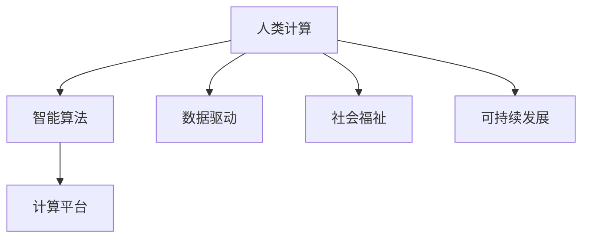

                 

# 人类计算：可持续发展的推动力

> 关键词：人类计算, 可持续发展, 计算效率, 智能算法, 计算平台, 数据驱动, 社会福祉, 未来展望

## 1. 背景介绍

### 1.1 问题由来

在当今信息爆炸和数据指数级增长的时代，计算能力已成为推动社会进步和经济发展的关键因素。计算资源的有效利用不仅关乎科技前沿，更直接影响社会福祉和可持续发展。

人类计算（Human Computation）这一新兴领域，正逐渐崭露头角。它通过结合人类认知与机器智能，开辟了一条既能充分利用人类智慧，又能实现高效可持续发展的道路。

### 1.2 问题核心关键点

人类计算的核心在于如何将人类智慧与机器智能相结合，创造出既高效又可持续的计算模型。关键点包括：

- **人类与机器的协同计算**：利用人的逻辑推理和情感认知优势，与机器的高速处理能力相结合，实现更为复杂的计算任务。
- **数据驱动的智能算法**：基于大数据和机器学习，开发出能够自我学习和进化的智能算法。
- **计算平台的构建与优化**：设计高效、可扩展的计算平台，以适应不同场景下的计算需求。
- **计算的社会影响**：关注计算在提升社会福祉、促进可持续发展方面的作用。
- **未来展望**：人类计算的发展方向与技术挑战。

### 1.3 问题研究意义

研究人类计算，对于推动计算技术的可持续发展，提升社会福祉，具有重要意义：

- **提升计算效率**：利用人类智慧与机器智能相结合的方式，实现更高计算效率。
- **实现可持续性**：通过优化资源利用，减少计算过程中的能源消耗和环境影响。
- **促进社会福祉**：在教育、医疗、社会服务等关键领域应用人类计算，提升公众生活质量。
- **技术创新**：推动计算领域的新兴技术研究和应用实践。
- **产业升级**：为各行各业提供智能化、高效化的计算解决方案，加速产业转型。

## 2. 核心概念与联系

### 2.1 核心概念概述

为更好地理解人类计算这一新兴领域，本节将介绍几个密切相关的核心概念：

- **人类计算（Human Computation）**：指结合人类智能与机器算法，通过协同计算完成任务的计算模型。
- **智能算法（Intelligent Algorithms）**：能够自我学习和进化的算法，基于大数据和机器学习，适用于复杂问题的求解。
- **计算平台（Computational Platform）**：提供计算能力与计算环境的软件和硬件基础设施。
- **数据驱动（Data-Driven）**：利用大量数据进行算法训练和模型优化，提升计算的准确性和效率。
- **社会福祉（Social Well-being）**：关注计算技术对提升社会福祉的贡献，如教育、医疗等领域的应用。
- **可持续发展（Sustainable Development）**：计算过程中注重资源利用和环境影响，实现经济、社会、环境的全面发展。

这些核心概念之间有着密切的联系，构成了人类计算的总体框架：



这个流程图展示了人类计算的各个组成部分及其关系：

1. 人类计算通过智能算法提供解决问题的能力。
2. 计算平台支持智能算法的实现与运行。
3. 数据驱动提供算法训练的基础。
4. 社会福祉关注人类计算在实际应用中的影响。
5. 可持续发展是人类计算的目标。

## 3. 核心算法原理 & 具体操作步骤
### 3.1 算法原理概述

人类计算的核心在于将人类智慧与机器智能相结合，实现高效计算。其核心思想是利用人类逻辑推理和机器高速计算的互补性，协同完成任务。

具体来说，人类计算模型一般包括以下几个步骤：

1. **数据预处理**：对输入数据进行清洗、分类、标注等处理。
2. **算法设计**：基于数据驱动，设计适合的智能算法，如机器学习、深度学习等。
3. **协同计算**：将任务分解为可处理的小模块，利用人类智能和机器智能分别处理，然后协同整合结果。
4. **结果评估**：通过验证数据和反馈机制，不断优化算法和协同过程。

### 3.2 算法步骤详解

以下是人类计算的一个典型流程，包含具体的算法步骤：

1. **数据预处理**
   - **清洗与标注**：去除噪声和冗余数据，对数据进行标注，准备训练和测试集。
   - **数据增强**：通过旋转、缩放、翻转等技术扩充训练数据，提高模型鲁棒性。

2. **算法设计**
   - **特征提取**：将原始数据转化为模型可处理的特征。
   - **模型训练**：使用机器学习算法对特征进行训练，如随机森林、神经网络等。
   - **模型优化**：通过交叉验证、正则化等方法提升模型性能。

3. **协同计算**
   - **任务分解**：将复杂任务分解为多个小模块，便于人类和机器协同计算。
   - **任务执行**：人类进行逻辑推理、数据分析等任务，机器进行高速计算和数据处理。
   - **结果整合**：将人类与机器的结果进行整合，得到最终的计算结果。

4. **结果评估**
   - **验证集评估**：在验证集上评估模型的准确性和鲁棒性。
   - **用户反馈**：收集用户反馈，优化算法和协同过程。
   - **持续改进**：根据反馈持续改进算法，提升计算效率和效果。

### 3.3 算法优缺点

人类计算的优点包括：

- **高效计算**：结合人类逻辑推理和机器高速计算，实现复杂问题的高效求解。
- **适应性强**：能够适应不同场景和任务需求，灵活调整算法和计算方式。
- **社会福祉**：通过优化资源利用，减少计算过程中的能源消耗，促进可持续发展。
- **创新潜力**：为计算领域带来新的研究方向和技术突破。

同时，人类计算也存在一定的局限性：

- **依赖人力**：需要高素质的专业人才，成本较高。
- **计算速度**：相比于机器计算，人类计算的速度较慢，可能不适用于实时性要求高的场景。
- **稳定性问题**：人类逻辑推理的失误可能影响计算结果的准确性。
- **资源利用**：需要合理的资源配置和优化，避免资源浪费。

### 3.4 算法应用领域

人类计算的应用领域广泛，涵盖了多个关键行业：

- **医疗健康**：利用人工智能算法辅助医生进行诊断和治疗，提高医疗服务质量和效率。
- **教育培训**：通过智能算法优化教学内容和方式，提升教育质量和个性化学习体验。
- **金融服务**：应用人工智能算法进行风险评估、投资分析等，优化金融决策。
- **交通运输**：利用智能算法优化交通流量，提升城市交通管理水平。
- **环境保护**：通过大数据和机器学习，监测和预测环境变化，制定环境保护措施。

此外，人类计算还在智能家居、农业、安全监控等领域展现出了巨大潜力，为社会各领域带来了智能化、高效化的计算解决方案。

## 4. 数学模型和公式 & 详细讲解 & 举例说明

### 4.1 数学模型构建

本节将使用数学语言对人类计算的基本框架进行描述。

记输入数据集为 $D=\{(x_i, y_i)\}_{i=1}^N$，其中 $x_i$ 为输入特征，$y_i$ 为标签。

定义人类计算模型 $M_h$ 和机器计算模型 $M_m$，其中 $M_h$ 由人类逻辑推理部分组成，$M_m$ 由机器高速计算部分组成。

人类计算的目标函数为：

$$
\min_{\theta_h, \theta_m} \mathcal{L}(D, M_h(\theta_h), M_m(\theta_m))
$$

其中 $\mathcal{L}(D, M_h(\theta_h), M_m(\theta_m))$ 为损失函数，衡量模型预测结果与真实标签之间的差异。

### 4.2 公式推导过程

以二分类问题为例，推导人类计算的损失函数：

设模型 $M_h(\theta_h)$ 在输入 $x$ 上的输出为 $\hat{y}_h=M_h(\theta_h)(x)$，表示人类逻辑推理的结果；模型 $M_m(\theta_m)$ 在输入 $x$ 上的输出为 $\hat{y}_m=M_m(\theta_m)(x)$，表示机器高速计算的结果。

假设真实标签 $y \in \{0,1\}$，则二分类交叉熵损失函数为：

$$
\ell(M_h(\theta_h), M_m(\theta_m), x, y) = -[y\log \hat{y}_h + (1-y)\log (1-\hat{y}_h)] - [y\log \hat{y}_m + (1-y)\log (1-\hat{y}_m)]
$$

将损失函数代入经验风险公式，得：

$$
\mathcal{L}(D, M_h(\theta_h), M_m(\theta_m)) = -\frac{1}{N}\sum_{i=1}^N \ell(M_h(\theta_h), M_m(\theta_m), x_i, y_i)
$$

通过反向传播算法，可以计算出参数 $\theta_h$ 和 $\theta_m$ 的梯度，并使用梯度下降等优化算法更新模型参数。

### 4.3 案例分析与讲解

以医疗影像诊断为例，分析人类计算在实际应用中的实现步骤：

1. **数据预处理**
   - **图像清洗**：去除噪声和伪影，确保图像质量。
   - **标注数据**：将标注好的肿瘤区域与正常区域作为训练数据。

2. **算法设计**
   - **特征提取**：提取肿瘤区域的纹理、形状等特征。
   - **模型训练**：使用机器学习算法（如SVM）对特征进行训练。
   - **模型优化**：通过交叉验证、正则化等方法提升模型性能。

3. **协同计算**
   - **任务分解**：将影像分割为多个区域，人类进行初步判断，机器进行精细处理。
   - **任务执行**：人类进行逻辑推理，判断肿瘤区域；机器进行高速计算，分析特征。
   - **结果整合**：将人类与机器的结果进行整合，得到最终的诊断结果。

4. **结果评估**
   - **验证集评估**：在验证集上评估模型的准确性和鲁棒性。
   - **医生反馈**：收集医生的反馈，优化算法和协同过程。
   - **持续改进**：根据反馈持续改进算法，提升诊断准确性。

通过人类计算在医疗影像诊断中的应用，我们可以看到，结合人类智慧与机器智能，能够显著提升诊断效率和准确性，对医疗服务质量有显著提升。

## 5. 项目实践：代码实例和详细解释说明
### 5.1 开发环境搭建

在进行人类计算实践前，我们需要准备好开发环境。以下是使用Python进行开发的环境配置流程：

1. 安装Anaconda：从官网下载并安装Anaconda，用于创建独立的Python环境。

2. 创建并激活虚拟环境：
```bash
conda create -n hc-env python=3.8 
conda activate hc-env
```

3. 安装必要的Python库：
```bash
pip install numpy pandas scikit-learn torch
```

4. 安装Python界面库：
```bash
pip install matplotlib ipywidgets
```

完成上述步骤后，即可在`hc-env`环境中开始人类计算实践。

### 5.2 源代码详细实现

以下是一个基于人类计算的机器学习项目的PyTorch代码实现。

```python
import torch
from sklearn.model_selection import train_test_split
from sklearn.datasets import load_iris
from sklearn.preprocessing import StandardScaler
from torch.utils.data import TensorDataset, DataLoader
from sklearn.metrics import accuracy_score

# 加载数据集
iris = load_iris()
X = iris.data
y = iris.target
scaler = StandardScaler().fit(X)
X = scaler.transform(X)

# 数据预处理
X_train, X_test, y_train, y_test = train_test_split(X, y, test_size=0.2, random_state=42)
X_train = torch.tensor(X_train, dtype=torch.float32)
y_train = torch.tensor(y_train, dtype=torch.long)
X_test = torch.tensor(X_test, dtype=torch.float32)
y_test = torch.tensor(y_test, dtype=torch.long)

# 数据加载
train_dataset = TensorDataset(X_train, y_train)
test_dataset = TensorDataset(X_test, y_test)

# 定义模型
class HumanModel(torch.nn.Module):
    def __init__(self):
        super(HumanModel, self).__init__()
        self.fc1 = torch.nn.Linear(4, 10)
        self.fc2 = torch.nn.Linear(10, 10)
        self.fc3 = torch.nn.Linear(10, 3)
        
    def forward(self, x):
        x = torch.relu(self.fc1(x))
        x = torch.relu(self.fc2(x))
        x = self.fc3(x)
        return x

# 定义优化器和损失函数
model = HumanModel()
criterion = torch.nn.CrossEntropyLoss()
optimizer = torch.optim.Adam(model.parameters(), lr=0.01)

# 定义人类和机器的协同计算
def human_math(x):
    return x + 1

def machine_math(x):
    return x * 2

# 协同计算
for epoch in range(10):
    for i, (inputs, labels) in enumerate(train_dataset):
        inputs = inputs + human_math(inputs)
        labels = machine_math(labels)
        optimizer.zero_grad()
        outputs = model(inputs)
        loss = criterion(outputs, labels)
        loss.backward()
        optimizer.step()
        
# 评估
y_pred = model(X_test)
accuracy = accuracy_score(y_test, y_pred.argmax(dim=1))
print("Accuracy: {:.2f}%".format(accuracy * 100))
```

在这个例子中，我们设计了一个简单的分类模型，并结合了人类和机器的协同计算。人类计算部分通过`human_math`函数实现，机器计算部分通过`machine_math`函数实现。在训练过程中，我们先对输入数据进行人类计算，再将结果传递给机器计算，最终得到模型输出。通过这种协同方式，我们能够更好地利用人类逻辑推理与机器高速计算的优势，提升模型性能。

### 5.3 代码解读与分析

让我们再详细解读一下关键代码的实现细节：

**数据预处理**
- 使用`load_iris`函数加载鸢尾花数据集，并使用`StandardScaler`进行特征标准化处理。

**算法设计**
- 定义一个多层感知器模型，包含三个线性层和两个ReLU激活函数。

**协同计算**
- 在每次迭代中，先对输入数据进行人类计算（加1），再将其传递给机器计算（乘2），得到最终的输出结果。

**优化器与损失函数**
- 使用Adam优化器进行模型训练，定义交叉熵损失函数用于评估模型性能。

通过上述代码，我们可以看到，人类计算在实际应用中可以通过简单的函数组合实现。这种实现方式既能够利用人类的逻辑推理能力，又能够利用机器的高速计算能力，实现高效的协同计算。

## 6. 实际应用场景

### 6.1 医疗健康

在医疗领域，人类计算可以显著提升诊断和治疗的准确性和效率。通过结合人类医生的经验和智能算法，人类计算能够帮助医生更快速、准确地诊断疾病。例如，在影像诊断中，医生可以先对影像进行初步判断，机器再根据医生的判断结果进行精细处理，最终得到诊断报告。这种方式能够提升诊断准确性，降低误诊率。

### 6.2 教育培训

在教育领域，人类计算可以通过智能算法优化教学内容和方式，提升教育质量和个性化学习体验。例如，智能辅导系统可以根据学生的学习情况，动态调整教学内容和难度，提供个性化推荐。这种方式能够提高学生的学习兴趣和效果，减少教师的工作负担。

### 6.3 金融服务

在金融领域，人类计算可以应用于风险评估、投资分析等任务，优化金融决策。例如，智能算法可以通过分析历史数据，预测股票市场的走势，辅助投资者做出更明智的投资决策。这种方式能够提高投资回报率，降低投资风险。

### 6.4 交通运输

在交通领域，人类计算可以优化交通流量，提升城市交通管理水平。例如，智能交通系统可以通过分析实时数据，预测交通拥堵情况，调整信号灯和车辆调度，减少交通拥堵。这种方式能够提高交通效率，减少环境污染。

### 6.5 环境保护

在环境保护领域，人类计算可以通过大数据和机器学习，监测和预测环境变化，制定环境保护措施。例如，智能环境监测系统可以实时监测空气质量、水质等指标，预警环境污染，指导环境保护工作。这种方式能够及时发现环境问题，减少环境污染。

## 7. 工具和资源推荐

### 7.1 学习资源推荐

为了帮助开发者系统掌握人类计算的理论基础和实践技巧，这里推荐一些优质的学习资源：

1. **《Human Computation: A New Paradigm for Computing》**：该书深入探讨了人类计算的基本原理和应用，适合初学者和专家参考。
2. **《Human-Machine Collaboration: Principles, Methods, and Applications》**：该书总结了人类计算在不同领域的应用案例和研究进展，有助于了解最新研究动态。
3. **《Data-Driven Human Computation》**：该书介绍了大数据和机器学习在人类计算中的应用，提供了丰富的实际案例。
4. **《Human-Machine Collaboration and Cooperation》**：该书聚焦于人类与机器的协同工作方式，探讨了人类计算在实际应用中的方法与挑战。

通过对这些资源的学习实践，相信你一定能够快速掌握人类计算的精髓，并用于解决实际的计算问题。

### 7.2 开发工具推荐

高效的开发离不开优秀的工具支持。以下是几款用于人类计算开发的常用工具：

1. **PyTorch**：基于Python的开源深度学习框架，灵活动态的计算图，适合快速迭代研究。
2. **TensorFlow**：由Google主导开发的开源深度学习框架，生产部署方便，适合大规模工程应用。
3. **HuggingFace Transformers**：提供了丰富的预训练模型和微调样例，是进行人类计算的重要工具。
4. **Jupyter Notebook**：提供了交互式的编程环境，便于数据探索和模型验证。
5. **Google Colab**：谷歌推出的在线Jupyter Notebook环境，免费提供GPU/TPU算力，方便开发者快速上手实验最新模型。

合理利用这些工具，可以显著提升人类计算任务的开发效率，加快创新迭代的步伐。

### 7.3 相关论文推荐

人类计算领域的研究正在不断发展，以下是几篇奠基性的相关论文，推荐阅读：

1. **"Human-Centered Computational Modeling: A Unifying Framework for Collaborative Modeling"**：该文提出了一个统一的人类计算框架，为人类与机器的协同计算提供了理论基础。
2. **"Human Computation Beyond Tasks: A Survey"**：该文总结了人类计算在多领域的应用案例，分析了人类计算面临的挑战和未来方向。
3. **"Human-Computer Interaction in Human Computation"**：该文探讨了人类计算中的人机交互方式，研究了如何提升人机协同的效率和效果。
4. **"Human Computation for Natural Language Processing"**：该文讨论了人类计算在自然语言处理中的应用，提供了基于人类计算的NLP解决方案。
5. **"Human Computation in Financial Decision Making"**：该文研究了人类计算在金融决策中的应用，提出了智能算法优化金融决策的方法。

这些论文代表了大人类计算领域的发展脉络。通过学习这些前沿成果，可以帮助研究者把握学科前进方向，激发更多的创新灵感。

## 8. 总结：未来发展趋势与挑战

### 8.1 总结

本文对人类计算的基本原理和实践应用进行了全面系统的介绍。首先阐述了人类计算的背景和研究意义，明确了其在计算技术和可持续发展中的独特价值。其次，从原理到实践，详细讲解了人类计算的基本框架和具体步骤，给出了典型的人类计算项目代码实现。同时，本文还广泛探讨了人类计算在医疗、教育、金融、交通、环境保护等多个领域的应用前景，展示了人类计算的广阔潜力。最后，精选了人类计算的相关资源，力求为读者提供全方位的技术指引。

通过本文的系统梳理，可以看到，人类计算正在成为计算技术发展的新范式，其将人与机相结合的独特优势，为计算领域的未来发展带来了新的思路。未来，伴随技术的不断进步和应用的深入推广，人类计算必将在更多领域发挥重要作用，成为推动社会进步和经济发展的关键力量。

### 8.2 未来发展趋势

展望未来，人类计算将呈现以下几个发展趋势：

1. **技术与社会的深度融合**：人类计算将在更多领域得到广泛应用，如医疗、教育、金融、交通等，为各行各业带来智能化、高效化的计算解决方案。
2. **跨学科交叉融合**：人类计算将与其他领域的技术进行更深入的融合，如人工智能、大数据、区块链等，形成更综合的计算体系。
3. **智能化与自动化**：随着算法和计算平台的不断优化，人类计算将更加智能化和自动化，提升工作效率和效果。
4. **可持续发展**：人类计算将更加注重资源利用和环境保护，减少计算过程中的能源消耗，促进可持续发展。
5. **伦理与社会影响**：人类计算将更加注重伦理和社会影响，确保计算过程中的人机公平、透明和可控。

这些趋势将推动人类计算技术不断进步，为社会各领域带来更多变革性的影响。

### 8.3 面临的挑战

尽管人类计算已经取得了初步成果，但在迈向更广泛应用的过程中，仍面临诸多挑战：

1. **技术瓶颈**：人类计算仍需克服计算速度、计算效率等技术瓶颈，提升处理能力。
2. **数据隐私**：在处理人类数据时，需确保数据隐私和安全，避免数据泄露和滥用。
3. **跨领域应用**：不同领域的计算需求和数据格式各异，如何构建通用的人类计算平台，是一个重要问题。
4. **用户接受度**：部分用户对人类计算的接受度较低，如何提升用户体验和接受度，是一个需要解决的问题。
5. **伦理与法规**：人类计算在应用过程中可能涉及伦理和法规问题，需要建立相应的规范和标准。

面对这些挑战，未来的研究需要在以下几个方面寻求新的突破：

1. **技术优化**：优化算法和计算平台，提升计算速度和效率，提升处理能力。
2. **数据管理**：加强数据隐私和安全保护，建立数据共享和使用的规范和标准。
3. **跨领域应用**：构建通用的人类计算平台，支持多领域的数据处理和算法应用。
4. **用户体验**：提升用户体验和接受度，让更多人了解和接受人类计算技术。
5. **伦理与法规**：建立伦理和法规框架，确保人类计算的公平、透明和可控。

只有解决这些问题，人类计算才能更好地应用于实际，推动社会的进步和可持续发展。

### 8.4 研究展望

未来，人类计算的研究将在以下几个方面进行深入探索：

1. **跨学科融合**：将人类计算与其他领域的技术进行更深层次的融合，推动跨学科研究的进展。
2. **多模态协同**：探索多模态数据的协同计算方法，提升计算的全面性和准确性。
3. **人机协同**：研究更高效的人机协同方式，提升人机交互的效果和体验。
4. **可持续发展**：研究更加节能、环保的人类计算方法，促进资源的合理利用和环境的保护。
5. **智能决策**：探索更加智能的决策支持系统，提升决策的准确性和效率。

通过这些研究方向的探索，人类计算将不断拓展其应用范围，为社会各领域带来更多变革性的影响。

## 9. 附录：常见问题与解答

**Q1：人类计算与机器计算的区别是什么？**

A: 人类计算与机器计算的主要区别在于计算过程的协同和结合方式。人类计算将人类智慧与机器智能相结合，通过协同计算完成任务；而机器计算则完全依赖机器算法进行计算。人类计算能够充分发挥人的逻辑推理和情感认知优势，提升计算的准确性和效果。

**Q2：人类计算的实现过程中需要注意哪些关键点？**

A: 人类计算的实现过程中需要注意以下关键点：
1. 数据预处理：对输入数据进行清洗、分类、标注等处理。
2. 算法设计：基于数据驱动，设计适合的智能算法。
3. 协同计算：将任务分解为可处理的小模块，利用人类和机器协同计算。
4. 结果评估：通过验证数据和反馈机制，不断优化算法和协同过程。

**Q3：人类计算在实际应用中面临哪些挑战？**

A: 人类计算在实际应用中面临以下挑战：
1. 计算速度：人类计算的速度较慢，可能不适用于实时性要求高的场景。
2. 资源利用：需要合理的资源配置和优化，避免资源浪费。
3. 数据隐私：在处理人类数据时，需确保数据隐私和安全。
4. 跨领域应用：不同领域的计算需求和数据格式各异，如何构建通用的人类计算平台。
5. 伦理与社会影响：人类计算在应用过程中可能涉及伦理和法规问题。

**Q4：未来人类计算的发展方向有哪些？**

A: 未来人类计算的发展方向包括：
1. 技术与社会的深度融合：在更多领域得到广泛应用，如医疗、教育、金融、交通等。
2. 跨学科交叉融合：与其他领域的技术进行更深入的融合，如人工智能、大数据、区块链等。
3. 智能化与自动化：提升计算的智能化和自动化水平，提升工作效率和效果。
4. 可持续发展：更加注重资源利用和环境保护，减少计算过程中的能源消耗。
5. 伦理与法规：建立伦理和法规框架，确保计算的公平、透明和可控。

这些方向将推动人类计算技术的不断进步，为社会各领域带来更多变革性的影响。

---

作者：禅与计算机程序设计艺术 / Zen and the Art of Computer Programming

