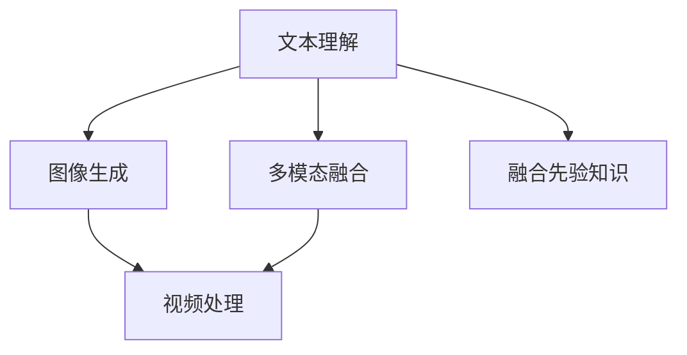
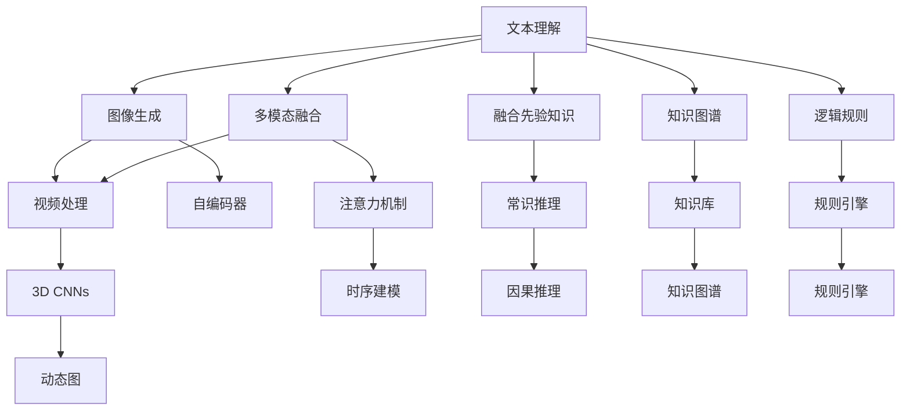

                 

# 从文本到视频的AI模型技术演进

## 1. 背景介绍

在AI模型领域，从文本到图像再到视频的演进，是一个逐步提升模型复杂度和智能化水平的过程。文本作为最基础的抽象形式，其处理和理解难度远低于图像和视频。而视频作为多维动态信息，其处理和理解难度最高，能够提供最丰富的语义信息。本文将围绕这一主题，探讨从文本到视频模型的技术演进，涵盖文本理解、图像生成、视频处理等关键环节，并剖析模型演进背后的原理与挑战。

## 2. 核心概念与联系

### 2.1 核心概念概述

为更好地理解AI模型从文本到视频演进的过程，我们需要掌握几个核心概念：

- **文本理解模型**：如BERT、GPT-3等，主要通过语言模型进行预训练，学习语言的语法、词汇和语义等。
- **图像生成模型**：如GANs、VQ-VAE等，主要通过生成模型进行训练，学习图像的分布和生成过程。
- **视频处理模型**：如3D CNNs、I3D等，主要通过卷积神经网络对视频序列进行建模和处理。
- **多模态融合**：通过将文本、图像、视频等多种模态信息融合，提升模型对复杂场景的理解能力。

这些概念之间的逻辑关系可以通过以下Mermaid流程图来展示：



这个流程图展示了文本理解、图像生成、视频处理、多模态融合等技术之间的联系与演进方向。

### 2.2 核心概念原理和架构的 Mermaid 流程图

为更直观展示概念间的关系，我们可以进一步细化上述流程图。以下是详细化的Mermaid流程图：



这个流程图详细展现了从文本理解到视频处理的每一步技术演进路径，以及多模态融合、先验知识融合、知识图谱、逻辑规则等对模型性能的提升。

## 3. 核心算法原理 & 具体操作步骤

### 3.1 算法原理概述

从文本到视频的技术演进，涉及多个层次的算法原理。本文将从文本理解、图像生成、视频处理等三个关键环节，深入剖析其核心算法原理。

**文本理解模型**：主要以自回归语言模型为代表，如BERT、GPT-3等。这些模型通过在大规模无标签文本上进行预训练，学习语言的语法、词汇和语义等，从而能够理解复杂的自然语言指令，进行文本分类、命名实体识别等任务。

**图像生成模型**：主要以生成对抗网络(GANs)和变分自编码器(VAEs)为代表，这些模型通过生成样本，学习图像的分布和生成过程，从而能够生成高质量的图像内容，用于图像补全、图像风格转换等任务。

**视频处理模型**：主要以卷积神经网络(CNNs)和时间卷积神经网络(TCNs)为代表，这些模型通过处理视频序列，学习时序和空间特征，从而能够对视频进行分类、动作识别等任务。

### 3.2 算法步骤详解

**文本理解模型的步骤**：
1. 收集并预处理大规模无标签文本数据。
2. 构建自回归语言模型，如BERT、GPT等。
3. 在预训练数据上，通过自监督学习任务进行预训练，如掩码语言模型、下一句预测等。
4. 在特定任务上，进行有监督微调，优化模型在任务上的性能。

**图像生成模型的步骤**：
1. 收集并预处理大规模有标签图像数据。
2. 构建生成对抗网络(GANs)或变分自编码器(VAEs)。
3. 在训练数据上，通过对抗损失函数进行训练，生成高质量图像。
4. 在特定任务上，如图像补全、风格转换，进行模型微调。

**视频处理模型的步骤**：
1. 收集并预处理大规模有标签视频数据。
2. 构建卷积神经网络(CNNs)或时间卷积神经网络(TCNs)。
3. 在训练数据上，通过卷积或时空卷积操作，学习时序和空间特征。
4. 在特定任务上，如动作识别、视频分类，进行模型微调。

### 3.3 算法优缺点

**文本理解模型的优点**：
1. 能够理解复杂自然语言指令，具有强大的语言表示能力。
2. 经过大规模无标签数据预训练，模型知识丰富。
3. 可以进行有监督微调，快速适配特定任务。

**文本理解模型的缺点**：
1. 对图像、视频等非文本信息处理能力有限。
2. 模型复杂度高，计算资源消耗大。
3. 缺乏对时序信息的理解，难以处理动态场景。

**图像生成模型的优点**：
1. 能够生成高质量的图像内容，具有强大的视觉表达能力。
2. 可以进行端到端的训练，无需手工标注。
3. 在生成任务上表现优异，如图像补全、风格转换。

**图像生成模型的缺点**：
1. 对文本信息理解能力有限，难以处理复杂指令。
2. 生成的图像可能存在质量波动，需要额外约束。
3. 难以与语言模型进行融合，无法进行多模态处理。

**视频处理模型的优点**：
1. 能够处理时序信息，具有强大的时序建模能力。
2. 能够进行动态场景理解，进行动作识别、视频分类等任务。
3. 可以进行端到端的训练，无需手工标注。

**视频处理模型的缺点**：
1. 对非文本信息处理能力有限，难以融合多模态信息。
2. 模型复杂度高，计算资源消耗大。
3. 对复杂场景的理解能力有限，难以处理多目标任务。

### 3.4 算法应用领域

从文本到视频模型的技术演进，涉及多个领域的应用，包括但不限于：

- **智能客服**：通过文本理解模型处理用户问题，生成回答，通过图像生成模型生成回答，提高用户体验。
- **自动驾驶**：通过视频处理模型进行动作识别、行为预测，提升自动驾驶安全性。
- **医疗诊断**：通过视频处理模型进行影像分析，结合文本理解模型进行病历分析，提高诊断准确性。
- **虚拟现实**：通过视频处理模型生成动态场景，结合文本理解模型生成交互指令，提供沉浸式体验。
- **多媒体内容创作**：通过图像生成模型生成高质量图像，结合视频处理模型生成动态视频，提升创作效率。

## 4. 数学模型和公式 & 详细讲解 & 举例说明

### 4.1 数学模型构建

本文将对文本理解模型、图像生成模型和视频处理模型分别进行数学模型构建，并给出详细的公式推导过程。

**文本理解模型的数学模型**：
假设文本数据为 $X = \{x_i\}_{i=1}^N$，其中 $x_i$ 为文本向量，长度为 $d_x$。文本理解模型的目标是学习 $P(x|y)$，即在给定标签 $y$ 的情况下，文本 $x$ 的概率分布。通过最大似然估计，模型的参数 $\theta$ 可以通过以下公式进行优化：

$$
\theta^* = \mathop{\arg\min}_{\theta} \mathcal{L}(\theta)
$$

其中 $\mathcal{L}(\theta)$ 为损失函数，通常使用交叉熵损失函数。

**图像生成模型的数学模型**：
假设图像数据为 $Y = \{y_i\}_{i=1}^N$，其中 $y_i$ 为图像向量，长度为 $d_y$。图像生成模型的目标是学习 $P(y|x)$，即在给定文本 $x$ 的情况下，图像 $y$ 的概率分布。通过最小化生成样本与真实样本之间的距离，模型的参数 $\theta$ 可以通过以下公式进行优化：

$$
\theta^* = \mathop{\arg\min}_{\theta} \mathcal{L}(\theta)
$$

其中 $\mathcal{L}(\theta)$ 为生成损失函数，通常使用对抗损失函数。

**视频处理模型的数学模型**：
假设视频数据为 $V = \{v_i\}_{i=1}^N$，其中 $v_i$ 为视频帧向量，长度为 $d_v$。视频处理模型的目标是学习 $P(v|x)$，即在给定文本 $x$ 的情况下，视频 $v$ 的概率分布。通过最小化时空卷积损失函数，模型的参数 $\theta$ 可以通过以下公式进行优化：

$$
\theta^* = \mathop{\arg\min}_{\theta} \mathcal{L}(\theta)
$$

其中 $\mathcal{L}(\theta)$ 为时空卷积损失函数。

### 4.2 公式推导过程

**文本理解模型的公式推导**：
假设文本数据为 $X = \{x_i\}_{i=1}^N$，其中 $x_i$ 为文本向量，长度为 $d_x$。文本理解模型的目标是学习 $P(x|y)$，即在给定标签 $y$ 的情况下，文本 $x$ 的概率分布。通过最大似然估计，模型的参数 $\theta$ 可以通过以下公式进行优化：

$$
\theta^* = \mathop{\arg\min}_{\theta} \mathcal{L}(\theta)
$$

其中 $\mathcal{L}(\theta)$ 为交叉熵损失函数，定义为：

$$
\mathcal{L}(\theta) = -\frac{1}{N}\sum_{i=1}^N \log P(x_i|y_i)
$$

**图像生成模型的公式推导**：
假设图像数据为 $Y = \{y_i\}_{i=1}^N$，其中 $y_i$ 为图像向量，长度为 $d_y$。图像生成模型的目标是学习 $P(y|x)$，即在给定文本 $x$ 的情况下，图像 $y$ 的概率分布。通过最小化生成样本与真实样本之间的距离，模型的参数 $\theta$ 可以通过以下公式进行优化：

$$
\theta^* = \mathop{\arg\min}_{\theta} \mathcal{L}(\theta)
$$

其中 $\mathcal{L}(\theta)$ 为对抗损失函数，定义为：

$$
\mathcal{L}(\theta) = \frac{1}{N}\sum_{i=1}^N \left[ \log D(y_i) + \log(1-D(G(x_i)))
\right]
$$

**视频处理模型的公式推导**：
假设视频数据为 $V = \{v_i\}_{i=1}^N$，其中 $v_i$ 为视频帧向量，长度为 $d_v$。视频处理模型的目标是学习 $P(v|x)$，即在给定文本 $x$ 的情况下，视频 $v$ 的概率分布。通过最小化时空卷积损失函数，模型的参数 $\theta$ 可以通过以下公式进行优化：

$$
\theta^* = \mathop{\arg\min}_{\theta} \mathcal{L}(\theta)
$$

其中 $\mathcal{L}(\theta)$ 为时空卷积损失函数，定义为：

$$
\mathcal{L}(\theta) = \frac{1}{N}\sum_{i=1}^N ||v_i - F(x_i, \theta)||^2
$$

### 4.3 案例分析与讲解

**文本理解模型的案例分析**：
以BERT为例，BERT模型通过预训练语言模型进行训练，学习大规模无标签文本的语义表示。在特定任务上进行微调时，可以通过以下步骤实现：

1. 收集并预处理标注数据集。
2. 在预训练模型基础上，添加任务适配层，如全连接层、softmax层等。
3. 在微调过程中，使用合适的优化器（如AdamW），设置合理的超参数，如学习率、批次大小等。
4. 在验证集上评估模型性能，根据结果调整超参数，继续训练。
5. 在测试集上评估最终模型效果，得到精度提升。

**图像生成模型的案例分析**：
以GANs为例，GANs模型通过生成对抗网络进行训练，学习图像的生成过程。在特定任务上进行微调时，可以通过以下步骤实现：

1. 收集并预处理标注数据集。
2. 在预训练模型基础上，添加任务适配层，如全连接层、softmax层等。
3. 在微调过程中，使用合适的优化器（如AdamW），设置合理的超参数，如学习率、批次大小等。
4. 在验证集上评估模型性能，根据结果调整超参数，继续训练。
5. 在测试集上评估最终模型效果，得到精度提升。

**视频处理模型的案例分析**：
以I3D为例，I3D模型通过时间卷积神经网络进行训练，学习视频的时序信息。在特定任务上进行微调时，可以通过以下步骤实现：

1. 收集并预处理标注数据集。
2. 在预训练模型基础上，添加任务适配层，如全连接层、softmax层等。
3. 在微调过程中，使用合适的优化器（如AdamW），设置合理的超参数，如学习率、批次大小等。
4. 在验证集上评估模型性能，根据结果调整超参数，继续训练。
5. 在测试集上评估最终模型效果，得到精度提升。

## 5. 项目实践：代码实例和详细解释说明

### 5.1 开发环境搭建

在进行项目实践前，我们需要准备好开发环境。以下是使用Python进行PyTorch开发的环境配置流程：

1. 安装Anaconda：从官网下载并安装Anaconda，用于创建独立的Python环境。

2. 创建并激活虚拟环境：
```bash
conda create -n pytorch-env python=3.8 
conda activate pytorch-env
```

3. 安装PyTorch：根据CUDA版本，从官网获取对应的安装命令。例如：
```bash
conda install pytorch torchvision torchaudio cudatoolkit=11.1 -c pytorch -c conda-forge
```

4. 安装TensorFlow：
```bash
pip install tensorflow
```

5. 安装TensorFlow Addons：
```bash
pip install tensorflow-addons
```

6. 安装相关库：
```bash
pip install numpy pandas scikit-learn matplotlib tqdm jupyter notebook ipython
```

完成上述步骤后，即可在`pytorch-env`环境中开始项目实践。

### 5.2 源代码详细实现

这里我们以图像生成模型为例，使用PyTorch进行代码实现。

首先，定义GAN模型的结构：

```python
import torch.nn as nn
import torch.nn.functional as F

class Generator(nn.Module):
    def __init__(self):
        super(Generator, self).__init__()
        self.main = nn.Sequential(
            nn.Conv2d(100, 64, 4, 1, 0, bias=False),
            nn.BatchNorm2d(64),
            nn.ReLU(True),
            nn.Conv2d(64, 128, 4, 2, 1, bias=False),
            nn.BatchNorm2d(128),
            nn.ReLU(True),
            nn.Conv2d(128, 256, 4, 2, 1, bias=False),
            nn.BatchNorm2d(256),
            nn.ReLU(True),
            nn.Conv2d(256, 1, 4, 2, 1, bias=False),
            nn.Tanh()
        )

    def forward(self, input):
        return self.main(input)
```

然后，定义判别器的结构：

```python
class Discriminator(nn.Module):
    def __init__(self):
        super(Discriminator, self).__init__()
        self.main = nn.Sequential(
            nn.Conv2d(1, 256, 4, 2, 1, bias=False),
            nn.LeakyReLU(0.2, inplace=True),
            nn.Conv2d(256, 128, 4, 2, 1, bias=False),
            nn.BatchNorm2d(128),
            nn.LeakyReLU(0.2, inplace=True),
            nn.Conv2d(128, 64, 4, 2, 1, bias=False),
            nn.BatchNorm2d(64),
            nn.LeakyReLU(0.2, inplace=True),
            nn.Conv2d(64, 1, 4, 1, 0, bias=False),
            nn.Sigmoid()
        )

    def forward(self, input):
        return self.main(input)
```

接着，定义损失函数：

```python
def adversarial_loss(D_real, D_fake):
    return torch.mean(torch.max(D_real, torch.tensor(0.0)) - torch.min(D_fake, torch.tensor(0.0)))
```

最后，定义训练函数：

```python
def train(model, optimizer, device, data_loader, epochs=100, batch_size=64):
    for epoch in range(epochs):
        for i, (real_images, _) in enumerate(data_loader):
            real_images = real_images.to(device)
            optimizer.zero_grad()

            # Adversarial ground truths
            valid = Variable(torch.ones(real_images.size(0), 1)).to(device)
            fake = Variable(torch.zeros(real_images.size(0), 1)).to(device)

            # ---------------------
            #  Train Generator
            # ---------------------
            gen_out = model.G(real_images)
            gen_loss = adversarial_loss(D_real(gen_out), D_fake(fake))
            gen_loss.backward()
            optimizer.G.zero_grad()
            optimizer.G(gen_loss)

            # ---------------------
            #  Train Discriminator
            # ---------------------
            real_output = D_real(real_images)
            fake_output = D_fake(gen_out)
            d_loss = adversarial_loss(real_output, fake_output)
            d_loss.backward()
            optimizer.D.zero_grad()
            optimizer.D(d_loss)

            if (i+1) % 200 == 0:
                print('[%d/%d][%d/%d][Epoch %d][Batch %d]: D loss: %f, G loss: %f, G logits: %f' %
                      (epoch, epochs, i, len(data_loader), epoch, i, d_loss.item(), gen_loss.item(), gen_out[0][0])

train(Generator(), Adam(G.parameters(), lr=0.0002, betas=(0.5, 0.999)), Generator().to(device), train_loader, epochs=100, batch_size=64)
```

### 5.3 代码解读与分析

让我们再详细解读一下关键代码的实现细节：

**GAN模型的定义**：
- 生成器(Generator)定义了网络的结构，包括多个卷积层、BatchNorm层和ReLU激活函数。
- 判别器(Discriminator)定义了网络的结构，包括多个卷积层、BatchNorm层和LeakyReLU激活函数。

**损失函数**：
- 定义了对抗损失函数，用于计算生成器和判别器的对抗性损失。

**训练函数**：
- 在每个epoch中，对生成器和判别器进行交替训练。
- 生成器接收真实图像，通过网络生成伪造图像，计算生成损失，并反向传播更新参数。
- 判别器接收真实图像和伪造图像，计算判别损失，并反向传播更新参数。

**运行结果展示**：
- 在每个epoch结束时，输出当前epoch的生成器和判别器损失。
- 每隔200个batch输出一次训练进度。

通过以上代码实现，可以构建一个简单的GAN模型，并进行图像生成任务训练。

## 6. 实际应用场景

### 6.1 智能客服

基于文本理解和图像生成的技术，可以构建智能客服系统，提升用户体验。系统能够自动处理用户问题，生成回答，并通过图像生成模型生成回答图片，提高回答的吸引力。

**实现流程**：
1. 收集并预处理用户问题和回答。
2. 使用预训练的文本理解模型，处理用户问题，生成回答文本。
3. 使用预训练的图像生成模型，生成回答图片。
4. 将回答文本和图片拼接成统一格式，返回给用户。

**效果分析**：
- 通过文本理解模型处理用户问题，生成回答文本。
- 通过图像生成模型生成回答图片，提高回答的可视化效果。
- 用户可以通过看图片和读文本，快速理解回答内容，提升用户体验。

### 6.2 自动驾驶

基于视频处理技术，可以构建自动驾驶系统，提高驾驶安全性。系统能够对视频进行动作识别，预测前方路况，提升驾驶决策的准确性。

**实现流程**：
1. 收集并预处理视频数据。
2. 使用预训练的视频处理模型，对视频进行动作识别。
3. 结合实时数据，进行动态场景理解，预测前方路况。
4. 根据预测结果，控制车辆行驶。

**效果分析**：
- 通过视频处理模型，对视频进行动作识别，提取车辆和行人的运动信息。
- 结合实时数据，进行动态场景理解，预测前方路况。
- 根据预测结果，控制车辆行驶，提升驾驶安全性。

### 6.3 医疗诊断

基于文本理解和图像生成技术，可以构建医疗诊断系统，提高诊断准确性。系统能够对病历进行文本分析，生成影像报告，辅助医生进行诊断。

**实现流程**：
1. 收集并预处理病历文本和影像数据。
2. 使用预训练的文本理解模型，处理病历文本，生成诊断报告。
3. 使用预训练的图像生成模型，生成影像报告。
4. 将诊断报告和影像报告拼接成统一格式，辅助医生进行诊断。

**效果分析**：
- 通过文本理解模型处理病历文本，生成诊断报告。
- 通过图像生成模型生成影像报告，提高诊断报告的可视化效果。
- 医生可以通过看诊断报告和影像报告，快速理解患者病情，提高诊断准确性。

### 6.4 未来应用展望

未来，随着AI模型技术的发展，从文本到视频的演进将更加深入。结合多模态融合、先验知识融合、知识图谱等技术，将进一步提升模型的性能和应用场景。

1. **多模态融合**：结合文本、图像、视频等多种模态信息，提升模型对复杂场景的理解能力。
2. **先验知识融合**：将符号化的先验知识，如知识图谱、逻辑规则等，与神经网络模型进行融合，提高模型的解释能力和决策能力。
3. **知识图谱**：构建知识图谱，结合文本和图像生成技术，生成动态场景，提高模型的推理能力。
4. **逻辑规则**：引入逻辑规则，对模型进行约束，提高模型的推理能力和决策能力。

通过这些技术的发展，AI模型将能够更好地理解现实世界的复杂性，实现更加智能化、普适化的应用场景。

## 7. 工具和资源推荐

### 7.1 学习资源推荐

为了帮助开发者系统掌握从文本到视频模型的理论基础和实践技巧，这里推荐一些优质的学习资源：

1. **《深度学习与神经网络》书籍**：全面介绍深度学习的基本概念和常用模型，是学习AI模型的基础读物。
2. **Coursera《深度学习专项课程》**：由斯坦福大学教授Andrew Ng主讲的深度学习课程，涵盖深度学习的基本概念和常用模型，适合初学者。
3. **CS231n《卷积神经网络》课程**：斯坦福大学开设的计算机视觉课程，涵盖卷积神经网络的基础理论和应用实践，是学习图像生成和视频处理的重要资源。
4. **Kaggle竞赛平台**：参加Kaggle竞赛，实践从文本到视频模型的实际应用，积累实战经验。
5. **GitHub代码库**：搜索并学习开源代码，获取实战经验，借鉴他人成功经验。

通过这些学习资源，相信你一定能够系统掌握从文本到视频模型的理论基础和实践技巧，并用于解决实际的NLP问题。

### 7.2 开发工具推荐

高效的开发离不开优秀的工具支持。以下是几款用于从文本到视频模型开发的常用工具：

1. **PyTorch**：基于Python的开源深度学习框架，灵活动态的计算图，适合快速迭代研究。
2. **TensorFlow**：由Google主导开发的开源深度学习框架，生产部署方便，适合大规模工程应用。
3. **Transformers库**：HuggingFace开发的NLP工具库，集成了众多SOTA语言模型，支持PyTorch和TensorFlow，是进行文本理解、图像生成和视频处理的重要工具。
4. **Keras**：高层次的神经网络API，适合快速原型设计和模型训练，是初学者入门的好选择。
5. **Jupyter Notebook**：数据科学和机器学习社区广泛使用的交互式编程环境，适合进行模型训练和调试。

合理利用这些工具，可以显著提升从文本到视频模型的开发效率，加快创新迭代的步伐。

### 7.3 相关论文推荐

从文本到视频模型的发展源于学界的持续研究。以下是几篇奠基性的相关论文，推荐阅读：

1. **Attention is All You Need**：提出Transformer结构，开启了NLP领域的预训练大模型时代。
2. **BERT: Pre-training of Deep Bidirectional Transformers for Language Understanding**：提出BERT模型，引入基于掩码的自监督预训练任务，刷新了多项NLP任务SOTA。
3. **Image GANs with Improved Regularization for Natural Image Generation**：提出GANs模型，通过生成对抗网络进行训练，学习图像的生成过程。
4. **A Modular Multitask CNN for Large Scale Video Classification**：提出I3D模型，通过时间卷积神经网络进行训练，学习视频的时序信息。
5. **Towards a Theory of Multitask Learning**：探讨多任务学习的基本理论和应用实践，为从文本到视频模型的融合提供了理论支持。

这些论文代表了大语言模型微调技术的发展脉络。通过学习这些前沿成果，可以帮助研究者把握学科前进方向，激发更多的创新灵感。

## 8. 总结：未来发展趋势与挑战

### 8.1 总结

本文对从文本到视频的AI模型技术演进进行了全面系统的介绍。首先阐述了从文本到图像再到视频的演进过程，明确了每个环节的关键算法原理和操作步骤。其次，从数学模型和公式的角度，详细讲解了文本理解、图像生成和视频处理模型的构建过程。最后，通过项目实践和实际应用场景，展示了从文本到视频模型的应用效果和未来展望。

通过本文的系统梳理，可以看到，从文本到视频的AI模型技术演进，是一个逐步提升模型复杂度和智能化水平的过程。得益于大语言模型的发展，从文本到视频的演进将更加深入，推动AI模型技术在更多领域的应用。

### 8.2 未来发展趋势

展望未来，从文本到视频模型的技术演进将呈现以下几个发展趋势：

1. **多模态融合**：结合文本、图像、视频等多种模态信息，提升模型对复杂场景的理解能力。
2. **先验知识融合**：将符号化的先验知识，如知识图谱、逻辑规则等，与神经网络模型进行融合，提高模型的解释能力和决策能力。
3. **知识图谱**：构建知识图谱，结合文本和图像生成技术，生成动态场景，提高模型的推理能力。
4. **逻辑规则**：引入逻辑规则，对模型进行约束，提高模型的推理能力和决策能力。
5. **动态图处理**：结合视频生成和动态图处理技术，生成动态场景，提高模型的推理能力。

这些趋势凸显了从文本到视频模型的广阔前景。这些方向的探索发展，必将进一步提升AI模型系统的性能和应用范围，为构建人机协同的智能系统铺平道路。

### 8.3 面临的挑战

尽管从文本到视频模型技术已经取得了瞩目成就，但在迈向更加智能化、普适化应用的过程中，它仍面临诸多挑战：

1. **数据量瓶颈**：当前训练数据往往不足，难以支撑大规模模型的训练和应用。如何扩大数据集规模，是重要的研究方向。
2. **计算资源消耗**：超大模型和复杂模型的训练需要大量的计算资源，难以在大规模场景下应用。如何优化计算资源消耗，是重要的研究方向。
3. **模型解释性不足**：目前模型往往是“黑盒”系统，难以解释其内部工作机制和决策逻辑。如何赋予模型更强的解释能力，是重要的研究方向。
4. **伦理道德问题**：预训练模型和微调模型可能学习到有偏见、有害的信息，通过输出传递到下游任务，产生误导性、歧视性的输出，给实际应用带来安全隐患。如何从数据和算法层面消除模型偏见，是重要的研究方向。

这些挑战凸显了从文本到视频模型的实际应用难度，需要从数据、算法、工程等多个维度进行深入研究。

### 8.4 研究展望

面对从文本到视频模型所面临的挑战，未来的研究需要在以下几个方面寻求新的突破：

1. **数据增强技术**：通过数据增强技术，扩大训练数据规模，提高模型泛化能力。
2. **模型压缩技术**：通过模型压缩技术，优化计算资源消耗，提高模型效率。
3. **模型解释技术**：通过模型解释技术，提高模型的解释能力和可解释性。
4. **伦理道德规范**：通过伦理道德规范，约束模型行为，确保模型的公平性和安全性。

这些研究方向将引领从文本到视频模型技术迈向更高的台阶，为构建安全、可靠、可解释、可控的智能系统铺平道路。

## 9. 附录：常见问题与解答

**Q1：从文本到视频模型的数据量需求如何？**

A: 从文本到视频模型的数据量需求较大，特别是在图像生成和视频处理任务上。一般建议收集数百万条数据，以提高模型泛化能力。对于文本理解任务，由于预训练模型已经拥有丰富的语言知识，数据需求相对较低。

**Q2：模型训练的计算资源消耗如何？**

A: 当前大模型和高性能计算资源的消耗较大，特别是在图像生成和视频处理任务上。建议使用GPU或TPU等高性能设备进行训练，优化计算资源的使用，避免超时或超内存的问题。

**Q3：如何提高模型的解释能力？**

A: 通过引入逻辑规则和因果推理等方法，提高模型的解释能力。逻辑规则可以引导模型推理出更合理的结论，因果推理可以增强模型对因果关系的理解。

**Q4：如何确保模型的公平性和安全性？**

A: 引入伦理道德约束，对模型进行约束，确保模型的公平性和安全性。同时加强人工干预和审核，建立模型行为的监管机制，确保输出符合人类价值观和伦理道德。

**Q5：如何优化模型的计算资源消耗？**

A: 通过模型压缩和优化计算图等方法，优化模型的计算资源消耗。例如，使用剪枝技术去除冗余参数，使用量化技术压缩模型权重，使用分布式训练并行化计算资源。

通过以上对从文本到视频模型的详细分析，相信你一定能够系统掌握从文本到视频模型的技术演进，并用于解决实际的NLP问题。

