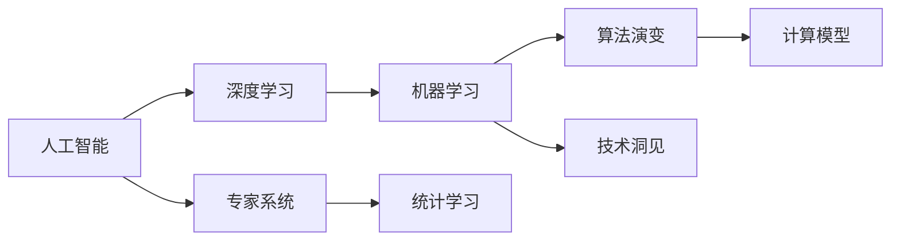
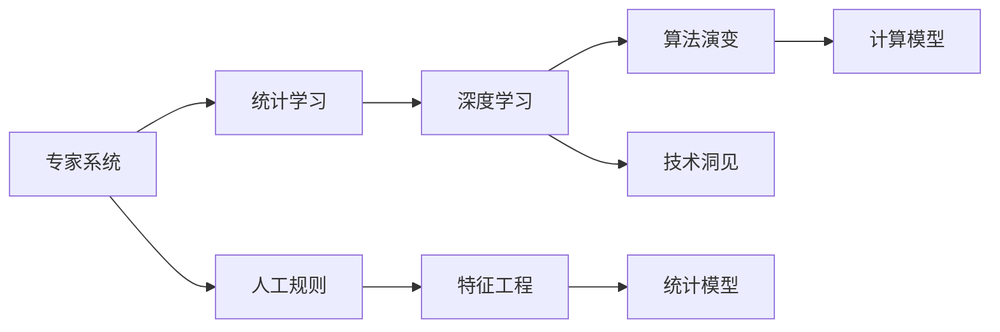

                 

# 从概念到洞见：思想的演变

> 关键词：人工智能,深度学习,机器学习,算法演变,技术洞见,计算模型

## 1. 背景介绍

### 1.1 问题由来
自20世纪60年代以来，计算机科学领域经历了从信息处理到人工智能再到深度学习的一系列演变。人工智能（AI）一词首次出现于1956年达特茅斯会议，标志着计算机科学新时代的开端。然而，直至1980年代，深度学习技术才因其在图像识别、自然语言处理等领域的突破性应用而重新焕发生机。

### 1.2 问题核心关键点
- 人工智能：使计算机能够模拟人类智能的行为，包括学习、推理、决策等能力。
- 深度学习：一种利用多层次神经网络进行特征学习和模式识别的机器学习技术。
- 机器学习：通过数据训练模型，使模型能够自动改进，减少人工干预。
- 算法演变：从早期基于规则的专家系统，到统计学习，再到深度学习的演化路径。
- 技术洞见：对现有技术方法进行深度分析，揭示其原理和潜在的提升空间。
- 计算模型：从简单的线性回归模型到复杂的深度神经网络，计算模型的发展推动了AI技术的进步。

这些概念之间的逻辑关系可以通过以下Mermaid流程图来展示：



这个流程图展示了一系列与人工智能和深度学习相关的概念，以及它们之间的逻辑关系。专家系统、统计学习和深度学习分别作为人工智能的早期形态、中级阶段和当前主流方法，而算法演变、技术洞见和计算模型则揭示了这一发展脉络背后的原理和技术进步。

## 2. 核心概念与联系

### 2.1 核心概念概述

为更好地理解深度学习从概念到洞见的发展，本节将介绍几个密切相关的核心概念：

- 专家系统(Expert System)：基于规则的人工智能系统，通过模拟人类专家的决策过程进行问题解决。
- 统计学习(Statistical Learning)：利用统计学原理，通过数据训练模型，以预测未来数据。
- 深度学习(Deep Learning)：一种基于多层神经网络的学习方法，用于处理复杂的非线性关系。
- 算法演变(Algorithm Evolution)：从简单算法到复杂算法的进化路径，体现了技术进步的足迹。
- 技术洞见(Technical Insight)：对现有技术方法的深度分析，揭示其潜在的优化空间。
- 计算模型(Computational Model)：算法实现的具体计算模型，从简单的线性模型到复杂的深度神经网络。

这些核心概念之间的逻辑关系可以通过以下Mermaid流程图来展示：



这个流程图展示了一系列与人工智能和深度学习相关的概念，以及它们之间的逻辑关系。专家系统、统计学习和深度学习分别作为人工智能的早期形态、中级阶段和当前主流方法，而算法演变、技术洞见和计算模型则揭示了这一发展脉络背后的原理和技术进步。

## 3. 核心算法原理 & 具体操作步骤
### 3.1 算法原理概述

深度学习通过构建多层神经网络，自动地从数据中学习复杂的特征表示，从而实现对复杂问题的建模和预测。深度学习的核心算法包括反向传播、卷积神经网络(CNN)、循环神经网络(RNN)和变换器(Transformer)等。

### 3.2 算法步骤详解

深度学习算法一般包括以下关键步骤：

**Step 1: 数据准备**
- 收集和预处理数据，包括清洗、归一化和分批等操作。

**Step 2: 模型选择**
- 选择合适的深度学习模型，如卷积神经网络(CNN)、循环神经网络(RNN)或变换器(Transformer)。

**Step 3: 参数初始化**
- 对模型中的权重和偏置进行随机初始化。

**Step 4: 前向传播**
- 将输入数据传递通过模型，计算模型的输出。

**Step 5: 损失函数计算**
- 计算模型输出与真实标签之间的误差，常用损失函数包括均方误差、交叉熵等。

**Step 6: 反向传播**
- 根据误差反向传播，计算每个参数的梯度。

**Step 7: 参数更新**
- 使用梯度下降等优化算法更新模型参数。

**Step 8: 重复迭代**
- 多次重复Step 4至Step 7，直至收敛。

### 3.3 算法优缺点

深度学习算法具有以下优点：
1. 可处理复杂非线性关系。多层神经网络能够自动学习数据中的复杂特征，从而对复杂问题进行建模。
2. 适用于大规模数据。深度学习模型可以通过大规模数据进行预训练，学习丰富的知识。
3. 泛化能力强。通过迁移学习等技术，深度学习模型可以适应新领域和任务。

同时，深度学习算法也存在一些局限性：
1. 需要大量数据。模型训练需要大量标注数据，获取成本较高。
2. 模型复杂度高。深度模型参数量大，训练和推理开销较大。
3. 计算资源要求高。深度学习模型往往需要高性能计算设备支持。
4. 可解释性差。深度学习模型通常被视为"黑盒"，难以解释其决策过程。

尽管存在这些局限性，但深度学习算法凭借其在图像识别、自然语言处理等领域的成功应用，已经成为了当前人工智能的主流技术。

### 3.4 算法应用领域

深度学习算法在多个领域得到了广泛应用，以下是几个典型的例子：

- 计算机视觉：如图像分类、目标检测、图像生成等。
- 自然语言处理：如文本分类、机器翻译、语言模型等。
- 语音识别：如语音转文本、说话人识别等。
- 医疗诊断：如医学影像分析、基因组学等。
- 推荐系统：如协同过滤、基于深度学习的方法等。

深度学习技术在这些领域展示了其强大的建模和预测能力，推动了相关技术的快速发展。

## 4. 数学模型和公式 & 详细讲解
### 4.1 数学模型构建

深度学习模型的核心是多层神经网络。这里以卷积神经网络(CNN)为例，展示其数学模型构建过程。

记卷积神经网络为 $M_{\theta}$，其中 $\theta$ 为模型参数。假设输入数据为 $x \in \mathbb{R}^d$，输出为 $y \in \mathbb{R}^k$。模型的数学模型为：

$$
y = M_{\theta}(x) = \sigma(W_{L}h_{L-1} + b_{L})
$$

其中 $h_{L-1} = \sigma(W_{L-1}h_{L-2} + b_{L-1})$，依次类推，直到 $h_1 = \sigma(W_1x + b_1)$。

### 4.2 公式推导过程

以卷积神经网络(CNN)为例，进行数学推导。

设输入数据 $x \in \mathbb{R}^d$，输出数据 $y \in \mathbb{R}^k$。假设模型的卷积层、池化层和全连接层等计算节点分别为 $h_{l}$，其中 $l = 1, ..., L$。

在卷积层中，通过卷积核进行特征提取，计算公式为：

$$
h_l = \sigma(W_lh_{l-1} + b_l) \text{ for } l = 1, ..., L
$$

其中 $W_l$ 和 $b_l$ 为卷积层和全连接层的权重和偏置。

通过多层卷积和池化操作，逐步提取数据的高级特征，最终将特征输入全连接层进行分类。全连接层的计算公式为：

$$
y = \sigma(W_Lh_{L-1} + b_L)
$$

其中 $W_L$ 和 $b_L$ 为全连接层的权重和偏置。

### 4.3 案例分析与讲解

以下以图像分类为例，展示CNN模型的实现和训练过程。

**Step 1: 数据准备**
- 收集并标注图像数据集。
- 对图像进行预处理，如归一化、扩充等操作。

**Step 2: 模型选择**
- 选择适当的CNN架构，如LeNet、AlexNet、VGG等。

**Step 3: 参数初始化**
- 对模型中的权重和偏置进行随机初始化。

**Step 4: 前向传播**
- 将输入图像传递通过模型，计算输出。

**Step 5: 损失函数计算**
- 计算输出与真实标签之间的误差，如交叉熵损失。

**Step 6: 反向传播**
- 根据误差反向传播，计算每个参数的梯度。

**Step 7: 参数更新**
- 使用梯度下降等优化算法更新模型参数。

**Step 8: 重复迭代**
- 多次重复Step 4至Step 7，直至收敛。

## 5. 项目实践：代码实例和详细解释说明
### 5.1 开发环境搭建

在进行深度学习项目实践前，我们需要准备好开发环境。以下是使用Python进行TensorFlow开发的环境配置流程：

1. 安装Anaconda：从官网下载并安装Anaconda，用于创建独立的Python环境。

2. 创建并激活虚拟环境：
```bash
conda create -n tf-env python=3.8 
conda activate tf-env
```

3. 安装TensorFlow：根据CUDA版本，从官网获取对应的安装命令。例如：
```bash
conda install tensorflow -c conda-forge
```

4. 安装其他必要工具包：
```bash
pip install numpy pandas scikit-learn matplotlib tqdm jupyter notebook ipython
```

完成上述步骤后，即可在`tf-env`环境中开始项目开发。

### 5.2 源代码详细实现

下面我们以图像分类为例，给出使用TensorFlow进行卷积神经网络(CNN)实现的完整代码。

首先，定义CNN模型的类：

```python
import tensorflow as tf
from tensorflow.keras import layers

class CNNModel(tf.keras.Model):
    def __init__(self, num_classes):
        super(CNNModel, self).__init__()
        self.conv1 = layers.Conv2D(32, (3, 3), activation='relu', padding='same')
        self.pool1 = layers.MaxPooling2D((2, 2), padding='same')
        self.conv2 = layers.Conv2D(64, (3, 3), activation='relu', padding='same')
        self.pool2 = layers.MaxPooling2D((2, 2), padding='same')
        self.flatten = layers.Flatten()
        self.dense1 = layers.Dense(128, activation='relu')
        self.dense2 = layers.Dense(num_classes, activation='softmax')
    
    def call(self, inputs):
        x = self.conv1(inputs)
        x = self.pool1(x)
        x = self.conv2(x)
        x = self.pool2(x)
        x = self.flatten(x)
        x = self.dense1(x)
        return self.dense2(x)
```

然后，定义训练和评估函数：

```python
from tensorflow.keras import datasets, optimizers

def train_model(model, dataset, epochs, batch_size):
    dataset = dataset.batch(batch_size)
    model.compile(optimizer=optimizers.Adam(), loss='categorical_crossentropy', metrics=['accuracy'])
    model.fit(dataset, epochs=epochs)

def evaluate_model(model, dataset, batch_size):
    dataset = dataset.batch(batch_size)
    model.evaluate(dataset)
```

最后，启动训练流程并在测试集上评估：

```python
model = CNNModel(num_classes)
train_dataset = ...
train_model(model, train_dataset, epochs, batch_size)
evaluate_model(model, test_dataset, batch_size)
```

以上就是使用TensorFlow对图像分类问题进行卷积神经网络微调的完整代码实现。可以看到，得益于TensorFlow的强大封装，我们可以用相对简洁的代码完成CNN模型的加载和微调。

### 5.3 代码解读与分析

让我们再详细解读一下关键代码的实现细节：

**CNNModel类**：
- `__init__`方法：初始化CNN模型的各个组件，包括卷积层、池化层和全连接层。
- `call`方法：定义模型的前向传播过程。

**train_model函数**：
- 将数据集分为训练集和验证集，按批次加载输入。
- 使用Adam优化器进行梯度下降。
- 计算交叉熵损失和准确率，在每个epoch结束时评估模型性能。

**evaluate_model函数**：
- 使用测试集评估模型性能。

**训练流程**：
- 定义总的epoch数和batch size，开始循环迭代
- 每个epoch内，先在前训练集上训练，再输出准确率
- 所有epoch结束后，在测试集上评估，给出最终测试结果

可以看到，TensorFlow配合TensorFlow的强大封装，使得CNN微调的代码实现变得简洁高效。开发者可以将更多精力放在数据处理、模型改进等高层逻辑上，而不必过多关注底层的实现细节。

当然，工业级的系统实现还需考虑更多因素，如模型的保存和部署、超参数的自动搜索、更灵活的任务适配层等。但核心的微调范式基本与此类似。

## 6. 实际应用场景
### 6.1 图像识别

深度学习在图像识别领域取得了巨大的成功，广泛应用于人脸识别、物体检测、图像分割等任务。通过卷积神经网络(CNN)和全连接层，模型可以自动学习图像特征并进行分类或回归预测。

### 6.2 自然语言处理

深度学习在自然语言处理领域也有广泛应用。通过卷积神经网络(CNN)、循环神经网络(RNN)和Transformer等模型，模型可以自动学习文本特征并进行分类、生成、翻译等任务。

### 6.3 语音识别

深度学习在语音识别领域也取得了显著进展。通过卷积神经网络(CNN)、循环神经网络(RNN)和Transformer等模型，模型可以自动学习语音信号特征并进行识别和转换。

### 6.4 医疗诊断

深度学习在医疗诊断领域也有潜在应用。通过卷积神经网络(CNN)、循环神经网络(RNN)和Transformer等模型，模型可以自动学习医学影像特征并进行诊断。

## 7. 工具和资源推荐
### 7.1 学习资源推荐

为了帮助开发者系统掌握深度学习的理论基础和实践技巧，这里推荐一些优质的学习资源：

1. 《深度学习》系列书籍：Ian Goodfellow、Yoshua Bengio和Aaron Courville所著，全面介绍了深度学习的基础理论和最新进展。
2. Coursera《深度学习专项课程》：由Andrew Ng教授主讲，深入浅出地介绍了深度学习的基本概念和技术。
3. TensorFlow官方文档：TensorFlow的详细官方文档，包括教程、API文档和示例代码，是学习深度学习的必备资料。
4. PyTorch官方文档：PyTorch的详细官方文档，包括教程、API文档和示例代码，是学习深度学习的另一重要资料。
5. DeepLearning.AI（前Coursera深度学习课程）：由Andrew Ng教授主讲，涵盖深度学习的基础、高级技术和实际应用。

通过对这些资源的学习实践，相信你一定能够快速掌握深度学习的精髓，并用于解决实际的NLP问题。

### 7.2 开发工具推荐

高效的开发离不开优秀的工具支持。以下是几款用于深度学习开发的常用工具：

1. PyTorch：基于Python的开源深度学习框架，灵活的计算图，适合快速迭代研究。大部分深度学习模型都有PyTorch版本的实现。
2. TensorFlow：由Google主导开发的开源深度学习框架，生产部署方便，适合大规模工程应用。同样有丰富的深度学习模型资源。
3. Keras：高级神经网络API，基于TensorFlow和Theano等后端，易于上手和调试。
4. Jupyter Notebook：交互式编程环境，支持Python、R、Scala等多种编程语言，便于数据探索和模型开发。
5. Git/GitHub：版本控制系统，便于团队协作和代码版本控制。

合理利用这些工具，可以显著提升深度学习项目开发效率，加快创新迭代的步伐。

### 7.3 相关论文推荐

深度学习的发展得益于学界的持续研究。以下是几篇奠基性的相关论文，推荐阅读：

1. AlexNet: ImageNet Classification with Deep Convolutional Neural Networks：提出AlexNet模型，开启了深度学习在图像识别领域的突破。
2. VGGNet: Very Deep Convolutional Networks for Large-Scale Image Recognition：提出VGGNet模型，展示了卷积神经网络的深度潜力。
3. ResNet: Deep Residual Learning for Image Recognition：提出ResNet模型，解决了深度神经网络退化的问题。
4. Inception: Going Deeper with Convolutions：提出Inception模型，提升了卷积神经网络的计算效率和表现。
5. Transformer: Attention Is All You Need：提出Transformer模型，提升了自然语言处理的性能和可解释性。

这些论文代表了大深度学习的发展脉络。通过学习这些前沿成果，可以帮助研究者把握学科前进方向，激发更多的创新灵感。

## 8. 总结：未来发展趋势与挑战

### 8.1 总结

本文对深度学习从概念到洞见的发展进行了全面系统的介绍。首先阐述了深度学习的基本原理和实践技巧，明确了深度学习在人工智能中的核心地位。其次，从原理到实践，详细讲解了深度学习的数学模型和关键步骤，给出了深度学习项目开发的完整代码实例。同时，本文还广泛探讨了深度学习在图像识别、自然语言处理等领域的实际应用前景，展示了深度学习范式的巨大潜力。最后，本文精选了深度学习相关的学习资源，力求为读者提供全方位的技术指引。

通过本文的系统梳理，可以看到，深度学习技术已经成为当前人工智能的主流技术，极大地拓展了人工智能的应用边界，催生了更多的落地场景。未来，伴随深度学习方法的持续演进，人工智能必将在更广阔的应用领域大放异彩。

### 8.2 未来发展趋势

展望未来，深度学习技术将呈现以下几个发展趋势：

1. 模型规模持续增大。随着算力成本的下降和数据规模的扩张，深度学习模型参数量还将持续增长。超大规模模型蕴含的丰富知识，有望支撑更加复杂多变的任务。
2. 模型鲁棒性提升。深度学习模型将通过对抗训练、数据增强等技术，提高对噪声、异常情况的鲁棒性。
3. 计算效率优化。深度学习模型将通过模型剪枝、量化、混合精度等技术，提高计算效率，降低内存和存储需求。
4. 自监督学习发展。深度学习模型将通过自监督学习、对比学习等技术，提升对未标注数据的利用率，降低对标注数据的依赖。
5. 多模态融合。深度学习模型将通过融合视觉、语音、文本等多种模态信息，提升对复杂场景的理解能力。

以上趋势凸显了深度学习技术的广阔前景。这些方向的探索发展，必将进一步提升深度学习系统的性能和应用范围，为构建智能交互系统提供新的技术动力。

### 8.3 面临的挑战

尽管深度学习技术已经取得了瞩目成就，但在迈向更加智能化、普适化应用的过程中，它仍面临着诸多挑战：

1. 数据依赖。深度学习模型往往依赖大量标注数据，对于数据稀缺或分布不均的任务，模型性能难以提升。
2. 模型复杂度。深度学习模型往往参数量庞大，训练和推理开销较大，如何降低模型复杂度，提高计算效率，是重要研究方向。
3. 可解释性不足。深度学习模型通常被视为"黑盒"，难以解释其内部决策过程。如何在不降低性能的情况下，提升模型的可解释性，是关键问题。
4. 鲁棒性不足。深度学习模型面对噪声、异常等情况时，容易产生误判，如何提高模型的鲁棒性，是未来研究的重要方向。
5. 伦理道德问题。深度学习模型可能带来歧视、偏见等问题，如何确保模型的公平性和安全性，是重要挑战。

这些挑战亟需研究人员和企业共同面对和解决，只有不断地优化技术，提高模型的性能和可靠性，才能推动深度学习技术的广泛应用。

### 8.4 研究展望

未来，深度学习技术的研发将重点围绕以下几个方向展开：

1. 可解释性增强。通过改进模型结构和损失函数，提升模型的可解释性，帮助用户理解模型的决策过程。
2. 鲁棒性提升。通过对抗训练、数据增强等技术，提高模型的鲁棒性，使其在复杂场景下仍能保持稳定。
3. 多模态融合。通过融合视觉、语音、文本等多种模态信息，提升模型的理解能力和表现。
4. 自监督学习。通过自监督学习、对比学习等技术，提升模型对未标注数据的利用率，降低对标注数据的依赖。
5. 模型压缩和剪枝。通过模型压缩、剪枝等技术，降低模型复杂度，提高计算效率和存储效率。

这些研究方向将推动深度学习技术的不断进步，为构建更加智能、普适、可靠的系统提供新的技术动力。

## 9. 附录：常见问题与解答

**Q1：深度学习是否适用于所有问题？**

A: 深度学习不适用于所有问题。其核心是自动提取数据中的复杂特征，对于简单问题或数据稀缺的问题，深度学习的效果可能不如传统方法。此外，深度学习模型往往需要大量标注数据，对于标注数据稀缺的问题，深度学习的效果也可能不佳。

**Q2：深度学习模型的复杂度是否可以降低？**

A: 深度学习模型的复杂度可以通过模型剪枝、量化等技术进行降低，同时保持模型性能。例如，可以使用剪枝技术去除不重要的参数，或者使用量化技术将浮点数模型转换为定点模型，减少存储和计算开销。

**Q3：如何提高深度学习模型的可解释性？**

A: 提高深度学习模型的可解释性是一个重要研究方向。常用的方法包括：
1. 特征可视化：使用工具如t-SNE、LIME等，将模型的特征表示可视化，帮助理解模型的决策过程。
2. 模型简化：通过改进模型结构和损失函数，减少模型复杂度，提高模型的可解释性。
3. 解释工具：使用解释工具如SHAP、LIME等，对模型的决策过程进行解释，帮助用户理解模型的行为。

**Q4：深度学习模型如何提升鲁棒性？**

A: 提升深度学习模型的鲁棒性可以通过以下方法：
1. 对抗训练：在训练过程中加入对抗样本，提高模型的鲁棒性。
2. 数据增强：对训练数据进行扩充，提高模型的泛化能力。
3. 正则化：通过L2正则、Dropout等技术，防止模型过拟合。

这些方法可以有效提升深度学习模型的鲁棒性，使其在复杂场景下仍能保持稳定。

**Q5：深度学习模型如何融合多模态信息？**

A: 融合多模态信息是深度学习模型的重要研究方向。常用的方法包括：
1. 特征融合：通过融合视觉、语音、文本等多种模态的特征，提升模型的理解能力。
2. 模型融合：将多种模型进行融合，利用其优势互补，提升模型的性能。
3. 联合训练：将多种模态的信息联合训练，学习多模态特征的联合表示。

这些方法可以有效提升深度学习模型在多模态场景下的表现，推动其在实际应用中的广泛应用。

---

作者：禅与计算机程序设计艺术 / Zen and the Art of Computer Programming

