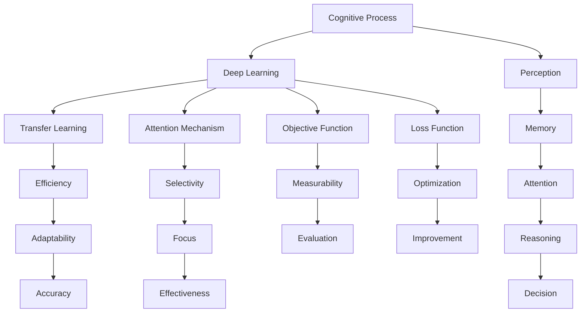

                 

# 从浅薄到深刻的认知过程

## 1. 背景介绍

### 1.1 问题由来

随着信息技术的发展，认知过程越来越依赖于机器和算法。但长期以来，我们的认知过程往往较为浅薄，无法深入理解事物的本质。特别是在复杂信息爆炸的时代，浅薄的认知过程显得更加脆弱，难以处理复杂多变的问题。

如何从浅薄走向深刻，从机械走向智能，成为认知过程领域亟待解决的问题。本文将从认知过程的基础原理、核心概念及关键算法入手，逐步揭示从浅薄到深刻认知过程的内在机理，为认知过程的改进提供有力支持。

### 1.2 问题核心关键点

认知过程的改进可以从以下几个方面入手：
1. 理解认知过程的基本原理。
2. 掌握核心概念及其相互关系。
3. 使用核心算法改进认知过程。
4. 结合实际应用场景，进行认知过程的改进实践。
5. 展望未来，提出认知过程的改进方向。

## 2. 核心概念与联系

### 2.1 核心概念概述

为更好地理解认知过程的改进，本节将介绍几个密切相关的核心概念：

- 认知过程(Cognitive Process)：指人类或机器对信息进行感知、理解、推理和决策的过程。认知过程涉及感知、记忆、注意力、语言等多个方面，是智能系统核心能力之一。
- 深度学习(Deep Learning)：一种基于神经网络进行特征表示学习的机器学习方法，能够自动提取和泛化复杂数据结构，广泛应用于图像、语音、文本等领域。
- 转移学习(Transfer Learning)：指将一个任务学到的知识，迁移到另一个相关任务上，以加快新任务的学习速度和提升性能。深度学习中的预训练-微调范式即是一种典型的转移学习方法。
- 注意力机制(Attention Mechanism)：一种用于选择和关注关键信息的机制，常见于深度学习模型中，能够增强模型的选择性、针对性和泛化能力。
- 目标函数(Objective Function)：衡量模型性能的数学函数，常见的目标函数包括交叉熵、均方误差等，用于指导模型的训练。
- 损失函数(Loss Function)：衡量模型预测值与真实值差异的数学函数，用于优化模型的目标函数，提高模型性能。

这些核心概念之间的逻辑关系可以通过以下Mermaid流程图来展示：



这个流程图展示了认知过程的主要环节及其与深度学习技术的关系：

1. 认知过程包括感知、记忆、注意力、推理和决策等多个环节，每个环节均可以通过深度学习模型进行建模。
2. 深度学习中的转移学习、注意力机制、目标函数和损失函数，分别对应认知过程的多个重要方面，如效率、适应性、选择性和优化性。
3. 通过合理的认知过程改进方法，可以使深度学习模型更加高效、泛化、选择性更强，进而提升认知过程的性能。

## 3. 核心算法原理 & 具体操作步骤
### 3.1 算法原理概述

认知过程的改进可以通过深度学习算法实现。其核心思想是：将深度学习模型应用到认知过程的各个环节，通过数据驱动的方法，提高模型的性能和泛化能力。

形式化地，假设认知过程的输入为 $x$，输出为 $y$，目标是训练一个深度学习模型 $f$ 进行映射。在训练集 $\mathcal{D}=\{(x_i, y_i)\}_{i=1}^N$ 上，通过最小化经验风险函数：

$$
\mathcal{L}(f) = \frac{1}{N} \sum_{i=1}^N \ell(f(x_i), y_i)
$$

其中 $\ell$ 为损失函数，通常为交叉熵损失或均方误差损失。通过优化目标函数：

$$
\mathop{\arg\min}_{\theta} \mathcal{L}(f_{\theta}(x))
$$

其中 $f_{\theta}$ 为模型参数，可以得到最优的模型参数 $\theta^*$。

### 3.2 算法步骤详解

认知过程的改进涉及以下关键步骤：

**Step 1: 数据准备与预处理**
- 收集和标注认知过程相关的数据，包括感知、记忆、注意力、推理和决策等多个环节的数据。
- 对数据进行预处理，如去噪、归一化、特征提取等，便于深度学习模型的训练。

**Step 2: 选择合适的深度学习模型**
- 根据认知过程的具体需求，选择合适的深度学习模型，如卷积神经网络(CNN)、循环神经网络(RNN)、Transformer等。
- 使用预训练模型或从零开始训练模型，具体选择根据任务需求和数据量等因素决定。

**Step 3: 设置训练参数**
- 选择合适的优化器及其参数，如Adam、SGD等，设置学习率、批大小、迭代轮数等。
- 设置正则化技术及强度，包括权重衰减、Dropout等，防止过拟合。
- 确定是否使用预训练模型，并设置冻结预训练参数的策略。

**Step 4: 执行模型训练**
- 将训练集数据分批次输入模型，前向传播计算损失函数。
- 反向传播计算参数梯度，根据设定的优化算法和学习率更新模型参数。
- 周期性在验证集上评估模型性能，根据性能指标决定是否触发Early Stopping。
- 重复上述步骤直到满足预设的迭代轮数或Early Stopping条件。

**Step 5: 模型评估与改进**
- 在测试集上评估模型性能，对比改进前后的精度提升。
- 根据评估结果，对模型进行必要的调整和改进。

### 3.3 算法优缺点

认知过程改进的深度学习算法具有以下优点：
1. 数据驱动：通过大量标注数据训练模型，可以从数据中自动学习认知过程的关键特征。
2. 泛化能力：深度学习模型可以学习复杂的非线性关系，具备较强的泛化能力。
3. 效率提升：通过合理的模型结构和优化算法，可以有效提升认知过程的效率和性能。
4. 可解释性：深度学习模型通过特征图等可视化手段，可以进行解释和调试。

同时，该算法也存在一定的局限性：
1. 数据依赖：深度学习模型需要大量标注数据进行训练，难以处理无标注或少量标注的数据。
2. 可解释性不足：深度学习模型通常被视为"黑盒"，难以解释其内部工作机制和决策逻辑。
3. 计算资源消耗大：深度学习模型参数量较大，训练和推理计算资源消耗高。
4. 模型泛化能力有限：深度学习模型容易过拟合，泛化能力较弱。

尽管存在这些局限性，但就目前而言，深度学习算法仍是目前认知过程改进的主要方法，具有广泛的应用前景。

### 3.4 算法应用领域

深度学习算法在认知过程的改进中具有广泛的应用：

- 计算机视觉：使用卷积神经网络进行图像分类、目标检测、图像生成等任务，提高机器的视觉感知能力。
- 自然语言处理：使用Transformer、RNN等模型进行语言理解、生成、翻译等任务，增强机器的语言理解和推理能力。
- 语音识别：使用循环神经网络、卷积神经网络等模型进行语音信号处理和特征提取，提升机器的语音识别和生成能力。
- 生物信息学：使用深度学习模型进行基因序列分析、蛋白质结构预测、药物发现等任务，提高生物计算的精度和效率。
- 机器人学习：使用深度学习模型进行机器人动作控制、路径规划、环境感知等任务，提升机器人的智能水平。
- 医疗诊断：使用深度学习模型进行医学影像分析、疾病诊断、智能问诊等任务，提高医疗诊断的准确性和效率。
- 推荐系统：使用深度学习模型进行用户行为分析、兴趣预测、内容推荐等任务，提升推荐系统的个性化和用户体验。

## 4. 数学模型和公式 & 详细讲解 & 举例说明
### 4.1 数学模型构建

本节将使用数学语言对认知过程改进的深度学习模型进行更加严格的刻画。

假设认知过程的输入为 $x$，输出为 $y$，目标函数为：

$$
\mathcal{L}(f) = \frac{1}{N} \sum_{i=1}^N \ell(f(x_i), y_i)
$$

其中 $\ell$ 为损失函数，通常为交叉熵损失或均方误差损失。优化目标函数：

$$
\mathop{\arg\min}_{\theta} \mathcal{L}(f_{\theta}(x))
$$

其中 $f_{\theta}$ 为模型参数。

### 4.2 公式推导过程

以下我们以二分类任务为例，推导交叉熵损失函数及其梯度的计算公式。

假设模型 $f_{\theta}$ 在输入 $x$ 上的输出为 $\hat{y}=f_{\theta}(x) \in [0,1]$，表示样本属于正类的概率。真实标签 $y \in \{0,1\}$。则二分类交叉熵损失函数定义为：

$$
\ell(f_{\theta}(x),y) = -[y\log \hat{y} + (1-y)\log (1-\hat{y})]
$$

将其代入目标函数，得：

$$
\mathcal{L}(\theta) = -\frac{1}{N}\sum_{i=1}^N [y_i\log f_{\theta}(x_i)+(1-y_i)\log(1-f_{\theta}(x_i))]
$$

根据链式法则，目标函数对参数 $\theta_k$ 的梯度为：

$$
\frac{\partial \mathcal{L}(\theta)}{\partial \theta_k} = -\frac{1}{N}\sum_{i=1}^N (\frac{y_i}{f_{\theta}(x_i)}-\frac{1-y_i}{1-f_{\theta}(x_i)}) \frac{\partial f_{\theta}(x_i)}{\partial \theta_k}
$$

其中 $\frac{\partial f_{\theta}(x_i)}{\partial \theta_k}$ 可进一步递归展开，利用自动微分技术完成计算。

在得到目标函数的梯度后，即可带入优化算法，完成模型的迭代优化。重复上述过程直至收敛，最终得到最优模型参数 $\theta^*$。

### 4.3 案例分析与讲解

以二分类任务为例，展示认知过程改进的深度学习算法在实际应用中的效果。

假设我们有一个二分类任务，目标是识别一张图片是否包含人脸。我们可以使用卷积神经网络(CNN)模型进行训练和推理。具体步骤如下：

1. **数据准备**：收集包含人脸和不包含人脸的图像数据，并对数据进行预处理，如去噪、归一化、数据增强等。

2. **模型选择**：选择合适的卷积神经网络模型，如ResNet、Inception等。

3. **设置训练参数**：选择合适的优化器，如Adam、SGD等，设置学习率、批大小、迭代轮数等。

4. **模型训练**：将训练集数据分批次输入模型，前向传播计算损失函数，反向传播计算参数梯度，更新模型参数。

5. **模型评估**：在测试集上评估模型性能，计算精度、召回率、F1-score等指标。

6. **模型改进**：根据评估结果，对模型进行必要的调整和改进，如调整网络结构、优化损失函数、引入正则化技术等。

最终，我们可以通过不断迭代和改进，使模型在人脸识别任务上获得较高的准确率和泛化能力。

## 5. 项目实践：代码实例和详细解释说明
### 5.1 开发环境搭建

在进行认知过程改进的深度学习实践前，我们需要准备好开发环境。以下是使用Python进行TensorFlow开发的环境配置流程：

1. 安装Anaconda：从官网下载并安装Anaconda，用于创建独立的Python环境。

2. 创建并激活虚拟环境：
```bash
conda create -n tf-env python=3.8 
conda activate tf-env
```

3. 安装TensorFlow：根据CUDA版本，从官网获取对应的安装命令。例如：
```bash
conda install tensorflow -c pytorch -c conda-forge
```

4. 安装各类工具包：
```bash
pip install numpy pandas scikit-learn matplotlib tqdm jupyter notebook ipython
```

完成上述步骤后，即可在`tf-env`环境中开始深度学习实践。

### 5.2 源代码详细实现

下面我们以人脸识别任务为例，给出使用TensorFlow对CNN模型进行训练的Python代码实现。

首先，定义CNN模型的层结构：

```python
import tensorflow as tf

model = tf.keras.Sequential([
    tf.keras.layers.Conv2D(32, (3, 3), activation='relu', input_shape=(32, 32, 3)),
    tf.keras.layers.MaxPooling2D((2, 2)),
    tf.keras.layers.Conv2D(64, (3, 3), activation='relu'),
    tf.keras.layers.MaxPooling2D((2, 2)),
    tf.keras.layers.Conv2D(128, (3, 3), activation='relu'),
    tf.keras.layers.MaxPooling2D((2, 2)),
    tf.keras.layers.Flatten(),
    tf.keras.layers.Dense(64, activation='relu'),
    tf.keras.layers.Dense(1, activation='sigmoid')
])
```

然后，定义优化器、损失函数和训练过程：

```python
optimizer = tf.keras.optimizers.Adam(learning_rate=0.001)
loss = tf.keras.losses.BinaryCrossentropy(from_logits=True)
metrics = [tf.keras.metrics.BinaryAccuracy(name='accuracy')]

model.compile(optimizer=optimizer, loss=loss, metrics=metrics)

model.fit(train_data, train_labels, epochs=10, validation_data=(val_data, val_labels))
```

接下来，使用模型进行预测和评估：

```python
test_labels = model.predict(test_data)
test_labels = [1 if x > 0.5 else 0 for x in test_labels]
```

可以看到，通过上述代码，我们可以快速搭建和训练CNN模型，并进行人脸识别任务的预测和评估。

### 5.3 代码解读与分析

让我们再详细解读一下关键代码的实现细节：

**Sequential模型**：
- 使用`tf.keras.Sequential`类定义模型结构，添加卷积层、池化层、全连接层等基本组件，构成深度学习模型。
- 使用`input_shape`参数指定输入数据的形状，`activation`参数指定激活函数。

**优化器、损失函数和训练过程**：
- 使用`tf.keras.optimizers.Adam`类定义优化器，设置学习率等参数。
- 使用`tf.keras.losses.BinaryCrossentropy`类定义损失函数，用于衡量模型的预测结果与真实标签之间的差异。
- 使用`model.compile`方法定义模型的编译过程，设置优化器、损失函数、评估指标等。
- 使用`model.fit`方法进行模型的训练过程，指定训练数据、标签、训练轮数、验证数据和标签等参数。

**预测和评估**：
- 使用`model.predict`方法对测试数据进行预测，并根据预测结果进行分类。

可以看到，TensorFlow提供了强大的深度学习框架，可以快速搭建和训练深度学习模型，支持各类数据格式和任务类型，非常适合认知过程改进的深度学习实践。

## 6. 实际应用场景
### 6.1 医疗影像诊断

认知过程改进的深度学习技术可以广泛应用于医疗影像诊断领域。传统医疗影像诊断需要医生凭借经验进行判断，容易受到主观因素的影响。而深度学习技术能够自动学习医学影像的特征，提高诊断的准确性和效率。

具体而言，我们可以使用深度学习模型对医学影像进行分类、分割、检测等任务，实现自动化的诊断和辅助诊断。例如，使用卷积神经网络对医学影像进行分类，将不同类型的疾病图像进行自动识别；使用语义分割网络对病灶区域进行自动标注；使用目标检测网络对医学影像中的关键结构进行自动识别和定位。

### 6.2 智能客服系统

智能客服系统需要处理大量的用户咨询，传统客服往往需要配备大量人力，高峰期响应缓慢，且一致性和专业性难以保证。而使用深度学习技术构建的智能客服系统，可以24小时不间断服务，快速响应客户咨询，用自然流畅的语言解答各类常见问题。

在技术实现上，我们可以收集企业内部的历史客服对话记录，将问题和最佳答复构建成监督数据，在此基础上对深度学习模型进行训练和微调。微调后的模型能够自动理解用户意图，匹配最合适的答案模板进行回复。对于客户提出的新问题，还可以接入检索系统实时搜索相关内容，动态组织生成回答。

### 6.3 推荐系统

当前的推荐系统往往只依赖用户的历史行为数据进行物品推荐，无法深入理解用户的真实兴趣偏好。使用深度学习技术构建的推荐系统，可以更好地挖掘用户行为背后的语义信息，从而提供更精准、多样的推荐内容。

在实践中，我们可以收集用户浏览、点击、评论、分享等行为数据，提取和用户交互的物品标题、描述、标签等文本内容。将文本内容作为模型输入，用户的后续行为（如是否点击、购买等）作为监督信号，在此基础上训练深度学习模型。深度学习模型能够从文本内容中准确把握用户的兴趣点，在生成推荐列表时，先用候选物品的文本描述作为输入，由模型预测用户的兴趣匹配度，再结合其他特征综合排序，便可以得到个性化程度更高的推荐结果。

### 6.4 未来应用展望

随着深度学习技术的不断发展，认知过程改进的深度学习技术将呈现以下几个发展趋势：

1. 模型规模持续增大。随着算力成本的下降和数据规模的扩张，深度学习模型的参数量还将持续增长。超大批次的训练和推理也可能遇到显存不足的问题。因此需要采用一些资源优化技术，如梯度积累、混合精度训练、模型并行等，来突破硬件瓶颈。

2. 模型泛化能力增强。深度学习模型容易过拟合，泛化能力较弱。未来会进一步引入正则化技术、对抗训练、自适应学习等方法，提高模型的泛化能力和鲁棒性。

3. 模型解释性增强。深度学习模型通常被视为"黑盒"，难以解释其内部工作机制和决策逻辑。未来会引入可解释性模型、知识图谱、规则库等方法，增强模型的解释性和可理解性。

4. 模型多模态融合。当前的深度学习模型主要聚焦于单一模态数据，难以处理多模态数据。未来会进一步融合视觉、语音、文本等多模态数据，增强模型的综合能力和适应性。

5. 模型自适应学习。深度学习模型难以应对新数据的动态变化。未来会引入自适应学习、迁移学习等方法，使模型能够不断学习和适应用户的动态变化。

6. 模型联邦学习。当前的深度学习模型往往依赖单一的数据源，难以获取海量数据。未来会引入联邦学习、对抗学习等方法，使模型能够分布式学习，提高数据的多样性和泛化能力。

7. 模型伦理约束。深度学习模型容易学习到有偏见、有害的信息，通过微调传递到下游任务，产生误导性、歧视性的输出，给实际应用带来安全隐患。未来会引入伦理约束、公平性评估等方法，确保模型的输出符合人类价值观和伦理道德。

这些趋势凸显了认知过程改进的深度学习技术的广阔前景。这些方向的探索发展，必将进一步提升深度学习模型的性能和应用范围，为认知过程改进提供有力的支持。

## 7. 工具和资源推荐
### 7.1 学习资源推荐

为了帮助开发者系统掌握认知过程改进的深度学习技术，这里推荐一些优质的学习资源：

1. 《Deep Learning》书籍：Ian Goodfellow、Yoshua Bengio和Aaron Courville联合撰写的经典教材，全面介绍了深度学习的理论基础和实践技巧。

2. 《Python深度学习》书籍：Francois Chollet撰写，专注于TensorFlow等框架的深度学习实践，提供了大量实际应用案例。

3. CS231n《深度学习与计算机视觉》课程：斯坦福大学开设的计算机视觉课程，提供了丰富的实践指导和案例分析。

4. CS224n《深度学习与自然语言处理》课程：斯坦福大学开设的自然语言处理课程，提供了深入的理论基础和实践技巧。

5. 《自然语言处理入门》课程：北京大学开设的自然语言处理课程，适合初学者系统学习自然语言处理技术。

6. Google Deep Learning AI课程：由Google提供的深度学习入门课程，适合初学者快速上手深度学习技术。

通过对这些资源的学习实践，相信你一定能够快速掌握认知过程改进的深度学习技术，并用于解决实际的认知过程问题。

### 7.2 开发工具推荐

高效的开发离不开优秀的工具支持。以下是几款用于深度学习开发的常用工具：

1. TensorFlow：由Google主导开发的深度学习框架，生产部署方便，适合大规模工程应用。

2. PyTorch：由Facebook主导开发的深度学习框架，灵活动态的计算图，适合快速迭代研究。

3. Jupyter Notebook：开源的交互式计算环境，支持Python、R、Julia等多种编程语言，适合数据探索和模型调试。

4. Colab：Google提供的交互式Python计算环境，支持GPU/TPU算力，适合快速迭代实验。

5. Visual Studio Code：开源的轻量级IDE，支持多语言开发，适合代码编写和调试。

6. Anaconda：开源的Python发行版，提供多种数据科学工具和库，适合科学计算和数据分析。

合理利用这些工具，可以显著提升深度学习开发的效率，加快创新迭代的步伐。

### 7.3 相关论文推荐

深度学习技术的发展源于学界的持续研究。以下是几篇奠基性的相关论文，推荐阅读：

1. ImageNet Classification with Deep Convolutional Neural Networks：Alex Krizhevsky等人发表的ImageNet图像分类论文，首次展示了深度卷积神经网络在图像分类任务上的强大能力。

2. Deep Speech 2：Google提出的深度学习模型，实现了语音识别任务上的突破，推动了语音技术的普及和发展。

3. Attention Is All You Need：谷歌提出的Transformer模型，奠定了自注意力机制在自然语言处理中的基础，推动了NLP技术的飞速发展。

4. AlphaGo Zero：DeepMind提出的深度强化学习模型，实现了围棋游戏的突破，展示了深度学习在复杂决策问题上的能力。

5. GANs Trained by a Two Time-Scale Update Rule Generate Quality Images without Discriminative Training Labels：Ian Goodfellow等人发表的生成对抗网络论文，展示了生成模型在图像生成任务上的突破。

这些论文代表了大规模深度学习技术的发展脉络。通过学习这些前沿成果，可以帮助研究者把握学科前进方向，激发更多的创新灵感。

## 8. 总结：未来发展趋势与挑战

### 8.1 总结

本文对认知过程改进的深度学习技术进行了全面系统的介绍。首先阐述了认知过程改进的基本原理，明确了深度学习在认知过程中扮演的重要角色。其次，从核心概念、核心算法和具体操作步骤入手，详细讲解了认知过程改进的深度学习技术。同时，结合实际应用场景，展示了深度学习技术在医疗影像诊断、智能客服、推荐系统等领域的广泛应用。此外，本文还精选了深度学习技术的各类学习资源，力求为开发者提供全方位的技术指引。

通过本文的系统梳理，可以看到，深度学习技术在认知过程改进中具有广泛的应用前景。但如何将强大的性能转化为稳定、高效、安全的业务价值，还需要工程实践的不断打磨。唯有从数据、算法、工程、业务等多个维度协同发力，才能真正实现深度学习技术在认知过程改进中的广泛应用。总之，深度学习技术需要开发者不断迭代和优化模型、数据和算法，方能得到理想的效果。

### 8.2 未来发展趋势

展望未来，认知过程改进的深度学习技术将呈现以下几个发展趋势：

1. 模型规模持续增大。随着算力成本的下降和数据规模的扩张，深度学习模型的参数量还将持续增长。超大批次的训练和推理也可能遇到显存不足的问题。因此需要采用一些资源优化技术，如梯度积累、混合精度训练、模型并行等，来突破硬件瓶颈。

2. 模型泛化能力增强。深度学习模型容易过拟合，泛化能力较弱。未来会进一步引入正则化技术、对抗训练、自适应学习等方法，提高模型的泛化能力和鲁棒性。

3. 模型解释性增强。深度学习模型通常被视为"黑盒"，难以解释其内部工作机制和决策逻辑。未来会引入可解释性模型、知识图谱、规则库等方法，增强模型的解释性和可理解性。

4. 模型多模态融合。当前的深度学习模型主要聚焦于单一模态数据，难以处理多模态数据。未来会进一步融合视觉、语音、文本等多模态数据，增强模型的综合能力和适应性。

5. 模型自适应学习。深度学习模型难以应对新数据的动态变化。未来会引入自适应学习、迁移学习等方法，使模型能够不断学习和适应用户的动态变化。

6. 模型联邦学习。当前的深度学习模型往往依赖单一的数据源，难以获取海量数据。未来会引入联邦学习、对抗学习等方法，使模型能够分布式学习，提高数据的多样性和泛化能力。

7. 模型伦理约束。深度学习模型容易学习到有偏见、有害的信息，通过微调传递到下游任务，产生误导性、歧视性的输出，给实际应用带来安全隐患。未来会引入伦理约束、公平性评估等方法，确保模型的输出符合人类价值观和伦理道德。

这些趋势凸显了认知过程改进的深度学习技术的广阔前景。这些方向的探索发展，必将进一步提升深度学习模型的性能和应用范围，为认知过程改进提供有力的支持。

### 8.3 面临的挑战

尽管深度学习技术在认知过程改进中取得了显著成效，但在迈向更加智能化、普适化应用的过程中，仍面临诸多挑战：

1. 数据依赖。深度学习模型需要大量标注数据进行训练，难以处理无标注或少量标注的数据。如何获取高质量、多样化的标注数据，是一个重要的挑战。

2. 模型泛化能力有限。深度学习模型容易过拟合，泛化能力较弱。如何在保证模型泛化能力的同时，提高模型的训练效率，是一个需要解决的问题。

3. 模型可解释性不足。深度学习模型通常被视为"黑盒"，难以解释其内部工作机制和决策逻辑。如何在保证模型性能的同时，增强模型的可解释性，是一个亟待解决的问题。

4. 计算资源消耗大。深度学习模型参数量较大，训练和推理计算资源消耗高。如何提高模型的资源利用率，是一个需要解决的问题。

5. 模型鲁棒性不足。深度学习模型容易受到对抗样本和噪声的干扰，导致输出不稳定。如何在保证模型性能的同时，提高模型的鲁棒性，是一个需要解决的问题。

6. 模型伦理约束。深度学习模型容易学习到有偏见、有害的信息，通过微调传递到下游任务，产生误导性、歧视性的输出，给实际应用带来安全隐患。如何引入伦理约束、公平性评估等方法，确保模型的输出符合人类价值观和伦理道德，是一个需要解决的问题。

7. 模型多模态融合。当前的深度学习模型主要聚焦于单一模态数据，难以处理多模态数据。如何在保证模型性能的同时，提高模型的多模态融合能力，是一个需要解决的问题。

8. 模型可解释性增强。深度学习模型通常被视为"黑盒"，难以解释其内部工作机制和决策逻辑。如何在保证模型性能的同时，增强模型的可解释性，是一个亟待解决的问题。

这些挑战凸显了认知过程改进的深度学习技术的复杂性。这些方向的探索发展，必将引领深度学习技术迈向更高的台阶，为认知过程改进提供更有力的支持。

### 8.4 研究展望

面对深度学习技术在认知过程改进中面临的挑战，未来的研究需要在以下几个方面寻求新的突破：

1. 引入无监督和半监督学习。摆脱对大规模标注数据的依赖，利用自监督学习、主动学习等无监督和半监督范式，最大限度利用非结构化数据，实现更加灵活高效的认知过程改进。

2. 开发更加参数高效的深度学习算法。开发更加参数高效的深度学习算法，在固定大部分预训练参数的情况下，只更新极少量的任务相关参数。

3. 引入因果学习和对抗训练。通过引入因果推断和对抗训练思想，增强深度学习模型建立稳定因果关系的能力，学习更加普适、鲁棒的语言表征，从而提升模型的泛化能力和鲁棒性。

4. 融合知识图谱和规则库。将符号化的先验知识，如知识图谱、逻辑规则等，与深度学习模型进行巧妙融合，引导认知过程改进模型学习更准确、合理的语言模型。

5. 引入自适应学习和联邦学习。引入自适应学习、联邦学习等方法，使认知过程改进模型能够不断学习和适应用户的动态变化，提高模型的实时性和普适性。

6. 增强模型可解释性和伦理约束。引入可解释性模型、知识图谱、规则库等方法，增强深度学习模型的解释性和可理解性。同时引入伦理约束、公平性评估等方法，确保模型的输出符合人类价值观和伦理道德。

这些研究方向的探索，必将引领深度学习技术迈向更高的台阶，为认知过程改进提供更有力的支持。面向未来，深度学习技术需要与其他人工智能技术进行更深入的融合，如知识表示、因果推理、强化学习等，多路径协同发力，共同推动认知过程改进技术的进步。

## 9. 附录：常见问题与解答

**Q1：认知过程改进的深度学习算法是否适用于所有认知过程？**

A: 深度学习算法在大多数认知过程中都能取得不错的效果，特别是对于数据量较大的任务。但对于一些特定领域的任务，如医学、法律等，仅仅依靠通用语料预训练的模型可能难以很好地适应。此时需要在特定领域语料上进一步预训练，再进行微调，才能获得理想效果。此外，对于一些需要时效性、个性化很强的任务，如对话、推荐等，深度学习方法也需要针对性的改进优化。

**Q2：深度学习算法在认知过程中面临的主要挑战是什么？**

A: 深度学习算法在认知过程中面临的主要挑战包括：
1. 数据依赖。深度学习模型需要大量标注数据进行训练，难以处理无标注或少量标注的数据。
2. 模型泛化能力有限。深度学习模型容易过拟合，泛化能力较弱。
3. 模型可解释性不足。深度学习模型通常被视为"黑盒"，难以解释其内部工作机制和决策逻辑。
4. 计算资源消耗大。深度学习模型参数量较大，训练和推理计算资源消耗高。
5. 模型鲁棒性不足。深度学习模型容易受到对抗样本和噪声的干扰，导致输出不稳定。
6. 模型伦理约束。深度学习模型容易学习到有偏见、有害的信息，通过微调传递到下游任务，产生误导性、歧视性的输出，给实际应用带来安全隐患。

这些挑战凸显了深度学习算法的复杂性。如何克服这些挑战，提升深度学习模型的性能和鲁棒性，是认知过程改进需要解决的重要问题。

**Q3：深度学习算法在认知过程中有哪些应用场景？**

A: 深度学习算法在认知过程的改进中具有广泛的应用：
1. 计算机视觉：使用卷积神经网络进行图像分类、目标检测、图像生成等任务，提高机器的视觉感知能力。
2. 自然语言处理：使用Transformer、RNN等模型进行语言理解、生成、翻译等任务，增强机器的语言理解和推理能力。
3. 语音识别：使用循环神经网络、卷积神经网络等模型进行语音信号处理和特征提取，提升机器的语音识别和生成能力。
4. 生物信息学：使用深度学习模型进行基因序列分析、蛋白质结构预测、药物发现等任务，提高生物计算的精度和效率。
5. 机器人学习：使用深度学习模型进行机器人动作控制、路径规划、环境感知等任务，提升机器人的智能水平。
6. 医疗诊断：使用深度学习模型进行医学影像分析、疾病诊断、智能问诊等任务，提高医疗诊断的准确性和效率。
7. 推荐系统：使用深度学习模型进行用户行为分析、兴趣预测、内容推荐等任务，提升推荐系统的个性化和用户体验。

这些应用场景展示了深度学习算法在认知过程改进中的广泛应用，为认知过程改进提供了重要的支持。

---

作者：禅与计算机程序设计艺术 / Zen and the Art of Computer Programming

