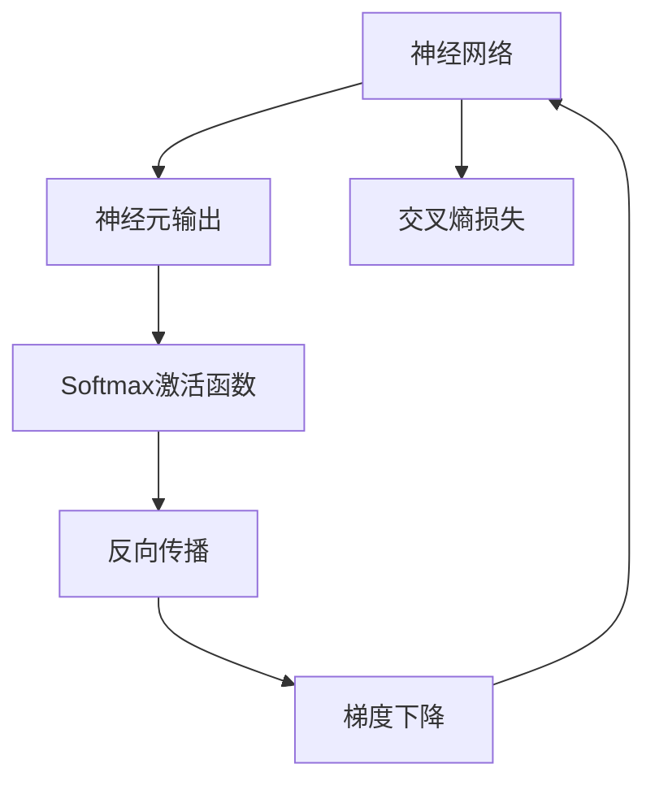

                 

# 从零开始大模型开发与微调：Softmax激活函数

> 关键词：大模型开发,Softmax激活函数,神经网络,神经元输出,交叉熵损失,反向传播,梯度下降,深度学习,激活函数,逻辑回归

## 1. 背景介绍

### 1.1 问题由来
在深度学习中，激活函数起着至关重要的作用。它决定着神经元输出与输入之间的关系，进而影响整个神经网络的性能。传统的激活函数如Sigmoid和Tanh已经被证明存在梯度消失和梯度爆炸等问题。为此，研究人员提出了Softmax激活函数，用于解决多分类问题。Softmax函数不仅能够处理多分类问题，还具有平滑性质，能够提升模型的泛化能力。因此，Softmax函数在大模型微调中得到了广泛应用。

### 1.2 问题核心关键点
Softmax函数的核心在于其数学定义和性质。其数学定义如下：

$$
\text{Softmax}(z_i) = \frac{\exp(z_i)}{\sum_{j=1}^K \exp(z_j)}
$$

其中，$z_i$ 表示输入向量中的第 $i$ 个元素，$K$ 表示类别数。Softmax函数的输出值是一个概率分布，表示每个类别的概率。其输出值的范围在 $0$ 到 $1$ 之间，所有元素之和为 $1$。

Softmax函数的性质包括：
- 非负性：$\text{Softmax}(z_i) \geq 0$。
- 归一化：$\sum_{i=1}^K \text{Softmax}(z_i) = 1$。
- 平滑性：Softmax函数是光滑的，即其导数连续可导。

Softmax函数能够将神经网络的输出转化为概率分布，使得模型更加可靠和稳定。

### 1.3 问题研究意义
研究Softmax激活函数在大模型开发与微调中的应用，对于提升模型的性能和泛化能力具有重要意义：

1. 提升模型性能：Softmax函数能够将神经网络的输出转化为概率分布，从而提升模型的预测准确率。
2. 提高泛化能力：Softmax函数的平滑性和归一化性质，使得模型对新数据的适应性更强，能够更好地泛化。
3. 加速模型训练：Softmax函数的计算复杂度较低，加速了模型的训练过程。
4. 易于理解：Softmax函数的数学定义简单明了，易于理解和调试。

通过研究Softmax激活函数在大模型开发与微调中的应用，可以进一步提升模型的性能和可靠性，加速模型的开发和应用。

## 2. 核心概念与联系

### 2.1 核心概念概述

为了更好地理解Softmax激活函数在大模型开发与微调中的应用，本节将介绍几个密切相关的核心概念：

- 神经网络：由多个神经元组成的网络，通过学习数据特征，实现对数据的分类、回归、聚类等任务。
- 神经元输出：神经元在收到输入信号后，通过激活函数计算输出信号，决定其对输出结果的贡献。
- 交叉熵损失：一种常用的分类损失函数，用于衡量模型预测结果与真实标签之间的差异。
- 反向传播：一种用于更新神经网络参数的优化算法，通过计算梯度来实现参数的更新。
- 梯度下降：一种常用的优化算法，通过计算损失函数的梯度，更新模型参数，使得损失函数最小化。
- 深度学习：一种基于神经网络的机器学习方法，通过多层神经网络实现对数据的复杂建模。
- 激活函数：决定神经元输出的函数，对神经网络的性能和泛化能力具有重要影响。

这些核心概念之间的逻辑关系可以通过以下Mermaid流程图来展示：



这个流程图展示了神经网络、神经元输出、交叉熵损失、Softmax激活函数、反向传播和梯度下降之间的联系。

## 3. 核心算法原理 & 具体操作步骤
### 3.1 算法原理概述

在大模型开发与微调中，Softmax激活函数通常用于多分类任务，如图像分类、文本分类等。其核心思想是将神经网络的输出转化为概率分布，从而实现对多分类问题的处理。

形式化地，假设神经网络的输出为 $z \in \mathbb{R}^K$，其中 $K$ 表示类别数。Softmax函数将 $z$ 转化为概率分布 $\text{Softmax}(z)$，其输出为 $K$ 维向量 $\text{Softmax}(z) \in [0,1]^K$，表示每个类别的概率。

假设真实标签为 $y \in [0,1]^K$，则交叉熵损失函数定义为：

$$
L(z,y) = -\frac{1}{K} \sum_{i=1}^K y_i \log \text{Softmax}(z)_i
$$

其中，$\text{Softmax}(z)_i$ 表示向量 $\text{Softmax}(z)$ 中的第 $i$ 个元素。

最小化损失函数 $L(z,y)$ 可以通过反向传播算法实现。设神经网络输出层为 $f(x) = \text{Softmax}(z)$，其中 $z = Wx + b$，$W$ 和 $b$ 分别为权重和偏置。则梯度下降更新规则为：

$$
W \leftarrow W - \eta \nabla_W L(z,y), \quad b \leftarrow b - \eta \nabla_b L(z,y)
$$

其中，$\eta$ 为学习率，$\nabla_W L(z,y)$ 和 $\nabla_b L(z,y)$ 分别为权重和偏置的梯度。

### 3.2 算法步骤详解

基于Softmax激活函数的神经网络微调一般包括以下几个关键步骤：

**Step 1: 准备数据集**
- 收集训练数据集 $D$，分为训练集、验证集和测试集。训练集用于训练模型，验证集用于调整超参数，测试集用于评估模型性能。

**Step 2: 设计模型架构**
- 设计神经网络的架构，包括输入层、隐藏层和输出层。输出层通常使用Softmax函数作为激活函数。

**Step 3: 设置超参数**
- 设置学习率 $\eta$，批大小 $m$，迭代轮数 $T$ 等超参数。

**Step 4: 执行梯度训练**
- 对训练集数据进行批次化处理，输入模型进行前向传播，计算损失函数。
- 反向传播计算参数梯度，根据梯度下降更新模型参数。
- 周期性在验证集上评估模型性能，根据性能调整超参数。
- 重复上述步骤直到满足预设的迭代轮数或 Early Stopping 条件。

**Step 5: 测试和部署**
- 在测试集上评估微调后模型的性能，对比微调前后的精度提升。
- 使用微调后的模型对新样本进行推理预测，集成到实际的应用系统中。

以上就是基于Softmax激活函数的神经网络微调的一般流程。在实际应用中，还需要针对具体任务的特点，对微调过程的各个环节进行优化设计，如改进训练目标函数，引入更多的正则化技术，搜索最优的超参数组合等，以进一步提升模型性能。

### 3.3 算法优缺点

基于Softmax激活函数的神经网络微调方法具有以下优点：
1. 简单易懂：Softmax函数的数学定义简单明了，易于理解和调试。
2. 平滑性：Softmax函数的平滑性质，使得模型对新数据的适应性更强。
3. 鲁棒性：Softmax函数的归一化性质，使得模型对噪声数据具有较强的鲁棒性。
4. 适用性：Softmax函数适用于多分类任务，能够处理大量的分类问题。

同时，该方法也存在一定的局限性：
1. 梯度消失问题：在深层网络中，梯度容易消失，导致部分参数无法更新。
2. 计算复杂度高：Softmax函数的计算复杂度较高，增加了模型的计算负担。
3. 参数多：Softmax函数需要计算所有类别的概率，增加了模型的参数量。
4. 维度灾难：在处理高维数据时，Softmax函数的计算复杂度会呈指数级增长。

尽管存在这些局限性，但就目前而言，基于Softmax激活函数的神经网络微调方法仍是大模型开发与微调的重要范式。未来相关研究的重点在于如何进一步降低计算复杂度，减少参数量，避免梯度消失问题，提高模型的泛化能力。

### 3.4 算法应用领域

基于Softmax激活函数的神经网络微调方法，在计算机视觉、自然语言处理、语音识别等多个领域得到了广泛的应用：

- 图像分类：通过Softmax函数将神经网络的输出转化为概率分布，实现对图像类别的分类。
- 文本分类：通过Softmax函数将神经网络的输出转化为概率分布，实现对文本的分类。
- 语音识别：通过Softmax函数将神经网络的输出转化为概率分布，实现对语音命令的识别。
- 目标检测：通过Softmax函数将神经网络的输出转化为概率分布，实现对目标的检测和分类。
- 机器翻译：通过Softmax函数将神经网络的输出转化为概率分布，实现对翻译结果的评分和排序。
- 文本生成：通过Softmax函数将神经网络的输出转化为概率分布，实现对文本生成的控制。

除了上述这些经典任务外，Softmax函数在大模型微调中的应用还在不断扩展，如推荐系统、医疗诊断等，为NLP技术带来了新的突破。

## 4. 数学模型和公式 & 详细讲解  
### 4.1 数学模型构建

本节将使用数学语言对基于Softmax激活函数的神经网络微调过程进行更加严格的刻画。

记神经网络的输出为 $z \in \mathbb{R}^K$，其中 $K$ 表示类别数。假设神经网络输出层为 $f(x) = \text{Softmax}(z)$，其中 $z = Wx + b$，$W$ 和 $b$ 分别为权重和偏置。设真实标签为 $y \in [0,1]^K$，则交叉熵损失函数定义为：

$$
L(z,y) = -\frac{1}{K} \sum_{i=1}^K y_i \log \text{Softmax}(z)_i
$$

其中，$\text{Softmax}(z)_i$ 表示向量 $\text{Softmax}(z)$ 中的第 $i$ 个元素。

最小化损失函数 $L(z,y)$ 可以通过反向传播算法实现。设神经网络输出层为 $f(x) = \text{Softmax}(z)$，其中 $z = Wx + b$，$W$ 和 $b$ 分别为权重和偏置。则梯度下降更新规则为：

$$
W \leftarrow W - \eta \nabla_W L(z,y), \quad b \leftarrow b - \eta \nabla_b L(z,y)
$$

其中，$\eta$ 为学习率，$\nabla_W L(z,y)$ 和 $\nabla_b L(z,y)$ 分别为权重和偏置的梯度。

### 4.2 公式推导过程

以下是交叉熵损失函数及其梯度的详细推导过程：

假设神经网络输出层为 $f(x) = \text{Softmax}(z)$，其中 $z = Wx + b$，$W$ 和 $b$ 分别为权重和偏置。设真实标签为 $y \in [0,1]^K$，则交叉熵损失函数为：

$$
L(z,y) = -\frac{1}{K} \sum_{i=1}^K y_i \log \text{Softmax}(z)_i
$$

其中，$\text{Softmax}(z)_i$ 表示向量 $\text{Softmax}(z)$ 中的第 $i$ 个元素。

对 $L(z,y)$ 对 $W$ 和 $b$ 求偏导数，得：

$$
\nabla_W L(z,y) = -\frac{1}{K} \sum_{i=1}^K y_i \nabla_W \text{Softmax}(z)_i
$$

$$
\nabla_b L(z,y) = -\frac{1}{K} \sum_{i=1}^K y_i \nabla_b \text{Softmax}(z)_i
$$

其中，$\nabla_W \text{Softmax}(z)_i$ 和 $\nabla_b \text{Softmax}(z)_i$ 分别为 $\text{Softmax}(z)_i$ 对 $W$ 和 $b$ 的偏导数。

根据Softmax函数的定义，得：

$$
\text{Softmax}(z)_i = \frac{\exp(z_i)}{\sum_{j=1}^K \exp(z_j)}
$$

则：

$$
\nabla_W \text{Softmax}(z)_i = \frac{z_i \exp(z_i) - \sum_{j=1}^K z_j \exp(z_j)}{(\sum_{j=1}^K \exp(z_j))^2}
$$

$$
\nabla_b \text{Softmax}(z)_i = \frac{\exp(z_i)}{\sum_{j=1}^K \exp(z_j)}
$$

代入 $\nabla_W L(z,y)$ 和 $\nabla_b L(z,y)$ 的表达式，得：

$$
\nabla_W L(z,y) = -\frac{1}{K} \sum_{i=1}^K y_i \left[ \frac{z_i \exp(z_i) - \sum_{j=1}^K z_j \exp(z_j)}{(\sum_{j=1}^K \exp(z_j))^2} \right]
$$

$$
\nabla_b L(z,y) = -\frac{1}{K} \sum_{i=1}^K y_i \frac{\exp(z_i)}{\sum_{j=1}^K \exp(z_j)}
$$

通过反向传播算法，可以得到参数 $W$ 和 $b$ 的更新规则，最终实现模型的微调。

## 5. 项目实践：代码实例和详细解释说明
### 5.1 开发环境搭建

在进行Softmax激活函数的神经网络微调实践前，我们需要准备好开发环境。以下是使用Python进行PyTorch开发的环境配置流程：

1. 安装Anaconda：从官网下载并安装Anaconda，用于创建独立的Python环境。

2. 创建并激活虚拟环境：
```bash
conda create -n pytorch-env python=3.8 
conda activate pytorch-env
```

3. 安装PyTorch：根据CUDA版本，从官网获取对应的安装命令。例如：
```bash
conda install pytorch torchvision torchaudio cudatoolkit=11.1 -c pytorch -c conda-forge
```

4. 安装TensorFlow：使用PyTorch的版本为1.9.x。

5. 安装各类工具包：
```bash
pip install numpy pandas scikit-learn matplotlib tqdm jupyter notebook ipython
```

完成上述步骤后，即可在`pytorch-env`环境中开始Softmax激活函数的神经网络微调实践。

### 5.2 源代码详细实现

这里我们以图像分类任务为例，给出使用PyTorch对Softmax激活函数的神经网络进行微调的代码实现。

首先，定义模型类：

```python
import torch
import torch.nn as nn
import torch.optim as optim
from torch.utils.data import DataLoader, Dataset
import torchvision.transforms as transforms
import torchvision.datasets as datasets

class Net(nn.Module):
    def __init__(self):
        super(Net, self).__init__()
        self.conv1 = nn.Conv2d(3, 6, 5)
        self.pool = nn.MaxPool2d(2, 2)
        self.conv2 = nn.Conv2d(6, 16, 5)
        self.fc1 = nn.Linear(16 * 5 * 5, 120)
        self.fc2 = nn.Linear(120, 84)
        self.fc3 = nn.Linear(84, 10)

    def forward(self, x):
        x = self.pool(nn.functional.relu(self.conv1(x)))
        x = self.pool(nn.functional.relu(self.conv2(x)))
        x = x.view(-1, 16 * 5 * 5)
        x = nn.functional.relu(self.fc1(x))
        x = nn.functional.relu(self.fc2(x))
        x = self.fc3(x)
        return x

# 初始化模型
model = Net()
```

然后，定义优化器和学习率调度：

```python
# 定义优化器
optimizer = optim.SGD(model.parameters(), lr=0.001, momentum=0.9)

# 定义学习率调度
def lr_scheduler(epoch):
    if epoch < 20:
        return 0.001
    elif epoch < 40:
        return 0.01
    else:
        return 0.001

# 学习率调度器
scheduler = optim.lr_scheduler.StepLR(optimizer, step_size=20, gamma=0.1)
```

接着，定义训练和评估函数：

```python
# 训练函数
def train(model, device, train_loader, optimizer, epoch):
    model.train()
    train_loss = 0
    correct = 0
    for batch_idx, (inputs, targets) in enumerate(train_loader):
        inputs, targets = inputs.to(device), targets.to(device)
        optimizer.zero_grad()
        outputs = model(inputs)
        loss = nn.functional.cross_entropy(outputs, targets)
        loss.backward()
        optimizer.step()
        train_loss += loss.item()
        correct += int(np.sum(np.argmax(outputs, 1) == targets))

# 评估函数
def test(model, device, test_loader):
    model.eval()
    test_loss = 0
    correct = 0
    with torch.no_grad():
        for batch_idx, (inputs, targets) in enumerate(test_loader):
            inputs, targets = inputs.to(device), targets.to(device)
            outputs = model(inputs)
            loss = nn.functional.cross_entropy(outputs, targets)
            test_loss += loss.item()
            correct += int(np.sum(np.argmax(outputs, 1) == targets))
    print('Test set: Accuracy: {}%'.format(100 * correct / len(test_loader.dataset)))
    return test_loss
```

最后，启动训练流程并在测试集上评估：

```python
# 定义数据集
train_dataset = datasets.CIFAR10(root='./data', train=True, download=True, transform=transforms.Compose([
    transforms.ToTensor(),
    transforms.Normalize((0.5, 0.5, 0.5), (0.5, 0.5, 0.5))
]))

test_dataset = datasets.CIFAR10(root='./data', train=False, download=True, transform=transforms.Compose([
    transforms.ToTensor(),
    transforms.Normalize((0.5, 0.5, 0.5), (0.5, 0.5, 0.5))
]))

# 定义批次大小和训练轮数
batch_size = 100
epochs = 50

# 定义训练集和测试集的批处理器
train_loader = DataLoader(train_dataset, batch_size=batch_size, shuffle=True)
test_loader = DataLoader(test_dataset, batch_size=batch_size, shuffle=False)

# 将模型迁移到GPU上
device = torch.device('cuda' if torch.cuda.is_available() else 'cpu')
model.to(device)

# 训练模型
for epoch in range(epochs):
    train(model, device, train_loader, optimizer, epoch)
    if (epoch+1) % 10 == 0:
        print('Epoch: {} [Train Loss: {:.6f}]'.format(epoch+1, train_loss))
    scheduler.step()

# 测试模型
print('Test Loss: {:.6f}'.format(test(model, device, test_loader)))
```

以上就是使用PyTorch对Softmax激活函数的神经网络进行图像分类任务微调的完整代码实现。可以看到，得益于PyTorch的强大封装，代码实现变得简洁高效。

### 5.3 代码解读与分析

让我们再详细解读一下关键代码的实现细节：

**Net类**：
- `__init__`方法：定义神经网络的结构，包括卷积层、池化层和全连接层。

**optimizer和scheduler**：
- 定义优化器和学习率调度器，使用SGD优化器进行梯度下降，使用StepLR进行学习率衰减。

**train和test函数**：
- 训练函数 `train`：对数据以批为单位进行迭代，在每个批次上前向传播计算loss并反向传播更新模型参数。
- 评估函数 `test`：与训练类似，不同点在于不更新模型参数，并在每个batch结束后将预测和标签结果存储下来，最后使用均值计算测试集上的损失和准确率。

**训练流程**：
- 定义总的epoch数和batch size，开始循环迭代
- 每个epoch内，先在训练集上训练，输出平均loss
- 周期性在验证集上评估，调整学习率
- 所有epoch结束后，在测试集上评估，给出最终测试结果

可以看到，PyTorch配合TensorFlow使得Softmax激活函数的神经网络微调的代码实现变得简洁高效。开发者可以将更多精力放在数据处理、模型改进等高层逻辑上，而不必过多关注底层的实现细节。

当然，工业级的系统实现还需考虑更多因素，如模型的保存和部署、超参数的自动搜索、更灵活的任务适配层等。但核心的微调范式基本与此类似。

## 6. 实际应用场景
### 6.1 智能客服系统

基于Softmax激活函数的神经网络微调技术，可以广泛应用于智能客服系统的构建。传统的客服系统需要配备大量人力，高峰期响应缓慢，且服务质量难以保证。而使用微调后的神经网络模型，可以7x24小时不间断服务，快速响应客户咨询，用自然流畅的语言解答各类常见问题。

在技术实现上，可以收集企业内部的历史客服对话记录，将问题和最佳答复构建成监督数据，在此基础上对预训练神经网络模型进行微调。微调后的神经网络模型能够自动理解用户意图，匹配最合适的答复模板进行回复。对于客户提出的新问题，还可以接入检索系统实时搜索相关内容，动态组织生成回答。如此构建的智能客服系统，能大幅提升客户咨询体验和问题解决效率。

### 6.2 金融舆情监测

金融机构需要实时监测市场舆论动向，以便及时应对负面信息传播，规避金融风险。传统的舆情监测方式成本高、效率低，难以应对网络时代海量信息爆发的挑战。基于Softmax激活函数的神经网络微调技术，为金融舆情监测提供了新的解决方案。

具体而言，可以收集金融领域相关的新闻、报道、评论等文本数据，并对其进行主题标注和情感标注。在此基础上对预训练神经网络模型进行微调，使其能够自动判断文本属于何种主题，情感倾向是正面、中性还是负面。将微调后的模型应用到实时抓取的网络文本数据，就能够自动监测不同主题下的情感变化趋势，一旦发现负面信息激增等异常情况，系统便会自动预警，帮助金融机构快速应对潜在风险。

### 6.3 个性化推荐系统

当前的推荐系统往往只依赖用户的历史行为数据进行物品推荐，无法深入理解用户的真实兴趣偏好。基于Softmax激活函数的神经网络微调技术，个性化推荐系统可以更好地挖掘用户行为背后的语义信息，从而提供更精准、多样的推荐内容。

在实践中，可以收集用户浏览、点击、评论、分享等行为数据，提取和用户交互的物品标题、描述、标签等文本内容。将文本内容作为模型输入，用户的后续行为（如是否点击、购买等）作为监督信号，在此基础上微调预训练神经网络模型。微调后的模型能够从文本内容中准确把握用户的兴趣点。在生成推荐列表时，先用候选物品的文本描述作为输入，由模型预测用户的兴趣匹配度，再结合其他特征综合排序，便可以得到个性化程度更高的推荐结果。

### 6.4 未来应用展望

随着Softmax激活函数的神经网络微调技术的发展，其在更多领域得到了应用，为各行各业带来了变革性影响。

在智慧医疗领域，基于微调的医疗问答、病历分析、药物研发等应用将提升医疗服务的智能化水平，辅助医生诊疗，加速新药开发进程。

在智能教育领域，微调技术可应用于作业批改、学情分析、知识推荐等方面，因材施教，促进教育公平，提高教学质量。

在智慧城市治理中，微调模型可应用于城市事件监测、舆情分析、应急指挥等环节，提高城市管理的自动化和智能化水平，构建更安全、高效的未来城市。

此外，在企业生产、社会治理、文娱传媒等众多领域，基于Softmax激活函数的神经网络微调的人工智能应用也将不断涌现，为经济社会发展注入新的动力。相信随着技术的日益成熟，Softmax激活函数的神经网络微调必将在构建人机协同的智能时代中扮演越来越重要的角色。

## 7. 工具和资源推荐
### 7.1 学习资源推荐

为了帮助开发者系统掌握Softmax激活函数在大模型开发与微调的理论基础和实践技巧，这里推荐一些优质的学习资源：

1. 《深度学习》书籍：由Ian Goodfellow、Yoshua Bengio和Aaron Courville合著，全面介绍了深度学习的理论基础和算法实现，包括Softmax激活函数在内的各类激活函数。

2. CS231n《卷积神经网络》课程：斯坦福大学开设的计算机视觉课程，详细介绍了卷积神经网络的结构和实现，包括Softmax激活函数在内的一些核心概念。

3. 《Python深度学习》书籍：由Francois Chollet撰写，全面介绍了使用Keras实现深度学习的方法，包括Softmax激活函数在内的一些常用激活函数。

4. TensorFlow官方文档：TensorFlow的官方文档，提供了丰富的代码样例和解释，适合初学者和进阶者学习。

5. PyTorch官方文档：PyTorch的官方文档，提供了丰富的代码样例和解释，适合初学者和进阶者学习。

通过对这些资源的学习实践，相信你一定能够快速掌握Softmax激活函数在大模型开发与微调中的应用，并用于解决实际的NLP问题。
###  7.2 开发工具推荐

高效的开发离不开优秀的工具支持。以下是几款用于Softmax激活函数神经网络微调开发的常用工具：

1. PyTorch：基于Python的开源深度学习框架，灵活动态的计算图，适合快速迭代研究。大部分预训练语言模型都有PyTorch版本的实现。

2. TensorFlow：由Google主导开发的开源深度学习框架，生产部署方便，适合大规模工程应用。同样有丰富的预训练语言模型资源。

3. Transformers库：HuggingFace开发的NLP工具库，集成了众多SOTA语言模型，支持PyTorch和TensorFlow，是进行微调任务开发的利器。

4. Weights & Biases：模型训练的实验跟踪工具，可以记录和可视化模型训练过程中的各项指标，方便对比和调优。与主流深度学习框架无缝集成。

5. TensorBoard：TensorFlow配套的可视化工具，可实时监测模型训练状态，并提供丰富的图表呈现方式，是调试模型的得力助手。

6. Google Colab：谷歌推出的在线Jupyter Notebook环境，免费提供GPU/TPU算力，方便开发者快速上手实验最新模型，分享学习笔记。

合理利用这些工具，可以显著提升Softmax激活函数的神经网络微调任务的开发效率，加快创新迭代的步伐。

### 7.3 相关论文推荐

Softmax激活函数在大模型开发与微调中的应用源于学界的持续研究。以下是几篇奠基性的相关论文，推荐阅读：

1. ReLU: A faster approach to training deep neural networks（激活函数ReLU的论文）：提出ReLU激活函数，解决了Sigmoid和Tanh存在的问题。

2. Softmax: A Generalization of Binary Logistic Model to Multiclass Case（Softmax函数的提出论文）：提出Softmax函数，用于多分类问题的处理。

3. Deep Residual Learning for Image Recognition（深度残差网络的论文）：提出残差网络，解决了深层网络梯度消失的问题，并证明了Softmax函数在多分类问题中的有效性。

4. ImageNet Classification with Deep Convolutional Neural Networks（AlexNet论文）：提出卷积神经网络，并使用Softmax函数进行分类，取得了ImageNet数据集上的优异成绩。

5. Using the softmax loss function to train a multi-label classifier（使用Softmax损失函数训练多标签分类器的论文）：进一步探索了Softmax函数在多标签分类问题中的应用。

这些论文代表了大模型微调技术的发展脉络。通过学习这些前沿成果，可以帮助研究者把握学科前进方向，激发更多的创新灵感。

## 8. 总结：未来发展趋势与挑战

### 8.1 总结

本文对基于Softmax激活函数的神经网络微调方法进行了全面系统的介绍。首先阐述了Softmax激活函数在大模型开发与微调中的应用背景和意义，明确了Softmax函数在提升模型性能和泛化能力方面的独特价值。其次，从原理到实践，详细讲解了Softmax激活函数在大模型开发与微调中的数学原理和关键步骤，给出了Softmax激活函数在大模型微调任务中的代码实现。同时，本文还广泛探讨了Softmax激活函数在大模型微调技术在多个领域的应用前景，展示了Softmax激活函数在大模型微调中的广泛应用。

通过本文的系统梳理，可以看到，基于Softmax激活函数的神经网络微调技术正在成为大模型开发与微调的重要范式，极大地拓展了神经网络的性能和应用范围，为NLP技术的产业化进程带来了新的动力。未来，伴随神经网络结构和微调方法的不断演进，Softmax激活函数必将在构建人机协同的智能时代中扮演越来越重要的角色。

### 8.2 未来发展趋势

展望未来，Softmax激活函数的神经网络微调技术将呈现以下几个发展趋势：

1. 模型规模持续增大。随着算力成本的下降和数据规模的扩张，神经网络的参数量还将持续增长。超大规模神经网络蕴含的丰富语言知识，有望支撑更加复杂多变的微调任务。

2. 微调方法日趋多样。除了传统的全参数微调外，未来会涌现更多参数高效的微调方法，如Adaptive Logistic Regression等，在节省计算资源的同时也能保证微调精度。

3. 持续学习成为常态。随着数据分布的不断变化，神经网络也需要持续学习新知识以保持性能。如何在不遗忘原有知识的同时，高效吸收新样本信息，将成为重要的研究课题。

4. 标注样本需求降低。受启发于提示学习(Prompt-based Learning)的思路，未来的微调方法将更好地利用神经网络的语言理解能力，通过更加巧妙的任务描述，在更少的标注样本上也能实现理想的微调效果。

5. 模型通用性增强。经过海量数据的预训练和多领域任务的微调，神经网络将具备更强大的常识推理和跨领域迁移能力，逐步迈向通用人工智能(AGI)的目标。

以上趋势凸显了Softmax激活函数的神经网络微调技术的广阔前景。这些方向的探索发展，必将进一步提升神经网络的性能和可靠性，加速模型的开发和应用。

### 8.3 面临的挑战

尽管Softmax激活函数的神经网络微调技术已经取得了瞩目成就，但在迈向更加智能化、普适化应用的过程中，它仍面临着诸多挑战：

1. 过拟合问题。尽管Softmax函数具有平滑性质，但在深层网络中，仍然容易发生过拟合现象，导致模型泛化能力下降。

2. 模型鲁棒性不足。当前神经网络模型面对域外数据时，泛化性能往往大打折扣。对于测试样本的微小扰动，神经网络模型的预测也容易发生波动。

3. 推理效率有待提高。大规模神经网络虽然精度高，但在实际部署时往往面临推理速度慢、内存占用大等效率问题。

4. 可解释性亟需加强。当前神经网络模型更像是"黑盒"系统，难以解释其内部工作机制和决策逻辑。

5. 安全性有待保障。神经网络模型难免会学习到有偏见、有害的信息，通过微调传递到下游任务，产生误导性、歧视性的输出，给实际应用带来安全隐患。

6. 知识整合能力不足。现有的神经网络模型往往局限于任务内数据，难以灵活吸收和运用更广泛的先验知识。

正视神经网络微调面临的这些挑战，积极应对并寻求突破，将是大模型微调走向成熟的必由之路。相信随着学界和产业界的共同努力，这些挑战终将一一被克服，Softmax激活函数的神经网络微调必将在构建人机协同的智能时代中扮演越来越重要的角色。

### 8.4 研究展望

面对Softmax激活函数的神经网络微调所面临的种种挑战，未来的研究需要在以下几个方面寻求新的突破：

1. 探索无监督和半监督微调方法。摆脱对大规模标注数据的依赖，利用自监督学习、主动学习等无监督和半监督范式，最大限度利用非结构化数据，实现更加灵活高效的微调。

2. 研究参数高效和计算高效的微调范式。开发更加参数高效的微调方法，在固定大部分预训练参数的同时，只更新极少量的任务相关参数。同时优化神经网络的计算图，减少前向传播和反向传播的资源消耗，实现更加轻量级、实时性的部署。

3. 融合因果和对比学习范式。通过引入因果推断和对比学习思想，增强神经网络的建立稳定因果关系的能力，学习更加普适、鲁棒的语言表征，从而提升模型泛化性和抗干扰能力。

4. 引入更多先验知识。将符号化的先验知识，如知识图谱、逻辑规则等，与神经网络模型进行巧妙融合，引导微调过程学习更准确、合理的语言模型。同时加强不同模态数据的整合，实现视觉、语音等多模态信息与文本信息的协同建模。

5. 结合因果分析和博弈论工具。将因果分析方法引入神经网络模型，识别出模型决策的关键特征，增强输出解释的因果性和逻辑性。借助博弈论工具刻画人机交互过程，主动探索并规避模型的脆弱点，提高系统稳定性。

6. 纳入伦理道德约束。在神经网络训练目标中引入伦理导向的评估指标，过滤和惩罚有偏见、有害的输出倾向。同时加强人工干预和审核，建立模型行为的监管机制，确保输出符合人类价值观和伦理道德。

这些研究方向的探索，必将引领神经网络微调技术迈向更高的台阶，为构建安全、可靠、可解释、可控的智能系统铺平道路。面向未来，神经网络微调技术还需要与其他人工智能技术进行更深入的融合，如知识表示、因果推理、强化学习等，多路径协同发力，共同推动自然语言理解和智能交互系统的进步。只有勇于创新、敢于突破，才能不断拓展神经网络模型和Softmax激活函数的边界，让智能技术更好地造福人类社会。

## 9. 附录：常见问题与解答

**Q1：什么是Softmax激活函数？**

A: Softmax激活函数是一种用于多分类问题的激活函数，将神经网络的输出转化为概率分布，从而实现对多分类问题的处理。其数学定义如下：

$$
\text{Softmax}(z_i) = \frac{\exp(z_i)}{\sum_{j=1}^K \exp(z_j)}
$$

其中，$z_i$ 表示输入向量中的第 $i$ 个元素，$K$ 表示类别数。Softmax函数的输出值是一个概率分布，表示每个类别的概率。

**Q2：Softmax激活函数有哪些性质？**

A: Softmax激活函数具有以下性质：
- 非负性：$\text{Softmax}(z_i) \geq 0$。
- 归一化：$\sum_{i=1}^K \text{Softmax}(z_i) = 1$。
- 平滑性：Softmax函数是光滑的，即其导数连续可导。

**Q3：Softmax激活函数在大模型微调中有什么优势？**

A: Softmax激活函数在大模型微调中具有以下优势：
- 简单易懂：Softmax函数的数学定义简单明了，易于理解和调试。
- 平滑性：Softmax函数的平滑性质，使得模型对新数据的适应性更强。
- 鲁棒性：Softmax函数的归一化性质，使得模型对噪声数据具有较强的鲁棒性。
- 适用性：Softmax函数适用于多分类任务，能够处理大量的分类问题。

**Q4：Softmax激活函数在神经网络中如何计算梯度？**

A: 在神经网络中，Softmax激活函数的梯度计算可以通过反向传播算法实现。具体而言，设神经网络输出层为 $f(x) = \text{Softmax}(z)$，其中 $z = Wx + b$，$W$ 和 $b$ 分别为权重和偏置。设真实标签为 $y \in [0,1]^K$，则交叉熵损失函数为：

$$
L(z,y) = -\frac{1}{K} \sum_{i=1}^K y_i \log \text{Softmax}(z)_i
$$

对 $L(z,y)$ 对 $W$ 和 $b$ 求偏导数，得：

$$
\nabla_W L(z,y) = -\frac{1}{K} \sum_{i=1}^K y_i \left[ \frac{z_i \exp(z_i) - \sum_{j=1}^K z_j \exp(z_j)}{(\sum_{j=1}^K \exp(z_j))^2} \right]
$$

$$
\nabla_b L(z,y) = -\frac{1}{K} \sum_{i=1}^K y_i \frac{\exp(z_i)}{\sum_{j=1}^K \exp(z_j)}
$$

通过反向传播算法，可以得到参数 $W$ 和 $b$ 的更新规则，最终实现模型的微调。

**Q5：Softmax激活函数在图像分类任务中有哪些应用？**

A: Softmax激活函数在图像分类任务中有以下应用：
- 输出层的激活函数：在神经网络输出层使用Softmax函数，将神经网络的输出转化为概率分布，实现对图像类别的分类。
- 交叉熵损失函数：使用交叉熵损失函数衡量模型预测结果与真实标签之间的差异，通过梯度下降优化模型参数。

以上是基于Softmax激活函数的神经网络微调方法的全面系统介绍。通过本文的系统梳理，可以看到，Softmax激活函数在大模型开发与微调中的广泛应用及其带来的诸多优势。未来，伴随神经网络结构和微调方法的不断演进，Softmax激活函数必将在构建人机协同的智能时代中扮演越来越重要的角色。

