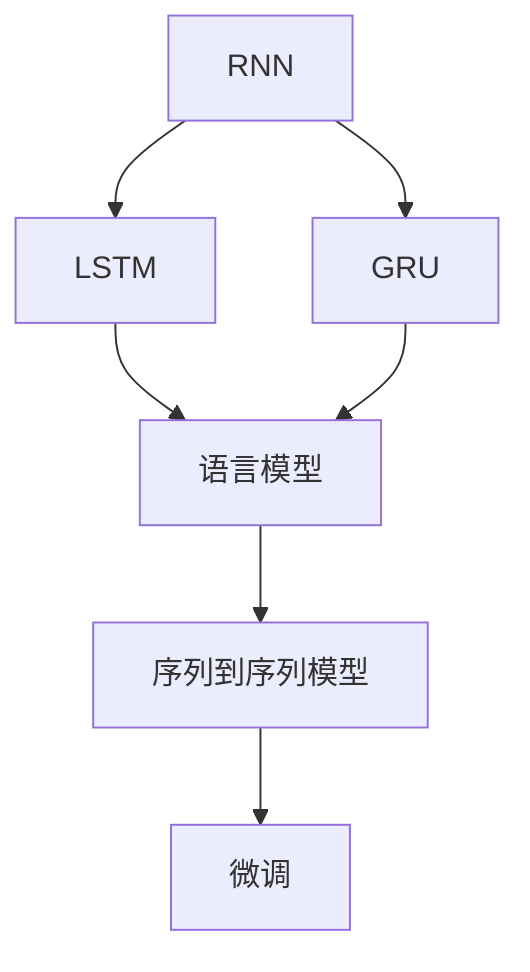

                 

# 从零开始大模型开发与微调：循环神经网络理论讲解

> 关键词：循环神经网络 (RNN), 长短时记忆网络 (LSTM), 门控循环单元 (GRU), 序列数据建模, 语言模型, 序列到序列模型, 微调 (Fine-tuning), 序列数据处理

## 1. 背景介绍

在过去的十年中，循环神经网络（RNN）及其变体如长短时记忆网络（LSTM）和门控循环单元（GRU）在自然语言处理（NLP）和语音识别等领域取得了显著的进步。这些模型通过捕捉序列数据的动态变化，成为处理序列数据（如文本、音频、时间序列等）的强大工具。然而，尽管它们在理论上和实践中都具有广泛的应用，但许多初学者仍然对它们的工作原理和构建过程感到困惑。

本文旨在通过深入分析RNN的核心概念，介绍如何使用Python和TensorFlow构建和微调循环神经网络，并讨论其应用场景和未来发展趋势。本文将从基本的循环神经网络原理开始，逐步深入到更复杂的LSTM和GRU，最后介绍如何在实际项目中进行微调。

## 2. 核心概念与联系

### 2.1 核心概念概述

为了更好地理解循环神经网络，我们将介绍一些关键概念及其相互联系：

- **循环神经网络（RNN）**：一种适用于处理序列数据的神经网络结构，能够捕捉时间上的依赖关系。
- **长短时记忆网络（LSTM）**：一种特殊的RNN变体，通过引入三个门控单元来控制信息流，解决了传统RNN在长序列上的梯度消失问题。
- **门控循环单元（GRU）**：另一种改进的RNN变体，与LSTM类似，通过门控机制控制信息的流动，但结构更简单。
- **序列数据建模**：使用神经网络对时间序列数据进行建模，如图像描述、文本生成、语音识别等。
- **语言模型**：一种用于预测文本序列的模型，目标是对给定上下文预测下一个单词的概率。
- **序列到序列模型**：一种将输入序列映射到输出序列的模型，常用于机器翻译、摘要生成等任务。
- **微调（Fine-tuning）**：在预训练模型的基础上，使用特定任务的数据集进行有监督学习，以适应特定任务。

这些概念之间的逻辑关系可以通过以下Mermaid流程图来展示：



这个流程图展示了一个从基本的RNN开始，逐步扩展到更复杂的网络结构，最终应用于微调任务的过程。

## 3. 核心算法原理 & 具体操作步骤

### 3.1 算法原理概述

循环神经网络的核心思想是通过引入循环结构，使得信息可以在网络中传递，从而捕捉序列数据的时间依赖性。RNN网络通过在每个时间步更新隐藏状态来处理序列数据。这些隐藏状态包含了之前时间步的信息，因此RNN具有记忆过去信息的能力。

在每个时间步，RNN通过将前一个时间步的隐藏状态 $h_{t-1}$ 和当前输入 $x_t$ 输入到神经网络中，得到当前时间步的输出 $y_t$ 和新的隐藏状态 $h_t$。这一过程可以表示为：

$$
h_t = f(W_{hh}h_{t-1} + W_{xh}x_t + b_h)
$$

$$
y_t = g(W_{hy}h_t + b_y)
$$

其中，$f$ 和 $g$ 是非线性激活函数，$W_{hh}$、$W_{xh}$ 和 $W_{hy}$ 是可训练的权重矩阵，$b_h$ 和 $b_y$ 是偏置向量。

### 3.2 算法步骤详解

构建循环神经网络的过程可以分为以下几个关键步骤：

1. **定义网络结构**：
   - 确定网络的基本架构，如单层还是多层，是否使用LSTM或GRU。
   - 定义激活函数、损失函数、优化器等。

2. **准备数据**：
   - 将序列数据按照时间顺序排列，并将其划分为输入和输出。
   - 对输入数据进行归一化或标准化处理。

3. **构建模型**：
   - 使用TensorFlow等框架定义网络结构。
   - 添加循环层，如RNN、LSTM或GRU。
   - 定义网络的目标函数，如交叉熵损失函数。

4. **训练模型**：
   - 使用训练数据对模型进行前向传播和反向传播，更新权重和偏置。
   - 使用验证集评估模型性能，调整超参数。
   - 使用测试集进行最终评估。

5. **微调模型**：
   - 在特定任务的数据集上，使用微调技术对模型进行进一步优化。
   - 调整学习率、添加正则化、使用数据增强等。

### 3.3 算法优缺点

循环神经网络具有以下优点：

- 能够处理序列数据，捕捉时间依赖性。
- 对于长序列，LSTM和GRU可以有效地解决梯度消失问题。

然而，它们也有一些缺点：

- 训练复杂，存在梯度消失和梯度爆炸的问题。
- 计算开销较大，特别是对于长序列。

### 3.4 算法应用领域

循环神经网络在以下几个领域中具有广泛的应用：

- **语音识别**：将音频序列转换为文本，如自动字幕生成。
- **自然语言处理**：处理文本序列的任务，如机器翻译、文本生成、文本分类等。
- **时间序列分析**：预测未来时间点的数值，如股票价格预测、天气预报等。

## 4. 数学模型和公式 & 详细讲解 & 举例说明

### 4.1 数学模型构建

循环神经网络的核心数学模型可以表示为：

$$
h_t = f(W_{hh}h_{t-1} + W_{xh}x_t + b_h)
$$

$$
y_t = g(W_{hy}h_t + b_y)
$$

其中，$h_t$ 是隐藏状态，$x_t$ 是输入，$y_t$ 是输出。$f$ 和 $g$ 是激活函数，$W_{hh}$、$W_{xh}$ 和 $W_{hy}$ 是权重矩阵，$b_h$ 和 $b_y$ 是偏置向量。

### 4.2 公式推导过程

以LSTM为例，LSTM引入了三个门控单元：遗忘门（$g_t^f$）、输入门（$g_t^i$）和输出门（$g_t^o$），用于控制信息的流动。LSTM的隐藏状态更新公式如下：

$$
f_t = \sigma(W_fh_{t-1} + W_fx_t + b_f)
$$

$$
i_t = \sigma(W_ih_{t-1} + W_ix_t + b_i)
$$

$$
o_t = \sigma(W_oh_{t-1} + W_ox_t + b_o)
$$

$$
g_t = \tanh(W_ch_{t-1} + W_cx_t + b_c)
$$

$$
h_t = f_t \odot h_{t-1} + i_t \odot g_t
$$

其中，$\sigma$ 是Sigmoid函数，$\tanh$ 是双曲正切函数，$\odot$ 表示逐元素相乘。

### 4.3 案例分析与讲解

假设我们要使用LSTM模型对一句话进行情感分析。数据集包含10000条句子，每个句子被标记为正面或负面情感。首先，我们需要将句子转换为数字序列，将正面情感标记为1，负面情感标记为0。然后，我们将这些序列作为输入，使用LSTM模型进行训练。训练完成后，我们可以使用该模型对新句子进行情感预测。

以下是一个简单的LSTM模型实现，用于情感分析：

```python
import tensorflow as tf
from tensorflow.keras.layers import LSTM, Dense
from tensorflow.keras.models import Sequential

# 定义模型结构
model = Sequential()
model.add(LSTM(128, input_shape=(None, 1), return_sequences=True))
model.add(Dense(1, activation='sigmoid'))

# 编译模型
model.compile(optimizer='adam', loss='binary_crossentropy', metrics=['accuracy'])

# 训练模型
model.fit(X_train, y_train, epochs=10, batch_size=64, validation_data=(X_val, y_val))
```

在这个例子中，我们首先定义了一个包含一个LSTM层和一个全连接层的模型。我们使用`input_shape`参数指定输入数据的形状，`return_sequences=True`参数表示需要返回序列输出。最后，我们使用`compile`方法指定优化器和损失函数，并使用`fit`方法进行训练。

## 5. 项目实践：代码实例和详细解释说明

### 5.1 开发环境搭建

要在Python中使用TensorFlow构建循环神经网络，我们需要安装TensorFlow和相关依赖。可以使用以下命令进行安装：

```
pip install tensorflow
```

### 5.2 源代码详细实现

以下是使用LSTM模型对IMDB影评数据集进行情感分析的代码实现：

```python
import tensorflow as tf
from tensorflow.keras.datasets import imdb
from tensorflow.keras.preprocessing import sequence

# 加载IMDB数据集
(x_train, y_train), (x_test, y_test) = imdb.load_data(num_words=10000)

# 将序列填充到相同长度
max_review_length = 500
x_train = sequence.pad_sequences(x_train, maxlen=max_review_length)
x_test = sequence.pad_sequences(x_test, maxlen=max_review_length)

# 定义模型结构
model = Sequential()
model.add(LSTM(128, input_shape=(max_review_length, 1)))
model.add(Dense(1, activation='sigmoid'))

# 编译模型
model.compile(optimizer='adam', loss='binary_crossentropy', metrics=['accuracy'])

# 训练模型
model.fit(x_train, y_train, epochs=10, batch_size=64, validation_data=(x_test, y_test))
```

在这个例子中，我们首先使用`imdb.load_data`方法加载IMDB影评数据集，并使用`pad_sequences`方法将序列填充到相同的长度。然后，我们定义了一个包含一个LSTM层和一个全连接层的模型，使用`compile`方法指定优化器和损失函数，并使用`fit`方法进行训练。

### 5.3 代码解读与分析

- **数据预处理**：使用`pad_sequences`方法将序列填充到相同的长度，以便于输入模型。
- **模型定义**：使用`Sequential`类定义模型结构，包含一个LSTM层和一个全连接层。
- **模型编译**：使用`compile`方法指定优化器和损失函数，并设置评价指标。
- **模型训练**：使用`fit`方法进行模型训练，并使用`validation_data`参数指定验证集。

## 6. 实际应用场景

### 6.1 语音识别

循环神经网络在语音识别中具有广泛应用。语音信号可以看作是一系列的声学特征，这些特征可以被输入到循环神经网络中进行建模，以识别文本。

### 6.2 自然语言处理

循环神经网络在NLP任务中表现出色，如文本分类、情感分析、机器翻译等。通过使用LSTM或GRU，模型可以捕捉文本序列中的上下文信息，提高任务的性能。

### 6.3 时间序列分析

循环神经网络在时间序列预测中也具有重要应用，如股票价格预测、天气预测等。通过捕捉时间上的依赖关系，LSTM和GRU可以预测未来时间点的数值。

## 7. 工具和资源推荐

### 7.1 学习资源推荐

- **《Python深度学习》**：这本书详细介绍了深度学习的基础知识和实践技巧，包括循环神经网络。
- **Coursera《Sequence Models》课程**：由斯坦福大学提供的课程，深入讲解了序列模型，包括循环神经网络。
- **arXiv论文**：在arXiv上查找相关论文，学习最新的研究成果。

### 7.2 开发工具推荐

- **TensorFlow**：谷歌开发的深度学习框架，支持RNN和LSTM等网络结构。
- **PyTorch**：Facebook开发的深度学习框架，也支持循环神经网络。
- **Keras**：一个高级神经网络API，简化模型构建过程。

### 7.3 相关论文推荐

- **LSTM论文**：由Hochreiter和Schmidhuber提出的LSTM论文，详细介绍了LSTM的设计和性能。
- **GRU论文**：由Cho等人提出的GRU论文，介绍了GRU的设计和性能。
- **循环神经网络综述**：一篇综述性论文，介绍了循环神经网络的各种变体和应用。

## 8. 总结：未来发展趋势与挑战

### 8.1 研究成果总结

循环神经网络在自然语言处理和语音识别等领域已经取得了显著的进展。LSTM和GRU等变体解决了传统RNN的梯度消失问题，提高了模型的性能。

### 8.2 未来发展趋势

未来，循环神经网络将朝着更加复杂和高效的方向发展。研究人员将探索更多的门控机制，改进LSTM和GRU的结构，以提高模型的性能。

### 8.3 面临的挑战

循环神经网络在处理长序列时仍然存在梯度消失和梯度爆炸的问题。此外，训练复杂，计算开销较大。

### 8.4 研究展望

未来的研究将集中在以下几个方面：

- **更高效的模型结构**：探索更加高效和简单的模型结构，以提高训练速度和计算效率。
- **更好的梯度优化方法**：改进梯度优化算法，解决梯度消失和梯度爆炸的问题。
- **多任务学习**：在单个模型中进行多任务学习，以提高模型的泛化能力。

## 9. 附录：常见问题与解答

**Q1：循环神经网络为什么会有梯度消失问题？**

A: 在长序列训练中，传统的RNN网络存在梯度消失的问题。这是由于每个时间步的梯度需要乘以前面的梯度，而在梯度传播到早期时间步时，梯度变得非常小，甚至消失。

**Q2：LSTM和GRU是如何解决梯度消失问题的？**

A: LSTM和GRU通过引入门控机制来控制信息的流动，从而解决了梯度消失的问题。遗忘门、输入门和输出门可以分别控制信息的保留、输入和输出，使得梯度能够更有效地传播。

**Q3：循环神经网络的计算复杂度如何？**

A: 循环神经网络的计算复杂度主要取决于序列长度和模型参数。对于长序列，计算复杂度较高。使用LSTM和GRU等门控网络结构，可以有效地减少计算复杂度。

**Q4：循环神经网络在实际应用中有什么挑战？**

A: 循环神经网络在处理长序列时仍然存在梯度消失和梯度爆炸的问题。此外，训练复杂，计算开销较大。需要改进梯度优化算法，探索更高效的模型结构。

**Q5：循环神经网络在自然语言处理中有哪些应用？**

A: 循环神经网络在自然语言处理中具有广泛的应用，如文本分类、情感分析、机器翻译、文本生成等。通过捕捉时间依赖性，LSTM和GRU等变体可以提高任务的性能。

---

作者：禅与计算机程序设计艺术 / Zen and the Art of Computer Programming

