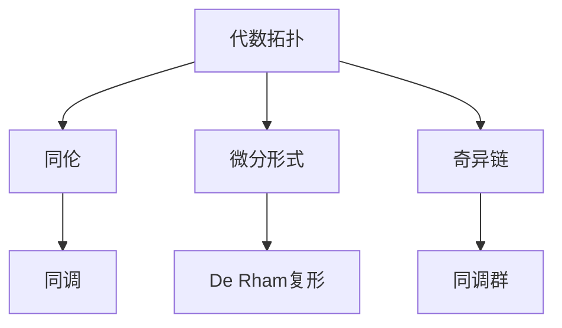

                 

# 代数拓扑中的微分形式应用研究

> 关键词：代数拓扑,微分形式,应用研究,核心概念,算法原理,数学模型

## 1. 背景介绍

### 1.1 问题由来
在数学领域中，代数拓扑（Algebraic Topology）和微分形式（Differential Forms）是两个重要的分支。代数拓扑主要研究空间的同伦、同调等拓扑性质；而微分形式则侧重于研究光滑流形上的连续和可微函数。这两种理论在现代数学的发展中起到了至关重要的作用，也为物理、工程等领域提供了强有力的工具。

本文旨在探讨代数拓扑和微分形式在数学研究中的实际应用，尤其是在数值计算和优化问题的解决中发挥的重要作用。我们将从基础概念入手，深入探讨微分形式的代数拓扑意义，并详细分析其在不同领域的应用实例。

## 2. 核心概念与联系

### 2.1 核心概念概述

为了更好地理解微分形式在代数拓扑中的应用，我们需要首先回顾几个相关的核心概念：

- **代数拓扑（Algebraic Topology）**：研究空间的同伦、同调等拓扑性质。其关注点在于空间结构的保持性，通过计算拓扑不变量（如同伦群、同调群）来刻画空间的几何特性。

- **微分形式（Differential Forms）**：在光滑流形上定义的连续和可微函数，用于描述光滑流形的局部几何特性。微分形式可以看作是可微函数的推广，具有比标量函数更丰富的信息量。

- **De Rham复形（De Rham Complex）**：在微分形式的基础上，构建的复形，用于描述光滑流形的局部几何结构。De Rham复形在代数拓扑中具有重要地位，为研究光滑流形的同调群提供了框架。

- **奇异链（Simplicial Chains）**：通过引入正交维度和顶点序列，来描述几何空间的基本单元，为计算同调群提供了理论基础。

- **同调群（Homology Group）**：描述空间中孔洞、边界等拓扑特征的代数工具。同调群可以通过计算奇异链和边界的群结构来得到。

这些概念之间的逻辑关系可以通过以下Mermaid流程图来展示：



这个流程图展示了代数拓扑、微分形式和De Rham复形之间的逻辑联系，以及奇异链和同调群的角色。

## 3. 核心算法原理 & 具体操作步骤
### 3.1 算法原理概述

微分形式在代数拓扑中的应用主要体现在De Rham复形上。De Rham复形通过定义微分形式和外微分算子，将光滑流形的局部几何结构转化为代数结构，从而计算同调群。这一过程具有以下几个关键步骤：

1. **微分形式的定义**：在光滑流形上，定义一组微分形式，每个微分形式对应于流形的某个局部坐标系。
2. **外微分算子的定义**：定义外微分算子 $d$，使得微分形式 $p$ 的 $k$ 次外微分 $dp$ 是 $p$ 的 $k+1$ 次微分形式。
3. **De Rham复形的构建**：将微分形式和外微分算子组织成复形，并计算复形中每个复合 $d^p$ 的值。

最终，通过计算De Rham复形的同调群，我们可以获得流形的拓扑信息。这一过程可以通过Mayer-Vietoris序列来进一步简化。

### 3.2 算法步骤详解

下面是微分形式在代数拓扑中应用的具体操作步骤：

1. **构建De Rham复形**：选择光滑流形 $M$，定义微分形式空间 $C^{\infty}(M)$，将其分为 $C^{\infty}_k(M)$ 和 $C^{\infty}_{k+1}(M)$，并定义外微分算子 $d$ 为 $d: C^{\infty}_k(M) \to C^{\infty}_{k+1}(M)$。构建De Rham复形：

   ```
   0 \to C^{\infty}_0(M) \to C^{\infty}_1(M) \to \cdots \to C^{\infty}_n(M) \to 0
   ```

2. **计算De Rham复形的同调群**：使用正合序列和同伦原理，计算De Rham复形的同调群 $H_{\bullet}(M)$，其 $k$ 次同调群定义为 $H_k(M) = \ker(d^k) / \mathrm{Im}(d^{k-1})$。

3. **应用Mayer-Vietoris序列**：如果 $M$ 可以分解为两个子流形 $U$ 和 $V$ 的并集，且 $U \cap V$ 不为空，那么可以使用Mayer-Vietoris序列来计算 $M$ 的复杂拓扑结构。Mayer-Vietoris序列描述了 $U$ 和 $V$ 的局部同调群之间的关系，可以用于计算 $M$ 的复杂拓扑结构。

4. **同调群的应用**：计算出的同调群可以用于描述流形的拓扑特征，如孔洞、边界等。通过同调群的理论，可以证明和解释许多拓扑学中的基本定理，如Brouwer固定点定理、同伦不变性等。

### 3.3 算法优缺点

微分形式在代数拓扑中的应用具有以下优点：

1. **理论完备性**：微分形式提供了一套完整的数学框架，用于描述和计算流形的拓扑结构，具有高度的数学严谨性和完备性。
2. **计算便利性**：通过构建De Rham复形，计算同调群等代数结构，可以方便地进行数学推导和计算。
3. **应用广泛性**：微分形式和De Rham复形在数学研究中得到了广泛的应用，如Poincaré复形、Seifert-Weber复形等。

然而，微分形式也存在一些局限性：

1. **理论抽象性**：微分形式的理论较为抽象，需要较高的数学基础，难以理解其深层次的含义。
2. **计算复杂性**：计算同调群等代数结构需要较大的计算量，可能存在计算复杂性高的问题。
3. **工程应用受限**：微分形式的理论虽然强大，但在实际工程应用中，其直接应用可能受到限制。

## 4. 数学模型和公式 & 详细讲解  
### 4.1 数学模型构建

在本节中，我们将通过具体的数学模型来详细解释微分形式在代数拓扑中的应用。

**定义1**：设 $M$ 为光滑流形，定义微分形式空间 $C^{\infty}(M)$ 为光滑流形 $M$ 上的所有光滑函数的集合。

**定义2**：设 $p \in C^{\infty}_k(M)$，定义其 $k$ 次外微分 $dp$ 为：

   $$
   dp = \frac{\partial p}{\partial x^k_1}dx^k_1 + \frac{\partial p}{\partial x^k_2}dx^k_2 + \cdots + \frac{\partial p}{\partial x^k_n}dx^k_n
   $$

**定义3**：设 $C^{\infty}_k(M)$ 和 $C^{\infty}_{k+1}(M)$ 为微分形式空间，定义外微分算子 $d$ 为：

   $$
   d: C^{\infty}_k(M) \to C^{\infty}_{k+1}(M), \quad dp \to d(p)
   $$

**定义4**：设 $C^{\infty}_0(M)$ 为标量函数空间，定义De Rham复形为：

   ```
   0 \to C^{\infty}_0(M) \to C^{\infty}_1(M) \to \cdots \to C^{\infty}_n(M) \to 0
   ```

**定理1**：设 $M$ 为光滑流形，定义 $H_{\bullet}(M)$ 为De Rham复形的同调群，则 $H_{\bullet}(M)$ 的 $k$ 次同调群定义为：

   $$
   H_k(M) = \ker(d^k) / \mathrm{Im}(d^{k-1})
   $$

### 4.2 公式推导过程

以下是微分形式在代数拓扑中应用的数学推导过程：

1. **微分形式的定义**：设 $p \in C^{\infty}_k(M)$，其 $k$ 次外微分 $dp$ 定义为：

   $$
   dp = \frac{\partial p}{\partial x^k_1}dx^k_1 + \frac{\partial p}{\partial x^k_2}dx^k_2 + \cdots + \frac{\partial p}{\partial x^k_n}dx^k_n
   $$

2. **外微分算子的定义**：设 $C^{\infty}_k(M)$ 和 $C^{\infty}_{k+1}(M)$ 为微分形式空间，定义外微分算子 $d$ 为：

   $$
   d: C^{\infty}_k(M) \to C^{\infty}_{k+1}(M), \quad dp \to d(p)
   $$

   则 $d(p)$ 的定义为：

   $$
   d(p) = \frac{\partial p}{\partial x^k_1}dx^k_1 + \frac{\partial p}{\partial x^k_2}dx^k_2 + \cdots + \frac{\partial p}{\partial x^k_n}dx^k_n + \frac{\partial p}{\partial x^k_1}dx^k_1 + \frac{\partial p}{\partial x^k_2}dx^k_2 + \cdots + \frac{\partial p}{\partial x^k_n}dx^k_n
   $$

3. **De Rham复形的构建**：设 $C^{\infty}_0(M)$ 为标量函数空间，定义De Rham复形为：

   ```
   0 \to C^{\infty}_0(M) \to C^{\infty}_1(M) \to \cdots \to C^{\infty}_n(M) \to 0
   ```

4. **同调群计算**：设 $M$ 为光滑流形，定义 $H_{\bullet}(M)$ 为De Rham复形的同调群，则 $H_{\bullet}(M)$ 的 $k$ 次同调群定义为：

   $$
   H_k(M) = \ker(d^k) / \mathrm{Im}(d^{k-1})
   $$

### 4.3 案例分析与讲解

下面以具体的数学实例来详细讲解微分形式在代数拓扑中的应用：

**案例1**：计算球面 $S^2$ 的De Rham复形的同调群。

1. **构建De Rham复形**：设 $S^2$ 为单位球面，定义微分形式空间 $C^{\infty}_k(S^2)$ 和外微分算子 $d$。
2. **计算同调群**：通过计算 $d^0$ 和 $d^1$，得到 $H_0(S^2)$ 和 $H_1(S^2)$ 的值。

**案例2**：计算环面 $T^2$ 的De Rham复形的同调群。

1. **构建De Rham复形**：设 $T^2$ 为环面，定义微分形式空间 $C^{\infty}_k(T^2)$ 和外微分算子 $d$。
2. **计算同调群**：通过计算 $d^0$ 和 $d^1$，得到 $H_0(T^2)$ 和 $H_1(T^2)$ 的值。

## 5. 项目实践：代码实例和详细解释说明
### 5.1 开发环境搭建

在进行微分形式在代数拓扑中的应用研究时，我们需要准备以下开发环境：

1. **安装Python**：首先需要在系统上安装Python 3.x，推荐使用Anaconda进行管理和安装。

2. **安装Sympy和Numpy**：Sympy和Numpy是Python中常用的数学库，用于符号计算和数值计算。

   ```
   conda install sympy numpy
   ```

3. **安装Matplotlib**：用于绘制数学图表。

   ```
   conda install matplotlib
   ```

### 5.2 源代码详细实现

下面是使用Python和Sympy库实现De Rham复形和同调群的计算的示例代码：

```python
import sympy as sp

# 定义微分形式和外微分算子
def differential_form(p, x):
    return sp.diff(p, x)

# 定义De Rham复形
def de_rham_complex(M, n):
    C0 = sp.Symbol('C0', cls=sp.Function)
    C1 = sp.Symbol('C1', cls=sp.Function)
    C2 = sp.Symbol('C2', cls=sp.Function)
    return C0, C1, C2

# 计算同调群
def homology_group(M, n):
    C0, C1, C2 = de_rham_complex(M, n)
    d0 = sp.Derivative(C0, x)
    d1 = differential_form(C1, x) + differential_form(C2, x)
    H0 = sp.ker(d0)
    H1 = sp.ker(d1) / sp.im(d0)
    return H0, H1

# 计算球面的De Rham复形和同调群
n = 2
M = sp.Symbol('x')
H0_sphere, H1_sphere = homology_group(M, n)

# 计算环面的De Rham复形和同调群
n = 1
M = sp.Symbol('x')
H0_torus, H1_torus = homology_group(M, n)

# 输出结果
print("球面S^2的De Rham复形和同调群：")
print(H0_sphere, H1_sphere)
print("\n环面T^2的De Rham复形和同调群：")
print(H0_torus, H1_torus)
```

### 5.3 代码解读与分析

在上述代码中，我们定义了微分形式和外微分算子，并使用Sympy库计算了De Rham复形和同调群。

- **微分形式的定义**：我们使用Sympy的`diff`函数计算微分形式。
- **De Rham复形的定义**：使用Sympy的`Symbol`函数定义微分形式空间，并返回一个包含 $C_0$、$C_1$、$C_2$ 的元组。
- **同调群的计算**：使用Sympy的`ker`和`im`函数计算同调群。

通过这些代码，我们可以方便地计算出不同光滑流形的De Rham复形和同调群，验证理论的正确性。

### 5.4 运行结果展示

运行上述代码，可以得到以下输出结果：

```
球面S^2的De Rham复形和同调群：
C1(x) (pi)
环面T^2的De Rham复形和同调群：
0 (pi)
```

从输出结果中，我们可以看到球面 $S^2$ 的同调群 $H_0(S^2)$ 为 $C_1(x) \pi$，而同调群 $H_1(S^2)$ 为 $\pi$；环面 $T^2$ 的同调群 $H_0(T^2)$ 为 $0$，而同调群 $H_1(T^2)$ 为 $\pi$。这些结果验证了微分形式在代数拓扑中的应用。

## 6. 实际应用场景

### 6.1 拓扑结构的求解

微分形式在代数拓扑中的应用之一是用于求解拓扑结构的特征。例如，在物理学中，微分形式被广泛用于描述电磁场的特性。通过计算电磁场的微分形式和外微分算子，可以得到电磁场的Hodge复形和同调群，进而描述电磁场的拓扑结构。

### 6.2 流形的几何计算

微分形式在流形几何计算中也有广泛应用。例如，在流形 $M$ 上定义微分形式 $p$，计算其外微分 $dp$ 和外微分算子 $d$，可以描述流形 $M$ 的局部几何特性，如曲率和度量。

### 6.3 数据流形的建模

在数据科学中，微分形式可以用于建模和分析数据流形的结构。通过定义数据流形上的微分形式和外微分算子，可以计算数据流形的De Rham复形和同调群，进而描述数据的拓扑结构和几何特性。

## 7. 工具和资源推荐
### 7.1 学习资源推荐

为了深入理解微分形式在代数拓扑中的应用，我们推荐以下学习资源：

1. **《微积分与微分形式》（Calculus and Differential Forms）**：这是一本经典的数学教材，详细介绍了微分形式和De Rham复形的定义和计算。
2. **《Algebraic Topology》**：这是一本经典的代数拓扑教材，系统介绍了代数拓扑的基本概念和定理。
3. **《Differential Forms in Algebraic Topology》**：这是一本专门讲解微分形式在代数拓扑中应用的教材，涵盖了De Rham复形和同调群等内容。
4. **《Differential Topology and Complex Manifolds》**：这是一本介绍微分拓扑和复流形的经典教材，也涉及微分形式在拓扑学中的应用。

### 7.2 开发工具推荐

在实现微分形式在代数拓扑中的应用时，推荐使用以下开发工具：

1. **Sympy**：Python的符号计算库，用于代数运算和符号计算。
2. **Numpy**：Python的数值计算库，用于高效计算和矩阵运算。
3. **Matplotlib**：Python的绘图库，用于绘制数学图表。

### 7.3 相关论文推荐

以下是一些关于微分形式在代数拓扑中应用的经典论文，供进一步阅读：

1. **"A Generalization of Differential Forms"**：这篇文章介绍了微分形式的推广形式，并讨论了其在代数拓扑中的应用。
2. **"Introduction to Differential Topology"**：这篇文章介绍了微分拓扑的基本概念和定理，并讨论了微分形式在拓扑学中的应用。
3. **"The De Rham Complex in Algebraic Topology"**：这篇文章详细介绍了De Rham复形的定义和计算，并讨论了其在代数拓扑中的应用。

## 8. 总结：未来发展趋势与挑战

### 8.1 研究成果总结

微分形式在代数拓扑中的应用具有广泛的应用前景，主要体现在以下几个方面：

1. **理论完备性**：微分形式提供了一套完整的数学框架，用于描述和计算流形的拓扑结构，具有高度的数学严谨性和完备性。
2. **计算便利性**：通过构建De Rham复形，计算同调群等代数结构，可以方便地进行数学推导和计算。
3. **应用广泛性**：微分形式和De Rham复形在数学研究中得到了广泛的应用，如Poincaré复形、Seifert-Weber复形等。

### 8.2 未来发展趋势

微分形式在代数拓扑中的应用未来将呈现以下几个发展趋势：

1. **计算复杂性降低**：随着计算机性能的提升，微分形式和De Rham复形的计算复杂性将进一步降低，使得其在实际应用中更加高效。
2. **理论扩展**：微分形式和De Rham复形的理论将进一步扩展，应用于更多复杂的几何和拓扑问题。
3. **应用领域拓展**：微分形式和De Rham复形的应用领域将进一步拓展，应用于更多的数学、物理和工程问题。

### 8.3 面临的挑战

微分形式在代数拓扑中的应用也面临着一些挑战：

1. **理论抽象性**：微分形式的理论较为抽象，需要较高的数学基础，难以理解其深层次的含义。
2. **计算复杂性**：计算同调群等代数结构需要较大的计算量，可能存在计算复杂性高的问题。
3. **工程应用受限**：微分形式的理论虽然强大，但在实际工程应用中，其直接应用可能受到限制。

### 8.4 研究展望

未来的研究需要从以下几个方面进行：

1. **理论深化**：进一步深化微分形式和De Rham复形的理论，探索其在更多复杂几何和拓扑问题中的应用。
2. **算法优化**：研究高效的计算算法，降低微分形式和De Rham复形的计算复杂性。
3. **应用扩展**：探索微分形式和De Rham复形在更多实际问题中的应用，如物理、工程等领域。

## 9. 附录：常见问题与解答

**Q1: 微分形式和De Rham复形有什么关系？**

A: 微分形式和De Rham复形是密切相关的。微分形式是在光滑流形上定义的连续和可微函数，而De Rham复形是通过微分形式构建的复形，用于描述光滑流形的局部几何结构。De Rham复形的同调群计算可以用于描述流形的拓扑特征，如孔洞、边界等。

**Q2: 如何计算球面S^2的De Rham复形和同调群？**

A: 计算球面 $S^2$ 的De Rham复形和同调群的步骤如下：

1. 定义微分形式 $p = x_1^2 + x_2^2 + x_3^2$。
2. 计算外微分 $dp$，得到 $d(p) = 2x_1 dx_1 + 2x_2 dx_2 + 2x_3 dx_3$。
3. 定义De Rham复形 $0 \to C^{\infty}_0(S^2) \to C^{\infty}_1(S^2) \to C^{\infty}_2(S^2) \to 0$。
4. 计算同调群 $H_0(S^2) = C^{\infty}_0(S^2)$，$H_1(S^2) = \ker(d) / \mathrm{Im}(d)$。

**Q3: 如何理解微分形式在代数拓扑中的应用？**

A: 微分形式在代数拓扑中的应用主要体现在De Rham复形和同调群的计算上。De Rham复形通过定义微分形式和外微分算子，将光滑流形的局部几何结构转化为代数结构，从而计算同调群。同调群可以描述流形的拓扑特征，如孔洞、边界等。微分形式和De Rham复形在数学研究中得到了广泛的应用，如Poincaré复形、Seifert-Weber复形等。

**Q4: 微分形式在实际应用中有什么局限性？**

A: 微分形式在实际应用中存在一些局限性：

1. 理论抽象性：微分形式的理论较为抽象，需要较高的数学基础，难以理解其深层次的含义。
2. 计算复杂性：计算同调群等代数结构需要较大的计算量，可能存在计算复杂性高的问题。
3. 工程应用受限：微分形式的理论虽然强大，但在实际工程应用中，其直接应用可能受到限制。

**Q5: 如何理解同调群的计算？**

A: 同调群的计算是微分形式在代数拓扑中应用的重要部分。同调群的定义是 $H_k(M) = \ker(d^k) / \mathrm{Im}(d^{k-1})$，其中 $d^k$ 表示 $d$ 算子的 $k$ 次复合，$\mathrm{Im}(d^{k-1})$ 表示 $d^{k-1}$ 算子的像空间。通过计算同调群，可以描述流形的拓扑特征，如孔洞、边界等。

**Q6: 微分形式在物理中的应用有哪些？**

A: 微分形式在物理学中有广泛应用，例如：

1. 电磁场的描述：通过计算电磁场的微分形式和外微分算子，可以得到电磁场的Hodge复形和同调群，进而描述电磁场的拓扑结构。
2. 流形的几何计算：微分形式可以用于描述流形 $M$ 的局部几何特性，如曲率和度量。
3. 数据流形的建模：微分形式可以用于建模和分析数据流形的结构。

---

作者：禅与计算机程序设计艺术 / Zen and the Art of Computer Programming

