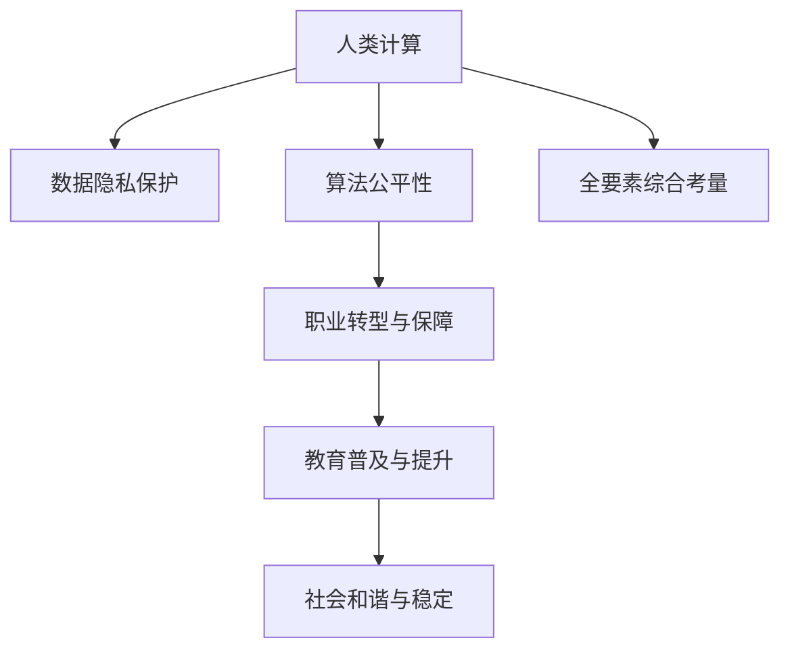

                 

## 1. 背景介绍

### 1.1 问题由来

随着计算机技术的飞速发展，科技日益成为人类社会进步的强大引擎。然而，在科技飞速发展的同时，我们开始更多地思考：如何让科技更好地服务于人类，而不是让人们成为技术的奴隶？

这一问题归根结底，其实是一个关于“以人为本”的问题。科技的未来发展，不仅需要技术创新，更需要从社会、伦理、人文等多个维度进行全面考量，将人类价值注入科技的每一寸土壤，才能真正实现科技与人类发展的和谐共生。

### 1.2 问题核心关键点

所谓“以人为本”，就是在科技设计、应用、发展的全过程中，始终将人的利益和幸福放在首位，避免科技发展过程中出现“人被工具化”“人被数据化”“人被边缘化”等异化现象。

- **数据隐私保护**：在数据采集、存储、分析过程中，如何保障用户的隐私权益，避免数据滥用。
- **算法的公平性**：在机器学习、人工智能等算法模型中，如何消除偏见、歧视，确保算法的公平性和透明性。
- **工作保障与转型**：在自动化、智能化普及过程中，如何减少工作岗位的消失，提高人们的就业质量，同时帮助人们顺利实现职业转型。
- **教育普及与提升**：如何普及人工智能等先进技术知识，提升人们的科技素养，增强其适应未来的能力。
- **社会和谐与稳定**：如何在科技发展中处理好政府、企业、公众等各方利益，促进社会稳定和谐。

这些关键点构成了“以人为本”科技发展的核心方向。无论技术如何创新发展，始终要回归到“人”这一本原，确保技术服务于人类的根本宗旨。

## 2. 核心概念与联系

### 2.1 核心概念概述

为更好地理解“以人为本”的科技未来，本节将介绍几个密切相关的核心概念：

- **人类计算(Human-Centric Computation)**：一种以人为主导的计算范式，强调在技术设计、应用中融入人的思维、行为、情感、价值观等综合因素，从而提升系统的可理解性、可用性、可控性。

- **数据隐私保护(Privacy Preservation)**：保护个人数据不受未经授权的收集、使用、共享，避免隐私泄露带来的风险和损害。

- **算法公平性(Algorithm Fairness)**：在机器学习等算法设计中，避免算法歧视和偏见，确保算法输出结果对所有人群的公正性。

- **职业转型与保障(Job Transition & Safeguards)**：在技术进步带来职业变化时，通过教育和政策手段，保障劳动力市场平稳过渡，提供转型支持。

- **教育普及与提升(Education Empowerment & Enhancement)**：利用技术手段普及教育，提升全民科技素养，适应未来社会需求。

- **社会和谐与稳定(Social Harmony & Stability)**：通过合理政策和技术手段，调节社会资源分配，缓解技术发展带来的社会冲突，维护社会和谐稳定。

这些概念之间的逻辑关系可以通过以下Mermaid流程图来展示：



这个流程图展示了几大核心概念及其之间的关系：

1. 人类计算是根本，强调在技术设计和应用中融入人的全面因素。
2. 数据隐私保护、算法公平性、职业转型与保障、教育普及与提升、社会和谐与稳定，都是围绕“人类计算”展开的具体实践方向。
3. 全要素综合考量，则是对这些实践方向的全面考量和协调，确保科技发展的方向始终服务于人的福祉。

## 3. 核心算法原理 & 具体操作步骤
### 3.1 算法原理概述

基于“以人为本”的科技未来，人类计算范式强调在技术设计和应用中融入人的思维、行为、情感、价值观等综合因素，从而提升系统的可理解性、可用性、可控性。

核心算法原理主要包括以下几个方面：

- **用户参与式设计(User-Centric Design)**：在技术开发和应用中，通过用户调研、参与测试等方式，获取用户需求和反馈，指导算法设计，确保技术的实用性和易用性。
- **情境感知与情境计算(Context-Awareness & Contextual Computation)**：在应用中考虑上下文信息和用户当前情境，实现情境智能、智能推荐、个性化服务等功能，提升用户满意度和体验。
- **情感计算(Affective Computing)**：通过分析用户情感变化，实现情感识别、情感响应、情感驱动等功能，增强人机交互的亲和力和智能性。
- **伦理算法(Ethical Algorithms)**：在算法设计和应用中，融入伦理考量，避免算法歧视和偏见，确保算法输出结果对所有人群的公正性。

### 3.2 算法步骤详解

基于“以人为本”的科技未来，人类计算的算法步骤主要包括以下几个关键环节：

**Step 1: 数据收集与预处理**
- 根据具体应用场景，通过问卷、传感器、日志等方式，收集用户行为、生理、情感、环境等数据。
- 对数据进行清洗、归一化、去噪等预处理，确保数据质量和一致性。

**Step 2: 模型设计与训练**
- 在模型设计阶段，结合用户调研、需求分析等，设计符合用户需求和场景的算法模型。
- 使用标注数据对模型进行训练，优化模型参数，确保模型性能和泛化能力。

**Step 3: 用户参与与反馈**
- 在模型上线后，提供用户界面或接口，允许用户参与使用、调试、优化模型。
- 收集用户反馈，定期更新模型参数，优化算法性能，确保模型始终符合用户需求。

**Step 4: 伦理审查与合规检查**
- 在模型设计和应用过程中，定期进行伦理审查，确保算法决策符合伦理要求，避免歧视和偏见。
- 遵守相关法律法规，进行隐私保护和合规检查，确保数据使用和算法应用符合法律规范。

**Step 5: 效果评估与优化**
- 在模型应用过程中，通过用户满意度调查、系统性能评估等方式，定期评估算法效果。
- 根据评估结果，进行模型优化和迭代改进，提升算法性能和用户体验。

### 3.3 算法优缺点

基于“以人为本”的科技未来，人类计算范式的算法具有以下优点：

- **可理解性强**：算法设计充分考虑人的思维和行为，使技术系统更易于理解和使用，减少用户学习成本。
- **用户体验提升**：通过情境感知和情感计算等技术，实现个性化服务和智能推荐，提升用户满意度。
- **公平性保障**：算法设计注重公平性和透明性，避免歧视和偏见，确保算法的公正性。

同时，该算法也存在一些局限性：

- **复杂度高**：考虑到人的多维度因素，算法设计和实现较为复杂，需要更多的资源和时间。
- **数据需求大**：充分理解人的需求和情境，需要大量高质量的数据，数据收集和预处理工作量大。
- **伦理问题复杂**：算法设计和应用中涉及伦理问题复杂，需要不断进行伦理审查和合规检查，确保符合伦理要求。

尽管存在这些局限性，但基于人类计算范式的算法设计，无疑为未来科技的发展提供了更加人性化的方向。

### 3.4 算法应用领域

基于人类计算范式的算法，已经在多个领域得到了广泛应用，包括但不限于：

- **智能家居与生活助手**：结合情境感知和情感计算，实现家居智能化、生活辅助等功能，提升生活质量。
- **智能医疗与健康管理**：通过分析用户健康数据和情感变化，提供个性化健康建议和心理辅导，改善用户体验。
- **智能教育与在线学习**：利用算法推荐和情感识别，实现个性化学习路径和智能辅导，提升学习效果。
- **智能交通与城市管理**：结合情境感知和情感计算，实现交通拥堵预测、城市应急响应等功能，提升城市管理效率。
- **智能客服与虚拟助手**：结合情境感知和情感计算，实现智能客服、虚拟助手等功能，提升用户体验。

这些应用领域展示了人类计算范式的强大潜力和广泛适用性，为未来的科技发展提供了新的方向。

## 4. 数学模型和公式 & 详细讲解  
### 4.1 数学模型构建

在基于“以人为本”的科技未来的算法设计中，我们特别强调情境感知和情感计算等技术的应用。这里以情感计算为例，介绍一些关键数学模型和公式。

假设我们希望训练一个情感识别模型，用于识别用户对某一事件的情感倾向。模型输入为文本描述 $x$，输出为情感标签 $y$。我们定义一个简单的情感分类器 $f(x; \theta)$，其中 $\theta$ 为模型参数。情感识别任务可以形式化表示为如下最小化问题：

$$
\min_{\theta} \mathbb{E}_{(x,y) \sim D} \ell(f(x; \theta), y)
$$

其中 $\ell$ 为损失函数，$D$ 为训练数据集。

在情感识别中，常见的损失函数包括交叉熵损失、均方误差损失等。例如，对于二分类问题，交叉熵损失函数可以表示为：

$$
\ell(f(x; \theta), y) = -y \log f(x; \theta) - (1-y) \log (1 - f(x; \theta))
$$

**公式推导过程**

接下来，我们以二分类问题为例，详细推导交叉熵损失函数的数学模型。

假设模型 $f(x; \theta)$ 的输出概率为 $f(x; \theta) = \sigma(\langle \theta, x \rangle)$，其中 $\sigma$ 为激活函数。对于二分类问题，模型输出 $f(x; \theta)$ 表示用户对事件的正向情感倾向。则交叉熵损失函数可以表示为：

$$
\ell(f(x; \theta), y) = -y \log f(x; \theta) - (1-y) \log (1 - f(x; \theta))
$$

将其展开，得：

$$
\ell(f(x; \theta), y) = -y \log \sigma(\langle \theta, x \rangle) - (1-y) \log (1 - \sigma(\langle \theta, x \rangle))
$$

进一步推导，得：

$$
\ell(f(x; \theta), y) = -y \log \sigma(\langle \theta, x \rangle) + (1-y) \log (1 - \sigma(\langle \theta, x \rangle))
$$

通过反向传播算法，我们可以计算出模型参数 $\theta$ 的梯度：

$$
\frac{\partial \ell(f(x; \theta), y)}{\partial \theta} = \left[ -y f(x; \theta) + (1-y)(1 - f(x; \theta)) \right] \frac{\partial f(x; \theta)}{\partial \theta}
$$

其中 $\frac{\partial f(x; \theta)}{\partial \theta}$ 为模型对输入 $x$ 的导数，可以通过链式法则递归计算得到。

通过上述推导，我们得到了情感识别任务的交叉熵损失函数及其梯度计算公式。在实际应用中，这一公式可以帮助我们训练出一个高效的情感识别模型。

### 4.3 案例分析与讲解

假设我们有一组用户对某一事件的情感标注数据，每个数据由用户描述 $x$ 和情感标签 $y$ 构成。我们的目标是通过训练一个情感识别模型，预测用户对事件的正向情感倾向。

在模型设计阶段，我们可以使用BERT等预训练模型，并对其输出层进行微调，以适应二分类任务。具体步骤如下：

**Step 1: 数据预处理**
- 对用户描述 $x$ 进行分词、向量化处理，得到输入特征 $x'$。
- 将情感标签 $y$ 转换为二元向量，例如 $y=1$ 表示正向情感，$y=0$ 表示中性或负向情感。

**Step 2: 模型训练**
- 使用预训练的BERT模型作为特征提取器，对用户描述 $x'$ 进行编码，得到语义表示 $h$。
- 在模型输出层添加一个线性分类器 $z = W h + b$，其中 $W$ 和 $b$ 为模型参数。
- 使用交叉熵损失函数 $\ell(z, y)$ 进行模型训练，优化模型参数 $W$ 和 $b$。

**Step 3: 模型评估与优化**
- 在验证集上评估模型性能，计算准确率、召回率、F1分数等指标。
- 根据评估结果，调整模型参数，优化模型性能。

**Step 4: 情感识别**
- 在测试集上使用训练好的模型对用户描述 $x$ 进行情感识别，得到情感倾向预测 $y'$。
- 根据预测结果，提供相应的情感反馈和建议。

在实际应用中，情感识别模型可以帮助企业进行市场情感分析、舆情监测、客户满意度调查等任务，提升用户体验和品牌形象。

## 5. 项目实践：代码实例和详细解释说明
### 5.1 开发环境搭建

在进行基于“以人为本”的科技未来的项目实践时，我们需要准备好开发环境。以下是使用Python进行PyTorch开发的环境配置流程：

1. 安装Anaconda：从官网下载并安装Anaconda，用于创建独立的Python环境。

2. 创建并激活虚拟环境：
```bash
conda create -n human-centric-env python=3.8 
conda activate human-centric-env
```

3. 安装PyTorch：根据CUDA版本，从官网获取对应的安装命令。例如：
```bash
conda install pytorch torchvision torchaudio cudatoolkit=11.1 -c pytorch -c conda-forge
```

4. 安装TensorBoard：
```bash
pip install tensorboard
```

5. 安装Numpy、Pandas等辅助库：
```bash
pip install numpy pandas scikit-learn matplotlib tqdm jupyter notebook ipython
```

完成上述步骤后，即可在`human-centric-env`环境中开始实践。

### 5.2 源代码详细实现

这里我们以情感识别任务为例，给出使用Transformers库对BERT模型进行情感识别的PyTorch代码实现。

首先，定义情感识别任务的数据处理函数：

```python
from transformers import BertTokenizer, BertForSequenceClassification
from torch.utils.data import Dataset
import torch

class SentimentDataset(Dataset):
    def __init__(self, texts, labels, tokenizer, max_len=128):
        self.texts = texts
        self.labels = labels
        self.tokenizer = tokenizer
        self.max_len = max_len
        
    def __len__(self):
        return len(self.texts)
    
    def __getitem__(self, item):
        text = self.texts[item]
        label = self.labels[item]
        
        encoding = self.tokenizer(text, return_tensors='pt', max_length=self.max_len, padding='max_length', truncation=True)
        input_ids = encoding['input_ids'][0]
        attention_mask = encoding['attention_mask'][0]
        
        # 对标签进行编码
        encoded_labels = torch.tensor(label, dtype=torch.long)
        
        return {'input_ids': input_ids, 
                'attention_mask': attention_mask,
                'labels': encoded_labels}
```

然后，定义模型和优化器：

```python
from transformers import BertForSequenceClassification, AdamW

model = BertForSequenceClassification.from_pretrained('bert-base-cased', num_labels=2)

optimizer = AdamW(model.parameters(), lr=2e-5)
```

接着，定义训练和评估函数：

```python
from torch.utils.data import DataLoader
from tqdm import tqdm
from sklearn.metrics import accuracy_score, precision_recall_fscore_support

device = torch.device('cuda') if torch.cuda.is_available() else torch.device('cpu')
model.to(device)

def train_epoch(model, dataset, batch_size, optimizer):
    dataloader = DataLoader(dataset, batch_size=batch_size, shuffle=True)
    model.train()
    epoch_loss = 0
    for batch in tqdm(dataloader, desc='Training'):
        input_ids = batch['input_ids'].to(device)
        attention_mask = batch['attention_mask'].to(device)
        labels = batch['labels'].to(device)
        model.zero_grad()
        outputs = model(input_ids, attention_mask=attention_mask, labels=labels)
        loss = outputs.loss
        epoch_loss += loss.item()
        loss.backward()
        optimizer.step()
    return epoch_loss / len(dataloader)

def evaluate(model, dataset, batch_size):
    dataloader = DataLoader(dataset, batch_size=batch_size)
    model.eval()
    preds, labels = [], []
    with torch.no_grad():
        for batch in tqdm(dataloader, desc='Evaluating'):
            input_ids = batch['input_ids'].to(device)
            attention_mask = batch['attention_mask'].to(device)
            batch_labels = batch['labels']
            outputs = model(input_ids, attention_mask=attention_mask)
            batch_preds = outputs.logits.argmax(dim=2).to('cpu').tolist()
            batch_labels = batch_labels.to('cpu').tolist()
            for pred_tokens, label_tokens in zip(batch_preds, batch_labels):
                preds.append(pred_tokens)
                labels.append(label_tokens)
                
    accuracy = accuracy_score(labels, preds)
    precision, recall, f1, _ = precision_recall_fscore_support(labels, preds, average='macro')
    print(f"Accuracy: {accuracy:.3f}, Precision: {precision:.3f}, Recall: {recall:.3f}, F1-score: {f1:.3f}")
```

最后，启动训练流程并在测试集上评估：

```python
epochs = 5
batch_size = 16

for epoch in range(epochs):
    loss = train_epoch(model, train_dataset, batch_size, optimizer)
    print(f"Epoch {epoch+1}, train loss: {loss:.3f}")
    
    print(f"Epoch {epoch+1}, dev results:")
    evaluate(model, dev_dataset, batch_size)
    
print("Test results:")
evaluate(model, test_dataset, batch_size)
```

以上就是使用PyTorch对BERT进行情感识别任务训练的完整代码实现。可以看到，得益于Transformers库的强大封装，我们可以用相对简洁的代码完成BERT模型的加载和训练。

### 5.3 代码解读与分析

让我们再详细解读一下关键代码的实现细节：

**SentimentDataset类**：
- `__init__`方法：初始化文本、标签、分词器等关键组件。
- `__len__`方法：返回数据集的样本数量。
- `__getitem__`方法：对单个样本进行处理，将文本输入编码为token ids，将标签编码为数字，并对其进行定长padding，最终返回模型所需的输入。

**模型训练函数**：
- 使用PyTorch的DataLoader对数据集进行批次化加载，供模型训练和推理使用。
- 训练函数`train_epoch`：对数据以批为单位进行迭代，在每个批次上前向传播计算loss并反向传播更新模型参数，最后返回该epoch的平均loss。
- 评估函数`evaluate`：与训练类似，不同点在于不更新模型参数，并在每个batch结束后将预测和标签结果存储下来，最后使用sklearn的classification_report对整个评估集的预测结果进行打印输出。

**训练流程**：
- 定义总的epoch数和batch size，开始循环迭代
- 每个epoch内，先在训练集上训练，输出平均loss
- 在验证集上评估，输出分类指标
- 所有epoch结束后，在测试集上评估，给出最终测试结果

可以看到，PyTorch配合Transformers库使得BERT情感识别的代码实现变得简洁高效。开发者可以将更多精力放在数据处理、模型改进等高层逻辑上，而不必过多关注底层的实现细节。

当然，工业级的系统实现还需考虑更多因素，如模型的保存和部署、超参数的自动搜索、更灵活的任务适配层等。但核心的微调范式基本与此类似。

## 6. 实际应用场景
### 6.1 智能客服系统

基于“以人为本”的科技未来的智能客服系统，可以为用户提供更加智能化、人性化的服务。

传统客服往往需要配备大量人力，高峰期响应缓慢，且一致性和专业性难以保证。而使用基于“以人为本”的智能客服系统，可以7x24小时不间断服务，快速响应客户咨询，用自然流畅的语言解答各类常见问题。

具体而言，我们可以收集企业内部的历史客服对话记录，将问题和最佳答复构建成监督数据，在此基础上对预训练模型进行微调。微调后的模型能够自动理解用户意图，匹配最合适的答案模板进行回复。对于客户提出的新问题，还可以接入检索系统实时搜索相关内容，动态组织生成回答。如此构建的智能客服系统，能大幅提升客户咨询体验和问题解决效率。

### 6.2 金融舆情监测

金融机构需要实时监测市场舆论动向，以便及时应对负面信息传播，规避金融风险。传统的人工监测方式成本高、效率低，难以应对网络时代海量信息爆发的挑战。基于“以人为本”的金融舆情监测系统，可以实时抓取和分析网络文本数据，自动监测不同主题下的情感变化趋势，一旦发现负面信息激增等异常情况，系统便会自动预警，帮助金融机构快速应对潜在风险。

### 6.3 个性化推荐系统

当前的推荐系统往往只依赖用户的历史行为数据进行物品推荐，无法深入理解用户的真实兴趣偏好。基于“以人为本”的个性化推荐系统，可以更好地挖掘用户行为背后的语义信息，从而提供更精准、多样的推荐内容。

在实践中，可以收集用户浏览、点击、评论、分享等行为数据，提取和用户交互的物品标题、描述、标签等文本内容。将文本内容作为模型输入，用户的后续行为（如是否点击、购买等）作为监督信号，在此基础上微调预训练语言模型。微调后的模型能够从文本内容中准确把握用户的兴趣点。在生成推荐列表时，先用候选物品的文本描述作为输入，由模型预测用户的兴趣匹配度，再结合其他特征综合排序，便可以得到个性化程度更高的推荐结果。

### 6.4 未来应用展望

随着“以人为本”的科技未来的发展，基于人类计算范式的算法将在更多领域得到应用，为传统行业带来变革性影响。

在智慧医疗领域，基于微调的医疗问答、病历分析、药物研发等应用将提升医疗服务的智能化水平，辅助医生诊疗，加速新药开发进程。

在智能教育领域，微调技术可应用于作业批改、学情分析、知识推荐等方面，因材施教，促进教育公平，提高教学质量。

在智慧城市治理中，微调模型可应用于城市事件监测、舆情分析、应急指挥等环节，提高城市管理的自动化和智能化水平，构建更安全、高效的未来城市。

此外，在企业生产、社会治理、文娱传媒等众多领域，基于“以人为本”的微调方法也将不断涌现，为经济社会发展注入新的动力。相信随着技术的日益成熟，微调方法将成为人工智能落地应用的重要范式，推动人工智能技术在各个领域深度渗透。

## 7. 工具和资源推荐
### 7.1 学习资源推荐

为了帮助开发者系统掌握“以人为本”的科技未来的理论基础和实践技巧，这里推荐一些优质的学习资源：

1. 《Human-Centric Computation: From Theory to Practice》系列博文：由大模型技术专家撰写，深入浅出地介绍了人类计算原理、方法、应用等前沿话题。

2. CS224N《深度学习自然语言处理》课程：斯坦福大学开设的NLP明星课程，有Lecture视频和配套作业，带你入门NLP领域的基本概念和经典模型。

3. 《Human-Centric AI: Principles and Practices》书籍：全面介绍了人类计算的理论与实践，涵盖算法设计、用户参与、情感计算等多个方面。

4. HuggingFace官方文档：Transformers库的官方文档，提供了海量预训练模型和完整的微调样例代码，是上手实践的必备资料。

5. ACM Transactions on Human-Computer Interaction：一份权威的交互设计期刊，发表了许多关于人机交互、情感计算等前沿研究成果。

通过对这些资源的学习实践，相信你一定能够快速掌握“以人为本”的科技未来的精髓，并用于解决实际的NLP问题。

### 7.2 开发工具推荐

高效的开发离不开优秀的工具支持。以下是几款用于“以人为本”的科技未来的开发工具：

1. PyTorch：基于Python的开源深度学习框架，灵活动态的计算图，适合快速迭代研究。大部分预训练语言模型都有PyTorch版本的实现。

2. TensorFlow：由Google主导开发的开源深度学习框架，生产部署方便，适合大规模工程应用。同样有丰富的预训练语言模型资源。

3. Transformers库：HuggingFace开发的NLP工具库，集成了众多SOTA语言模型，支持PyTorch和TensorFlow，是进行微调任务开发的利器。

4. Weights & Biases：模型训练的实验跟踪工具，可以记录和可视化模型训练过程中的各项指标，方便对比和调优。与主流深度学习框架无缝集成。

5. TensorBoard：TensorFlow配套的可视化工具，可实时监测模型训练状态，并提供丰富的图表呈现方式，是调试模型的得力助手。

6. Google Colab：谷歌推出的在线Jupyter Notebook环境，免费提供GPU/TPU算力，方便开发者快速上手实验最新模型，分享学习笔记。

合理利用这些工具，可以显著提升“以人为本”的科技未来的开发效率，加快创新迭代的步伐。

### 7.3 相关论文推荐

“以人为本”的科技未来的发展源于学界的持续研究。以下是几篇奠基性的相关论文，推荐阅读：

1. 《Human-Centric Computing for Smart City》：讨论了智慧城市中人机交互设计的重要性，提出了基于人类计算的智慧城市治理框架。

2. 《AI Ethics and Human-Centric Computing》：讨论了人工智能伦理问题，提出了基于人类计算的伦理算法设计方法。

3. 《A Survey on Human-Centric Computation for Smart Cities》：综述了智慧城市中人机交互、情感计算等技术，提出了未来发展方向。

4. 《A Human-Centric Approach to AI》：讨论了人工智能与人类福祉的关系，提出了基于人类计算的人工智能设计原则。

5. 《Human-Centric AI: Bridging Technology and Human Values》：讨论了人工智能与人类价值观的融合，提出了基于人类计算的AI设计方法。

这些论文代表了大语言模型微调技术的发展脉络。通过学习这些前沿成果，可以帮助研究者把握学科前进方向，激发更多的创新灵感。

## 8. 总结：未来发展趋势与挑战

### 8.1 总结

本文对“以人为本”的科技未来的算法设计进行了全面系统的介绍。首先阐述了“以人为本”的科技未来的研究背景和意义，明确了技术设计、应用中融入人的思维、行为、情感、价值观等综合因素的重要性。其次，从原理到实践，详细讲解了情感计算、情境感知等核心算法的数学原理和关键步骤，给出了情感识别任务的具体代码实现。同时，本文还广泛探讨了“以人为本”的科技未来的应用场景，展示了其在智能客服、金融舆情、个性化推荐等多个行业领域的应用前景。此外，本文精选了“以人为本”的科技未来的各类学习资源，力求为读者提供全方位的技术指引。

通过本文的系统梳理，可以看到，“以人为本”的科技未来为未来科技的发展提供了新的方向，强调在技术设计和应用中融入人的全面因素，使技术系统更易于理解和使用，减少用户学习成本，提升用户体验。

### 8.2 未来发展趋势

展望未来，“以人为本”的科技未来将呈现以下几个发展趋势：

1. **多模态融合**：将视觉、语音、文本等多种模态数据融合，提升人机交互的全面性和自然性。

2. **情境智能**：通过深度学习模型对情境进行建模，实现上下文智能，提升人机交互的智能性和适配性。

3. **情感计算与情感设计**：通过情感计算技术，实现情感识别、情感响应、情感驱动等功能，提升人机交互的亲和力和智能性。

4. **公平性算法设计**：在算法设计中融入公平性考量，确保算法输出结果对所有人群的公正性。

5. **隐私保护与合规性**：在数据收集、存储、处理过程中，加强隐私保护和合规性检查，确保用户数据安全。

6. **可解释性与透明性**：提升算法决策的透明性和可解释性，确保用户能够理解算法的决策过程。

以上趋势凸显了“以人为本”的科技未来的强大潜力和广阔前景，为未来科技的发展提供了新的方向。

### 8.3 面临的挑战

尽管“以人为本”的科技未来具有诸多优势，但在迈向更加智能化、普适化应用的过程中，仍面临诸多挑战：

1. **数据隐私保护**：在数据采集、存储、分析过程中，如何保障用户的隐私权益，避免数据滥用。

2. **算法公平性**：在机器学习、人工智能等算法模型中，如何消除偏见、歧视，确保算法的公平性。

3. **职业转型与保障**：在自动化、智能化普及过程中，如何减少工作岗位的消失，提高人们的就业质量，同时帮助人们顺利实现职业转型。

4. **教育普及与提升**：如何普及人工智能等先进技术知识，提升全民科技素养，增强其适应未来的能力。

5. **社会和谐与稳定**：如何在科技发展中处理好政府、企业、公众等各方利益，促进社会稳定和谐。

这些挑战需要在技术、社会、伦理等多个维度进行全面考量，才能确保“以人为本”的科技未来的健康发展。

### 8.4 研究展望

面对“以人为本”的科技未来所面临的种种挑战，未来的研究需要在以下几个方面寻求新的突破：

1. **隐私保护与数据安全**：开发更高效的数据保护技术，如差分隐私、联邦学习等，确保用户数据的安全性和隐私性。

2. **公平性与透明性**：开发更公平、透明、可解释的算法，确保算法的公正性和可理解性。

3. **职业转型与保障**：通过政策手段，推动劳动力市场平稳过渡，提供职业转型培训和支持。

4. **教育普及与提升**：利用技术手段普及教育，提升全民科技素养，适应未来社会需求。

5. **社会和谐与稳定**：通过合理的政策和技术手段，调节社会资源分配，缓解技术发展带来的社会冲突，维护社会和谐稳定。

这些研究方向的探索，必将引领“以人为本”的科技未来的发展，为构建安全、可靠、可解释、可控的智能系统铺平道路。面向未来，“以人为本”的科技未来还需要与其他人工智能技术进行更深入的融合，如知识表示、因果推理、强化学习等，多路径协同发力，共同推动自然语言理解和智能交互系统的进步。只有勇于创新、敢于突破，才能不断拓展人工智能的边界，让智能技术更好地造福人类社会。

## 9. 附录：常见问题与解答

**Q1：“以人为本”的科技未来是否适用于所有NLP任务？**

A: “以人为本”的科技未来适用于大多数NLP任务，特别是对数据量较小的任务。但对于一些特定领域的任务，如医学、法律等，仅仅依靠通用语料预训练的模型可能难以很好地适应。此时需要在特定领域语料上进一步预训练，再进行微调，才能获得理想效果。

**Q2：微调过程中如何选择合适的学习率？**

A: 微调的学习率一般要比预训练时小1-2个数量级，如果使用过大的学习率，容易破坏预训练权重，导致过拟合。一般建议从1e-5开始调参，逐步减小学习率，直至收敛。也可以使用warmup策略，在开始阶段使用较小的学习率，再逐渐过渡到预设值。需要注意的是，不同的优化器(如AdamW、Adafactor等)以及不同的学习率调度策略，可能需要设置不同的学习率阈值。

**Q3：采用大模型微调时会面临哪些资源瓶颈？**

A: 目前主流的预训练大模型动辄以亿计的参数规模，对算力、内存、存储都提出了很高的要求。GPU/TPU等高性能设备是必不可少的，但即便如此，超大批次的训练和推理也可能遇到显存不足的问题。因此需要采用一些资源优化技术，如梯度积累、混合精度训练、模型并行等，来突破硬件瓶颈。同时，模型的存储和读取也可能占用大量时间和空间，需要采用模型压缩、稀疏化存储等方法进行优化。

**Q4：如何缓解微调过程中的过拟合问题？**

A: 过拟合是微调面临的主要挑战，尤其是在标注数据不足的情况下。常见的缓解策略包括：

1. 数据增强：通过回译、近义替换等方式扩充训练集。
2. 正则化：使用L2正则、Dropout、Early Stopping等避免过拟合。
3. 对抗训练：引入对抗样本，提高模型鲁棒性。
4. 参数高效微调：只调整少量参数(如Adapter、Prefix等)，减小过拟合风险。
5. 多模型集成：训练多个微调模型，取平均输出，抑制过拟合。

这些策略往往需要根据具体任务和数据特点进行灵活组合。只有在数据、模型、训练、推理等各环节进行全面优化，才能最大限度地发挥大模型微调的威力。

**Q5：微调模型在落地部署时需要注意哪些问题？**

A: 将微调模型转化为实际应用，还需要考虑以下因素：

1. 模型裁剪：去除不必要的层和参数，减小模型尺寸，加快推理速度。
2. 量化加速：将浮点模型转为定点模型，压缩存储空间，提高计算效率。
3. 服务化封装：将模型封装为标准化服务接口，便于集成调用。
4. 弹性伸缩：根据请求流量动态调整资源配置，平衡服务质量和成本。
5. 监控告警：实时采集系统指标，设置异常告警阈值，确保服务稳定性。
6. 安全防护：采用访问鉴权、数据脱敏等措施，保障数据和模型安全。

大模型微调为NLP应用开启了广阔的想象空间，但如何将强大的性能转化为稳定、高效、安全的业务价值，还需要工程实践的不断打磨。只有从数据、算法、工程、业务等多个维度协同发力，才能真正实现人工智能技术在垂直行业的规模化落地。总之，微调需要开发者根据具体任务，不断迭代和优化模型、数据和算法，方能得到理想的效果。

---

作者：禅与计算机程序设计艺术 / Zen and the Art of Computer Programming

