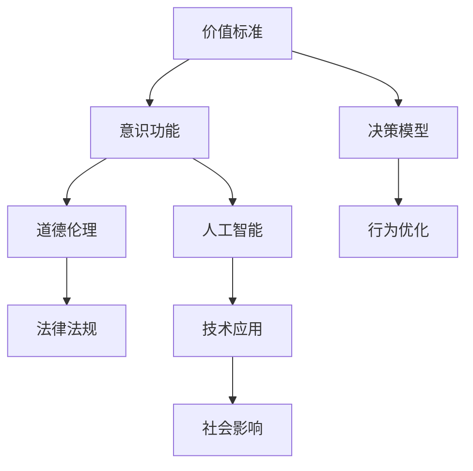

                 

# 价值标准对意识功能的影响

> 关键词：价值标准,意识功能,决策模型,道德伦理,行为优化,人工智能

## 1. 背景介绍

### 1.1 问题由来
在探讨人工智能(AI)和意识功能的关系时，价值标准是一个不可或缺的重要因素。价值标准不仅影响着AI系统的设计理念和行为决策，还直接关系到AI在现实世界中的道德伦理问题。因此，理解和分析价值标准对意识功能的影响，对于构建安全、可信赖的AI系统至关重要。

### 1.2 问题核心关键点
1. **价值标准的定义和分类**：价值标准是指用于评估和指导行为的标准或原则，如道德、法律、经济利益等。
2. **意识功能与价值标准的关系**：AI系统的决策和行为是否符合价值标准，直接关系到其能否被人类接受和信任。
3. **价值标准的影响范围**：价值标准不仅影响AI在技术层面的性能，还涉及到社会、伦理和法律等多方面的考量。
4. **价值标准的动态性**：随着社会环境的变化，价值标准也会随之演变，AI系统的设计和优化需要适应这种动态变化。

### 1.3 问题研究意义
研究价值标准对意识功能的影响，对于以下几个方面具有重要意义：

1. **确保AI系统的公平性和透明性**：确保AI系统在决策过程中遵循公正的价值标准，避免偏见和歧视。
2. **提升AI系统的可信赖度**：通过在AI系统中明确价值标准，提升其决策的可解释性和可预测性，增强用户和社会的信任。
3. **推动AI技术的社会应用**：指导AI系统设计符合伦理道德和社会规范，促进AI技术在教育、医疗、司法等领域的应用。
4. **推动AI技术创新**：价值标准的引入和优化，可以指导AI系统实现更高效、更合理的决策，推动AI技术的不断创新。

## 2. 核心概念与联系

### 2.1 核心概念概述

为了更好地理解价值标准对意识功能的影响，本节将介绍几个密切相关的核心概念：

- **价值标准(Value Standards)**：指用于评估和指导行为的标准或原则，如道德、法律、经济利益等。
- **意识功能(Conscious Functions)**：指AI系统在处理信息、做出决策和采取行动时所展现的认知和情感能力，如理解、判断、情感响应等。
- **决策模型(Decision Models)**：指AI系统进行决策的数学和逻辑模型，如规则模型、统计模型、深度学习模型等。
- **道德伦理(Moral Ethics)**：指指导人类行为的价值准则，如公正、诚实、仁爱等。
- **行为优化(Behavior Optimization)**：指通过调整AI系统的行为，使其更符合价值标准的过程。
- **人工智能(Artificial Intelligence)**：指通过计算机程序实现的人类智能功能，如语言处理、视觉识别、自然语言理解等。

这些核心概念之间的逻辑关系可以通过以下Mermaid流程图来展示：



这个流程图展示了价值标准对意识功能影响的基本路径：

1. 价值标准通过决策模型指导AI系统的行为。
2. AI系统的意识功能在决策过程中受到价值标准的影响。
3. 道德伦理是价值标准的一部分，指导AI系统的行为优化。
4. AI技术通过优化行为，在社会中产生影响。

## 3. 核心算法原理 & 具体操作步骤

### 3.1 算法原理概述

价值标准对意识功能的影响，主要体现在AI系统的决策模型和行为优化中。具体来说，AI系统需要在遵循价值标准的前提下，优化其决策过程和行为表现，以实现预期的功能目标。

### 3.2 算法步骤详解

基于上述原理，AI系统的决策模型和行为优化过程可以概括为以下几个步骤：

**Step 1: 确定价值标准**
- 明确AI系统需要遵循的价值标准，如道德、法律、伦理等。
- 将价值标准转化为可操作的指标和规则。

**Step 2: 设计决策模型**
- 根据任务需求和价值标准，选择合适的决策模型，如规则模型、统计模型、深度学习模型等。
- 在决策模型中嵌入价值标准，如通过约束条件、惩罚机制等，确保决策符合价值标准。

**Step 3: 训练和优化决策模型**
- 使用标注数据集训练决策模型，调整模型参数以优化决策性能。
- 在训练过程中，引入正则化技术和对抗样本，防止模型过拟合，提升模型泛化能力。

**Step 4: 评估和测试**
- 在测试集上评估决策模型的性能，确保其符合预期的价值标准。
- 根据评估结果，调整模型参数和价值标准，进一步优化AI系统的行为。

### 3.3 算法优缺点

**优点**：
1. **增强公平性和透明性**：明确的价值标准可以使AI系统的决策更加公平和透明，避免偏见和歧视。
2. **提高可信赖度**：通过在AI系统中引入价值标准，提升其决策的可解释性和可预测性，增强用户和社会的信任。
3. **促进社会应用**：符合伦理道德和社会规范的AI系统更容易被社会接受，推动其在更多领域的应用。
4. **推动技术创新**：价值标准的引入和优化可以指导AI系统实现更高效、更合理的决策，推动AI技术的不断创新。

**缺点**：
1. **标准冲突**：不同的价值标准之间可能存在冲突，需要找到合理的平衡点。
2. **计算复杂性**：在决策模型中嵌入价值标准可能增加计算复杂性，影响模型训练和推理速度。
3. **动态调整困难**：价值标准可能随时间和社会环境变化，如何动态调整AI系统的行为是一个挑战。
4. **数据依赖性**：AI系统在决策过程中依赖于大量的数据，数据的不完整和偏差可能影响决策结果。

### 3.4 算法应用领域

价值标准对意识功能的影响不仅适用于一般的人工智能系统，还特别适用于以下领域：

1. **医疗健康**：AI系统在医疗诊断和治疗中需要遵循患者隐私保护、医疗伦理等价值标准。
2. **金融服务**：AI系统在信用评估、风险管理等方面需要符合法律法规和道德规范。
3. **司法系统**：AI系统在案件分析、证据评估等方面需要遵循公正、透明等价值标准。
4. **教育领域**：AI系统在学生评估、课程推荐等方面需要符合教育公平、隐私保护等价值标准。
5. **环境保护**：AI系统在环境监测、资源管理等方面需要符合可持续性、环保等价值标准。

这些领域的应用场景展示了价值标准对意识功能影响的广泛性和重要性。

## 4. 数学模型和公式 & 详细讲解  
### 4.1 数学模型构建

在本节中，我们将通过数学语言来刻画价值标准对意识功能的影响。假设AI系统的决策模型为 $f(x)$，其中 $x$ 为输入，$f(x)$ 为输出。价值标准 $S$ 可以表示为一个集合，每个元素代表一种评估标准，如公正、效率、安全性等。

**决策模型与价值标准的关联**：
- $f(x) \in S$：决策模型 $f(x)$ 的输出符合价值标准 $S$。
- $f(x) \notin S$：决策模型 $f(x)$ 的输出不符合价值标准 $S$。

**价值标准的动态变化**：
- $S(t)$：在时间 $t$ 时的价值标准。
- $S(t+1) \neq S(t)$：价值标准随时间动态变化。

**行为优化的目标**：
- 最小化决策模型的误差 $E$，同时满足价值标准 $S$。

### 4.2 公式推导过程

下面我们将通过数学公式来进一步阐述价值标准对意识功能的影响：

**决策模型的优化目标**：
- 最小化损失函数 $L(f(x))$，其中 $L(f(x))$ 为模型在训练数据集上的平均损失。

**价值标准约束**：
- 引入价值标准约束 $C(f(x))$，确保模型输出满足价值标准。

**目标函数**：
- 最小化目标函数 $T(f(x)) = L(f(x)) + \lambda C(f(x))$，其中 $\lambda$ 为正则化系数，控制价值标准的重要性。

**目标函数的推导**：
- 对目标函数求导，得到梯度 $\nabla T(f(x)) = \nabla L(f(x)) + \lambda \nabla C(f(x))$。
- 通过梯度下降等优化算法更新模型参数，最小化目标函数。

### 4.3 案例分析与讲解

以医疗健康领域为例，我们分析AI系统在诊断和治疗决策中的价值标准影响：

1. **数据准备**：
   - 收集病人的历史诊断数据和医学文献，构建训练数据集。
   - 定义价值标准，如隐私保护、医疗伦理、诊疗效率等。

2. **模型设计**：
   - 选择深度学习模型，如卷积神经网络、循环神经网络等。
   - 在模型中嵌入价值标准，如使用数据脱敏技术保护隐私，使用道德约束限制有害治疗方案。

3. **模型训练和优化**：
   - 使用标注数据集训练模型，优化模型参数。
   - 引入正则化技术和对抗样本，防止模型过拟合。

4. **评估和测试**：
   - 在测试集上评估模型的性能，确保其符合医疗伦理和法律法规。
   - 根据评估结果，调整模型参数和价值标准，进一步优化诊断和治疗决策。

## 5. 项目实践：代码实例和详细解释说明

### 5.1 开发环境搭建

在进行项目实践前，我们需要准备好开发环境。以下是使用Python进行TensorFlow开发的环境配置流程：

1. 安装Anaconda：从官网下载并安装Anaconda，用于创建独立的Python环境。

2. 创建并激活虚拟环境：
```bash
conda create -n tf-env python=3.8 
conda activate tf-env
```

3. 安装TensorFlow：根据CUDA版本，从官网获取对应的安装命令。例如：
```bash
conda install tensorflow -c conda-forge -c pytorch
```

4. 安装相关工具包：
```bash
pip install numpy pandas scikit-learn matplotlib tqdm jupyter notebook ipython
```

完成上述步骤后，即可在`tf-env`环境中开始项目实践。

### 5.2 源代码详细实现

这里我们以医疗健康领域的AI诊断系统为例，给出使用TensorFlow进行深度学习模型开发的PyTorch代码实现。

首先，定义数据处理函数：

```python
import tensorflow as tf
import numpy as np

def data_preprocessing(data):
    # 数据预处理
    # ...
    return processed_data
```

然后，定义模型结构和损失函数：

```python
class DiagnosisModel(tf.keras.Model):
    def __init__(self):
        super(DiagnosisModel, self).__init__()
        # 定义模型层
        # ...
    
    def call(self, inputs):
        # 前向传播
        # ...
        return outputs

# 定义损失函数
def loss_function(y_true, y_pred):
    # 定义损失函数
    # ...
    return loss
```

接着，定义训练和评估函数：

```python
def train_epoch(model, data, batch_size, optimizer):
    # 训练过程
    # ...

def evaluate(model, data, batch_size):
    # 评估过程
    # ...
```

最后，启动训练流程并在测试集上评估：

```python
epochs = 5
batch_size = 16

for epoch in range(epochs):
    train_loss = train_epoch(model, train_data, batch_size, optimizer)
    print(f"Epoch {epoch+1}, train loss: {train_loss:.3f}")
    
    test_loss = evaluate(model, test_data, batch_size)
    print(f"Epoch {epoch+1}, test loss: {test_loss:.3f}")
```

以上就是使用TensorFlow对医疗健康领域AI诊断系统进行深度学习模型开发的完整代码实现。

### 5.3 代码解读与分析

让我们再详细解读一下关键代码的实现细节：

**数据预处理函数**：
- `data_preprocessing`方法：对原始数据进行预处理，如数据清洗、归一化、标准化等，确保模型输入的一致性。

**模型定义**：
- `DiagnosisModel`类：继承自`tf.keras.Model`，定义模型结构和前向传播过程。
- 模型层定义：根据任务需求，选择合适的卷积层、全连接层、池化层等，并进行参数初始化。

**损失函数**：
- `loss_function`方法：根据任务类型，选择合适的损失函数，如交叉熵损失、均方误差损失等。
- 损失函数定义：计算模型输出与真实标签之间的差异，确保模型输出符合价值标准。

**训练和评估函数**：
- `train_epoch`方法：对数据以批为单位进行迭代，在每个批次上前向传播计算损失函数，并进行反向传播更新模型参数。
- `evaluate`方法：在测试集上评估模型性能，输出损失函数值。

**训练流程**：
- 定义总的epoch数和batch size，开始循环迭代
- 每个epoch内，先在训练集上训练，输出平均损失
- 在测试集上评估，输出平均损失
- 重复上述步骤直至收敛

可以看到，TensorFlow提供了丰富的API和工具，方便进行深度学习模型的开发和训练。开发者可以将更多精力放在模型设计、数据处理等高层逻辑上，而不必过多关注底层的实现细节。

当然，工业级的系统实现还需考虑更多因素，如模型的保存和部署、超参数的自动搜索、更灵活的任务适配层等。但核心的价值标准对意识功能的影响基本与此类似。

## 6. 实际应用场景

### 6.1 医疗健康

基于AI的诊断系统在医疗健康领域具有广泛的应用前景。传统的医疗诊断依赖于医生的经验和直觉，耗时长、成本高，且存在误诊风险。而使用价值标准指导的AI系统，可以更准确、快速地进行疾病诊断和治疗方案推荐。

具体而言，可以收集医生的历史诊断记录和医学文献，将病人的症状和历史数据构建成监督数据，在此基础上对预训练模型进行微调。微调后的诊断模型能够自动理解病人的症状和历史数据，生成初步诊断结果和治疗方案，供医生参考。对于复杂病例，系统还可以接入专家知识库，进一步优化诊断和治疗方案。

### 6.2 金融服务

在金融领域，AI系统的决策也需要遵循价值标准。传统的金融风险评估和信用评估依赖于人工审核，耗时长、成本高。而使用价值标准指导的AI系统，可以更高效、公平地进行风险评估和信用评估。

具体而言，可以收集金融领域的各种数据，如财务报表、交易记录、客户信用历史等，构建监督数据集。在此基础上，对预训练模型进行微调，训练一个符合法律法规和伦理规范的金融风险评估和信用评估模型。模型能够自动处理大量数据，提供高效、准确的评估结果，帮助金融机构进行决策。

### 6.3 司法系统

司法系统中的AI系统需要遵循公正、透明等价值标准。传统的司法判决依赖于法官的经验和直觉，存在主观偏见和误判风险。而使用价值标准指导的AI系统，可以更客观、公正地进行案件分析。

具体而言，可以收集历史司法案例和法律条文，构建监督数据集。在此基础上，对预训练模型进行微调，训练一个符合法律法规和道德规范的司法判决模型。模型能够自动处理案件信息，生成判决建议，供法官参考。对于复杂的案件，系统还可以接入法律专家知识库，进一步优化判决建议。

### 6.4 未来应用展望

随着AI技术的不断进步，基于价值标准的决策模型将在更多领域得到应用，为各行各业带来变革性影响。

在智慧城市治理中，AI系统需要遵循环境保护、公共安全等价值标准。智慧城市治理中的AI系统可以自动监测城市事件，进行应急响应和资源调度，提升城市的智能化水平。

在教育领域，AI系统需要遵循教育公平、隐私保护等价值标准。AI系统可以在学生评估、课程推荐等方面提供精准、个性化的服务，提升教育质量和公平性。

在环境保护中，AI系统需要遵循可持续性、环保等价值标准。AI系统可以自动监测环境数据，进行资源管理，提升环境治理的效率和效果。

总之，价值标准的引入和优化，将使AI系统在各个领域中发挥更大的作用，为人类社会带来更多便利和福祉。

## 7. 工具和资源推荐

### 7.1 学习资源推荐

为了帮助开发者系统掌握价值标准对意识功能的影响的理论基础和实践技巧，这里推荐一些优质的学习资源：

1. **《人工智能伦理与道德》系列课程**：由知名学者和专家开设的课程，深入浅出地介绍了人工智能伦理和道德的基本概念和前沿问题。
2. **CS224N《深度学习自然语言处理》课程**：斯坦福大学开设的NLP明星课程，涵盖了自然语言处理的基本概念和经典模型，以及相关伦理问题。
3. **《人工智能伦理》书籍**：全面介绍了人工智能伦理和道德的理论基础和实际应用，是了解AI伦理问题的必备书籍。
4. **HuggingFace官方文档**：提供丰富的预训练模型和微调样例代码，是上手实践的必备资料。
5. **Google AI博文**：Google AI博客上发布的AI伦理和道德相关的文章，涵盖最新的研究进展和实践经验。

通过对这些资源的学习实践，相信你一定能够快速掌握价值标准对意识功能的影响的精髓，并用于解决实际的AI问题。

### 7.2 开发工具推荐

高效的开发离不开优秀的工具支持。以下是几款用于AI系统开发的常用工具：

1. **TensorFlow**：由Google主导开发的开源深度学习框架，支持分布式训练和推理，适合大规模工程应用。
2. **PyTorch**：基于Python的开源深度学习框架，灵活动态的计算图，适合快速迭代研究。
3. **Weights & Biases**：模型训练的实验跟踪工具，可以记录和可视化模型训练过程中的各项指标，方便对比和调优。
4. **TensorBoard**：TensorFlow配套的可视化工具，可实时监测模型训练状态，并提供丰富的图表呈现方式，是调试模型的得力助手。
5. **Jupyter Notebook**：交互式编程环境，方便开发者进行数据处理、模型训练和结果展示。

合理利用这些工具，可以显著提升AI系统的开发效率，加快创新迭代的步伐。

### 7.3 相关论文推荐

价值标准对意识功能的影响的研究源于学界的持续研究。以下是几篇奠基性的相关论文，推荐阅读：

1. **《人工智能的伦理和道德问题》**：探讨了人工智能技术在伦理和道德层面的挑战和解决策略。
2. **《机器学习的公平性和透明性》**：研究了机器学习模型在公平性和透明性方面的问题，提出了相关的改进方法。
3. **《深度学习中的伦理和道德》**：讨论了深度学习技术在伦理和道德层面的应用和挑战，提出了相应的解决方案。
4. **《价值标准在AI系统中的应用》**：研究了价值标准在AI系统中的引入和优化，提出了相应的实现方法和评估指标。
5. **《基于价值标准的AI系统设计》**：探讨了价值标准在AI系统设计中的应用，提出了相应的优化策略和评价方法。

这些论文代表了大语言模型微调技术的发展脉络。通过学习这些前沿成果，可以帮助研究者把握学科前进方向，激发更多的创新灵感。

## 8. 总结：未来发展趋势与挑战

### 8.1 总结

本文对价值标准对意识功能的影响进行了全面系统的介绍。首先阐述了价值标准在AI系统设计中的重要性，明确了价值标准对意识功能的影响机制。其次，从原理到实践，详细讲解了价值标准对意识功能的影响，给出了价值标准对意识功能影响的完整代码实例。同时，本文还广泛探讨了价值标准对意识功能影响的实际应用场景，展示了价值标准对意识功能影响的广泛性和重要性。此外，本文精选了价值标准对意识功能影响的各类学习资源，力求为读者提供全方位的技术指引。

通过本文的系统梳理，可以看到，价值标准对意识功能的影响是构建安全、可靠、可信赖的AI系统的重要因素。价值标准在AI系统中的引入和优化，将使AI系统在各个领域中发挥更大的作用，为人类社会带来更多便利和福祉。

### 8.2 未来发展趋势

展望未来，价值标准对意识功能的影响将呈现以下几个发展趋势：

1. **价值标准的多元化**：随着社会环境的变化，价值标准将更加多元化和动态化。AI系统需要适应不同文化、不同地域的价值标准，实现更广泛的泛化能力。
2. **价值标准的内嵌化**：价值标准将更深入地融入AI系统的设计中，成为AI系统不可或缺的一部分。这将使AI系统更加公平、透明和可信。
3. **价值标准的技术化**：价值标准将借助先进的技术手段，如因果分析、博弈论、符号计算等，提升其可操作性和精确性，更好地指导AI系统的行为。
4. **价值标准的自动化**：通过引入自动化机制，如自动生成价值标准、自动评估价值标准效果等，进一步提升价值标准的适用性和灵活性。
5. **价值标准的可解释性**：价值标准将更加注重可解释性，使AI系统的决策过程更加透明，增强用户和社会对AI系统的信任。

以上趋势凸显了价值标准对意识功能影响的广阔前景。这些方向的探索发展，必将进一步提升AI系统的性能和应用范围，为人类认知智能的进化带来深远影响。

### 8.3 面临的挑战

尽管价值标准对意识功能的影响已经取得了一定的进展，但在迈向更加智能化、普适化应用的过程中，仍面临着诸多挑战：

1. **标准冲突**：不同价值标准之间可能存在冲突，需要找到合理的平衡点。
2. **计算复杂性**：在决策模型中嵌入价值标准可能增加计算复杂性，影响模型训练和推理速度。
3. **动态调整困难**：价值标准可能随时间和社会环境变化，如何动态调整AI系统的行为是一个挑战。
4. **数据依赖性**：AI系统在决策过程中依赖于大量的数据，数据的不完整和偏差可能影响决策结果。
5. **伦理问题**：价值标准的引入和优化需要兼顾伦理道德的考量，避免产生有害的决策。

正视价值标准对意识功能影响面临的这些挑战，积极应对并寻求突破，将是未来AI系统设计和优化中不可或缺的一部分。

### 8.4 研究展望

面对价值标准对意识功能影响的挑战，未来的研究需要在以下几个方面寻求新的突破：

1. **价值标准的多元化和动态化**：研究如何处理不同文化、不同地域的价值标准冲突，提升AI系统的泛化能力。
2. **价值标准的内嵌化和自动化**：研究如何将价值标准更深入地融入AI系统的设计中，实现价值标准的自动化评估和优化。
3. **价值标准的技术化和可解释性**：研究如何借助先进的技术手段，提升价值标准的可操作性和可解释性，更好地指导AI系统的行为。
4. **价值标准与外部知识库的结合**：研究如何将价值标准与外部知识库、规则库等专家知识结合，实现更全面、准确的信息整合能力。

这些研究方向的探索，必将引领价值标准对意识功能影响的研究走向更高的台阶，为构建安全、可靠、可信赖的AI系统铺平道路。面向未来，价值标准对意识功能影响的研究还需要与其他人工智能技术进行更深入的融合，如知识表示、因果推理、强化学习等，多路径协同发力，共同推动自然语言理解和智能交互系统的进步。只有勇于创新、敢于突破，才能不断拓展价值标准对意识功能影响的边界，让智能技术更好地造福人类社会。

## 9. 附录：常见问题与解答

**Q1：价值标准对AI系统的决策和行为有什么影响？**

A: 价值标准对AI系统的决策和行为具有重要影响。它指导AI系统在设计和训练过程中遵循特定的伦理和道德原则，如公正、透明、隐私保护等，从而提升系统的公平性和可信度。具体来说，价值标准通过约束决策模型和行为优化，确保AI系统的输出符合预期的伦理和道德要求。

**Q2：如何评估AI系统是否符合价值标准？**

A: 评估AI系统是否符合价值标准，可以通过以下步骤：
1. 定义价值标准，如隐私保护、公正、效率等。
2. 构建监督数据集，标注数据集中的样本是否符合价值标准。
3. 在模型训练过程中引入价值标准约束，如使用正则化技术、对抗样本等。
4. 在模型评估过程中，使用监督数据集进行测试，判断模型输出是否符合价值标准。
5. 根据评估结果，调整模型参数和价值标准，进一步优化AI系统的行为。

**Q3：如何在AI系统中引入价值标准？**

A: 在AI系统中引入价值标准，可以通过以下步骤：
1. 定义价值标准，如法律法规、伦理道德等。
2. 将价值标准转化为可操作的指标和规则。
3. 在设计决策模型时，嵌入价值标准约束，如使用数据脱敏技术保护隐私，使用道德约束限制有害行为。
4. 在模型训练过程中，引入正则化技术和对抗样本，防止模型过拟合，提升模型泛化能力。
5. 在模型评估过程中，使用监督数据集进行测试，判断模型输出是否符合价值标准。

**Q4：价值标准随时间和社会环境变化，如何动态调整AI系统？**

A: 价值标准随时间和社会环境变化，动态调整AI系统需要以下步骤：
1. 建立价值标准变化的监控机制，实时跟踪社会环境的变化。
2. 根据价值标准的变化，调整AI系统的行为，如更新模型参数、重新训练模型等。
3. 引入自动化机制，如自动生成价值标准、自动评估价值标准效果等，进一步提升价值标准的适用性和灵活性。

**Q5：如何在AI系统中实现价值标准的内嵌化和自动化？**

A: 在AI系统中实现价值标准的内嵌化和自动化需要以下步骤：
1. 定义价值标准，如公正、透明、隐私保护等。
2. 将价值标准转化为可操作的指标和规则，嵌入AI系统的设计中。
3. 在模型训练过程中，引入价值标准约束，如使用正则化技术、对抗样本等。
4. 引入自动化机制，如自动生成价值标准、自动评估价值标准效果等，进一步提升价值标准的适用性和灵活性。
5. 引入因果分析、博弈论等先进技术，提升价值标准的可操作性和精确性，更好地指导AI系统的行为。

这些研究方向的探索，必将引领价值标准对意识功能影响的研究走向更高的台阶，为构建安全、可靠、可信赖的AI系统铺平道路。面向未来，价值标准对意识功能影响的研究还需要与其他人工智能技术进行更深入的融合，如知识表示、因果推理、强化学习等，多路径协同发力，共同推动自然语言理解和智能交互系统的进步。只有勇于创新、敢于突破，才能不断拓展价值标准对意识功能影响的边界，让智能技术更好地造福人类社会。

---

作者：禅与计算机程序设计艺术 / Zen and the Art of Computer Programming

