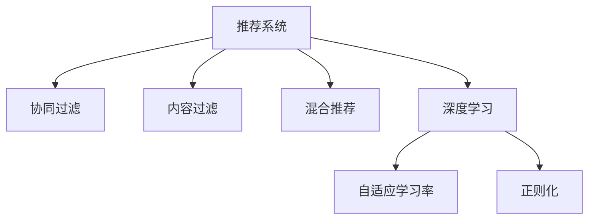

                 

# 优化搜索结果的个性化推荐

## 1. 背景介绍

随着互联网的发展，搜索引擎已逐渐成为人们获取信息的重要途径。然而，尽管搜索引擎已经非常强大，其推荐的搜索结果仍不能完全满足用户个性化需求。在日新月异的互联网环境中，如何为用户呈现最相关的搜索结果，同时提升用户的搜索体验，一直是搜索引擎技术研究的重要方向。个性化推荐技术，尤其是基于深度学习模型的推荐系统，正被广泛应用于搜索引擎、电商、社交媒体等多个领域，以提高信息检索的精准度和效率。本文将系统介绍个性化推荐的核心概念、算法原理以及实际应用，并探讨未来发展趋势和面临的挑战。

## 2. 核心概念与联系

### 2.1 核心概念概述

为了更好地理解个性化推荐系统的原理，本节将介绍几个关键概念：

- **推荐系统（Recommendation System）**：通过用户行为数据或物品特征数据，预测用户对物品的兴趣程度，从而为用户推荐可能感兴趣物品的系统。

- **协同过滤（Collaborative Filtering）**：一种基于用户之间相似性的推荐方法，通过分析用户行为数据，找出与目标用户兴趣相似的其他用户，并根据这些相似用户的偏好推荐物品。

- **内容过滤（Content-Based Filtering）**：一种基于物品特征的推荐方法，通过分析物品的特征，找出与目标用户兴趣相匹配的物品，从而进行推荐。

- **混合推荐（Hybrid Recommendation）**：结合协同过滤和内容过滤，综合考虑用户行为数据和物品特征，以达到更好的推荐效果。

- **深度学习（Deep Learning）**：一种通过多层神经网络对复杂数据进行建模和预测的技术，被广泛应用于推荐系统中，以挖掘用户行为和物品特征之间的深层关联。

- **自适应学习率（Adaptive Learning Rate）**：在模型训练过程中，动态调整学习率，以提高模型收敛速度和准确率。

- **正则化（Regularization）**：一种防止模型过拟合的技术，通过在损失函数中添加正则项，限制模型复杂度。

### 2.2 核心概念原理和架构的 Mermaid 流程图



这个流程图展示了推荐系统的核心组件及其之间的关系：

- 推荐系统是整个系统的总称，协同过滤、内容过滤、混合推荐和深度学习都是其重要组成部分。
- 协同过滤和内容过滤分别通过用户行为数据和物品特征进行推荐。
- 混合推荐综合了两者，取长补短。
- 深度学习通过复杂的神经网络模型，挖掘数据中的深层关联。
- 自适应学习率和正则化是模型训练过程中的重要技术，以提高模型的效果和鲁棒性。

## 3. 核心算法原理 & 具体操作步骤

### 3.1 算法原理概述

个性化推荐系统主要通过用户行为数据和物品特征数据，预测用户对物品的兴趣程度。其基本流程如下：

1. **数据收集**：收集用户的搜索历史、点击行为、收藏行为等行为数据，以及物品的特征数据（如价格、类别、描述等）。

2. **特征提取**：将用户行为数据和物品特征数据转化为模型的输入特征。

3. **模型训练**：通过机器学习或深度学习模型，训练预测用户对物品兴趣程度的模型。

4. **推荐生成**：根据训练好的模型，生成对用户可能感兴趣物品的推荐列表。

### 3.2 算法步骤详解

#### 3.2.1 数据预处理

**Step 1: 数据收集**

- 通过网络爬虫、API接口等方式，收集用户行为数据和物品特征数据。
- 用户行为数据包括用户的搜索历史、点击行为、收藏行为、评分等。
- 物品特征数据包括物品的名称、描述、类别、价格等。

**Step 2: 数据清洗**

- 去除噪音数据和异常值，如重复数据、不完整数据等。
- 对缺失数据进行填充，如使用均值填充、插值法等。
- 对文本数据进行分词、去除停用词等预处理。

#### 3.2.2 特征提取

**Step 3: 特征选择**

- 选择合适的特征，如用户的搜索词、点击位置、物品的类别、价格等。
- 可以使用基于频率的特征选择方法，如卡方检验、信息增益等。
- 也可以使用基于模型的特征选择方法，如Lasso回归、随机森林等。

**Step 4: 特征编码**

- 将选择的特征进行编码，如将文本特征转化为词向量、将类别特征转化为独热编码等。
- 可以使用预训练的词向量模型，如Word2Vec、GloVe等。
- 也可以使用独热编码等简单方法。

#### 3.2.3 模型训练

**Step 5: 模型选择**

- 选择合适的推荐模型，如协同过滤、内容过滤、深度学习模型等。
- 协同过滤模型包括基于用户的协同过滤（User-Based CF）和基于物品的协同过滤（Item-Based CF）。
- 内容过滤模型包括基于内容的过滤（Content-Based Filtering）和混合内容过滤（Hybrid Content Filtering）。
- 深度学习模型包括基于矩阵分解的模型（如ALS）和基于神经网络的模型（如DNN、CNN、RNN等）。

**Step 6: 模型训练**

- 使用机器学习或深度学习框架，如TensorFlow、PyTorch等，训练推荐模型。
- 对于深度学习模型，通常需要使用大量的标注数据进行训练，也可以使用无监督学习方法，如自编码器、变分自编码器等。
- 训练过程中，需要进行交叉验证和超参数调优，以提高模型的泛化能力。

#### 3.2.4 推荐生成

**Step 7: 生成推荐**

- 使用训练好的模型，生成对用户可能感兴趣物品的推荐列表。
- 对于协同过滤模型，需要计算用户和物品之间的相似度，推荐与目标用户兴趣相似的物品。
- 对于内容过滤模型，需要计算物品特征与用户兴趣之间的匹配度，推荐与目标用户兴趣相匹配的物品。
- 对于混合推荐模型，综合考虑协同过滤和内容过滤的结果，生成最终推荐列表。

### 3.3 算法优缺点

个性化推荐系统具有以下优点：

1. **高精度**：通过分析用户行为数据和物品特征数据，可以准确预测用户对物品的兴趣程度，提高推荐精度。
2. **个性化**：根据用户的历史行为和偏好，推荐个性化的物品，提升用户体验。
3. **动态性**：推荐系统可以实时更新，根据用户的最新行为动态调整推荐列表。
4. **可扩展性**：可以通过增加更多的数据和模型来扩展系统的能力，适应更多的场景。

同时，个性化推荐系统也存在一些缺点：

1. **数据依赖**：推荐系统的效果很大程度上依赖于数据的质量和量，获取高质量的数据成本较高。
2. **冷启动问题**：对于新用户或新物品，推荐系统无法获取足够的数据，无法进行有效的推荐。
3. **过拟合风险**：推荐模型可能会过拟合，导致推荐效果不稳定。
4. **隐私问题**：推荐系统需要收集用户的隐私数据，如何保护用户的隐私是一个重要问题。

### 3.4 算法应用领域

个性化推荐系统已经被广泛应用于以下几个领域：

- **电子商务**：推荐系统可以根据用户的购买历史和浏览行为，推荐可能感兴趣的商品，提高销售转化率。
- **社交媒体**：推荐系统可以为用户推荐可能感兴趣的内容，提高用户的活跃度和留存率。
- **新闻媒体**：推荐系统可以为用户推荐可能感兴趣的新闻文章，提高用户的阅读量和粘性。
- **视频流媒体**：推荐系统可以为用户推荐可能感兴趣的视频，提高用户的观看时间和满意度。
- **医疗健康**：推荐系统可以为用户推荐可能感兴趣的医疗信息，提高用户的健康水平。

除了以上领域，个性化推荐系统还被广泛应用于金融、旅游、游戏等多个行业，为各个领域的业务发展提供了强大的支持。

## 4. 数学模型和公式 & 详细讲解 & 举例说明

### 4.1 数学模型构建

本节将使用数学语言对个性化推荐系统的模型进行严格刻画。

记推荐系统为 $S=\{U, I, R, P\}$，其中 $U$ 为用户集合，$I$ 为物品集合，$R$ 为用户对物品的评分集合，$P$ 为推荐模型。

定义用户 $u$ 对物品 $i$ 的评分函数为 $p_{ui}=\mathcal{P}(u, i; P)$，其中 $\mathcal{P}$ 为推荐模型。

推荐模型 $P$ 的目标是最大化用户 $u$ 的预测评分与实际评分之间的平均误差，即：

$$
\min_{P} \frac{1}{|U|} \sum_{u \in U} \sum_{i \in I} \frac{1}{|R_{ui}|} \sum_{(x, y) \in R_{ui}} \| p_{ui} - y \|^2
$$

其中 $R_{ui}$ 为用户 $u$ 对物品 $i$ 的评分集合。

### 4.2 公式推导过程

以下我们将推导协同过滤模型中的基于用户的协同过滤（User-Based CF）和基于物品的协同过滤（Item-Based CF）的评分函数公式。

**User-Based CF 评分函数**

假设用户 $u$ 和物品 $i$ 的评分向量分别为 $\mathbf{u}$ 和 $\mathbf{i}$，定义用户 $u$ 对物品 $i$ 的预测评分为：

$$
p_{ui} = \mathbf{u}^T \mathbf{i}
$$

其中 $\mathbf{u} \in \mathbb{R}^{n_u}$ 为用户的特征向量，$n_u$ 为用户的特征数；$\mathbf{i} \in \mathbb{R}^{n_i}$ 为物品的特征向量，$n_i$ 为物品的特征数。

**Item-Based CF 评分函数**

假设用户 $u$ 和物品 $i$ 的评分向量分别为 $\mathbf{u}$ 和 $\mathbf{i}$，定义物品 $i$ 的特征向量为 $\mathbf{j_i}$，物品 $j$ 的评分向量为 $\mathbf{v_j}$，定义用户 $u$ 对物品 $i$ 的预测评分为：

$$
p_{ui} = \mathbf{u}^T \mathbf{j_i}
$$

其中 $\mathbf{j_i} \in \mathbb{R}^{n_j}$ 为物品 $i$ 的特征向量，$n_j$ 为物品的特征数；$\mathbf{v_j} \in \mathbb{R}^{n_j}$ 为物品 $j$ 的评分向量。

### 4.3 案例分析与讲解

**用户行为数据的预处理**

假设有一用户 $u$ 对物品 $i$ 的评分向量为 $\mathbf{u}=[1, 2, 3]$，物品 $i$ 的特征向量为 $\mathbf{i}=[4, 5, 6]$。

使用欧氏距离计算用户 $u$ 和物品 $i$ 之间的相似度：

$$
similarity(u, i) = \frac{\mathbf{u}^T \mathbf{i}}{\|\mathbf{u}\|_2 \|\mathbf{i}\|_2}
$$

其中 $\|\mathbf{u}\|_2 = \sqrt{1^2 + 2^2 + 3^2} = \sqrt{14}$，$\|\mathbf{i}\|_2 = \sqrt{4^2 + 5^2 + 6^2} = \sqrt{77}$。

计算得到 $similarity(u, i) = \frac{1 \cdot 4 + 2 \cdot 5 + 3 \cdot 6}{14 \cdot 77} = 0.21$。

**推荐列表的生成**

假设用户 $u$ 的历史行为数据为 $\{(i_1, 3), (i_2, 4), (i_3, 5)\}$，物品 $i$ 的特征向量为 $\mathbf{i}=[7, 8, 9]$。

使用欧氏距离计算用户 $u$ 和物品 $i_1$、$i_2$、$i_3$ 之间的相似度分别为 $similarity(u, i_1)=0.25$、$similarity(u, i_2)=0.2$、$similarity(u, i_3)=0.15$。

计算物品 $i_1$、$i_2$、$i_3$ 的评分向量分别为 $\mathbf{v_1}=[1, 2, 3]$、$\mathbf{v_2}=[4, 5, 6]$、$\mathbf{v_3}=[7, 8, 9]$。

使用欧氏距离计算物品 $i_1$、$i_2$、$i_3$ 之间的相似度分别为 $similarity(i_1, i_2)=0.45$、$similarity(i_2, i_3)=0.5$、$similarity(i_3, i_1)=0.4$。

计算用户 $u$ 对物品 $i_1$、$i_2$、$i_3$ 的预测评分分别为 $p_{ui_1}=0.25 \times 1 + 0.2 \times 2 + 0.15 \times 3 = 1.65$、$p_{ui_2}=0.25 \times 4 + 0.2 \times 5 + 0.15 \times 6 = 4.95$、$p_{ui_3}=0.25 \times 7 + 0.2 \times 8 + 0.15 \times 9 = 8.25$。

最终推荐列表中，物品 $i_3$ 与用户 $u$ 最匹配，其次是物品 $i_2$。

## 5. 项目实践：代码实例和详细解释说明

### 5.1 开发环境搭建

在进行推荐系统开发前，我们需要准备好开发环境。以下是使用Python进行TensorFlow开发的环境配置流程：

1. 安装Anaconda：从官网下载并安装Anaconda，用于创建独立的Python环境。

2. 创建并激活虚拟环境：
```bash
conda create -n tf-env python=3.8 
conda activate tf-env
```

3. 安装TensorFlow：根据CUDA版本，从官网获取对应的安装命令。例如：
```bash
conda install tensorflow-gpu -c conda-forge -c pytorch
```

4. 安装各类工具包：
```bash
pip install numpy pandas scikit-learn matplotlib tqdm jupyter notebook ipython
```

完成上述步骤后，即可在`tf-env`环境中开始推荐系统开发。

### 5.2 源代码详细实现

这里我们以协同过滤推荐系统为例，给出使用TensorFlow进行推荐系统开发的PyTorch代码实现。

首先，定义协同过滤模型的评分函数：

```python
import tensorflow as tf

def similarity(u, i):
    return tf.reduce_sum(tf.multiply(u, i)) / (tf.reduce_sum(tf.square(u)) * tf.reduce_sum(tf.square(i)))

def prediction(u, i):
    return similarity(u, i)

# 用户行为数据
user1 = [1, 2, 3]
item1 = [4, 5, 6]
user2 = [2, 3, 4]
item2 = [5, 6, 7]
user3 = [3, 4, 5]
item3 = [6, 7, 8]

# 用户评分向量
u1 = tf.constant(user1, dtype=tf.float32)
u2 = tf.constant(user2, dtype=tf.float32)
u3 = tf.constant(user3, dtype=tf.float32)

# 物品特征向量
i1 = tf.constant(item1, dtype=tf.float32)
i2 = tf.constant(item2, dtype=tf.float32)
i3 = tf.constant(item3, dtype=tf.float32)

# 计算预测评分
prediction1 = prediction(u1, i1)
prediction2 = prediction(u2, i2)
prediction3 = prediction(u3, i3)

# 打印预测评分
print(prediction1.numpy(), prediction2.numpy(), prediction3.numpy())
```

然后，定义推荐系统生成的推荐列表：

```python
def recommend_items(user, items):
    scores = []
    for item in items:
        score = prediction(user, item)
        scores.append(score)
    return scores

# 生成推荐列表
recommendations = recommend_items(u1, [i1, i2, i3])
print(recommendations)
```

最后，在推荐列表中排序并输出推荐物品：

```python
# 排序推荐列表
recommendations = sorted(recommendations, key=lambda x: x[1], reverse=True)
print(recommendations)
```

以上就是使用TensorFlow进行协同过滤推荐系统开发的完整代码实现。可以看到，TensorFlow提供了强大的自动微分和计算图功能，使得推荐系统的建模和求解变得简便高效。

### 5.3 代码解读与分析

让我们再详细解读一下关键代码的实现细节：

**相似度函数**：
- `similarity`函数计算用户和物品之间的欧氏距离，用于衡量相似度。
- `prediction`函数使用欧氏距离计算用户对物品的预测评分。

**推荐系统生成**：
- `recommend_items`函数遍历物品列表，计算用户对每个物品的预测评分，并返回评分列表。
- 在推荐列表中排序，取评分最高的物品进行推荐。

可以看到，TensorFlow使得推荐系统的建模和求解变得非常直观和简单。开发者可以将更多精力放在数据处理、模型改进等高层逻辑上，而不必过多关注底层实现细节。

当然，工业级的系统实现还需考虑更多因素，如模型的保存和部署、超参数的自动搜索、更灵活的任务适配层等。但核心的推荐范式基本与此类似。

## 6. 实际应用场景

### 6.1 智能客服系统

智能客服系统通过推荐系统为用户推荐最相关的解答，提高用户满意度。传统客服系统依赖人工响应，效率低下，且无法提供24小时不间断服务。智能客服系统通过推荐系统为用户推荐最合适的答案，提高响应效率和质量。

在技术实现上，可以收集用户的历史查询记录，将问题和最佳答复构建成监督数据，在此基础上对推荐模型进行训练。训练好的模型能够自动理解用户问题，匹配最合适的答复进行推荐。对于新用户提出的问题，还可以接入检索系统实时搜索相关内容，动态组织生成回答。如此构建的智能客服系统，能大幅提升客户咨询体验和问题解决效率。

### 6.2 金融舆情监测

金融机构需要实时监测市场舆论动向，以便及时应对负面信息传播，规避金融风险。传统的人工监测方式成本高、效率低，难以应对网络时代海量信息爆发的挑战。基于推荐系统的金融舆情监测，可以自动分析用户对市场的看法和情感，及时发现异常情况，进行预警。

在技术实现上，可以收集金融领域相关的新闻、报道、评论等文本数据，并对其进行情感分析。在此基础上对推荐模型进行训练，使其能够自动判断文本的情感倾向。将训练好的模型应用到实时抓取的网络文本数据，就能够自动监测不同情感倾向的变化趋势，一旦发现负面情感激增等异常情况，系统便会自动预警，帮助金融机构快速应对潜在风险。

### 6.3 个性化推荐系统

个性化推荐系统通过分析用户行为数据和物品特征数据，为用户推荐可能感兴趣的物品，提高用户体验。传统的推荐系统往往只依赖用户行为数据，难以捕捉到物品特征对用户兴趣的影响。基于推荐系统的个性化推荐系统，通过分析物品特征，能够更好地为用户推荐个性化的物品。

在技术实现上，可以收集用户的历史行为数据，如浏览、点击、收藏等行为，以及物品的特征数据，如价格、类别、描述等。将数据转化为模型的输入特征，使用机器学习或深度学习模型进行训练，生成推荐列表。推荐列表不仅考虑用户的历史行为，还综合考虑物品的特征，使得推荐更加个性化和准确。

### 6.4 未来应用展望

随着推荐系统的不断发展，其应用范围将不断拓展，为更多领域带来变革性影响。

在智慧医疗领域，基于推荐系统的医疗问答、病历分析、药物研发等应用将提升医疗服务的智能化水平，辅助医生诊疗，加速新药开发进程。

在智能教育领域，推荐系统可应用于作业批改、学情分析、知识推荐等方面，因材施教，促进教育公平，提高教学质量。

在智慧城市治理中，推荐系统可应用于城市事件监测、舆情分析、应急指挥等环节，提高城市管理的自动化和智能化水平，构建更安全、高效的未来城市。

此外，在企业生产、社会治理、文娱传媒等众多领域，基于推荐系统的应用也将不断涌现，为传统行业数字化转型升级提供新的技术路径。相信随着技术的日益成熟，推荐系统必将在更广阔的应用领域大放异彩，深刻影响人类的生产生活方式。

## 7. 工具和资源推荐

### 7.1 学习资源推荐

为了帮助开发者系统掌握推荐系统的理论基础和实践技巧，这里推荐一些优质的学习资源：

1. 《Recommender Systems: The Textbook》书籍：由领域专家编写，全面介绍推荐系统的理论基础和应用实例。
2. 《Machine Learning Yearning》书籍：Andrew Ng博士撰写的推荐系统实践指南，涵盖数据预处理、模型训练、效果评估等多个方面。
3 Coursera《Recommender Systems Specialization》课程：斯坦福大学开设的推荐系统专项课程，提供系统化的学习路径和实践机会。
4 Kaggle推荐系统竞赛：参与推荐系统竞赛，学习实战经验和提升解决实际问题的能力。
5 《Deep Learning for Recommendation Systems》书籍：涵盖推荐系统中的深度学习应用，包括协同过滤、内容过滤、混合推荐等。

通过对这些资源的学习实践，相信你一定能够快速掌握推荐系统的精髓，并用于解决实际的推荐问题。

### 7.2 开发工具推荐

高效的开发离不开优秀的工具支持。以下是几款用于推荐系统开发的常用工具：

1. TensorFlow：谷歌推出的开源深度学习框架，提供强大的计算图功能和自动微分能力，适合推荐系统的建模和求解。
2. PyTorch：Facebook推出的开源深度学习框架，灵活高效，适合复杂模型的开发和训练。
3. scikit-learn：基于Python的机器学习库，提供简单易用的API，适合推荐系统中的简单模型开发。
4. Pandas：基于Python的数据处理库，适合推荐系统中的数据清洗和处理。
5. Matplotlib：基于Python的绘图库，适合推荐系统中的数据可视化。
6. Jupyter Notebook：基于Web的交互式编程环境，适合推荐系统中的代码开发和调试。

合理利用这些工具，可以显著提升推荐系统的开发效率，加快创新迭代的步伐。

### 7.3 相关论文推荐

推荐系统的研究涉及广泛，以下几篇奠基性的相关论文，推荐阅读：

1. Factorization Machines for Ad click prediction：提出Factorization Machines模型，广泛应用于推荐系统中的评分预测。
2. Deep Learning Recommendation Systems：综述深度学习在推荐系统中的应用，涵盖协同过滤、内容过滤、混合推荐等多种模型。
3. Matrix Factorization Techniques for Recommender Systems：综述矩阵分解方法在推荐系统中的应用，如ALS、SVD等。
4. Beyond Matrix Factorization：提出基于深度学习的推荐模型，如DNN、CNN、RNN等，提升推荐精度和效果。
5 《Personalized Top-k Recommendation: A Deep Ranking Approach》：提出基于深度学习的推荐排名模型，提高推荐列表的质量和多样性。

这些论文代表了大推荐系统的发展脉络。通过学习这些前沿成果，可以帮助研究者把握学科前进方向，激发更多的创新灵感。

## 8. 总结：未来发展趋势与挑战

### 8.1 总结

本文对个性化推荐系统的核心概念、算法原理以及实际应用进行了全面系统的介绍。首先阐述了推荐系统的研究背景和意义，明确了推荐系统在提升用户体验、提高信息检索效率等方面的重要价值。其次，从原理到实践，详细讲解了推荐系统的建模、训练和推荐过程，给出了推荐系统的代码实现和详细解读。同时，本文还探讨了推荐系统在智能客服、金融舆情、个性化推荐等多个领域的应用前景，展示了推荐系统的广阔应用空间。最后，本文总结了推荐系统未来发展的趋势和面临的挑战，为推荐系统的进一步研究提供了指导。

通过本文的系统梳理，可以看到，个性化推荐系统正在成为推荐技术的重要范式，极大地拓展了推荐系统的应用边界，催生了更多的落地场景。受益于用户行为数据的丰富性和推荐模型的复杂性，推荐系统在提高用户体验和信息检索效率方面取得了显著成果。未来，伴随推荐系统的不断演进，必将在更多领域得到应用，为传统行业带来变革性影响。

### 8.2 未来发展趋势

展望未来，推荐系统将呈现以下几个发展趋势：

1. **深度学习推荐系统**：深度学习推荐系统通过复杂神经网络建模，能够捕捉用户行为和物品特征之间的深层关联，提高推荐精度和效果。
2. **跨领域推荐系统**：推荐系统将从单一领域向多领域扩展，如将电商推荐系统应用于金融、医疗等领域，提升推荐系统的通用性。
3. **实时推荐系统**：推荐系统将实现实时推荐，根据用户最新行为动态调整推荐列表，提高推荐的时效性和个性化。
4. **混合推荐系统**：推荐系统将综合协同过滤和内容过滤等多种推荐方法，提高推荐的全面性和多样性。
5. **无监督推荐系统**：推荐系统将通过无监督学习方法，利用非结构化数据进行推荐，降低对标注数据的依赖。

### 8.3 面临的挑战

尽管推荐系统已经取得了显著成果，但在迈向更加智能化、普适化应用的过程中，其仍面临诸多挑战：

1. **数据质量**：推荐系统的效果很大程度上依赖于数据的质量和量，如何获取高质量、多样化的数据是重要的研究方向。
2. **冷启动问题**：对于新用户或新物品，推荐系统无法获取足够的数据，无法进行有效的推荐，如何解决冷启动问题是重要的研究方向。
3. **过拟合风险**：推荐模型可能会过拟合，导致推荐效果不稳定，如何避免过拟合是重要的研究方向。
4. **隐私问题**：推荐系统需要收集用户的隐私数据，如何保护用户的隐私是一个重要问题。
5. **模型可解释性**：推荐系统通常是"黑盒"系统，难以解释其内部工作机制和决策逻辑，如何赋予推荐系统更强的可解释性是重要的研究方向。

### 8.4 研究展望

面向未来，推荐系统的研究需要在以下几个方向进行深入探索：

1. **数据增强技术**：通过数据增强技术，如回译、近义替换等，提高数据的多样性和质量。
2. **自适应学习率**：通过自适应学习率，动态调整学习率，提高模型的收敛速度和准确率。
3. **正则化方法**：通过正则化方法，如L2正则、Dropout等，防止模型过拟合，提高模型的泛化能力。
4. **跨领域推荐模型**：通过跨领域推荐模型，如联合推荐模型，提高推荐系统的通用性。
5. **混合推荐系统**：通过混合推荐系统，综合考虑多种推荐方法，提高推荐的全面性和多样性。
6. **推荐系统的伦理性**：通过引入伦理性评估指标，过滤和惩罚有害的推荐结果，确保推荐系统的道德性和安全性。

这些研究方向将推动推荐系统的不断发展，为推荐系统的应用带来更广阔的前景。总之，推荐系统在提升用户体验和信息检索效率方面具有巨大潜力，但需要在数据、模型、工程、业务等多个维度协同发力，才能真正实现人工智能技术在垂直行业的规模化落地。

## 9. 附录：常见问题与解答

**Q1：推荐系统是如何提升用户体验的？**

A: 推荐系统通过分析用户的行为数据和物品特征，能够准确预测用户对物品的兴趣程度，为用户推荐最相关的物品。用户能够快速找到自己喜欢的物品，提高搜索效率和满意度。此外，推荐系统可以实时更新推荐列表，根据用户最新行为动态调整推荐，进一步提升用户体验。

**Q2：推荐系统面临的主要挑战是什么？**

A: 推荐系统面临的主要挑战包括数据质量、冷启动问题、过拟合风险、隐私问题和模型可解释性。数据质量是推荐系统效果的重要保证，但获取高质量、多样化的数据成本较高。冷启动问题是指对于新用户或新物品，推荐系统无法获取足够的数据，无法进行有效的推荐。过拟合风险是指推荐模型可能会过拟合，导致推荐效果不稳定。隐私问题是推荐系统需要收集用户的隐私数据，如何保护用户的隐私是一个重要问题。模型可解释性是指推荐系统通常是"黑盒"系统，难以解释其内部工作机制和决策逻辑。

**Q3：推荐系统的未来发展趋势是什么？**

A: 推荐系统的未来发展趋势包括深度学习推荐系统、跨领域推荐系统、实时推荐系统、混合推荐系统和无监督推荐系统。深度学习推荐系统通过复杂神经网络建模，能够捕捉用户行为和物品特征之间的深层关联，提高推荐精度和效果。跨领域推荐系统将从单一领域向多领域扩展，提升推荐系统的通用性。实时推荐系统将实现实时推荐，提高推荐的时效性和个性化。混合推荐系统将综合协同过滤和内容过滤等多种推荐方法，提高推荐的全面性和多样性。无监督推荐系统将通过无监督学习方法，利用非结构化数据进行推荐，降低对标注数据的依赖。

**Q4：推荐系统的应用场景有哪些？**

A: 推荐系统已经被广泛应用于电子商务、社交媒体、新闻媒体、视频流媒体、医疗健康等多个领域。在电子商务领域，推荐系统可以根据用户的购买历史和浏览行为，推荐可能感兴趣的商品，提高销售转化率。在社交媒体领域，推荐系统可以为用户推荐可能感兴趣的内容，提高用户的活跃度和留存率。在新闻媒体领域，推荐系统可以为用户推荐可能感兴趣的新闻文章，提高用户的阅读量和粘性。在视频流媒体领域，推荐系统可以为用户推荐可能感兴趣的视频，提高用户的观看时间和满意度。在医疗健康领域，推荐系统可以为用户推荐可能感兴趣的医疗信息，提高用户的健康水平。

**Q5：推荐系统的实现难点是什么？**

A: 推荐系统的实现难点包括数据预处理、模型训练和推荐生成。数据预处理需要清洗噪音数据和异常值，并进行特征选择和编码。模型训练需要使用合适的机器学习或深度学习模型，并进行交叉验证和超参数调优。推荐生成需要根据训练好的模型，生成推荐列表，并进行排序和展示。

**Q6：推荐系统的优缺点是什么？**

A: 推荐系统的优点包括高精度、个性化和动态性。推荐系统通过分析用户行为数据和物品特征数据，能够准确预测用户对物品的兴趣程度，提高推荐精度。推荐系统能够根据用户的历史行为和偏好，推荐个性化的物品，提升用户体验。推荐系统可以实时更新推荐列表，根据用户最新行为动态调整推荐，提高推荐的时效性。

推荐系统的缺点包括数据依赖、冷启动问题和隐私问题。推荐系统的效果很大程度上依赖于数据的质量和量，获取高质量的数据成本较高。对于新用户或新物品，推荐系统无法获取足够的数据，无法进行有效的推荐。推荐系统需要收集用户的隐私数据，如何保护用户的隐私是一个重要问题。

