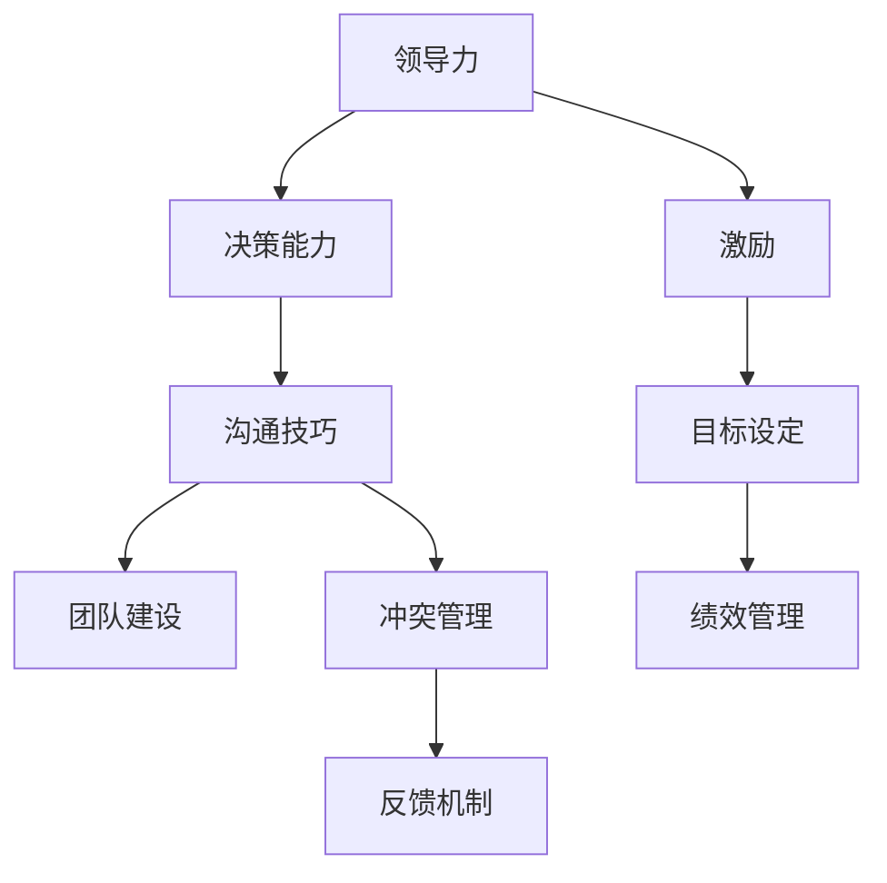
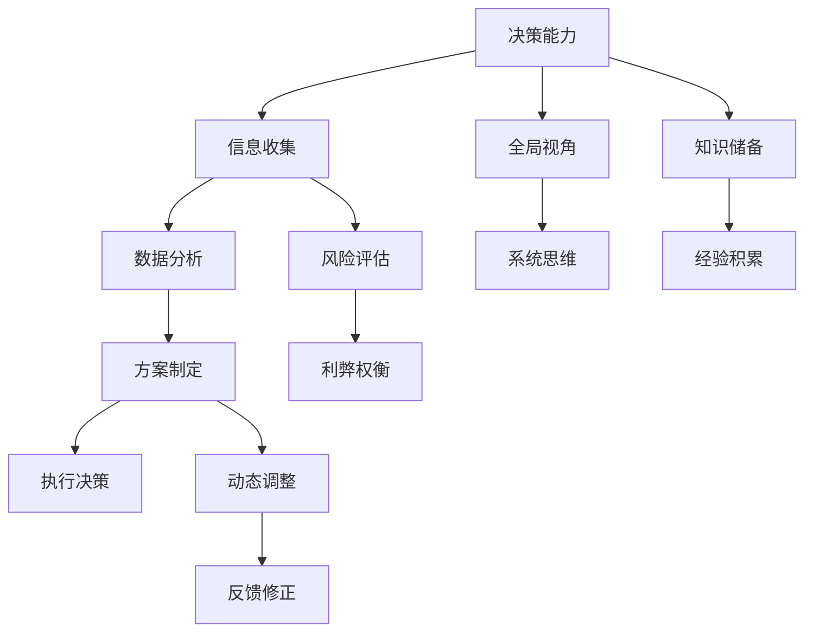

                 

## 1. 背景介绍

管理，作为一门跨学科的学问，长期以来一直是商业、政府和企业组织关注的重点。其核心在于通过整合和协调各种资源，实现组织目标的最大化。然而，随着经济社会的快速发展，管理理论和方法也在不断演进，新的理念和技术不断涌现。其中，优秀管理者与普通管理者的差异，是一个常被提及但常常被误解的话题。本文将通过系统梳理管理学的理论，结合实际案例，探讨优秀管理者与普通管理者的关键差异，并对未来管理理论的发展趋势进行展望。

## 2. 核心概念与联系

### 2.1 核心概念概述

优秀管理者与普通管理者的差异，涉及到多个核心概念，包括但不限于领导力、决策能力、沟通技巧、团队建设等。

**领导力**：是指领导者所具有的引导、激励和组织的能力，是优秀管理者最基本的核心素养。优秀管理者通过以身作则，激发团队成员的潜能，推动团队向前发展。

**决策能力**：涉及如何收集信息、分析利弊、制定并执行决策，是管理者最重要的技能之一。优秀管理者能够从全局视角做出合理的决策，引导团队迈向成功。

**沟通技巧**：管理者的沟通能力直接影响到信息的传递和团队的协作。优秀管理者擅长倾听，能够清晰、准确地表达自己的观点，并有效理解团队成员的需求和意见。

**团队建设**：管理者需协调团队成员之间的冲突，通过有效沟通和激励，打造高效合作的团队。优秀管理者能够识别和培养团队的核心人才，使团队充分发挥其潜力。

这些核心概念之间的关系可以通过以下Mermaid流程图来展示：



该图展示了领导力、决策能力、沟通技巧、团队建设之间的联系。激励、目标设定、绩效管理、冲突管理、反馈机制等具体实践活动，也都在这一关系网络中发挥作用。

### 2.2 核心概念原理和架构的 Mermaid 流程图



## 3. 核心算法原理 & 具体操作步骤

### 3.1 算法原理概述

优秀管理者与普通管理者的差异，本质上是通过一系列算法和操作步骤，将核心概念转化为具体的管理实践。这些算法和操作步骤，可以简单概括为以下几个步骤：

1. **目标设定**：明确组织目标，并根据目标调整策略。
2. **资源配置**：合理配置和优化资源，确保资源的最大效用。
3. **团队激励**：通过激励措施，激发团队成员的积极性和创造力。
4. **绩效评估**：定期评估团队和个人的绩效，提供反馈和改进建议。
5. **风险管理**：识别和管理潜在的风险，确保项目顺利进行。

### 3.2 算法步骤详解

#### 步骤一：目标设定

目标设定是优秀管理的起点。优秀管理者通过SMART原则（Specific, Measurable, Achievable, Relevant, Time-bound），确保目标的明确性和可行性。

- **具体性(Specific)**：明确任务的具体内容。
- **可衡量性(Measurable)**：设定可量化的指标，便于评估进展。
- **可实现性(Achievable)**：确保目标是现实可行的。
- **相关性(Relevant)**：确保目标与组织战略相一致。
- **时限性(Time-bound)**：设定明确的完成期限。

#### 步骤二：资源配置

资源配置包括人力、财力、物力和信息资源的分配。优秀管理者会根据目标和任务，合理配置资源，避免资源浪费。

- **人力配置**：根据任务需求，合理分配团队成员的工作，确保每个人都能发挥最大效能。
- **财力配置**：合理安排预算，确保项目资金的充足和有效使用。
- **物力配置**：根据项目需求，合理选择和采购所需的设备和材料。
- **信息资源配置**：确保信息的流通和共享，建立高效的沟通渠道。

#### 步骤三：团队激励

激励机制是优秀管理者的重要工具。通过奖励和认可，激发团队成员的积极性和创造力。

- **物质激励**：如奖金、晋升等，满足团队成员的物质需求。
- **精神激励**：如表彰、荣誉称号等，满足团队成员的精神需求。
- **目标激励**：设定具有挑战性的目标，激发团队成员的内在动力。
- **环境激励**：营造积极向上的工作氛围，增强团队凝聚力。

#### 步骤四：绩效评估

绩效评估是优秀管理者监督和改进的重要手段。通过定期评估团队和个人的表现，提供反馈和改进建议。

- **评估指标**：设定明确的绩效指标，如销售额、生产效率、客户满意度等。
- **评估方法**：采用定量和定性相结合的方法，综合评估团队和个人的表现。
- **反馈机制**：提供及时、准确的反馈，帮助团队成员改进工作。
- **改进措施**：根据评估结果，制定具体的改进措施，提升团队绩效。

#### 步骤五：风险管理

风险管理是优秀管理者预防和应对不确定性的重要手段。通过识别和管理潜在的风险，确保项目顺利进行。

- **风险识别**：通过数据和分析，识别潜在的风险因素。
- **风险评估**：评估风险的概率和影响，确定风险等级。
- **风险控制**：制定风险应对策略，如风险规避、减轻、转移等。
- **风险监测**：持续监测风险状况，及时调整策略。

### 3.3 算法优缺点

#### 优点

1. **系统性**：通过明确的目标设定和资源配置，优秀管理者的决策更加系统化和全面化。
2. **激励性强**：通过合理的激励机制，激发团队成员的积极性和创造力。
3. **风险控制**：通过有效的风险管理，减少不确定性，确保项目顺利进行。
4. **绩效提升**：通过定期的绩效评估和反馈，持续改进团队绩效。

#### 缺点

1. **资源消耗高**：系统化的管理需要投入大量的人力和物力，成本较高。
2. **执行复杂**：多步骤的管理流程，需要管理者具备较高的执行力和协调能力。
3. **灵活性不足**：固定的流程和步骤，可能难以应对突发情况和变化。

### 3.4 算法应用领域

优秀管理者的算法和操作步骤，适用于各种组织和行业。无论是在企业、政府，还是在非营利组织中，这些方法和技巧都能帮助管理者实现更高的绩效和目标。

- **企业**：通过系统化的管理，提升企业的运营效率和市场竞争力。
- **政府**：通过有效的风险管理和绩效评估，提升政府的治理能力和服务水平。
- **非营利组织**：通过合理的资源配置和团队激励，提升组织的执行力和影响力。

## 4. 数学模型和公式 & 详细讲解 & 举例说明

### 4.1 数学模型构建

优秀管理者的决策过程，可以通过以下数学模型来描述：

- **目标函数**：$$
  \text{Maximize} \quad \sum_{i=1}^n f_i(x)
$$
  其中，$f_i(x)$表示第$i$个目标的评估函数，$x$表示决策变量。

- **约束条件**：$$
  g_i(x) \leq 0 \quad (i=1,2,...,m) 
  $$
  $$
  h_i(x) = 0 \quad (i=1,2,...,p) 
  $$
  其中，$g_i(x)$表示第$i$个约束条件，$h_i(x)$表示等式约束条件。

### 4.2 公式推导过程

- **目标函数推导**：通过设定具体的目标，构建目标函数。如销售目标$f_1(x) = 1000x_1 + 1500x_2$，其中$x_1$和$x_2$分别表示不同产品的产量。
- **约束条件推导**：根据资源的限制和实际条件，构建约束条件。如劳动力限制$g_1(x) = 5x_1 + 7x_2 \leq 100$，表示总工时不能超过100小时。

### 4.3 案例分析与讲解

以一家制造企业为例，通过构建数学模型，进行最优资源配置：

1. **目标函数**：最大化利润$$
  \text{Maximize} \quad 0.2x_1 + 0.1x_2 - 100x_3
  $$
  其中$x_1$表示产品A的生产量，$x_2$表示产品B的生产量，$x_3$表示库存成本。

2. **约束条件**：
  - 生产能力约束：$2x_1 + 3x_2 \leq 100$
  - 库存限制：$x_1 \geq 0, x_2 \geq 0, x_3 \geq 0$

通过求解上述优化问题，得到最优的生产计划，最大化企业的利润。

## 5. 项目实践：代码实例和详细解释说明

### 5.1 开发环境搭建

为了进行实际的资源配置优化，我们需要搭建Python开发环境。以下是在Python环境中使用PuLP库进行线性规划的配置步骤：

1. **安装PuLP库**：
```bash
pip install pulp
```

2. **安装CPLEX库**：
```bash
pip install cplex
```

3. **创建Python脚本**：
```python
from pulp import LpProblem, LpVariable, lpSum

# 创建优化问题
problem = LpProblem("Resource_Optimization", LpMaximize)

# 定义决策变量
x1 = LpVariable("x1", 0, 100, LpInteger)
x2 = LpVariable("x2", 0, 100, LpInteger)

# 添加目标函数
problem += 0.2*x1 + 0.1*x2 - 100

# 添加约束条件
problem += 2*x1 + 3*x2 <= 100

# 求解优化问题
problem.solve()

# 输出结果
if problem.status == LpProblem.OPTIMAL:
    print(f"最优解：x1 = {x1.value()}, x2 = {x2.value()}, 利润 = {problem.objective.value()}")
else:
    print("无解")
```

### 5.2 源代码详细实现

在上述代码中，我们使用了PuLP库的线性规划功能，构建了一个简单的优化问题。具体步骤如下：

1. **创建优化问题**：定义问题的目标和变量类型。
2. **定义决策变量**：根据问题的需求，定义决策变量。
3. **添加目标函数**：根据目标函数，设置优化目标。
4. **添加约束条件**：根据约束条件，设置变量之间的限制。
5. **求解优化问题**：使用CPLEX库求解优化问题。
6. **输出结果**：根据求解结果，输出最优解。

### 5.3 代码解读与分析

在实际项目中，可能需要根据具体需求调整模型。例如，增加更多的决策变量和约束条件，或使用其他优化算法。

1. **决策变量**：通过设定决策变量，将实际问题转化为数学模型。如在上述代码中，$x_1$和$x_2$分别表示产品A和产品B的生产量。
2. **目标函数**：通过目标函数的构建，明确优化目标。如在上述代码中，最大化利润$0.2x_1 + 0.1x_2 - 100$。
3. **约束条件**：通过约束条件的设定，限制决策变量的取值范围。如在上述代码中，$2x_1 + 3x_2 \leq 100$表示生产能力的限制。

通过Python代码，可以方便地进行优化问题的求解和分析。这种编程方式，能够帮助我们更加直观地理解优化问题的解法。

### 5.4 运行结果展示

通过运行上述代码，可以得到最优的生产计划和利润。例如，在上述代码中，假设求解得到$x_1 = 40, x_2 = 30$，则最优利润为$200$。

## 6. 实际应用场景

### 6.1 制造业资源配置

制造业是优秀管理者的典型应用场景之一。通过优化生产计划，可以实现原材料的最优采购和产品的高效生产，降低成本，提升利润。

以一家汽车制造企业为例，通过线性规划优化生产资源配置，可以实现以下目标：

1. **生产成本最小化**：优化原材料采购和生产计划，降低成本。
2. **产品库存管理**：通过最优库存策略，减少库存成本。
3. **市场响应速度**：提高生产灵活性，快速响应市场需求变化。

### 6.2 物流公司路线规划

物流公司需要优化运输路线，以实现最优的运输效率和成本控制。优秀管理者通过线性规划，可以有效规划物流路线，提升运输效率和降低成本。

以一家物流公司为例，通过线性规划优化路线，可以实现以下目标：

1. **运输成本最小化**：优化运输路线，降低运输成本。
2. **运输时间最短化**：通过优化路线，提升运输速度。
3. **货物安全保障**：通过合理的路线规划，保障货物的安全运输。

### 6.3 金融公司投资组合管理

金融公司需要管理投资组合，以实现最优的投资收益和风险控制。优秀管理者通过线性规划，可以优化投资组合，提升收益和降低风险。

以一家金融公司为例，通过线性规划优化投资组合，可以实现以下目标：

1. **收益最大化**：通过最优投资策略，实现收益最大化。
2. **风险最小化**：通过合理的资产配置，降低投资风险。
3. **资产流动性管理**：通过优化资产配置，提升资产流动性。

## 7. 工具和资源推荐

### 7.1 学习资源推荐

为了深入了解优秀管理者的理论和实践，以下是一些推荐的资源：

1. **《管理学》课程**：通过系统学习管理学课程，掌握管理学的基本理论和实践方法。
2. **《领导力》书籍**：阅读经典领导力书籍，学习优秀管理者的领导技巧和方法。
3. **《运营管理》书籍**：学习运营管理的理论和方法，提升资源配置和运营效率。
4. **《风险管理》书籍**：了解风险管理的理论和方法，提升风险控制能力。
5. **《项目管理》书籍**：掌握项目管理的方法和技巧，提升项目执行力和效率。

### 7.2 开发工具推荐

为了更好地进行项目管理和管理优化，以下是一些推荐的开发工具：

1. **Microsoft Project**：项目管理工具，帮助管理者制定和跟踪项目计划。
2. **Trello**：项目管理工具，帮助管理者管理任务和进度。
3. **Tableau**：数据可视化工具，帮助管理者进行数据分析和可视化。
4. **GanttPro**：项目管理工具，帮助管理者优化资源配置和任务安排。
5. **JIRA**：项目管理工具，帮助管理者进行缺陷管理和敏捷开发。

### 7.3 相关论文推荐

为了深入了解优秀管理者的理论和实践，以下是一些推荐的论文：

1. **《管理学的演进》**：探讨管理学的历史和发展，了解管理理论的演变。
2. **《优秀管理者的特质》**：通过实证研究，分析优秀管理者的特质和行为。
3. **《领导力与管理效果》**：研究领导力对管理效果的影响，提供实证依据。
4. **《风险管理与不确定性》**：研究风险管理理论和方法，提升风险控制能力。
5. **《项目管理与绩效提升》**：探讨项目管理的理论和方法，提升项目执行力和效率。

## 8. 总结：未来发展趋势与挑战

### 8.1 研究成果总结

本文通过系统梳理管理学的理论，结合实际案例，探讨了优秀管理者与普通管理者的关键差异，并对未来管理理论的发展趋势进行展望。通过分析优秀管理者的领导力、决策能力、沟通技巧、团队建设等核心概念，提出了一系列的算法和操作步骤，帮助管理者实现更好的绩效和目标。

### 8.2 未来发展趋势

展望未来，优秀管理者的理论和实践将不断演进，呈现以下趋势：

1. **数字化转型**：随着数字化技术的普及，管理者和组织将更加依赖数据和算法，进行更加精细化的管理。
2. **跨领域融合**：管理学的理论和实践将与其他学科进行更深层次的融合，如经济学、心理学、工程学等。
3. **可持续管理**：优秀管理者的理论和实践将更加注重可持续发展，关注社会责任和环境保护。
4. **全球化管理**：随着全球化的发展，管理者的理论和实践将更加注重国际化和跨文化管理。

### 8.3 面临的挑战

尽管优秀管理者的理论和实践在不断演进，但在迈向更加智能化、普适化应用的过程中，仍面临诸多挑战：

1. **复杂性增加**：随着组织规模的扩大和复杂性的增加，优秀管理者的决策过程变得更加复杂。
2. **不确定性增加**：在快速变化的环境中，优秀管理者需要具备更高的灵活性和应变能力。
3. **人才管理**：如何培养和吸引优秀人才，并充分发挥其潜力，将是优秀管理者面临的重要挑战。
4. **技术变革**：如何有效利用新兴技术，如人工智能、大数据等，提升管理效率，将是优秀管理者的重要课题。

### 8.4 研究展望

面对优秀管理者的挑战，未来的研究需要在以下几个方面寻求新的突破：

1. **数字化管理**：通过数字化技术，提升管理的精准性和效率，实现更加精细化的管理。
2. **跨学科研究**：通过跨学科研究，整合不同学科的知识和方法，提升管理的科学性和系统性。
3. **人才培养**：建立系统的培养体系，提升管理者的领导力、决策能力和技术素养。
4. **技术应用**：将先进的技术，如人工智能、大数据、区块链等，应用于管理实践，提升管理效率和效果。

## 9. 附录：常见问题与解答

### Q1: 如何培养优秀管理者的领导力？

A: 领导力的培养需要多方面的努力，包括：

1. **自我认知**：了解自己的优缺点，发挥自己的长处，改进自己的短处。
2. **学习借鉴**：通过学习经典领导力理论和实践案例，借鉴优秀管理者的经验和做法。
3. **实践锻炼**：通过实际工作中的挑战和机会，锻炼领导能力。
4. **团队建设**：通过建立高效的团队，培养领导者的协作能力和激励能力。

### Q2: 优秀管理者如何制定合理的目标？

A: 制定合理的目标需要遵循SMART原则：

1. **具体性(Specific)**：明确目标的具体内容，避免模糊不清。
2. **可衡量性(Measurable)**：设定可量化的指标，便于评估进展。
3. **可实现性(Achievable)**：确保目标是现实可行的。
4. **相关性(Relevant)**：确保目标与组织战略相一致。
5. **时限性(Time-bound)**：设定明确的完成期限。

### Q3: 优秀管理者如何优化资源配置？

A: 优化资源配置需要：

1. **需求分析**：明确项目需求，合理配置资源。
2. **成本控制**：通过预算和资源管理，控制成本。
3. **效率提升**：通过优化流程和工具，提升资源利用效率。
4. **风险管理**：识别和管理潜在的风险，确保项目顺利进行。

### Q4: 优秀管理者如何进行绩效评估？

A: 绩效评估需要：

1. **设定指标**：根据项目目标，设定明确的绩效指标。
2. **数据收集**：收集相关数据，进行客观评估。
3. **结果分析**：通过数据分析，评估绩效表现。
4. **反馈改进**：根据评估结果，提供反馈和改进建议。

### Q5: 优秀管理者如何管理风险？

A: 管理风险需要：

1. **风险识别**：通过数据分析，识别潜在的风险因素。
2. **风险评估**：评估风险的概率和影响，确定风险等级。
3. **风险控制**：制定风险应对策略，如风险规避、减轻、转移等。
4. **风险监测**：持续监测风险状况，及时调整策略。

---

作者：禅与计算机程序设计艺术 / Zen and the Art of Computer Programming

