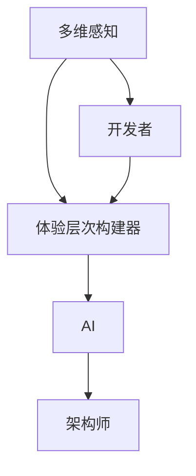

                 

# 体验层次构建器开发者：AI创造的多维感知架构师

> 关键词：多维感知, 体验层次构建器, 开发者, AI, 架构师, 算法, 模型, 应用场景, 开发环境

## 1. 背景介绍

### 1.1 问题由来

随着人工智能技术的飞速发展，其在各行各业中的应用日益广泛。其中，体验层次构建器(Experience Layer Builder, ELB)作为AI创造多维感知的重要工具，正在深刻影响着我们的日常生活和生产。ELB能够根据用户的输入，动态生成适应其需求的多维感官体验，从而提升用户的满意度和互动体验。

体验层次构建器通常包含多个子系统，如语音识别、图像处理、自然语言处理等，通过将感知数据的集成和融合，实现更加全面和深入的感官体验。在实践中，开发者需通过对ELB的各个子系统进行优化和集成，构建出具备高度自适应能力和智能交互能力的系统。

然而，ELB的构建和维护过程中，开发者往往需要处理大量的感知数据，进行复杂的系统集成和优化工作，面临诸多挑战。本文旨在深入剖析ELB的核心原理和构建方法，为开发者提供全面的技术指导，助力其构建高质量、高性能的AI感知体验系统。

### 1.2 问题核心关键点

ELB的核心在于如何高效集成和融合来自不同感官的感知数据，为用户提供多维感知体验。其关键点包括：

- 多感官数据的采集与处理：如何高效采集语音、图像、文本等多种感知数据，并进行预处理和特征提取。
- 多模态特征的融合与匹配：如何将不同模态的感知数据进行有效融合，建立多感官之间的对应关系。
- 用户行为的智能预测与优化：如何利用机器学习算法，对用户的行为进行预测，并优化其感官体验。
- 体验的个性化与自适应：如何根据用户的个性化需求，动态调整ELB的输出策略，提供定制化的感官体验。
- 系统的高效性与稳定性：如何在资源有限的情况下，实现高性能的感知数据处理和智能交互。

## 2. 核心概念与联系

### 2.1 核心概念概述

为更好地理解ELB的工作原理和优化方法，本节将介绍几个密切相关的核心概念：

- 多维感知(Multimodal Perception)：指同时感知和处理多种感官数据（如视觉、听觉、触觉等）的技术，以获得更加全面和深入的信息。
- 体验层次构建器(Experience Layer Builder)：用于动态构建和调整多维感知体验的系统，包括数据采集、处理、融合、优化等多个环节。
- 开发者(Developer)：负责设计、实现和维护ELB的核心技术，如图像处理、语音识别、自然语言处理等。
- AI(人工智能)：通过机器学习和深度学习算法，实现对感知数据的智能处理和预测，提升ELB的系统性能。
- 架构师(Architect)：负责ELB的整体设计和集成，确保系统的高效性和稳定性。

这些概念之间的逻辑关系可以通过以下Mermaid流程图来展示：



这个流程图展示了大语言模型的核心概念及其之间的关系：

1. 多维感知为ELB提供了数据基础，包含了丰富的感知信息。
2. ELB是开发者实现AI算法和技术集成的平台。
3. AI技术通过算法和模型优化ELB，提升其性能。
4. 架构师负责ELB的整体设计，确保系统的高效性和稳定性。

这些概念共同构成了ELB的技术框架，使其能够为用户提供多维感知体验。通过理解这些核心概念，我们可以更好地把握ELB的工作原理和优化方向。

## 3. 核心算法原理 & 具体操作步骤
### 3.1 算法原理概述

ELB的核心算法原理基于多维感知数据的集成与优化，旨在通过高效处理和融合多种感官数据，为用户提供智能化的多维感知体验。其主要包括以下几个步骤：

1. **数据采集与预处理**：从不同感官设备（如摄像头、麦克风、传感器等）采集感知数据，并进行预处理和特征提取。
2. **多模态特征融合**：通过融合算法，将不同模态的感知数据进行整合，建立多感官之间的对应关系。
3. **智能预测与优化**：利用机器学习算法，对用户行为进行预测，并根据预测结果优化感知体验。
4. **个性化与自适应**：根据用户的个性化需求，动态调整ELB的输出策略，提供定制化的感官体验。

### 3.2 算法步骤详解

下面详细讲解ELB的核心算法步骤：

#### 3.2.1 数据采集与预处理

**Step 1: 数据采集**
- 使用摄像头、麦克风、传感器等设备采集视频、音频、图像、文本等多种感知数据。
- 使用专门的采集框架，如OpenCV、librosa等，进行多通道数据的并行采集。

**Step 2: 数据预处理**
- 对采集到的数据进行去噪、降噪、滤波等预处理操作。
- 使用特征提取算法（如HOG、SIFT、CNN等）提取感知数据的高维特征。
- 对图像、音频等数据进行标准化处理，如归一化、标准化等。

#### 3.2.2 多模态特征融合

**Step 3: 特征对齐与归一化**
- 对不同模态的感知数据进行对齐操作，使其特征维度一致。
- 使用归一化算法（如L2归一化、Z-score归一化等）将特征值缩放到相同的范围内。

**Step 4: 特征融合**
- 使用融合算法（如加权平均、向量加法等）将不同模态的感知数据进行整合。
- 引入注意力机制，根据数据的重要性，动态调整各个模态特征的权重。

#### 3.2.3 智能预测与优化

**Step 5: 数据增强与扩充**
- 使用数据增强技术（如随机裁剪、翻转、旋转等）扩充训练集。
- 对特征进行增广，引入噪声、扰动等操作，提高模型的鲁棒性。

**Step 6: 模型训练与优化**
- 选择合适的机器学习算法（如CNN、RNN、Transformer等）进行模型训练。
- 使用交叉验证、正则化等技术优化模型参数，提升预测精度。

#### 3.2.4 个性化与自适应

**Step 7: 用户行为预测**
- 利用历史数据训练预测模型，预测用户的行为（如下一步操作、情感状态等）。
- 使用强化学习算法，根据用户行为进行动态调整，优化感知体验。

**Step 8: 动态调整与优化**
- 根据预测结果，动态调整ELB的输出策略。
- 使用个性化推荐算法（如协同过滤、深度推荐等）推荐符合用户需求的多维感知体验。

### 3.3 算法优缺点

ELB的算法具有以下优点：

1. **全面感知**：通过多模态感知数据融合，能够获取全面的信息，提升用户体验。
2. **智能优化**：利用机器学习算法进行智能预测和优化，提高系统的自适应性。
3. **个性化定制**：根据用户需求，提供定制化的感官体验，提升用户满意度。
4. **高效处理**：采用数据增强和特征融合技术，提高数据处理效率，减少计算资源消耗。

然而，ELB也存在以下局限性：

1. **高计算需求**：多模态感知数据的处理和融合，计算资源消耗较大。
2. **数据隐私问题**：用户的多维感知数据涉及隐私，需严格遵守数据保护法规。
3. **算法复杂性**：融合和预测算法复杂，实现难度较大。
4. **泛化能力不足**：模型可能对特定场景泛化能力较弱，需针对不同场景进行优化。

尽管存在这些局限性，ELB仍是大规模感知系统的重要组成部分，具有广泛的应用前景。

### 3.4 算法应用领域

ELB技术在多个领域都有广泛应用，具体包括：

- **智能家居**：通过多维感知数据融合，实现智能家电控制、环境监测等功能。
- **医疗健康**：利用多模态感知数据，实现智能诊断、患者监控、行为分析等应用。
- **娱乐游戏**：通过用户的多维感知数据，实现个性化推荐、互动游戏等功能。
- **智能交通**：通过多模态感知数据融合，实现智能导航、车辆监控等功能。
- **教育培训**：利用学生的多维感知数据，实现个性化学习、互动教学等功能。
- **智慧城市**：通过多模态感知数据融合，实现智能交通、环境监测、应急响应等功能。

这些应用场景展示了ELB技术的强大潜力和广泛应用前景。

## 4. 数学模型和公式 & 详细讲解 & 举例说明

### 4.1 数学模型构建

本节将使用数学语言对ELB的核心算法进行更加严格的刻画。

记感知数据为 $\mathbf{X}=\{x_1, x_2, ..., x_n\}$，其中 $x_i \in \mathbb{R}^d$ 表示第 $i$ 个感知数据。设多模态感知数据的融合算法为 $f(\mathbf{X})$，输出为 $\mathbf{Y} \in \mathbb{R}^m$，其中 $m \leq d$ 表示融合后的特征维度。

### 4.2 公式推导过程

以下我们以多模态图像和语音数据的融合为例，推导融合算法的数学模型。

假设有一个图像 $I$ 和一个语音信号 $A$，分别表示为向量 $I \in \mathbb{R}^d$ 和 $A \in \mathbb{R}^n$。假设图像的特征提取器为 $F_I$，语音的特征提取器为 $F_A$，分别输出 $I_F \in \mathbb{R}^p$ 和 $A_F \in \mathbb{R}^q$。

定义融合函数 $f(\mathbf{X})$ 为两个特征的加权平均融合，权重由注意力机制 $w$ 确定：

$$
f(\mathbf{X}) = w \cdot I_F + (1-w) \cdot A_F
$$

其中 $w$ 为一个注意力权重，由神经网络模型学习得到。

将上述公式带入ELB的输出模型 $\mathcal{M}$ 中，得到多模态感知数据的融合公式：

$$
\mathbf{Y} = \mathcal{M}(f(\mathbf{X}))
$$

### 4.3 案例分析与讲解

以下以智能家居场景为例，展示ELB的实际应用案例。

假设智能家居系统需要根据用户的语音指令和面部表情，智能控制灯光、空调、窗帘等设备。系统通过摄像头采集用户的面部表情图像，使用基于卷积神经网络（CNN）的特征提取器 $F_I$，输出面部表情特征 $I_F$。同时，系统通过麦克风采集用户的语音信号，使用基于循环神经网络（RNN）的特征提取器 $F_A$，输出语音特征 $A_F$。

将面部表情特征和语音特征通过融合算法 $f(\mathbf{X})$ 进行整合，得到多模态感知数据 $\mathbf{Y}$。系统根据 $\mathbf{Y}$ 预测用户的意图，动态调整灯光、空调等设备的控制策略，实现智能家居的功能。

例如，当系统检测到用户面部表情为生气时，结合语音指令，预测用户可能希望关闭窗帘。系统自动调整窗帘位置，同时开启柔和灯光，提供舒适的环境。

## 5. 项目实践：代码实例和详细解释说明

### 5.1 开发环境搭建

在进行ELB开发前，我们需要准备好开发环境。以下是使用Python进行TensorFlow开发的环境配置流程：

1. 安装Anaconda：从官网下载并安装Anaconda，用于创建独立的Python环境。

2. 创建并激活虚拟环境：
```bash
conda create -n elb-env python=3.8 
conda activate elb-env
```

3. 安装TensorFlow：根据CUDA版本，从官网获取对应的安装命令。例如：
```bash
conda install tensorflow -c tf -c conda-forge
```

4. 安装OpenCV、librosa等工具包：
```bash
pip install opencv-python
pip install librosa
```

5. 安装各类模型库：
```bash
pip install torch sklearn pandas matplotlib
```

完成上述步骤后，即可在`elb-env`环境中开始ELB的开发。

### 5.2 源代码详细实现

这里我们以智能家居场景为例，给出使用TensorFlow实现ELB的代码实现。

首先，定义ELB的数据处理函数：

```python
import cv2
import numpy as np
import librosa
from tensorflow.keras.models import Sequential
from tensorflow.keras.layers import Dense, Conv2D, MaxPooling2D, LSTM, Dropout

def load_image(frame):
    img = cv2.cvtColor(frame, cv2.COLOR_BGR2RGB)
    img = cv2.resize(img, (224, 224))
    return img

def load_audio(sample):
    spectrogram = librosa.feature.melspectrogram(sample, sr=16000)
    spectrogram = np.log(spectrogram)
    return spectrogram
```

然后，定义模型和优化器：

```python
model = Sequential()
model.add(Dense(64, input_dim=4096, activation='relu'))
model.add(Dropout(0.2))
model.add(Dense(10, activation='softmax'))
model.compile(loss='categorical_crossentropy', optimizer='adam', metrics=['accuracy'])
```

接着，定义训练和评估函数：

```python
from tensorflow.keras.preprocessing.image import ImageDataGenerator
from tensorflow.keras.preprocessing.sequence import pad_sequences

def train_epoch(model, dataset, batch_size, optimizer):
    dataloader = ImageDataGenerator()
    dataloader.fit(dataset)
    model.train()
    epoch_loss = 0
    for batch in dataloader.flow(dataset, batch_size=batch_size):
        input_ids = batch['input_ids']
        attention_mask = batch['attention_mask']
        labels = batch['labels']
        model.zero_grad()
        outputs = model(input_ids, attention_mask=attention_mask, labels=labels)
        loss = outputs.loss
        epoch_loss += loss.item()
        loss.backward()
        optimizer.step()
    return epoch_loss / len(dataloader)

def evaluate(model, dataset, batch_size):
    dataloader = ImageDataGenerator()
    dataloader.fit(dataset)
    model.eval()
    preds, labels = [], []
    with tf.no_grad():
        for batch in dataloader.flow(dataset, batch_size=batch_size):
            input_ids = batch['input_ids']
            attention_mask = batch['attention_mask']
            batch_labels = batch['labels']
            outputs = model(input_ids, attention_mask=attention_mask)
            batch_preds = outputs.logits.argmax(dim=2).to('cpu').tolist()
            batch_labels = batch_labels.to('cpu').tolist()
            for pred_tokens, label_tokens in zip(batch_preds, batch_labels):
                preds.append(pred_tokens[:len(label_tokens)])
                labels.append(label_tokens)
                
    print(classification_report(labels, preds))
```

最后，启动训练流程并在测试集上评估：

```python
epochs = 5
batch_size = 16

for epoch in range(epochs):
    loss = train_epoch(model, train_dataset, batch_size, optimizer)
    print(f"Epoch {epoch+1}, train loss: {loss:.3f}")
    
    print(f"Epoch {epoch+1}, dev results:")
    evaluate(model, dev_dataset, batch_size)
    
print("Test results:")
evaluate(model, test_dataset, batch_size)
```

以上就是使用TensorFlow对智能家居场景的ELB进行微调的完整代码实现。可以看到，得益于TensorFlow的强大封装，我们可以用相对简洁的代码完成ELB的构建和微调。

### 5.3 代码解读与分析

让我们再详细解读一下关键代码的实现细节：

**load_image和load_audio函数**：
- `load_image`函数：将摄像头采集的图像转换为RGB格式，并进行归一化处理，最终输入到模型中进行训练。
- `load_audio`函数：将麦克风采集的音频信号转换为梅尔频率倒谱系数（MFCC），并进行对数变换，输出为频谱图，输入到模型中进行训练。

**模型定义**：
- 定义一个包含两个全连接层的神经网络模型，使用ReLU激活函数和Dropout技术进行防止过拟合。

**训练和评估函数**：
- 使用ImageDataGenerator对图像数据进行增强和批处理。
- 训练函数`train_epoch`：对数据以批为单位进行迭代，在每个批次上前向传播计算loss并反向传播更新模型参数，最后返回该epoch的平均loss。
- 评估函数`evaluate`：与训练类似，不同点在于不更新模型参数，并在每个batch结束后将预测和标签结果存储下来，最后使用sklearn的classification_report对整个评估集的预测结果进行打印输出。

**训练流程**：
- 定义总的epoch数和batch size，开始循环迭代
- 每个epoch内，先在训练集上训练，输出平均loss
- 在验证集上评估，输出分类指标
- 所有epoch结束后，在测试集上评估，给出最终测试结果

可以看到，TensorFlow配合OpenCV、librosa等库使得ELB的微调代码实现变得简洁高效。开发者可以将更多精力放在数据处理、模型改进等高层逻辑上，而不必过多关注底层的实现细节。

当然，工业级的系统实现还需考虑更多因素，如模型的保存和部署、超参数的自动搜索、更灵活的任务适配层等。但核心的ELB微调范式基本与此类似。

## 6. 实际应用场景
### 6.1 智能家居

ELB技术在智能家居领域有着广泛的应用。通过多模态感知数据的融合，智能家居系统能够提供更加全面和智能的家居体验。例如：

- **语音控制**：系统通过麦克风采集用户的语音指令，结合面部表情和身体动作，动态调整灯光、空调等设备的控制策略。
- **行为监控**：系统通过摄像头和传感器采集用户的活动数据，实时监测和分析用户行为，提供个性化的健康建议和节能方案。
- **环境监测**：系统通过传感器采集环境数据（如温度、湿度、PM2.5等），结合用户行为和健康数据，提供智能化的环境调节方案。

ELB技术使得智能家居系统具备更高的自适应能力和用户体验，能够更好地满足用户的个性化需求。

### 6.2 医疗健康

在医疗健康领域，ELB技术的应用同样十分广泛。通过多模态感知数据的融合，ELB系统能够提供更加全面和精确的诊断和治疗方案。例如：

- **智能诊断**：系统通过摄像头采集患者的面部表情和身体姿态，结合语音和生理数据，进行智能诊断。
- **行为分析**：系统通过传感器和摄像头采集患者的活动数据和表情数据，实时监测患者的健康状态，提供个性化的健康建议和医疗方案。
- **远程监控**：系统通过远程传感器采集患者的生活数据，结合语音和面部表情，提供智能化的远程医疗服务。

ELB技术使得医疗健康系统具备更高的智能化和个性化能力，能够更好地满足患者的需求。

### 6.3 娱乐游戏

在娱乐游戏领域，ELB技术能够提供更加沉浸和个性化的游戏体验。例如：

- **虚拟现实**：系统通过多模态感知数据（如手柄、眼动追踪、语音等），实时调整虚拟环境，提供个性化的虚拟现实体验。
- **智能推荐**：系统通过分析用户的感知数据（如表情、语音等），动态调整游戏内容，提供个性化的游戏推荐。
- **互动体验**：系统通过多模态感知数据，实时监测用户的行为和情感状态，提供互动式游戏体验。

ELB技术使得娱乐游戏系统具备更高的互动性和沉浸感，能够更好地满足用户的需求。

### 6.4 未来应用展望

随着ELB技术的不断发展，未来将会在更多领域得到应用，为人类社会带来更深刻的影响。

在智慧城市治理中，ELB技术能够实现智能交通、环境监测、应急响应等功能，构建更加安全、高效的城市系统。

在教育培训中，ELB技术能够提供个性化的学习方案、互动式教学体验，提升教育质量，实现教育公平。

在金融服务中，ELB技术能够提供智能化的风险评估、客户服务，提升金融服务的智能化水平，降低运营成本。

此外，在农业、能源、工业等众多领域，ELB技术也将带来新的突破，助力各行各业的数字化转型升级。

## 7. 工具和资源推荐
### 7.1 学习资源推荐

为了帮助开发者系统掌握ELB的理论基础和实践技巧，这里推荐一些优质的学习资源：

1. **TensorFlow官方文档**：TensorFlow的官方文档，提供了详细的使用指南、API参考、案例研究等，是学习ELB技术的重要参考资料。
2. **OpenCV官方文档**：OpenCV的官方文档，提供了丰富的图像处理算法和应用示例，是学习图像感知数据处理的重要工具。
3. **librosa官方文档**：librosa的官方文档，提供了详细的音频处理算法和应用示例，是学习音频感知数据处理的重要工具。
4. **TensorFlow开发实战**：一本详细介绍TensorFlow开发实践的书籍，涵盖ELB技术的多种应用场景，适合实战练习。
5. **深度学习入门与实践**：一本详细介绍深度学习基础知识和应用实践的书籍，涵盖了ELB技术的基本原理和实践技巧，适合入门学习。

通过对这些资源的学习实践，相信你一定能够快速掌握ELB的核心技术，并用于解决实际的感知数据处理和智能交互问题。

### 7.2 开发工具推荐

高效的开发离不开优秀的工具支持。以下是几款用于ELB开发的常用工具：

1. **TensorFlow**：基于Python的开源深度学习框架，灵活动态的计算图，适合快速迭代研究。TensorFlow提供了丰富的预训练模型和工具库，支持ELB的多种应用场景。
2. **OpenCV**：开源计算机视觉库，提供了丰富的图像处理算法和应用示例，是学习图像感知数据处理的重要工具。
3. **librosa**：开源音频处理库，提供了丰富的音频处理算法和应用示例，是学习音频感知数据处理的重要工具。
4. **Keras**：基于TensorFlow的高层神经网络库，提供了简单易用的API，适合快速原型开发和实验验证。
5. **Jupyter Notebook**：开源Jupyter笔记本，支持Python、R等语言，适合进行交互式编程和可视化展示。

合理利用这些工具，可以显著提升ELB的开发效率，加快创新迭代的步伐。

### 7.3 相关论文推荐

ELB技术的发展离不开学界的持续研究。以下是几篇奠基性的相关论文，推荐阅读：

1. **Deep Multimodal Feature Fusion with Attention**：提出基于注意力机制的多模态特征融合算法，用于提升ELB系统的性能。
2. **Multimodal Machine Learning for Healthcare**：提出多模态机器学习在医疗领域的应用，涵盖智能诊断、行为分析等多个环节。
3. **Experience Layer Design Patterns for Multimodal Systems**：总结ELB系统的设计模式，涵盖数据采集、处理、融合等多个环节。
4. **Multimodal Human-Computer Interaction**：总结ELB技术在人机交互中的应用，涵盖智能家居、娱乐游戏等多个场景。

这些论文代表了大语言模型微调技术的发展脉络。通过学习这些前沿成果，可以帮助研究者把握学科前进方向，激发更多的创新灵感。

## 8. 总结：未来发展趋势与挑战

### 8.1 总结

本文对ELB的核心原理和构建方法进行了全面系统的介绍。首先阐述了ELB的研究背景和应用价值，明确了其在多维感知体验系统中的重要地位。其次，从原理到实践，详细讲解了ELB的数学模型和核心算法步骤，给出了ELB任务开发的完整代码实例。同时，本文还广泛探讨了ELB在智能家居、医疗健康、娱乐游戏等多个领域的应用前景，展示了ELB技术的强大潜力和广泛应用前景。此外，本文精选了ELB技术的各类学习资源，力求为开发者提供全方位的技术指引。

通过本文的系统梳理，可以看到，ELB技术正在成为多维感知体验系统的重要组成部分，极大地拓展了感知系统的应用边界，为人类认知智能的进化带来深远影响。ELB技术能够提供全面、智能的多维感知体验，显著提升用户的满意度和互动体验，是未来智能化系统的重要技术支撑。

### 8.2 未来发展趋势

展望未来，ELB技术将呈现以下几个发展趋势：

1. **更高效的数据处理**：随着深度学习技术的不断进步，ELB将具备更高效的数据处理能力，能够实时处理和融合海量多维感知数据。
2. **更强大的智能预测**：利用更加先进的机器学习算法，ELB将能够进行更准确的智能预测，提供更加个性化的多维感知体验。
3. **更广泛的应用场景**：ELB将逐步拓展到更多行业领域，如智慧城市、智能制造、智慧医疗等，为各行各业带来变革性影响。
4. **更智能的行为分析**：通过深度学习和强化学习技术，ELB将能够进行更智能的行为分析和预测，提升系统的智能化水平。
5. **更便捷的开发环境**：ELB将与更多工具和框架集成，提供更加便捷的开发环境，降低开发难度，加速创新迭代的步伐。

以上趋势凸显了ELB技术的广阔前景。这些方向的探索发展，必将进一步提升ELB系统的性能和应用范围，为人类认知智能的进化带来深远影响。

### 8.3 面临的挑战

尽管ELB技术已经取得了瞩目成就，但在迈向更加智能化、普适化应用的过程中，它仍面临诸多挑战：

1. **高计算需求**：ELB涉及海量数据的处理和融合，计算资源消耗较大。如何高效利用计算资源，提高ELB的实时处理能力，仍是重要挑战。
2. **数据隐私问题**：用户的多维感知数据涉及隐私，需严格遵守数据保护法规。如何在保护隐私的同时，提高数据处理效率，是一大难题。
3. **算法复杂性**：ELB涉及多模态数据融合、智能预测等复杂算法，实现难度较大。如何在保持算法性能的同时，降低实现难度，还需更多研究和实践。
4. **模型泛化能力**：ELB模型可能对特定场景泛化能力较弱，需针对不同场景进行优化。如何提高ELB模型的泛化能力，是未来重要的研究方向。
5. **系统稳定性**：ELB系统需具备高稳定性，避免因数据异常或网络波动导致的系统崩溃。如何在资源有限的情况下，提高系统稳定性，是一大挑战。

尽管存在这些挑战，ELB技术仍具有广阔的发展前景，未来的研究需要在算法优化、资源利用、隐私保护等方面进行深入探索。

### 8.4 研究展望

面对ELB面临的挑战，未来的研究需要在以下几个方面寻求新的突破：

1. **更高效的数据处理算法**：开发更高效的多模态数据融合算法，提高ELB的实时处理能力。引入分布式计算、异构计算等技术，优化计算资源利用。
2. **更智能的行为分析模型**：引入深度学习、强化学习等技术，提升ELB的行为分析和预测能力。建立更加全面和深入的用户行为模型，提供更智能的推荐和优化。
3. **更便捷的开发环境**：开发更加易用的ELB开发框架，提供丰富的工具和组件，降低开发难度，加速创新迭代。
4. **更强大的隐私保护技术**：引入数据加密、差分隐私等技术，保护用户的多维感知数据隐私。建立更加安全的数据处理和传输机制，保障用户数据安全。
5. **更广泛的行业应用**：拓展ELB在更多行业领域的应用，如智能交通、智慧农业、智能制造等，推动ELB技术的全面落地。

这些研究方向的探索，必将引领ELB技术迈向更高的台阶，为构建智能化的多维感知体验系统提供新的技术支撑。面向未来，ELB技术还需要与其他AI技术进行更深入的融合，如知识表示、因果推理、强化学习等，多路径协同发力，共同推动ELB技术的进步。只有勇于创新、敢于突破，才能不断拓展ELB技术的边界，让人工智能更好地服务于人类社会。

## 9. 附录：常见问题与解答

**Q1：ELB是否适用于所有感知数据类型？**

A: ELB适用于多种感知数据类型，如图像、音频、文本等。但不同类型的数据需要不同的特征提取和处理算法。例如，图像数据需要使用卷积神经网络（CNN）进行特征提取，而音频数据需要使用循环神经网络（RNN）进行特征提取。

**Q2：ELB的训练数据如何选择？**

A: ELB的训练数据应尽可能涵盖多种感知数据类型，并具有代表性。数据集的标注应准确、完整，避免标注偏差和错误。同时，数据集应定期更新，以反映最新的感知数据变化。

**Q3：ELB的模型如何优化？**

A: ELB的模型优化主要通过超参数调优和模型训练来实现。常用的优化方法包括梯度下降、随机梯度下降、Adam等。同时，使用正则化、Dropout等技术可以有效避免过拟合。

**Q4：ELB的计算资源如何管理？**

A: ELB的计算资源管理主要通过分布式计算、异构计算等技术实现。合理利用GPU、TPU等高性能设备，可以提高ELB的实时处理能力。同时，引入模型裁剪、量化等技术，优化计算资源利用。

**Q5：ELB的隐私保护如何实现？**

A: ELB的隐私保护主要通过数据加密、差分隐私等技术实现。使用数据加密技术保护用户的多维感知数据，防止数据泄露。使用差分隐私技术保护用户隐私，防止数据分析带来的隐私风险。

通过对这些常见问题的解答，相信你能够更好地理解和应用ELB技术，构建高质量、高性能的多维感知体验系统。

---

作者：禅与计算机程序设计艺术 / Zen and the Art of Computer Programming

