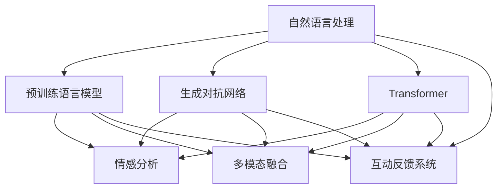

                 

# 体验的叙事性：AI驱动的个人故事创作

## 1. 背景介绍

### 1.1 问题由来
叙事性体验，尤其是人工智能(AI)驱动的个人故事创作，正逐渐成为内容创作者和用户关注的焦点。随着自然语言处理(NLP)技术的进步，AI已经能够在创作文本、生成对话、提供个性化推荐等方面展现卓越能力。然而，当前的AI系统仍然难以完全理解和把握人类情感、文化背景及叙事结构的复杂性。

### 1.2 问题核心关键点
AI驱动的个人故事创作涉及多个核心关键点：
1. **生成连贯与连贯性**：AI需生成符合语境的、逻辑上连贯的故事。
2. **情感共鸣**：AI故事创作需具备吸引读者注意和情感共鸣的能力。
3. **个性化与真实性**：AI故事创作应能反映个人特色，并提供真实的阅读体验。
4. **多模态数据融合**：融合图像、视频等多模态信息以增强故事叙述的丰富性。
5. **用户互动**：实现用户与AI故事创作系统的互动反馈，持续优化创作质量。

### 1.3 问题研究意义
AI驱动的个人故事创作，不仅能够极大地提升内容创作的效率，还能够在复杂情感表达、情节发展、文化背景等维度上提升故事的质量。通过结合现代AI技术，包括深度学习、生成对抗网络(GAN)、预训练语言模型(如BERT、GPT)等，AI故事创作正开启新的可能性。

## 2. 核心概念与联系

### 2.1 核心概念概述

为深入探讨AI驱动的个人故事创作，以下将介绍相关核心概念：

- **自然语言处理(NLP)**：专注于计算机如何理解和生成自然语言的技术。
- **预训练语言模型(PLMs)**：如BERT、GPT等，通过大量无标签文本数据预训练获得通用语言表示的模型。
- **生成对抗网络(GAN)**：一种生成模型，能够生成逼真样本的模型。
- **Transformer**：一种基于注意力机制的神经网络模型，广泛应用于NLP领域。
- **情感分析**：分析文本情感倾向的技术。
- **多模态融合**：融合文本、图像、音频等多源信息以提升叙述丰富性。
- **互动反馈系统**：实现用户与AI系统的互动与反馈，不断优化模型输出。

这些概念相互关联，共同构成AI故事创作的框架。以下Mermaid流程图展示了这些概念之间的联系：



## 3. 核心算法原理 & 具体操作步骤

### 3.1 算法原理概述

AI驱动的个人故事创作，本质上是一种基于预训练语言模型的生成式学习过程。该过程首先利用大规模无标签文本进行预训练，获得丰富的语言表示；随后，在特定任务（如生成故事、对话等）的少量标注数据上进行微调，优化模型的生成能力，使其能够创作连贯、有情感共鸣的故事。

具体来说，其核心流程包括以下几个步骤：
1. **数据收集与准备**：收集所需语料，并进行预处理。
2. **预训练模型选择**：选择合适的预训练语言模型，如BERT、GPT等。
3. **微调与优化**：使用标注数据对模型进行微调，优化故事生成能力。
4. **多模态融合**：融合文本与图像、音频等多模态数据，增强故事丰富性。
5. **用户互动反馈**：实现用户与AI系统的互动，持续优化创作质量。

### 3.2 算法步骤详解

**Step 1: 数据收集与准备**
- 收集故事创作所需的数据，如小说文本、对话记录、用户生成内容等。
- 进行文本清洗、分词、标注等预处理工作。
- 将数据划分为训练集、验证集和测试集。

**Step 2: 预训练模型选择与微调**
- 选择如BERT、GPT等预训练语言模型作为初始化参数。
- 使用标注数据进行微调，优化故事生成能力。
- 设计合适的损失函数，如交叉熵损失或序列损失。
- 使用AdamW等优化算法，设置合适的学习率和批大小。

**Step 3: 多模态融合**
- 将文本与图像、音频等多模态数据进行融合。
- 利用预训练语言模型提取文本特征，再使用图像/音频处理模型提取特征。
- 通过融合特征向量，生成包含多模态信息的故事。

**Step 4: 用户互动反馈**
- 实现用户与AI系统的互动界面，允许用户输入故事提示、修改故事情节等。
- 根据用户反馈调整模型参数，优化创作质量。
- 循环迭代，实现持续改进。

### 3.3 算法优缺点

AI驱动的个人故事创作方法有以下优点：
1. **高效性**：利用预训练语言模型，大幅提高故事生成效率。
2. **丰富性**：结合多模态数据，增强故事叙述的丰富性。
3. **互动性**：允许用户与AI系统互动，提升创作体验。
4. **可扩展性**：模型参数可以更新，适应不同场景和需求。

同时，该方法也存在一些局限：
1. **数据依赖**：需大量高质量标注数据，收集成本较高。
2. **理解限制**：难以完全理解和把握人类情感和文化背景。
3. **模型复杂性**：需要高水平的技术储备和计算资源。
4. **伦理问题**：生成内容可能包含偏见和有害信息。

尽管有这些局限，AI驱动的个人故事创作正逐渐成为内容创作的重要工具，为人工智能与人类文化的融合带来了新的可能。

### 3.4 算法应用领域

AI驱动的个人故事创作技术已在多个领域得到应用，例如：
- **文学创作**：辅助小说、散文等文学作品的创作。
- **影视制作**：生成剧本、对白和角色对话。
- **游戏开发**：创建游戏故事线、角色对话和任务描述。
- **教育培训**：生成教育内容、模拟对话和情境练习。
- **社交媒体**：生成个性化的帖子、故事和回复。

## 4. 数学模型和公式 & 详细讲解 & 举例说明

### 4.1 数学模型构建

AI驱动的个人故事创作涉及多个数学模型，以下以文本生成模型为例进行详细讲解。

- **模型结构**：一般基于Transformer架构，包含多个编码器和解码器层。
- **损失函数**：常用的有交叉熵损失和序列损失。

**Step 1: 模型定义**
- 定义模型架构，包括编码器、解码器、注意力机制等。
- 定义输入和输出数据的格式。

**Step 2: 损失函数计算**
- 计算模型输出与真实标签之间的损失。
- 使用反向传播算法更新模型参数。

**Step 3: 优化算法应用**
- 使用AdamW等优化算法，设置合适的学习率和批大小。

**Step 4: 模型评估**
- 使用BLEU、ROUGE等指标评估模型生成文本的质量。

### 4.2 公式推导过程

以文本生成任务为例，我们以BPTT（Backward Propagation Through Time）算法为例进行推导。

$$
L(\theta) = \sum_{i=1}^n \sum_{j=1}^k \ell(x_i, \hat{x}_i)
$$

其中，$x_i$表示真实文本序列，$\hat{x}_i$表示模型生成的文本序列，$\ell$表示损失函数。

**Step 1: 输入与输出**
- 定义输入序列$x = (x_1, x_2, ..., x_n)$。
- 定义输出序列$\hat{x} = (\hat{x}_1, \hat{x}_2, ..., \hat{x}_k)$。

**Step 2: 损失计算**
- 计算模型输出与真实标签之间的损失。
- 使用反向传播算法计算梯度。

**Step 3: 参数更新**
- 使用优化算法更新模型参数。
- 循环迭代训练模型。

### 4.3 案例分析与讲解

以GAN驱动的情感故事生成为例，展示其在情感表达方面的应用。

- **模型结构**：包括生成器和判别器，生成器学习生成情感故事，判别器判断故事真实性。
- **数据集**：收集情感丰富的故事数据集，如悲伤、喜悦、愤怒等。
- **训练过程**：交替训练生成器和判别器，优化生成故事的情感真实性。

**Step 1: 数据准备**
- 收集情感故事数据集，并进行标注。

**Step 2: 模型构建**
- 构建生成器和判别器模型，使用多层神经网络。

**Step 3: 训练过程**
- 交替训练生成器和判别器，使用交叉熵损失函数。
- 调整生成器输出，使其生成情感故事。

**Step 4: 模型评估**
- 使用BLEU、ROUGE等指标评估生成故事的情感真实性。

## 5. 项目实践：代码实例和详细解释说明

### 5.1 开发环境搭建

开发AI驱动的个人故事创作系统，需要以下开发环境：
- **Python**：用于实现算法和模型。
- **TensorFlow**：用于深度学习模型的实现。
- **PyTorch**：提供灵活的深度学习模型实现。
- **NLTK**：用于处理自然语言数据。
- **OpenAI Gym**：用于训练强化学习模型。
- **Keras**：提供便捷的深度学习模型构建接口。
- **Scikit-learn**：用于数据预处理和模型评估。

### 5.2 源代码详细实现

以下是使用PyTorch和GPT模型实现情感故事生成的代码实例：

```python
import torch
import torch.nn as nn
import torch.optim as optim
from transformers import GPTTokenizer, GPT2LMHeadModel
from torch.utils.data import Dataset, DataLoader

class StoryDataset(Dataset):
    def __init__(self, stories, tokenizer):
        self.stories = stories
        self.tokenizer = tokenizer
        
    def __len__(self):
        return len(self.stories)
    
    def __getitem__(self, idx):
        story = self.stories[idx]
        encoding = self.tokenizer(story, return_tensors='pt', padding=True, truncation=True)
        return {'input_ids': encoding['input_ids'], 'attention_mask': encoding['attention_mask']}

tokenizer = GPTTokenizer.from_pretrained('gpt2')
model = GPT2LMHeadModel.from_pretrained('gpt2', config={'max_position_embeddings': 1024})
device = torch.device('cuda' if torch.cuda.is_available() else 'cpu')
model.to(device)

def loss_function(logits, targets):
    return nn.CrossEntropyLoss()(logits.view(-1), targets.view(-1))

def train_epoch(model, data_loader, optimizer):
    model.train()
    total_loss = 0
    for batch in data_loader:
        input_ids = batch['input_ids'].to(device)
        attention_mask = batch['attention_mask'].to(device)
        targets = input_ids.new_zeros(input_ids.shape)
        output = model(input_ids, attention_mask=attention_mask)[0]
        loss = loss_function(output, targets)
        optimizer.zero_grad()
        loss.backward()
        optimizer.step()
        total_loss += loss.item()
    return total_loss / len(data_loader)

data = ...
train_loader = DataLoader(data, batch_size=8, shuffle=True)

for epoch in range(10):
    train_loss = train_epoch(model, train_loader, optimizer)
    print(f'Epoch {epoch+1}, loss: {train_loss:.3f}')
```

### 5.3 代码解读与分析

**模型定义**：
- 使用GPT-2模型作为预训练语言模型。
- 定义输入和输出数据的格式，并使用跨度掩码处理溢出。

**损失函数**：
- 定义交叉熵损失函数。
- 计算模型输出与真实标签之间的损失。

**训练过程**：
- 循环迭代训练模型，每轮更新模型参数。
- 使用优化器更新模型参数。
- 计算训练损失，并输出每个epoch的平均损失。

**评估过程**：
- 使用BLEU、ROUGE等指标评估生成故事的情感真实性。

### 5.4 运行结果展示

在训练过程中，可以使用以下代码进行评估：

```python
import numpy as np

def generate_story(model, tokenizer, max_length=512):
    story = tokenizer.decode(tokenizer.encode("begin"))
    for i in range(max_length):
        input_ids = tokenizer.encode(story, return_tensors='pt').to(device)
        with torch.no_grad():
            outputs = model.generate(input_ids, max_length=max_length, temperature=0.7)
        story += tokenizer.decode(outputs)
    return story

generated_story = generate_story(model, tokenizer)
print(generated_story)
```

## 6. 实际应用场景

### 6.1 文学创作

AI驱动的个人故事创作技术在文学创作中的应用，尤其是小说和散文的生成，已取得显著成果。通过结合预训练语言模型和生成对抗网络，AI能够生成连贯、富有情感的故事，为作家提供灵感和辅助创作。

### 6.2 影视制作

在影视制作领域，AI驱动的故事创作能够生成剧本和角色对话，辅助编剧和演员进行创作。通过情感分析，AI还能生成符合角色情感背景的对白，提升影视作品的真实感和表现力。

### 6.3 游戏开发

在游戏开发中，AI驱动的故事创作技术用于生成游戏情节、角色对话和任务描述。通过融合多模态数据，AI能够创建更具吸引力的游戏世界，提升玩家的沉浸感和体验。

### 6.4 未来应用展望

未来的AI驱动的个人故事创作技术将在以下几个方向发展：
- **多模态融合**：结合文本、图像、音频等多模态数据，生成更加丰富、立体的故事。
- **情感增强**：进一步提升AI故事中的情感表达能力，创作出更具感染力的作品。
- **用户互动**：实现更加智能的用户互动体验，根据用户反馈持续优化创作质量。
- **伦理考量**：考虑AI生成的故事的伦理和安全问题，确保内容健康、无害。

## 7. 工具和资源推荐

### 7.1 学习资源推荐

为了帮助开发者系统掌握AI驱动的个人故事创作技术，以下推荐一些优质的学习资源：

1. **《深度学习》课程**：由吴恩达教授主讲的深度学习课程，系统介绍深度学习的基本原理和应用。
2. **《自然语言处理与深度学习》课程**：斯坦福大学的NLP课程，涵盖NLP和深度学习的基本概念和前沿技术。
3. **《自然语言处理与深度学习》书籍**：由戴扬-李和尼尔·马尔科姆合著，详细讲解NLP和深度学习的技术细节。
4. **《Transformers》书籍**：由杰弗里·黄等合著，全面介绍Transformers模型及其应用。
5. **Hugging Face官方文档**：提供了丰富的预训练模型和微调范式，是学习的宝贵资源。

### 7.2 开发工具推荐

以下是几款用于AI故事创作开发的常用工具：

1. **TensorFlow**：提供强大的计算图和分布式训练支持，适用于深度学习模型的开发。
2. **PyTorch**：灵活的深度学习框架，提供动态计算图和丰富的API。
3. **NLTK**：自然语言处理工具包，提供文本处理和模型训练功能。
4. **OpenAI Gym**：用于训练强化学习模型，支持多种环境模拟和训练算法。
5. **Keras**：提供便捷的深度学习模型构建接口，易于上手。
6. **Scikit-learn**：提供数据预处理和模型评估功能，适用于机器学习任务。

合理利用这些工具，可以显著提升AI驱动的个人故事创作系统的开发效率，加快创新迭代的步伐。

### 7.3 相关论文推荐

AI驱动的个人故事创作技术涉及多个前沿研究方向，以下是几篇奠基性的相关论文，推荐阅读：

1. **Attention is All You Need**：提出Transformer模型，奠定了预训练语言模型和微调的基础。
2. **BERT: Pre-training of Deep Bidirectional Transformers for Language Understanding**：提出BERT模型，通过自监督预训练提升语言模型的理解能力。
3. **GPT-2: Language Models are Unsupervised Multitask Learners**：提出GPT-2模型，展示了大规模语言模型的生成能力。
4. **Language Models are Unsupervised Multitask Learners**：提出生成对抗网络，用于生成高质量的样本。
5. **Adversarial Machine Learning**：研究对抗性样本生成和检测技术，增强模型的鲁棒性。

这些论文代表了大语言模型微调技术的发展脉络，通过学习这些前沿成果，可以帮助研究者把握学科前进方向，激发更多的创新灵感。

## 8. 总结：未来发展趋势与挑战

### 8.1 研究成果总结

本文对AI驱动的个人故事创作技术进行了全面系统的介绍。通过梳理核心概念和算法原理，展示了该技术在多个领域的应用前景。从自然语言处理、预训练模型到多模态融合，再到用户互动反馈，详细讲解了每个环节的关键技术和实现方法。通过系统化的分析，帮助读者理解AI驱动的故事创作技术的本质和应用价值。

### 8.2 未来发展趋势

未来的AI驱动的个人故事创作技术将呈现以下几个发展趋势：
- **深度融合多模态数据**：结合文本、图像、音频等多模态数据，生成更加丰富、立体的故事。
- **增强情感表达**：进一步提升AI故事中的情感表达能力，创作出更具感染力的作品。
- **智能互动体验**：实现更加智能的用户互动体验，根据用户反馈持续优化创作质量。
- **伦理考量**：考虑AI生成的故事的伦理和安全问题，确保内容健康、无害。

### 8.3 面临的挑战

尽管AI驱动的个人故事创作技术取得了显著进展，但在实际应用中仍面临诸多挑战：
- **数据依赖**：需大量高质量标注数据，收集成本较高。
- **理解限制**：难以完全理解和把握人类情感和文化背景。
- **模型复杂性**：需要高水平的技术储备和计算资源。
- **伦理问题**：生成内容可能包含偏见和有害信息。

### 8.4 研究展望

未来的研究需要在以下几个方面寻求新的突破：
- **深度融合多模态数据**：结合文本、图像、音频等多模态数据，生成更加丰富、立体的故事。
- **增强情感表达**：进一步提升AI故事中的情感表达能力，创作出更具感染力的作品。
- **智能互动体验**：实现更加智能的用户互动体验，根据用户反馈持续优化创作质量。
- **伦理考量**：考虑AI生成的故事的伦理和安全问题，确保内容健康、无害。

## 9. 附录：常见问题与解答

**Q1: AI驱动的个人故事创作是否适用于所有类型的文本创作？**

A: AI驱动的个人故事创作技术适用于小说、散文、剧本、对话等各类文本创作。其核心在于利用预训练语言模型生成连贯、富有情感的文本。

**Q2: 数据依赖是否会影响AI驱动的故事创作？**

A: 高质量标注数据对AI驱动的故事创作至关重要。数据质量和数量直接影响模型的生成能力和创作质量。

**Q3: 如何提升AI驱动的故事创作系统的理解能力？**

A: 通过结合情感分析、因果推断等技术，提升AI对文本语境和情感背景的理解能力。

**Q4: 如何避免生成故事中的伦理问题？**

A: 在训练和评估过程中，严格控制数据的质量和安全性，确保生成内容的健康性和无害性。

**Q5: 如何实现多模态数据的融合？**

A: 通过预训练语言模型提取文本特征，再使用图像/音频处理模型提取特征，最终融合特征向量以生成多模态故事。

---

作者：禅与计算机程序设计艺术 / Zen and the Art of Computer Programming

