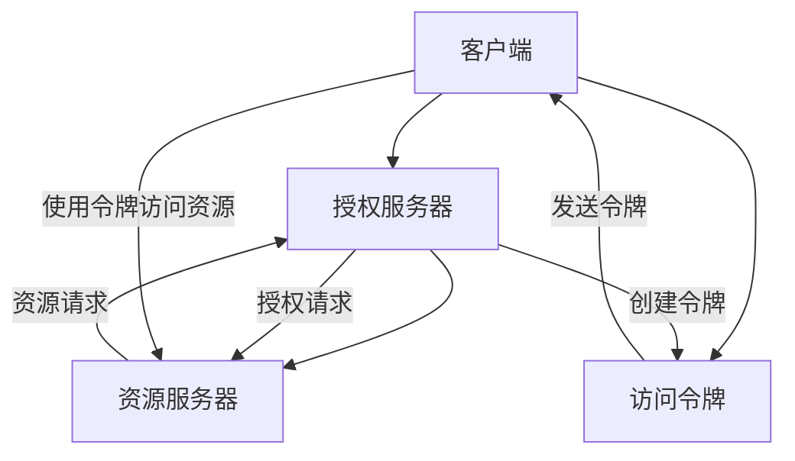

                 

# 使用 OAuth 2.0 进行安全访问

> 关键词：OAuth 2.0, 安全访问, 认证机制, 授权码模式, 密码模式, 客户端凭证模式, 免密码模式, 隐式授权模式, 协议规范, 安全最佳实践, 防御机制

## 1. 背景介绍

在数字世界中，安全性是所有系统的核心关注点。无论是个人数据、企业机密，还是公共信息，都需要妥善保护。传统的安全访问方式，如用户名和密码，虽然简单直接，但也存在诸多安全隐患，容易被盗取、暴力破解。为此，OAuth 2.0（Open Authorization）应运而生，通过分离认证与授权，极大提升了系统的安全性。

OAuth 2.0是一种开放标准，允许用户授权第三方应用程序访问其受保护的资源，而无需共享其密码。该协议为客户端提供了安全授权访问资源的方法，且使用简单，已广泛应用于各类系统。

## 2. 核心概念与联系

### 2.1 核心概念概述

为更好地理解OAuth 2.0的工作原理，本节将介绍几个关键概念：

- **OAuth 2.0**：OAuth 2.0是一种开放标准，允许用户授权第三方应用程序访问其受保护的资源，而无需共享其密码。该协议为客户端提供了安全授权访问资源的方法。
- **认证**：指验证用户身份的过程，确保请求者具有访问资源的权限。
- **授权**：指用户授权应用程序访问其资源的过程，确保应用程序有权访问资源。
- **访问令牌**：OAuth 2.0协议中的核心概念之一，是允许访问受保护资源的凭证。
- **客户端**：请求访问资源的第三方应用程序。
- **资源所有者**：拥有资源的用户。
- **授权服务器**：验证授权请求，向客户端颁发访问令牌。
- **资源服务器**：保存资源的用户和应用程序可以访问的资源。

这些概念之间通过OAuth 2.0的授权流程紧密联系，形成一个完整的安全访问系统。以下Mermaid流程图展示了OAuth 2.0的核心流程：



### 2.2 OAuth 2.0 授权流程

OAuth 2.0的授权流程主要分为以下步骤：

1. **认证**：用户向授权服务器提交登录请求，输入用户名和密码，授权服务器验证用户身份。
2. **授权**：用户同意应用程序访问其资源，授权服务器向应用程序颁发访问令牌。
3. **令牌交换**：应用程序使用访问令牌向资源服务器请求资源访问。
4. **资源访问**：资源服务器验证令牌，允许应用程序访问用户资源。

OAuth 2.0协议定义了多种授权模式，适用于不同的应用场景。以下是常见的授权模式：

- **授权码模式**：在第一步中，用户被重定向到授权服务器进行身份验证，并获得一个授权码。第二步中，应用程序使用该授权码向授权服务器换取访问令牌。
- **密码模式**：应用程序直接向授权服务器发送用户名和密码，授权服务器验证后颁发访问令牌。
- **客户端凭证模式**：应用程序向授权服务器提交客户端凭证，授权服务器颁发访问令牌。
- **免密码模式**：在第一步中，用户通过注册或配置信任关系，授权应用程序直接访问资源。
- **隐式授权模式**：在第一步中，用户被重定向到授权服务器进行身份验证，并获得访问令牌。

每种授权模式都有其适用场景和特点，开发者需根据具体需求选择合适的方式。

## 3. 核心算法原理 & 具体操作步骤
### 3.1 算法原理概述

OAuth 2.0的授权流程主要依赖于访问令牌（Access Token），用于验证客户端访问资源的合法性。其核心算法原理如下：

1. **认证**：用户通过用户名和密码向授权服务器提交登录请求，授权服务器验证用户身份，颁发一个认证令牌（Authentication Token）。
2. **授权**：用户同意应用程序访问其资源，授权服务器验证用户授权，颁发一个访问令牌（Access Token）。
3. **令牌交换**：应用程序使用访问令牌向资源服务器请求资源访问。
4. **资源访问**：资源服务器验证令牌，允许应用程序访问用户资源。

具体步骤包括：

1. **客户端向授权服务器发起授权请求**。
2. **授权服务器验证用户身份，颁发认证令牌（Auth Token）**。
3. **用户同意应用程序访问其资源，授权服务器颁发访问令牌（Access Token）**。
4. **应用程序使用访问令牌向资源服务器请求资源访问**。
5. **资源服务器验证令牌，允许应用程序访问用户资源**。

### 3.2 算法步骤详解

OAuth 2.0的授权流程涉及多个角色和步骤，以下详细介绍：

1. **客户端注册**：客户端向授权服务器注册，提供客户端信息、重定向URI等。
2. **用户授权**：用户向授权服务器提交登录请求，授权服务器验证用户身份，颁发认证令牌（Auth Token）。
3. **授权请求**：用户同意应用程序访问其资源，授权服务器颁发访问令牌（Access Token）。
4. **令牌交换**：应用程序使用访问令牌向资源服务器请求资源访问。
5. **资源访问**：资源服务器验证令牌，允许应用程序访问用户资源。

具体步骤如下：

1. **客户端向授权服务器注册**：
   ```
   POST /oauth/token HTTP/1.1
   Host: oauth.example.com
   Content-Type: application/x-www-form-urlencoded
   client_id=client_id_value&client_secret=client_secret_value&grant_type=client_credentials
   ```
   授权服务器验证后，颁发客户端凭证（Client Credentials）。

2. **用户登录**：
   ```
   GET /oauth/authorize HTTP/1.1
   Host: oauth.example.com
   Content-Type: application/x-www-form-urlencoded
   response_type=code&client_id=client_id_value&redirect_uri=redirect_uri_value
   ```
   授权服务器验证用户身份，颁发认证令牌（Auth Token）。

3. **用户授权**：
   ```
   GET /oauth/authorize HTTP/1.1
   Host: oauth.example.com
   Content-Type: application/x-www-form-urlencoded
   response_type=code&client_id=client_id_value&redirect_uri=redirect_uri_value
   ```
   用户同意应用程序访问其资源，授权服务器颁发访问令牌（Access Token）。

4. **令牌交换**：
   ```
   POST /oauth/token HTTP/1.1
   Host: oauth.example.com
   Content-Type: application/x-www-form-urlencoded
   grant_type=authorization_code&code=code_value&redirect_uri=redirect_uri_value
   ```
   授权服务器验证授权码，颁发访问令牌（Access Token）。

5. **资源访问**：
   ```
   GET /api/resource HTTP/1.1
   Host: resource.example.com
   Authorization: Bearer access_token
   ```
   资源服务器验证令牌，允许应用程序访问用户资源。

### 3.3 算法优缺点

OAuth 2.0具有以下优点：

1. **分离认证与授权**：OAuth 2.0将认证和授权分离，提高了系统的安全性。
2. **授权控制灵活**：OAuth 2.0提供了多种授权模式，适用于不同的应用场景。
3. **支持多种客户端**：OAuth 2.0支持多种类型的客户端，包括Web、移动和桌面应用程序。
4. **可扩展性强**：OAuth 2.0可以与其他安全协议和技术进行集成，如SAML、OpenID Connect等。

同时，OAuth 2.0也存在一些缺点：

1. **协议复杂**：OAuth 2.0协议较为复杂，理解和使用需要一定的时间。
2. **安全性依赖于客户端**：OAuth 2.0的安全性依赖于客户端，如果客户端被攻破，所有访问令牌都将失效。
3. **需要维护令牌**：OAuth 2.0需要维护访问令牌，增加了系统的复杂性。
4. **不支持匿名访问**：OAuth 2.0不支持匿名访问，需要用户授权。

### 3.4 算法应用领域

OAuth 2.0被广泛应用于各类系统，以下是常见的应用领域：

1. **社交媒体**：用户授权第三方应用程序访问其社交媒体数据。
2. **云存储**：用户授权第三方应用程序访问其云存储服务。
3. **在线购物**：用户授权第三方应用程序访问其在线购物数据。
4. **医疗健康**：用户授权第三方应用程序访问其健康数据。
5. **金融服务**：用户授权第三方应用程序访问其金融信息。

## 4. 数学模型和公式 & 详细讲解  
### 4.1 数学模型构建

OAuth 2.0的授权流程主要依赖于访问令牌（Access Token），用于验证客户端访问资源的合法性。其核心算法原理如下：

1. **认证**：用户通过用户名和密码向授权服务器提交登录请求，授权服务器验证用户身份，颁发一个认证令牌（Authentication Token）。
2. **授权**：用户同意应用程序访问其资源，授权服务器验证用户授权，颁发一个访问令牌（Access Token）。
3. **令牌交换**：应用程序使用访问令牌向资源服务器请求资源访问。
4. **资源访问**：资源服务器验证令牌，允许应用程序访问用户资源。

具体步骤包括：

1. **客户端向授权服务器发起授权请求**。
2. **授权服务器验证用户身份，颁发认证令牌（Auth Token）**。
3. **用户同意应用程序访问其资源，授权服务器颁发访问令牌（Access Token）**。
4. **应用程序使用访问令牌向资源服务器请求资源访问**。
5. **资源服务器验证令牌，允许应用程序访问用户资源**。

### 4.2 公式推导过程

以下推导OAuth 2.0授权流程的关键数学模型：

1. **认证**：用户通过用户名和密码向授权服务器提交登录请求，授权服务器验证用户身份，颁发一个认证令牌（Auth Token）。
   $$
   AuthToken = Authenticate(UserID, Password)
   $$

2. **授权**：用户同意应用程序访问其资源，授权服务器验证用户授权，颁发一个访问令牌（Access Token）。
   $$
   AccessToken = Authorize(AuthToken, ResourceServer, ClientID)
   $$

3. **令牌交换**：应用程序使用访问令牌向资源服务器请求资源访问。
   $$
   Resource = ExchangeToken(AccessToken, ResourceServer)
   $$

4. **资源访问**：资源服务器验证令牌，允许应用程序访问用户资源。
   $$
   ValidateToken(AccessToken)
   $$

### 4.3 案例分析与讲解

以下通过具体案例，分析OAuth 2.0的授权流程：

**案例1：授权码模式**

1. **客户端向授权服务器发起授权请求**：
   ```
   GET /oauth/authorize HTTP/1.1
   Host: oauth.example.com
   Content-Type: application/x-www-form-urlencoded
   response_type=code&client_id=client_id_value&redirect_uri=redirect_uri_value
   ```
   授权服务器验证用户身份，颁发认证令牌（Auth Token）。

2. **用户同意应用程序访问其资源，授权服务器颁发访问令牌（Access Token）**：
   ```
   GET /oauth/authorize HTTP/1.1
   Host: oauth.example.com
   Content-Type: application/x-www-form-urlencoded
   response_type=code&client_id=client_id_value&redirect_uri=redirect_uri_value
   ```
   用户同意应用程序访问其资源，授权服务器颁发访问令牌（Access Token）。

3. **应用程序使用访问令牌向资源服务器请求资源访问**：
   ```
   POST /oauth/token HTTP/1.1
   Host: oauth.example.com
   Content-Type: application/x-www-form-urlencoded
   grant_type=authorization_code&code=code_value&redirect_uri=redirect_uri_value
   ```
   授权服务器验证授权码，颁发访问令牌（Access Token）。

4. **资源服务器验证令牌，允许应用程序访问用户资源**：
   ```
   GET /api/resource HTTP/1.1
   Host: resource.example.com
   Authorization: Bearer access_token
   ```
   资源服务器验证令牌，允许应用程序访问用户资源。

## 5. 项目实践：代码实例和详细解释说明
### 5.1 开发环境搭建

在进行OAuth 2.0项目实践前，我们需要准备好开发环境。以下是使用Python进行OAuth 2.0开发的环境配置流程：

1. 安装Python：从官网下载并安装Python。
2. 安装OAuth 2.0库：安装OAuth 2.0的客户端库，如requests-oauthlib、python-oauth2等。
3. 安装其他工具包：安装其他必要的工具包，如Flask、Django等。

完成上述步骤后，即可在开发环境中进行OAuth 2.0项目实践。

### 5.2 源代码详细实现

以下通过Flask框架实现OAuth 2.0授权流程的Python代码实现。

```python
from flask import Flask, request, jsonify
from requests_oauthlib import OAuth2Session

app = Flask(__name__)

# OAuth 2.0配置
client_id = 'client_id_value'
client_secret = 'client_secret_value'
redirect_uri = 'redirect_uri_value'
authorization_base_url = 'https://oauth.example.com/authorize'
token_url = 'https://oauth.example.com/token'

# OAuth 2.0流程
def get_authorization_url():
    return '{}?response_type=code&client_id={}&redirect_uri={}'.format(authorization_base_url, client_id, redirect_uri)

def get_token(code):
    auth = OAuth2Session(client_id, redirect_uri=redirect_uri)
    token = auth.fetch_token(token_url, client_secret=client_secret, code=code, grant_type='authorization_code')
    return token

def get_resource(token):
    auth = OAuth2Session(client_id, token=token)
    resource = auth.get('https://resource.example.com/api/resource')
    return resource

@app.route('/oauth/authorize')
def authorize():
    authorization_url = get_authorization_url()
    return jsonify(authorization_url)

@app.route('/oauth/token')
def token():
    code = request.args.get('code')
    token = get_token(code)
    return jsonify(token)

@app.route('/api/resource')
def resource():
    token = request.headers.get('Authorization').split()[1]
    resource = get_resource(token)
    return jsonify(resource)

if __name__ == '__main__':
    app.run(debug=True)
```

### 5.3 代码解读与分析

让我们再详细解读一下关键代码的实现细节：

**Flask应用程序**：
- `Flask`框架用于搭建Web应用程序，简化HTTP请求的处理。
- `@app.route`装饰器用于定义路由规则，指定URL和处理函数。

**OAuth 2.0流程**：
- `get_authorization_url`函数：根据OAuth 2.0配置生成授权请求URL。
- `get_token`函数：使用授权码交换访问令牌。
- `get_resource`函数：使用访问令牌获取资源服务器上的资源。

**路由处理**：
- `/oauth/authorize`路由：返回授权请求URL。
- `/oauth/token`路由：接收授权码，获取访问令牌。
- `/api/resource`路由：接收访问令牌，获取资源服务器上的资源。

通过上述代码实现，可以完整地处理OAuth 2.0授权流程，实现安全的访问控制。

## 6. 实际应用场景
### 6.1 社交媒体平台

社交媒体平台广泛使用OAuth 2.0授权流程，允许用户授权第三方应用程序访问其社交媒体数据。用户可以通过授权应用程序，查看、分享、评论其动态，甚至进行隐私管理。

在技术实现上，社交媒体平台通过OAuth 2.0协议，对用户的登录、授权请求进行管理，确保数据安全。用户可以在第三方应用程序中授权访问其数据，第三方应用程序通过OAuth 2.0协议，向资源服务器请求访问用户资源，从而实现数据共享。

### 6.2 云存储服务

云存储服务如Dropbox、Google Drive等，也广泛采用OAuth 2.0授权流程，允许用户授权第三方应用程序访问其云存储资源。用户可以在第三方应用程序中授权访问其文件、文件夹等，从而实现数据备份、共享等功能。

云存储服务通过OAuth 2.0协议，对用户的登录、授权请求进行管理，确保数据安全。用户可以在第三方应用程序中授权访问其云存储资源，第三方应用程序通过OAuth 2.0协议，向资源服务器请求访问用户资源，从而实现数据共享。

### 6.3 在线购物平台

在线购物平台如Amazon、淘宝等，也广泛采用OAuth 2.0授权流程，允许用户授权第三方应用程序访问其购物数据。用户可以在第三方应用程序中授权查看、购买其商品，甚至进行商品评价等。

在线购物平台通过OAuth 2.0协议，对用户的登录、授权请求进行管理，确保数据安全。用户可以在第三方应用程序中授权访问其购物数据，第三方应用程序通过OAuth 2.0协议，向资源服务器请求访问用户资源，从而实现数据共享。

## 7. 工具和资源推荐
### 7.1 学习资源推荐

为了帮助开发者系统掌握OAuth 2.0的理论基础和实践技巧，这里推荐一些优质的学习资源：

1. OAuth 2.0官方文档：OAuth 2.0的详细技术规范和实现指南，是学习OAuth 2.0的核心资源。
2. OAuth 2.0协议规范：RFC 6749和RFC 6750是OAuth 2.0的官方规范，是理解OAuth 2.0协议的权威参考。
3. OAuth 2.0教程：各类在线教程和培训课程，帮助开发者快速上手OAuth 2.0的实现。
4. OAuth 2.0实战项目：GitHub上的开源项目和代码示例，提供实践经验。
5. OAuth 2.0社区：如Stack Overflow、Reddit等社区，提供问题解答和经验分享。

通过对这些资源的学习实践，相信你一定能够快速掌握OAuth 2.0的精髓，并用于解决实际的访问控制问题。

### 7.2 开发工具推荐

高效的开发离不开优秀的工具支持。以下是几款用于OAuth 2.0开发的常用工具：

1. Flask：轻量级的Web框架，用于搭建OAuth 2.0服务器，易于上手。
2. Django：Python的Web框架，提供OAuth 2.0的内置支持，适合大型项目。
3. Requests：Python的HTTP客户端库，用于发起OAuth 2.0请求。
4. Requests OAuthlib：Python的OAuth 2.0客户端库，方便实现OAuth 2.0流程。
5. OAuth 2.0测试工具：如OAuth Playground，用于测试OAuth 2.0流程。

合理利用这些工具，可以显著提升OAuth 2.0的开发效率，加快创新迭代的步伐。

### 7.3 相关论文推荐

OAuth 2.0作为一项开放标准，得到了广泛的研究和应用。以下是几篇奠基性的相关论文，推荐阅读：

1. OAuth 2.0框架规范：OAuth 2.0的官方规范，详细介绍了OAuth 2.0的各个组件和流程。
2. OAuth 2.0安全性研究：探讨OAuth 2.0的安全性和防御机制，提供安全建议。
3. OAuth 2.0性能优化：研究OAuth 2.0的性能瓶颈和优化方法，提高系统效率。
4. OAuth 2.0跨域访问控制：探讨OAuth 2.0的跨域访问控制机制，确保数据安全。

这些论文代表了大语言模型微调技术的发展脉络。通过学习这些前沿成果，可以帮助研究者把握学科前进方向，激发更多的创新灵感。

## 8. 总结：未来发展趋势与挑战

### 8.1 总结

本文对OAuth 2.0的授权流程进行了全面系统的介绍。首先阐述了OAuth 2.0的背景和重要性，明确了授权流程在数字安全中的核心作用。其次，从原理到实践，详细讲解了OAuth 2.0的数学模型和核心步骤，给出了OAuth 2.0流程的完整代码实例。同时，本文还广泛探讨了OAuth 2.0在社交媒体、云存储、在线购物等实际场景中的应用，展示了OAuth 2.0的广泛价值。最后，本文精选了OAuth 2.0的学习资源和开发工具，力求为开发者提供全方位的技术指引。

通过本文的系统梳理，可以看到，OAuth 2.0协议在数字安全的各个领域中都具有重要应用，极大地提升了系统的安全性。未来，随着OAuth 2.0的不断演进，其在访问控制和数据共享中的应用将更加广泛，为数字世界提供更强大的安全保障。

### 8.2 未来发展趋势

展望未来，OAuth 2.0协议将呈现以下几个发展趋势：

1. **协议升级**：OAuth 2.0协议将不断升级，引入新的安全机制、授权模式和功能，以应对新的安全威胁和应用需求。
2. **跨协议集成**：OAuth 2.0将与其他开放标准如OpenID Connect、SAML等进行更紧密的集成，形成更强大的身份和授权生态系统。
3. **移动端支持**：OAuth 2.0将更好地支持移动端应用，提供更便捷的授权流程和体验。
4. **分布式环境支持**：OAuth 2.0将更好地支持分布式环境下的授权流程，提高系统的可扩展性和容错性。
5. **安全性和隐私保护**：OAuth 2.0将引入更多的安全机制和隐私保护措施，确保用户数据的安全性。

以上趋势凸显了OAuth 2.0协议的广阔前景。这些方向的探索发展，将使OAuth 2.0在数字安全中发挥更大的作用，保障用户和系统的安全。

### 8.3 面临的挑战

尽管OAuth 2.0协议已经取得了显著成就，但在迈向更加智能化、普适化应用的过程中，它仍面临诸多挑战：

1. **协议复杂性**：OAuth 2.0协议较为复杂，需要开发者理解其各个组件和流程。
2. **安全性和隐私保护**：OAuth 2.0的安全性和隐私保护机制需要不断完善，防止数据泄露和滥用。
3. **跨平台支持**：OAuth 2.0需要支持多种平台和设备，提供一致的用户体验。
4. **标准化问题**：OAuth 2.0需要不断标准化，避免不同厂商实现不一致导致的兼容性问题。

解决这些挑战，需要学术界、产业界和开源社区的共同努力，推动OAuth 2.0协议的持续改进和完善。

### 8.4 研究展望

面对OAuth 2.0面临的这些挑战，未来的研究需要在以下几个方面寻求新的突破：

1. **协议简化**：简化OAuth 2.0协议，降低开发难度，提高协议的可理解性和可实现性。
2. **安全性提升**：引入更多的安全机制和隐私保护措施，确保用户数据的安全性。
3. **跨平台支持**：实现OAuth 2.0在多种平台和设备上的无缝集成，提供一致的用户体验。
4. **标准化推进**：推动OAuth 2.0的标准化工作，避免不同厂商实现不一致导致的兼容性问题。

这些研究方向的探索，将使OAuth 2.0在数字安全中发挥更大的作用，保障用户和系统的安全。面向未来，OAuth 2.0协议还需要与其他开放标准进行更深入的集成和融合，形成更强大的身份和授权生态系统。只有勇于创新、敢于突破，才能不断拓展OAuth 2.0的边界，推动数字安全技术的发展。

## 9. 附录：常见问题与解答

**Q1：OAuth 2.0如何保证安全性？**

A: OAuth 2.0通过多种机制保证安全性，包括：

1. **令牌加密**：OAuth 2.0的令牌通过加密机制保护，防止中间人攻击。
2. **客户端验证**：OAuth 2.0要求客户端提供客户端凭证，验证其身份。
3. **授权服务器验证**：OAuth 2.0要求授权服务器验证用户授权，防止未经授权的访问。
4. **访问令牌有效期**：OAuth 2.0的令牌有效期有限，防止长时间不使用导致令牌失效。

**Q2：OAuth 2.0适用于所有应用场景吗？**

A: OAuth 2.0适用于大多数应用场景，但并不适用于所有场景。对于需要快速、无授权访问的应用，OAuth 2.0可能不是最佳选择。对于需要深度集成的应用，OAuth 2.0可能需要进行定制化实现。

**Q3：OAuth 2.0是否可以支持匿名访问？**

A: OAuth 2.0不支持匿名访问，需要用户授权才能访问资源。如果需要匿名访问，可以使用其他身份认证协议，如OAuth 1.0或OpenID Connect。

**Q4：OAuth 2.0的授权流程有哪些模式？**

A: OAuth 2.0提供了多种授权模式，包括授权码模式、密码模式、客户端凭证模式、免密码模式、隐式授权模式等。开发者应根据具体应用场景选择合适的授权模式。

**Q5：OAuth 2.0的访问令牌如何使用？**

A: OAuth 2.0的访问令牌用于验证客户端访问资源的合法性。客户端需要在每次请求资源时，将令牌作为请求头或查询参数，资源服务器通过验证令牌，判断客户端是否有权访问资源。

---

作者：禅与计算机程序设计艺术 / Zen and the Art of Computer Programming

